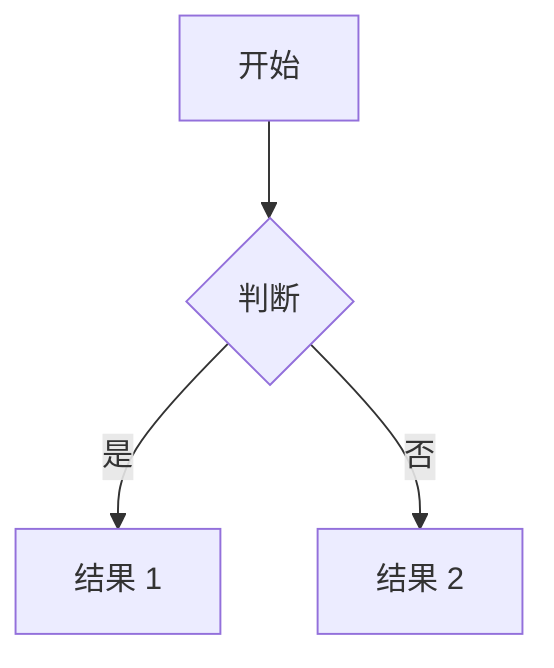

# README 技术博客生成器 (README Tech Blog Generator)

## 指令说明 (Instructions)

当用户要求总结一个文件夹（包含源码或论文）并生成 `README.md` 文件时，请遵循以下步骤：

1. **分析目标文件夹**:
   - 使用工具（如 Read）阅读目标文件夹中的源码文件、PDF 论文或其他相关文档。
   - 深入理解其核心概念、系统架构、主要功能和工作流。

2. **撰写技术博客风格的内容**:
   - 行文风格应引人入胜、信息丰富，结构上类似于高质量的技术博客文章。
   - 使用清晰的各级标题、项目符号列表以及简明扼要的解释。

3. **包含 Mermaid 图表**:
   - 至少创建一张 Mermaid 图表（如流程图、时序图或架构图），以可视化的方式解释核心逻辑、系统架构或论文的方法论。
   - 如果涉及模型架构，尽量使用torch API描述，更直观。
   - 将 Mermaid 代码块直接嵌入到 Markdown 文件中。

4. **生成 `README.md`**:
   - 将生成的内容写入目标文件夹（或被分析项目的根目录）下的 `README.md` 文件中。

## 博客文章结构模板 (Blog Post Structure Template)

请使用以下结构生成 `README.md`。

```markdown
# [项目/论文标题]

> **💡 核心总结 (TL;DR):** 
> [用一段引人入胜的话概括该文件夹包含的内容及其重要性。]

## 🌟 简介 (Introduction)
[吸引人的开头，介绍所解决的问题或论文的主要论点。]

## 📚 背景知识 (Background Knowledge)
[如果有必要，介绍理解该论文或项目所需的先验知识、相关工作或基础概念。]

## 🏗️ 架构与方法论 (Architecture / Methodology)
[深入剖析底层工作原理。]


*(在此插入相关的 Mermaid 图表，用于解释系统或概念)*

## 💻 核心功能与概念 (Key Features / Core Concepts)
- **功能/概念 1**: [详细解释]
- **功能/概念 2**: [详细解释]
- **功能/概念 3**: [详细解释]

<!-- 仅当包含论文时生成以下三个章节 -->
## 🔬 实验设置 (Experimental Setup)
[描述论文中的实验环境、数据集、基线模型和评估指标。]

## 📊 实验结果 (Experimental Results)
[总结论文的核心实验结果，可结合数据或图表结论说明其优势。]

## 📈 效果分析 (Effectiveness Analysis)
[深入分析为什么该方法有效，消融实验的结论，以及可能的局限性。]
<!-- 论文专属章节结束 -->

## 🔍 关键源码解读 (Key Source Code Walkthrough)
[引用最重要的源码片段并添加详细的中文注释。如果代码涉及到张量(Tensor)或矩阵计算，必须明确写出每一步张量计算的 `shape` 及其对应的物理或逻辑含义。如果文件夹中没有源码，可省略此章节。]

## 📝 总结 (Conclusion)
[最后的思考、启示与总结。]
```
