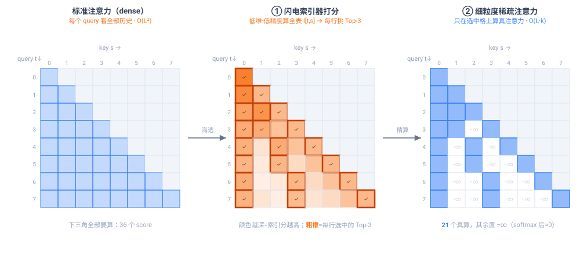
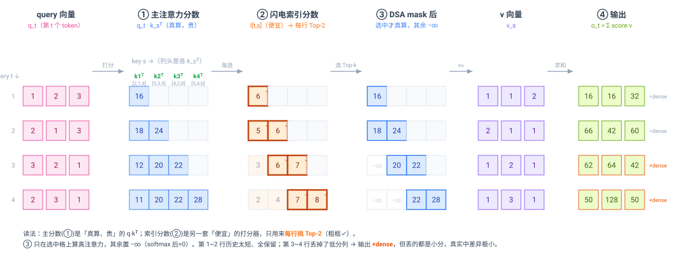
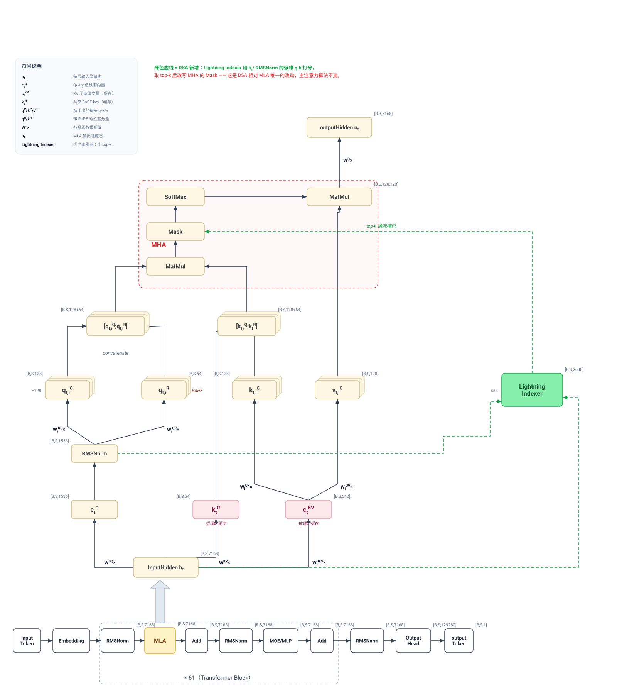
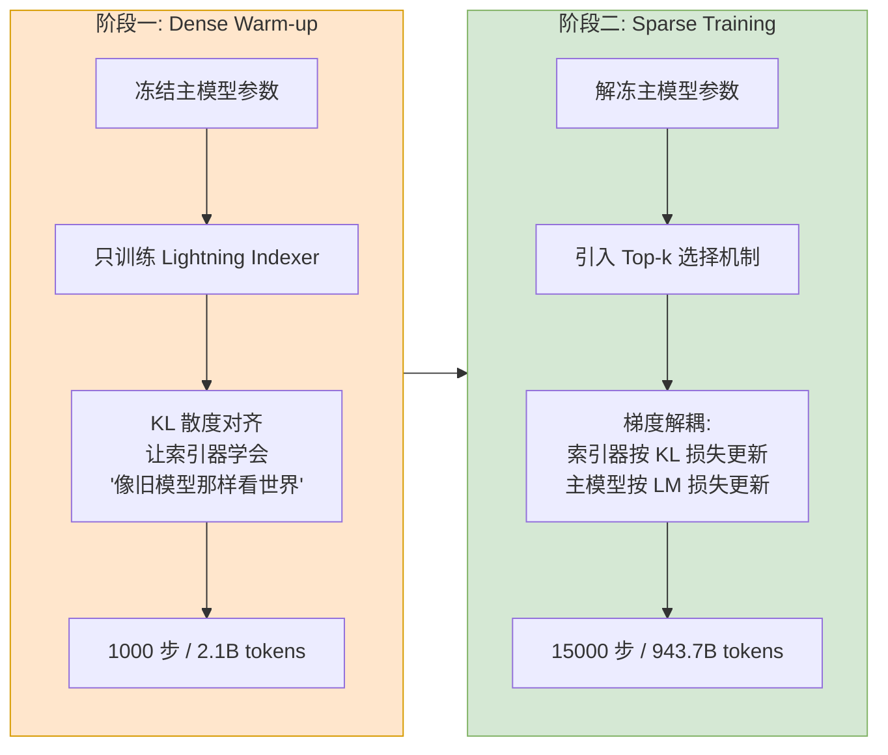
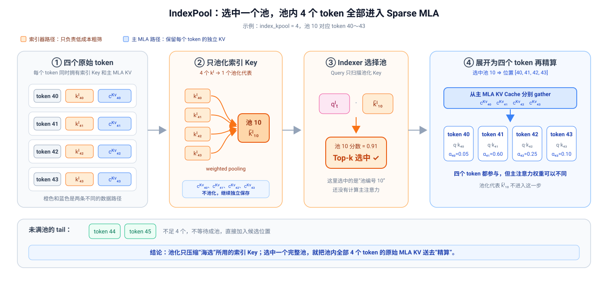
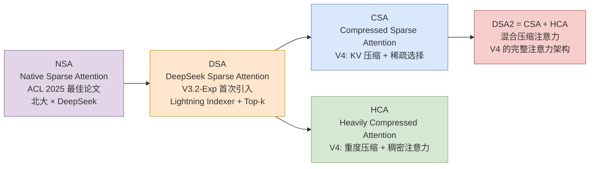

# DeepSeek Sparse Attention (DSA)：闪电索引与稀疏注意力

> **💡 核心总结 (TL;DR):**
> DSA（DeepSeek Sparse Attention）是 DeepSeek 自研的稀疏注意力机制，首次在 DeepSeek-V3.2-Exp 中引入。它通过 **闪电索引器（Lightning Indexer）** 完成“海选”，再用 **细粒度 Token 选择（Fine-grained Token Selection）** 仅对 Top-k 个关键 KV 条目执行主注意力计算，使昂贵的 Sparse MLA 从 O(L²) 降至 O(L×k)。不过，原始索引器仍需扫描全部历史位置：prefill 阶段是 O(L²)，单步 decode 是 O(L)。当上下文扩展到 1M token 时，这部分会成为新的瓶颈，后续的 IndexShare 与 IndexPool 分别从层维度和序列维度压缩索引器开销。

参考资料：
- [DeepSeek-V3.2 技术报告](./DeepSeek_V3_2.pdf)
- [NSA: Native Sparse Attention (ACL 2025 最佳论文)](https://arxiv.org/abs/2502.11089)
- [IndexCache: Accelerating Sparse Attention via Cross-Layer Index Reuse](https://arxiv.org/abs/2603.12201)
- [GLM-5.2：IndexShare 模型说明](https://huggingface.co/zai-org/GLM-5.2)
- [GLM-5.3-Flash：IndexPool 官方说明](https://z.ai/blog/glm-5.3-flash)
- [NVIDIA NeMo AutoModel：K-Pool Indexer 接口说明](https://docs.nvidia.com/nemo/automodel/v0.4/nemo-automodel/nemo_automodel/components/models/glm5_next/layers)

---

## 第一部分：为什么需要稀疏注意力？

### 1. 标准 Attention 的二次方困境

标准自注意力机制是 Transformer 的核心，但其计算和内存复杂度与序列长度 L 的平方 **O(L²)** 成正比。当上下文窗口从 8K 扩展到 128K 甚至 1M 时，这种二次方增长会导致：

- **计算量爆炸**：128K 序列的注意力计算量是 8K 的 256 倍
- **显存耗尽**：KV Cache 随序列长度线性增长，长序列下成为显存瓶颈
- **推理延迟过高**：每个新生成的 token 都需要与所有历史 token 计算注意力

更关键的是，这种低效不仅影响推理部署，还严重制约了后训练阶段（如强化学习）的计算扩展——你很难在超长序列上进行大规模 RL 训练。

### 2. 稀疏注意力的核心挑战

一个直观的想法是：既然不是所有 token 都同等重要，能否只对"重要"的 token 计算注意力？

但问题在于：**判断哪些 token 重要本身就需要进行某种形式的全局计算**。如果直接在主注意力的 score 上做 Top-k 筛选，O(L²) 的计算量已经完全花出去了，稀疏化带来的收益被前置计算抵消。

现有的稀疏注意力方案各有取舍：

| 方案 | 思路 | 优势 | 局限 |
|------|------|------|------|
| 滑动窗口注意力 | 只关注最近 W 个 token | 局部高效 | 丢失全局信息 |
| 块稀疏注意力 | 对 KV 分块，块级稀疏 | 减少计算量 | 粒度太粗，可能遗漏关键信息 |
| 可学习稀疏模式 | 学习哪些位置需要关注 | 灵活自适应 | 训练复杂，难以扩展 |
| 线性注意力 | 压缩 KV 为固定大小 | O(L) 复杂度 | 信息损失严重 |
| 低秩近似 | 用低秩矩阵近似注意力 | 理论优雅 | 实际效果受限 |

### 3. DSA 的核心思路：两级注意力架构

DSA 的解决思路是构建一个 **两级注意力架构**：

1. **第一级（海选）**：用一个极其轻量的网络来判断"哪些 token 值得关注"
2. **第二级（精算）**：只在被选中的少量 token 上执行昂贵的主注意力计算

关键洞察：**筛选网络不需要完美，只需要足够快且大致准确**。即使漏掉少量重要 token，主注意力的高精度计算也能弥补；而筛选网络的低开销确保了整体效率的提升。

### 4. 用一张矩阵图看懂稀疏化

在钻进公式和代码之前，先用一张图建立**直觉**。注意力的本质就是一张矩阵：**行是当前要算的 query（第 t 个 token），列是它能回头看的 key（第 s 个历史 token）**，每个格子是一次 query·key 打分。因果掩码让每个 query 只能看自己及更早的 token，所以有效格子构成一个**下三角**。下面这张图把 DSA 对这张矩阵做的三件事一字排开（示例设 8 个 token、每行只保留 Top-`k`=3）：

<div align="center">

</div>

**按流程读这三张矩阵：**

1. **标准注意力（左·蓝）**：下三角**每一个格子都要真算**一次 query·key 点积再 softmax。格子数随序列长度 L 成 `L²/2` 增长——这就是 O(L²) 的来源，也是长序列下算不动、存不下的根本原因。

2. **① 闪电索引器打分（中·橙，"海选"）**：索引器用**低维、低精度**的一套独立 Q/K，把**整张**下三角矩阵快速打一遍分 `I[t,s]`（颜色越深分越高）。注意它算的是**便宜的估分**，不是真注意力——目的只是判断"哪些列值得看"。打完分后**逐行**取分数最高的 `k` 个格子（打 ✓ 的粗框格），其余丢弃。图里能看出选中的规律：**第 0 列（注意力汇聚点 sink）几乎每行都留、对角线附近（最近的 token）也留**，再加零星几个中距离的"语义命中"。

3. **② 细粒度稀疏注意力（右·蓝，"精算"）**：**只在上一步选中的格子上**执行完整精度的真注意力，其余位置直接置 `−∞`（图中灰格），经 softmax 后权重≈0、等于没看。于是真正参与昂贵计算的格子从满下三角的 36 个降到 21 个；当序列拉长到 128K 时，每行被 `k`=2048 死死钉住，主注意力的复杂度从 O(L²) 变成 **O(L·k)**。

一句话串起来：**索引器把"该看谁"这个决定，从昂贵的主注意力里剥离出来，用一张廉价的打分矩阵替代**；主注意力只需照着 Top-k 的稀疏图案去算。后面第二部分的 `index_mask`、`topk_indices` 等张量，就是这张图里"粗框 → −∞ 灰格"这一步在代码里的形态。

#### 换成具体数字：DSA 到底改了哪一步？

上面的热力图给的是"规模感"，但稀疏化到底怎么落到每个数字上，还是得**用真数字手算一遍**。下面这张图沿用一个 4 token、维度 3 的最小例子（q、k、v 的数字与很多教程里画标准注意力时用的是同一组），把镜头拉近到**逐格算**：

<div align="center">

</div>

顺着五列读，就能看清 DSA 相对标准注意力**只动了 mask 这一步**：

1. **query 向量 `q_t`（粉）**：第 t 个 token 的查询向量，例如 `q_1=[1,2,3]`。
2. **① 主注意力分数 `q_t·k_sᵀ`（蓝）**：这是**真算、也是最贵**的一步。`q_1·k_1ᵀ = 1×2+2×1+3×4 = 16`，一路算出 `16, 24, 32…`。标准注意力里，下三角每一个蓝格**都要留着**送进 softmax。
3. **② 闪电索引分数 `I[t,s]`（橙）**：注意这是**另一套便宜的打分器**，数值和左边的主分数**没有关系**（它用低维、FP8 的独立 Q/K 现算），只干一件事——**每行挑出分数最高的 Top-`k`（这里 k=2，粗框 ✓ 的格子）**。第 3 行它选中 `s=2,3`、丢掉 `s=1`；第 4 行选中 `s=3,4`、丢掉 `s=1,2`。
4. **③ DSA mask 后（蓝/−∞）**：把上一步**没选中**的位置直接置 `−∞`。对比第 2 列可以看到：标准注意力这里是**满下三角**，DSA 则每行最多只留 `k` 个真格子。**主分数的算法一个字没改，改的只是"哪些格子活下来"。**
5. **④ 输出 `o_t`（黄绿）**：用活下来的分数对 `v` 加权求和。前两行历史太短（≤k）、和 dense 完全一样；**第 3、4 行因为丢了低分列，输出 `≠dense`**——但被丢掉的都是分数很小的格子，softmax 后本就接近 0，所以真实模型里这点差异极小，这正是"稀疏几乎不掉点"的直觉来源。

把这张具体数字图和上面的热力图合起来看：**热力图告诉你主注意力“省了多少”（O(L²)→O(L·k)），数字图告诉你“具体省在哪一格、代价是什么”。** 二者对应的就是第二部分代码里 `index_mask`（非 Top-k 置 `-inf`）加到注意力分数上这一行。索引器自身为什么仍可能成为瓶颈，将在第三部分继续讨论。

---

## 第二部分：DSA 核心架构详解

### 1. 整体架构

DSA 基于 DeepSeek 系列的 MLA（Multi-head Latent Attention）架构实现。下图是**论文风格的整体架构**：**底部**是完整的 Transformer 堆栈（`Embedding → [RMSNorm → MLA → Add → RMSNorm → MOE/MLP → Add] × 61 → Output Head`），**中部**把其中的 MLA 用数学记号展开（`h_t` 经三路降维 `c_t^Q / k_t^R / c_t^KV`，再解压出每头的 `q/k/v`），**顶部红框**是 MHA 核心（`MatMul → Mask → SoftMax → MatMul`），**右侧绿色**是 DSA 新增的 Lightning Indexer。**绿色虚线**清楚地画出了 DSA 的全部改动：索引器从 `h_t / RMSNorm` 取低维 q·k 打分，取 Top-k 后去**改写 Mask**——除此之外主注意力算法一个字没变。每个张量框都标了 `[B, S, ·]` 形状。

<div align="center">

</div>

> 上图是**论文视角**（数学记号、模块级）。如果想对到**代码里的每个张量**（`wq_a`、`wkv_a`、`indexer.wk`、`index_score`、`topk_indices`…），展开下面这份 mermaid 数据流图——它是同一套逻辑的**代码级细粒度版本**，也是第二部分源码解读的路线图。

<!--
Mermaid 必须在可见容器中完成首次布局。这里保留 details 以便读者收起长图，
但默认展开，避免部分 Markdown 预览器在隐藏状态下得到错误尺寸而裁切图形。
-->

```mermaid
graph TD
    X["输入 x&#160;&#160;[B, S, d=7168]"]

    X --> WQA["wq_a: Linear(d=7168 → Rq=1536)<br/>[B, S, Rq=1536]"]
    WQA --> QN["q_norm (RMSNorm)<br/>qr: [B, S, Rq=1536]"]
    QN --> WQB["wq_b: Linear(Rq=1536 → 128×192)<br/>[B, S, n_h=128, qk_d=192]"]
    WQB --> QS["split + RoPE<br/>q_nope[B,S,128,nope=128] / q_pe[B,S,128,rope=64]"]

    X --> WKVA["wkv_a: Linear(d=7168 → 512+64)<br/>[B, S, kv_r+rope=576]"]
    WKVA --> KVN["split + kv_norm<br/>kv[B,S,kv_r=512] / k_pe[B,S,rope=64]"]
    KVN --> KVC["kv_cache [B,T,kv_r=512]<br/>pe_cache [B,T,rope=64]"]
    KVC --> WKVB["wkv_b: Linear(kv_r=512 → 128×256)<br/>k,v: [B, T, n_h=128, nope+v_d=256]"]

    X --> IWK["indexer.wk: Linear(d=7168 → idx_d=128)<br/>+ k_norm → k_idx [B,S,idx_d=128]"]
    IWK --> KCI["k_cache_idx [B, T, idx_d=128]"]
    QN --> IWQB["indexer.wq_b: Linear(Rq=1536 → 64×128)<br/>q_idx [B,S,idx_h=64,idx_d=128]（复用 qr）"]
    X --> WP["weights_proj: Linear(d=7168 → idx_h=64)<br/>w_idx [B, S, idx_h=64]"]
    KCI --> ISC["einsum bshd,btd→bsht<br/>index_score [B,S,idx_h=64,T]"]
    IWQB --> ISC
    ISC --> RL["ReLU × w_idx, sum(heads)<br/>I: [B, S, T]"]
    WP --> RL
    RL --> TK["topk(k=2048)<br/>topk_indices [B,S,k=2048]"]
    TK --> IM["index_mask [B,S,T]<br/>非 Top-k 置 -inf"]

    QS --> SC["scores = q·kᵀ<br/>[B, S, n_h=128, T]"]
    WKVB --> SC
    SC --> ADD["scores += index_mask<br/>[B, S, n_h=128, T]"]
    IM --> ADD
    ADD --> SM["softmax<br/>[B, S, n_h=128, T]"]
    SM --> AV["× v<br/>[B, S, n_h=128, v_d=128]"]
    WKVB --> AV
    AV --> WO["wo: Linear(128×128 → d=7168)<br/>u_t: [B, S, d=7168]"]

    classDef mla fill:#dbeafe,stroke:#3b82f6,color:#1e3a8a,stroke-width:1.5px;
    classDef dsa fill:#ffedd5,stroke:#f97316,color:#7c2d12,stroke-width:1.5px;
    classDef inj fill:#fee2e2,stroke:#ef4444,color:#991b1b,stroke-width:2px;
    classDef inp fill:#f1f5f9,stroke:#94a3b8,color:#334155,stroke-width:1.5px;

    class X inp;
    class WQA,QN,WQB,QS,WKVA,KVN,KVC,WKVB,SC,SM,AV,WO mla;
    class IWK,KCI,IWQB,WP,ISC,RL,TK,IM dsa;
    class ADD inj;
```

<details open>
<summary>📄 DSA 代码级 Mermaid 数据流图（可收起）</summary>



</details>

#### 图中参数都代表什么？（零基础视角）

图里每个方框的第二行都是一个**张量的形状**，比如 `[B, S, 128, 192]`。可以把张量想象成一个**多维表格**，方括号里每个数字是表格的一根"轴"（有多长）。下面把所有符号拆开讲。

**① 数据规模：张量的四根基本轴**

| 符号 | 含义 | 直觉 |
|------|------|------|
| `B` | batch size，一次同时处理几条序列 | 你一次喂给模型几段文本 |
| `S` | 当前要计算的 query token 数 | **预填充**阶段=整段输入长度；**逐字生成**阶段=1（只算新吐的那个字） |
| `T` | 历史 KV 长度，已经见过的 token 数 | 模型要"回头看"的上下文有多长，`T ≥ S`。稀疏注意力省的就是它 |
| `d` | 模型隐藏维度（hidden size） | 每个 token 被表示成一个多长的向量（DeepSeek-V3 系列约 7168） |

**② 基础 MLA 的结构参数（蓝色框）**

MLA 的核心技巧是**低秩压缩**：先把高维向量压小再算，省显存、省 KV Cache。

| 符号 / 数字 | 含义 | 为什么是这样 |
|------|------|------|
| `Rq` = `q_lora_rank` ≈ 1536 | Query 先被压缩到的中间维度 | 不直接从 `d`(7168) 生成 Query，而是先压到 1536，省参数 |
| `kv_lora_rank` = 512 | KV 压缩后的"潜向量"长度 | **MLA 的灵魂**：KV Cache 里每个 token 只存这 512 维，而不是完整的 K、V |
| `qk_rope_head_dim` = 64 | 每个头里**带**旋转位置编码(RoPE)的那一小段 | RoPE 负责告诉模型 token 的先后顺序 |
| `qk_nope_head_dim` = 128 | 每个头里**不带**位置编码的那段 | 负责纯语义匹配 |
| `qk_head_dim` = 192 | 每个注意力头 Q/K 的总长度 = 128 + 64 | 两段拼起来（这叫"解耦 RoPE"） |
| `v_head_dim` = 128 | 每个头 Value 的长度 | |
| 主注意力头数 = 128 | 有 128 个"注意力头"并行看不同的关注模式 | `128×192`、`128×256`、`128×128` 里的 128 都是它 |

> 顺带解释几个派生数字：`wq_b` 输出 `128×192` = 头数 × 每头Q维；`wkv_a` 输出 `512+64` = 压缩KV(512) + 一份所有头共享的 RoPE key(64)；`wkv_b` 把 512 维解压成 `128×256`=128头×(K的128 + V的128)；`wo` 输入 `128×128` = 128头×每头V的128。

**③ DSA 新增的索引器参数（橙色框）**

索引器是个"轻量筛选网络"，参数被**故意做小**以求快：

| 符号 / 数字 | 含义 | 为什么 |
|------|------|------|
| 索引头数 = 64 | 索引器只有 64 个头 | 只有主注意力(128)的一半，够用就行，越少越快 |
| `index_head_dim` = 128 | 索引器每个头的维度（低维） | 只用来快速打分，不需要高精度 |
| `index_topk` = 2048（即 `k`） | 每个 query 最终只挑 2048 个历史 token 参与真正的注意力 | 不管 `T` 有多长（哪怕 128K），每个字只跟最相关的 2048 个算——这就是"稀疏" |

**④ 图里出现的中间张量（数据流上的临时结果）**

| 名字 | 是什么 |
|------|--------|
| `qr` | Query 的低秩表示（压缩版 Query）。索引器直接借用它，省一次投影 |
| `q_nope` / `q_pe` | Query 拆成 无位置编码 / 带 RoPE 两部分 |
| `kv` | 压缩后的 KV 潜向量(512维)，`kv_cache` 存的就是它 |
| `k_pe` | 一份带 RoPE 的 key（所有头共享，64维） |
| `k_idx` / `q_idx` | 索引器**专用**的 key / query，和主注意力完全分开、独立缓存 |
| `w_idx` | 每个索引头的重要性权重（由 `weights_proj` 产生） |
| `index_score` (`I`) | query 对每个历史 token 的"相关性打分" `[B,S,T]` |
| `topk_indices` | 每个 query 选出的 2048 个最相关 token 的**位置编号** |
| `index_mask` | 把没被选中的位置设成 `-inf` 的掩码；加到注意力分数上，经 softmax 后这些位置权重≈0，于是"只看被选中的 token" |

> **红色框 `scores += index_mask` 是 DSA 唯一改动基础 MLA 的地方**：索引器算出的稀疏结果，就通过这一步"注入"进原本的注意力。
>
> 上图是 **prefill（预填充）** 路径；**decode（逐字生成）** 时会对 `wkv_b` 做"权重吸收"优化，Query 直接和压缩的 `kv_cache` 点积（对应 §2.4 代码 `else` 分支），维度会略有不同，但含义一致。

### 2. 闪电索引器（Lightning Indexer）

闪电索引器是 DSA 的"大脑"，负责以极低开销为每个 Query Token 快速筛选出最相关的 Top-k 个历史 Token。

#### 2.1 网络结构：刻意极简

索引器的网络结构被刻意设计得极简，以降低计算开销：

- **少头设计**：索引头数量（ `index_n_heads=64` ）远少于主注意力头数（ `n_heads=128` ），直接减少并行计算冗余
- **低维投影**：将 Query 和 Key 投影到极低维度（ `index_head_dim=128` ），使相似度计算异常高效
- **单 Key 共享**：在下面 2.2 的索引分数公式里，$q_{t,j}^I$ 带头下标 $j$、而 $k_s^I$ **不带**——每个历史 token 只有**一个** Key 向量，被全部 64 个索引头共享，进一步省掉了多头 Key 的投影与缓存
- **FP8/FP4 精度**：索引器的所有计算均可使用低精度实现，在保证索引分数准确性的前提下大幅降低计算和存储开销

> **一句话抓住索引器**：它的 Q/K 计算和 MLA 几乎一样，就是个**“微缩版 MLA”**——头数 64（vs MLA 的 128）、每头维度 128（vs MLA 的 576），算量大约只有 MLA 对应部分的 **1/9**。在 V3.2 的 128K 上下文中，这个较小的常数让索引开销可以接受；但它没有消除对全部历史位置的扫描，prefill 仍是 O(L²)。当上下文继续增长到 1M token，主注意力被 `k` 限制住，而索引器的扫描量仍随 `L` 增长，于是瓶颈会逐渐转移到“海选”阶段。

#### 2.2 从索引分数到训练分布和整数索引

对于每个 Query Token $h_t$ 和历史 Token $h_s$，索引器计算索引分数：

$$I_{t,s} = \sum_{j=1}^{H^I} w_{t,j}^I \cdot \text{ReLU}(q_{t,j}^I \cdot k_s^I)$$

其中：
- $q_{t,j}^I$：Query Token $t$ 在索引头 $j$ 上的低维投影向量
- $k_s^I$：历史 Token $s$ 的低维投影键向量
- $w_{t,j}^I$：可学习的头权重，由 `weights_proj` 生成，控制每个索引头的重要性
- $H^I$：索引头数量

虽然模块名叫 Indexer，但上式首先得到的并不是整数 index，而是 query $t$ 对每个历史位置 $s$ 的**连续相关性分数**。同一份分数 $\mathbf I_t$ 随后分成两条用途：

| 对象 | 计算方式 | 含义与用途 |
| --- | --- | --- |
| 索引分数 $\mathbf I_t$ | Indexer 对所有合法历史位置打分 | 连续实数向量，是后续两条分支的共同输入 |
| 学生分布 $\mathbf q_t$ | $\operatorname{Softmax}(\mathbf I_t)$ | 训练时用于和主注意力教师分布计算 KL，不是最终索引 |
| 整数索引 $\mathcal S_t$ | $\operatorname{TopK}(\mathbf I_t,k)$ | 真正的 token 位置编号，决定 Sparse MLA 读取哪些 KV |

因此，训练时比较的是两个概率分布，执行稀疏注意力时使用的才是整数位置：

$$
\mathbf q_t=\operatorname{Softmax}(\mathbf I_t),\qquad
\mathcal S_t=\operatorname{TopK}(\mathbf I_t,k)
$$

推理不需要蒸馏损失，可以跳过第一条分支，只对 $\mathbf I_t$ 做 Top-k 并保留 $\mathcal S_t$。

**为什么选择 ReLU 而不是 Softmax？**

这里的 ReLU 是作用在每个索引头的 $q^I\cdot k^I$ 上、用于构造索引分数；上面的 Softmax 则只在训练时沿历史位置归一化 $\mathbf I_t$、用于计算 KL。两者处在不同步骤，并不冲突。选择 ReLU 构造分数是一个工程导向的决策：
- ReLU 只需一次简单的阈值操作，计算成本低
- ReLU 不需要全局归一化，天然适合并行化和低精度实现
- ReLU 对 FP8 量化友好，而 Softmax 的指数运算在低精度下容易溢出

#### 2.3 源码解读：Indexer（闪电索引器）

以下代码基于公开的**推理实现**，移除了量化相关逻辑，仅保留核心模型结构。推理不计算 KL，所以 `forward()` 最终只返回 `topk_indices`；训练实现还需要保留 Top-k 之前的 `index_score`，用它构造学生分布：

```python
class Indexer(torch.nn.Module):
    def __init__(self, args: ModelArgs):
        super().__init__()
        self.n_heads = args.index_n_heads          # 索引头数: 64
        self.head_dim = args.index_head_dim         # 索引头维度: 128
        self.rope_head_dim = args.qk_rope_head_dim  # RoPE 维度: 64
        self.index_topk = args.index_topk           # Top-k 值: 2048
        self.q_lora_rank = args.q_lora_rank         # Query 低秩维度

        # 索引查询投影: 复用 MLA 的低秩 Query 表示 qr
        self.wq_b = Linear(self.q_lora_rank, self.n_heads * self.head_dim)
        # 索引键投影: 独立于主 KV Cache 的低维键
        self.wk = Linear(self.dim, self.head_dim)
        self.k_norm = LayerNorm(self.head_dim)
        # 头权重: 控制每个索引头的重要性
        self.weights_proj = Linear(self.dim, self.n_heads)
        self.softmax_scale = self.head_dim ** -0.5

        # 索引键缓存 (独立于主 KV Cache)
        self.register_buffer("k_cache", torch.zeros(
            args.max_batch_size, args.max_seq_len, self.head_dim), persistent=False)

    def forward(self, x, qr, start_pos, freqs_cis, mask):
        bsz, seqlen, _ = x.size()
        end_pos = start_pos + seqlen

        # 1. 生成索引查询: 从低秩 Query 表示投影到索引头空间
        q = self.wq_b(qr)                                    # [B, S, n_heads * head_dim]
        q = q.view(bsz, seqlen, self.n_heads, self.head_dim)
        q_pe, q_nope = torch.split(q, [self.rope_head_dim, self.head_dim - self.rope_head_dim], dim=-1)
        q_pe = apply_rotary_emb(q_pe, freqs_cis, False)
        q = torch.cat([q_pe, q_nope], dim=-1)

        # 2. 生成索引键: 独立于主 KV Cache 的低维键投影
        k = self.wk(x)                                       # [B, S, head_dim]
        k = self.k_norm(k)
        k_pe, k_nope = torch.split(k, [self.rope_head_dim, self.head_dim - self.rope_head_dim], dim=-1)
        k_pe = apply_rotary_emb(k_pe.unsqueeze(2), freqs_cis, False).squeeze(2)
        k = torch.cat([k_pe, k_nope], dim=-1)

        # 3. 缓存索引键
        self.k_cache[:bsz, start_pos:end_pos] = k

        # 4. 计算头权重
        weights = self.weights_proj(x) * self.n_heads ** -0.5

        # 5. 计算索引分数: 多头点积 + ReLU + 加权求和
        index_score = torch.einsum("bshd,btd->bsht", q, self.k_cache[:bsz, :end_pos])
        index_score = (index_score.relu_() * weights.unsqueeze(-1)).sum(dim=2)

        # 6. Top-k 选择；推理只需整数位置，训练还会保留 index_score 计算 KL
        topk_indices = index_score.topk(min(self.index_topk, end_pos), dim=-1)[1]
        return topk_indices
```

**张量 Shape 追踪（索引分数计算）：**

```
q (索引查询): [B, S, n_heads, head_dim]           # [B, S, 64, 128]
k_cache (索引KV): [B, T, head_dim]                 # [B, T, 128]
  ↓ einsum("bshd,btd->bsht")
index_score: [B, S, n_heads, T]                    # [B, S, 64, T]
  ↓ ReLU × weights + sum(dim=2)
index_score: [B, S, T]                             # [B, S, T]
  ↓ topk(k=index_topk)
topk_indices: [B, S, index_topk]                   # [B, S, 2048]
```

#### 2.4 源码解读：MLA（多头像潜在注意力）与 Indexer 的协同

以下代码展示 Indexer 在 MLA 中的位置，移除了量化相关逻辑，仅保留核心模型结构。标注 ★ 的步骤为 DSA 新增的关键逻辑：

```python
class MLA(nn.Module):
    def __init__(self, args: ModelArgs):
        super().__init__()
        self.dim = args.dim
        self.n_heads = args.n_heads
        self.q_lora_rank = args.q_lora_rank
        self.kv_lora_rank = args.kv_lora_rank
        self.qk_nope_head_dim = args.qk_nope_head_dim
        self.qk_rope_head_dim = args.qk_rope_head_dim
        self.qk_head_dim = args.qk_nope_head_dim + args.qk_rope_head_dim
        self.v_head_dim = args.v_head_dim

        # Query 投影: 两级低秩压缩
        self.wq_a = Linear(self.dim, self.q_lora_rank)
        self.q_norm = RMSNorm(self.q_lora_rank)
        self.wq_b = ColumnParallelLinear(self.q_lora_rank, self.n_heads * self.qk_head_dim)

        # KV 投影: 低秩压缩 + RoPE 解耦
        self.wkv_a = Linear(self.dim, self.kv_lora_rank + self.qk_rope_head_dim)
        self.kv_norm = RMSNorm(self.kv_lora_rank)
        self.wkv_b = ColumnParallelLinear(self.kv_lora_rank, self.n_heads * (self.qk_nope_head_dim + self.v_head_dim))

        # 输出投影
        self.wo = RowParallelLinear(self.n_heads * self.v_head_dim, self.dim)
        self.softmax_scale = self.qk_head_dim ** -0.5

        # ★ 闪电索引器: DSA 的核心组件
        self.indexer = Indexer(args)

        # KV Cache
        self.register_buffer("kv_cache", torch.zeros(
            args.max_batch_size, args.max_seq_len, self.kv_lora_rank), persistent=False)
        self.register_buffer("pe_cache", torch.zeros(
            args.max_batch_size, args.max_seq_len, self.qk_rope_head_dim), persistent=False)

    def forward(self, x, start_pos, freqs_cis, mask):
        bsz, seqlen, _ = x.size()
        end_pos = start_pos + seqlen

        # 1. Query 投影
        qr = self.q_norm(self.wq_a(x))
        q = self.wq_b(qr)
        q = q.view(bsz, seqlen, self.n_local_heads, self.qk_head_dim)
        q_nope, q_pe = torch.split(q, [self.qk_nope_head_dim, self.qk_rope_head_dim], dim=-1)
        q_pe = apply_rotary_emb(q_pe, freqs_cis)

        # 2. KV 投影 + 缓存
        kv = self.wkv_a(x)
        kv, k_pe = torch.split(kv, [self.kv_lora_rank, self.qk_rope_head_dim], dim=-1)
        kv = self.kv_norm(kv)
        k_pe = apply_rotary_emb(k_pe.unsqueeze(2), freqs_cis)
        self.kv_cache[:bsz, start_pos:end_pos] = kv
        self.pe_cache[:bsz, start_pos:end_pos] = k_pe.squeeze(2)

        # ★ 3. 闪电索引器: 筛选 Top-k 关键 Token
        topk_indices = self.indexer(x, qr, start_pos, freqs_cis, mask)

        if mask is not None:    # MHA prefill
            q = torch.cat([q_nope, q_pe], dim=-1)
            kv = self.wkv_b(kv)
            kv = kv.view(bsz, seqlen, self.n_local_heads, self.qk_nope_head_dim + self.v_head_dim)
            k_nope, v = torch.split(kv, [self.qk_nope_head_dim, self.v_head_dim], dim=-1)
            k = torch.cat([k_nope, k_pe.expand(-1, -1, self.n_local_heads, -1)], dim=-1)

            # 4. 计算注意力分数
            scores = torch.einsum("bshd,bthd->bsht", q, k).mul_(self.softmax_scale)

            # ★ 5. 稀疏掩码: 仅保留 Top-k 位置的注意力
            index_mask = torch.full((bsz, seqlen, seqlen), float("-inf"), device=x.device)
            index_mask.scatter_(-1, topk_indices, 0)
            index_mask += mask
            scores += index_mask.unsqueeze(2)

            scores = scores.softmax(dim=-1)
            x = torch.einsum("bsht,bthd->bshd", scores, v)

        else:                   # MQA decode
            # 吸收 wkv_b 到 Query: q_nope @ wkv_b → 直接与 kv_cache 点积
            wkv_b = self.wkv_b.weight.view(self.n_local_heads, -1, self.kv_lora_rank)
            q_nope = torch.einsum("bshd,hdc->bshc", q_nope, wkv_b[:, :self.qk_nope_head_dim])
            scores = (torch.einsum("bshc,btc->bsht", q_nope, self.kv_cache[:bsz, :end_pos]) +
                      torch.einsum("bshr,btr->bsht", q_pe, self.pe_cache[:bsz, :end_pos])) * self.softmax_scale

            # ★ 5. 稀疏掩码: 仅保留 Top-k 位置的注意力
            index_mask = torch.full((bsz, 1, end_pos), float("-inf"), device=x.device)
            index_mask.scatter_(-1, topk_indices, 0)
            scores += index_mask.unsqueeze(2)

            scores = scores.softmax(dim=-1)
            x = torch.einsum("bsht,btc->bshc", scores, self.kv_cache[:bsz, :end_pos])
            x = torch.einsum("bshc,hdc->bshd", x, wkv_b[:, -self.v_head_dim:])

        x = self.wo(x.flatten(2))
        return x
```

**MLA 中 Indexer 的协同流程（带模块与 shape）：**

```
输入 x [B,S,d]
  │
  ├─ wq_a:Linear(d,Rq) → q_norm → qr [B,S,Rq]
  │        ├─ wq_b:Linear(Rq,128×192) ─→ q_nope[B,S,128,128] / q_pe[B,S,128,64]   （主注意力 Query）
  │        └─ indexer.wq_b:Linear(Rq,64×128) ─→ q^I [B,S,64,128]                  （索引查询，复用 qr）
  │
  ├─ wkv_a:Linear(d,512+64) → 拆分/kv_norm ─→ kv_cache[B,T,512] + pe_cache[B,T,64]  （主 KV Cache）
  │
  └─ indexer.wk:Linear(d,128) → k_norm ─→ k_cache^I [B,T,128]                       （索引 KV Cache，独立）

索引器:  q^I[B,S,64,128] · k_cache^I[B,T,128]
         → einsum bshd,btd→bsht [B,S,64,T] → ReLU × w^I → sum(heads) → I[B,S,T]
         → topk(2048) → topk_indices [B,S,2048]
                              │
                              ▼
主注意力: scores = q·kᵀ [B,S,128,T]
         + index_mask[B,S,T]（非 Top-k 置 -inf）
         → softmax → ×v [B,S,128,128]
         → wo:Linear(128×128,d) → u_t [B,S,d]
```

**关键设计要点：**

- **Indexer 复用 MLA 的 `qr`**：索引查询直接从 MLA 的低秩 Query 表示 `qr` 投影而来，无需重复计算 `wq_a` + `q_norm`，节省了索引器的参数量和计算量
- **Indexer 拥有独立的 KV 缓存**：索引键通过 `self.wk` + `self.k_norm` 独立投影并缓存，与主 KV Cache 完全解耦，避免了对主注意力计算的干扰
- **稀疏掩码机制**：Indexer 返回的 `topk_indices` 被转换为掩码（非 Top-k 位置设为 `-inf`），直接加到注意力分数上，经过 softmax 后这些位置的权重趋近于零，实现了稀疏注意力

### 3. 细粒度稀疏注意力（Fine-grained Sparse Attention）

基于索引器输出的分数，Token 选择机制仅保留 Top-k 索引分数对应的 KV 条目，再通过 MLA 注意力机制计算最终输出：

$$u_t = \text{Attention}(q_t, \{c_s : s \in \text{Top-k}(I_{t,\cdot})\})$$

**复杂度降低**：核心注意力的计算复杂度从 O(L²) 降至 O(L×k)，其中 k 远小于 L。在 V3.2 的训练中，k=2048；在 V4 中，CSA 层 k=512/1024。即使处理 128K 长度的文本，每个 Query Token 也只需与 2048 个最相似的 Token 计算注意力。

### 4. 与 MLA 架构的协同设计

DSA 直接基于 MLA 的 **MQA（Multi-Query Attention）模式** 实现，而非 MHA 模式。这一设计决策的关键优势：

- **计算共享**：每个潜在向量在所有查询头之间共享，使稀疏选择后的 KV 条目可以被多个头复用
- **内存效率**：MQA 模式下 KV Cache 显著减小，与稀疏选择进一步叠加降低访存
- **硬件友好**：在 kernel 级别，每个 KV Entry 必须能被多个 Query 重复利用，MQA 的结构天然符合这种访存模式
- **训练稳定性**：支持从已有检查点的平滑继续训练

### 5. 两阶段继续预训练策略

V3.2 并非从零开始训练，而是在 V3.1-Terminus 的 128K 上下文检查点基础上继续训练。如何让已适应密集注意力的模型平滑过渡到稀疏模式？



**阶段一：Dense Warm-up**

冻结主模型参数，只训练索引器。对于每个 Query Token，计算原始多头注意力在所有历史 Token 上的教师分布 $P_{\text{attn}}$；Indexer 则先输出连续分数 $\mathbf I_t$，再用 $P_{\text{indexer}}=\operatorname{Softmax}(\mathbf I_t)$ 得到学生分布：

$$\mathcal{L}_{\text{indexer}} = D_{\text{KL}}(P_{\text{attn}} \| P_{\text{indexer}})$$

KL 比较的是两份概率分布，不是 Top-k 产生的整数位置。这个阶段学习率设为 `1e-3`，仅训练索引器 1000 步，每步 16 个 128K 长度序列，总计约 2.1B tokens。本质上是让索引器先学会"像旧模型那样看世界"。

**阶段二：Sparse Training**

引入 Top-k 选择机制，解冻主模型参数，让主模型和索引器同时更新。关键设计是 **梯度解耦**：

- 索引器的输入从计算图中 `detach`，主模型只根据语言建模损失反向传播
- Indexer 先对全部历史位置输出分数，再由 $\mathcal S_t=\operatorname{TopK}(\mathbf I_t,k)$ 产生整数位置
- 主注意力只在 $\mathcal S_t$ 内产生教师分布，Indexer 则计算 $\operatorname{Softmax}(\mathbf I_{t,\mathcal S_t})$；KL 只在这两个 Top-k 分布之间对齐
- 索引器只根据上述 KL 损失更新，主注意力产生的教师分布不接收这条损失的梯度
- 这避免了"索引器改了导致主模型改变，主模型改变又导致索引器需要重新适配"的恶性循环

这个阶段学习率设为 `7.3e-6`，每个 query token 选 2048 个 KV，主模型与索引器同时训练 15000 步，每步 480 个 128K 长度序列，总计约 943.7B tokens。

---

## 第三部分：Lightning Indexer 的后续优化

原始 DSA 已经把主注意力限制在 Top-k 个历史 token 上，但索引器仍要回答“这 `k` 个位置是谁”。设模型有 `N` 个 DSA 层、历史长度为 `L`、索引头数为 $H^I$、每头维度为 $d^I$，单步 decode 的索引打分量大致与 $N H^I d^I L$ 成正比。到了百万 token 上下文，继续优化 DSA 的重点便从 Sparse MLA 转向 Lightning Indexer 本身。

后续工作形成了两个相互独立的方向：**IndexShare** 减少需要运行索引器的层数，**IndexPool** 减少一次索引器需要扫描的 Key 数量。前者沿模型的“层”维度复用结果，后者沿上下文的“序列”维度压缩输入。

### 1. IndexShare：跨层复用 Top-k 位置

IndexShare 来自 IndexCache 工作，并在 GLM-5.2 中落地。它的出发点是：虽然不同 Transformer 层拥有各自的 Query、Key 和 Value，但相邻 DSA 层选出的 Top-k **位置集合**通常高度重合。IndexCache 在实验中观察到，相邻层 Top-k 位置的重合率约为 70%～100%。如果后续层还从头运行一次索引器，很多计算只是在重新发现相同的位置。

IndexShare 因此把 DSA 层分成两类：

- **Full 层**：正常运行 Lightning Indexer，得到当前 query 的 Top-k 位置集合 $S_t^{(\ell)}$。
- **Shared 层**：跳过自己的索引器，直接继承最近一个 Full 层留下的位置集合。

用公式表示，Full 层 $\ell$ 先计算：

$$S_t^{(\ell)} = \operatorname{TopK}\left(I_{t,:}^{(\ell)}, k\right)$$

它后面的 Shared 层 $\ell+r$ 则直接使用：

$$S_t^{(\ell+r)} \leftarrow S_t^{(\ell)}$$

这里共享的只是“去哪些历史位置取数”的整数索引。Shared 层仍会使用自己的 Query 和自己的 MLA 参数，在这些位置上重新计算注意力分数、softmax 和 Value 聚合；它**没有共享 KV Cache、注意力分数或层输出**。因此，一组层的数据生命周期是：Full 层生成并暂存 Top-k indices，Shared 层读取同一份 indices，各层分别完成自己的 Sparse MLA，进入下一组时再由新的 Full 层刷新 indices。

GLM-5.2 的主体配置采用一组四层共享一次索引结果的模式，可从模型配置中的 `index_topk_freq: 4` 以及 `indexer_types` 的 `full/shared` 序列直接看到。官方报告称，这一设计在 1M 上下文下将 per-token FLOPs 降低 2.9 倍；IndexCache 论文在 30B DSA 模型上移除 75% 的索引器计算后，最高取得 1.82 倍 prefill 加速和 1.48 倍 decode 加速。

跨层 Top-k 重合并不意味着任意模型都能无损地套用固定的 `F → S → S → S` 模式。IndexCache 区分了两种适用方式：已有 DSA 模型可以在校准集上搜索应保留哪些 Full 层；如果能从训练阶段引入共享，则可以通过多层蒸馏，主动把一个 Full 层的索引器训练成整组层共用的索引器。层模式与训练方式都属于具体模型实现，不能写成 DSA 算法本身的固定定义。

#### 训练阶段：一个 Full Indexer 学习多层共识

> **先给结论**：Full Indexer 先产生连续分数 $\mathbf I_t^{(\ell)}$，Top-k 再把它变成一份共享的整数位置集合。Full 层与后续 Shared 层复用的是这份位置集合，但各层仍会在这些位置上算出不同的主注意力权重；这些权重是多个教师，$\operatorname{Softmax}(\mathbf I_t^{(\ell)})$ 是唯一的学生。Shared 层不运行自己的 Indexer。

先看标准 DSA 怎样在 **Dense warm-up** 阶段训练单层索引器。此时主注意力仍保持稠密：对于层 $\ell$ 的 query 位置 $t$，每个注意力头都会在因果掩码允许的全部历史位置 $s\le t$ 上计算主注意力的 $QK^\top$ 分数和 softmax 权重。各头归一化后的权重再被汇总，形成定义在全部历史位置上的教师分布 $\mathbf{p}_t^{(\ell)}$；索引器分数 $\mathbf{I}_t^{(\ell)}$ 经过 softmax 后形成学生分布：

$$\mathbf{q}_t^{(\ell)}=\operatorname{Softmax}\left(\mathbf{I}_t^{(\ell)}\right)$$

其中，$\mathbf{I}_t^{(\ell)}$ 是连续分数，$\mathbf{q}_t^{(\ell)}$ 才是为蒸馏构造的概率分布；二者都不是 Top-k 之后的整数索引。标准训练只让层 $\ell$ 的索引器拟合本层教师：

$$\mathcal{L}_{\text{single}}^{(\ell)}=\sum_t D_{\mathrm{KL}}\!\left(\mathbf{p}_t^{(\ell)}\;\|\;\mathbf{q}_t^{(\ell)}\right)$$

这里的“稠密”描述的是计算依赖：每个 query 都要考虑全部合法的历史 Key，因此主注意力的理论计算量仍为 $O(L^2)$。使用 FlashAttention 一类分块内核时，并不要求在 HBM 中常驻一份完整的 $L\times L$ 分数矩阵，不能把“计算完整 $QK^\top$”等同于“物化完整 attention matrix”。

Dense warm-up 结束后，情况会发生变化。在 **Sparse training** 阶段，Full Indexer 仍先对全部历史位置计算轻量索引分数 $I_{t,s}$，并由 $\mathcal S_t=\operatorname{TopK}(\mathbf I_t^{(\ell)},k)$ 得到共享的整数位置；主 MLA 只在 $s\in\mathcal S_t$ 上计算真正的 $QK^\top$、softmax 和 Value 聚合。各层由此产生自己的教师分布 $\mathbf p_{t,\mathcal S_t}^{(\ell+j)}$，再与 Full Indexer 在相同位置上归一化得到的学生分布比较：

$$
D_{\mathrm{KL}}\!\left(
\mathbf p_{t,\mathcal S_t}^{(\ell+j)}
\;\middle\|\;
\operatorname{Softmax}(\mathbf I_{t,\mathcal S_t}^{(\ell)})
\right)
$$

同一轮前向中的 Top-k 是硬选择，KL 不会穿过 Top-k，也不能直接给未入选位置提供监督；它主要校准当前候选内部的相对分数。参数更新后，下一轮会重新对全部历史位置打分，Top-k 集合仍可能随之改变。因而，全局选位能力主要由 Dense warm-up 的完整教师建立，Sparse training 的作用是在主模型持续变化时做局部对齐，而不是凭当前固定的 Top-k 直接发现集合外遗漏的 token。

这会得到一个擅长服务本层的索引器，却不能保证它选出的 Top-k 也适合后续层。假设 IndexShare 采用一组 `F → S → S → S`，Full 层 $\ell$ 的索引结果还要交给 $\ell+1$、$\ell+2$、$\ell+3$ 三个 Shared 层。训练时，这四层仍分别产生自己的教师分布：

$$\mathbf{p}_t^{(\ell)},\quad \mathbf{p}_t^{(\ell+1)},\quad
\mathbf{p}_t^{(\ell+2)},\quad \mathbf{p}_t^{(\ell+3)}$$

但学生只有一个，即 Full 层 $\ell$ 保留下来的 $\mathbf{q}_t^{(\ell)}$。下面先用 Dense warm-up 的完整历史分布写出多层目标；到了 Sparse training，只需把每一项教师和学生都替换为前面定义的 $\mathcal S_t$ 内分布。多层蒸馏让同一个学生同时拟合四个教师：

$$
\mathcal{L}_{\text{multi}}^{(\ell)}=
\frac{1}{4}\sum_{j=0}^{3}\sum_t
D_{\mathrm{KL}}\!\left(
\mathbf{p}_t^{(\ell+j)}\;\|\;\mathbf{q}_t^{(\ell)}
\right)
$$

更一般地，如果一个 Full 层后面有 `m` 个 Shared 层，系数就是 $1/(m+1)$，教师范围为 $\ell$ 到 $\ell+m$。这里的“同时蒸馏”有三个准确含义：

- **教师有多个**：每个被服务层都用自己的主注意力分布表达“本层希望关注哪些历史位置”。
- **学生只有一个**：只有 Full 层保留 Indexer；Shared 层没有需要单独训练的 Indexer 参数。
- **损失集中回传**：四项 KL 损失都更新 Full Indexer，使它输出一份对整组层都合用的候选分布，而不是只复现 Full 层自己的偏好。

这个目标还可以从“平均教师”角度理解。定义四层教师分布的平均值：

$$
\bar{\mathbf{p}}_t=
\frac{1}{4}\sum_{j=0}^{3}\mathbf{p}_t^{(\ell+j)}
$$

对于 Full Indexer 的参数 $\theta$，论文证明：

$$
\nabla_{\theta}\mathcal{L}_{\text{multi}}^{(\ell)}
=
\nabla_{\theta}\sum_t
D_{\mathrm{KL}}\!\left(
\bar{\mathbf{p}}_t\;\|\;\mathbf{q}_t^{(\ell)}
\right)
$$

因此，多层蒸馏对 Indexer 的训练效果等价于让它学习四层注意力分布的“中心”。这里等价的是**相对于 Indexer 参数的梯度**，不是说两个损失的数值必须完全相同。最终的 Top-k 也不是四层各自 Top-k 的简单并集；Indexer 仍输出固定大小的 `k` 个位置，只是这些位置会更偏向覆盖多层共同需要的 token。

以一个最小例子看，假设四层最关注的位置分别是 `{A,B,C}`、`{A,B,D}`、`{A,C,D}` 和 `{A,B,C}`。平均教师会让四层都需要的 `A` 获得最高概率，同时综合权衡 `B/C/D`；Full Indexer 必须在固定的 Top-k 预算内学习这份共识，而不是为每层各保留一套索引。

训练与推理的数据生命周期如下：

1. **Dense warm-up**：主模型冻结，各层产生完整教师分布；一组中的所有教师共同计算 $\mathcal{L}_{\text{multi}}$，只更新 Full Indexer。
2. **Sparse training**：各层开始使用共享 Top-k；主模型通过语言建模损失更新，Full Indexer 继续通过多层 KL 损失更新。与标准 DSA 一样，Indexer 路径与主模型梯度解耦；论文在这一阶段只对已选 Top-k 位置计算 KL。
3. **Inference**：教师分布和 KL 损失全部消失。Full 层运行一次 Indexer 并缓存位置集合，后续 Shared 层只读取这份整数索引，各自完成 Sparse MLA。

这也解释了多层蒸馏为什么能支持更规则的共享模式：如果仍按标准 DSA 只用 $\mathbf{p}_t^{(\ell)}$ 训练 Full Indexer，那么 Shared 层在推理时会突然接收到为另一层优化的索引，产生分布偏移；多层蒸馏把这种跨层复用提前放进训练目标，让一份索引从训练开始就面向整组层。

### 2. IndexPool：池化索引 Key 后再检索

IndexShare 减少了索引器的运行次数，但每个保留下来的 Full 层仍需扫描长度为 `L` 的索引 Key 缓存。GLM-5.3-Flash 引入的 IndexPool（配置和推理实现中也称 K-Pool）继续沿序列维度压缩这次扫描：它把相邻 `p` 个索引 Key 合并为一个池化 Key，再让 Lightning Indexer 在池化后的序列上检索。

以 GLM-5.3-Flash 的 `p=4` 为例，原来四个 token 分别对应：

$$k_{4b}^I,\;k_{4b+1}^I,\;k_{4b+2}^I,\;k_{4b+3}^I$$

IndexPool 使用可学习的加权池化得到一个代表向量：

$$\bar{k}_b^I = \operatorname{Pool}_{\theta}\left(k_{4b}^I,k_{4b+1}^I,k_{4b+2}^I,k_{4b+3}^I\right)$$

其中，`b` 是池编号，$\theta$ 表示池化模块的可学习参数。官方公开说明只把它定义为 **weighted pooling**，因此不能把这里的 `Pool` 简化成固定的平均池化。

整个过程按数据生命周期可以分成四步：

1. 每个新 token 仍先通过 `wk + k_norm` 产生原始索引 Key。
2. 相邻四个索引 Key 被压成一个池化 Key，索引缓存保留池化后的表示。
3. Query 只与约 $\lceil L/4 \rceil$ 个池化 Key 打分并选择候选池，而不是逐一扫描 `L` 个 token。
4. **一个完整池一旦被选中，池内四个 token 会全部进入候选集合。** Sparse MLA 随后从主 MLA KV Cache 中分别读取这四个 token 的原始条目，独立计算注意力分数；最新、尚未组成完整池的 tail 位置则直接保留，避免池化延迟损伤局部信息。

下面用池 10 对应 `token 40～43` 的例子把两条数据路径拆开。橙色的 $\bar{k}_{10}^I$ 只是索引器用来决定“要不要看池 10”的代表向量；一旦池 10 入选，索引结果会展开为 `[40, 41, 42, 43]`。蓝色的四份 MLA KV 从未被合并，因此主注意力仍会分别得到四个分数和四个 softmax 权重，而不是把四个 token 当成一个 token。

<div align="center">

</div>

因此，IndexPool 可以概括成 **块级粗筛、token 级精算**。它没有在入选的池内再挑一个“最重要 token”：池内某个 token 只要把整个池的代表分数推入 Top-k，同池的其余 token 也会一起参加主注意力。代价是可能多取几个不相关 token，收益是索引器只需为四个 token 计算和缓存一个代表 Key。

GLM-5.3-Flash 的官方配置明确给出了这一口径：

```json
"index_kpool": 4,
"index_kpool_compress": true,
"index_kpool_always_select_tail": true,
"index_topk": 2048
```

需要特别区分两份缓存：IndexPool 压缩的是 Lightning Indexer 使用的 **索引 Key Cache**，不是主注意力的 MLA latent KV Cache；`index_topk=2048` 表示候选池展开后进入 Sparse MLA 的主体 token 预算。由于尚未组成完整池的 tail 会额外保留，推理接口通常为最多 `index_topk + p - 1` 个位置预留空间。若池化因子为 `p`，索引器的 prefill 计算从约 O(L²) 降为 O(L²/p)，单步 decode 从 O(L) 降为 O(L/p)，索引 Key Cache 也从 O(L) 降为 O(L/p)。它降低的是常数，并没有把索引器的渐近复杂度改成次线性。

GLM-5.3-Flash 同时采用 34 层线性注意力和 11 层 DSA，因此官方给出的“注意力计算降低约 3.0 倍、KV Cache 降低约 4.4 倍”是**整个混合架构相对 GLM-5.3 的结果**，不能当作 IndexPool 单项消融。配置中的 `index_share_for_mtp_iteration: true` 也只表示在 MTP 推测解码迭代间复用索引，不等同于 GLM-5.2 在普通 Transformer 层之间采用的 IndexShare。

把两个方向放在一起看，如果每 `g` 层运行一次索引器、每 `p` 个索引 Key 池化成一个，那么单步 decode 的索引打分量可从约 $N H^I d^I L$ 降到 $\frac{N}{g}H^I d^I\frac{L}{p}$。这只是解释两条优化轴如何组合的理论口径；具体模型能否采用同样的 `g`、`p`，仍取决于训练方式、检索质量和推理 kernel 的支持。

---

## 第四部分：DSA 的后续演进——从 V3.2 到 V4

IndexShare 与 IndexPool 保留了 DSA 的 Sparse MLA，只压缩 Lightning Indexer 的工作量。DeepSeek-V4 则沿另一条路线继续修改注意力与 KV 表示本身。

在 DeepSeek-V4 中，DSA 进一步演化为 **CSA + HCA 混合压缩注意力架构（DSA2）**，核心思路是在 DSA 的 Lightning Indexer 之前增加 **KV 压缩**，并将不同层配置为不同的压缩策略交替互补：

| 特性 | CSA (Compressed Sparse Attention) | HCA (Heavily Compressed Attention) |
|------|-----|-----|
| 压缩率 | m=4 | m'=128 |
| 注意力方式 | 稀疏（Lightning Indexer + Top-k） | 稠密 |
| 信息粒度 | 较细（中距离依赖） | 较粗（远距离全局上下文） |

两者都额外保留最近 128 个未压缩 KV 条目（滑动窗口）作为局部保底。V4 各层按 `SW → SW → CSA → HCA → CSA → HCA → ...` 交替排列，形成从局部到全局的完整信息通路。在 1M token 上下文下，V4-Pro 仅需 V3.2 的 27% 推理 FLOPs 和 10% KV Cache。

> 关于 CSA/HCA 的 KV 压缩机制（Compressor）、重叠压缩、混合精度存储等详细源码解读，可参考 [DeepSeek-V4 技术报告](https://huggingface.co/deepseek-ai/DeepSeek-V4-Pro/blob/main/DeepSeek_V4.pdf)。

---

## 第五部分：实验结果与效果分析

### 1. V3.2-Exp：DSA 的首次验证

在严格控制激活参数和计算量的情况下，DSA 在几乎不影响模型性能的前提下实现了大幅效率提升：

| 指标 | V3.1-Terminus | V3.2-Exp (DSA) | 变化 |
|------|---------------|----------------|------|
| MMLU-Pro | 85.0 | 85.0 | 持平 |
| AIME 2025 | 88.4 | 89.3 | +0.9 |
| Codeforces | 2046 | 2121 | +75 |
| BrowseComp | 38.5 | 40.1 | +1.6 |
| 长文本推理成本 | 基准 | 降低 50%+ | 显著下降 |

**关键发现**：DSA 不仅提高了效率，在某些场景下（如数学推理、编程竞赛、浏览器操作）还增强了模型能力。这表明稀疏注意力可能起到了类似正则化的效果，过滤了噪声信息。

### 2. 为什么稀疏注意力有时反而更好？

- **噪声过滤**：并非所有历史 Token 都对当前预测有用，稀疏选择天然过滤了不相关的噪声
- **注意力释放**：通过将不重要的 Token 排除在外，模型可以更专注地处理关键信息
- **等效增加深度**：LogitLens 和 CKA 分析表明，稀疏注意力使模型在较浅的层就能完成特征组合，相当于增加了用于复杂推理的"有效深度"

---

## 第六部分：从 NSA 到 DSA 到 DSA2 的技术谱系



- **NSA**（Native Sparse Attention）：ACL 2025 最佳论文，提出了原生稀疏注意力的理论框架，是 DSA 的学术前身
- **DSA**（DeepSeek Sparse Attention）：NSA 的工程化实现，首次在 V3.2-Exp 中落地，引入 Lightning Indexer
- **DSA2** = CSA + HCA：V4 中的完整注意力架构，在 DSA 基础上增加了 KV 压缩机制和混合策略

---

## 📝 总结

DSA 的核心思想是 **用轻量筛选换计算效率**。通过 Lightning Indexer 做“海选”、细粒度 Top-k 选择做“精算”，DSA 将主 Sparse MLA 的复杂度从 O(L²) 降至 O(L×k)，同时通过两阶段训练策略确保了从密集注意力到稀疏注意力的平滑过渡。原始索引器仍需扫描完整历史，因此并没有消除所有二次项；IndexShare 通过跨层复用 Top-k 位置减少索引器调用次数，IndexPool 通过池化索引 Key 缩短每次扫描的序列，两者分别从层维度和序列维度缓解这一瓶颈。

在 V3.2-Exp 上的实验验证了这一思路的可行性：在 H800 集群上，无论 prefilling 还是 decoding，单位 token 成本都大幅下降，**在 128K 长上下文下单位 token 成本最高降低达 60%~70%**，且几乎不影响模型性能，部分任务上甚至带来提升。在 V4 中，DSA 进一步与 KV 压缩机制结合，演化为 CSA + HCA 混合架构，使百万 Token 上下文成为现实。
