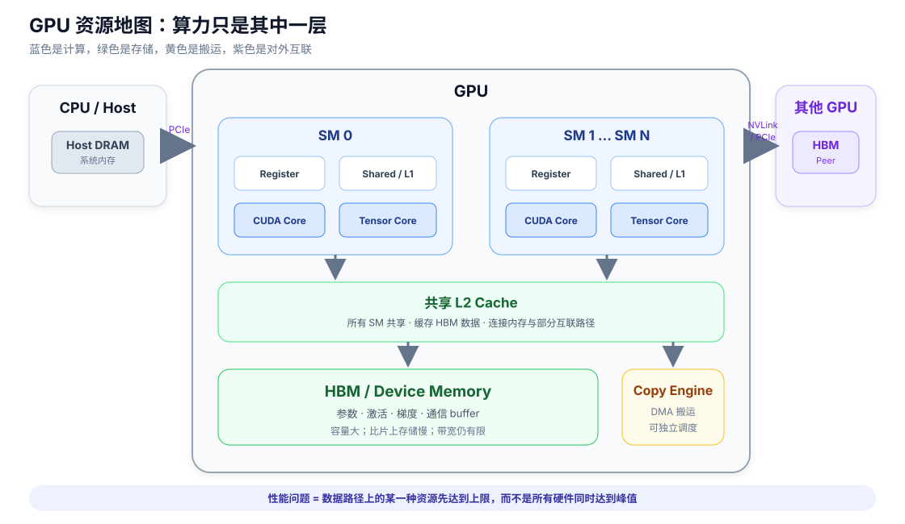
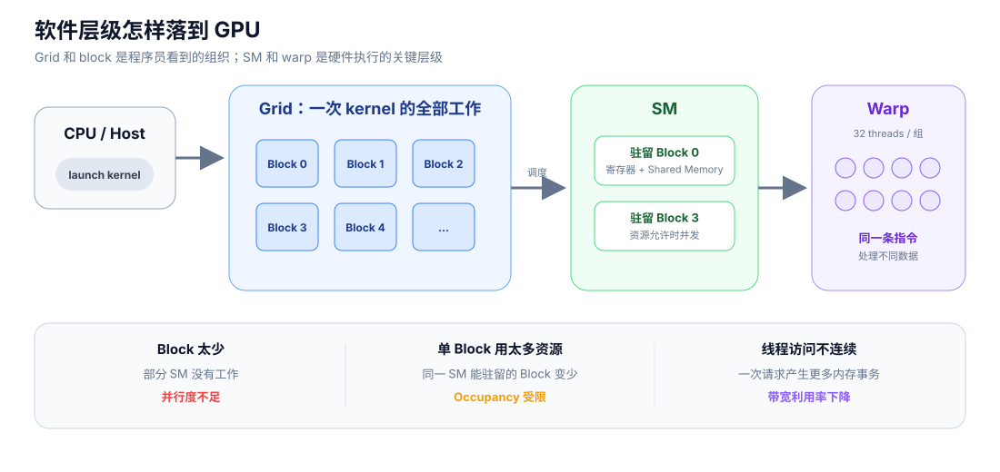

# GPU 里面有什么

GPU 性能基础 · 01

GPU 不是一块只有“算力”的黑盒。它同时包含计算单元、存储层次、数据搬运引擎和对外互联；一次操作快不快，取决于数据在哪一层、由谁处理、经过哪条路径。

## 一张简化地图

*数据通常从 HBM 经过 L2 和 SM 内部存储到达执行单元；跨设备数据还要经过 copy engine、NVLink 或 PCIe。*

| 资源 | 保存或执行什么 | 性能问题 |
| --- | --- | --- |
| SM | warp、CUDA Core、Tensor Core | 工作是否足够并行，是否被通信占用 |
| Register / Shared Memory / L1 | SM 附近的少量高速数据 | 容量有限，使用过多会限制并发 |
| L2 | 所有 SM 共享的片上缓存 | 数据能否复用，是否反复访问 HBM |
| HBM | 参数、激活、梯度和通信 buffer | 容量与带宽通常都是关键约束 |
| copy engine | 部分 DMA 拷贝 | 能否与计算并发，源和目标链路是否空闲 |
| NVLink / PCIe | GPU 对外数据路径 | 决定 GPU 间或 CPU–GPU 搬运速度 |

## 软件工作怎样落到 SM

*Kernel 启动一组 thread block；block 被分配到 SM，SM 再以 32 个线程组成的 warp 为基本调度单位。*

- **Kernel**：在 GPU 上执行的函数。
- **Grid**：一次 kernel 启动产生的全部线程。
- **Thread block**：被整体分配给某个 SM 的线程组。
- **Warp**：SM 实际调度的一组 32 个线程。

block 太少时，一部分 SM 没有工作；单个 block 占用太多寄存器或 Shared Memory 时，同一 SM 能并发容纳的 block 又会减少。这里先建立关系，具体调优留到编写算子时再深入。

!!! tip "先形成这个直觉"

    Tensor 在 HBM 中，计算在 SM 中。任何计算都要先把数据送到 SM 附近，再把结果写回；“峰值 FLOPS 很高”并不保证数据送得足够快。

## 权威参考

- [NVIDIA GPU Architecture Fundamentals](https://docs.nvidia.com/deeplearning/performance/dl-performance-gpu-background/index.html#gpu-architecture-fundamentals)
- [CUDA Programming Guide：Programming Model](https://docs.nvidia.com/cuda/cuda-programming-guide/01-introduction/programming-model.html)

[← 专题总览](index.md) · [→ 一次计算消耗什么](02-compute.md)
