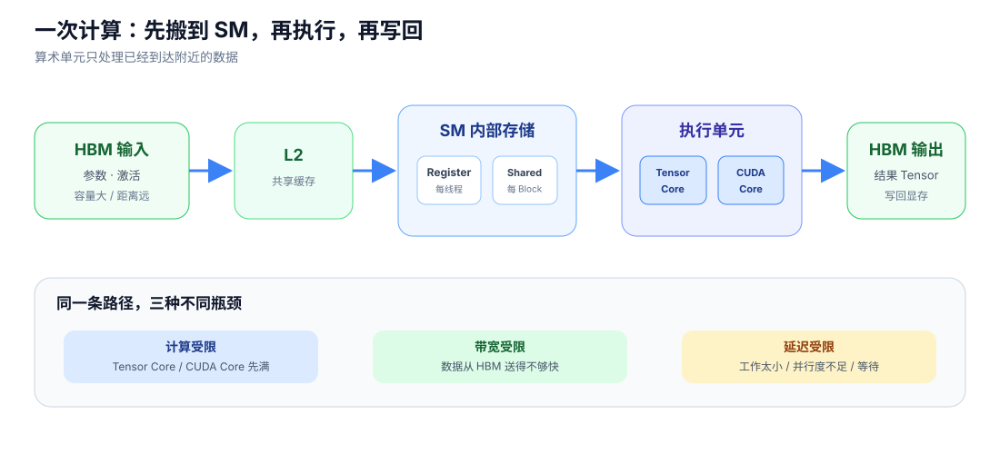
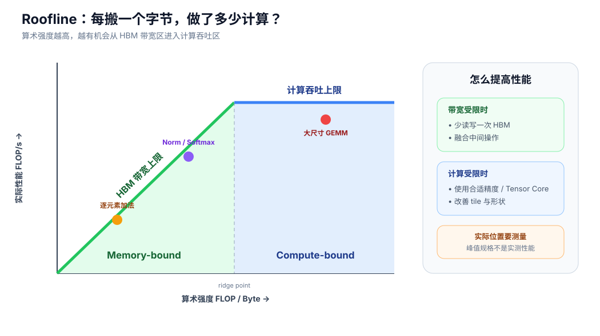

# 一次计算消耗什么

<div class="notebook-hero" markdown>

<span class="chapter-kicker">GPU 性能基础 · 02</span>

一个算子不会只消耗“算力”。它还要读输入、保存中间结果并写输出。判断瓶颈时，先比较做了多少计算与搬了多少数据。

</div>

## 从 Tensor 到结果



*矩阵乘通常大量使用 Tensor Core；激活函数、索引和普通逐元素操作主要运行在 CUDA Core，但两者都需要经过存储层次取得数据。*

一次 kernel 的时间可以先用下面的粗略模型理解：

\[
T_{\text{kernel}}\approx
\max\left(
\frac{F}{P_{\text{eff}}},
\frac{M}{B_{\text{HBM,eff}}},
T_{\text{latency}}
\right).
\]

- \(F\)：浮点运算量；\(P_{\text{eff}}\)：有效计算吞吐。
- \(M\)：实际访问显存的字节数；\(B_{\text{HBM,eff}}\)：有效 HBM 带宽。
- \(T_{\text{latency}}\)：工作量太小、并行度不足或同步造成的延迟。

## Roofline 的直觉



*算术强度是“每搬一个字节做多少计算”。左侧更容易受 HBM 带宽限制，右侧才可能接近计算峰值。*

| 算子 | 常见特征 | 优先观察 |
| --- | --- | --- |
| 大尺寸 GEMM | 数据被反复用于大量乘加 | Tensor Core 利用率、tile 和形状 |
| 激活函数、加法 | 每个元素只做少量计算 | HBM 读写和 kernel fusion |
| LayerNorm / Softmax | 读写之外还有归约和同步 | HBM、归约并行度、融合 |
| 很小的 kernel | 工作填不满 GPU | launch 延迟、block 数量和尾部 |

### 为什么融合常常有效

若两个逐元素算子分别执行，第一步结果要写回 HBM，第二步又重新读取。融合后，中间结果可能留在寄存器或 Shared Memory：

```text
未融合：HBM 读 → 算 A → HBM 写 → HBM 读 → 算 B → HBM 写
已融合：HBM 读 → 算 A → 算 B → HBM 写
```

融合减少的是中间数据搬运和 kernel launch；代价可能是寄存器压力上升，不能只凭“kernel 数量更少”判断收益。

## 权威参考

- [NVIDIA GPU Performance Background：Understanding Performance](https://docs.nvidia.com/deeplearning/performance/dl-performance-gpu-background/index.html#understanding-performance)
- [Nsight Compute：Roofline Charts](https://docs.nvidia.com/nsight-compute/ProfilingGuide/index.html#roofline-charts)
- [Triton 官方 Fused Softmax 教程](https://triton-lang.org/main/getting-started/tutorials/02-fused-softmax.html)

[← GPU 里面有什么](01-architecture.md) · [→ 一次拷贝消耗什么](03-copy.md)
