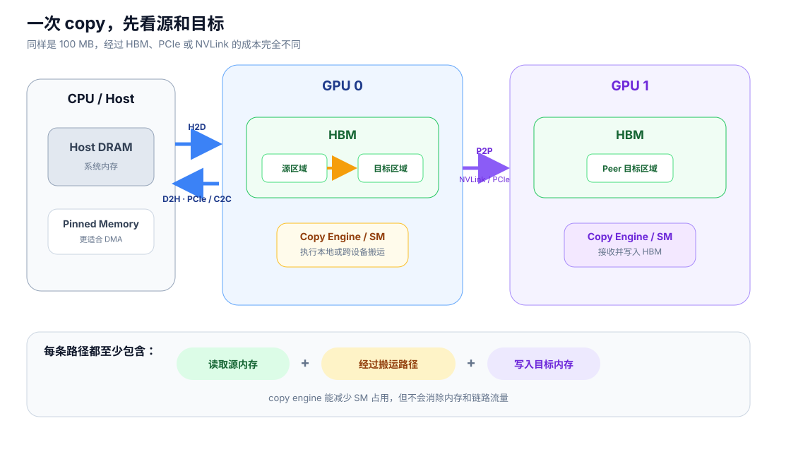
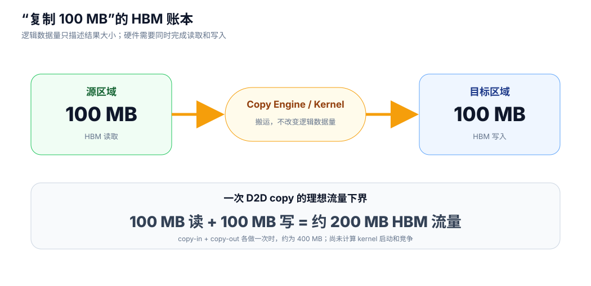

# 一次拷贝消耗什么

GPU 性能基础 · 03

“复制 100 MB”通常不只产生 100 MB 流量：源端要读，目标端还要写。路径不同，使用的 HBM、PCIe、NVLink 和 copy engine 也不同。

## 先看源和目标在哪里

*DMA（Direct Memory Access）表示由专门引擎搬运数据，不要求 CPU 逐字节复制；但源端和目标端的内存带宽仍然会被占用。*

| 拷贝 | 典型路径 | 常见限制 |
| --- | --- | --- |
| GPU 内 D2D | 源 HBM → copy kernel/engine → 目标 HBM | HBM 读写带宽 |
| CPU → GPU（H2D） | Host DRAM → PCIe/NVLink-C2C → HBM | Host 内存、链路和 HBM |
| GPU → CPU（D2H） | HBM → PCIe/NVLink-C2C → Host DRAM | 同上，方向相反 |
| GPU → GPU（P2P） | 源 HBM → NVLink/PCIe → 目标 HBM | 两端 HBM与互联 |

## 字节账本

*一次完整 D2D copy 至少读取源数据并写入目标区域；copy-in 与 copy-out 各做一次时，本地搬运量继续翻倍。*

对于大小为 \(S\) 的 GPU 内复制，理想下界可以粗略写成：

\[
T_{\text{copy}}\approx T_{\text{launch}}+
\frac{S_{\text{read}}+S_{\text{write}}}{B_{\text{path,eff}}}.
\]

100 MB copy 至少形成约 200 MB HBM 流量；若有效 HBM 带宽为 1 TB/s，只看带宽的理想下界约为 0.2 ms。真实时间还包括启动、同步以及与其他 kernel 的竞争。

## 哪些 Tensor 操作真的复制数据

| 操作 | 通常是否复制 | 判断依据 |
| --- | --- | --- |
| `view` / 合法的 `reshape` | 否 | 只改变 shape、stride、offset 等元数据 |
| 切片 view | 否 | 新 Tensor 仍引用同一 Storage |
| `clone` / `copy_` | 是 | 创建或写入新的数据区域 |
| `cat` | 是 | 把多个输入写入新的连续输出 |
| `contiguous()` | 视情况 | 已连续时可直接返回，否则需要重排复制 |
| dtype / device 转换 | 通常是 | 数据表示或存放位置发生变化 |

!!! warning "copy engine 不是免成本通道"

    copy engine 可以减少对 SM 的占用，也可能与计算并发；它仍要读取和写入内存，并可能与计算争抢 HBM、PCIe 或 NVLink 带宽。

## 权威参考

- [CUDA Programming Guide：GPU Memory](https://docs.nvidia.com/cuda/cuda-programming-guide/01-introduction/programming-model.html#gpu-memory)
- [CUDA Samples](https://github.com/NVIDIA/cuda-samples)：`bandwidthTest`、`simpleStreams`、`simpleP2P`。
- [NVIDIA MIG Concepts：GPU Engine 与 copy engine](https://docs.nvidia.com/datacenter/tesla/mig-user-guide/concepts.html)

[← 一次计算消耗什么](02-compute.md) · [→ 一次通信消耗什么](04-communication.md)
