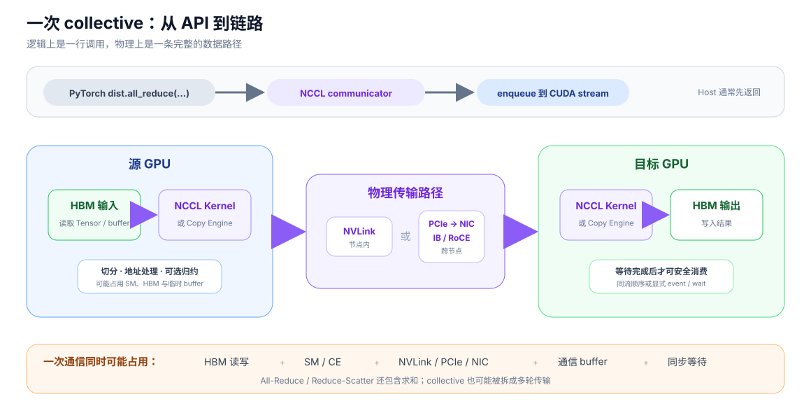
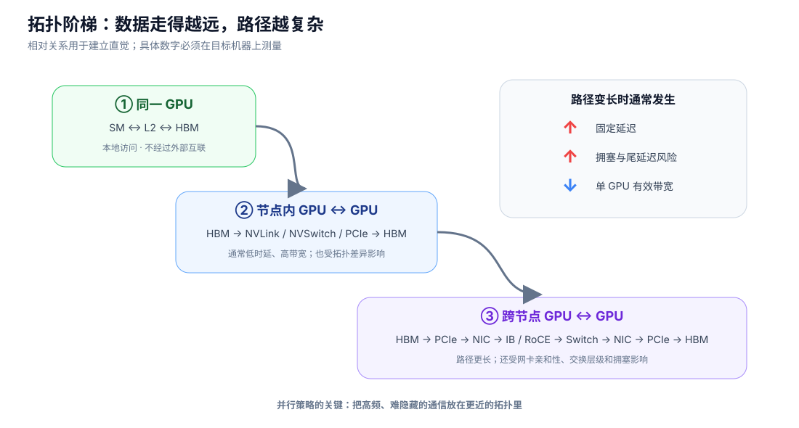

# 一次通信消耗什么

GPU 性能基础 · 04

集合通信不是“网卡把 Tensor 发走”这么简单。数据要从源 GPU 显存读出，经过通信库选择的执行路径和物理链路，再写入目标 GPU 显存；归约类通信还要完成求和。

## 从框架调用到底层链路

*NCCL 等通信库负责把 All-Reduce、All-Gather、Reduce-Scatter 等语义映射成 GPU kernel、copy engine 和网络传输。*

一次通信可能同时消耗：

- **源端与目标端 HBM**：读取输入、写入输出和临时 buffer；
- **SM 或 copy engine**：执行数据切分、地址处理、搬运或归约；
- **NVLink / PCIe / NIC**：传输跨设备数据；
- **Host 与 stream**：下发 collective，建立顺序和等待关系；
- **临时显存**：融合、分块、协议工作区或未完成通信的输出。

## 拓扑决定哪条路最慢

*图中只表达常见的相对关系，不代表所有机器的固定排序；真实路径由服务器拓扑、网卡亲和性和通信库选择共同决定。*

| 通信域 | 常见链路 | 主要特征 |
| --- | --- | --- |
| 同一 GPU | HBM / L2 | 不经过外部互联，但仍有本地读写 |
| 节点内 GPU | NVLink / NVSwitch，或 PCIe P2P | 通常时延低、带宽高 |
| 跨节点 GPU | PCIe → NIC → IB/RoCE → NIC → PCIe | 路径长，容易受拓扑和拥塞影响 |

## collective 为什么比一次 memcpy 复杂

- **All-Gather**：只收集数据，但会分多轮从多个 rank 取得分片。
- **Reduce-Scatter**：既传输又求和，最后每个 rank 只留下一个分片。
- **All-Reduce**：可理解为 Reduce-Scatter + All-Gather。

设通信启动与同步成本为 \(T_{\text{fixed}}\)，本地整理成本为 \(T_{\text{local}}\)，实际链路字节为 \(V\)，有效带宽为 \(B_{\text{eff}}\)：

\[
T_{\text{comm}}\approx
T_{\text{fixed}}+T_{\text{local}}+
\frac{V}{B_{\text{eff}}}+T_{\text{wait}}.
\]

小消息更怕固定启动成本，大消息更受有效带宽限制；融合通信就是用额外 buffer 或本地 copy，换更少的 collective 和更大的消息。

!!! note "异步返回不等于通信完成"

    PyTorch 的 `async_op=True` 返回 `Work`，NCCL collective 也被排入 CUDA stream 异步执行。何时能安全使用结果，还取决于当前 stream、`wait()` 和跨 stream 同步关系。

## 权威参考

- [NCCL Collective Operations](https://docs.nvidia.com/deeplearning/nccl/user-guide/docs/usage/collectives.html)
- [NCCL CUDA Stream Semantics](https://docs.nvidia.com/deeplearning/nccl/user-guide/docs/usage/streams.html)
- [PyTorch Distributed：同步与异步 collective](https://docs.pytorch.org/docs/stable/distributed)
- [GPUDirect RDMA Overview](https://docs.nvidia.com/cuda/gpudirect-rdma/)

[← 一次拷贝消耗什么](03-copy.md) · [→ 异步与 overlap](05-concurrency.md)
