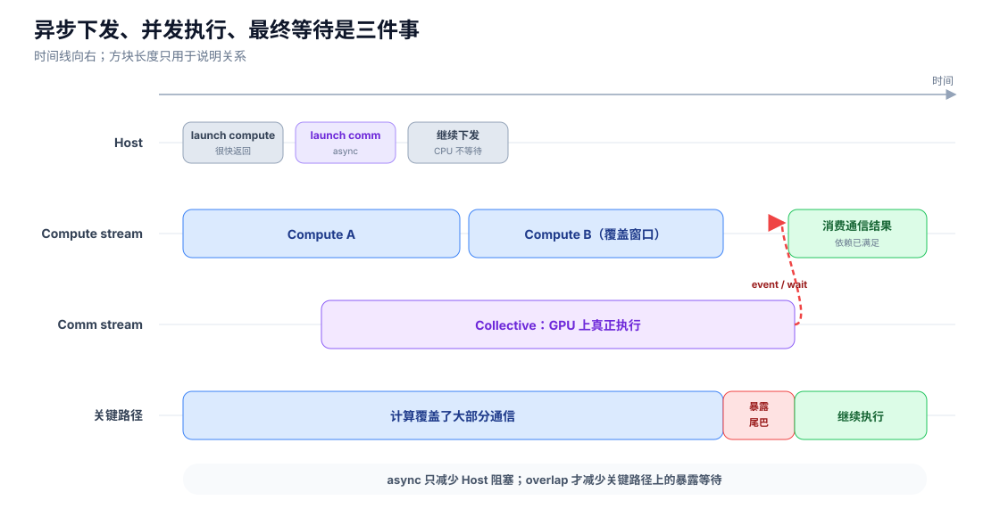
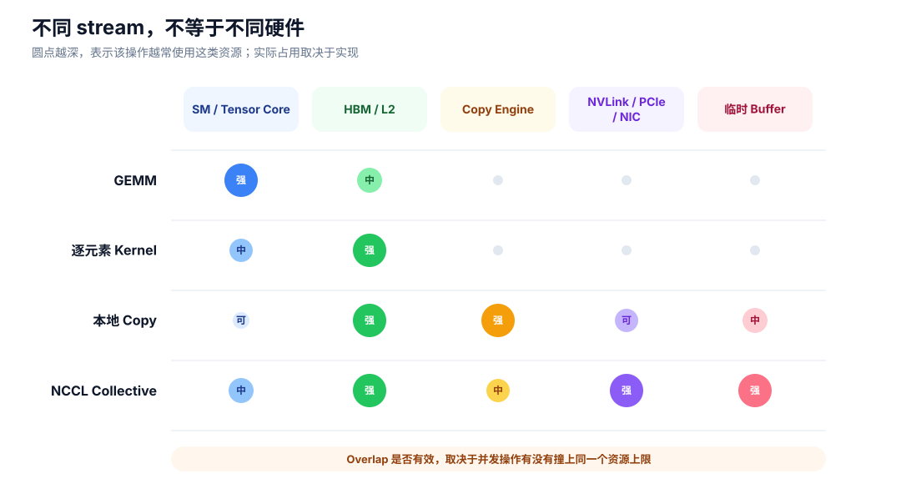

# 异步与 overlap

<div class="notebook-hero" markdown>

<span class="chapter-kicker">GPU 性能基础 · 05</span>

异步只表示 Host 不必停在原地等待。真正的性能收益来自：操作之间没有数据依赖、硬件允许并发，而且没有严重争抢同一种资源。

</div>

## stream 是队列，不是硬件分区



*同一 stream 内按顺序执行；不同 stream 可以并发，但使用通信结果前必须建立依赖。*

上图包含三个不同时间：

1. **Host 下发时间**：CPU 把工作排进 stream，通常很快返回；
2. **GPU 执行时间**：kernel 或 collective 真正在设备上运行；
3. **暴露等待时间**：关键路径最终因为结果未就绪而停下的部分。

理想情况下：

\[
T_{\text{exposed}}\approx
\max(0,T_{\text{comm}}-T_{\text{overlap window}}).
\]

这只是理想上界。两项工作并发后可能各自变慢。

## 为什么两个 stream 仍会互相拖慢



*不同 stream 只是提供并发调度机会；它们最终仍会落到同一批 SM、HBM、copy engine 或外部链路上。*

| 并发组合 | 可能共享的资源 | 结果 |
| --- | --- | --- |
| GEMM + NCCL kernel | SM、HBM | 计算与通信都可能变慢 |
| GEMM + copy engine | HBM | 不抢 SM，也可能抢显存带宽 |
| H2D + GPU P2P | PCIe、HBM | 链路或内存控制器成为瓶颈 |
| 两个 GEMM | SM、Tensor Core、缓存 | 只有单个工作填不满 GPU 时才可能受益 |

## overlap 成立的三个条件

```text
没有数据依赖
    +
被排入可并发的 stream
    +
硬件资源仍有余量
    =
端到端时间可能下降
```

预取还会提前分配下一份参数或通信 buffer，所以 overlap 常常用峰值显存换时间。判断收益时，应同时看 step time、等待点、并发期间的 kernel 变慢程度和峰值显存。

## 权威参考

- [PyTorch CUDA semantics：Asynchronous execution 与 CUDA streams](https://docs.pytorch.org/docs/main/notes/cuda.html#asynchronous-execution)
- [CUDA Programming Guide：Asynchronous Execution](https://docs.nvidia.com/cuda/cuda-programming-guide/02-basics/asynchronous-execution.html)
- [NCCL CUDA Stream Semantics](https://docs.nvidia.com/deeplearning/nccl/user-guide/docs/usage/streams.html)

[← 一次通信消耗什么](04-communication.md) · [→ 怎样观察这些开销](06-profiling.md)
