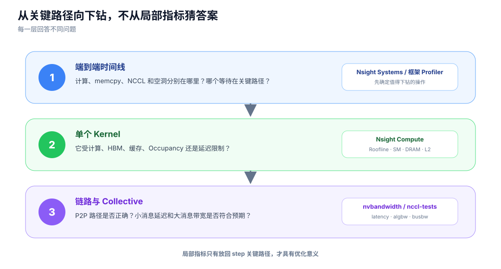
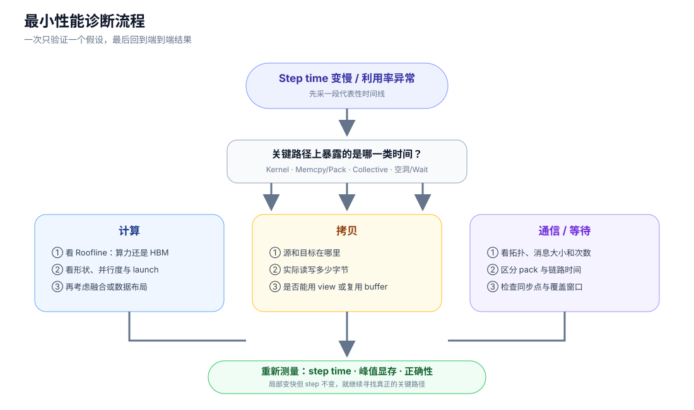

# 怎样观察这些开销

<div class="notebook-hero" markdown>

<span class="chapter-kicker">GPU 性能基础 · 06</span>

硬件模型负责提出假设，Profiler 负责证明假设。先看端到端关键路径，再下钻到 kernel 或链路；不要从某个局部利用率直接推断训练瓶颈。

</div>

## 三层观测



*Nsight Systems 看时间关系，Nsight Compute 看单个 kernel，通信基准看拓扑下的延迟与带宽。*

| 问题 | 工具 | 重点指标 |
| --- | --- | --- |
| step 慢在哪里 | Nsight Systems / 框架 profiler | kernel、memcpy、NCCL、空洞、同步点 |
| 单个 kernel 为什么慢 | Nsight Compute | duration、SM、DRAM、L2、Roofline、Occupancy |
| GPU 间链路是否正常 | `nvbandwidth` / CUDA P2P sample | P2P 可达性、单向/双向带宽、延迟 |
| collective 是否高效 | `nccl-tests` | 消息大小、latency、`algbw`、`busbw` |

## 一个最小诊断流程



*每次只验证一个假设；局部 kernel 变快但 step time 不变，说明它不在关键路径或收益被其他开销抵消。*

### 1. 先确认拓扑

```bash
nvidia-smi topo -m
```

它回答 GPU 之间经过 NVLink、PCIe 还是更远路径，以及 GPU 与 NIC 的亲和关系。

### 2. 再做独立基准

- `bandwidthTest`：Host–GPU 拷贝。
- `p2pBandwidthLatencyTest` / `nvbandwidth`：GPU–GPU 路径。
- `nccl-tests`：不同消息大小的 collective。

### 3. 最后看真实训练

重点找四类时间：

```text
计算 kernel │ memcpy / pack │ NCCL collective │ 空白与等待
```

只有最后一步能回答优化是否缩短了端到端 step。

## 学完后的判断模板

面对一个慢操作，依次问：

1. 数据在哪里，读写了多少字节？
2. 使用了 SM、Tensor Core、copy engine，还是 NIC？
3. 瓶颈是固定延迟、计算吞吐、HBM 还是互联带宽？
4. 它是否在关键路径，能否与独立工作重叠？
5. 优化后 step time、峰值显存和数值结果是否都符合预期？

## 权威参考

- [Nsight Systems User Guide](https://docs.nvidia.com/nsight-systems/UserGuide/index.html)
- [Nsight Compute Profiling Guide](https://docs.nvidia.com/nsight-compute/ProfilingGuide/index.html)
- [NVIDIA nccl-tests](https://github.com/NVIDIA/nccl-tests)
- [NCCL Performance and Tuning](https://docs.nvidia.com/deeplearning/nccl/user-guide/docs/troubleshooting/performance_and_tuning.html)

[← 异步与 overlap](05-concurrency.md) · [回到专题总览](index.md)
