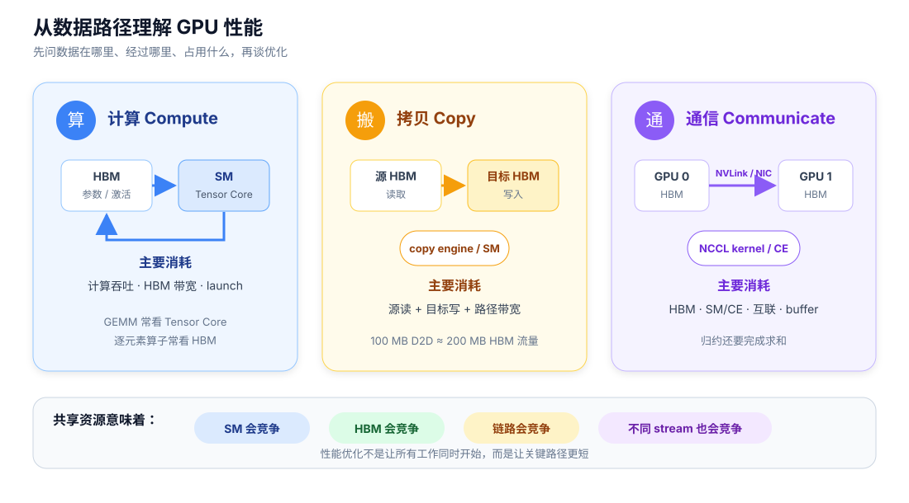

# GPU 性能基础

专题 · 从数据路径理解 GPU

不写 CUDA，也可以先读懂 GPU 性能。这个专题只回答四个问题：**计算用了什么、拷贝经过哪里、通信占了哪些资源、为什么异步操作仍可能互相拖慢。**

*三类操作的瓶颈不同，却会共享 HBM、SM 或互联；性能分析首先要找到真正拥堵的资源。*

## 先记住五个词

| 名称 | 最短解释 |
| --- | --- |
| **SM** | GPU 执行线程和普通计算指令的核心单元 |
| **Tensor Core** | SM 内专门加速矩阵乘加的单元 |
| **HBM** | GPU 的大容量显存，容量大但离计算单元较远 |
| **copy engine** | 可独立执行部分 DMA 数据搬运的硬件引擎 |
| **stream** | 按顺序排放 GPU 工作的队列，不是独立硬件 |

## 阅读路线

1. [GPU 里面有什么](01-architecture.md)：建立 SM、缓存、HBM 和互联的地图。
2. [一次计算消耗什么](02-compute.md)：区分算力受限、带宽受限和延迟受限。
3. [一次拷贝消耗什么](03-copy.md)：沿 HBM、copy engine、PCIe 和 NVLink 追踪数据。
4. [一次通信消耗什么](04-communication.md)：理解 NCCL、collective、拓扑和通信 buffer。
5. [异步与 overlap](05-concurrency.md)：看懂 stream、等待点和资源竞争。
6. [怎样观察这些开销](06-profiling.md)：用 profiler 和小型基准验证判断。

!!! info "学习边界"

    本专题覆盖普通 CUDA/Triton 算子和通信调度所需的基础到中等知识，不展开 PTX/SASS、Tensor Core 指令级编程、NCCL channel/protocol 或 RDMA queue pair。

## 主要参考

- [NVIDIA GPU Performance Background](https://docs.nvidia.com/deeplearning/performance/dl-performance-gpu-background/index.html)：GPU 结构、执行模型与性能上限。
- [CUDA Programming Guide](https://docs.nvidia.com/cuda/cuda-programming-guide/contents.html)：CUDA 执行、内存和异步语义。
- [PyTorch CUDA semantics](https://docs.pytorch.org/docs/main/notes/cuda.html)：PyTorch 中的 stream 与异步执行。
- [NCCL User Guide](https://docs.nvidia.com/deeplearning/nccl/user-guide/index.html)：集合通信和 CUDA stream 语义。

[→ 开始阅读：GPU 里面有什么](01-architecture.md)
