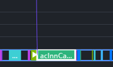
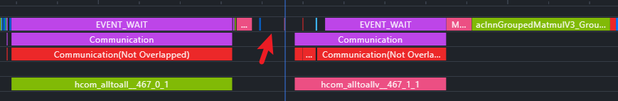

# 训练性能优化流程：从性能摸底到瓶颈定位

大模型正式训练可能使用数千甚至上万张加速卡，但前期摸底和调优通常只能获得一套小得多的集群。训练性能优化因此包含两个相互关联的问题：怎样让小集群负载尽量代表正式训练，以及怎样从 Profile 中找到真正限制训练步耗时的路径。

本章使用一组概念化的并行配置和时间线，按**背景澄清、性能摸底、数据采集、结果分析、优化验证**的顺序展开。配置名称只描述并行轴的逻辑职责，不对应某个框架的具体接口；实际分析时，需要先对齐当前实现的进程组划分和集合通信（collective）插入位置。

## 1. 背景澄清：固定训练场景

开始改并行配置或算子之前，先把正式训练的工作负载写清楚。缺少这一步，即使训练步耗时下降，也无法判断它来自实现优化，还是模型、数据或批大小发生了变化。

| 对象 | 需要确认的内容 | 对性能判断的影响 |
| --- | --- | --- |
| 模型 | 架构、参数量、层数、稠密或 MoE 结构 | 决定主要计算、参数和通信对象 |
| 集群 | 设备数量、节点与超节点边界、互联拓扑、异常节点状态 | 决定集合通信跨越的链路和可用带宽 |
| 数据 | 数据集规模、单样本长度、`seq_length`、动态或固定长度 | 决定每步 token 数与算子形状 |
| 超参数 | 优化器、数值精度、`global_batch_size`、本地批大小、梯度累积 | 决定状态显存、每卡工作量和同步频率 |
| 并行策略 | DP、FSDP、TP、SP、PP、EP 的大小及进程组映射 | 决定状态分片、激活布局和通信边界 |

这里的**超节点**指集群中通过更高带宽互联组织起来的一组节点，具体边界由硬件部署决定。比较两次训练时，不仅要记录卡数，还要记录并行组是否跨节点或跨超节点；相同的并行度放在不同物理拓扑上，通信时间可能明显不同。

## 2. 性能摸底：构造可比较的小集群负载

小集群调优的目标不是机械地缩小所有配置，而是尽量保持每张卡的参数、激活、算子形状和通信角色与正式训练一致。可以复用到大集群的，是这些局部负载下的判断；由网络拓扑、通信组规模和全局竞争决定的结果，仍需在目标规模复测。

### 2.1 优先只缩小数据并行副本数

如果小集群能够运行完整模型，最理想的方式是保持模型切分不变，只缩小数据并行副本数。下面的示例采用弱扩展口径：集群扩大时，每个副本的本地批大小保持为 1，全局批大小随副本数增加。

```text
# 128 卡摸底配置：概念化表示
data_replicas=1  shard_group_size=4  tp=4  pp=8  ep=64
global_batch_size=128  local_batch_size=1

# 1024 卡正式配置：只扩大数据并行副本数
data_replicas=8  shard_group_size=4  tp=4  pp=8  ep=64
global_batch_size=1024  local_batch_size=1
```

这里的 `data_replicas` 表示数据并行副本数，`shard_group_size` 表示每份模型状态跨多少设备进行分片；它们是解释配置关系的逻辑名称，不是可直接复制的启动参数。TP（Tensor Parallel，张量并行）、PP（Pipeline Parallel，流水线并行）和 EP（Expert Parallel，专家并行）可能共享或重组部分设备轴，不能简单把示例中的所有并行度相乘来计算总卡数。

只扩大数据并行副本数有两个直接好处：

1. 每个副本内部的模型切分和本地算子形状保持不变，小集群上的算子与流水线负载判断更容易复用。
2. 可以结合扩展效率估算大集群吞吐，而不是只给出无法校正的线性外推值。

在上述弱扩展口径下，若小集群吞吐为 $X_{\mathrm{small}}$，设备数从 $N_{\mathrm{small}}$ 增加到 $N_{\mathrm{large}}$，则

$$
X_{\mathrm{large}} \approx X_{\mathrm{small}} \times
\frac{N_{\mathrm{large}}}{N_{\mathrm{small}}} \times \eta_{\mathrm{scale}}
$$

其中，$\eta_{\mathrm{scale}}$ 是扩展效率，包含更大规模下的网络竞争、同步等待和系统抖动。直接按卡数线性放大相当于假设 $\eta_{\mathrm{scale}}=1$，只能作为理想上界。

如果正式训练还需要增大参数分片组以降低每卡参数、梯度或优化器状态压力，可以采用下面的配置：

```text
# 1024 卡正式配置：同时扩大 replicate 与 shard
data_replicas=4  shard_group_size=8  tp=4  pp=8  ep=64
global_batch_size=1024  local_batch_size=1
```

这条路线会改变 FSDP 参数聚合和梯度归约的通信组规模，因此不再与小集群完全等价。小集群上的算子优化仍可复用，但 FSDP 通信耗时、重叠效果和跨节点行为必须重新测量。

### 2.2 资源不足时缩小层数和流水线级数

如果小集群无法容纳完整模型，可以同时减少模型层数和 PP stage 数量，同时保留首 stage、中间 stage 和末 stage 的代表性负载。

假设正式模型有 61 个主干层和 1 个 MTP（Multi-Token Prediction，多 Token 预测）层，使用 8 个 PP stage：

```text
# 8 个 stage 的层数分布
[7, 8, 8, 8, 8, 8, 8, 6+1]
```

第一个 stage 还要承担 Embedding，最后一个 stage 还要承担输出、loss 和 MTP 层，因此两端各少放一部分主干层。缩小为 4 个 stage 时，可以保留相同类型的局部负载：

```text
# 4 个 stage 的代表性分布
[7, 8, 8, 6+1]
```

这种缩放主要保留两类信息：其他并行轴和算子配置不变；首、中、末 stage 的层数与附加模块接近正式模型。因此，单 stage 显存、算子耗时和局部负载均衡结果更容易复用。

它不能复现完整模型的 PP 气泡比例、端到端流水线周期和跨节点点对点（P2P）路径。缩小层数后得到的是**代表性 stage**，不是完整训练吞吐的等比例替身；正式训练前仍需在目标 PP 规模验证调度与负载均衡。

## 3. 性能数据采集

完成小规模负载设计后，先运行足够的预热步骤，避开图编译、内存池扩展和缓存初始化，再选择稳定训练步进行采集。不要一开始就在所有 rank 上开启最完整的记录，否则采集本身可能改变 Host 下发和设备时间线。

一次分析通常需要两组数据：

1. **精简采集**：保留训练步耗时、关键算子和少量代表 rank，用于判断问题是否稳定存在。
2. **完整采集**：围绕同一批训练步补充 Host 调用栈、内存和更多 rank，只用于解释已经圈定的异常区间。

[训练性能指标](../training-performance.md)给出了训练步、吞吐和稳定性等统计口径；[怎样观察 GPU 开销](../gpu-basics/06-profiling.md)进一步介绍了时间线、汇总表和硬件计数器的观察层级。选择代表 rank 时，应覆盖首 PP stage、中间 stage、末 PP stage，以及初步结果中最慢或等待最明显的 rank。

## 4. 执行正确性检查：从配置核对时间线

分析 Profile 时，先从模型和并行配置出发，检查算子形状、分片状态、通信类型和进程组是否符合预期。只有先确认训练执行正确，后续的耗时归因才有可靠基础。

### 4.1 计算与分片检查

先核对每个 rank 实际承担的计算：本地参数和激活形状是否符合 TP、SP、FSDP 或 EP 的切分方向，各 PP stage 的层数和附加模块是否与配置一致，每个优化器步骤调度的 micro-batch 数量是否正确。

这一阶段关注的是“当前 rank 应当计算什么、实际留下了什么”。如果本地矩阵形状、专家 token 数或 stage 层数已经偏离设计，后面的算子耗时和通信占比就不能代表目标配置。

### 4.2 通信路径检查

沿并行配置核对通信类型、进程组和插入位置即可。下表列出常见语义，具体次数和时序以实际实现为准：

| 通信路径 | Profile 中预期看到的作用 | 检查边界 |
| --- | --- | --- |
| FSDP 参数聚合 | 模块计算前通过 all-gather 取得当前模块所需参数 | 启用 prefetch 后，通信可能提前到上一模块计算期间，不能只按时间相邻关系判断归属 |
| TP / SP 激活通信 | 在序列维保持分片的实现中，Column Parallel Linear 前可能 all-gather，Row Parallel Linear 后可能 reduce-scatter | 不同模块和框架的输入、输出布局不同，应以当前 Placement 契约为准 |
| EP token 交换 | 按路由结果通过 all-to-all 或等价操作把 token 送往目标专家，专家计算后再执行 combine 通信 | 动态 split size 是否需要额外交换元数据取决于实现，不能预设固定的 all-to-all 次数 |
| FSDP / HSDP 梯度同步 | FSDP 通常在分片组内 reduce-scatter 梯度；HSDP 还需要在副本方向同步对应分片 | 核对通信组、梯度分片状态及与反向计算的重叠关系 |
| PP stage 通信 | 相邻 stage 之间通过 P2P 传递激活或激活梯度 | 区分真实链路传输与因上下游未就绪产生的等待 |

这一步尤其要关注 TP 与 SP 的组合。一次不符合预期的 all-gather 或 reduce-scatter，可能来自相邻模块 Placement 不一致，而不是算法必需通信。需要把 Profile 事件反查到模块边界和并行配置，确认通信“为什么存在”。

## 5. 瓶颈定位：从异常时间段回到原因

确认执行路径正确后，再从 Profile 中的异常现象出发，沿 Device、通信组和 Host 调用栈回到代码与配置。最常见的入口包括未隐藏通信、集合通信等待、长时间 Device 空闲和异常长尾 rank。

训练性能优化的最终目标是降低稳定区间的训练步耗时，或在相同工作负载下提高 Token 吞吐。Profile 中的“计算占比”只是解释指标：减少暴露在关键路径上的通信、流水线气泡或 Device 空闲后，即使计算绝对耗时不变，计算占比也会提高；反过来，单个计算算子变快也未必能缩短整个训练步。

因此，瓶颈定位需要沿决定训练步完成时间的**关键路径**观察计算、通信、同步和 Host 下发，而不能把互相重叠的事件耗时直接相加。

### 5.1 通信重叠与暴露时间

通信重叠也常称为通信掩盖，指通信与不依赖其结果的计算并发执行。优化时真正需要减少的是通信落在关键路径上的**暴露时间**，不是通信事件本身在时间线上存在了多久。

发现较长的未隐藏通信后，应同时查看该位置的 Device 计算流和 Host 下发：当前通信在等待哪个依赖，是否存在可以并发的计算，以及二者是否竞争同一硬件资源。常见路径包括：

- **FSDP 参数聚合**：预取下一层参数，使其 all-gather 与当前层计算重叠。预取距离过近无法隐藏通信，过远则可能增加峰值显存。
- **TP 通信**：许多集合通信结果会被下一算子立即消费，重叠空间有限；可以检查异步通信或通算融合实现，但必须验证融合后是否真的缩短关键路径。
- **EP 通信**：可以让 routed expert 的 all-to-all 与 shared expert 计算重叠；启用 PP 后，部分实现还会使用 BF overlap，让不同 micro-batch 的 backward 与 forward 计算覆盖通信。
- **PP 通信**：检查 P2P overlap 和流水线调度；反向阶段还可以分析 `dX`（输入激活梯度）与 `dW`（权重梯度）计算是否具备重叠空间。

上述方法都依赖具体调度和实现。看到两个 stream 同时有事件，不等于获得了完整收益；如果计算与通信竞争 HBM、片上资源或互联，二者并发后的总时长仍可能变长。

### 5.2 集合通信等待与慢 rank

已经启用通算重叠后，若未隐藏通信仍占较大比例，需要判断时间究竟花在数据传输，还是等待通信组内其他 rank 到达。

1. **固定慢 rank**：把同一通信组的 rank 对齐观察。如果某个 rank 较晚进入集合通信，它记录到的通信区间可能反而较短，而其他早到 rank 的区间更长。后者包含了等待时间，应继续检查晚到 rank 在通信前执行的计算、同步和硬件状态。
2. **随机慢 rank**：如果每次晚到的 rank 都不同，更可能与 Host 抖动、进程竞争或节点状态有关，需要结合 Host 时间线和多次采样判断。
3. **PP 负载不均**：若 P2P 暴露时间较长，先核对上下游 stage 的计算量和 micro-batch 调度。接收方尚未就绪时，时间线中的“通信耗时”可能主要是 stage 等待，而不是链路带宽不足。

硬件问题可以通过节点替换或交叉运行进行排除，但不能只凭一次集合通信时长直接判断“慢卡”。需要同时验证到达时间、算子耗时和同节点其他 rank 的表现。

### 5.3 Device 空闲的识别

部分 Profile 将既没有计算流也没有通信流的 Device 区间标记为 `Free`。这里的 Free 表示设备执行队列暂时没有可运行工作，不是释放显存。减少这类空闲，需要找到空白区间对应的 Host 行为和上游依赖。

**Device 流稀疏。**


*图 1：彩色块表示 Device 上的计算或通信事件；事件之间连续的深色区间说明设备没有获得可执行工作，需要继续对齐 Host 时间线判断原因。*

计算和通信算子都需要由 Host 侧准备并下发。如果 Host 产生任务的速度低于 Device 消费任务的速度，Device 时间线就会出现空洞。这类现象通常称为 **Host bound**：训练步受主机调度与下发限制，而不是受设备算力限制。

**算子接近即时下发。**



*图 2：算子从 Host 下发后几乎立即在 Device 执行，连线缺少提前排队形成的倾斜，说明 Device 正在等待后续任务。*

稳定流水中，Host 通常会提前准备一段 Device 工作。如果每个算子刚下发就开始执行，说明队列缺少余量；此时即使单个 Host 操作只多耗费很短时间，也会直接暴露为 Device 空闲。

### 5.4 Host 瓶颈的常见原因

#### 小算子数量过多

算子下发本身有固定开销。当大量 Device kernel 只执行数微秒，而当前环境中单次 Host 下发需要约 10–40 微秒时，Host 很难持续填满设备队列。这里的数值只描述当前采样环境，不是所有硬件和框架的固定常数。

可以从三个方向处理：减少 Python 前端生成的冗余算子，使用语义等价的融合算子，或调整并行切分以避免本地计算被切得过碎。例如减少 TP、增加 PP 可能增大单个本地算子的计算量，但它也会改变显存、PP 气泡和通信路径，必须重新做端到端验证。

#### Host 侧额外操作

Host 变慢不一定发生在算子下发函数本身。Python 数据结构处理、日志、动态 shape 计算或框架调度都可能中断连续下发，需要查看空白区间对应的 Host 调用栈。

沿同一时间范围找到占用 Host 的具体调用后，再区分这段工作是每步必需、可以缓存、可以移出关键路径，还是能够下沉到融合实现中。不能仅凭顶层函数名称判断原因。

#### 进程竞争

多个训练进程争用同一组 CPU 核、NUMA 资源或系统服务时，Host 下发会变慢并产生抖动。可以检查进程绑核、CPU 核隔离和 NUMA 亲和性，使不同训练进程使用明确且尽量不冲突的物理核。调整后应比较多步分布，而不是只看单步最好结果。

#### Device 结果依赖导致断流

Host 下发通常与 Device 执行异步进行；只要 Host 能持续提前准备任务，Device 就不必等待。如果 Host 必须先取得 Device 计算结果才能决定下一项操作，就会发生同步，后续下发链路随之中断。

在部分动态 EP 路由实现中，Host 下发 all-to-all 前需要知道各 rank 实际发送多少 token。如果通信接口要求 Host 侧获得 split size，就可能等待 Device 完成 token 计数，并通过 D2H（Device-to-Host，设备到主机）传输或同步取得结果，然后才能下发完整 all-to-all。



*图 3：两次通信之间出现 `EVENT_WAIT` 和未重叠通信区间。红色箭头附近需要结合 token 计数、D2H 同步与 Host 调用栈，确认下一次 all-to-all 是否在等待动态通信量。*

这类问题的优化方向是减少 Host 对动态 Device 结果的依赖，例如让通信量计算与后续调度更多地留在 Device 侧，或使用支持相应动态元数据路径的通信实现。具体方案取决于框架和通信后端，不能在未确认依赖链之前把所有 `EVENT_WAIT` 都归因于 EP token 计数。

## 6. 优化结果验证

完成修改后，需要回到与基线相同的模型、数据形状、批大小、精度、并行配置和统计区间进行比较。一次完整验收至少包含：

1. 训练步耗时和 token 吞吐是否在多次运行中稳定改善；
2. 原来的通信等待或 Device 空闲是否缩短，瓶颈是否转移到其他路径；
3. 峰值显存是否变化，是否因为预取或 overlap 引入新的容量风险；
4. loss、梯度和参数更新是否仍满足既定的数值正确性要求；
5. 小集群收益在目标集群规模是否仍然成立，扩展效率是否符合预期。

最终结论应能连接四类证据：配置说明负载怎样构造，Profile 说明瓶颈位于哪里，代码或系统修改说明机制怎样改变，端到端指标说明训练是否真正变快。缺少其中任何一环，都不足以完成一次可复现的训练性能优化。
