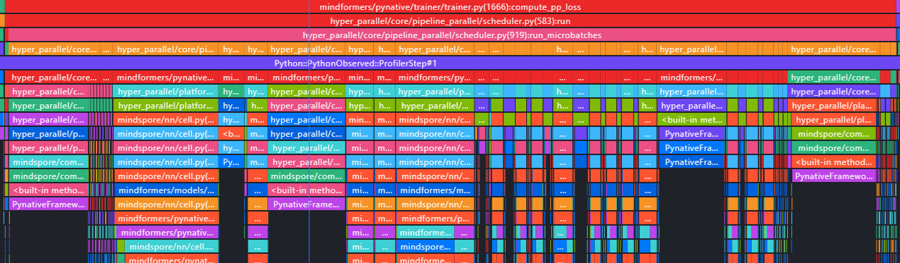

训练性能优化按照以下流程进行开展

# 背景澄清

这一步先摸清训练场景，有助于确定性能优化方案。

1. 确认模型架构+模型参数量
2. 确认集群规模，超节点状态
3. 确认数据集规模：数据集长度seq_length
4. 确认超参：如优化器，global_batch_size

# 性能摸底

正式训练时，使用千卡到万卡集群进行，但是在前期进行性能摸底和调优时，不会有这么多资源，因此需要进行同比例缩放，在小集群上进行调优，并尽量保证扩大集群后，性能不发生明显劣化、

## 方案一 仅缩小dp_replicate

最理想方案是，小集群和大集群相比，仅对数据并行维度进行缩小：

```
假设这是128卡的训练配置，在此配置上，模型训练可以完整运行：
dp_replicate=1  dp_shard=4  tp=4  pp=8  ep=64  global_batch_size=128   local_batch_size=1

那么扩充到1024卡，可以只扩大dp_replicate：
dp_replicate=8  dp_shard=4  tp=4  pp=8  ep=64  global_batch_size=1024  local_batch_size=1

那么扩充到1024卡，也可以扩大dp_replicate和dp_shard，减少显存压力：
dp_replicate=4  dp_shard=8  tp=4  pp=8  ep=64  global_batch_size=1024  local_batch_size=1
```

该方案有如下优点：
1. 小集群和大集群的并行切分方式相同，对小集群性能的分析和优化，可直接复用到大集群；
2. 性能换算方便：对性能数据，乘以集群线性度，即可估算出大集群性能表现；

## 方案二 缩小层数

当模型较大，小集群资源不足以运行完整模型时，需要缩小模型。

虽然小集群上无法运行完整模型，但是还是要确保单个卡上的状态，尽量和大集群相同，减少扩大集群带来的不确定性。

下面提供一种缩小模型层数和pp的方式

```
假设完整模型num_layers=61，mtp_num_layers=1，需要pp=8才能运行，那么它的模型层数在各个stage上的分布为
[7, 8, 8, 8, 8, 8, 8, 6+1]
stage0和stage7一般层数少一点，因为stage0有embedding，stage1需要计算loss，显存压力相对较大。

通过减少层数和pp，可以得到如下分布
[7, 8, 8, 6+1]
可以看到，stage0，中间stage，和最后一个stage，与完整模型相比有一致的负载，这意味着在小模型上负载均衡的调整也可以直接用到完整模型上

```

该方案有如下优点：
1. 仅修改pp配置，不影响对其他配置的调优；
2. pp负载与完整模型相同，可复用负载均衡调优结果；

# 性能采集

# profile结果分析

性能优化的整体目标，就是要降低单个Step所需时间，落到profile结果上来，就是要提高计算占比，同时降低计算耗时。

## 正向分析

首先要进行的是正向分析，或者说是正确性分析。

### 通信

模型前向主要包含以下通信：

1. fsdp的权重聚合：在每个layer计算之前，会有allgather算子，用于聚合fsdp切分的权重；
2. tp/sp通信：column parallel linear 计算前插入 allgather，row parallel linear 计算完成后插入 reducescatter，这个根据不同的模块有不同的切分，比如MLA和MoE；
3. ep通信：在MoE的GroupMatmul计算前，会有2个alltoall，先交换tokens_per_expert，然后交换token；MoE计算完成后，1个alltoall进行还原；
4. 梯度通信：由于fsdp对权重和梯度都进行了切分，因此梯度需要进行通信，主要是在 dp_shard域 进行 reducescatter，然后在 dp_replicate域 进行 allreduce；
5. pp通信：pp通信主要是stage之间的p2p通信；

这部分，可以整体看一下profile结果，各个通信是否符合并行算法的预期，尤其是tp/sp通信。

## 逆向分析

逆向分析，主要是在profile结果中，找到异常点，再进行原因分析，是最常见的分析手段。

### 通信掩盖

查看通信与计算是否为并发，这样可以将通信耗时隐藏在计算时间中，从而提升性能。

找到profile中未掩盖通信较长的位置，查看对应位置Device侧和Host侧在做什么，然后看是否有掩盖手段。

#### 常见通信及其掩盖手段

1. fsdp的权重聚合：通过prefetch预取下一层的参数，把通信和当前层的计算流进行掩盖；
2. tp通信：一般无法掩盖，可以通过通算融合算子进行加速；
3. ep通信：可以通过AlltoAll通信时，进行shared experts计算，进行掩盖；开启PP时，可以通过BF掩盖，让前反向的计算流和AlltoAll进行掩盖；
4. pp通信：pp通信时间长，主要看负载情况，负载不均会导致通信等待，耗时增加；掩盖手段有 p2p掩盖，dx/dw掩盖；

#### 通信等待

在通算掩盖算法都使能之后，如果发现未掩盖通信占比仍然很多，可以继续打开分析。

1. 慢卡

    把通信域内的rank放到一起进行分析，如果有一张卡的通信时长很短，而其他的卡都很长，说明其他卡在等待这张卡。

    解决方案：一般可能是硬件问题，换机器进行排除法，或者找硬件同事进行排查。

2. host bound

    如果每次通信，慢卡都是随机的，那么可能是host不稳定，导致卡有快有慢。

    解决方案：参考下一节，减少host开销，提升host稳定性。

3. pp负载不均

    在开启pp场景，如果p2p通信，未掩盖时间特别长，则有可能是负载不均导致。

### 减少Free

Free是指这个时刻，既没有计算流也没有通信流。减少Free，需要找到Free的位置，查看此时具体在做什么。

不论是通信算子还是计算算子，都依赖host侧进行下发，若host下发慢，则会导致Device侧等待Host侧。

#### 常见现象

1. Device流稀疏

    

    如图，Device侧执行流，有大面积空白。

2. Device侧算子下发线呈直线

    

    连线为直线说明该算子刚下发就执行了，算子下发慢。

#### 常见原因

1. 小算子太多

    一个算子下发时间在10us-40us，但是小算子执行太快，只有几us，导致host下发来不及。

    解决方案：优化前端写法，减少算子数量；或者直接使用融合算子；或者减少TP，使用PP，减少算子下发数量同时增大单个算子计算量，降低host开销；

2. host额外操作太慢

    有时候并不是host算子下发太慢，而是host侧有额外操作，导致算子下发慢。此时需要查看对应位置的host堆栈，看一下host此时在做什么。

    

    解决方案：找到对应的host堆栈，搞清楚python侧在做什么操作，然后进行优化。

3. 进程竞争

    多个进程抢夺CPU资源，导致host侧变慢，或者不稳定。

    解决方案：在集群上进行核隔离、绑核操作，不同进程使用不同的簇，不同物理核，减少冲突。

4. 断流

    python前端写的部分代码会导致算子下发断流，从而导致算子下发慢，影响性能。

    我们知道，python侧的算子下发与host侧执行是异步的，最优情况是python下发比host侧下发快，这样device侧执行时不需等待下发。

    当host侧操作依赖device侧结果时，断流就产生了，host必须等待device执行完后执行H2D操作，才能拿到结果，这就导致host等待，下发中断。

    一个常见场景是，EP的AlltoAll通信，host下发AlltoAll时需要知道每张卡上通信多少token，那就依赖device侧计算完成后再进行alltoall，得到数据后才能下发EP的完整AlltoAll，这里就是一个经典的断流位置。

    
