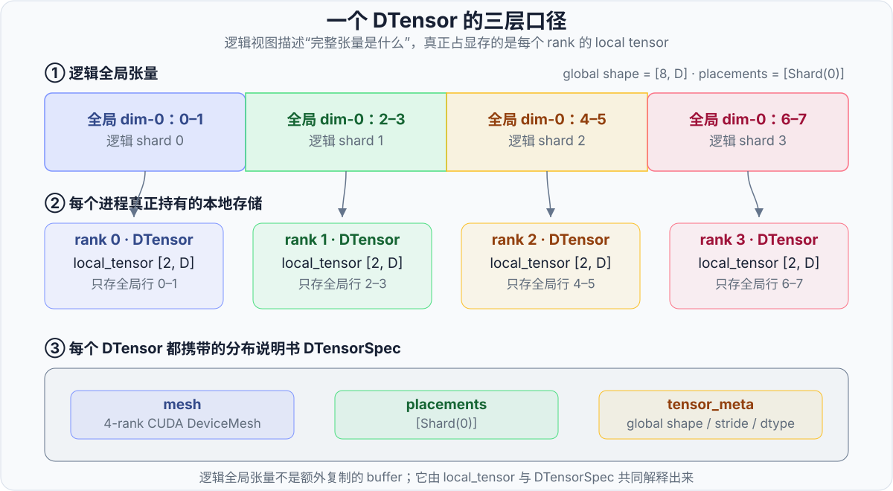
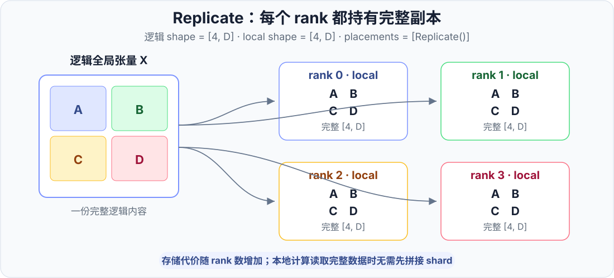
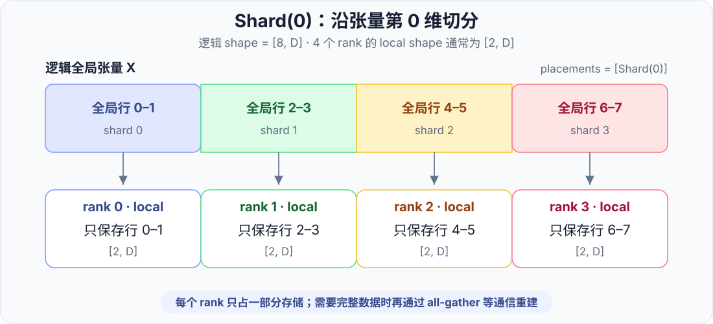
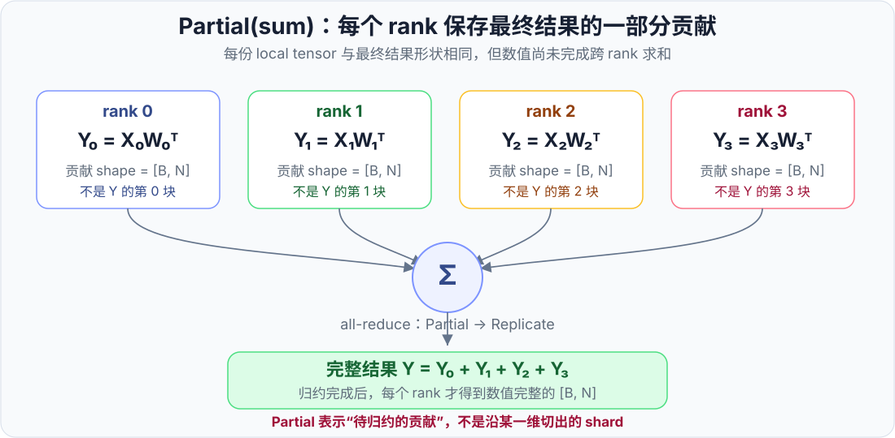
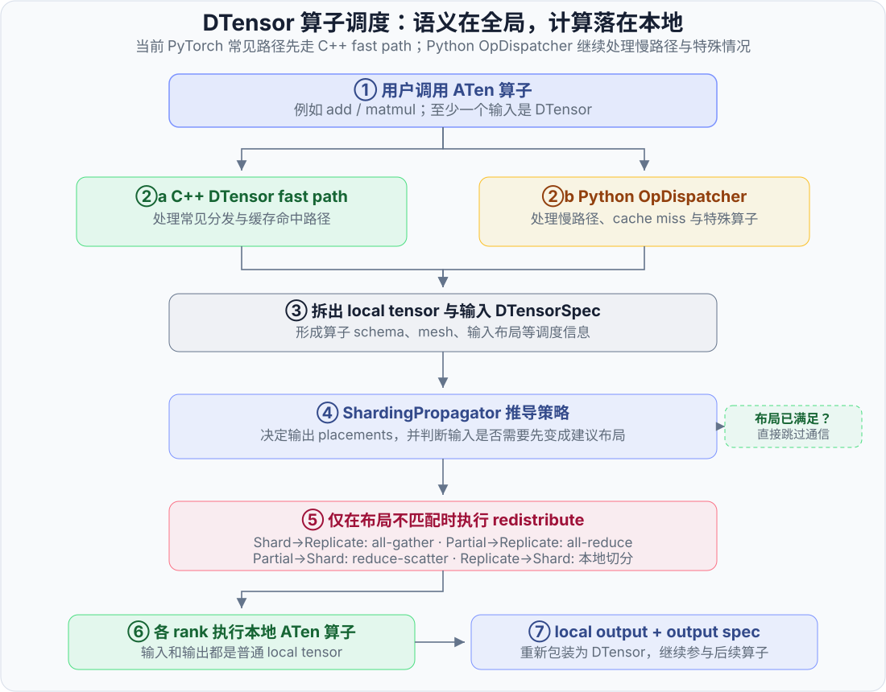

# 第 1 章 · DTensor 原理与使用

<div class="notebook-hero" markdown>
<span class="chapter-kicker">TorchTitan Framework · 第 1 章</span>

普通 `Tensor` 只描述当前进程中的本地数据，`DTensor` 则同时记录张量的**逻辑全局形状、设备拓扑和分布布局**。这套抽象让模型代码仍能从完整张量的角度表达计算，同时把切分、复制、归约与重分片交给统一的分布式语义处理。
</div>

!!! info "版本说明"
    本文以 TorchTitan 提交 [`a3168782c`](https://github.com/pytorch/torchtitan/tree/a3168782c9a3a2e40afbd0de114818b96e2bda6e) 和 2026 年 8 月的 PyTorch `main` 分支为阅读基准。当前 TorchTitan 默认使用 `spmd_types` 后端，并非所有并行模式都直接把激活表示成 DTensor；但 FSDP2 参数仍采用 DTensor，`partial_dtensor` 后端也仍然存在。

    相关实现可从 TorchTitan 的 [ParallelismConfig](https://github.com/pytorch/torchtitan/blob/a3168782c9a3a2e40afbd0de114818b96e2bda6e/torchtitan/config/configs.py) 对照阅读。

## 1. 为什么需要分布式张量抽象

单卡程序中的张量有一个自然假设：代码看到的形状就是当前设备实际保存的形状。进入多卡训练后，这个假设不再成立。例如，一个逻辑形状为 `[8, D]` 的张量沿第 0 维切到 4 张 GPU 后，每个 rank 实际只保存 `[2, D]`。程序同时需要回答两类问题：

- 从数学上看，这个张量完整的形状和运算是什么；
- 从系统上看，每个 rank 当前保存哪一部分，下一次运算是否需要通信。

如果每个算子都手写切分、`all_gather` 和 `reduce_scatter`，模型逻辑会与通信实现紧密耦合。DTensor 将二者分开：

\[
\text{逻辑张量及其运算}
\quad+\quad
\text{分布布局}
\quad\longrightarrow\quad
\text{各 rank 的本地计算与必要通信}
\]

各 rank 执行同一份程序、处理不同本地数据的编程方式称为 **SPMD**（Single Program, Multiple Data，单程序多数据）。DTensor 正是 PyTorch 用来表达这类程序中“同一个逻辑张量如何分布”的核心抽象之一。

它可以参与张量并行（TP）、序列并行（SP）、FSDP/HSDP 参数分片和 loss parallel 等实现。不过，Pipeline Parallel（PP）还包含模块切 stage、点对点发送与多 microbatch 调度，不能只靠一个 Placement 表达。

## 2. 一个 DTensor 的三层信息

理解 DTensor 最重要的一步，是把**逻辑视图、本地存储和分布规格**分开。



*图 1：逻辑全局张量描述所有 rank 共同组成的数据，并不表示每张 GPU 上还额外常驻一份完整 buffer；真正占用设备显存的是各 rank 的本地张量。*

假设全局张量 `X` 的形状为 `[8, D]`，在 4 个 rank 上沿第 0 维切分：

\[
X =
\begin{bmatrix}
X_0\\X_1\\X_2\\X_3
\end{bmatrix},
\qquad
X_r \in \mathbb{R}^{2\times D}.
\]

从使用者视角看，DTensor 的逻辑形状仍是 `[8, D]`；从 rank `r` 的存储视角看，本地 buffer 只有 `X_r`。DTensor 对象可概括为两部分：

\[
\text{DTensor}
=
\text{local tensor}
+
\text{DTensorSpec}.
\]

`DTensorSpec` 记录分布语义，核心字段包括：

| 字段 | 含义 | 示例 |
| --- | --- | --- |
| `mesh` | rank 如何组织成一维或多维设备网格 | 4 张 GPU 组成 `(4,)` 的 TP mesh |
| `placements` | 张量在每个 mesh 维度上的布局 | `(Shard(0),)` |
| `tensor_meta` | 逻辑全局形状、stride、dtype 等元数据 | shape 为 `[8, D]` |

当前内部实现还可携带 `shard_order` 等高级信息，但阅读常规 TorchTitan 路径时，先抓住 `mesh + placements + tensor_meta` 即可。

## 3. DeviceMesh：先描述设备拓扑

`DeviceMesh` 把一组 rank 组织成具有名字和维度的网格。它解决的是“设备之间是什么关系”，而不是“张量沿哪一维切分”。

### 3.1 一维 mesh

下面创建一个由 4 张 GPU 组成的一维张量并行 mesh：

```python
from torch.distributed.device_mesh import init_device_mesh

tp_mesh = init_device_mesh(
    "cuda",
    mesh_shape=(4,),
    mesh_dim_names=("tp",),
)
```

### 3.2 二维 mesh

二维 mesh 可以为不同并行轴保留独立语义。例如，8 张 GPU 可组织为 `2 × 4` 的 HSDP 网格：

```python
hsdp_mesh = init_device_mesh(
    "cuda",
    mesh_shape=(2, 4),
    mesh_dim_names=("dp_replicate", "dp_shard"),
)
```

如果某个参数使用

```python
placements = [Replicate(), Shard(0)]
```

它表示参数在 `dp_replicate` 轴上复制、在 `dp_shard` 轴上沿张量第 0 维切分。只有当 mesh 的两个轴确实分别承担数据并行复制和数据并行分片时，这个组合才具有 HSDP 的含义。若 mesh 轴是 `("dp", "tp")`，同样的 Placement 列表表达的是 DP 与 TP 的组合，而不是 HSDP。

!!! warning "不要混淆 mesh 维度与张量维度"
    `placements[i]` 描述张量在第 `i` 个 **mesh 维度**上的布局；`Shard(j)` 中的 `j` 才是被切分的**张量维度**。二者属于不同坐标系。

TorchTitan 的 `ParallelDims` 会依据配置构造总 mesh，再派生 `dp`、`tp`、`pp` 等命名视图。模型并行代码拿到的通常不是裸 rank 列表，而是与当前职责对应的 mesh 子视图。

## 4. Placement：张量怎样放在 mesh 上

PyTorch DTensor 最常用的三类 Placement 如下。

| Placement | 每个 rank 当前保存什么 | 典型含义 |
| --- | --- | --- |
| `Replicate()` | 相同的完整数据 | 复制 |
| `Shard(dim)` | 沿张量第 `dim` 维的一段数据 | 切分 |
| `Partial(reduce_op="sum")` | 最终结果的一个局部贡献 | 尚待归约 |

### 4.1 Replicate

`Replicate()` 表示 mesh 维度内每个 rank 都拥有同一份完整张量。它不等同于“完全没有通信”：从其他布局转换成 Replicate 时，仍可能触发 `all_gather` 或 `all_reduce`。



*图 2：Replicate 下，每个 rank 的本地 buffer 都是完整副本，因此逻辑形状和本地形状相同。图中的逻辑张量用于说明共同语义，不代表系统还额外保存第五份 buffer。*

### 4.2 Shard

`Shard(dim)` 表示沿逻辑张量第 `dim` 维分片，每个 rank 只保存其中一段。



*图 3：Shard(0) 把逻辑张量的第 0 维分给各 rank。逻辑 shape 仍是 `[8, D]`，图中等长切分时每个本地 buffer 的 shape 为 `[2, D]`。*

若被切分维度的长度不能被 mesh 大小整除，PyTorch 可以产生不等长分片，因此不能总用

\[
\text{local size}=\frac{\text{global size}}{\text{world size}}
\]

推导本地形状。调试时应直接检查各 rank 的 `to_local().shape`。

### 4.3 Partial

`Partial()` 不是普通切片，而是“每个 rank 持有最终值的一部分贡献”。以按输入特征切分的矩阵乘为例：

\[
X=[X_0,\ldots,X_{p-1}],\qquad
W=[W_0,\ldots,W_{p-1}].
\]

每个 rank 先计算

\[
Y_r=X_rW_r^\mathsf{T},
\]

完整结果则是

\[
Y=\sum_{r=0}^{p-1}Y_r.
\]



*图 4：Partial 中的 `Y_r` 与最终 `Y` 形状相同，但只是数值贡献，不是 `Y` 的一段切片；完成跨 rank 归约后才得到完整结果。*

此时 `Y_r` 的 Placement 是 Partial。它转换为 Replicate 需要 `all_reduce`，转换为 Shard 通常需要 `reduce_scatter`。把 Partial 理解成“等待完成的归约”比把它理解成一种切片更准确。

## 5. 创建、读取与重分片

### 5.1 从逻辑完整张量分发

`distribute_tensor` 接收逻辑完整张量和目标布局：

```python
import torch
import torch.distributed as dist
from torch.distributed.device_mesh import init_device_mesh
from torch.distributed.tensor import Shard, distribute_tensor

dist.init_process_group("nccl")
mesh = init_device_mesh(
    "cuda",
    mesh_shape=(dist.get_world_size(),),
    mesh_dim_names=("tp",),
)

global_x = torch.arange(
    16,
    device="cuda",
    dtype=torch.float32,
).reshape(8, 2)

x = distribute_tensor(
    global_x,
    device_mesh=mesh,
    placements=[Shard(0)],
)

print("global:", x.shape)
print("local :", x.to_local().shape)
```

所有 rank 都应参加这个 collective。按默认设置，mesh group 的 rank 0 被视为源；其他 rank 上传入张量的内容不会作为全局数据拼接起来。

### 5.2 从已有本地分片构造

当每个 rank 已经持有自己的本地 shard 时，应使用 `DTensor.from_local`，而不是把本地 shard 再交给 `distribute_tensor`：

```python
from torch.distributed.tensor import DTensor, Shard

local_x = load_this_rank_shard()
x = DTensor.from_local(
    local_x,
    device_mesh=mesh,
    placements=[Shard(0)],
    shape=(8, 2),
    stride=(2, 1),
)
```

这里显式提供全局 `shape` 和 `stride`，能避免在不等长分片等场景中错误推断逻辑元数据。

### 5.3 三个常用接口

| 接口 | 返回结果 | 是否可能通信 |
| --- | --- | --- |
| `to_local()` | 当前 rank 的本地 `Tensor` | 通常不通信 |
| `redistribute(...)` | 具有新 Placement 的 DTensor | 可能通信 |
| `full_tensor()` | 当前 rank 上的完整普通 `Tensor` | 通常需要通信 |

`full_tensor()` 可以理解为先重分片到所有 mesh 维度均为 Replicate，再调用 `to_local()`。它适合检查结果或保存少量数据，不应无意间出现在训练热路径中。

常见布局转换与通信关系如下：

| 转换 | 常见实现 |
| --- | --- |
| `Shard → Replicate` | `all_gather` |
| `Shard(src_dim) → Shard(dst_dim)` | `all_to_all` |
| `Replicate → Shard` | 本地切片 |
| `Partial → Replicate` | `all_reduce` |
| `Partial → Shard` | `reduce_scatter` |

这些是理解通信量的起点，而不是所有后端和特殊形状下的唯一实现形式。

## 6. 算子调度：从逻辑运算到底层本地执行

DTensor 的价值不只是保存一份 Placement 元数据。它还要在每次算子调用时推导输出布局、插入必要的重分片，并把结果重新包装成 DTensor。



*图 5：DTensor 调度的语义流程。主路径已下沉到 C++ 快速分派；Python `OpDispatcher` 仍负责较慢路径和特殊情况，因此旧资料中的调用链不宜再当成当前源码的逐函数描述。*

这部分实现分别位于 PyTorch 的 [DTensor API](https://github.com/pytorch/pytorch/blob/main/torch/distributed/tensor/_api.py) 与 [分片调度模块](https://github.com/pytorch/pytorch/blob/main/torch/distributed/tensor/_dispatch.py)。

从语义上看，一次 DTensor 运算可拆成五步：

1. 收集输入 DTensor 的本地张量和 `DTensorSpec`；
2. 根据算子规则传播可接受的输入布局与输出布局；
3. 若当前布局不满足策略，先执行 `redistribute`；
4. 对各 rank 的本地张量调用普通 ATen 算子；
5. 用推导出的输出规格重新包装本地结果。

早期资料常把顶层路径概括为：

```text
DTensor.__torch_dispatch__
    → OpDispatcher.dispatch
    → ShardingPropagator
```

这个概括仍有助于理解职责，但已不是当前 PyTorch `main` 的精确调用栈。现在常见 DTensor 的顶层分派采用 C++ 快速路径；Python 侧 `OpDispatcher` 主要处理慢路径、参数展开、策略传播和特殊算子。换句话说，实现入口变了，但“传播布局—必要时通信—执行本地算子—包装结果”的核心模型没有变。

以加法为例，若两个输入都是同一 mesh 上相同的 `Shard(0)`，各 rank 可以直接做本地加法，输出继续保持 `Shard(0)`。若布局不兼容，调度器需要选择可行策略，可能先把其中一个输入重分片；通信成本正是在这一阶段出现的。

## 7. DTensor 在当前 TorchTitan 中的边界

“TorchTitan 使用 DTensor”是正确但不够精确的说法。当前实现同时存在多种 SPMD 表达方式：

| 路径 | DTensor 承担的角色 |
| --- | --- |
| FSDP2 | 分片参数以 DTensor 表示，`fully_shard` 管理参数布局与通信 |
| `partial_dtensor` | 模型并行边界和部分激活直接保留 DTensor 语义 |
| 默认 `spmd_types` | 模型前向/反向主要使用本地 Tensor、类型标注和 process group；FSDP 参数仍可为 DTensor |
| Pipeline Parallel | 主要依靠模块切 stage、send/recv 和运行时调度，不能由 Placement 单独表达 |

这一区分也体现在 loss parallel 中：

- `partial_dtensor` 路径可根据预测值的 DTensor 布局进入 DTensor loss 逻辑；
- 默认 `spmd_types` 路径使用普通本地张量和显式 process group，通过自定义 autograd 完成 loss parallel。

因此，DTensor 不是当前 TorchTitan 所有分布式行为的唯一外观，但仍是理解 FSDP2 与 `partial_dtensor` 路径的基础。阅读具体实现时，应先确认当前代码使用的是哪一种 SPMD 后端，再判断激活、参数和通信是否由 DTensor 直接表达。

## 8. 小结

DTensor 用 DeviceMesh 描述设备拓扑，用 Placement 描述张量在各 mesh 轴上的布局，再以 DTensorSpec 把这些信息与逻辑全局元数据绑定。算子执行时，布局规则决定本地运算能否直接进行，以及何时需要 `all_gather`、`all_reduce`、`reduce_scatter` 或 `all_to_all`。

在当前 TorchTitan 中，默认 `spmd_types` 与 `partial_dtensor` 的职责需要分开理解；即使模型计算主要使用普通本地 Tensor，FSDP2 的分片参数仍可能由 DTensor 表示。掌握这一边界后，后续章节就可以在统一口径下继续分析 TorchTitan 的模型、并行化和训练流程。

---

下一章：[DeviceMesh 与 Placement 详解](02-device-mesh-placement.md)
