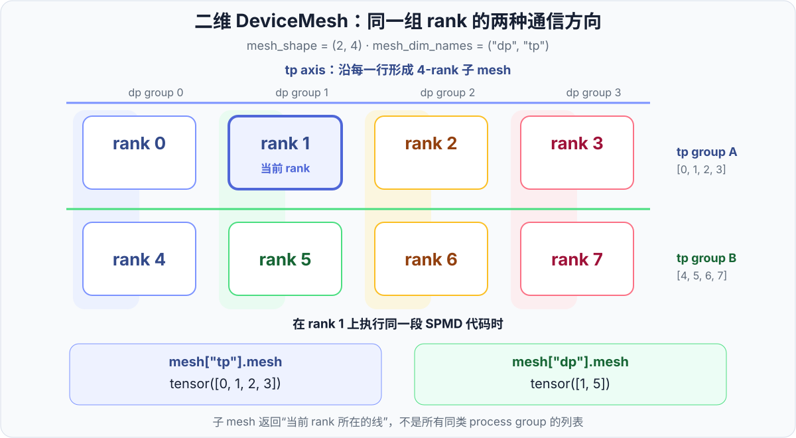
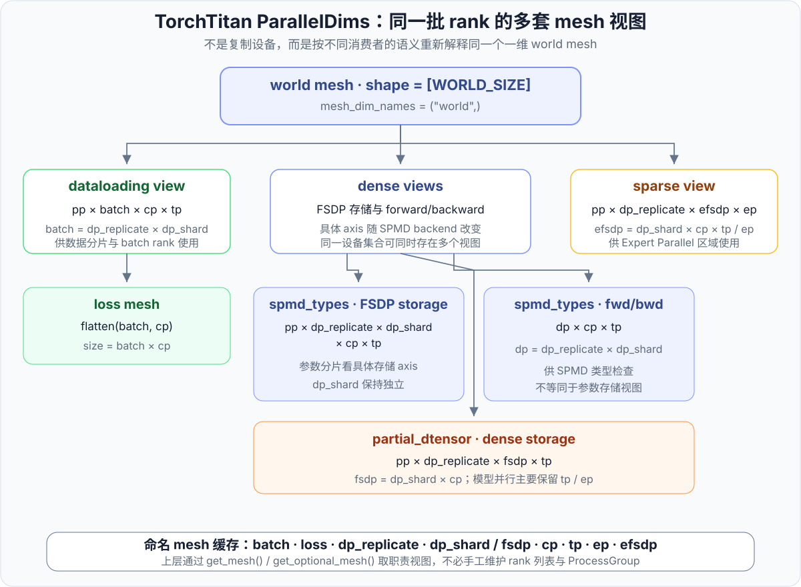

# 第 2 章 · DeviceMesh 与 Placement 详解

<div class="notebook-hero" markdown>

<span class="chapter-kicker">TorchTitan Framework · 第 2 章</span>

[第 1 章](01-dtensor.md)从 DTensor 的整体视角介绍了逻辑张量、本地 buffer 和分布规格。本章进一步拆开 `DTensorSpec`：`DeviceMesh` 负责描述 rank 的组织方式，`Placement` 负责描述张量在每个 mesh axis 上的分布状态。二者组合后，PyTorch 才能把一个逻辑张量映射到各 rank 的实际存储与通信。

</div>

!!! info "版本与实现范围"
    本文以 TorchTitan 提交 [`a3168782c`](https://github.com/pytorch/torchtitan/tree/a3168782c9a3a2e40afbd0de114818b96e2bda6e) 和 2026 年 8 月的 PyTorch `main` 分支为基准。TorchTitan 当前的 mesh 构造位于 [`parallel_dims.py`](https://github.com/pytorch/torchtitan/blob/a3168782c9a3a2e40afbd0de114818b96e2bda6e/torchtitan/distributed/parallel_dims.py)，模型布局声明则逐步迁移到 [`protocols/sharding.py`](https://github.com/pytorch/torchtitan/blob/a3168782c9a3a2e40afbd0de114818b96e2bda6e/torchtitan/protocols/sharding.py)。

    PyTorch 和 TorchTitan 都会使用 `_flatten()`、`_unflatten()` 等带下划线的内部接口。它们适合用于理解当前源码，但不应当作稳定的公共 API 依赖。

## 1. 先分清两个坐标系

DeviceMesh 与 Placement 最容易混淆的地方，是一句话里同时出现了两种“维度”：

- **mesh axis**：设备网格的轴，例如 `dp`、`tp`、`cp`；
- **tensor dimension**：张量自身的维度，例如 shape 为 `[B, S, H]` 时的 `B`、`S`、`H`。

在 PyTorch 公共 API 中，DeviceMesh 仍使用 `mesh_dim_names` 和 `mesh_dim` 这样的命名；TorchTitan 自己的注释和类型则倾向于用 **axis** 指设备网格轴，用 **dim** 指张量维度。

例如：

```python
placements = [Replicate(), Shard(0)]
```

若它绑定到 `mesh_dim_names=("dp", "tp")`，含义是：

| mesh axis | 对应 Placement | 张量语义 |
| --- | --- | --- |
| `dp` | `Replicate()` | 沿数据并行 axis 复制完整张量 |
| `tp` | `Shard(0)` | 沿张量第 0 维切分 |

这里 `placements[1]` 的索引 1 指 mesh 的 `tp` axis，`Shard(0)` 中的 0 则指张量第 0 维。Placement 列表的长度必须与 mesh 的 axis 数量一致：

\[
\lvert\text{placements}\rvert=\text{mesh.ndim}.
\]

## 2. DeviceMesh：把 rank 组织成有名字的网格

在传统分布式代码中，不同并行方向通常对应不同 `ProcessGroup`。DeviceMesh 在 ProcessGroup 之上增加了拓扑语义：先把 rank 排成一维或多维网格，再按 axis 自动取得当前 rank 所在的通信组。

它并不会描述真实网络交换机的连接关系，也不会自动选择最优的跨机映射。`mesh` 中 rank 的排列顺序就是通信分组的基础，因此调用者仍需让这个排列符合实际集群拓扑。

### 2.1 一维 mesh

假设 `WORLD_SIZE=4`，所有 rank 组成一条数据并行 axis：

```python
from torch.distributed.device_mesh import init_device_mesh

dp_mesh = init_device_mesh(
    device_type="cuda",
    mesh_shape=(4,),
    mesh_dim_names=("dp",),
)
```

此时 `dp_mesh.shape == (4,)`。将它传给支持 DeviceMesh 的分布式 API，就等于声明“这 4 个 rank 属于同一条 dp 通信轴”。

`init_device_mesh()` 遵循 SPMD 约定：所有 rank 必须以一致的 `mesh_shape` 和 `mesh_dim_names` 调用。不同 rank 使用不一致的 mesh 定义，可能导致进程组初始化或 collective 永久等待。

### 2.2 二维 `dp × tp` mesh

假设 `WORLD_SIZE=8`，希望使用 2 路数据并行和 4 路张量并行：

```python
world_mesh = init_device_mesh(
    device_type="cuda",
    mesh_shape=(2, 4),
    mesh_dim_names=("dp", "tp"),
)
```

按默认的连续 rank 排列，它可以写成：

```text
[[0, 1, 2, 3],
 [4, 5, 6, 7]]
```



*图 1：`tp` axis 沿行形成通信组，`dp` axis 沿列形成通信组。按名字切子 mesh 时，每个 rank 得到的是自己所在的那一行或那一列。*

对 rank 1 而言：

```python
tp_mesh = world_mesh["tp"]  # tensor([0, 1, 2, 3])
dp_mesh = world_mesh["dp"]  # tensor([1, 5])
```

所有进程执行的 Python 代码相同，但 `world_mesh["tp"].mesh` 和 `world_mesh["dp"].mesh` 会随当前 rank 改变。这正是“单程序、多数据”的 mesh 视图：返回的是当前 rank 所在的子 mesh，而不是所有同类进程组组成的列表。

### 2.3 多 axis 子 mesh 的顺序

多个 axis 可以一起切出一个多维子 mesh：

```python
mesh_3d = init_device_mesh(
    "cuda",
    mesh_shape=(2, 2, 2),
    mesh_dim_names=("dp", "pp", "cp"),
)

dp_cp_mesh = mesh_3d["dp", "cp"]
cp_dp_mesh = mesh_3d["cp", "dp"]
```

两次选择包含相同的 axis，但返回 mesh 的 axis 顺序不同：

```text
dp_cp_mesh.mesh_dim_names == ("dp", "cp")
cp_dp_mesh.mesh_dim_names == ("cp", "dp")
```

Placement 是按照这个顺序逐项绑定的，因此 axis 集合相同并不意味着两个 mesh 可以无条件互换。调试多维布局时，除了检查 `mesh.shape`，还必须检查 `mesh.mesh_dim_names`。

### 2.4 常用属性与方法

| 接口 | 返回内容 | 常见用途 |
| --- | --- | --- |
| `mesh.mesh` | 当前 mesh 中的 rank 排列表 | 检查分组 |
| `mesh.shape` / `mesh.ndim` | mesh 形状与 axis 数 | 检查拓扑 |
| `mesh.mesh_dim_names` | axis 名称及顺序 | 对齐 Placement |
| `mesh[name]` | 当前 rank 所在的命名子 mesh | 选择通信方向 |
| `mesh.size()` | 当前 mesh 的 rank 数 | 取得并行度 |
| `mesh.get_local_rank()` | 当前 rank 在该 mesh 中的局部编号 | 数据分片、stage 编号 |
| `mesh.get_group()` | 当前一维 mesh 对应的 ProcessGroup | 调用底层 collective |

二维或更高维 mesh 调用 `get_group()` 时，需要额外指定 mesh axis；对已经切出的一维子 mesh，可以直接调用。

### 2.5 Flatten 与 unflatten

有时多个物理或逻辑 axis 对上层消费者而言应被视为一条通信轴。例如 `batch` 与 `cp` 可以合并成计算 loss 所需的 `loss` mesh：

```python
loss_mesh = dataloading_mesh["batch", "cp"]._flatten("loss_mesh")
```

反过来，TorchTitan 会从一维 world mesh 创建具有多个命名 axis 的视图：

```python
view = world_mesh._unflatten(
    0,
    (pp, batch, cp, tp),
    ("pp", "batch", "cp", "tp"),
)
```

这两个操作改变的是**同一组 rank 的拓扑解释和进程组视图**，不是复制 GPU，也不是移动张量数据。它们带有下划线，属于当前实现依赖的内部能力；普通应用代码优先使用公开的 `init_device_mesh()` 与命名切片。

## 3. Placement：逐个 mesh axis 描述张量状态

DeviceMesh 只回答“rank 怎样分组”，Placement 才回答“张量在这条通信轴上怎样存放”。三种主要状态是：

| Placement | 当前 rank 的实际 buffer | 转为完整结果需要什么 |
| --- | --- | --- |
| `Replicate()` | 完整副本 | 已经完整 |
| `Shard(dim)` | 张量第 `dim` 维的一段 | `all_gather` |
| `Partial(reduce_op)` | 与结果同形状的局部贡献 | `all_reduce` 或 `reduce_scatter` |

第 1 章已经分别用 [Replicate、Shard 与 Partial 的存储图](01-dtensor.md#4-placement-mesh) 展示了三者的本地 buffer。本章关注它们与多维 DeviceMesh 结合时的逐轴语义。

### 3.1 一份 placements 描述多条通信轴

以下布局绑定到二维 `("dp", "tp")` mesh：

```python
from torch.distributed.tensor import Replicate, Shard, distribute_tensor

x = distribute_tensor(
    global_x,
    device_mesh=world_mesh,
    placements=[Replicate(), Shard(0)],
)
```

它表示：

1. `dp` axis 上是 Replicate，同一 dp 通信组内拥有完整逻辑副本；
2. `tp` axis 上是 Shard(0)，同一 tp 通信组内沿张量第 0 维切分。

因此，“这个张量是 Replicate 还是 Shard”在多维 mesh 上并没有唯一答案。准确说法必须带上 mesh axis：它在 dp axis 上复制，在 tp axis 上切分。

### 3.2 Partial 不是缺少一块数据

若每个 tp rank 分别计算：

\[
Y_r=X_rW_r^\mathsf{T},
\]

并且完整结果满足：

\[
Y=\sum_{r=0}^{p-1}Y_r,
\]

那么 `Y_r` 在 tp axis 上是 `Partial("sum")`。每个 `Y_r` 的 shape 通常与 `Y` 相同，只是数值尚未完成跨 rank 求和。它不同于 Shard：Shard 的各本地 buffer 在空间上拼接成完整张量，Partial 的各本地 buffer 则按 `reduce_op` 逐元素归约成完整张量。

当前 PyTorch 的 Partial 支持 `sum`、`avg`、`min`、`max` 和 `product` 等归约类型；具体可用范围仍取决于相关 DTensor 算子与后端。

### 3.3 不等长 Shard

`Shard(dim)` 遵循类似 `torch.chunk` 的切分语义。当张量维度不能整除 mesh 大小时，本地 shard 可能不等长，最后几个 shard 甚至可能为空。此时不能只用平均值推断本地 shape，应直接检查：

```python
import torch.distributed as dist

print(dist.get_rank(), x.to_local().shape)
```

若后续算子、模型并行实现或编译路径要求等长 shard，框架可能在更早阶段主动拒绝这种配置。PyTorch DTensor 能表达不等长 shard，不代表每个上层训练组件都支持它。

## 4. Redistribute：Placement 变化对应什么通信

`DTensor.redistribute()` 把目标布局声明为“想留下什么”，PyTorch 再根据源布局选择本地操作或 collective。

| 源布局 | 目标布局 | 典型实现 | 最终留下什么 |
| --- | --- | --- | --- |
| `Replicate` | `Shard(dim)` | 本地 `chunk` | 每个 rank 留一段 |
| `Shard(dim)` | `Replicate` | `all_gather` | 每个 rank 留完整副本 |
| `Shard(src)` | `Shard(dst)` | `all_to_all` | 换一个张量维度切分 |
| `Partial` | `Replicate` | `all_reduce` | 每个 rank 留归约后的完整结果 |
| `Partial` | `Shard(dim)` | `reduce_scatter` | 归约后每个 rank 留一段 |

这个表描述的是经典语义路径。实际执行还会受到 mesh 维数、异步通信、特殊 Placement、后端实现和编译优化影响。

### 4.1 一维示例

```python
import torch
from torch.distributed.device_mesh import init_device_mesh
from torch.distributed.tensor import Replicate, Shard, distribute_tensor

mesh = init_device_mesh(
    "cuda",
    mesh_shape=(4,),
    mesh_dim_names=("dp",),
)

global_x = torch.arange(
    8,
    device="cuda",
    dtype=torch.float32,
)

dt_shard = distribute_tensor(
    global_x,
    device_mesh=mesh,
    placements=[Shard(0)],
)

print(dt_shard.shape)            # torch.Size([8])
print(dt_shard.to_local().shape) # 通常为 torch.Size([2])
```

将它变回 Replicate：

```python
dt_replicated = dt_shard.redistribute(
    placements=[Replicate()],
)
```

此时的数据生命周期是：

1. 调用前，每个 rank 只有一个 shard；
2. `redistribute` 在 mesh 上执行 `all_gather`；
3. 调用后，每个 rank 留下完整的 8 个元素；
4. 返回值仍是 DTensor，只是 Placement 已变为 Replicate。

如果只需要当前 rank 的普通本地 Tensor，再显式调用 `to_local()`。`redistribute` 改变布局，`to_local()` 则移除 DTensor 外壳，两者职责不同。

### 4.2 重排布是有成本的

布局声明越抽象，越容易忽略通信实际发生的位置。阅读模型代码时应同时追踪：

- 当前张量的源 Placement；
- 算子或模块边界要求的目标 Placement；
- 这次转换会留下完整副本、分片还是局部贡献；
- 转换结果会常驻多久，是否马上又被重分片。

例如 `Shard → Replicate → Shard` 可能在语义上完全正确，却在热路径中引入一次参数或激活的完整聚合。Placement 解决的是正确性和组合性，不会自动保证布局计划具有最低通信量。

## 5. 当前 TorchTitan 如何构造 mesh

旧实现常被概括为“创建一个多维 world mesh，再从中切出 dp、tp、pp 子 mesh”。当前 TorchTitan 的结构更精确：

1. `ParallelDims` 保存并校验各并行度；
2. 先创建一个一维 `("world",)` root mesh；
3. 在同一批 rank 上 `_unflatten()` 出多套职责视图；
4. 缓存常用的一维和多维子 mesh；
5. 上层通过 `get_mesh()`、`get_optional_mesh()` 或 `resolve_mesh()` 按职责取用。

### 5.1 ParallelDims 先声明并行度

`ParallelDims` 的主要输入包括：

| 字段 | 含义 |
| --- | --- |
| `dp_replicate` | 数据并行复制度 |
| `dp_shard` | 数据并行参数分片度 |
| `cp` | Context Parallel 度 |
| `tp` | Tensor Parallel 度 |
| `pp` | Pipeline Parallel 度 |
| `ep` | Expert Parallel 度 |
| `world_size` | 全局 rank 数 |
| `spmd_backend` | `spmd_types` 或 `partial_dtensor` |

稠密区域首先满足：

\[
d_{\text{replicate}}
\times d_{\text{shard}}
\times d_{\text{cp}}
\times d_{\text{tp}}
\times d_{\text{pp}}
= \text{WORLD\_SIZE}.
\]

当 `dp_shard=-1` 时，TorchTitan 用剩余 world size 自动推导：

\[
d_{\text{shard}}
=
\frac{\text{WORLD\_SIZE}}
{d_{\text{replicate}}d_{\text{cp}}d_{\text{tp}}d_{\text{pp}}}.
\]

Expert Parallel 并不是再独立乘进上述等式。它从 `dp_shard × cp × tp` 覆盖的稀疏区域借用 rank，因此需要满足：

\[
d_{\text{ep}}
\mid
\left(d_{\text{shard}}d_{\text{cp}}d_{\text{tp}}\right).
\]

这一区分很重要：把 ep 直接当作与 dp、tp、pp 完全独立的笛卡尔轴，会错误计算 world size。

### 5.2 一维 root mesh 派生多套视图



*图 2：所有视图都引用同一批 rank。`dataloading`、`dense`、`sparse` 和 `loss` 只是为不同消费者建立的命名拓扑，不代表存在多份设备。*

当前实现先计算几个组合度：

\[
\begin{aligned}
d_{\text{batch}} &= d_{\text{replicate}}d_{\text{shard}},\\
d_{\text{fsdp}} &= d_{\text{shard}}d_{\text{cp}},\\
d_{\text{efsdp}} &= \frac{d_{\text{fsdp}}d_{\text{tp}}}{d_{\text{ep}}},\\
d_{\text{loss}} &= d_{\text{batch}}d_{\text{cp}}.
\end{aligned}
\]

然后建立以下主要视图：

| 视图 | axis 结构 | 主要消费者 |
| --- | --- | --- |
| dataloading | `pp × batch × cp × tp` | 数据加载、batch rank |
| loss | `flatten(batch, cp)` | loss 规约 |
| dense | 随 SPMD backend 变化 | FSDP 与稠密模型计算 |
| sparse | `pp × dp_replicate × efsdp × ep` | MoE / Expert Parallel |

### 5.3 两种 SPMD backend 的 dense 视图不同

默认 `spmd_types` 后端同时创建两种 dense 视图：

| 用途 | axis 结构 | 关注点 |
| --- | --- | --- |
| FSDP 参数存储 | `pp × dp_replicate × dp_shard × cp × tp` | `dp_shard` 保持为可识别的参数分片 axis |
| forward/backward 类型检查 | `dp × cp × tp` | `dp = dp_replicate × dp_shard` |

这意味着“模型计算看到的 dp axis”和“FSDP 参数实际按哪条 axis 存储”不是同一个口径。

`partial_dtensor` 后端则把 `dp_shard × cp` 折叠为一条 `fsdp` axis：

```text
pp × dp_replicate × fsdp × tp
```

其中 `fsdp = dp_shard × cp`。对模型并行部分，它主要让 `tp` 与 `ep` 进入 DTensor 的直接布局语义，其他轴由框架在外部管理。

### 5.4 为什么使用 get_mesh，而不是到处切 world_mesh

TorchTitan 会缓存命名 mesh：

```python
batch_mesh = parallel_dims.get_mesh("batch")
tp_mesh = parallel_dims.get_mesh("tp")
loss_mesh = parallel_dims.get_optional_mesh("loss")
```

`get_optional_mesh()` 在并行 axis 未启用时通常返回 `None`；`get_mesh()` 则在 mesh 不可用时抛出错误。FSDP、`dp_shard` 和 `efsdp` 存在少量 size-1 保留规则，用于混合精度或稀疏区域初始化，因此不能简单把“degree 为 1”一律理解成“mesh 一定不存在”。

缓存还保证同一职责重复查询时复用同一个 DeviceMesh 对象。当前 PyTorch 的一些 mesh 判断和 TorchTitan 的边界解析依赖稳定的 mesh 身份，因此这种复用不仅是性能优化。

## 6. Trainer 怎样消费这些 mesh

TorchTitan 的 [`Trainer.__init__`](https://github.com/pytorch/torchtitan/blob/a3168782c9a3a2e40afbd0de114818b96e2bda6e/torchtitan/trainer.py) 先初始化分布式环境，再从配置构造 `ParallelDims`：

```python
parallel_dims = ParallelDims.from_config(
    config.parallelism,
    world_size,
)
```

mesh 的实际构建是惰性的。第一次访问 `world_mesh` 或调用需要 mesh 的查询方法时，`build_mesh()` 才创建并缓存各视图。

数据并行启用后，Trainer 使用的不是一个含糊的 `"dp"` mesh，而是职责更明确的 `"batch"` mesh：

```python
if parallel_dims.dp_enabled:
    batch_mesh = parallel_dims.get_mesh("batch")
    dp_degree = batch_mesh.size()
    dp_rank = batch_mesh.get_local_rank()
else:
    dp_degree, dp_rank = 1, 0
```

这两个值继续参与：

- 数据集按 `dp_rank` 分片；
- 每一步全局 token 数和 batch 大小计算；
- 验证阶段的样本分配；
- 日志与部分只需单 rank 执行的逻辑。

其他消费者按职责获取不同 mesh：Pipeline Parallel 取 `pp`，Tensor Parallel 取 `tp`，loss 规约取 `loss`，FSDP 则依据 backend 取得 `dp_replicate + dp_shard` 或 `dp_replicate + fsdp` 视图。

## 7. Placement 在当前 TorchTitan 中怎样落地

旧式模型并行代码常直接在 `parallelize_module()` 的 plan 中写 `Replicate` 和 `Shard`。当前 TorchTitan 正在使用更统一的 `ShardingConfig`：

- `state_shardings`：参数和 buffer 的布局；
- `in_src_shardings` / `in_dst_shardings`：模块输入重排布前后的布局；
- `out_src_shardings` / `out_dst_shardings`：模块输出重排布前后的布局；
- `local_map`：需要暂时进入普通本地 Tensor 计算区域时的边界。

这些字段使用按 mesh axis 名称声明的 `SpmdType`。真正应用到 DTensor 前，`resolve_placements()` 会：

1. 根据 layout 中的 axis 名找到对应 mesh；
2. 按 `mesh.mesh_dim_names` 的实际顺序生成 Placement tuple；
3. 检查所有需要的 mesh axis 是否都有声明；
4. 将 size-1 axis 上的 Shard 或 Partial 规范化为 Replicate。

随后 `Module.parallelize()` 按时间顺序完成：

```text
递归处理子模块
    → 分发参数和 buffer
    → 重排布输入
    → 执行 forward / 可选 local_map
    → 重排布输出
```

在 `partial_dtensor` 路径中，这些布局会解析为 DTensor Placement；在默认 `spmd_types` 路径中，相同的 axis 级声明用于分发状态、建立本地 SPMD 类型并验证边界。模型配置表达的是“张量在哪些 axis 上如何分布”，具体运行时表示由 backend 决定。

## 8. 调试 DeviceMesh 与 Placement

### 8.1 先检查 mesh

```python
print("mesh          :", mesh.mesh)
print("shape         :", mesh.shape)
print("axis names    :", mesh.mesh_dim_names)
print("local rank    :", mesh.get_local_rank())
```

重点确认：

1. 所有 rank 是否用相同的 mesh 定义进入 SPMD 初始化；
2. rank 排列是否符合预期的机内、机间通信方向；
3. 子 mesh 返回的是否是当前 rank 所在的那条线；
4. 多 axis 子 mesh 的顺序是否与 Placement 顺序一致。

### 8.2 再检查张量

```python
print("global shape :", tuple(x.shape))
print("local shape  :", tuple(x.to_local().shape))
print("placements   :", x.placements)
print("device mesh  :", x.device_mesh)
```

重点确认：

1. Placement 数量是否等于 `mesh.ndim`；
2. `Shard(dim)` 的 dim 是否指向正确的张量维度；
3. Partial 是否被误当作张量切片；
4. 不等长 shard 是否被上层组件支持；
5. 模块边界是否发生了意外的 `Shard → Replicate`；
6. 当前查看的是参数存储 mesh、模型计算 mesh，还是数据加载 mesh。

## 9. 小结

DeviceMesh 把 rank 组织成具有名字和顺序的通信 axis，Placement 则逐轴描述张量是复制、切分还是等待归约。多维布局必须同时说明 mesh axis 与 tensor dimension，不能只说“这个张量是 Shard”。

当前 TorchTitan 的 `ParallelDims` 先校验并行度，再从一维 world mesh 派生 dataloading、loss、dense 和 sparse 等多套职责视图。默认 `spmd_types` 还会区分 FSDP 参数存储视图与 forward/backward 类型检查视图；`partial_dtensor` 则把 `dp_shard × cp` 折叠为 `fsdp` axis。上层代码通过命名 mesh 和 axis 级布局声明工作，不需要在各处手写 rank 列表与 ProcessGroup。

---

上一章：[DTensor 原理与使用](01-dtensor.md)
