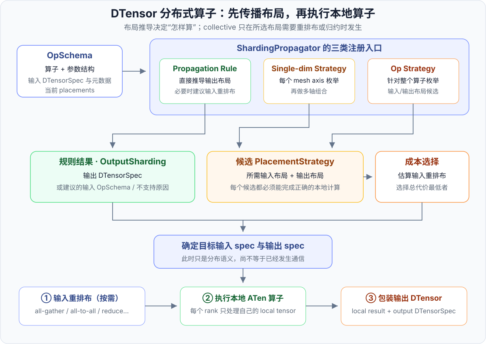
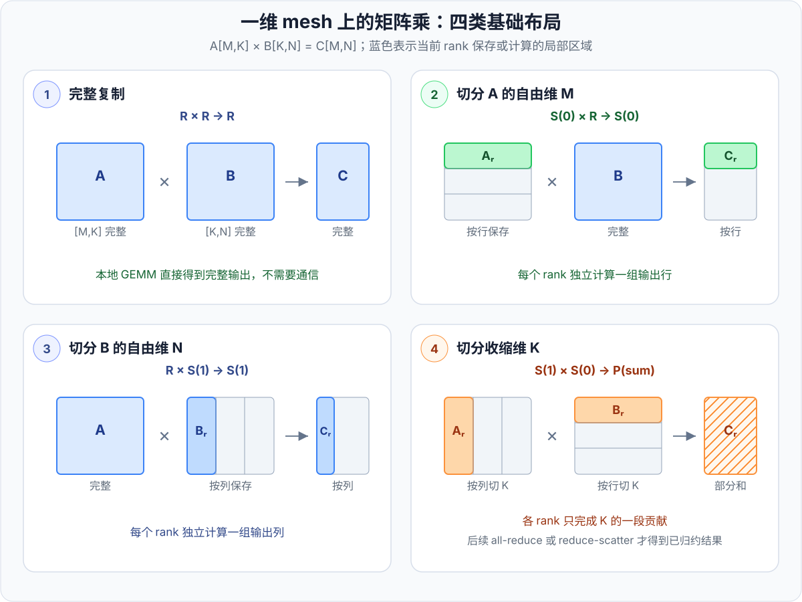

# 第 3 章 · 分布式算子与分片传播

<div class="notebook-hero" markdown>

<span class="chapter-kicker">TorchTitan · partial_dtensor 路线 · 第 3 章</span>

[第 1 章](01-dtensor.md)建立了 DTensor 的全局张量视角，[第 2 章](02-device-mesh-placement.md)说明了 DeviceMesh 与 Placement 怎样描述数据布局。本章继续回答下一个问题：当两个具有分布布局的张量进入同一个算子时，PyTorch 怎样判断本地计算是否合法、输出应采用什么布局，以及是否需要插入集合通信。

从这里开始，专题进入 `partial_dtensor` 路线。张量在模型并行计算中以 DTensor 携带 Placement，算子通过 DTensor dispatcher 和分片传播决定怎样执行。默认 `spmd_types` 后端使用的是“本地 Tensor + SPMD 类型 + 显式 collective”，它的算子语义会放在单独的篇章中讲解。

</div>

!!! info "版本与阅读范围"
    本文以 2026 年 8 月的 PyTorch `main` 分支为阅读基准，主要对应 [`_sharding_prop.py`](https://github.com/pytorch/pytorch/blob/main/torch/distributed/tensor/_sharding_prop.py)、[`_ops`](https://github.com/pytorch/pytorch/tree/main/torch/distributed/tensor/_ops)、[`_redistribute.py`](https://github.com/pytorch/pytorch/blob/main/torch/distributed/tensor/_redistribute.py) 与 [`_collective_utils.py`](https://github.com/pytorch/pytorch/blob/main/torch/distributed/tensor/_collective_utils.py)。这些以下划线开头的文件属于内部实现，名称和细节可能继续变化。

    本章只讨论 `partial_dtensor` 路线依赖的 **DTensor 算子语义**。其中的矩阵乘分片规律和 collective 含义仍可帮助理解 `spmd_types`，但 `ShardingPropagator`、`OpStrategy` 与自动重排布并不是两种后端共用的运行时调用链。

## 1. 分布式算子的额外职责

单卡矩阵乘只需要确认输入 shape、dtype 和 device 合法，然后执行本地 GEMM。DTensor 算子还必须同时处理每个输入的 `DTensorSpec`。对一个抽象算子

\[
y=\operatorname{op}(x_1,x_2,\ldots,x_n),
\]

分布式执行需要回答四个问题：

1. 当前各 rank 保存的本地张量能否直接执行这个算子；
2. 如果不能，输入应先重排布成什么布局；
3. 本地算子执行后，结果对应 `Replicate`、`Shard` 还是 `Partial`；
4. 多个合法方案同时存在时，应选择哪一个。

这一步称为 **分片传播**（sharding propagation）：输入不仅传播 shape 和 dtype，也传播设备网格与 Placement。其结果不是一段独立的分布式 kernel，而是一份“目标输入布局 + 输出布局”的执行约定。



*图 1：分片传播先确定输入与输出的 `DTensorSpec`；只有当前输入不满足所选方案时才执行重排布。`Partial` 也可以作为合法输出继续向后传播，因此 collective 不一定紧邻当前算子。*

需要特别区分两个时刻：

- **推导布局**只是在元数据层面决定怎样执行；
- **实现布局**才会切本地张量或发起 `all_gather`、`all_reduce`、`reduce_scatter` 等 collective。

因此，“这是一个分布式算子”并不等于“这个算子一定通信”。若当前输入已经满足目标布局，各 rank 只需执行本地 ATen 算子；若结果可继续保持 Partial，归约还可以被延后到真正需要完整值的位置。

## 2. 分片传播的三类注册机制

从决策方式看，分片传播可以分为“直接推导”和“枚举后选择”。当前 `ShardingPropagator` 根据算子特征提供三类注册入口：

| 注册方式 | 输入视角 | 产出 | 适合的算子 |
| --- | --- | --- | --- |
| `register_prop_rule` | 一个具体 `OpSchema` | `OutputSharding` | 输出布局几乎由当前输入唯一确定的算子 |
| `register_op_strategy` | 输入的 `OpStrategy` | 多个 `PlacementStrategy` | 需要联合考虑多输入、多输出或多种合法布局的算子 |
| `register_single_dim_strategy` | 单个 mesh axis 上的布局签名 | 扩展后的多轴候选 | 各 mesh axis 可以近似独立分析的算子 |

这里的几个内部类型分别表示：

- `OpSchema`：当前算子、普通参数、输入 DTensor 布局和 tensor metadata；
- `OutputSharding`：规则推导出的输出 spec，也可以携带建议的输入 schema 或失败原因；
- `OpStrategy`：某个输入或输出可能采用的一组策略；
- `PlacementStrategy`：一个具体候选，包括要求的输入 spec、产生的输出 spec 和输入重排布成本。

这三类注册方式不是互斥的“运行模式”。同一个算子可以同时保留规则和策略注册。例如，当前卷积实现既包含传播规则，也包含单 mesh axis 策略；在分片传播选择路径中，策略注册优先。阅读源码时，应根据注册表和实际调用路径判断，不能只凭文件中出现了 `register_prop_rule` 就认定算子永远走规则。

如果算子没有直接注册，框架还可能尝试已有分解；没有合法规则、策略或分解时，才会报告不支持。是否退回全复制也取决于该算子的具体实现，并不是 Rule 路径统一保证的行为。

## 3. Propagation Rule：直接推导输出布局

传播规则接收当前 `OpSchema`，检查输入布局和参数，再直接产生 `OutputSharding`。以 [`aten.convolution` 的实现](https://github.com/pytorch/pytorch/blob/main/torch/distributed/tensor/_ops/_conv_ops.py)为例，删去 shape 校验等细节后，其结构可以概括为：

```python
@register_prop_rule(aten.convolution.default)
def convolution_rules(op_schema: OpSchema) -> OutputSharding:
    input_spec, weight_spec, bias_spec, *args = op_schema.args_schema

    # 检查输入布局，并根据卷积参数推导输出 tensor metadata
    output_spec = ...

    return OutputSharding(output_spec)
```

规则路径的核心不是“把任意输入强制变成 Replicate”，而是确定以下三种结果之一：

1. 当前布局合法，直接给出输出 `DTensorSpec`；
2. 当前布局不能直接算，但存在可接受的输入布局，于是给出 schema suggestion，供框架重排布后重试；
3. 该组合无法支持，返回失败原因。

它适合布局关系确定、候选数量很少的算子。优点是行为明确，算子的特殊约束容易表达；代价是每一种新布局都需要规则作者显式覆盖。

## 4. Strategy：枚举候选并选择布局

策略路径不会立即决定唯一结果，而是先枚举数学上和布局上均合法的候选。随后，框架计算“当前输入 → 每个候选要求的输入布局”的成本，选择总代价最低者。

### 4.1 一维 mesh 上的矩阵乘

设

\[
A\in\mathbb{R}^{M\times K},\qquad
B\in\mathbb{R}^{K\times N},\qquad
C=AB\in\mathbb{R}^{M\times N}.
\]

`M` 和 `N` 只出现在输出中，称为 **自由维**（free dimension）；`K` 在乘法中被求和消去，称为 **收缩维**（contracting dimension）。在一维 mesh 上，简单矩阵乘最容易理解的四类候选是：

| 候选 | `A` 的 Placement | `B` 的 Placement | `C` 的 Placement | 本地计算含义 |
| --- | --- | --- | --- | --- |
| 完整复制 | `R` | `R` | `R` | 每个 rank 计算完整 `C` |
| 切分 `M` | `S(0)` | `R` | `S(0)` | 每个 rank 计算一组输出行 |
| 切分 `N` | `R` | `S(1)` | `S(1)` | 每个 rank 计算一组输出列 |
| 切分 `K` | `S(1)` | `S(0)` | `P(sum)` | 每个 rank 计算 `K` 的一段贡献 |

表中 `R`、`S(d)` 和 `P(sum)` 分别是 `Replicate()`、`Shard(d)` 和 `Partial("sum")` 的简写。



*图 2：沿自由维切分会自然传递到输出；沿收缩维 `K` 切分时，各 rank 得到的是同形状的局部乘积，必须按 sum 归约，所以输出是 Partial 而不是 Shard。*

第四种布局可以写成

\[
C_r=A_rB_r,\qquad
C=\sum_{r=0}^{p-1}C_r.
\]

`C_r` 的 shape 与完整 `C` 相同，但它只包含 rank `r` 负责的那段 `K` 的贡献。这正是 `Partial("sum")` 的含义。后续若需要复制结果，可执行 `all_reduce`；若下一步希望直接得到分片结果，则可以执行 `reduce_scatter`。

### 4.2 本地可计算性与全局布局完整性

原始输入还有一些看似自然、实际需要先调整的组合：

- `A: S(1), B: R`：本地 `A` 的 `K` 长度是 `K/p`，完整 `B` 的收缩维仍是 `K`，本地 shape 不匹配；
- `A: R, B: S(0)`：原因相同，只是缺少匹配的 `A` 收缩维分片；
- `A: S(0), B: S(1)`：单个 rank 可以算一个 `C` 的行列块，但一维 mesh 的一个 rank 索引同时控制行块和列块，只覆盖 `p` 个“对角”块，无法覆盖完整输出所需的 `p^2` 个块。

最后一种不是矩阵乘在数学上非法，而是**一维设备坐标不足以表达二维输出分片**。在二维 mesh 上，让一个 axis 切 `M`、另一个 axis 切 `N`，就能得到合法的 `C: [S(0), S(1)]`。

## 5. 多维 mesh：逐轴候选的笛卡尔积

矩阵乘及 einsum 的通用候选生成位于 [`_einsum_strategy.py`](https://github.com/pytorch/pytorch/blob/main/torch/distributed/tensor/_ops/_einsum_strategy.py)。其基本思路是：

1. 分析 einsum 中的 batch 维、自由维和收缩维；
2. 为一个 mesh axis 枚举可能的 Placement；
3. 对所有 mesh axis 的单轴候选做笛卡尔积；
4. 过滤不满足 shape、可整除性或布局约束的组合。

对于上一节这个不含 batch 维的简单 `mm`，若每个 mesh axis 只考虑四类基础方案，那么二维 mesh 在过滤前有

\[
4^2=16
\]

个组合。例如：

```text
mesh axes                 axis-0            axis-1

A placements              Shard(0)          Replicate()
B placements              Replicate()       Shard(1)
C placements              Shard(0)          Shard(1)
```

这对应二维输出块：第一个 mesh axis 分担 `M`，第二个 mesh axis 分担 `N`。另一个组合是：

```text
A placements              Shard(1)          Shard(1)
B placements              Shard(0)          Shard(0)
C placements              Partial(sum)      Partial(sum)
```

此时 `K` 沿两个 mesh axis 连续切分，输出在两条 axis 上都是局部贡献，最终需要在两条通信轴上完成归约。

`4^d` 只是帮助理解简单矩阵乘的计数方式，不是所有 einsum 的固定策略数。实际生成器还要考虑 batch 维、已有 Partial 的线性传播、重复策略和符号 shape 等条件，候选数量会随算子语义变化。

## 6. 成本选择：计算的是输入重排布代价

设当前第 `i` 个输入的 spec 是 \(S_i^{\text{cur}}\)，候选策略要求的 spec 是 \(S_i^{\text{req}}\)。策略选择器比较的主要量是

\[
\operatorname{Cost}(\text{strategy})
=
\sum_i
\operatorname{RedistributeCost}
\left(
S_i^{\text{cur}}\rightarrow S_i^{\text{req}}
\right).
\]

这里比较的是**采用候选前需要付出的输入重排布成本**，不是整个算子的运行时间。GEMM 的计算时间、后续算子消费 Partial 时的归约，以及通信计算重叠通常不在这个简单求和中。

常见的单 axis Placement 变换可作如下理解：

| 当前布局 → 目标布局 | 常见实现 | 数据生命周期 |
| --- | --- | --- |
| `R → R`、`S(d) → S(d)` | 无操作 | 直接复用本地 buffer |
| `R → S(d)` | 本地切分 | 每个 rank 从已有完整副本中取自己的 chunk，通常不通信 |
| `S(d) → R` | `all_gather` | 收集各 rank 的不同 shard，形成完整副本 |
| `S(a) → S(b)` | `all_to_all` 或等价组合 | 重新划分张量维度 |
| `P(sum) → R` | `all_reduce` | 汇总各 rank 的同形状贡献 |
| `P(sum) → S(d)` | `reduce_scatter` | 归约贡献并只保留目标 shard |

表格描述的是典型语义，不是对所有 dtype、reduce op、非均匀 shard 和多维 mesh 的实现承诺。复杂重排布可能被拆成多步，也可能经过局部变换优化。

### 6.1 以 all-gather 的启发式模型为例

当前 [collective cost model](https://github.com/pytorch/pytorch/blob/main/torch/distributed/tensor/_collective_utils.py) 以同构 GPU、NCCL 和环形 collective 等假设估算通信时间。设：

- `n`：当前 mesh axis 上的设备数；
- `B`：本次估算涉及的通信负载，单位 GB；它根据当前分片后的本地数据量计算，不应直接等同于逻辑全局张量大小；
- `L`：该 mesh axis 的单 hop 延迟，单位微秒；
- `BW`：该 mesh axis 的估算带宽，单位 GB/s。

`all_gather` 的估算可写为

\[
\begin{aligned}
\text{hops} &= n-1,\\
\text{latency} &= 6.6 + (n-1)L,\\
\text{bandwidth time}
&=
\frac{B(n-1)/n}{BW}\times 10^6,\\
\text{cost}
&=
\text{latency}+\text{bandwidth time}.
\end{aligned}
\]

其中 `6.6` 是模型中的基础启动开销，最终 cost 单位为微秒。\(B(n-1)/n\) 对应环形 all-gather 中每个 rank 需要接收的其他分片总量。`all_reduce`、`reduce_scatter` 等原语使用相似的 hop、延迟和带宽项估算。

!!! warning "成本模型不是 profiler"
    这套模型的用途是让候选策略**相对排序**，不是预测某台机器上的真实延迟。GPU 型号、NVLink/PCIe/InfiniBand 拓扑、NCCL 算法、消息分块、并发流和通信计算重叠都会让 profiler 结果偏离估算。排查性能时，应同时查看实际 collective、消息量和时间线，不能把这里的微秒值当作基准测试结果。

### 6.2 策略选择与重排布路径规划

源码中存在两个相邻但不同的决策：

1. [`_sharding_prop.py`](https://github.com/pytorch/pytorch/blob/main/torch/distributed/tensor/_sharding_prop.py) 在多个算子候选中，选择输入重排布总代价较小的布局策略；
2. [`_redistribute.py`](https://github.com/pytorch/pytorch/blob/main/torch/distributed/tensor/_redistribute.py) 在源布局已经确定、目标布局已经确定后，规划用哪些 Placement 变换和 collective 实现这次重排布。

前者回答“这个算子采用哪个输入/输出布局”，后者回答“选定布局后具体怎样从 A 走到 B”。后者会根据布局形态使用贪心步骤或图搜索等实现，因此不能把策略选择器里的一条简化成本映射，当作 `DTensor.redistribute()` 支持路径的完整清单。

## 7. 从策略结果到一次真实执行

把前面的概念按时间顺序串起来，一次 DTensor 算子调用大致经历：

1. 从算子调用和 DTensor 参数构造 `OpSchema`；
2. 查找对应的 rule、single-dim strategy 或 op strategy；
3. 推导唯一结果，或展开候选并选择成本较低者；
4. 当前输入 spec 与目标输入 spec 不一致时，执行必要的重排布；
5. 将本地 tensor 交给普通 ATen 算子；
6. 用选定的输出 `DTensorSpec` 包装本地结果。

以收缩维切分的矩阵乘为例：

```text
A: Shard(1), B: Shard(0)
        ↓ 每个 rank 的本地 GEMM
C_local: 完整 shape 的局部贡献
        ↓ 暂时不归约
C: Partial("sum")
        ↓ 后续消费者需要 Shard(0)
reduce_scatter
        ↓
C: Shard(0)
```

这条时间线说明了 Partial 的工程价值：它把“本地计算已经完成”和“跨 rank 归约已经完成”分成两个状态。只要后续算子支持 Partial 的线性传播，归约就不必立刻发生；真正需要非线性运算或完整值时，再把它转换为 Replicate 或 Shard。

## 8. 为自定义算子注册分片策略

PyTorch 提供实验性的 [`register_sharding()`](https://docs.pytorch.org/docs/stable/distributed.tensor.html#torch.distributed.tensor.experimental.register_sharding)，用于：

- 为尚无 DTensor 支持的自定义算子声明合法布局；
- 覆盖已有算子的默认布局选择。

下面以 softmax 为例。若归一化维被切分，每个 rank 只看到一部分元素，本地最大值与分母都不是全局值；在不额外设计跨 rank 归约的前提下，只能切分 softmax 维以外的维度。

```python
from torch.distributed.tensor import Replicate, Shard
from torch.distributed.tensor.experimental import register_sharding
from torch.ops import aten


@register_sharding(aten._softmax.default)
def custom_softmax_sharding(x, dim, half_to_float):
    softmax_dim = dim if dim >= 0 else dim + x.ndim

    strategies = [
        ([Replicate()], [Replicate(), None, None]),
    ]

    for shard_dim in range(x.ndim):
        if shard_dim == softmax_dim:
            continue
        strategies.append(
            ([Shard(shard_dim)], [Shard(shard_dim), None, None])
        )

    return strategies
```

每个元素都是 `(output_placements, input_placements)`。`dim` 和 `half_to_float` 是普通标量参数，因此对应 `None`；张量 `x` 才具有 Placement。

注册前应先明确三件事：

1. 每个候选的本地张量 shape 是否真的满足算子；
2. 输出 Placement 是否准确描述了所有 rank 的结果；
3. 需要全局信息的维度是否遗漏了 collective。

仅仅让本地 kernel 能运行并不代表分布式语义正确。`register_sharding()` 目前仍是实验性 API，生产代码还应固定 PyTorch 版本并添加多 rank 数值测试。

## 9. 小结

DTensor 分布式算子的核心任务，是根据输入 `DTensorSpec` 找到合法且成本合适的输入/输出布局。当前 `ShardingPropagator` 同时支持 propagation rule、op strategy 和 single-dim strategy；前者直接推导结果，后两者枚举候选并比较输入重排布成本。

矩阵乘展示了布局传播最基本的规律：切自由维会把 Shard 传到输出，切收缩维会产生 Partial。多维 mesh 则把各 axis 的单维候选组合起来，使行切、列切和收缩维切分能够同时表达。策略选择只决定采用哪个布局，`redistribute` 规划才负责把源布局真正变成目标布局；其启发式通信成本用于候选排序，不能替代真实 profiler。

---

上一章：[DeviceMesh 与 Placement 详解](02-device-mesh-placement.md) · 下一章：[使用 ColwiseParallel 切分模型](04-colwise-parallel.md)
