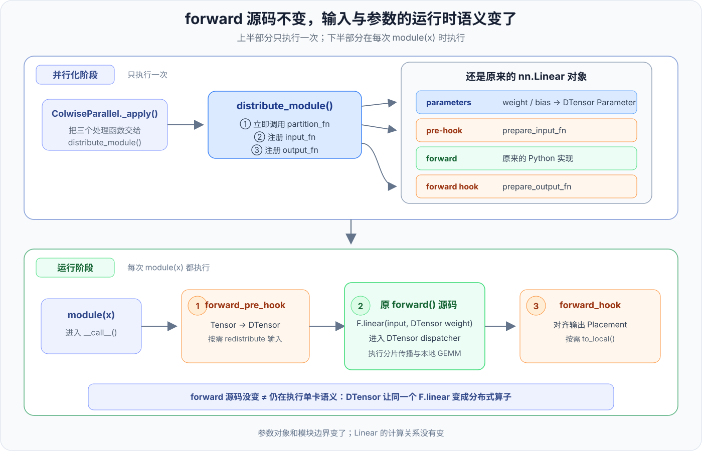
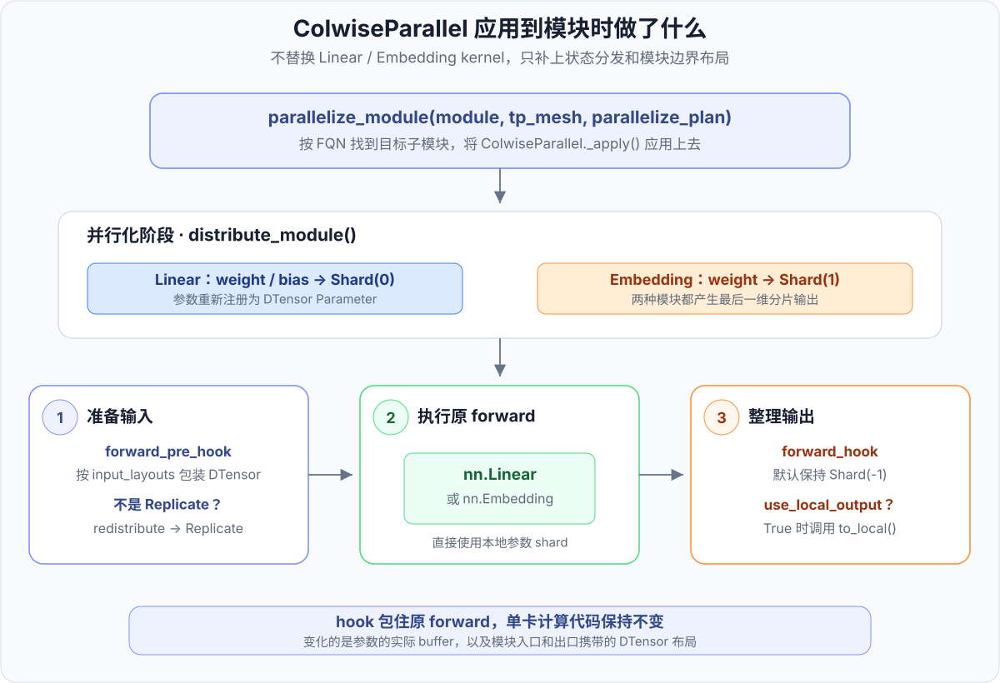

# 第 4 章 · 使用 ColwiseParallel 切分模型

<div class="notebook-hero" markdown>

<span class="chapter-kicker">TorchTitan · partial_dtensor 路线 · 第 4 章</span>

前三章，我们依次讲了：

1. DTensor 在普通 Tensor 之外，还记录了逻辑全局张量的信息；
2. 这些信息通过 DeviceMesh 和 Placement 表示：DeviceMesh 确定设备拓扑，Placement 描述张量在拓扑上的分布；
3. 两个 DTensor 进入同一个算子后，怎样选择分片策略，并在多卡上完成计算。

有了这些地基，本章继续沿 `partial_dtensor` 路线看看如何切分模型。模型切分包含 TP、SP、EP 等不同方向，这一章先从最基础的 `ColwiseParallel` 入手，看看 PyTorch 如何把一层 Linear 变成可以直接使用 DTensor 分片参数计算的模块。

</div>

!!! info "版本与阅读范围"
    本文以 2026 年 8 月的 PyTorch `main` 分支和 TorchTitan 提交 [`a3168782c`](https://github.com/pytorch/torchtitan/tree/a3168782c9a3a2e40afbd0de114818b96e2bda6e)为基准。PyTorch 公共接口可对照 [Tensor Parallel API](https://docs.pytorch.org/docs/stable/distributed.tensor.parallel.html)与 [`style.py`](https://github.com/pytorch/pytorch/blob/main/torch/distributed/tensor/parallel/style.py)。

    列并行本身的计算原理不在这里重复。输入为什么需要复制、权重和输出怎样切分，以及 Column→Row 为什么能省掉中间通信，可以先阅读仓库已有的 [Tensor Parallel：列切与行切](../training/parallelism/03-tp.md#linear)。本章只关心一个更具体的问题：`ColwiseParallel` 怎样把这些布局应用到 PyTorch 模块，以及当前 TorchTitan 的 `partial_dtensor` 后端怎样执行相同的布局声明。

## 1. ColwiseParallel 把哪些动作包了起来

第 3 章中的分片传播处理的是一次算子调用。切分一个 `nn.Module` 还要再往外走一步，同时处理：

1. 模块参数怎样分发；
2. 输入进入模块前是什么布局；
3. 输出离开模块时保留什么布局；
4. 模块边界是否返回普通 Tensor。

`ColwiseParallel` 是 PyTorch 提供的一种 `ParallelStyle`。对 `nn.Linear` 来说，它的默认约定是：

| 对象 | 默认 Placement |
| --- | --- |
| 输入 | `Replicate()` |
| `weight` | `Shard(0)` |
| `bias` | `Shard(0)` |
| 输出 | `Shard(-1)` |

这里最重要的一点是：`ColwiseParallel` 不会生成一个新的 Linear，也不会改写原来那段单卡 `forward()`。它做的是两类外围改造：

1. 在并行化阶段，用分片后的 DTensor Parameter 替换原参数；
2. 在运行阶段，用 `forward_pre_hook` 准备输入，再用 `forward_hook` 整理输出。

所以模块真正执行时，调用顺序是：

```text
forward_pre_hook：Tensor → DTensor，并对齐输入 Placement
        ↓
原来的 nn.Linear.forward()：代码不变，F.linear 进入 DTensor dispatch
        ↓
forward_hook：对齐输出 Placement，按需执行 to_local()
```

这也是 `ParallelStyle` 能直接套在普通单卡模型上的原因：模型作者仍然写普通的 PyTorch 模块和 `forward()`，并行逻辑从模块边界插进去。这里“不改 forward”只表示 Python 源码没有变，并不表示运行时还在调用单卡算子：hook 准备出的输入和 `partition_fn` 替换后的参数都是 DTensor，同一行 `F.linear(input, weight, bias)` 会进入 DTensor dispatcher，按第 3 章介绍的分片传播执行本地 GEMM，并在布局需要时安排重排布。



*图 1：并行化时，`distribute_module()` 只分发一次参数，并将输入、输出处理函数注册到原模块；运行时依次触发 pre-hook、原 forward 和 forward hook。原 forward 的源码没有被替换，但其中的 `F.linear` 接收到 DTensor 后，会按分布式算子语义执行。*

这里有一个容易看懵的地方：仓库的 TP 文章使用 \(Y=XW\)，列切对应切 \(W\) 的输出维；PyTorch 的 `nn.Linear` 实际保存的是转置形式的 `weight[out_features, in_features]`，所以落到代码里是 `weight: Shard(0)`。这是存储方向不同，不是两套列并行定义。

当前 `ColwiseParallel` 支持 `nn.Linear` 和 `nn.Embedding`。两者的输出都沿最后一维切分，但参数的存储方向不同：

- Linear 的 `weight` 和 `bias` 沿第 0 维切分；
- Embedding 的 `weight[vocab_size, embedding_dim]` 沿第 1 维切分。

## 2. 用公共 API 切一层 Linear

下面先用 PyTorch 公共 API 切一个 Linear。示例假设程序通过 `torchrun --nproc-per-node=4` 启动，各进程已经绑定到自己的 CUDA device。

```python
import torch
import torch.distributed as dist
import torch.nn as nn

from torch.distributed.device_mesh import init_device_mesh
from torch.distributed.tensor.parallel import (
    ColwiseParallel,
    parallelize_module,
)


class Projection(nn.Module):
    def __init__(self, hidden_size: int, out_features: int):
        super().__init__()
        self.proj = nn.Linear(hidden_size, out_features, bias=True)

    def forward(self, x):
        return self.proj(x)


tp_mesh = init_device_mesh(
    "cuda",
    mesh_shape=(dist.get_world_size(),),
    mesh_dim_names=("tp",),
)

model = Projection(hidden_size=4096, out_features=11008).cuda()
model = parallelize_module(
    model,
    tp_mesh,
    {
        "proj": ColwiseParallel(use_local_output=False),
    },
)
```

`parallelize_plan` 的 key 是子模块的 fully qualified name（FQN），value 是要应用的 `ParallelStyle`。这里的 `"proj"` 会找到 `model.proj`，然后把 `ColwiseParallel` 应用到这层 Linear。若传入对象本身就是一个 Linear，也可以把 `ColwiseParallel()` 直接作为 plan。

`parallelize_module()` 只接受一维 DeviceMesh。如果训练已经建立了多维 world mesh，需要先取出 TP 子 mesh：

```python
tp_mesh = world_mesh["tp"]
model = parallelize_module(model, tp_mesh, parallelize_plan)
```

示例将 `use_local_output` 设为 `False`，所以输出继续保留 DTensor。这样可以直接对照逻辑 shape 和本地 buffer：

```python
weight = model.proj.weight
print(weight.shape)                    # 逻辑 shape: [11008, 4096]
print(weight.to_local().shape)         # 本地 shape: [11008 / tp, 4096]

x = torch.randn(32, 4096, device="cuda")
y = model(x)
print(y.shape)                         # 逻辑 shape: [32, 11008]
print(y.placements)                    # (Shard(dim=-1),)
print(y.to_local().shape)              # 本地 shape: [32, 11008 / tp]
```

`weight.shape` 和 `y.shape` 仍然是逻辑全局 shape；真正占用当前 GPU 显存的是 `to_local()` 返回的分片。这里正好把前三章的抽象落到了一个模型模块上。



*图 2：`parallelize_module()` 先分发参数，再把输入处理函数注册为 `forward_pre_hook`、输出处理函数注册为 `forward_hook`。训练时执行的仍是原来的 Linear 或 Embedding forward。*

## 3. 三个布局参数分别控制什么

`ColwiseParallel` 最常用的参数只有三个：

| 参数 | 默认值 | 控制的事情 |
| --- | --- | --- |
| `input_layouts` | `Replicate()` | 告诉框架，模块入口处的输入当前是什么布局 |
| `output_layouts` | `Shard(-1)` | 指定模块出口希望保留什么布局 |
| `use_local_output` | `True` | 决定返回 DTensor，还是当前 rank 的普通本地 Tensor |

### 3.1 `input_layouts` 描述“进来时是什么”

Colwise Linear 真正计算时需要 Replicate 输入。默认 `input_layouts=Replicate()`，说明输入本来就已经复制，不需要重排布。

如果调用方传入的是 sequence shard，可以这样声明：

```python
ColwiseParallel(
    input_layouts=Shard(0),
    output_layouts=Shard(-1),
)
```

这句话不是让 Linear 直接拿 `Shard(0)` 输入计算，而是告诉框架：

```text
模块入口处：Shard(0)
    → redistribute
本地 Linear 前：Replicate()
```

因此，`input_layouts=Shard(0)` 会在前向入口引入一次 all-gather。它常用于把 sequence-parallel 激活送进列并行投影。

默认 Replicate 也只是一个布局声明。若传入的是普通 Tensor，PyTorch 会把各 rank 的本地输入包装成 Replicate DTensor，但不会逐元素验证各 rank 的值真的一致。程序需要自己保证这些本地 Tensor 确实表示同一份逻辑输入。

### 3.2 `output_layouts` 决定“出去时留下什么”

Linear 本地计算自然得到最后一维 shard，默认 `output_layouts=Shard(-1)`，因此模块出口不需要通信。

若写成

```python
ColwiseParallel(output_layouts=Replicate())
```

框架会在模块出口把各 rank 的输出分片 all-gather 成完整输出。这样下游使用更省心，但也提前付出了通信和激活显存。

### 3.3 `use_local_output` 只改变返回对象

`use_local_output=True` 会调用 `to_local()`，返回当前 rank 的普通 Tensor；`False` 则继续返回 DTensor。

它不会改变实际布局。默认返回的普通 Tensor 仍然只是 `[T, O / tp]` 的本地输出，不会因为类型变回 Tensor 就自动得到完整 `[T, O]`。

如果后续只有逐元素算子，并且代码明确使用本地 shape，普通 Tensor 会比较直接；如果后续还有依赖全局 shape 的 `view`、head 数计算或 DTensor 算子，保留 DTensor 往往更稳妥。

## 4. 顺着 PyTorch 源码看一遍

[`ColwiseParallel._apply()`](https://github.com/pytorch/pytorch/blob/main/torch/distributed/tensor/parallel/style.py) 本身没有重新实现 Linear。它先根据模块类型选择参数切分函数，再交给 [`distribute_module()`](https://docs.pytorch.org/docs/stable/distributed.tensor.html#torch.distributed.tensor.distribute_module)：

```python
def _apply(self, module, device_mesh):
    if isinstance(module, nn.Linear):
        partition_fn = self._partition_linear_fn
    elif isinstance(module, nn.Embedding):
        partition_fn = self._partition_embedding_fn
    else:
        raise NotImplementedError(...)

    return distribute_module(
        module,
        device_mesh,
        partition_fn,
        prepare_input_fn,
        prepare_output_fn,
)
```

`distribute_module()` 会立即调用 `partition_fn` 处理参数，并把 `prepare_input_fn` 注册成 `forward_pre_hook`，把 `prepare_output_fn` 注册成 `forward_hook`。删掉细节后，可以把它看成：

```python
# 并行化时，只执行一次
partition_fn(...)

# 每次 module(...) 时都执行
module.register_forward_pre_hook(prepare_input_fn)
module.register_forward_hook(prepare_output_fn)
```

于是参数分片是初始化动作，输入和输出转换则是每次调用模块时触发的边界动作。下面分别看这三部分。

### 4.1 `partition_fn`：把状态变成 DTensor

对 Linear，`_partition_linear_fn()` 遍历当前模块直接持有的参数，把 `weight` 和可选 `bias` 都交给：

```python
distribute_tensor(param, device_mesh, [Shard(0)])
```

返回的参数仍然挂在原模块上，只是已经变成 DTensor Parameter。模块结构、参数名和 `forward()` 都没有换一套实现。

对 Embedding，使用的是 `Shard(1)`。这就是为什么不能只记住“Colwise 的参数一律 `Shard(0)`”：需要先看模块如何保存自己的 weight。

### 4.2 `prepare_input_fn`：标注并对齐输入

进入 forward 前，输入处理函数会：

1. 如果输入是普通 Tensor，先用 `DTensor.from_local()` 按 `input_layouts` 包装；
2. 如果当前布局不是 Replicate，调用 `redistribute(..., async_op=True)` 转成 Replicate；
3. 将准备好的 DTensor 交给原模块 forward。

这一步解释了为什么 `input_layouts` 必须描述真实输入布局。写错后，框架会从错误的逻辑全局张量出发做重排布，即使本地 shape 暂时能对上，数值语义也已经错了。

### 4.3 `prepare_output_fn`：整理模块出口

forward 完成后，输出处理函数先确保结果满足 `output_layouts`。默认结果已经是 `Shard(-1)`，通常不需要额外动作；若要求 Replicate，就在这里执行重排布。

最后再根据 `use_local_output` 决定：

```text
False → 保留 DTensor
True  → outputs.to_local()
```

所以，ColwiseParallel 的重点不是替换 Linear kernel，而是给原模块补上参数分发和输入/输出布局边界。

### 4.4 `src_data_rank` 决定初始参数从哪里来

`parallelize_module()` 默认使用 `src_data_rank=0`。当前 TP mesh 上的 group rank 0 被视为逻辑完整参数的数据源，其他 rank 从这份参数得到各自 shard，以保持单卡模型的初始化语义。

若显式传入 `src_data_rank=None`，框架会直接使用每个 rank 已有的本地数据。这适合调用方已经自行保证各 rank 参数内容正确的情况；否则，不同 rank 独立初始化出的数据可能拼不成同一个逻辑参数。

## 5. 放进完整模型时还要考虑什么

单独切一层 Linear 很简单，真正放进 Transformer 后，关键是下一层能不能直接消费 `Shard(-1)`。这一点已经在 [TP 文章的 Column→Row 组合](../training/parallelism/03-tp.md#mlp)中讲过，这里只看 PyTorch plan 怎样写：

```python
tp_plan = {
    "w1": ColwiseParallel(),
    "w3": ColwiseParallel(),
    "w2": RowwiseParallel(),
}
```

`w1` 和 `w3` 的输出分片可以直接执行 SiLU 和逐元素乘法，`w2` 再用 RowwiseParallel 消费最后一维 shard。中间不需要先把 FFN hidden all-gather 回来。

Attention 的 Q/K/V 投影也经常使用 Colwise。投影后通常还有依赖 head 数的 `view` 或 `reshape`：

- 保留 DTensor 时，代码可以继续读取逻辑全局 shape；
- 转成本地 Tensor 时，代码必须明确使用本地 head 数和本地 shape；
- 进入只接受普通 Tensor 的 fused kernel 前，需要清楚划定本地计算边界。

因此，`ColwiseParallel()` 不是一个“给模型打开 TP”的总开关。完整 plan 还要覆盖输入边界、输出投影、Norm、Embedding、`lm_head`，以及 SP 启用后 sequence shard 与 Replicate 之间的转换。

## 6. TorchTitan 的 `partial_dtensor` 后端怎样表达 Colwise

`ShardingConfig` 是 TorchTitan 两种 SPMD 后端共用的声明层，同一份配置会交给不同的后端解释。本章只顺着 `partial_dtensor` 分支往下看：状态布局最终解析为 DTensor Placement，模块边界的输入和输出也通过 `DTensor.from_local()` 与 `redistribute()` 对齐。`spmd_types` 如何把同一份配置变成本地 Tensor 上的类型约束和显式 collective，将留到对应路线再讲。

这里还要区分一个实现细节。PyTorch 原生 `distribute_module()` 使用的确实是 `forward_pre_hook` 和 `forward_hook`；TorchTitan 当前的 [`Module.parallelize()`](https://github.com/pytorch/torchtitan/blob/a3168782c9a3a2e40afbd0de114818b96e2bda6e/torchtitan/protocols/module.py) 则把原 `forward` 保存下来，再将 `self.forward` 绑定为下面这样的包装函数：

```python
fn = self.forward

def forward_with_redistribution(*args, **kwargs):
    args, kwargs = self._redistribute_inputs(parallel_dims, args, kwargs)
    outputs = fn(*args, **kwargs)  # 原来的单卡 forward
    return self._redistribute_outputs(parallel_dims, outputs)

self.forward = forward_with_redistribution
```

两者的组织方式不同，一个注册 PyTorch hook，一个包装 `forward`；但边界都是“处理输入 → 执行原 forward → 处理输出”，都没有要求模型另外维护一份分布式 forward。之后应用的 FSDP2 还会在模块 `__call__` 周围安装参数 all-gather 与梯度 reduce-scatter 的 hook，它与这里的模型并行边界是另一层机制。

### 6.1 `ColwiseParallel()` 去哪里了

如果直接在当前 TorchTitan 中搜索 `ColwiseParallel()`，基本找不到模型切分调用。不是列并行没了，而是 TorchTitan 把布局统一放进了 [`ShardingConfig`](https://github.com/pytorch/torchtitan/blob/a3168782c9a3a2e40afbd0de114818b96e2bda6e/torchtitan/protocols/sharding.py)，再由所选后端完成参数分发和模块边界转换。

在 [`decoder_sharding.py`](https://github.com/pytorch/torchtitan/blob/a3168782c9a3a2e40afbd0de114818b96e2bda6e/torchtitan/models/common/decoder_sharding.py) 中，列并行 Linear 使用：

```python
def colwise_config() -> ShardingConfig:
    return ShardingConfig(
        state_shardings={
            "weight": dense_param_placement(tp=spmd.S(0)),
            "bias": dense_param_placement(tp=spmd.S(0)),
        },
        out_src_shardings=dense_activation_placement(
            tp=spmd.S(-1),
            cp=spmd.S(0),
        ),
    )
```

只看 TP axis，它与公共 `ColwiseParallel` 的核心布局一致：

| 对象 | PyTorch ParallelStyle | TorchTitan ShardingConfig |
| --- | --- | --- |
| Linear weight | `Shard(0)` | `spmd.S(0)` |
| Linear bias | `Shard(0)` | `spmd.S(0)` |
| Linear 原始输出 | `Shard(-1)` | `spmd.S(-1)` |

`dense_param_placement()` 和 `dense_activation_placement()` 还会同时声明 DP、CP 等 axis；表格只抽出了本章关心的 TP 部分。

### 6.2 输入 Replicate 放在父模块边界

公共 `ColwiseParallel` 把“参数切分、输入转成 Replicate、输出布局”放在同一个 style 里。TorchTitan 当前把这些职责拆开了：

- `colwise_config()` 负责 Linear 自身的参数和原始输出；
- Attention 或 FFN 的父配置负责把整块计算的输入转换为 TP Replicate；
- `Module.parallelize()` 递归分发状态，并把 forward 包装成“重排布输入 → 本地计算 → 重排布输出”。

普通 FFN 的配置就是一个直接例子：

```python
feed_forward_cfg.sharding_config = ShardingConfig(
    in_src_shardings={"x": attn_x_layout},
    in_dst_shardings={
        "x": dense_activation_placement(
            tp=spmd.R,
            cp=spmd.S(0),
        )
    },
)

feed_forward_cfg.w1.sharding_config = colwise_config()
feed_forward_cfg.w3.sharding_config = colwise_config()
```

输入 all-gather 属于整个 FFN 边界，`w1` 和 `w3` 直接复用准备好的 Replicate 输入，不需要各写一份入口转换。

### 6.3 Decoder 中的应用位置

当前公共 decoder sharding helper 将同一组列并行布局用于：

| 模块位置 | 切分后的输出 | 后续去向 |
| --- | --- | --- |
| Attention 的 `wq`、`wkv` 或融合 `wqkv` | 本地 query/key/value heads | 本地 attention kernel |
| FFN 的 `w1`、`w3` | 本地 gate/up 中间特征 | SiLU 与逐元素乘法 |
| 最终 `lm_head` | 本地 vocabulary logits | 分片 loss 或显式重排布 |

应用到这些模块后，真正的执行仍由原来的 Linear forward 完成。`ShardingConfig` 负责保证它看到正确的本地参数和输入，并准确标注它产生的输出布局。

## 7. 小结

前三章提供了 DTensor、DeviceMesh/Placement 和分片传播，`ColwiseParallel` 则把它们组合成一个可以直接应用到模块的 `ParallelStyle`。它不会重新实现 Linear，而是替换参数，并通过 forward 前后的 hook 准备输入、整理输出，再让原模块完成本地计算。

使用时最需要分清的是三个参数：`input_layouts` 描述输入进来时的布局，`output_layouts` 决定模块出去时的布局，`use_local_output` 只决定返回 DTensor 还是本地 Tensor。它们共同决定模块边界是否发生重排布，以及下游看到的是逻辑全局 shape 还是本地 shape。

当前 TorchTitan 不再直接调用 `ColwiseParallel()`，而是用共用的 `ShardingConfig` 表达同一组布局，并把输入 Replicate 的转换放到 Attention 或 FFN 的父模块边界。在本章跟踪的 `partial_dtensor` 后端中，这些声明会落成 DTensor 参数、Placement 与模块边界上的 `redistribute()`；另一条 `spmd_types` 路线不会复用这里介绍的 DTensor 算子调用链。

---

上一章：[分布式算子与分片传播](03-distributed-operators.md) · 下一章（进入 `spmd_types` 路线）：[ShardingConfig 与 spmd_types 后端](05-sharding-config-spmd-types.md)
