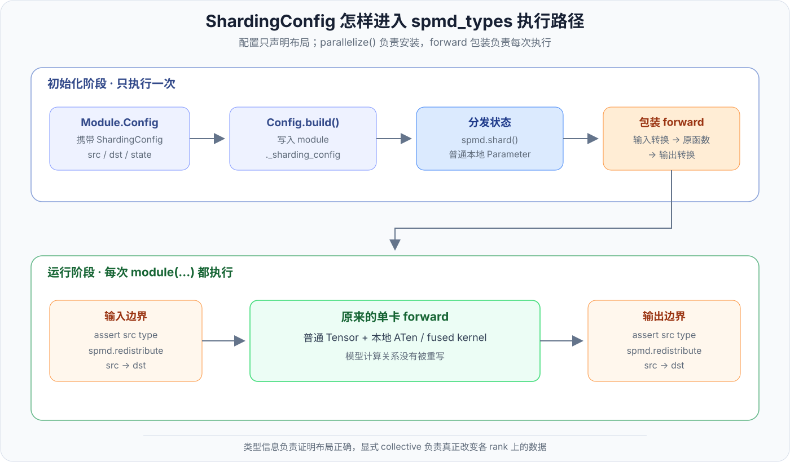
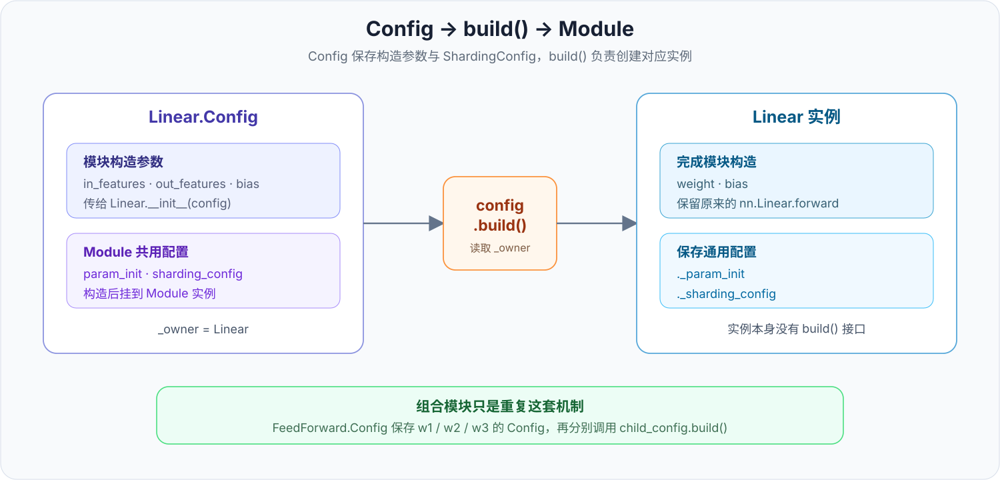

# 第 5 章 · ShardingConfig 与 spmd_types 后端

<div class="notebook-hero" markdown>

<span class="chapter-kicker">TorchTitan · spmd_types 路线 · 第 5 章</span>

前两章沿 `partial_dtensor` 路线，看到了 DTensor 怎样传播 Placement，以及 `ColwiseParallel` 怎样把参数分片和模块边界转换挂到普通 Linear 外面。从这一章开始，我们换到 TorchTitan 当前默认的 `spmd_types` 路线。

两条路线读的是同一份 `ShardingConfig`，但后面的执行方式不同：`partial_dtensor` 把状态和激活变成 DTensor，`spmd_types` 则尽量让模型继续使用普通的本地 Tensor，用独立的类型信息说明它们在各条 mesh axis 上是什么状态，并把真正改变布局的 collective 明确写进执行过程。

理解这条路线，先抓住一个核心设计：**通信是事先明确写进分布式程序的，`spmd_types` 类型系统只负责检查这段程序是否自洽。** 模块边界上的通信由 `ShardingConfig` 声明，`parallelize()` 将相应的 `spmd.redistribute()` 包装到 forward；配置表达不了的复杂通信，则直接写在模型或 kernel 中。类型检查器不会根据 Tensor 的元数据自动规划、插入或调整通信，它只是沿 forward 传播 `SpmdType`，检查每个算子的输入输出以及 collective 前后的布局。即使关闭类型检查，已经写好的通信仍然照常执行。

</div>

!!! info "版本与阅读范围"
    本文以 TorchTitan 提交 [`a3168782c`](https://github.com/pytorch/torchtitan/tree/a3168782c9a3a2e40afbd0de114818b96e2bda6e)为基准，主要对应 [`protocols/sharding.py`](https://github.com/pytorch/torchtitan/blob/a3168782c9a3a2e40afbd0de114818b96e2bda6e/torchtitan/protocols/sharding.py)、[`protocols/module.py`](https://github.com/pytorch/torchtitan/blob/a3168782c9a3a2e40afbd0de114818b96e2bda6e/torchtitan/protocols/module.py)、[`distributed/spmd_types.py`](https://github.com/pytorch/torchtitan/blob/a3168782c9a3a2e40afbd0de114818b96e2bda6e/torchtitan/distributed/spmd_types.py)与 [`decoder_sharding.py`](https://github.com/pytorch/torchtitan/blob/a3168782c9a3a2e40afbd0de114818b96e2bda6e/torchtitan/models/common/decoder_sharding.py)。TorchTitan 当前固定依赖 `spmd_types==0.2.5`，这套接口仍在快速演进。

    本章关心的是配置怎样进入默认后端，不再重复解释列并行和行并行的计算原理。需要回顾时，可以直接阅读仓库已有的 [Tensor Parallel](../training/parallelism/03-tp.md)。

## 1. ShardingConfig 的作用

模型作者通常希望保留这样的单卡代码：

```python
class FeedForward(Module):
    def forward(self, x):
        return self.w2(F.silu(self.w1(x)) * self.w3(x))
```

真正启用 TP、SP 或 CP 后，框架还要知道：

1. `w1`、`w2`、`w3` 的参数分别沿哪一维切；
2. `x` 进入整个 FFN 前是否需要 all-gather；
3. 每个 Linear 的本地输出在各条 mesh axis 上是什么语义；
4. `w2` 产生的局部贡献最后做 all-reduce 还是 reduce-scatter；
5. fused kernel 是否只接受本地 Tensor。

`ShardingConfig` 就是附着在模块配置上的这份分布式契约。它不实现 Linear，也不执行 collective，只描述模块的状态、入口和出口应当采用什么布局。模型构建完成后，`Module.parallelize()` 再读取这些声明，选择 `partial_dtensor` 或 `spmd_types` 后端落地。

这样一来，单卡 `forward()` 只负责计算关系，并行配置则与对应模块的 `Config` 放在一起。模型不需要为了不同并行度复制多套 forward，也不再依赖一张以字符串 FQN 为 key 的全局 `ParallelStyle` plan。

## 2. ShardingConfig 的六个字段

当前 [`ShardingConfig`](https://github.com/pytorch/torchtitan/blob/a3168782c9a3a2e40afbd0de114818b96e2bda6e/torchtitan/protocols/sharding.py)包含六个字段：

| 字段 | 描述的时刻 | 作用 |
| --- | --- | --- |
| `state_shardings` | 并行化阶段 | 声明当前模块直接持有的 parameter 和 buffer 怎样分布 |
| `in_src_shardings` | 进入模块时 | 声明输入现在是什么类型 |
| `in_dst_shardings` | 执行 forward 前 | 声明输入需要转换成什么类型 |
| `out_src_shardings` | forward 刚结束 | 声明原始输出是什么类型 |
| `out_dst_shardings` | 离开模块前 | 声明输出需要转换成什么类型 |
| `local_map` | forward 内部 | 将一段只接受本地 Tensor 的计算标成有明确输入输出类型的局部区域 |

输入和输出都拆成 `src → dst`，是因为 `spmd_types` 不从 Tensor 包装对象上读取 Placement。`src` 明确告诉类型系统“转换前是什么”，`dst` 再说明“转换后要什么”。只有 `src` 时，边界只核对 Tensor 是否符合声明的 `SpmdType`；这里检查的是分布式布局，不是 `dtype`。一旦填写 `dst`，`spmd_types` 后端就可能在这里执行显式 collective。第 7 节会完整解释这种 SPMD 类型检查。

`state_shardings` 采用更严格的口径：只要一个模块设置了 `ShardingConfig`，它直接持有的每个 parameter 和非空 buffer 都必须有对应声明，缺少条目会直接报错。这样可以避免新增参数后悄悄落成未定义布局。



*图 1：配置先随 Module.Config 进入模块实例；`parallelize()` 在初始化阶段切分状态并包装 forward，训练时再按 src/dst 契约执行显式 collective。中间绿色区域仍是模型原来的单卡 forward。*

表中所有带 `shardings` 的字段都使用 `SpmdType` 表示布局。它是两种后端共同读取的配置类型：`partial_dtensor` 会把它解析成 DTensor Placement，默认的 `spmd_types` 后端则直接用它标注本地 Tensor。继续跟踪配置的执行过程前，需要先看清这个类型由什么组成。

## 3. SpmdType：ShardingConfig 的布局类型

`SpmdType` 来自同名的 `spmd_types` 库，是一个描述分布布局的 Python 元数据对象，不是 Tensor 子类，也不会像 DTensor 那样包装本地 buffer。一个 `SpmdType` 可以包含两层信息：

```text
local_type      每条 mesh axis 上，本地值和反向梯度是什么关系
PartitionSpec   本地 shard 应怎样沿张量维度拼回逻辑全局张量
```

### 3.1 local_type：每条 mesh axis 上的值与梯度语义

[`spmd_types` 的类型定义](https://github.com/meta-pytorch/spmd_types/blob/main/docs/local_spmd_types.md#types)不仅关心前向值是否相同，还关心反向梯度是否等待归约：

| 类型 | 前向在该 axis 上 | 对应的梯度类型 | 常见含义 |
| --- | --- | --- | --- |
| `R`，Replicate | 各 rank 的值相同 | `P` | 同一个值被各 rank 用于不同计算，梯度需要跨 rank 求和 |
| `I`，Invariant | 各 rank 的值相同 | `I` | 各 rank 做相同计算，梯度也保持相同，不等待跨 rank 求和 |
| `V`，Varying | 各 rank 的值不同 | `V` | 只说明值不同，不单独说明沿哪个 tensor dimension 切分 |
| `P`，Partial | 各 rank 保存同形状的局部贡献 | `R` | 前向结果还有一次 sum reduction 没做 |

这里最容易混淆的是 `R` 和 `I`：它们的前向 buffer 都可以完全相同，区别发生在反向。`R` 表示每个 rank 对这个值有一份独立使用，因此产生的梯度要汇总；`I` 表示各 rank 做的是同一份重复计算，梯度不应再被当作待求和贡献。

`S(d)` 可以看成比 `V` 更具体的写法：除了说明各 rank 的值不同，还指出逻辑张量沿第 `d` 维切分。它的反向仍是同维度的 shard。

### 3.2 PartitionSpec：mesh axis 与张量维度的映射

当多条 mesh axis 同时切同一个 tensor dimension 时，只写每轴 `S(d)` 不足以表达切分顺序。TorchTitan 因此经常使用 `V + PartitionSpec`：

```python
SpmdType(
    {
        DP: spmd.V,
        CP: spmd.V,
        TP: spmd.V,
    },
    partition_spec=spmd.PartitionSpec((DP, CP), TP),
)
```

对一个二维激活来说，`PartitionSpec((DP, CP), TP)` 表示：

- tensor dim 0 先后由 DP、CP 切分；
- tensor dim 1 由 TP 切分。

因此 `V` 回答的是“各 rank 的值是否不同”，`PartitionSpec` 回答的是“这些不同的本地值怎样组成逻辑全局张量”。当前 rank 手里的对象依然是普通 Tensor，所以 `tensor.shape` 是本地 shape；逻辑全局布局保存在这份可擦除的类型信息中，而不是 Tensor wrapper 里。

## 4. ShardingConfig 与模块实例

理解这个过程，关键是先看 TorchTitan 的 `Configurable` 协议。它规定了 `Config` 怎样描述一个 Module，以及 `Config.build()` 怎样构造对应的实例。模型专属的 sharding 配置函数和逐层循环都是这套协议在组合模型上的具体用法。

### 4.1 Module 与 Config

这里的 Module 特指继承 TorchTitan `Module` 的可配置模块，并不是任意 PyTorch `nn.Module`。每个具体模块都会定义自己的嵌套 `Config`；没有新增字段时，`Config` 的类体可以只写 `pass`。模块构造函数则统一接收这个配置：

```python
class Linear(nn.Linear, Module):
    @dataclass(kw_only=True, slots=True)
    class Config(Module.Config):
        in_features: int
        out_features: int
        bias: bool = False

    def __init__(self, config: Config):
        super().__init__(
            config.in_features,
            config.out_features,
            bias=config.bias,
        )
```

`Linear.Config` 继承的字段和自己新增的字段可以分成两类：

| 来源 | 字段 | 作用 |
| --- | --- | --- |
| `Module.Config` | `param_init`、`sharding_config` | 所有 Module 共用的初始化和分布式配置 |
| `Linear.Config` | `in_features`、`out_features`、`bias` | 构造 Linear 自身所需的参数 |

`Config` 还从 `Configurable.Config` 继承了 `build()`、`traverse()` 和 `to_dict()` 等方法。`build()` 属于 Config 对象，不属于构建后的 Module 实例。

### 4.2 Config.build()

定义 `Linear` 类时，`Configurable.__init_subclass__()` 会自动建立下面的关联：

```text
Linear.Config._owner = Linear
```

因此 `Linear.Config.build()` 知道自己应该构造 `Linear`。删去日志和参数检查后，整个过程可以概括成：

```python
# Configurable.Config.build()
instance = self._owner(config=replace(self))

# Module.Config.build() 随后补上 Module 共用的配置
if self.param_init is not None:
    instance._param_init = self.param_init
if self.sharding_config is not None:
    instance._sharding_config = self.sharding_config
return instance
```

调用端只需要操作 Config：

```python
linear_cfg = Linear.Config(in_features=4096, out_features=11008)
linear_cfg.sharding_config = colwise_config()

linear = linear_cfg.build()
# linear._sharding_config 就是上面的 colwise_config()
```

这就是 `ShardingConfig` 进入模块实例的完整机制。此时只是把声明保存到了 `_sharding_config`，还没有切分参数或执行 collective。



*图 2：具体 Config 类通过 `_owner` 指向对应的 Module 类；调用 `config.build()` 后，模块构造参数进入 `__init__()`，通用的 `sharding_config` 则保存到实例的 `_sharding_config`。*

### 4.3 组合模块的构建

组合模块只是把子模块的 Config 保存为字段，再在构造函数中调用它们的 `build()`：

```python
class FeedForward(Module):
    @dataclass(kw_only=True, slots=True)
    class Config(Module.Config):
        w1: Linear.Config
        w2: Linear.Config
        w3: Linear.Config

    def __init__(self, config: Config):
        super().__init__()
        self.w1 = config.w1.build()
        self.w2 = config.w2.build()
        self.w3 = config.w3.build()
```

Llama3 的 `set_llama3_sharding_config()` 循环修改每层 Config，`model_config.build()` 再逐层触发这些 `build()`。无论模型有多少层，底层都只是重复上面的 `Config → build() → Module`。

## 5. parallelize() 并行化

模型进入 [`parallelize_llama()`](https://github.com/pytorch/torchtitan/blob/a3168782c9a3a2e40afbd0de114818b96e2bda6e/torchtitan/models/llama3/parallelize.py) 后，会调用一次：

```python
model.parallelize(parallel_dims)
```

`Module.parallelize()` 先递归处理子模块，再对每个带 `_sharding_config` 的模块依次调用：

| 调用 | 当前阶段做什么 |
| --- | --- |
| `spmd_validate_redistributions()` | 仅在 `spmd_types` 后端检查输入和输出的 `src → dst` 能否由当前边界转换函数执行，不改变 Tensor |
| `_distribute_states()` | 按 `state_shardings` 切分当前模块直接持有的 parameter 和 buffer |
| `_cache_pos_arg_names()` | 记录 `forward()` 的位置参数名，使 `in_src_shardings` 中的名字能找到实际输入 |
| `forward_with_redistribution()` | 安装“转换输入 → 原 forward → 转换输出”的运行时包装 |

第一项 [`spmd_validate_redistributions()`](https://github.com/pytorch/torchtitan/blob/a3168782c9a3a2e40afbd0de114818b96e2bda6e/torchtitan/distributed/spmd_types.py#L256) 定义在 TorchTitan 自己的 `distributed/spmd_types.py`，它检查的是同一份 `ShardingConfig` 中成对出现的 `in_src_shardings → in_dst_shardings` 和 `out_src_shardings → out_dst_shardings`。

当前真正执行边界转换的是同一文件中的 `spmd_redistribute_per_axis()`。它一次只会在一条 mesh axis 上调用一次 `spmd.redistribute()`，因此初始化时先拒绝它无法执行的配置：

- `TP: S(0) → R` 只改变 TP，可以执行一次 all-gather；
- 同时改变 DP 和 TP，需要两条 axis 上的通信，当前边界转换不支持；
- 变化的一侧是 `V` 时，类型没有给出足够的 shard 或 reduction 关系，无法据此选择 collective；
- `PartitionSpec((DP, CP)) → PartitionSpec((CP, DP))` 改变了 shard 顺序，也不能用一次单轴 collective 完成。

所以第一项只是提前检查“后面写好的通信能不能执行”，并不验证数值，也不执行通信。真正的输入和输出转换发生在每次 forward 中，5.2 节会继续展开。

这里和上一章的原生 `ColwiseParallel` 有一点实现差异：TorchTitan 没有为 `ShardingConfig` 注册 `nn.Module.forward_pre_hook` 和 `forward_hook`，而是直接重新绑定 `self.forward`。但它保存并调用的仍是原函数，所以模型源码中的单卡 forward 不需要修改。

### 5.1 参数和 buffer 分发

在 `spmd_types` 分支中，`_distribute_states()` 不调用 `torch.distributed.tensor.distribute_tensor()`，而是进入 `spmd_distribute_tensor()`：

```python
tensor = spmd.shard(
    tensor,
    mesh.get_group(axis),
    src=spmd.I,
    dst=spmd.S(dim),
)

self.register_parameter(name, nn.Parameter(tensor))
spmd.assert_type(self._parameters[name], layout)
```

`spmd.shard()` 按声明取出当前 rank 应保存的 slice，重新注册的 Parameter 仍是普通 `torch.Tensor`。`spmd.assert_type()` 再把这份本地 Tensor 与对应的 `SpmdType` 关联起来，供类型传播和边界检查使用。

这和 `partial_dtensor` 的结果很不一样：后者注册的是 `DTensor Parameter`，`weight.shape` 保留逻辑全局 shape；这里刚分片后的 `weight.shape` 就是当前 rank 的本地 shape。

### 5.2 forward 包装与显式通信

删掉参数绑定和异常检查后，运行时包装可以概括成：

```python
original_forward = self.forward

def forward_with_redistribution(*args, **kwargs):
    args, kwargs = self._redistribute_inputs(parallel_dims, args, kwargs)
    outputs = original_forward(*args, **kwargs)
    return self._redistribute_outputs(parallel_dims, outputs)

self.forward = forward_with_redistribution
```

#### 5.2.1 输入布局转换

如果配置声明了输入布局，`_redistribute_inputs()` 会按原 `forward()` 的参数名找到对应 Tensor：

1. 类型检查开启时，用 `spmd.assert_type(value, src)` 确认调用方传来的类型；
2. 没有 `dst` 时，直接把它交给原 forward；
3. 有 `dst` 时，调用 `spmd_redistribute_per_axis(value, mesh, src, dst)`。

与 DTensor 不同，这里不会先执行 `DTensor.from_local()`，也不会让 `redistribute()` 自己读取输入 Placement。源类型和目标类型都明写在配置里。

#### 5.2.2 输出布局转换

输出方向完全对称：原 forward 先产生 `out_src_shardings` 声明的结果，类型检查器核对这个契约，然后再按 `out_dst_shardings` 执行转换。

`spmd_redistribute_per_axis()` 会逐 axis 比较 src 和 dst，并对发生变化的那条 axis 调用：

```python
x = spmd.redistribute(
    x,
    mesh.get_group(axis),
    src=src_type,
    dst=dst_type,
)
```

常见转换仍对应熟悉的 collective：

| 类型转换 | 常见 collective |
| --- | --- |
| `S(d) → R` | `all_gather` |
| `P → R` 或 `P → I` | `all_reduce` |
| `P → S(d)` | `reduce_scatter` |

区别在于，这些通信现在是显式的带类型操作。第 3 章的 DTensor 路线先选目标 Placement，再由 `DTensor.redistribute()` 规划路径；这里的图中会直接出现一个具有 `src`、`dst` 和 process group 的 `spmd.redistribute`。

超出上述限制的复杂转换，需要在模块内部写成显式 collective，不能只依赖 `ShardingConfig` 的边界 src/dst 声明。

## 6. Tensor 在模型中的流动

第 7 节要根据算子的输入类型推导输出类型，前提是先知道这些类型从哪里来，又怎样跟着 Tensor 经过模型。下面仍以 TP degree 为 2、开启 Sequence Parallel 的 Llama3 为例，暂时省略 DP、CP 和 FSDP。

### 6.1 运行时表示

`spmd_types` 路线中的参数和激活都是普通的本地 `torch.Tensor`；参数是本地 Tensor 的 `nn.Parameter`。Tensor 不会被包装成 DTensor，`tensor.shape` 也是当前 rank 的本地 shape。

开启 SPMD 类型检查后，一个 Tensor 还可以带两份额外元数据：

```text
local buffer        当前 rank 真正参与计算的数据
SpmdType            各 mesh axis 上的 R / I / V / P
PartitionSpec       本地 shard 怎样拼回逻辑全局 Tensor
```

这份类型信息有三个来源：

1. `parallelize()` 切分 parameter 和 buffer 后，用 `spmd.assert_type()` 标出它们的初始类型；
2. `preprocess_inputs()` 用 `annotate_input_spmd_types()` 标出模型输入的初始类型；
3. forward 中的普通算子由类型检查器推导输出类型，显式 collective 则直接使用代码中给出的 `src → dst`。

这不表示模型前向产生的每个 Tensor 都始终带有元数据。自动传播只发生在 `typecheck()` 上下文覆盖的区域内：

- 检查器能够识别的普通 Torch 算子，其输出会得到推导出的类型；
- `LocalMapConfig` 会把 `in_types` 和 `out_types` 传给 `spmd.no_typecheck()`：进入 kernel 前按 `in_types` 核对参数，kernel 内部不传播类型，返回后再按 `out_types` 给结果标注类型；直接使用 `with spmd.no_typecheck():` 时没有这两份边界声明，只是暂时关闭传播；
- 在检查上下文外创建的临时 Tensor 不会自动获得完整的 SPMD 类型；
- 当前 Trainer 的 backward 整体位于 `spmd.no_typecheck()` 中，梯度 Tensor 不走这套自动传播。

关闭类型检查时，本地算子和显式 collective 仍照常执行，只是不再为普通算子的中间结果传播和核对这些元数据。

### 6.2 模型主干

记 `T` 为当前 DP/CP rank 的 token 数，`D` 为模型 hidden size，`Vocab` 为词表大小。只看 TP axis，一次 Llama3 forward 的主要 Tensor 流动是：

| 位置 | 当前 rank 上的 local Tensor | TP 类型 | 类型怎样得到 |
| --- | --- | --- | --- |
| 输入 token ids | `[T]` | `R` | `preprocess_inputs()` 显式标注；每个 TP rank 使用相同 token ids |
| Embedding 本地输出 | `[T, D]` | `P` | 每个 rank 只查自己那片词表，得到待汇总的局部结果 |
| Embedding 输出包装后 | `[T/2, D]` | `S(0)` | reduce-scatter 的 `dst` 显式给出 |
| 每个 TransformerBlock 的残差流 | `[T/2, D]` | `S(0)` | Attention 和 FFN 都把输出恢复成 sequence shard，再与残差本地相加 |
| 最后一层 Norm 之后 | `[T, D]` | `R` | 进入 `lm_head` 前执行 all-gather |
| `lm_head` 输出 logits | `[T, Vocab/2]` | `S(1)` | 词表维权重切分，Linear 规则推导输出也沿词表维切分 |

因此相邻 TransformerBlock 之间传递的不是逻辑 shape 为 `[T, D]` 的 DTensor，而是本地 shape 为 `[T/2, D]` 的普通 Tensor，并带有“沿 token 维切分”的类型解释。

### 6.3 FFN 内部

再展开一层 FFN。TorchTitan 的 sequence-parallel 布局实际用 `V + PartitionSpec` 表示；只看 TP 时，下面简记为 `S(0)`：

```text
h: [T/2, D] S(0)                  模块入口核对 in_src
  │
  ├─ all-gather(S(0) → R)
  ▼
x: [T, D] R                       collective 的 dst 已知
  │
  ├─ w1(x), w3(x)
  ▼
a, b: [T, H/2] S(1)               Linear 规则从输入和权重推导
  │
  ├─ silu(a) * b
  ▼
g: [T, H/2] S(1)                  逐元素规则继续传播 S(1)
  │
  ├─ w2(g)
  ▼
z: [T, D] P                       收缩维被切分，Linear 规则得到 Partial
  │
  ├─ reduce-scatter(P → S(0))
  ▼
y: [T/2, D] S(0)                  collective 的 dst 已知
  │
  ├─ residual + y
  ▼
out: [T/2, D] S(0)                add 规则从两个 S(0) 输入推导
```

当 `spmd_types.checker.typecheck()` 生效时，它安装的 `TorchFunctionMode` 会观察上面的每次 Torch 调用。真正的算子先在 local buffer 上运行；算子返回后，检查器读取输入 Tensor 的类型，按规则推导结果，再把类型写到输出 Tensor。这个输出随即成为下一次算子的带类型输入。

模块包装不需要重新猜测类型：入口和出口的 `spmd.assert_type()` 会把已经推导出的类型与 `ShardingConfig` 的 `src` 契约核对，collective 则通过显式 `dst` 建立新的已知类型。在类型检查覆盖的普通模型路径上，这样便能从模型输入连续跟踪到下一层；遇到不检查的 kernel，则由第 8 节介绍的显式边界重新接上类型链。

### 6.4 反向

当前 TorchTitan Trainer 用 `spmd.no_typecheck()` 关闭了 backward 的类型传播，所以第 7 节讨论的逐算子推导实际发生在 forward。反向仍沿真实 autograd 图执行本地算子和 collective：

```text
dy: [T/2, D]
  -- 前向 reduce-scatter 的反向：all-gather --> [T, D]
  -- w2、SiLU、w1/w3 的本地反向 --> dx_partial: [T, D]
  -- 前向输入 all-gather 的反向：reduce-scatter --> dx: [T/2, D]
```

每个 TP rank 只计算自己那片 `w1`、`w2`、`w3` 的参数梯度，不需要在 TP axis 上再做参数梯度 all-reduce。若同时启用数据并行或 FSDP，DP axis 上的参数梯度归约属于另一层并行逻辑。

## 7. SPMD 类型检查

这里的“类型”不是 Python 类型，也不是 Tensor 的 `dtype`，而是前面介绍的 `SpmdType`：一个 Tensor 在 DP、CP、TP 等 mesh axis 上究竟是 `R`、`I`、`V`、`P`，以及它的 `PartitionSpec` 是什么。

第 6 节已经给出了类型链的起点：模型输入和参数先被显式标注，普通算子的输出再成为下一个算子的输入，collective 的输出类型则由 `dst` 给出。因此检查器观察一个 Torch 算子时，它的输入 Tensor 已经带有类型，不需要从数值或 shape 猜测布局。

检查器根据这些输入 `SpmdType` 和当前算子的数学性质，推导输出应当具有什么类型；推不出来或组合不合法时就报错。它不比较 Tensor 的数值，主要寻找“本地计算可以运行，但组合起来不再等价于全局计算”的错误。

### 7.1 算子规则

[`spmd_types` 的算子表](https://github.com/meta-pytorch/spmd_types/blob/v0.2.5/spmd_types/_checker/__init__.py)先按算子怎样处理待求和的 `Partial`，将普通算子分成三类。检查器会在每条 mesh axis 上分别应用这些规则：

| 算子类别 | 代表算子 | 与 `Partial` 相关的规则 |
| --- | --- | --- |
| 线性 | `add`、`sub`、`neg`、`sum` | `P + P → P`；`P + R` 不合法，因为 Replicate 项会在最终归约时被重复相加 |
| 多线性 | `mul`、`mm`、`matmul` | `P × R → P`；两个输入都是 `P` 时不合法 |
| 非线性 | `silu`、`sigmoid`、`exp` | `P` 不能直接进入非线性算子，必须先 all-reduce 或 reduce-scatter |

例如 `P` 表示各 rank 手里只有待求和的局部贡献。假设两个 rank 分别持有 `x₀` 和 `x₁`，逻辑全局值是：

```text
x = x₀ + x₁
```

如果在归约前直接执行非线性函数：

```python
y = silu(x)  # x 的类型仍是 P
```

各 rank 实际算出的是 `silu(x₀)` 和 `silu(x₁)`，它们相加通常不等于 `silu(x₀ + x₁)`。普通 Tensor 可以照常执行这段代码，SPMD 类型检查则会发现 `Partial` 不能这样穿过非线性算子。类似地，如果调用方提供的是 feature shard，而模块入口声明需要 Replicate，中间又没有合法的 redistribute，边界类型也会对不上。

上面是 `R/I/V/P` 的本地语义。Global SPMD 还会根据算子的张量维度规则传播 `S(d)` 和 `PartitionSpec`。以二维矩阵乘 `x[M, K] @ w[K, N]` 为例：

| 输入布局 | 输出布局 | 原因 |
| --- | --- | --- |
| `x: S(0)`，`w: R` | `S(0)` | `x` 沿非收缩的 `M` 维切分，输出继续沿 `M` 切分 |
| `x: R`，`w: S(1)` | `S(1)` | `w` 沿非收缩的 `N` 维切分，输出沿 `N` 切分 |
| `x: S(1)`，`w: S(0)` | `P` | 两个输入都沿收缩维 `K` 切分，每个 rank 只算出最终矩阵的一部分和 |

形状变换也有对应规则，例如 `transpose()` 会把 `S(0)` 更新成 `S(1)`。`spmd_types` 的 Global SPMD 路径复用 DTensor 的算子分片传播来完成这一层推导，再检查它是否与本地 `R/I/V/P` 语义一致。

### 7.2 Trainer 中的类型检查

TorchTitan 按下面的顺序为一次 forward 建立类型信息：

1. `preprocess_inputs()` 调用 `annotate_input_spmd_types()`，给模型输入标上初始 `SpmdType`；参数和 buffer 的类型已经在 `parallelize()` 分发状态时标好。
2. `train_context` 用 `set_current_spmd_mesh()` 指明这些 DP、CP、TP 名称对应当前哪张 DeviceMesh。
3. 开启 `debug.spmd_typechecking` 后，Trainer 进入 `spmd_types.checker.typecheck(local=False)`，随后运行一次正常的 forward；检查器沿算子传播类型，并核对模块边界和显式 collective。

当前 Trainer 在 `loss.backward()` 外层使用了 `spmd.no_typecheck()`，所以这里实际检查的是 forward，而不是完整的反向执行。关闭该调试选项不会删除已经写进程序的 collective，只是不再运行这套额外检查。

这套检查不会替程序选择并行策略，也不会像 DTensor dispatcher 那样自动补通信。它验证的是已经写好的本地计算和显式 collective 能否组成一个自洽的分布式程序。[`spmd_types` 的设计文档](https://github.com/meta-pytorch/spmd_types/blob/main/docs/design.md#global-spmd)将这种模式称为 Global SPMD 类型检查。

## 8. LocalMapConfig

有些 attention、RoPE 或 fused kernel 只理解本地 Tensor，类型检查器也未必认识它内部的自定义算子。`LocalMapConfig` 用来给这类区域画出边界。

在 `partial_dtensor` 后端，它会变成 PyTorch 的 `local_map()`：入口把 DTensor 转成本地 Tensor，出口再包装回 DTensor。在 `spmd_types` 后端，TorchTitan 使用：

```python
spmd.no_typecheck(
    in_types=in_types,
    out_types=out_types,
)(original_forward)
```

这里的 `in_types` 和 `out_types` 是 kernel 边界上的 SPMD 类型声明，不是 Python 函数签名，也不描述 Tensor 的 shape 或 `dtype`。它们分别与函数参数和返回值的结构对应：

```text
inner_attention(q, k, v) -> output

in_types  = (q_layout, k_layout, v_layout)
out_types = output_layout
```

类型检查开启时，这层包装依次完成三件事：

1. 进入 `original_forward` 前，检查 `q`、`k`、`v` 的当前类型是否符合 `in_types`；
2. 运行 kernel 时关闭逐算子类型传播，类型检查器不再分析其内部算子；
3. kernel 返回后，按 `out_types` 给结果标注类型，让后续算子可以继续传播和检查。

TorchTitan 根据 `LocalMapConfig.in_dst_shardings` 生成 `in_types`，根据 `out_src_shardings` 生成 `out_types`。因此，这种写法没有丢掉整块计算的分布语义，而是把 kernel 当成一个边界类型已知、内部实现不检查的黑盒。直接写 `with spmd.no_typecheck():` 时没有 `in_types` 和 `out_types`，只会关闭内部传播，也不会在入口检查或出口重新标注类型。

## 9. FSDP 与 checkpoint 的 DTensor 边界

“`spmd_types` 使用普通 Tensor”说的是模型前向/反向的主要计算表示，不等于 TorchTitan 从此完全不使用 DTensor。

在当前初始化顺序中，`model.parallelize()` 先按 TP 等模型并行 axis 切状态并附加 SPMD 类型，随后 `apply_fsdp_to_decoder()` 再调用 FSDP2。FSDP2 仍使用 DTensor 表示参数存储布局，并通过模块调用周围的 hook 完成参数 all-gather 与梯度 reduce-scatter。

因此 TorchTitan 为状态传递保留了两座桥：

- `plain_tensor_to_dtensor_state_dict()`：把带 SPMD 布局的本地状态包装成 DTensor；
- `dtensor_to_plain_tensor_state_dict()`：取回 DTensor 的本地部分，交给以普通 Tensor 为计算表示的路径。

可以把两种职责分开理解：

```text
模型计算语义     普通 Tensor + SpmdType + 显式 collective
参数存储与恢复   FSDP2 / DTensor + state_dict bridge
```

## 10. spmd_types 与计算图捕获

`spmd_types` 的一个重要设计目标是类型可擦除：关闭类型检查后，模型计算仍然是普通 Tensor 算子，collective 仍然是代码中的显式操作。编译器看到的核心结构更接近：

```text
local ATen ops
→ explicit all-gather
→ local ATen ops
→ explicit reduce-scatter
```

通信位置不需要等 DTensor dispatcher 在运行时根据 Placement 推导，算子图里也不必让每个激活长期携带 DTensor wrapper。这样更方便编译器捕获、分析并重新调度计算与通信。

不过 `spmd_types` 不是自动并行器。`ShardingConfig` 仍由 TorchTitan 明确写出，复杂 collective 也仍要由实现者选择；类型系统负责验证这些选择是否自洽，而不是替模型搜索最优切分方案。下一章将沿普通 Trainer 继续跟踪这段显式程序怎样进入 `torch.compile`。

## 11. 小结

`ShardingConfig` 是两种 SPMD 后端共用的声明层：`state_shardings` 处理参数和 buffer，输入与输出的 src/dst 描述模块边界，`LocalMapConfig` 则给本地 kernel 标出类型明确的黑盒区域。

进入默认 `spmd_types` 后端后，状态先被切成当前 rank 的普通 Tensor，并附加 `SpmdType`；每次模块调用再由 forward 包装检查 src、执行显式 `spmd.redistribute()`、运行原来的单卡 forward，最后整理输出。`R` 与 `I` 的差别补上了反向梯度是否待归约的语义，`PartitionSpec` 则说明本地 shard 怎样重建逻辑全局张量。

这条路线保留了单卡模型的写法，也让 collective 在计算图中变得明确。FSDP2 和 checkpoint 边界仍可继续使用 DTensor，它们负责的是参数存储与状态传递，不需要和模型计算采用完全相同的运行时表示。

---

上一章（`partial_dtensor` 路线）：[使用 ColwiseParallel 切分模型](04-colwise-parallel.md) · 下一章：[torch.compile 与显式通信](06-torch-compile-explicit-collectives.md)
