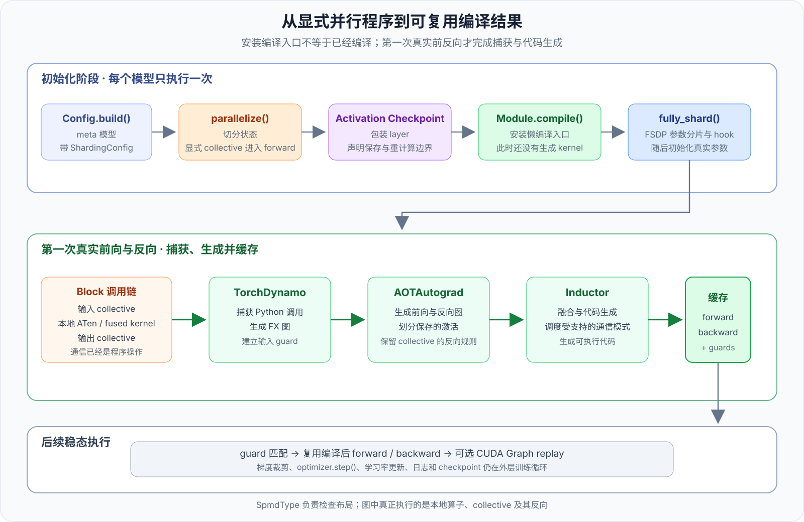

# 第 6 章 · torch.compile 与显式通信

<div class="notebook-hero" markdown>

<span class="chapter-kicker">TorchTitan · 编译与训练 · 第 6 章</span>

[上一章](05-sharding-config-spmd-types.md)最后得到了一段很普通的分布式程序：激活和参数以本地 Tensor 参与计算，Tensor Parallel（TP）和 Context Parallel（CP）需要改变布局的位置则显式调用 `spmd.redistribute()`。`SpmdType` 可以用来检查这段程序，却不负责替程序规划通信。

这正是本章的起点。`torch.compile` 捕获的是**本地计算与显式 collective 组成的可执行程序**，不是那套检查元数据。编译器可以看到通信在哪里、前后依赖哪些计算，再生成前向和反向代码；关闭 SPMD 类型检查不会把通信从图中删掉。

</div>

TorchTitan 有普通 `Trainer` 和实验性的 `GraphTrainer` 两条训练路径。它们的关键区别不是“有没有计算图”，而是**图的边界由谁决定**：

| 训练路径 | 图的范围 | 反向如何执行 | TorchTitan 能否直接改图 |
| --- | --- | --- | --- |
| 普通 `Trainer` | 默认逐个编译 TransformerBlock，loss 作为另一个独立区域编译；训练循环仍在图外 | Trainer 照常调用 `loss.backward()`，AOTAutograd 为每个已编译区域生成对应的反向图 | TorchTitan 不持有完整训练图，后续优化主要交给 PyTorch 编译栈 |
| `GraphTrainer` 的 `aot_fx_trace` 路线 | 显式构造包含模型前向、loss 和反向的联合 FX 图 | 追踪时通过 `torch.autograd.grad()` 将参数梯度写进图的输出 | 可以在这张联合图上执行 TorchTitan 自己的 pass pipeline |

本章只讲普通 `Trainer`：先由模型代码插入通信，再用 `torch.compile` 编译每个 Block。`GraphTrainer` 如何构造和改写整张训练图，会在[独立专题](graph-trainer.md)中介绍。

!!! info "版本与阅读范围"
    本文以 TorchTitan 提交 [`a3168782c`](https://github.com/pytorch/torchtitan/tree/a3168782c9a3a2e40afbd0de114818b96e2bda6e)为基准，主线对应普通 `Trainer`、Llama 3 的 [`parallelize.py`](https://github.com/pytorch/torchtitan/blob/a3168782c9a3a2e40afbd0de114818b96e2bda6e/torchtitan/models/llama3/parallelize.py)、[`distributed/compile.py`](https://github.com/pytorch/torchtitan/blob/a3168782c9a3a2e40afbd0de114818b96e2bda6e/torchtitan/distributed/compile.py)和 [`trainer.py`](https://github.com/pytorch/torchtitan/blob/a3168782c9a3a2e40afbd0de114818b96e2bda6e/torchtitan/trainer.py)。本章只讨论普通 Trainer 的 `torch.compile` 路线，不展开实验性的 GraphTrainer。

    除非特别说明，下面使用默认的 `backend="inductor"`。如果换成 `aot_eager` 等 backend，Dynamo 和 AOTAutograd 仍可用于捕获及生成反向，但不会经过这里介绍的 Inductor 代码生成和 Async TP pass。

## 1. torch.compile 的作用

在 eager 模式下，Python 按顺序调用一个个 PyTorch 算子，每个算子再经过 dispatcher 选择实现并向 GPU 发起 kernel。`torch.compile` 的主要作用不是把这些 launch 原样录下来，而是先取得算子之间的依赖关系，再生成一段新的可执行程序：

```text
eager
Python → op 1 dispatch → kernel 1 → op 2 dispatch → kernel 2 → op 3 dispatch → kernel 3

torch.compile
Python → compiled region → fused kernel A → collective → kernel B
```

对于本章的训练路径，这个过程主要带来四类变化：

1. Dynamo 将多次 Python 调用和 dispatcher 调度收进 FX 图；
2. AOTAutograd 根据前向图生成可编译的反向图；
3. Inductor 融合相邻算子、减少中间 Tensor 的读写，并生成 Triton 或其他后端代码；
4. collective 作为图节点出现后，编译 pass 可以分析计算与通信的依赖，尝试重新调度受支持的模式。

因此 `torch.compile` 也会降低 host 开销，但这是通过减少 Python/dispatcher 工作、融合算子和减少 launch 数量得到的。CUDA Graph 解决的是另一层问题：它把一组已经确定的 GPU launch 记录下来，以后通过一次 replay 再次提交。可以先记成一句话：

```text
torch.compile  重新组织并生成程序
CUDA Graph     重放已经生成的程序
```

两者可以叠加，PyTorch 的部分 `torch.compile` mode 也会在 backend 内部使用 CUDA Graph。第 6 节还会结合 TorchTitan 的外层 CUDA Graph wrapper 区分这两种路径。

!!! example "如何开启 torch.compile"
    在原有训练命令后加上 `--compile.enable` 即可：

    ```bash
    ./run_train.sh --compile.enable
    ```

    [`CompileConfig`](https://github.com/pytorch/torchtitan/blob/a3168782c9a3a2e40afbd0de114818b96e2bda6e/torchtitan/config/configs.py#L296)默认设置 `components=["model", "loss"]`，所以这条命令会编译模型和 loss。这里只说的“模型”仍是下一节介绍的逐层 TransformerBlock 编译，不是把整个 Trainer 放进一张图。

    如果只想编译模型，可以显式限制 `components`：

    ```bash
    ./run_train.sh \
      --compile.enable \
      --compile.components '["model"]'
    ```

    在 Python 配置中，对应的写法是 `config.compile = CompileConfig(enable=True, components=["model", "loss"])`。`backend` 默认是 `"inductor"`；需要换后端时再加 `--compile.backend <backend>`。

### 1.1 TorchTitan 的编译单元

`torch.compile()` 接收一个 Python callable，在第一次拿到真实输入时捕获其中的 Tensor 运算，再把编译结果缓存起来。TorchTitan 没有把整个训练循环交给它，而是在 [`apply_compile()`](https://github.com/pytorch/torchtitan/blob/a3168782c9a3a2e40afbd0de114818b96e2bda6e/torchtitan/distributed/compile.py#L39) 中逐层处理 TransformerBlock：

```python
for layer_id, transformer_block in model.layers.named_children():
    transformer_block.compile(
        backend=compile_config.backend,
        fullgraph=True,
    )
```

[`nn.Module.compile()`](https://github.com/pytorch/pytorch/blob/main/torch/nn/modules/module.py)会将 `torch.compile(self._call_impl, ...)` 的结果保存到模块的 `_compiled_call_impl`，模块对象、参数名和层级结构都保留下来。FX 图是用节点和边表示 Tensor 算子及其依赖关系的中间表示；这里的 `fullgraph=True` 表示一次 Block 调用必须形成一张完整的 FX 图。中间出现无法捕获的 Python 行为时直接报错，而不是悄悄切成多个编译片段。

选择 TransformerBlock 作为编译单元有两个直接结果：

- Attention、FFN、残差和它们之间的 TP/CP 通信位于同一个编译区域；
- Embedding、最终 Norm、`lm_head`、数据预处理、优化器和训练循环不属于这张 Block 图。

`CompileConfig.components` 还可以包含 `"loss"`。这种情况下，loss 的数值函数会单独调用一次 `torch.compile()`，它和每层 TransformerBlock 仍是不同的编译区域。

## 2. 初始化顺序

编译器最终能看到什么，首先取决于调用 `compile()` 之前模型已经发生了什么。下面先看不启用 Pipeline Parallel（PP）的 Llama 3 路径。Activation Checkpoint（AC）通过少保存激活、在反向时重算部分前向来降低显存占用；Fully Sharded Data Parallel（FSDP）则负责参数与梯度的分片。它们与编译入口的安装顺序如下：

```text
model_config.build()        在 meta device 上构造模型
        ↓
model.parallelize()         切分状态，安装显式输入/输出通信
        ↓
activation checkpoint      按配置包装每个 TransformerBlock
        ↓
Module.compile()            给当前 layer 对象安装懒编译入口
        ↓
fully_shard()               安装 FSDP2 参数分片与运行时 hook
        ↓
to_empty() + init_weights() 分配并初始化真实参数
```



*图 1：`parallelize()` 先把 TP/CP collective 写进 forward，Activation Checkpoint 再决定 layer 的重计算边界，`Module.compile()` 此时只安装懒编译入口。第一次真实前反向才会产生并缓存编译结果，后续调用在 guard 匹配时直接复用。*

这条顺序里有两点容易混淆。

第一，`Module.compile()` 被调用时模型还没有真实数据输入，参数甚至仍位于 meta device。meta Tensor 只保存 shape、dtype 等结构信息，不分配真实参数 storage，所以初始化阶段还不能生成针对真实输入的最终 kernel。`Module.compile()` 此时只是登记 `_compiled_call_impl` 这个懒编译入口，真正的捕获和代码生成发生在第一次训练调用。

第二，`model.parallelize()` 已经先于编译完成。第 5 章介绍的 forward 包装、`spmd.redistribute()` 以及模型内部手写的 collective，都已经成为当前 Python 调用链的一部分。编译器第一次执行这个调用链时，自然会看到这些通信。

## 3. 第一次前向与反向

非 PP 路径中，Trainer 先用 `preprocess_inputs()` 准备当前 rank 的输入，再进入 `_forward_backward_body()`：

```python
pred = model(inputs, **extra_kwargs)
loss, _ = loss_fn(pred, labels, global_valid_tokens)
loss.backward()
```

第一次执行到某个已编译的 Block 时，PyTorch 编译栈依次承担三类工作：

| 组件 | 当前阶段做什么 | 最终留下什么 |
| --- | --- | --- |
| TorchDynamo | 观察当前 Python 函数调用和其中的 Tensor 操作，将一次 Block 调用捕获成 FX 图，并为 shape、dtype、device 等条件建立 guard；guard 是复用编译结果前必须满足的运行时条件 | 前向 FX 图与复用条件 |
| AOTAutograd | 根据前向算子的 autograd 定义生成反向图，并决定前向要为反向保存哪些值 | 一对可分别执行的前向图和反向图 |
| Inductor | 对图中的本地计算进行融合和代码生成，并保留或调度 collective 节点 | 当前输入条件下的可执行代码 |

这里的 AOTAutograd 全称 Ahead-of-Time Autograd，是 `torch.compile` 训练路径中的自动微分编译层。Trainer 仍然调用普通的 `loss.backward()`；eager autograd engine 沿整张训练图回溯，遇到一个已编译的 Block 时，再把这个 Block 对应的编译后反向当作一个较大的 autograd 节点执行。梯度裁剪、`optimizer.step()` 和学习率更新并不会因此进入 Block 的编译图。

后续 microbatch 再次进入同一个 Block 时，Dynamo 会先检查 guard。输入条件仍匹配就直接复用缓存；shape、dtype、device 或影响控制流的 Python 值发生变化时，才可能重新捕获和编译。因此“调用过 `Module.compile()`”和“已经得到可复用的编译产物”是两个不同的时刻。

## 4. 计算图中的显式通信

以一个配置了输入和输出转换的模块为例，`parallelize()` 安装的调用关系可以简化为：

```python
def forward_with_redistribution(x):
    x = spmd.redistribute(x, tp_group, src=spmd.S(0), dst=spmd.R)
    y = original_forward(x)
    return spmd.redistribute(y, tp_group, src=spmd.P, dst=spmd.S(0))
```

这段函数先于 `Module.compile()` 存在。Dynamo 捕获时，`spmd.redistribute()` 会根据代码中已经给出的 `src → dst` 进入相应的 functional collective；这里的 functional 表示操作以 Tensor 为输入和输出，能够继续参与追踪和 autograd。最终图的主干更接近：

```text
local x
  → functional all-gather
  → aten.mm / silu / mul / aten.mm
  → functional reduce-scatter
  → local y
```

编译器不需要读取 Tensor 上的 `SpmdType` 再决定这里该不该通信。通信位置、process group 和布局转换已经由 TorchTitan 程序写明；类型检查器只是在启用时确认 `x` 的实际布局符合 `src`，以及结果符合后续算子的要求。

显式 collective 还带有 autograd 定义，所以 AOTAutograd 能为它生成对应的反向通信。第 5 章 FFN 示例中的两端可以对应为：

| 前向操作 | 反向经过该边界时 |
| --- | --- |
| `all-gather: S(0) → R` | 对输入梯度执行 reduce-scatter，恢复 `S(0)` |
| `reduce-scatter: P → S(0)` | 对输出梯度执行 all-gather，恢复参与本地矩阵乘所需的完整激活 |

因此进入编译图的不是一句抽象的“这里是 TP”，而是具有确定输入、输出和反向规则的通信节点。

当通信与矩阵乘都成为图节点后，编译器还可以尝试将两者重排为流水执行。TorchTitan 将这项可选优化称为 Async Tensor Parallel。

### 4.1 Async Tensor Parallel

开启 `CompileConfig.enable_async_tensor_parallel` 后，TorchTitan 会为 TP process group 启用 symmetric memory。这里的 symmetric memory 是一套为同一通信组登记对称 GPU buffer 的机制，方便 collective 使用更直接的数据访问路径。随后 TorchTitan 打开 Inductor 的 micro-pipeline TP pass：

```python
enable_symm_mem_for_group(group_name)
torch._inductor.config._micro_pipeline_tp = True
```

这个 pass 会尝试识别受支持的通信与矩阵乘模式，将大块操作改成更细的流水执行，以重叠一部分通信和计算。它优化的是图中已经存在的 collective，不是让 `spmd_types` 根据元数据临时发明一套新通信。

把它放回第 3 节的编译流水线，位置如下：

```text
Dynamo 捕获前向
    → AOTAutograd 生成前向图和反向图
    → Inductor post-grad FX pass：micro_pipeline_tp_pass
    → Inductor lowering 与代码生成
```

这里的 post-grad 不是“执行完 backward”，而是说 pass 接收到的已经是 AOTAutograd 处理后的前向/反向 FX 图。TorchTitan 普通 Trainer 本身没有重新实现这项图变换：[`distributed/compile.py`](https://github.com/pytorch/torchtitan/blob/a3168782c9a3a2e40afbd0de114818b96e2bda6e/torchtitan/distributed/compile.py#L76)负责登记 symmetric memory 并打开 `_micro_pipeline_tp` 开关，实际改写图的 `micro_pipeline_tp_pass` 位于 PyTorch Inductor。这样区分后，TorchTitan 决定“启用什么优化”，PyTorch compiler 负责“怎样改写和生成代码”。

## 5. Activation Checkpoint 与 FSDP

Activation Checkpoint 和 FSDP 都会改变一次 Block 调用的生命周期，但它们与第 4 节的 TP/CP 边界通信不是同一层机制。

### 5.1 Activation Checkpoint 位于编译之前

TorchTitan 先用所选策略包装 `model.layers` 中的模块，再遍历这些 layer 调用 `compile()`。因此启用 Full AC 或 Selective AC 时，被编译的是当前 layer 位置上的 checkpoint wrapper，而不是包装前孤立的 TransformerBlock forward。

这让 AOTAutograd 在生成前向和反向时同时看到保存与重计算边界。Full AC 在反向重新执行整个 Block；Selective AC 则通过 policy 决定哪些算子结果保存、哪些重新计算。通信是否重算也由这套 policy 决定，例如 TorchTitan 默认将部分代价较高的通信输出标成 `MUST_SAVE`，表示前向结果必须保留给反向使用。

### 5.2 FSDP 管理参数生命周期

`fully_shard()` 在 `Module.compile()` 之后应用到每个 TransformerBlock。初始化结束后，模块常驻的是 FSDP 分片参数；一次前向使用参数前，FSDP2 的 hook 负责 all-gather，Block 结束后再按策略释放完整参数，反向结束时对参数梯度执行 reduce-scatter。

这里要分清两类通信来源：

| 通信 | 由谁声明 | 解决的问题 |
| --- | --- | --- |
| TP、CP 等模型并行通信 | `ShardingConfig`、模型代码与 `spmd.redistribute()` | 调整激活和模型维度的布局 |
| FSDP 通信 | `fully_shard()` 安装的参数与 autograd hook | 在计算前还原参数，在反向后重新分片梯度 |

`spmd_types` 的算子检查不会替 FSDP 安装这些 hook。FSDP 如何让分片参数在一次 Block 前后切换状态，是另一条参数生命周期，后续章节再单独展开。

完成算子级编译后，Trainer 还可以进一步记录整段前反向发出的 GPU 命令，并在后续迭代中直接回放。负责这件事的是 CUDA Graph，它记录的是运行时 launch 序列，而不是另一张 FX 图。

## 6. torch.compile 与 CUDA Graph

TorchTitan 普通 Trainer 还可以把整个 `_forward_backward_body()` 包进 CUDA Graph。当 `torch.compile` 和 CUDA Graph 同时启用时，这层包装发生在模型并行化和编译入口安装完成之后，覆盖的是“模型前向 → loss → backward”的 GPU launch 序列。当前实现只在 NVIDIA CUDA 上执行这层捕获，其他设备会给出提示并退回普通执行。

两种图的主职责不同：

| 机制 | 记录的对象 | 主要作用 |
| --- | --- | --- |
| `torch.compile` | Tensor 运算组成的 FX 图 | 改写并生成前反向代码、融合本地算子，并为图级调度提供结构 |
| CUDA Graph | 已经准备好的 GPU kernel 与 collective launch 序列 | 固定地址后重复 replay，减少 Python 和 CPU launch 开销 |

“主职责不同”不表示两者互相排斥。PyTorch 通用接口中的 `torch.compile(mode="reduce-overhead")` 会在适用时让 backend 使用 CUDA Graph；某些 Inductor 配置也可以开启内部 CUDA Graph。TorchTitan 当前的 `apply_compile()` 只显式传入 `backend` 和 `fullgraph=True`，没有选择 `reduce-overhead` mode；与此同时，Trainer 还通过 [`distributed/cudagraph.py`](https://github.com/pytorch/torchtitan/blob/a3168782c9a3a2e40afbd0de114818b96e2bda6e/torchtitan/distributed/cudagraph.py)提供了一层独立的整段前反向回放。本节后文所说的 CUDA Graph，特指这层 Trainer wrapper。

CUDA Graph 会先用真实输入 warmup，再记录一次固定 shape、dtype 和 device 的执行。后续 batch 会复制到固定输入 buffer，然后 replay 同一组 launch；返回的 loss 也位于 graph 管理的固定 storage 中，因此 Trainer 在跨 microbatch 保存日志值时会先 `clone()`。

CUDA Graph 不会扩大 TransformerBlock 的 FX 编译边界。数据加载、`preprocess_inputs()`、梯度裁剪、优化器、学习率更新、日志和 checkpoint 仍位于这层 forward-backward replay 之外。配置中的 `training.disable_cuda_graphs` 关闭的是这层运行时回放，不会关闭 `torch.compile`；反过来也一样。

## 7. 小结

TorchTitan 先用 `parallelize()` 把模型并行通信写进 forward，再应用 Activation Checkpoint，随后对每个 TransformerBlock 安装 `torch.compile(fullgraph=True)`。这个安装动作本身不做追踪；第一次真实前反向中，Dynamo 捕获 Block，AOTAutograd 生成对应的反向，默认的 Inductor backend 再生成并缓存可执行代码。

在 `spmd_types` 路线中，编译器看到的是普通本地 Tensor 算子和显式 collective。`SpmdType` 元数据负责检查这些算子的布局能否首尾相接，不负责自动选择通信。正因为 collective 已经成为图节点，后续的编译 pass 才能分析计算与通信依赖，并在受支持的模式上尝试做 Async TP 等重排。

普通 Trainer 的编译范围仍然有清楚的边界：模型按 TransformerBlock 编译，loss 可以单独编译，`loss.backward()` 由 eager autograd engine 发起，CUDA Graph只负责更外层的 GPU launch 回放，优化器和训练控制逻辑仍在图外。

---

上一章：[ShardingConfig 与 spmd_types 后端](05-sharding-config-spmd-types.md)

下一章：[GraphTrainer 的整步训练图](07-graph-trainer-step-graph.md)
