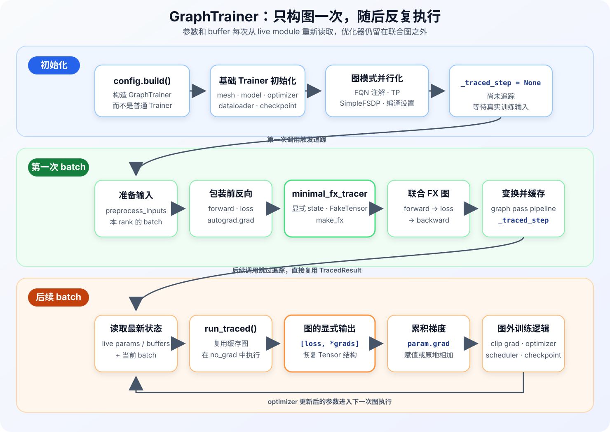

# 第 7 章 · GraphTrainer 的整步训练图

<div class="notebook-hero" markdown>

<span class="chapter-kicker">TorchTitan · GraphTrainer 路线 · 第 7 章</span>

[上一章](06-torch-compile-explicit-collectives.md)介绍的普通 `Trainer` 会逐个编译 TransformerBlock，Trainer 仍在图外调用 `loss.backward()`。这样改动小，也能利用 Dynamo、AOTAutograd 和 Inductor 优化每个 Block，但 TorchTitan 自己拿不到一张完整的前向—反向图。

GraphTrainer 换了一个边界：它把**模型前向、loss 和参数反向**写成一个普通函数，再用 `make_fx` 将这段函数捕获成联合 FX 图。后续的激活管理和通信调度都可以围绕这张图展开。本章先只回答这张图怎样产生、怎样执行；具体的 graph pass 留到下一章。

</div>

!!! info "版本与阅读范围"
    本文以 TorchTitan 提交 [`a3168782c`](https://github.com/pytorch/torchtitan/tree/a3168782c9a3a2e40afbd0de114818b96e2bda6e)为基准，主要对应 [`experiments/graph_trainer/trainer.py`](https://github.com/pytorch/torchtitan/blob/a3168782c9a3a2e40afbd0de114818b96e2bda6e/torchtitan/experiments/graph_trainer/trainer.py)和 [`make_fx_tracer.py`](https://github.com/pytorch/torchtitan/blob/a3168782c9a3a2e40afbd0de114818b96e2bda6e/torchtitan/experiments/graph_trainer/make_fx_tracer.py)。GraphTrainer 仍位于 `experiments` 目录，接口和实现可能继续变化。

    本章沿非 Pipeline Parallel（PP）、未加载预编译 artifact 的默认 `compile.mode="aot_fx_trace"` 路径展开。配置 `precompile_artifact_dir` 后，第一次调用会加载离线产物而不是现场追踪，但后续执行方式不变。PP 会为每个 stage 构造和拆分局部图，不是这里这张单模型联合图，后面再单独介绍。

## 1. 选择 GraphTrainer 训练入口

GraphTrainer 不是在普通 Llama 训练命令后加一个 `--compile.enable` 就能打开的。这个参数只会让普通 `Trainer` 进入第 6 章的逐 Block 编译路径。要使用 GraphTrainer，需要选择 `graph_trainer` 下的模型模块和配置：

```bash
MODULE=graph_trainer.llama3 \
CONFIG=graph_trainer_llama3_8b \
./run_train.sh
```

以 Llama 3 为例，[`graph_trainer_llama3_8b()`](https://github.com/pytorch/torchtitan/blob/a3168782c9a3a2e40afbd0de114818b96e2bda6e/torchtitan/experiments/graph_trainer/llama3/config_registry.py#L94)先取得普通 Llama 3 配置，再调用 `to_graph_trainer_config()` 完成三项替换：

1. 把顶层配置换成 `GraphTrainer.Config`，其中 `compile` 字段使用 `GraphTrainerCompileConfig`；
2. 把模型配置和 `parallelize_fn` 换成 GraphTrainer 对应版本；
3. 当前实现将 `spmd_backend` 设为 `"partial_dtensor"`，并重置 eager Activation Checkpoint 配置；实际的激活保存、重算与 offload 由 GraphTrainer 的 graph pass 和 `memory_policy` 控制。

配置工厂最后设置：

```python
config.compile = GraphTrainerCompileConfig(enable=True)
```

`GraphTrainerCompileConfig.mode` 默认就是 `"aot_fx_trace"`，因此上面的命令不需要再附加 `--compile.enable`。训练入口仍然只执行 `config.build()`；由于当前对象是 `GraphTrainer.Config`，最终构造出来的自然是 `GraphTrainer`。

!!! note "与第 5、6 章的关系"
    当前 GraphTrainer 配置转换会切回 `partial_dtensor`，所以它并不是在第 5 章的 `spmd_types` 类型检查之上继续构图。前两章介绍的 DeviceMesh、Placement 和逻辑全局张量仍然共用；第 6 章介绍的 FX 图、编译与 CUDA Graph 分工也仍然适用。

## 2. 初始化阶段的共用部分与替换点

`GraphTrainer` 直接继承普通 `Trainer`，构造函数首先调用 `super().__init__(config)`。因此分布式环境、DeviceMesh、meta device 模型构造、参数初始化、优化器、数据集、checkpoint 和外层 `train_step()` 都沿用同一套基础设施。

真正被替换的是模型并行化和前反向入口：

| 阶段 | 普通 `Trainer` | `GraphTrainer` |
| --- | --- | --- |
| 配置构造 | `Trainer.Config` | `GraphTrainer.Config` |
| 模型类型 | 普通模型及其 `parallelize_fn` | GraphTrainer 模型子类及专用 `parallelize_fn` |
| 数据并行 | FSDP2 等普通并行封装 | 使用可追踪的 SimpleFSDP 表达参数访问与通信 |
| 编译入口 | 初始化时给每个 Block 安装 `Module.compile()` | `aot_fx_trace` 初始化时不捕获图，只登记编译设置 |
| 前反向入口 | `forward → loss → loss.backward()` | 重写 `forward_backward_step()`，进入联合图捕获与执行 |

以 GraphTrainer 的 Llama 3 为例，模型初始化中的关键顺序是：

```text
meta device 上构造 GraphTrainerLlama3Model
    → annotate_module_fqns()       给算子保留所属模块信息
    → model.parallelize()          应用 TP 等模型并行
    → apply_simple_fsdp()          把参数分片访问写成可追踪操作
    → apply_compile()              设置编译选项，暂时不追踪
    → to_empty() + init_weights()  分配并初始化真实状态
    → 构造 optimizer、dataloader 和 checkpointer
```

这里的 `annotate_module_fqns()` 会给模块调用留下 fully qualified name（FQN，模块全限定名）信息，例如 `layers.7.attention`。FX 图最终只剩算子节点，后续 pass 需要靠这些注解找回节点所属的层和子模块。

SimpleFSDP 的具体通信机制也不在本章展开，现在只需要知道它把参数 all-gather、梯度 reduce-scatter 等行为表达成可追踪的 Tensor 操作。否则通信藏在运行时 hook 里，即使模型算子进入了 FX 图，GraphTrainer 仍然看不到完整的数据依赖。

基础 `Trainer.__init__()` 返回后，`GraphTrainer` 再初始化图模式自己的状态，其中最重要的是：

```python
self._traced_step: TracedResult | None = None
```

这说明初始化结束时还没有联合图。`None` 表示第一次真实训练调用需要追踪；一旦生成 `TracedResult`，后面的训练调用就会复用它。



*图 1：初始化只准备可追踪模型和空的 `_traced_step`。第一次 batch 产生联合 FX 图并经过 pass pipeline；稳态执行重新读取 live 参数和 buffer，图返回 loss 与显式梯度，随后基础 Trainer 在图外完成梯度裁剪和参数更新。*

## 3. 第一次前反向调用

非 PP 路径进入 `GraphTrainer.forward_backward_step()` 后，仍然先调用模型的 `preprocess_inputs()`，得到当前 rank 真正参与计算的 `inputs`、`labels` 和 `extra_kwargs`。区别从这里开始：普通 Trainer 会调用 `_forward_backward_body()`，GraphTrainer 则进入 `_make_fx_forward_backward_step()`。

第一次调用发现 `_traced_step is None`，于是依次完成下面四步。

### 3.1 将前向和反向写成一个函数

[`make_fwd_bwd_step()`](https://github.com/pytorch/torchtitan/blob/a3168782c9a3a2e40afbd0de114818b96e2bda6e/torchtitan/experiments/graph_trainer/trainer.py#L74)返回一个闭包。删去注解代码后，它的主体很直接：

```python
def fwd_bwd_step(inputs, labels, global_valid_tokens, extra_kwargs):
    pred = model(inputs, **extra_kwargs)
    loss = loss_fn(pred, labels, global_valid_tokens)
    params = [p for p in model.parameters() if p.requires_grad]
    grads = torch.autograd.grad(loss, params)
    return [loss] + list(grads)
```

这里没有调用 `loss.backward()`。`loss.backward()` 的主要接口语义是沿 autograd graph 回传，并把最终结果累积到每个参数的 `.grad`；这个写入动作是一种隐藏副作用。`torch.autograd.grad(loss, params)` 则直接返回梯度 Tensor，所以函数的数学关系可以写成：

$$
G(P,B;X,Y,N,K)
\rightarrow
\left(L,\nabla_{P_1}L,\ldots,\nabla_{P_m}L\right)
$$

其中 $P$ 和 $B$ 是模型参数与 buffer，$X$ 和 $Y$ 是输入与标签，$N$ 是全局有效 token 数，$K$ 代表 position、attention mask 等额外输入。输出 $L$ 是 loss，后面的每一项是对应参数的梯度。

这样写以后，backward 不再只是一句触发 autograd engine 的命令。反向算子和最终梯度都有普通的数据依赖，可以与 forward、loss 一起进入同一张 FX 图。

### 3.2 将模型状态变成显式图输入

`model` 虽然被捕获在闭包里，但它的参数和 buffer 不能继续作为隐藏状态留在图外。GraphTrainer 调用 `minimal_fx_tracer(fwd_bwd_fn, module=model)` 时，tracer 会先读取：

```python
model.named_parameters(remove_duplicate=False)
model.named_buffers(remove_duplicate=False)
```

然后把模型状态与本次调用参数合并并展平：

```text
{parameters, buffers} + {inputs, labels, global_valid_tokens, extra_kwargs}
                                ↓ pytree flatten
[state 0, state 1, ..., input 0, input 1, ...]
```

追踪闭包时，`stateless._reparametrize_module()` 会临时让 `model` 中的属性引用这些显式传入的状态。模型代码仍然写成 `model(inputs)`，生成的 GraphModule 却不再依赖闭包里某个固定的参数值，而是接收一组平坦的参数、buffer 和 batch 输入。

当前 GraphTrainer 使用 `partial_dtensor`，参数中会出现 DTensor 等 Tensor subclass。`minimal_fx_tracer` 会先把这些 wrapper 递归拆成 plain Tensor 叶子，并记录之后怎样恢复原来的 subclass。因而 FX 图入口看到的是当前 rank 的本地存储 Tensor，不是额外复制的一份逻辑全局参数；DTensor 的全局 shape 和 Placement 信息保存在重建元数据中。

### 3.3 捕获联合图

输入展平后，tracer 将 Tensor 转换成 FakeTensor。FakeTensor 保存 shape、stride、dtype 和 device 等结构信息，但不为同等大小的真实激活分配 storage，适合用来完成算子级追踪和 shape 推导。

随后 `make_fx()` 执行前面构造的 `fwd_bwd_step()`。GraphTrainer 会为这次追踪准备好 autograd 上下文，使 `torch.autograd.grad()` 内部的反向算子也被捕获。最终得到的不是 AOTAutograd 再拆开的前向图与反向图，而是一张扁平的联合 GraphModule：

```text
parameters / buffers / batch
        ↓
model forward
        ↓
loss
        ↓
explicit backward operators
        ↓
[loss, grad_0, grad_1, ..., grad_m]
```

联合图中的前向中间值可以直接连到使用它的反向节点。节点还保留 FQN、stack trace 以及 forward/backward 对应关系，给后续激活重计算、通信分桶和代码生成使用。

### 3.4 保存图和运行时重建信息

单独保存 GraphModule 还不够。运行时必须知道输入怎样展平、DTensor 怎样还原、输出怎样重新组成原结构。因此 `minimal_fx_tracer()` 返回的是一个 `TracedResult`：

| 内容 | 运行时用途 |
| --- | --- |
| `gm` | 前向、loss 和反向组成的联合 FX GraphModule |
| `example_inputs` | graph pass 和编译阶段使用的 FakeTensor 示例输入 |
| `state_fqns` | 记录参数与 buffer 的顺序，运行时据此读取 live state |
| `input_subclass_layouts` | 记录 DTensor 等输入怎样被拆开和恢复 |
| `output_subclass_layouts`、`output_spec` | 把平坦的 loss 与梯度输出恢复成原结构 |

GraphTrainer 接着把 `gm` 交给 graph pass pipeline。这里先把它看成一个有序的图变换步骤，具体有哪些 pass、为什么有严格顺序，是下一章的内容。处理后的 `TracedResult` 最终保存到 `self._traced_step`，第一次调用的构图阶段到此结束。

## 4. 后续训练调用

第二个及之后的 batch 再进入 `_make_fx_forward_backward_step()` 时，`_traced_step` 已经存在，不会重新调用 `minimal_fx_tracer()`。GraphTrainer 直接用 `run_traced()` 执行缓存结果。

每次执行仍然会重新读取当前模型的参数和 buffer，并按追踪时的顺序展平。这样做很重要：参数已经被上一次 `optimizer.step()` 原地更新，联合图需要拿到最新的 live state，而不是第一次追踪时的旧值。

`run_traced()` 在 `torch.no_grad()` 中执行联合 GraphModule。这里关闭 autograd 不是因为不需要反向，而是因为反向算子已经在图里；如果再让 eager autograd 记录这次图执行，就会在显式 backward 外面多建一层无用的 autograd graph。

联合图返回 `[loss, *grads]` 后，[`accumulate_param_grads_()`](https://github.com/pytorch/torchtitan/blob/a3168782c9a3a2e40afbd0de114818b96e2bda6e/torchtitan/experiments/graph_trainer/common_utils.py)把梯度交回参数：

```text
param.grad is None  →  param.grad = graph_grad
param.grad 已存在   →  param.grad += graph_grad
```

第二种情况保留了基础 Trainer 的 gradient accumulation 语义。经过一次或多次联合图执行后，控制权回到继承来的 `Trainer.train_step()`，它继续完成：

```text
clip_grad_norm_
    → 检查 loss 与梯度是否为有限值
    → optimizer.step()
    → lr_scheduler.step()
```

因此，当前主线得到的是**整段 forward-loss-backward 图**，不是包含优化器的完整训练 step 图。`minimal_fx_tracer` 工具本身支持传入 optimizer，但 GraphTrainer 的实际调用只传了 `module=model`；能力已经存在，不代表当前训练入口已经使用。

## 5. 两种 Trainer 的执行边界

把整个过程压缩起来，普通 Trainer 与 GraphTrainer 的分界很清楚：

```text
普通 Trainer
Python 训练循环
    → 编译后的 Block forward
    → 独立编译的 loss
    → loss.backward()
    → 各 Block 的编译后 backward
    → optimizer

GraphTrainer
Python 训练循环
    → [forward → loss → explicit backward] 联合 FX 图
    → loss + grads
    → 写入 param.grad
    → optimizer
```

GraphTrainer 没有重写数据加载、梯度累积、梯度裁剪、优化器、学习率更新和 checkpoint。它重写的是 `forward_backward_step()` 这一段，并把模型状态从隐藏的 Module 属性提升为显式图输入。正因为图同时看到了 forward、backward 和分布式 collective，TorchTitan 才能在下一步直接复制、删除或重排其中的节点。

## 6. 小结

选择 `graph_trainer.<model>` 模块后，配置系统会构造 `GraphTrainer.Config`、GraphTrainer 模型子类和专用并行化函数。`GraphTrainer` 仍复用基础 Trainer 的大部分初始化与训练循环，但会用 SimpleFSDP 准备可追踪的分布式参数访问，并将 `_traced_step` 初始化为空。

第一次真实前反向中，`make_fwd_bwd_step()` 用 `torch.autograd.grad()` 将参数梯度变成函数输出；`minimal_fx_tracer()` 再把参数、buffer 和 batch 展开为显式输入，通过 FakeTensor 与 `make_fx` 得到联合 GraphModule。图和结构恢复信息一起保存在 `TracedResult` 中，后续 batch 直接读取最新的 live state 执行这张图。

图返回的梯度最终仍会累积到 `param.grad`，梯度裁剪和优化器更新继续留在基础 Trainer 中。下一章将在这个边界内继续：GraphTrainer 拿到联合图之后，具体怎样安排内存、通信与代码生成。

---

上一章：[torch.compile 与显式通信](06-torch-compile-explicit-collectives.md)

下一章：[GraphTrainer 的图变换流水线](08-graph-trainer-passes.md)
