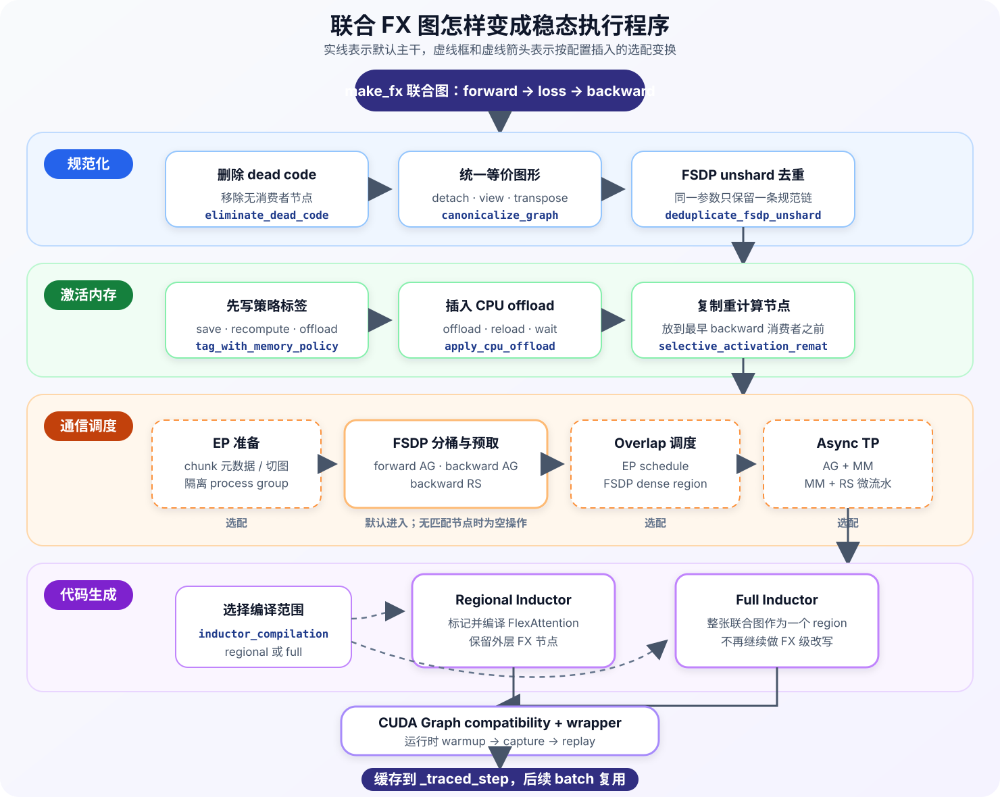

# 第 8 章 · GraphTrainer 的图变换流水线

<div class="notebook-hero" markdown>

<span class="chapter-kicker">TorchTitan · GraphTrainer 路线 · 第 8 章</span>

[上一章](07-graph-trainer-step-graph.md)得到了一张包含模型前向、loss 和参数反向的联合 FX 图。图里已经有本地计算、激活依赖和分布式 collective，但它还只是 `make_fx` 按实际执行过程记录下来的原始程序。

GraphTrainer 接下来会把这张图依次交给多个 pass。每个 pass 接收当前 GraphModule，检查或修改节点、依赖关系与元数据，再把结果交给下一个 pass。它们共同完成四件事：**整理图结构、决定激活怎样保存、重新安排通信、生成最终执行代码**。

</div>

!!! info "版本与阅读范围"
    本文以 TorchTitan 提交 [`a3168782c`](https://github.com/pytorch/torchtitan/tree/a3168782c9a3a2e40afbd0de114818b96e2bda6e)为基准，主要对应 [`passes.py`](https://github.com/pytorch/torchtitan/blob/a3168782c9a3a2e40afbd0de114818b96e2bda6e/torchtitan/experiments/graph_trainer/passes.py)。本章仍沿非 Pipeline Parallel（PP）的默认 `aot_fx_trace` 路径展开。

    下面先讲所有模型共用的主干，再标出 EP overlap、FSDP overlap 和 Async TP 等选配分支。各项优化是否适用于某种硬件和并行组合，仍应以对应配置校验和 TorchTitan 测试范围为准。

## 1. Pass 的构造与执行入口

第一次联合图捕获结束后，`GraphTrainer._make_fx_forward_backward_step()` 会先取得 pass 列表，再按顺序执行：

```python
pipeline_fn = PASS_PIPELINE_REGISTRY.get(
    config.compile.pass_pipeline,
    construct_default_graph_passes,
)
passes = pipeline_fn(traced_result, config, parallel_dims=parallel_dims)

traced_result.gm = apply_graph_passes(
    traced_result.gm,
    traced_result.example_inputs,
    passes,
    compile_config=config.compile,
)
```

默认 `pass_pipeline="default"`，因此通常由 [`construct_default_graph_passes()`](https://github.com/pytorch/torchtitan/blob/a3168782c9a3a2e40afbd0de114818b96e2bda6e/torchtitan/experiments/graph_trainer/passes.py#L410)构造列表。`PASS_PIPELINE_REGISTRY` 则给实验代码留了替换整条流水线的入口。

每个 pass 都遵循近似相同的接口：

```python
pass_fn(gm, example_inputs, **pass_options) -> gm
```

`gm` 是当前联合 GraphModule，`example_inputs` 是第 7 章中保存的 FakeTensor 示例输入。有的 pass 原地修改节点，有的返回新的 GraphModule，还有的只写节点元数据；`apply_graph_passes()` 不区分实现方式，只保证前一个 pass 的返回值成为后一个 pass 的输入。

因此这里的“流水线”首先意味着**有序执行**。内存策略需要先给节点打标签，重计算 pass 才知道该复制哪些节点；FSDP 通信需要先形成稳定模式，分桶 pass 才能识别；Inductor 把区域编译成 callable 后，原来的 FX 节点可能不再是权威表示，所以它必须靠近末尾。



*图 1：默认主干从联合 FX 图开始，先规范化，再把内存策略落实成 offload 或重计算节点，然后安排 FSDP 通信，最后选择 regional/full Inductor 并尝试 CUDA Graph 包装。虚线框中的 EP、FSDP overlap 和 Async TP 由配置决定是否插入。*

## 2. 默认流水线的顺序

未加载预编译 artifact、`enable_passes=True` 时，pass 列表可以按功能归纳为下面四段。表中“默认”表示默认配置下会进入列表；即使某个 pass 被调用，图中没有匹配节点时也可能原样返回。

| 阶段 | Pass | 默认 | 最终留下什么 |
| --- | --- | --- | --- |
| 图规范化 | `eliminate_dead_code_pass`、`canonicalize_graph_pass`、`deduplicate_fsdp_unshard_chains_pass` | 是 | 结构稳定、可供后续模式匹配的联合图 |
| 激活生命周期 | `tag_with_memory_policy_pass`、`apply_cpu_offload_pass`、`selective_activation_remat_pass` | 是 | 保存标签，以及按策略插入的 offload/reload 或重计算节点 |
| 分布式调度 | EP chunk/schedule、process group 调整、FSDP 分桶与预取、Async TP | 部分选配；FSDP 分桶默认进入 | 重组后的 collective、bucket 和计算依赖 |
| 代码生成与回放 | regional/full Inductor、kernel annotation、`cudagraph_pass` | 默认 regional Inductor，并尝试 CUDA Graph | 可直接执行并缓存到 `_traced_step` 的 GraphModule |

源码中的准确顺序比这张归类表更细：

```text
dead code elimination
→ graph canonicalization
→ FSDP unshard 去重
→ memory policy 标注
→ CPU offload 落地
→ selective activation rematerialization
→ [EP 切块与 process group 隔离]
→ [FSDP collective process group 调整]
→ FSDP 分桶与预取
→ [EP overlap 调度]
→ [FSDP dense-region 调度]
→ [Async TP]
→ regional 或 full Inductor
→ [kernel annotation]
→ CUDA Graph 包装
```

方括号表示只有相应配置开启时才会加入。接下来按照这个顺序看每一段解决什么问题。

## 3. 规范化联合图

`make_fx` 记录的是正确程序，但不保证同一种语义总有唯一的节点形态。重复参数读取、没有消费者的节点和多余 view 都会增加后续 pattern matching 的难度。GraphTrainer 因而先把输入整理成更稳定的形式。

### 3.1 删除无效节点并统一等价写法

`eliminate_dead_code_pass` 先删除不再参与输出的节点。接着，`canonicalize_graph_pass` 合并了一组确定不会改变数值语义的清理操作，例如：

- 删除多余的 `detach`；
- 删除 identity view、slice 等空操作；
- 消去连续且互相抵消的 transpose；
- 将适合的 view 统一成更容易处理的 reshape 形式。

这些操作的目的不是节省几次小 kernel，而是减少同一语义的图形变体。后面的通信和内存 pass 可以匹配一种规范结构，不必同时覆盖许多等价写法。

### 3.2 合并重复的 FSDP unshard 链

SimpleFSDP 通过 parametrization 表达参数读取。同一个分片参数在 forward 中被读取多次时，追踪结果可能为每次读取都生成一条等价的：

```text
sharded parameter
    → all-gather
    → wait
    → reconstruct full parameter
```

`deduplicate_fsdp_unshard_chains_pass` 以参数 placeholder 为起点，找到这些重复链，让所有消费者共用第一份 unshard 结果，再删除多余 collective。这样既避免重复通信，也满足后续 FSDP pass 的前提：一个 flat parameter 对应一条规范的 unshard 链。

到这里，联合图的数值含义没有变化，但节点形态已经稳定下来，可以开始决定激活和通信的生命周期。

## 4. 激活生命周期的图变换

普通 eager Activation Checkpoint 通常用 module wrapper 圈定一段 forward，反向时重新调用这段模块。GraphTrainer 已经拿到联合图，不需要再靠 wrapper 重进 Python forward，而是可以直接标记和复制图节点。

这段处理分成“先决定，再落实”两步。

### 4.1 内存策略为前向节点分类

`tag_with_memory_policy_pass` 根据 `compile.memory_policy` 给前向节点写入策略标签。当前内置四种策略：

| `memory_policy` | 选择方式 |
| --- | --- |
| `default` | 保存计算代价高的算子结果和必要的 FSDP unshard，其余节点倾向在反向重算 |
| `full` | 默认强制重算，只保存 layer 输出、不可安全重放的随机算子，以及 `full_recompute_save_ops` 显式选中的操作 |
| `eager` | 按普通 Trainer 的 Selective AC 口径，在矩阵乘之间交替保存和重算 |
| `sac_and_offload` | 先应用默认策略，再在 CPU 内存预算内把选中的已保存激活改成 offload |

最终常见的标签有三类：

```text
MUST_SAVE                         前向结果保留在 GPU，反向直接读取
PREFER_RECOMPUTE / MUST_RECOMPUTE 前向结果不长期保留，反向前复制相应计算
MUST_CPU_OFFLOAD                  前向结果转移到 CPU，反向前再加载
```

这个 pass 只做决策，不会因为写了 `PREFER_RECOMPUTE` 就自动出现一份新计算，也不会因为写了 `MUST_CPU_OFFLOAD` 就立刻产生设备拷贝。真正改变执行图的是后面的两个 pass。

### 4.2 Offload 和重计算变成显式节点

`apply_cpu_offload_pass` 读取 `MUST_CPU_OFFLOAD` 标签，在 forward 插入 offload 与 wait，在 backward 使用前插入 reload 与 wait，并把原来的 backward 消费者改接到 reload 结果。没有节点被标成 offload 时，这一步直接返回原图。

随后 `selective_activation_remat_pass` 查找被 backward 使用的 recompute 节点，将必要的 forward 子图复制到最早的 backward 消费者之前：

```text
原始图
forward op ───────────────────────→ backward consumer

变换后
forward op      [不再为反向长期保存]
                     recomputed op → backward consumer
```

因此 GraphTrainer 的 activation rematerialization 不是一句“反向再调用一次某个 layer”。最终图里真的多出了一组带 `_recomputed` 后缀的算子节点，后面的通信调度和 Inductor 都能看到这些重计算。

## 5. 分布式通信的图变换

激活生命周期确定以后，GraphTrainer 才开始重排 collective。原因很直接：重计算可能复制 forward 中的通信，CPU offload 也会增加新的数据依赖；如果先安排通信，再修改激活路径，原有调度很可能失效。

### 5.1 FSDP 分桶与预取

默认会加入 `joint_transformer_block_bucketing_reordering_pass`。它利用第 7 章初始化时保留的 module FQN，以及 `TracedResult.state_fqns` 中的参数注册顺序，为每个 TransformerBlock 分别处理三类 collective：

- forward 参数 all-gather；
- backward 重计算所需的参数 all-gather；
- backward 参数梯度 reduce-scatter。

同一 bucket 内的通信被合并，后续 block 的 all-gather launch 还可以提前到前一段计算附近，再把 wait 留在参数真正被使用的位置。这里调整的是“什么时候发起、什么时候等待”，不会越过真实数据依赖。

如果开启 `enable_fsdp_ag_rs_overlap`，`reassign_collective_pgs_pass` 会先把相关 collective 分配到额外 process group，使 backward all-gather 和 reduce-scatter 有机会运行在不同通信 stream 上；后面的分桶 pass 会继承这个 process group。可选的 `enable_fsdp_dense_region_overlap` 则会继续把 FSDP bucket 调度到相邻的 dense 计算区域。

### 5.2 EP 与 TP 的选配分支

MoE 模型开启 `ep_overlap.enabled` 后，流水线会在 FSDP 分桶前准备 chunk 元数据或直接切分图，并隔离 EP process group；分桶完成后，`ep_overlap_schedule_pass` 再安排 token dispatch、expert 计算和 combine 的先后关系。最后将用于切块的符号 shape 收敛成后续编译能够处理的形式。

开启 `enable_async_tensor_parallel` 时，`async_tensor_parallel_pass` 位于分布式调度末尾。它登记图中 collective 使用的 symmetric memory process group，再调用 PyTorch Inductor 的 `micro_pipeline_tp_pass`，尝试把受支持的 all-gather + matmul、matmul + reduce-scatter 改成融合的微流水算子。

这与普通 Trainer 第 6 章的启用方式有所不同：普通 Trainer 只打开 Inductor 的全局 `_micro_pipeline_tp` 配置，让每个 Block 的编译过程运行该 pass；GraphTrainer 已经持有联合 GraphModule，因此直接把它作为自己流水线中的一个显式步骤调用。

## 6. Inductor 代码生成

通信与激活节点稳定后，GraphTrainer 才进入代码生成。这里由 `compile.inductor_compilation` 选择两条互斥路径。

### 6.1 Regional Inductor

默认值是 `"regional"`。GraphTrainer 先用 `annotate_flex_attention_for_regional_inductor_pass` 给 FlexAttention 的 higher-order op 及其子图写入 `compile_with_inductor` 元数据，再由 `regional_inductor_pass` 只抽取这些已标记区域交给 Inductor。没有标记的外层 FX 节点仍由 GraphModule 顺序执行。

如果同时开启 `numerics_changing_optim`，RMSNorm 等额外区域也可以被标记并编译。这个选项默认关闭，因为它允许采用可能改变数值细节的性能优化。

### 6.2 Full Inductor

设置 `--compile.inductor_compilation full` 后，`full_inductor_compilation_pass` 给联合图中所有非 placeholder/output 节点标上编译信息，再把整张图作为一个 region 交给 Inductor。它扩大了代码生成和融合范围，但也失去了继续按原始 FX 节点改图的机会。

因此 Full Inductor 必须是最后一个真正修改 FX 结构的 pass。它返回的 GraphModule 主要负责调用已经编译好的 artifact；后面还能套 CUDA Graph wrapper，却不应再运行依赖原始算子节点的变换。

!!! note "`backend` 与 `inductor_compilation`"
    `GraphTrainerCompileConfig.backend` 默认是 `"aot_eager"`，但它主要服务已经弃用的 `mode="jit"`。当前 `aot_fx_trace` 主线是否使用 Inductor、编译多大范围，取决于这里的 `inductor_compilation="regional" | "full"`。不能看到 `backend="aot_eager"` 就认为整条 GraphTrainer 路线没有使用 Inductor。

## 7. CUDA Graph 包装

只要 `disable_passes` 中没有 `cudagraph_pass`，`construct_default_graph_passes()` 最后就会把它加入列表。它先检查经过所有前置变换后的 GraphModule 是否满足 CUDA Graph 要求，再用 `CUDAGraphWrapper` 替换 `gm.forward`。

这一步不再修改计算依赖，也不会在构图阶段立即录制 GPU launch。真正执行时，第一次调用负责 warmup，第二次调用 capture 并 replay，后续调用直接 replay。参数和 buffer 对应图签名开头的静态输入；batch 等动态输入则需要复制到固定地址。

Regional Inductor 路径还会在 CUDA Graph 前插入 kernel annotation，使 profiler 能用 GraphTrainer 保存的 FQN 标出 kernel 属于哪个模块。Full Inductor 已经把图折叠成编译 artifact，不能再依赖原始 FX 节点插入这类 annotation。

如果最终图含有不兼容操作，`cudagraph_pass` 会保留普通 GraphModule 执行并给出 warning，而不是只捕获一部分图。需要显式关闭时可以使用：

```bash
--compile.disable_passes cudagraph_pass
```

## 8. Pass 运行的时机与配置边界

默认在线训练中，整条 pass pipeline 只在第一次联合图追踪后运行一次，结果随 `TracedResult` 缓存在 `_traced_step`。后续 batch 执行的是变换后的图，不会每轮重新做 pattern matching 和代码生成。

如果配置了 `precompile_artifact_dir`，规范化、内存、通信与 Inductor 等 compile-time pass 已经在离线预编译阶段完成。训练进程加载 artifact 后只追加本机运行时才能建立的 CUDA Graph wrapper。

几个总开关的作用也要分开：

| 配置 | 作用 |
| --- | --- |
| `--compile.no-enable_passes` | 非 PP 主线跳过整条可选 pass pipeline |
| `--compile.disable_passes <name,...>` | 按函数名移除指定 pass，主要用于实验和消融 |
| `--compile.memory_policy <policy>` | 选择激活保存、重算和 offload 决策 |
| `--compile.inductor_compilation regional|full` | 选择局部或整图 Inductor 编译 |
| `--compile.debug_graph_passes` | 保存每个 pass 前后的图并记录耗时与节点差异 |

`disable_passes` 只是按名称过滤列表，不会自动补偿被破坏的前置条件。例如绕过规范化后，后面的 FSDP pattern 不一定还能匹配。因此它更适合已经理解依赖关系后的定向实验，不应当作任意组合 pass 的通用配置系统。

## 9. 小结

GraphTrainer 的 pass pipeline 接收第 7 章构造的联合 GraphModule，并把前一个 pass 的输出直接交给后一个 pass。顺序决定了每一步看到的图：先规范化结构，再将内存策略落实成 offload 或重计算节点，然后基于最终激活依赖安排 FSDP、EP 和 TP 通信，最后才进入 Inductor 代码生成和 CUDA Graph 包装。

这套设计的核心价值是 TorchTitan 持有一张可修改的 forward-loss-backward 图。Activation Checkpoint 不再只是 module wrapper，FSDP 通信也不再只由运行时 hook 决定；它们都成为可以标注、复制、合并和重排的图节点。

下一章将单独进入 SimpleFSDP，沿参数生命周期解释分片参数怎样在前向 all-gather、在反向 reduce-scatter，以及这些 collective 为什么能被第 8 章的 pass 识别。

---

上一章：[GraphTrainer 的整步训练图](07-graph-trainer-step-graph.md)
