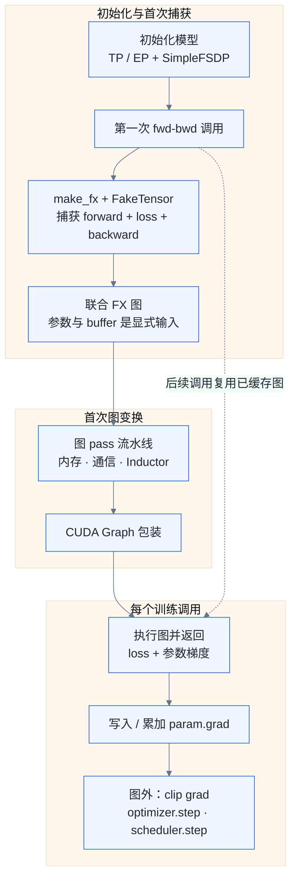
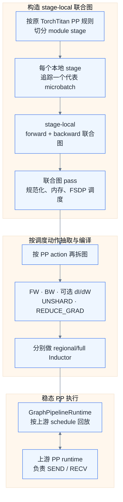

# GraphTrainer：整步训练图如何捕获、变换与执行

<div class="notebook-hero" markdown>

<span class="chapter-kicker">TorchTitan Framework · 独立源码分析</span>

GraphTrainer 的“图模式”不是只编译 `model.forward()`，而是先把**前向、损失和显式反向**捕获成一张联合 FX 图，再在同一表示上处理激活重计算、CPU offload、FSDP 通信编排、Inductor 编译与 CUDA Graph 回放。理解它的关键，是分清初始化、第一次训练调用和后续稳态执行分别留下了什么。

</div>

!!! note "实现范围与版本"

    本文分析 TorchTitan 提交 [`a3168782c`](https://github.com/pytorch/torchtitan/tree/a3168782c9a3a2e40afbd0de114818b96e2bda6e) 的 `torchtitan/experiments/graph_trainer`。主线是当前默认的 `compile.mode="aot_fx_trace"`；已经标记为 deprecated 的 JIT 模式只用于对照。GraphPP 是 Pipeline Parallel 下的独立扩展路径，将在第 8 节单独说明。

## 01 · 先给出结论：它编译的到底是什么 { #overview }

非 PP 路径可以抽象为下面的纯函数：

$$
G(P,B;\,X,Y,N,K) \rightarrow \left(L,\nabla_{P_1}L,\ldots,\nabla_{P_m}L\right)
$$

其中：

- $P$ 和 $B$ 分别是模型参数与 buffer；它们不再隐藏在 `nn.Module` 内，而是被提升为图的前置输入。
- $X$ 是模型输入，$Y$ 是标签，$N$ 是全局有效 token 数，$K$ 表示 `positions`、attention mask 等额外输入。
- $L$ 是标量 loss；$\nabla_{P_i}L$ 是每个可训练参数的显式梯度输出。

当前 `GraphTrainer` **没有把梯度裁剪、`optimizer.step()` 和学习率更新放进这张图**。这些操作仍由基础 `Trainer.train_step()` 在图执行之后完成。`minimal_fx_tracer` 工具本身已经设计了可选 optimizer 输入，但 GraphTrainer 的实际调用只传入 `module=model`，没有传 optimizer。这一区分比 README 中“可选 optimizer”这一能力描述更重要：工具能做什么，不等于当前训练主线已经做了什么。



因此，GraphTrainer 的核心价值并不是“把 Python 变快”这么简单，而是让原本分散在 autograd engine、FSDP Hook 和运行时回调里的行为，变成可以检查、复制和重排的图节点。

## 02 · 初始化阶段：先让并行语义变得可追踪 { #initialization }

以 Llama 3 为例，模型注册表把普通 TorchTitan 配置转换成 `GraphTrainer.Config`，并把 `parallelize_fn` 换成 GraphTrainer 版本。真正的初始化顺序位于 [`llama3/parallelize.py`](https://github.com/pytorch/torchtitan/blob/a3168782c9a3a2e40afbd0de114818b96e2bda6e/torchtitan/experiments/graph_trainer/llama3/parallelize.py)：

1. `annotate_module_fqns(model)` 给每个子模块的 `forward` 加上模块全限定名（fully qualified name，FQN）元数据。
2. 如果启用 TP，则先调用模型自身的 `parallelize()`，把张量并行布局施加到模型上；MoE 模型还可以先施加 EP。
3. `apply_simple_fsdp()` 无条件处理数据并行和混合精度。即使 FSDP degree 为 1，这一步仍用于参数 dtype 转换。
4. `apply_compile()` 读取编译配置。对默认 `aot_fx_trace` 而言，此处只做全局编译设置并返回原模型，不调用 `model.compile()`；真正捕获延迟到第一次训练调用。

FQN 注解不参与数值计算，却是后续 pass 的“语义坐标”。联合图已经被降到算子级，如果没有这些元数据，pass 只能看到 `aten.mm`、`wait_tensor` 等节点，无法判断它们属于 `layers.7.attention` 还是 `layers.8.moe`，也就无法按 Transformer block 做通信分桶或在层边界决定激活是否必须保存。

### SimpleFSDP 为什么适合图模式

普通 FSDP2 依靠 forward/backward Hook 在运行时切换分片参数与完整参数。GraphTrainer 使用的 [`simple_fsdp.py`](https://github.com/pytorch/torchtitan/blob/a3168782c9a3a2e40afbd0de114818b96e2bda6e/torchtitan/experiments/graph_trainer/simple_fsdp.py) 则给模块参数属性安装 parametrization：计算读取 `module.weight` 时，`ReplicateComputation` 会对分片 DTensor 执行 `redistribute(Replicate())`，取得本次计算所需的完整参数；反向产生的 `Partial` 梯度再通过 DTensor 传播规则归约到分片布局。

以 fully-shard 路径为例，逻辑关系是：

```text
常驻 Shard 参数
    → redistribute(Replicate)        # 前向 all-gather
    → 本 rank 完整计算参数
    → 本地 forward / backward
    → Partial gradient → Shard       # 反向 reduce-scatter
    → 分片参数梯度
```

这些 `redistribute` 最终会降低为 `_c10d_functional` collective，因此 `make_fx` 能在图中看到 all-gather、wait 和 reduce-scatter。通信不再藏在模块 Hook 里，后续 pass 才能对它们去重、分桶、预取和换流。

!!! important "逻辑 DTensor 与 FX 图输入不是同一个口径"

    模型参数在 Python 侧仍是带全局 shape 和 placement 的 DTensor；`minimal_fx_tracer` 会递归拆开 DTensor 等 tensor subclass，把底层 plain tensor 叶子交给 FX 图。进入被追踪函数前再临时恢复 subclass，图输出离开后也按记录的 layout 重建。因而图签名中的“参数 tensor”通常是当前 rank 的本地存储叶子，不是又常驻了一份全局完整参数。

## 03 · 第一次训练调用：如何得到前向—反向联合图 { #trace }

非 PP 且 `mode="aot_fx_trace"` 时，`GraphTrainer.forward_backward_step()` 不再调用基础 Trainer 的 `loss.backward()` 路径，而是进入 [`_make_fx_forward_backward_step()`](https://github.com/pytorch/torchtitan/blob/a3168782c9a3a2e40afbd0de114818b96e2bda6e/torchtitan/experiments/graph_trainer/trainer.py)。整个过程可以按数据生命周期拆成五步。

### 3.1 把 backward 写成普通函数的显式输出

`make_fwd_bwd_step()` 创建一个闭包，模型和 loss function 都捕获在闭包中：

```python
def fwd_bwd_step(inputs, labels, global_valid_tokens, extra_kwargs):
    pred = model(inputs, **extra_kwargs)
    loss = compute_annotated_loss(
        loss_fn, pred, labels,
        {"global_valid_tokens": global_valid_tokens},
    )
    params = [p for _, p in model.named_parameters(
        remove_duplicate=False
    ) if p.requires_grad]
    grads = torch.autograd.grad(loss, params)
    return [loss] + list(grads)
```

这里使用 `torch.autograd.grad()`，而不是让 `loss.backward()` 通过 `AccumulateGrad` 悄悄写入 `.grad`。于是 backward 的每个算子和最终梯度都能成为联合图中的显式节点与输出。

### 3.2 把隐藏的模型状态提升为函数输入

[`minimal_fx_tracer()`](https://github.com/pytorch/torchtitan/blob/a3168782c9a3a2e40afbd0de114818b96e2bda6e/torchtitan/experiments/graph_trainer/make_fx_tracer.py) 先从 live module 读取 `named_parameters()` 与 `named_buffers()`，再把它们和用户输入合并成一棵 pytree：

```text
[model parameters, model buffers, user args, user kwargs]
                         ↓ flatten / unwrap tensor subclass
[plain tensor leaf 0, plain tensor leaf 1, ..., primitive leaf]
```

追踪时，`stateless._reparametrize_module()` 临时让闭包中的模型引用这些显式状态输入。这样既保留了自然的 `model(inputs)` 写法，又让生成的 FX GraphModule 成为不依赖隐藏模块状态的平坦函数。

### 3.3 用 FakeTensor 建图，不拿真实激活跑一遍训练

所有 tensor 输入都会在带 `ShapeEnv` 的 `FakeTensorMode` 中 fakeify。FakeTensor 保存 device、dtype、shape 和 stride 等元数据，但不分配对应的真实大张量存储，因此第一次捕获不需要真的保存一整轮模型激活。

随后 `make_fx()` 在以下关键上下文中执行闭包：

- `_patch_engine_backward()` 让非严格 `make_fx` 能沿 `torch.autograd.grad()` 捕获 backward。
- 关闭 autograd 多线程，使 backward trace 留在当前 CPU 线程，避免上下文信息在工作线程中丢失。
- `preserve_node_meta()` 保留 FQN 等注解；forward 节点的模块和栈信息随后按 autograd sequence number 复制给对应 backward 节点。
- 嵌套的 `torch.compile` 被内联，避免 FlexAttention 等内部编译边界阻断外层追踪。

这一步不会走 AOTAutograd 的 forward/backward partitioner。得到的是一张扁平联合图，前向中间值可以直接连到显式 backward 节点。

### 3.4 `TracedResult` 不只保存一张图

追踪结果还要保存运行时恢复结构所需的元数据：

| 字段 | 作用 |
| --- | --- |
| `gm` | 前向、loss、backward 的联合 FX GraphModule |
| `example_inputs` | pass 做 shape propagation 和编译时使用的 fake 平坦输入 |
| `state_fqns` | 参数与 buffer 的追踪时顺序，用于运行时对齐 live state |
| `input_subclass_layouts` | DTensor 等输入被拆成哪些 plain tensor，以及如何重建 |
| `output_subclass_layouts` / `output_spec` | loss 与梯度如何从平坦输出恢复为原结构 |
| `num_static_inputs` | 参数与 buffer 展开后占据的前置输入数，供 CUDA Graph 判定静态地址 |

### 3.5 图只捕获一次，然后缓存在 Trainer 内

`GraphTrainer._traced_step` 初始为 `None`。第一次调用完成捕获和 pass 流水线后，它就持有最终 `TracedResult`；后续 microbatch 不再追踪，而是把最新的参数、buffer 和用户输入重新展平后执行同一个 GraphModule。

这里的“复用同一张图”要求输入结构和被捕获的控制流保持兼容。动态维可以通过 ShapeEnv 进入图，但 CUDA Graph 仍要求捕获区域不存在数据依赖的动态 shape 和设备到主机同步等不兼容操作。

## 04 · 图 pass：先改内存，再排通信，最后编译 { #passes }

默认 pass 列表由 [`construct_default_graph_passes()`](https://github.com/pytorch/torchtitan/blob/a3168782c9a3a2e40afbd0de114818b96e2bda6e/torchtitan/experiments/graph_trainer/passes.py) 构造。顺序不是装饰信息：后一类 pass 依赖前一类 pass 已经建立的图结构或元数据。

| 顺序 | pass 类别 | 当前有什么 | 发生什么 | 最终留下什么 |
| --- | --- | --- | --- | --- |
| 1 | 规范化 | 原始联合图 | 删除死代码和 no-op，合并同一参数的重复 FSDP unshard 链 | 后续 pattern 可稳定匹配的图 |
| 2 | 内存策略 | 带 forward/backward 标记的图 | 为 forward 节点标记保存、重算或 CPU offload 策略 | 每个激活的生命周期决策 |
| 3 | rematerialization | 带重算标签的联合图 | 在 backward 消费点前复制必要的 forward 子图 | 显式重计算节点，而非 checkpoint wrapper |
| 4 | EP 可选变换 | MoE 区域与符号 token 维 | 按 batch/sequence 切块、隔离 process group、重排 dispatch/compute/combine | 可重叠的 EP 微流水 |
| 5 | FSDP 编排 | 可见的 AG/RS 节点 | 可选换到额外 PG，并按 Transformer block 分桶和预取 | 通信与计算交叠后的联合调度 |
| 6 | TP 可选变换 | TP collective + matmul | 用 symmetric memory 融合 AG+MM、MM+RS | async TP 微流水算子 |
| 7 | Inductor | 仍可解释的 FX 图 | regional 或 full 编译 | Triton/Inductor callable 嵌回图中 |
| 8 | CUDA Graph | 最终 callable | 检查兼容性并包装 warmup、capture、replay | 稳态低 CPU launch overhead 执行器 |

### 激活 checkpoint 变成了“复制图节点”

默认内存策略会保存计算密集型算子和必要的 FSDP all-gather，其余节点倾向重算；`full`、`eager`、`sac_and_offload` 则提供其他策略。`tag_with_memory_policy_pass()` 只做决策，`selective_activation_remat_pass()` 才真正沿 backward 依赖找到需要重算的 forward 子图，并把副本插到最早的 backward 消费者之前。

这与 eager activation checkpoint 的边界不同：eager 路径通常以 module wrapper 为粒度重新执行一段 forward；GraphTrainer 可以逐 tensor、逐算子决定保存、重算或 offload，也能在同一层混合这些策略。

### FSDP 分桶为何必须发生在联合图上

`joint_transformer_block_bucketing_reordering_pass()` 同时看到：

- forward all-gather；
- backward 为重计算发起的 all-gather；
- backward reduce-scatter；
- 每个 collective 所属的 module FQN。

它可以分别给每个 Transformer block 的三类 collective 分桶，并把后续 bucket 提前到前一段计算中预取。若启用 `enable_fsdp_ag_rs_overlap`，all-gather 还会被改写到一个包含相同 ranks 的额外 NCCL process group；由于每个 PG 有独立 stream，backward all-gather 才有机会与原 PG 上的 reduce-scatter 同时推进。

这也是“图中看见通信”的直接工程收益：优化目标不再局限于单个 collective 的实现，而是可以改变整个训练步的通信发起顺序。

## 05 · Regional Inductor、Full Inductor 与 CUDA Graph 不是一回事 { #compile-and-replay }

这三者解决不同问题：

| 层次 | 默认行为 | 主要解决的问题 |
| --- | --- | --- |
| FX pass | 开启 | 改写数据依赖、激活生命周期和通信调度 |
| Regional Inductor | 默认 | 只编译带 `compile_with_inductor` 标记的区域；默认重点处理 FlexAttention，其他节点仍由 FX 执行 |
| Full Inductor | 可选 | 把整张联合图作为一个 region 编译，扩大 fusion 和代码生成范围 |
| CUDA Graph | 默认尝试 | 录制最终 GPU/NCCL 执行序列，稳态只 replay，降低 CPU kernel launch 开销 |

Regional Inductor 不是把联合图拆回传统的 forward/backward 两张图。它只从现有 FX 图中抽取被标记的局部区域编译，再把编译产物作为 callable 放回外层图。Full Inductor 则把所有非 placeholder/output 节点标记成一个整体区域；完成后原 FX 节点已不再是权威表示，所以它必须是最后一个 FX 级编译变换。

CUDA Graph 位于更外层。`cudagraph_pass()` 不继续融合算子，而是用 `CUDAGraphWrapper` 包装最终 `gm.forward`：

1. 第一次真实执行在共享 CUDA Graph memory pool 中 warmup，NCCL 和 kernel 仍正常运行。
2. 第二次调用创建并录制 CUDA Graph，然后执行 replay。
3. 后续调用把非静态 tensor 输入复制到录制时的固定输入 buffer，再 replay 已录制的执行序列。

模型参数和 buffer 的地址跨 step 稳定，因此作为静态输入不需要每轮复制；batch、label 等用户 tensor 是动态输入，需要复制到固定地址。输出也属于 CUDA Graph 管理的固定 storage，下一次 replay 会覆盖它，所以 Trainer 在需要跨 microbatch 累加日志 loss 时会先 `clone()`。

当前 `cudagraph_pass()` 是整图兼容性门禁。若图中含有数据依赖动态 shape、`.item()` 一类设备到主机同步、未 pinned 的跨设备复制或其他不安全节点，就跳过整图捕获，而不是悄悄只捕获一部分。

## 06 · 稳态训练：图输出怎样回到优化器 { #runtime }

[`run_traced()`](https://github.com/pytorch/torchtitan/blob/a3168782c9a3a2e40afbd0de114818b96e2bda6e/torchtitan/experiments/graph_trainer/make_fx_tracer.py) 每次执行前都会重新读取 live module 的参数和 buffer，按追踪时顺序展平，再与当前 batch 一起调用联合图。执行包在 `torch.no_grad()` 中，因为 backward 已经是图内的普通算子；如果再让 PyTorch 为这次图执行建立一层 autograd graph，会重复记录计算并让中间值被 `grad_fn` 额外持有。

联合图返回 `[loss, *grads]` 后，`accumulate_param_grads_()` 完成两件事：

1. 若 Inductor 返回的梯度 stride 与参数布局不同，先通过 `empty_like(param)` 物化成参数要求的全局及 DTensor-local layout。
2. `param.grad is None` 时直接赋值，否则原地相加，以支持基础 Trainer 的 gradient accumulation。

随后控制权回到基础 `Trainer.train_step()`：

```text
step 开始：optimizer.zero_grad()
    ↓
一次或多次联合图 replay
    ↓
loss + 显式 grads → 累加到 param.grad
    ↓
clip_grad_norm_ + finite check
    ↓
optimizer.step()
    ↓
lr_scheduler.step()
```

所以当前 GraphTrainer 更准确的名字是“**联合 forward-backward 图训练器**”，而不是“完整 optimizer step 图训练器”。优化器仍持有常驻分片参数，并在图外原地更新；下一次 replay 重新读取的就是更新后的 live 参数。

## 07 · 预编译：把第一次编译移到单卡离线阶段 { #precompile }

默认路径在每个训练进程第一次遇到 batch 时追踪和编译。`precompile_main.py` 提供 Compile-on-One-Rank（CooR）路径：单个 GPU 进程用 dummy input 捕获联合图、执行除 CUDA Graph 之外的编译 pass，再通过 `GraphPickler` 序列化 `GraphModule` 与 `TracedResult` 的结构元数据。

训练进程设置 `precompile_artifact_dir` 后不再调用 `minimal_fx_tracer`，而是加载已经包含 Inductor 产物的 artifact；每个 rank 只在运行时建立自己的 CUDA Graph。当前 artifact 指纹包含模型参数/buffer 的 shape 与 dtype、并行维度、部分编译字段、PyTorch 版本和 GPU capability，用于发现配置不一致。

这条路径优化的是**编译成本与多 rank 重复工作**，不改变稳态图的语义。这里的指纹不是模型源码和全部编译字段的完整内容哈希；artifact 仍然依赖精确的软件、模型与并行配置，不能当成跨环境通用的模型格式。

## 08 · 开启 PP 后：不是一张跨 rank 的全局大图 { #graph-pp }

Pipeline Parallel（PP）引入了跨 stage 的 send/recv 和多 microbatch 调度，无法直接把整个分布式训练集群表示成一个本地 GraphModule。GraphTrainer 因此使用 [`graph_pp`](https://github.com/pytorch/torchtitan/tree/a3168782c9a3a2e40afbd0de114818b96e2bda6e/torchtitan/experiments/graph_trainer/graph_pp) 路径：



最后一个 stage 对 loss 求导；其他 stage 用下游传回的 output gradient 调用 `torch.autograd.grad()`。联合图完成内存与通信 pass 后，`partition_joint_graph()` 再抽取 stage forward、backward 和 saved-for-backward 边界；FSDP collective 还可进一步拆成独立 `UNSHARD` 与 `REDUCE_GRAD` 图，Zero Bubble 类 schedule 所需的 backward-input（dI）与 backward-weight（dW）也可以分开。

`GraphPipelineRuntime` 不重新发明 PP 调度：microbatch 切分、action 顺序、P2P 通信和 stage 元数据仍由 PyTorch runtime schedule 管理；它只把 `FORWARD`、`FULL_BACKWARD`、`BACKWARD_INPUT`、`BACKWARD_WEIGHT`、`UNSHARD`、`RESHARD`、`REDUCE_GRAD` 等 action 映射到预先构造的 stage callable。对于 `OVERLAP_F_B` action，GraphPP 会把一个 forward 图和另一个 backward 图 multiplex 成一个 callable，以保留同一 action 内的交叠机会。

因此 PP 下的准确口径是：**每个 stage 先得到联合图，再按 pipeline schedule 需要的动作边界拆成一组可复用图；跨 rank 的 send/recv 与全局时间表仍在图外 runtime 中。** 当前 GraphPP 尚不支持 precompile artifact，CUDA Graph 也明确关闭，等待单独的稳态 runtime 集成。

## 09 · 与旧 JIT 模式的本质区别 { #jit-comparison }

| 对比项 | 旧 `mode="jit"` | 默认 `mode="aot_fx_trace"` |
| --- | --- | --- |
| 捕获入口 | `model.compile(fullgraph=True, backend=...)` | 第一次 `forward_backward_step()` 中的 `minimal_fx_tracer` |
| 图范围 | 以 model forward 为中心，由标准 `torch.compile` 栈接管 | forward + loss + 显式 backward 的联合图 |
| backward 可见性 | 通常由 AOTAutograd 等后续机制生成和分区 | 初始 FX 图中已经是显式算子 |
| 参数状态 | 主要仍作为 module state 处理 | 参数/buffer 被提升为平坦图输入 |
| 通信与重算调度 | 受编译边界和 eager 机制约束 | 在同一联合图 pass 中统一处理 |
| 状态 | deprecated | 当前默认主线 |

这也解释了为何默认模式仍叫 `aot_fx_trace`，却不能简单等同于常见的 `torch.compile(..., backend="inductor")`：这里把 PyTorch 编译组件当作工具箱，自己控制 trace 表示、pass 顺序、局部/全量 Inductor 以及 CUDA Graph 生命周期。

## 10 · 源码阅读地图 { #source-map }

| 阅读顺序 | 文件 | 关注点 |
| --- | --- | --- |
| 1 | [`trainer.py`](https://github.com/pytorch/torchtitan/blob/a3168782c9a3a2e40afbd0de114818b96e2bda6e/torchtitan/experiments/graph_trainer/trainer.py) | 何时捕获、何时复用，以及梯度怎样回到 `.grad` |
| 2 | [`make_fx_tracer.py`](https://github.com/pytorch/torchtitan/blob/a3168782c9a3a2e40afbd0de114818b96e2bda6e/torchtitan/experiments/graph_trainer/make_fx_tracer.py) | state functionalization、FakeTensor、subclass 展平与运行时重建 |
| 3 | [`simple_fsdp.py`](https://github.com/pytorch/torchtitan/blob/a3168782c9a3a2e40afbd0de114818b96e2bda6e/torchtitan/experiments/graph_trainer/simple_fsdp.py) | 为什么 FSDP collective 能进入 FX 图 |
| 4 | [`passes.py`](https://github.com/pytorch/torchtitan/blob/a3168782c9a3a2e40afbd0de114818b96e2bda6e/torchtitan/experiments/graph_trainer/passes.py) | pass 的真实顺序、默认项与可选项 |
| 5 | [`memory_policy.py`](https://github.com/pytorch/torchtitan/blob/a3168782c9a3a2e40afbd0de114818b96e2bda6e/torchtitan/experiments/graph_trainer/memory_policy.py) 与 [`selective_activation_remat.py`](https://github.com/pytorch/torchtitan/blob/a3168782c9a3a2e40afbd0de114818b96e2bda6e/torchtitan/experiments/graph_trainer/selective_activation_remat.py) | 激活如何被逐节点标记并复制到 backward |
| 6 | [`fsdp_passes.py`](https://github.com/pytorch/torchtitan/blob/a3168782c9a3a2e40afbd0de114818b96e2bda6e/torchtitan/experiments/graph_trainer/fsdp_passes.py) | AG/RS 去重、分桶、process group 与预取调度 |
| 7 | [`inductor_passes.py`](https://github.com/pytorch/torchtitan/blob/a3168782c9a3a2e40afbd0de114818b96e2bda6e/torchtitan/experiments/graph_trainer/inductor_passes.py) 与 [`cudagraph.py`](https://github.com/pytorch/torchtitan/blob/a3168782c9a3a2e40afbd0de114818b96e2bda6e/torchtitan/experiments/graph_trainer/cudagraph.py) | 代码生成与低 launch-overhead 回放的边界 |
| 8 | [`graph_pp/graph_builder.py`](https://github.com/pytorch/torchtitan/blob/a3168782c9a3a2e40afbd0de114818b96e2bda6e/torchtitan/experiments/graph_trainer/graph_pp/graph_builder.py) 与 [`graph_pp/runner.py`](https://github.com/pytorch/torchtitan/blob/a3168782c9a3a2e40afbd0de114818b96e2bda6e/torchtitan/experiments/graph_trainer/graph_pp/runner.py) | stage 联合图怎样适配 PP action runtime |

## 11 · 一句话收束 { #summary }

GraphTrainer 先用 SimpleFSDP 把分布式参数访问表达为可追踪算子，再用 `make_fx` 把前向、loss 和 `torch.autograd.grad()` 捕获成参数显式、backward 显式的联合 FX 图；随后所有内存与通信优化都作为有序 graph pass 执行，Inductor 负责选定区域的代码生成，CUDA Graph 负责稳态回放。图执行产生的梯度最后回到普通 `param.grad`，梯度裁剪和优化器更新仍由 TorchTitan 的基础训练循环完成。
