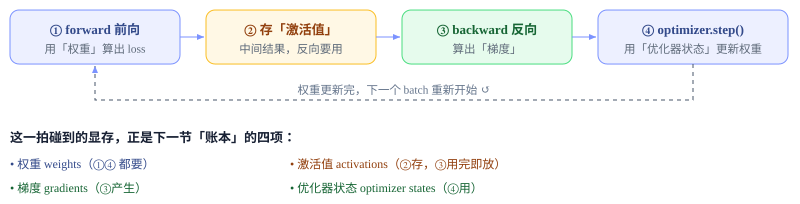
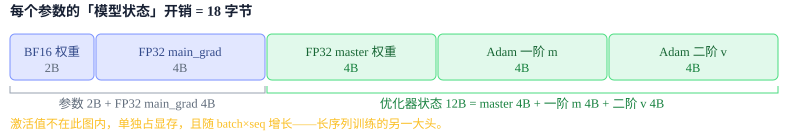
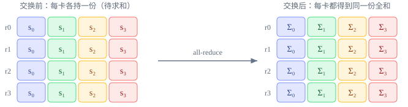
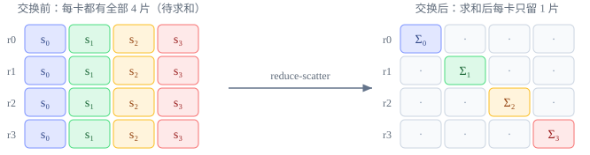
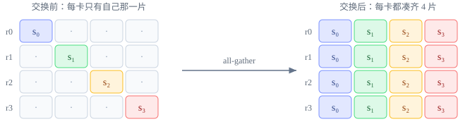
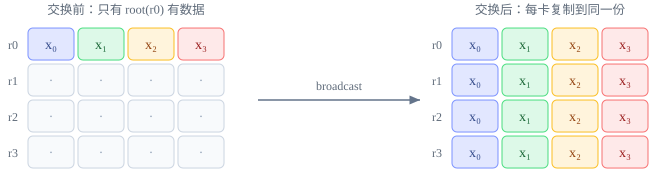
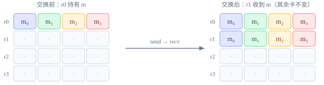
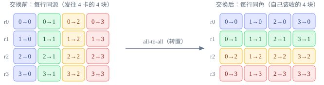

# 训练状态与集合通信：显存账本与卡间数据交换

第 1 章 · 训练状态与集合通信

在学任何一种并行之前，先建立两块地基：一次训练 step 的**显存账本**，以及卡间通信的**集合通信原语**。后面 DP / FSDP / TP / PP / CP / EP 全是在这两件事上做文章。

!!! abstract "读完这一章，你应该能回答 4 个问题"

    1. 一个 7B 模型，单卡 80GB 显存为什么还是装不下？显存到底花在哪？
    2. `all-reduce` 和 `reduce-scatter + all-gather` 是什么关系？
    3. 4 卡 ring all-reduce 一个 1 GiB 张量，每卡究竟发送多少字节？ring 和 all-reduce 是同一层概念吗？
    4. 为什么 TP 一般塞进单机、而 PP / DP 可以跨机？

    答得上来，就可以进入第 2 章；答不上来，回到对应小节再看一遍。后面所有并行都建立在这四件事上。

## 01 · 一次训练 step 的数据生命周期

先用常见的同步优化器训练路径把一个 step 简化为四个阶段：前向、保存反向所需激活、反向和参数更新。梯度累积、流水线调度或重计算会改变阶段的交错方式，但不会改变这些数据依赖：

*一次 step = 前向 → 存激活 → 反向 → 更新。带着这张图去看下一节的显存账本，每一项都能对上号。*

!!! tip "为什么要先记这张图"

    后面每种并行，本质都是「在四拍中的某一拍插入卡间通信」：DP 在 ③ 后同步梯度、FSDP 在 ① 前临时凑齐权重、PP 把不同层的 ①③ 拆到不同卡。所以看不懂某个并行在干嘛时，先问：**它动的是哪一拍？**

## 02 · 单卡训练的显存与算力约束

单卡训练大模型会撞上两堵墙：

- **显存墙**：模型参数、梯度、优化器状态、激活值加起来可能远超单卡显存。以常见的 80GB H100 SXM 为参照，一个 7B 模型仅下表口径中的优化器状态就约为 84GB，尚未计入参数、梯度和激活。
- **算力墙**：就算装得下，单卡算几万亿 token 要几十年。必须用成百上千张卡同时算。

并行的本质就是：**把「模型状态」和「计算」拆开，摊到多张卡上**。拆什么、怎么拆、拆完怎么把结果对齐——就是整本手册的内容。要理解拆什么，先看清显存到底花在哪。

## 03 · 显存账本：一次训练 step 的显存去向

对照上一节那张 step 图，训练显存就是它碰到的四样东西。记参数量为 $P$：

| 组成 | 是什么 | 本文 Megatron BF16 + Adam 账本中的大小 |
| --- | --- | --- |
| **参数 weights** | 前向使用的 BF16 模型权重 | $2P$ 字节 |
| **梯度 gradients** | 累积、通信和更新使用的 FP32 `main_grad` | $4P$ 字节 |
| **优化器状态 optimizer states** | FP32 master 权重 + Adam 一阶 $m$ + 二阶 $v$ | $4P + 4P + 4P = 12P$ 字节 |
| **激活值 activations** | 前向中间结果，反向要用 | 单独计算，$\propto$ batch × seq × 层数 |

在本文采用的 Megatron 混合精度路径中，前三项（*模型状态*）合计每参数 **18 字节**。反向算子产生的临时梯度可以是 BF16，但该路径把它累积进 FP32 连续梯度 buffer（`param.main_grad`），随后释放临时的 `param.grad`；因此本账本按常驻的 4B 梯度计算。不同优化器、精度策略与 master-weight 配置会改变这个系数。

*7B 模型：模型状态 = 7e9 × 18B ≈ **126 GB**，单卡放不下。优化器状态占 12/18 ≈ 66.7%，仍然是最大的单项，因此 ZeRO 的第一阶段先切它。*

!!! warning "把这笔账算到底：7B 模型上单卡"

    模型状态 = 7e9 × 18B = **126 GB**。一张 80GB H100 上，**光是参数 + 梯度 + 优化器状态就溢出约 46GB，激活值还没算**。这就是「显存墙」具体长什么样。

    切谁最划算？Megatron DistributedOptimizer 先只切优化器状态（近似 ZeRO-1）：8 卡时每卡为 $6P + 12P/8 = 7.5P$，7B 模型约 **52.5GB/卡**。若参数、梯度、优化器状态全部切分（ZeRO-3/FSDP），理想下界才是 $18P/8$，约 **15.75GB/卡**。

    这些数字还没有计入激活值、通信临时 buffer、对齐填充和显存碎片。这一笔账，就是后面所有「省显存」并行的出发点。

!!! success "记住这张账本"

    后面每种并行都对应「切账本里的某一项」：**FSDP/ZeRO 切模型状态**（参数 + 梯度 + 优化器状态）；**TP/PP 切参数与对应计算**；**SP/CP 切激活值**（按序列维）。看不懂某个并行省了什么时，回来对照这张表。

## 04 · 通信原语：并行的「语言」

多卡协作靠**集合通信（collective communication）**。一共 6 个原语，吃透它们，后面所有并行的通信都能看懂。下面统一设有 **4 张卡（r0–r3）**、每卡持有一份数据，逐个来看。

### ① all-reduce

把 4 张卡上的数据按元素求和（也可取 max/min），再把结果**发回每一张卡**——所有卡拿到同一份完整的全和。这是 DP 同步梯度的标准操作：每卡各算一份梯度，all-reduce 之后大家持有相同的平均梯度，更新后权重仍然一致。

*沿卡方向逐片求和，每片的全和 $\Sigma_j$ 发回每张卡，4 行变得完全相同。*

### ② reduce-scatter

和 all-reduce 一样先求和，但结果**不发完整份**——把全和切成 4 片，第 $i$ 张卡只保留第 $i$ 片。输出显存只有完整结果的 $1/N$；在后文统一采用的带宽最优 ring 口径下，发送字节约为 all-reduce 的一半。FSDP 用它归约梯度：每卡只需要自己负责那片参数的梯度。

*各卡按片相加，第 $i$ 卡只保留第 $i$ 片的和 $\Sigma_i$。*

### ③ all-gather

reduce-scatter 的**逆操作**：每张卡拿出手里的分片，**拼接**成完整一份，然后每张卡都得到这份完整数据。注意这里只拼接、*不做求和*。FSDP 在前向/反向前用它把分散保存的参数临时凑齐。

*各卡的分片 $s_i$ 拼成完整的 $s_0s_1s_2s_3$，每卡都有。*

!!! success "最重要的恒等式"

    **all-reduce = reduce-scatter + all-gather**

    把上面 ①②③ 串起来看：先 reduce-scatter 把全和切成分片，中间出现「每卡只持有 $1/N$」的省显存窗口，再 all-gather 拼回完整，**语义效果**就等于一次 all-reduce。这不表示底层一定先后调用两个独立 collective，tree 等算法也能直接完成同一语义。

    典型 FSDP 每 step 是「前向参数 all-gather + 反向参数 all-gather + 梯度 reduce-scatter」，DDP 是一次梯度 all-reduce。只有在参数与梯度等宽时，按元素数才是 $3P/2P=1.5\times$；若参数为 BF16、通信梯度为 FP32，两者的网络字节可以相同。第 3 章会按 dtype 展开这笔账。

### ④ broadcast

一张卡（root，这里是 r0）把它的数据**原样复制**到所有卡，不做任何运算。常用于初始化时同步随机种子/权重，或 PP 中把一个标量告诉所有 stage。

*root 的整行 $x$ 原样复制到每张卡。*

### ⑤ send / recv

在本节列出的六种操作中，send / recv 是**点对点**通信：指定一个发送 rank 和一个接收 rank，其余 rank 不参与这条消息。流水线并行 PP 用它在相邻 stage 间传递激活（前向）和梯度（反向）。

*点对点：r0 的整行 $m$ 发给 r1，其余卡不参与。*

### ⑥ all-to-all

最复杂的一个：每张卡把自己的数据**切成 $N$ 块、分别发给 $N$ 张卡**，同时收下别人发来的块——相当于把 $N\times N$ 的数据矩阵做一次**转置**。MoE 专家并行用它把 token **分发（dispatch）**到所属专家所在的卡，算完再 all-to-all **收回（combine）**。

*`i→j` 表示源卡 $i$ 发往目标卡 $j$ 的那块；颜色按目标 $j$ 着色，转置后每行同色。*

### 速查表：6 个原语用在哪

| 原语 | 一句话 | 用在哪个模块 |
| --- | --- | --- |
| `all-reduce` | 求和，每卡都得到完整全和 | 数据并行梯度同步（第 2 章） |
| `reduce-scatter` | 求和后每卡只留 $1/N$ 分片 | FSDP 梯度归约（第 3 章） |
| `all-gather` | 分片拼成完整，每卡都有 | FSDP 还原参数（第 3 章） |
| `broadcast` | 一张卡的数据复制到所有卡 | 初始化、流水线传标量（第 5 章） |
| `send / recv` | 点对点，一张卡发给另一张卡 | 流水线跨 stage 传激活/梯度（第 5 章） |
| `all-to-all` | 每卡按目标切块、互相交换（转置） | MoE 专家并行（第 7 章） |

### 通信量的统计口径

讨论「通信量」时最容易出现两倍甚至 $N$ 倍分歧，不一定是谁算错了，而是分母和口径不同。下面统一定义：

- 通信组有 $N$ 个 rank；$X$ 表示**完整逻辑张量**的字节数。例如参数量为 $P$、dtype 为 BF16，则 $X=2P$ bytes。
- 默认通信量 $V_{\mathrm{rank}}$ 指**每个 rank 发到链路上的字节数**（sent bytes / rank），这是判断单卡 NIC 或 NVLink 压力最实用的口径。对称 collective 的接收量与发送量相同，但**不再把 send + recv 相加**。
- $V_{\mathrm{group}}$ 是全组所有 rank 发送量之和。若 profiler 用「收发总 I/O」，对称 collective 的数字会是下表 $V_{\mathrm{rank}}$ 的 2 倍。
- 下表采用无冗余传输的 ring / direct-exchange 理想模型，忽略协议头、对齐、padding、重复路由与重传；真实字节还受底层算法和拓扑影响。

| 原语与 $X$ 的含义 | 每 rank 发送 $V_{\mathrm{rank}}$ | 全组发送 $V_{\mathrm{group}}$ | ring / 直接交换的轮数 |
| --- | --- | --- | --- |
| `all-reduce`：每卡输入/输出均为 $X$ | $2\frac{N-1}{N}X$ | $2(N-1)X$ | $2(N-1)$：前半 reduce-scatter，后半 all-gather |
| `reduce-scatter`：每卡输入 $X$，输出 $X/N$ | $\frac{N-1}{N}X$ | $(N-1)X$ | $N-1$ |
| `all-gather`：每卡输入 $X/N$，输出 $X$ | $\frac{N-1}{N}X$ | $(N-1)X$ | $N-1$ |
| `all-to-all`：每卡共有 $X$，均分给 $N$ 卡 | $\frac{N-1}{N}X$ | $(N-1)X$ | 通常与 $N-1$ 个远端 peer 交换；具体调度依实现 |
| `send / recv`：一条消息为 $X$ | 发送方 $X$；接收方 0 | $X$ | 1 次点对点传输 |
| `broadcast`：root 的 $X$ 复制到全组 | 各 rank 不均匀，取决于 tree / chain | 理想下界 $(N-1)X$ | tree 深度约 $\lceil\log_2N\rceil$；chain 为 $N-1$ |

!!! example "4 卡、完整张量 1 GiB 的心算例子"

    ring all-reduce 把 1 GiB 切成 4 块，每轮每卡发送 256 MiB：reduce-scatter 走 3 轮、all-gather 再走 3 轮，所以每卡发送 $6\times256=1536$ MiB = **1.5 GiB**，同时也接收 1.5 GiB；全组发送 $4\times1.5=6$ GiB。单独一次 reduce-scatter 或 all-gather 则是每卡 0.75 GiB。

张量元素数必须先乘 dtype 字节数。例如 $P$ 个 FP32 梯度做 ring all-reduce：

$$
V_{\mathrm{rank}}=2\frac{N-1}{N}\cdot 4P\ \text{bytes}
$$

粗略时间不能只看字节，还要看启动轮数：

$$
T_{\mathrm{comm}}\approx S\alpha+\frac{V_{\mathrm{rank}}}{B_{\mathrm{eff}}}+T_{\mathrm{reduce}}
$$

其中 $S$ 是通信轮数，$\alpha$ 是每轮延迟，$B_{\mathrm{eff}}$ 是有效带宽，$T_{\mathrm{reduce}}$ 是归约类 collective 在本地执行逐元素求和等运算、且未被通信重叠隐藏的时间；非归约类 collective 可将它视为 0。于是大张量更在意第二项，小张量更容易被 $S\alpha$ 支配。这正是同一个 collective 需要多种底层算法的原因。

## 05 · 硬件拓扑与并行维度放置

卡间带宽分层级，差距极大，这直接决定每种并行该放在哪一层：

| 层级 | 互连 | 量级带宽 | 适合放 |
| --- | --- | --- | --- |
| 单机内（intra-node） | NVLink / NVSwitch | 数百 GB/s ~ TB/s | 通常优先放 **TP**，也常承载通信密集的 EP / CP 子组 |
| 跨机（inter-node） | InfiniBand / RoCE | 数十 ~ 数百 GB/s（通常低于节点内互联） | 通常承载 **PP / DP / FSDP** 的外层通信组 |

!!! tip "核心放置直觉"

    通信越频繁、越接近关键路径的并行维度，越应优先放进高带宽域。TP 通常位于节点内；PP、DP/FSDP 更常向跨节点扩展。EP、CP 以及分层 FSDP 的具体放置还取决于消息大小、通信后端和集群拓扑，不能仅按并行名称固定判断。第 8 章会把这些维度放入同一张 rank 网格继续讨论。

## 06 · 训练效率指标

本章只需先认识 3 个当下用得上的词，其余指标等到第一次遇到它的模块再讲：

- **吞吐 throughput**：每秒处理多少 token（tokens/s）。最终目标，一切优化都为它服务。
- **MFU（Model FLOPs Utilization）**：模型每 step 的理论 FLOPs 除以实测时间与硬件峰值 FLOPs 的乘积。它用于比较有效训练计算占峰值算力的比例；可达到的数值随模型结构、精度、序列长度和硬件而变，不能用固定阈值跨任务判断优劣。
- **通信-计算重叠 overlap**：让集合通信和计算同时进行，把通信时间「藏」在计算后面。这是所有高效并行实现的命脉——后面会看到 FSDP 预取参数、DP 反向边算边 all-reduce、PP 用异步 P2P，全是为了 overlap。

## 07 · 本手册地图：每种并行切账本里的什么

有了显存账本和通信原语，整本手册可以一句话概括成「**切账本里的不同项，用不同原语对齐结果**」：

| 模块 | 切账本里的 | 主要通信原语 |
| --- | --- | --- |
| 第 2 章 · DP | 切数据（模型状态不切，冗余） | all-reduce（梯度） |
| 第 3 章 · ZeRO/FSDP | 切模型状态（参数 + 梯度 + 优化器状态） | all-gather + reduce-scatter |
| 第 4 章 · TP/SP | 切层内参数与计算；SP 切激活 | all-reduce / all-gather + reduce-scatter |
| 第 5 章 · PP | 切层（不同层放不同卡） | send / recv |
| 第 6 章 · CP | 切序列维的激活 | ring P2P / all-to-all |
| 第 7 章 · EP | 切专家（MoE） | all-to-all |

接下来进入第 2 章，从最简单的**数据并行**开始，它是后续并行策略的起点。
