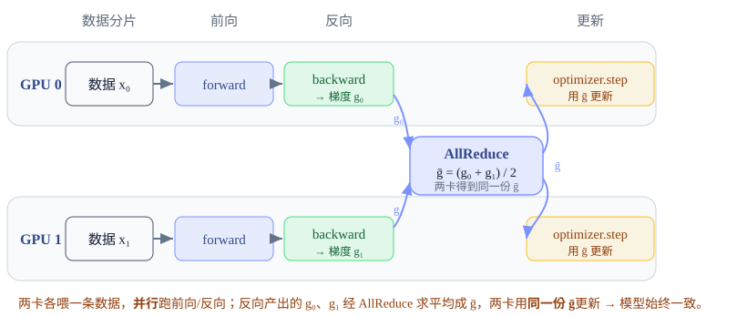

# Data Parallel：复制模型，切数据

<div class="notebook-hero" markdown>

<span class="chapter-kicker">第 2 章 · Data Parallel</span>

最简单的并行：每张卡放一份完整模型，把 batch 切成多份各算各的，再用一次 all-reduce 把梯度平均。它只解决「算得慢」，不解决「装不下」——但理解它是理解后面一切的起点。

**本章关键词：** 🔁 梯度 all-reduce · 🪣 bucket + 反向重叠 · 🚫 省不了显存 · 🟢 Megatron DDP

</div>


## 01 · 核心思想 { #idea }

数据并行（Data Parallel, DP）的设定：**模型放得下单卡，但想用 N 张卡加速**。做法三步：

1. **复制**：每张卡持有一份完整、相同的模型（参数、梯度、优化器状态都各存一份）。
2. **切数据**：把一个 global batch 切成 N 个 micro-shard，每卡喂自己那份，独立做前向+反向。
3. **同步梯度**：各卡算出的梯度不同，用一次 `all-reduce` 求平均，使所有卡的梯度一致 → 优化器更新后模型仍然完全相同。




*DP 的一个 step：两张 GPU 各持完整模型、各喂一条数据，独立前向+反向；反向算出的梯度用一次 **AllReduce** 求平均，再各自更新。*


## 02 · Megatron-LM：手写 DDP 的 bucket 与反向重叠 { #bucket }

Megatron 自己实现了一套经典 DDP，是把机制讲透的最佳样本。它的精髓不在「all-reduce 梯度」这句话，而在**怎么把通信藏进反向计算里**。三个关键设计：


### ① 连续梯度 buffer + bucket 分桶

所有参数的梯度不是各自为政，而是预分配进**一整块连续显存**，每个 `param.main_grad` 指向其中一段切片。Megatron 默认 BF16 训练会把这个累积与通信 buffer 设为 FP32，因此它虽然只有 $P$ 个元素，却占 $4P$ 字节。再把参数按**反向传播的逆序**切成若干 bucket：


**Megatron-LM · param_and_grad_buffer.py（连续 buffer 分配 :1068）**


```python
self.grad_data = torch.zeros(self.numel, dtype=self.grad_dtype,
    device=torch.cuda.current_device(), requires_grad=False)
# 之后每个 param.main_grad 被重指向 grad_data 的一段切片
```

为什么逆序分桶？反向传播从最后一层往前算，**先算完的层先组成 bucket、就能先发起通信**，而更前面的层还在计算——通信和计算因此能重叠。


### ② 梯度算完即标记 ready，bucket 满即异步通信

每个参数挂一个 backward post-hook：梯度一算完就累加进连续 buffer，并标记该参数 ready。当一个 bucket 内所有参数都 ready，立刻发起**异步** all-reduce（或 reduce-scatter）：


**Megatron-LM · param_and_grad_buffer.py:753（register_grad_ready）+ :538（start_grad_sync）**


```python
def register_grad_ready(self, param, force_all_reduce=False):
    if self.is_last_microbatch:
        self.per_param_grad_ready_counts[param] += 1
        # 本 bucket 所有 param 都 ready → 立即发起通信
        if self.per_param_grad_ready_counts == self.golden_per_param_grad_ready_counts:
            self.start_grad_sync(force_all_reduce=force_all_reduce)

# start_grad_sync 内的核心分支：
if self.ddp_config.use_distributed_optimizer and not force_all_reduce:
    grad_reduce_handle = dist_reduce_scatter_func(   # = reduce_scatter_tensor (ZeRO 风格)
        local_data_view, bucket.grad_data, op=reduce_op,
        group=communication_group, async_op=async_op)
else:
    torch.distributed.all_reduce(                    # 经典 DDP：完整梯度
        bucket.grad_data, op=reduce_op, group=communication_group, async_op=async_op)
```


!!! tip "🔑 这就是 overlap"

    `async_op=True` 让 all-reduce 在 NCCL stream 上异步进行，与**更前面层仍在做的反向计算**并行。等所有反向结束，再 `wait()` 收尾。理想情况下通信时间被计算完全掩盖。这也解释了为什么纯 DP 是「省不了显存但很能加速」的并行。


### ③ 梯度累积时用 no\_sync 跳过通信

做梯度累积（多个 micro-batch 攒一次更新）时，前面的 micro-batch 不需要通信，只在最后一个才发一次：


**Megatron-LM · distributed_data_parallel.py:463**


```python
@contextmanager
def no_sync(self):
    for bucket_group in self.bucket_groups + self.expert_parallel_bucket_groups:
        bucket_group.is_last_microbatch = False   # 关闭通信
    try:
        yield
    finally:
        for bucket_group in self.bucket_groups + self.expert_parallel_bucket_groups:
            bucket_group.is_last_microbatch = True
```


## 03 · 为什么 DP 省不了显存 { #nomem }

这是 DP 最重要的局限，也是后面所有「切模型状态」并行存在的理由。在 Megatron 默认 BF16 + Adam 的纯 DDP 下，每张卡都持有**完整的**：BF16 参数（$2P$）、FP32 `main_grad`（$4P$）、优化器状态（$12P$）。all-reduce 只是让梯度数值一致，并没有让任何一张卡少存东西：


**Megatron-LM · param_and_grad_buffer.py:1068（grad buffer 按整模型 numel 分配）**


```python
# grad_data 的大小 = 整个模型的参数量，每张卡都分配这么大
self.grad_data = torch.zeros(self.numel, ...)   # numel = 完整模型参数数
# all_reduce 后每 rank 仍持有完整梯度，参数/优化器状态也不分片
```


!!! warning "⚠️ 结论"

    N 卡 DP 的**单卡显存 = 单卡训练的显存**（约 $18P$ 字节模型状态 + 激活），完全不随 N 下降。DP 切的是*数据和计算*，不切*模型状态*。想让这 $18P$ 继续下降，就得进入下一章——按 ZeRO 的不同阶段切分优化器状态、梯度和参数。


## 04 · Megatron-LM 手写 DDP 要点回顾 { #compare }


#### Megatron-LM 手写 DDP

- 连续 grad buffer + 逆序 bucket
- backward post-hook → 异步 all-reduce
- 通信与反向计算显式重叠
- `no_sync()` 处理梯度累积
- 机制透明，最适合学习


#### Megatron-LM 显存与适用场景

- 每卡持完整参数 / 梯度 / 优化器状态
- 显存不随 N 下降，切的是数据与计算
- `use_distributed_optimizer` 才进一步分片
- 适合模型放得下单卡、只想加速的场景
- 是理解 FSDP / ZeRO 的最佳起点


!!! tip "✅ 学完自测"

    1. DP 为什么省不了显存？all-reduce 之后每张卡持有的梯度是完整的还是分片的？
    2. Megatron 为什么把参数按反向**逆序**分 bucket？这对 overlap 有什么帮助？
    3. 8 卡 DP、每卡 batch=4，global batch 是多少？
    4. Megatron 的 `no_sync()` 在梯度累积时做了什么？为什么能省通信？
