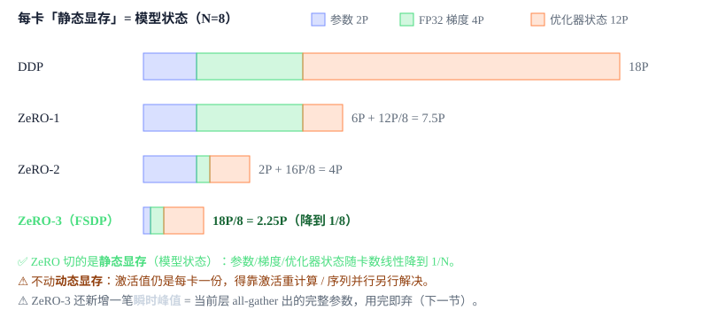
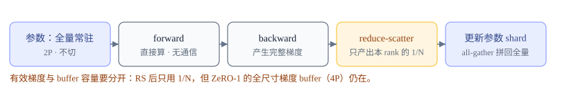
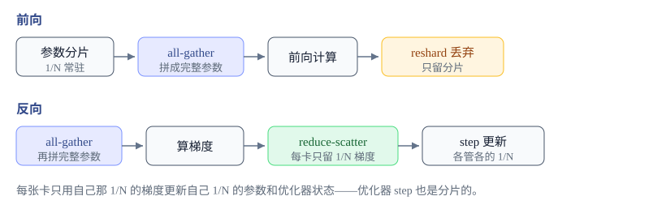
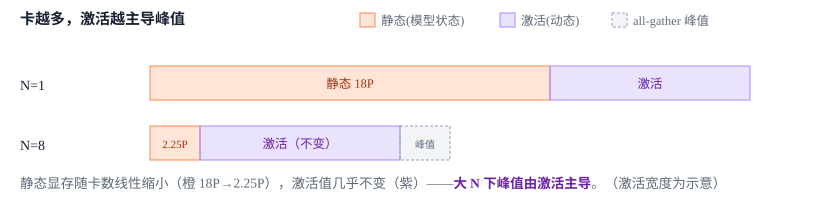

# 把模型状态也切开：ZeRO 与 FSDP

<div class="notebook-hero" markdown>

<span class="chapter-kicker">Module 2 · FSDP / ZeRO</span>

DP 让每张卡冗余存了 N 份模型状态。ZeRO 的洞察是：这些状态在每张卡上各存一份纯属浪费——把优化器状态、梯度、参数依次切到各卡，用时再临时聚合。ZeRO-3 就是 FSDP。

**本章关键词：** 📦 ZeRO 1/2/3 三阶段 · 🔄 all-gather 参数 + reduce-scatter 梯度 · 📉 显存降到 1/N · 🟢 Megatron DistributedOptimizer

</div>


## 01 · 动机：DP 的冗余 { #motivation }

上一章的结论：Megatron 默认 BF16 + Adam 的纯 DDP 下，每张卡都存**完整的**BF16 参数（$2P$）、FP32 `main_grad`（$4P$）、优化器状态（$12P$），共 $18P$ 字节，完全不随卡数下降。但仔细想——这 N 份副本**内容完全相同**，为什么每张卡都要存一整份？

ZeRO（Zero Redundancy Optimizer）的答案：**不存了，切开**。每张卡只持有 $1/N$ 的模型状态，需要完整参数时临时用 `all-gather` 拼起来，用完即丢。这样显存随卡数线性下降，代价只是多一点通信。


## 02 · ZeRO 三阶段：一刀一刀往下切 { #stages }

ZeRO 切的是**静态显存**——每 step 都常驻、内容在各卡完全相同的那三块「模型状态」（参数、梯度、优化器状态）。它**不碰动态显存**（激活值，那是每卡各不相同的中间结果，得靠激活重计算 / 序列并行去省）。三个阶段按「切得越来越多」排序，先切最大的那块（优化器状态占 $12/18 \approx 66.7\%$）：

| 阶段 | 在 ZeRO-1 基础上再切什么 | 每卡静态显存 | 对应实现 |
| --- | --- | --- | --- |
| baseline DDP | 啥都不切 | $2P + 4P + 12P = 18P$ | 普通 DP |
| **ZeRO-1** | 切**优化器状态** | $2P + 4P + 12P/N = 6P + 12P/N$ | Megatron `DistributedOptimizer` · Megatron-FSDP `optim` |
| **ZeRO-2** | 再切**梯度** | $2P + (4P + 12P)/N = 2P + 16P/N$ | Megatron-FSDP `optim_grads` · DeepSpeed |
| **ZeRO-3** | 再切**参数** | $(2P+4P+12P)/N = 18P/N$ | **FSDP**（PyTorch `fully_shard`）· Megatron-FSDP `optim_grads_params` |




*ZeRO 一刀一刀往下切「静态显存」，N 越大单卡省得越多。Megatron 的 DistributedOptimizer 做 ZeRO-1；Megatron-FSDP 与 PyTorch FSDP 可做到 ZeRO-2/3。*


## 03 · 一个 step 的流程：ZeRO-1 / 2 / 3 逐级变化 { #flow }

三个阶段每个 step 都是同一套骨架——**forward → backward → 同步梯度 → 更新 → 拼回完整参数**——区别只在**谁被切、何时做 all-gather**。逐个看：


### ZeRO-1：参数、梯度全量常驻，只切优化器状态

参数在每张卡上是**完整**的，所以前向/反向都不需要临时 all-gather，直接算。经典 ZeRO-1 可以用 all-reduce 得到全量平均梯度；Megatron DistributedOptimizer 则用 reduce-scatter 归约每个 rank 负责的区间，但仍保留全尺寸 FP32 梯度 buffer。每张卡**只用自己那 $1/N$** 去更新它负责的参数、master 参数和 Adam 状态，随后 all-gather 更新后的 BF16 参数，供下一个 step 使用。




*ZeRO-1：参数、梯度都全量常驻，只有优化器状态降到 1/N。前向/反向无需 all-gather。*


### ZeRO-2：backward 边算边 reduce-scatter，梯度也降到 1/N

唯一的变化在梯度存储：反向每算完一个 bucket 的梯度就立即 reduce-scatter，每张卡**只保留自己那 $1/N$ 的梯度、其余立刻释放**。于是 FP32 梯度显存从 $4P$ 降到 $4P/N$。参数依然全量常驻，前向/反向仍不需要为计算临时 all-gather 参数；完成分片更新后仍需同步更新后的参数。


*ZeRO-2：把 all-reduce 换成 reduce-scatter，梯度也切到 1/N。参数依旧全量常驻。*


### ZeRO-3 = FSDP：连参数也切，用到哪层才 all-gather 哪层

FSDP 的核心节奏：**参数平时是切碎的，用到哪层才把那层 all-gather 成完整，算完立刻丢回切片态**。代价是**前向也要 all-gather 一次参数**；若暂时忽略 dtype、按等宽元素计数，通信由 DDP 的 2P 升到 3P。换来的是参数也降到 $1/N$。




*FSDP 一个 FSDP unit（通常一层）的通信序列：前向 all-gather→算→reshard，反向 all-gather→算→reduce-scatter。*


## 04 · 动态显存：ZeRO 省不到的那半边 { #dynmem }

上面几张流程图省的都是**静态显存**（模型状态）。但一个 step 的**显存峰值 = 静态 + 动态**，而 ZeRO 对动态那半边几乎无能为力——不单独分析，就会遇到「上了 FSDP 还是 OOM」。动态显存主要是三块：

| 动态显存 | 是什么 | ZeRO 能省吗 | 怎么省 |
| --- | --- | --- | --- |
| **激活值 activations** | 前向每层的中间结果，反向要用；$\propto$ batch × seq × 层数 × hidden | **不能**：每卡喂的数据不同、激活各不相同，无法沿 DP 维切 | 激活重计算 checkpointing、序列并行 SP（M3）、上下文并行 CP（M5）、offload |
| **all-gather 瞬时峰值** （仅 ZeRO-3） | 当前正在算的那个 FSDP unit，all-gather 出的完整参数缓冲 | 是 ZeRO-3 **新增**的开销，不是省 | 大小 ≈ 最大一层的完整参数（非整模型）；prefetch 会让 1~2 个 unit 同时在飞；`reshard_after_forward` 控制留不留 |
| **通信 / 碎片缓冲** | reduce-scatter / all-gather 的临时 buffer、显存碎片 | — | 调 bucket 大小、复用通信桶 |




*ZeRO 把静态那截压扁，动态（激活）那截纹丝不动。卡越多，OOM 的元凶越是激活而非模型状态。*


!!! warning "⚠️ 常见误区"

    「上了 ZeRO-3/FSDP 显存就够了」——不对。在本章的 Megatron BF16 账本下，ZeRO 把**静态**降到 $18P/N$，但**激活值**不随卡数下降（还会因 global batch 变大而上升）。真实峰值经常由**激活值**主导，尤其长序列。所以 FSDP 几乎总要配**激活重计算**，长序列还得叠 SP / CP。


!!! tip "🔑 一个 step 的显存峰值（ZeRO-3）"

    峰值 ≈ **18P/N**（静态，已切）+ **激活值**（动态，不随 N 降）+ **1~2 个 unit 的完整参数**（all-gather 瞬时）+ 通信缓冲。
    ZeRO 只压第一项；后面 TP / PP / SP / CP 各章，很大程度上就是在压第二项。


## 05 · Megatron：DistributedOptimizer（ZeRO-1）与 Megatron-FSDP（ZeRO-2/3） { #megatron }

Megatron 最经典的省显存路线是 `DistributedOptimizer`：它**不切常驻参数**，只把**优化器状态**按 DP rank 切分（ZeRO-1），梯度用 reduce-scatter 归约。先看它如何把梯度 buffer 平均切给每个 rank：


**Megatron-LM · optimizer/distrib_optimizer.py:188（_build_model_gbuf_range）**


```python
gbuf_size = bucket.grad_data.numel()
max_gbuf_range_size = gbuf_size // data_parallel_world_size   # 平均切成 N 段
# 第 r 段归 rank r “拥有”：它只 reduce 这段梯度、只为这段建 fp32 master + Adam 状态
gbuf_world_range = gbuf_world_all_ranges[data_parallel_rank]
```

每个 rank 只为自己那段建 fp32 master 参数和优化器状态——这就是优化器状态降到 $1/N$ 的地方：


**Megatron-LM · optimizer/distrib_optimizer.py:388（只为本 rank 的 shard 建 master）**


```python
shard_model_param = model_param.detach().view(-1)[param_range.start : param_range.end]
shard_main_param  = shard_model_param.clone().float()   # 只覆盖本 rank 的 shard → 状态 1/N
```

梯度归约用 reduce-scatter（每 rank 只收到自己 shard 的梯度），更新后再 all-gather 把完整参数拼回供下次前向：


**Megatron-LM · distributed/param_and_grad_buffer.py:617 / :420**


```python
# 反向：开启 distributed optimizer → reduce-scatter（否则退化成 DDP 的 all-reduce）
grad_reduce_handle = dist_reduce_scatter_func(local_data_view, bucket.grad_data, ...)
# step 后：每 rank 只更新了自己 shard 的参数，再 all-gather 拼回完整 param_data
dist_all_gather_func(bucket.param_data, local_data_view, group=..., async_op=async_op)
```


!!! warning "⚠️ 为什么是 ZeRO-1 而不是 ZeRO-2"

    别被 reduce-scatter 迷惑：它只是**通信**手段（总通信量与一次 all-reduce 相同），不代表梯度被持久切分——Megatron 的**梯度 buffer 仍是全尺寸常驻，参数也保留完整副本**，只有优化器状态真正降到 $1/N$。对照官方内存表（bf16 参数 / fp32 梯度）：非分布式 **18** 字节/参数 → 分布式 **6 + 12/d**，其中常驻的 6（参数 2 + 梯度 4）不随 d 下降——这正是 ZeRO-1 的特征，显存降幅小于 FSDP（少降了参数、梯度那两块）。

    来源：Megatron-LM · `docs/user-guide/features/dist_optimizer.md` 内存表。


但 Megatron **并不止步于 ZeRO-1**。Megatron-Core 现已自带 **Megatron-FSDP**，用一个开关就能在三档之间切换，语义与 ZeRO-1/2/3 一一对应：


**Megatron-LM · docs/user-guide/parallelism-guide.md（Megatron-FSDP 分片策略）**


```bash
--use-megatron-fsdp
--data-parallel-sharding-strategy optim               # ZeRO-1：只切优化器状态
--data-parallel-sharding-strategy optim_grads         # ZeRO-2：再切梯度
--data-parallel-sharding-strategy optim_grads_params  # ZeRO-3：再切参数（= FSDP）
```

所以准确的说法是：**DistributedOptimizer 停在 ZeRO-1，而 Megatron-FSDP 能一路做到 ZeRO-3**——Megatron 生态里 ZeRO 三档都有，只是分属两套实现。


## 06 · 通信量：1.5× 是等宽 dtype 下的元素口径 { #comm }

回忆 M0 的恒等式 **all-reduce = reduce-scatter + all-gather**。先假设参数与梯度使用相同 dtype，并忽略环形通信共同的 $(N-1)/N$ 系数，按传输元素数计算：

- **DDP**：每 step 一次梯度 all-reduce ≈ $2P$（reduce-scatter $P$ + all-gather $P$）。
- **FSDP / ZeRO-3**：前向 all-gather 参数（$P$）+ 反向 all-gather 参数（$P$）+ 反向 reduce-scatter 梯度（$P$）= $3P$。

在这个简化口径下，$3P / 2P = 1.5$。但 Megatron 默认是 **BF16 参数 + FP32 梯度**，必须换算成字节：DDP 的 FP32 梯度 all-reduce 约为 $2 \times 4P = 8P$ 字节；FSDP 两次 BF16 参数 all-gather 加一次 FP32 梯度 reduce-scatter，约为 $2P + 2P + 4P = 8P$ 字节。因此默认 dtype 下不能宣称网络字节固定增加 50%。实际墙钟差异还取决于 collective 次数与粒度、拓扑、预取以及计算通信重叠程度。


## 07 · FSDP ≡ ZeRO-3 { #equiv }

两者算法**完全等价**：参数、梯度、优化器状态全部沿 DP 维切成 $1/N$；用到完整参数时临时 all-gather、用完丢弃；梯度 reduce-scatter 后各管各的 shard。差异只在实现：

|  | DeepSpeed ZeRO-3 | PyTorch FSDP2（`fully_shard`） |
| --- | --- | --- |
| 分片粒度 | 参数 flat partition + hook | per-parameter `DTensor`（`Shard(0)`） |
| 通信单元 | 参数分组 | `fully_shard(module)` 决定 |
| 混合精度 | ZeRO config | `MixedPrecisionPolicy` |


## 08 · 启用 { #compare }


#### Megatron DistributedOptimizer（ZeRO-1）

- 只切优化器状态 → $6P + 12P/N$
- 梯度 reduce-scatter，参数仍完整
- `--use-distributed-optimizer`
- `--overlap-grad-reduce` / `--overlap-param-gather`
- 要 ZeRO-2/3：改用 **Megatron-FSDP**（`--use-megatron-fsdp --data-parallel-sharding-strategy optim_grads[_params]`）


#### PyTorch FSDP（ZeRO-3）

- 切参数 + 梯度 + 优化器状态 → $18P/N$
- per-parameter DTensor 分片（`fully_shard`）
- 逐层 `fully_shard(block, mesh=dp_mesh)`
- `reshard_after_forward` 控制前向后是否丢弃完整参数


!!! tip "✅ 学完自测"

    1. ZeRO-1/2/3 分别切什么？为什么先切优化器状态？
    2. FSDP 前向为什么用完参数要立刻 reshard 丢弃？省的是什么显存？
    3. FSDP/DDP 的 1.5× 通信比值基于什么 dtype 前提？换成 BF16 参数、FP32 梯度后，按字节应如何重算？
    4. Megatron 的 `DistributedOptimizer` 和 FSDP 等价吗？差在哪一块显存？
