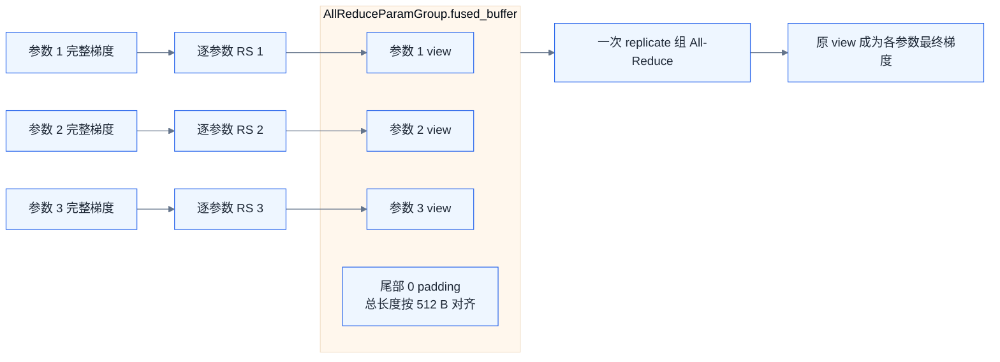
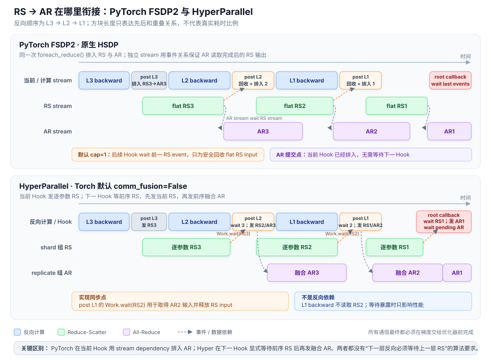

# HyperParallel 的 FSDP / HSDP 性能优化

<div class="notebook-hero" markdown>

<span class="chapter-kicker">第 3 章 · 模型状态分片</span>

Fully Sharded Data Parallel（FSDP）沿一个数据并行组切分模型状态；Hybrid Sharded Data Parallel（HSDP）再增加复制轴，使参数只在内层 shard 组切分、相同 shard 在外层 replicate 组保留副本。两者的算法通信量确定之后，端到端性能仍会被 collective 前后的本地数据搬运，以及异步通信落入反向关键路径后的等待拖慢。HyperParallel 的优化目标不是减少理论网络字节，而是让相同的 AG / RS / AR **少搬一次数据、少阻塞一次计算**。为此，它在数据路径上按网络层级选择通信粒度，在时间路径上把逐参数 RS 与融合 AR 接成跨 unit 流水。

</div>

!!! note "实现范围与版本"

    本节讨论 [HyperParallel](https://atomgit.com/mindspore/hyper-parallel) 的 **Torch 后端**，源码基于 2026-08-26 的 `master` 提交 `b8f55f71efb1e838ff7e8adac36690dafedcd16c`。重点是 `fully_shard(..., comm_fusion=False)` 默认路径；`comm_fusion=True` 的行为会单独说明。第 4、6 节的 PyTorch FSDP2 对照基于同日 `main` 提交 `3691693263d2b66a68867e39b7449876844e06cf`。MindSpore 后端共享部分调度抽象，但 buffer 与优化器约束不同，不能把本节的 Torch 实现细节直接推广过去。

## 01 · 优化目标与两条主线 { #overview }

先看结论。HyperParallel `fully_shard` 的性能设计可以归纳为两项核心优化：

| 优化 | 原因 | 目标 | 做法 | 预期收益 |
| --- | --- | --- | --- | --- |
| 拓扑分级的数据路径 | unit 级融合会增加 pack / unpack；但慢网络上的小 collective 又缺乏效率 | 同时控制本地显存搬运和跨慢网通信次数 | shard 维默认逐参数 AG / RS；replicate 维把 RS 输出直接汇入融合 AR buffer | 快通信域少做 copy，慢通信域少发 collective |
| RS / AR 反向流水 | 逐参数 RS 各自返回异步 handle，而融合 AR 必须等同组 RS 输出全部就绪 | 不二次 pack 地衔接 RS → AR，并尽量与后续反向重叠 | 当前 Hook 发 RS；下一 Hook 等前序 RS，先发当前 RS，再发前序融合 AR；root callback 排空末尾通信 | RS 可与下一 unit 计算重叠，AR 可继续与剩余反向重叠 |

这两项优化针对的是不同维度：

- 第一项优化**数据怎么流动**，减少 HBM 上为通信融合而产生的额外读写；
- 第二项优化**操作何时发生**，安排 RS、AR 的提交位置与同步位置。

### HSDP 的两个通信域

设二维数据并行 mesh 为 `(replicate=R, shard=S)`：

- 参数只在大小为 $S$ 的 **shard 组**内分片，前向与反向计算前在该组执行 All-Gather（AG）；
- 完整梯度先在 shard 组内执行 Reduce-Scatter（RS），每卡留下一个参数 shard 对应的梯度；
- 相同参数 shard 在 $R$ 个副本之间仍需同步，因此再沿 **replicate 组**执行 All-Reduce（AR）。

常见部署会把 shard 维映射到超节点内的高带宽域，把 replicate 维映射到较慢的跨节点网络。前者更能容忍逐参数 collective，后者更需要融合大消息。因此，不应该用同一种通信粒度无差别处理两个维度。

不过，源码不会自动识别哪个设备属于“超节点”。**拓扑感知来自调用方如何构造二维 `DeviceMesh`**：HyperParallel 只根据 mesh 的两个轴取得 process group，再分别执行 shard 与 replicate 通信。

## 02 · 一次迭代的运行骨架 { #iteration }

一个 FSDP unit 的参数在 `SHARDED` 与 `UNSHARDED` 之间切换，Hook 则把通信插入前向和反向边界：

```text
forward pre-hook
  ├─ 当前 unit unshard：AG + wait
  └─ 对显式配置的后续 unit 发起异步 AG prefetch

module.forward()

forward hook
  └─ reshard_after_forward=True 时恢复参数 shard

backward pre-hook
  ├─ 当前 unit 再次 unshard
  └─ 对显式配置的前序 unit 发起反向 AG prefetch

unit backward compute

post-backward hook
  └─ reshard，并把梯度 RS / AR 接入跨 unit 流水

root backward callback
  ├─ 排空末尾 RS / AR
  └─ 把最终梯度写入 sharded_param.grad
```

预取并不是自动猜测执行顺序。调用方需要通过 `set_modules_to_forward_prefetch()` 与 `set_modules_to_backward_prefetch()` 显式指定目标 unit。预取只提前发起 `unshard(async_op=True)`；真正使用参数前，仍由 `wait_for_unshard()` 保证 AG 已经完成。

源码中的对象分工如下：

| 对象 | 主要文件 | 性能职责 |
| --- | --- | --- |
| `TorchHSDPSchedulerV2` | `scheduler.py` | 安装前后向 Hook，在 root callback 收尾整个反向 |
| `TorchHSDPStateV2` | `state.py` | 管理一个 FSDP unit，编排 RS / AR 跨 unit 流水 |
| `TorchHSDPParamV2` | `param.py` | 保存单参数 shard、完整参数 buffer 与异步通信 handle |
| `AllReduceParamGroup` | `param_group.py` | 默认路径中，把多个参数的 RS 输出汇入一次融合 AR |
| `HSDPParamGroup` | `param_group.py` | `comm_fusion=True` 时，为 AG / RS / AR 建立融合 bucket |

一个 FSDP unit 是 Hook 与参数生命周期边界；通信 bucket 则要求 process group、通信 dtype 等属性兼容。两者不是同一个概念，一个 unit 内也可能拆出多个 bucket。

## 03 · 优化一：按拓扑选择通信粒度 { #granularity }

### 3.1 原因：融合减少通信次数，却增加本地数据搬运

把一个 unit 的多个参数融合成一次 collective，通常需要经历：

```text
多个参数 shard
  → copy-in 到 flat 输入
  → 一次 collective
  → copy-out 到每参数 buffer
```

融合减少了 collective 数量，有利于小消息和高时延网络；但 copy-in / copy-out 会额外读写完整通信数据，消耗设备显存带宽，还可能把 copy kernel 暴露到计算关键路径。

HSDP 的两个通信域条件不同：高带宽 shard 组更可能隐藏逐参数通信，而较慢的 replicate 组更怕小消息和频繁 launch。如果两边都强制融合，会在快通信域付出不必要的 copy；如果两边都逐参数，又会在慢通信域付出过多 collective 开销。

### 3.2 目标：快通信域少搬数据，慢通信域少发消息

因此，默认 `comm_fusion=False` 路径并不是简单地“关闭所有融合”，而是采用分级目标：

- shard 维的 AG / RS 优先消除 unit 级 pack / unpack；
- replicate 维的 AR 仍然融合，减少跨副本 collective 次数；
- RS 输出直接成为 AR 输入，使“逐参数 RS”和“融合 AR”之间不需要再次搬运。

### 3.3 做法一：shard 维逐参数执行 AG / RS

`HSDPState.unshard()` 逐个调用 `TorchHSDPParamV2.unshard()`。在常见的第 0 维切分、通信 dtype 与常驻 shard 一致、没有 CPU offload 的路径中，AG 数据流为：

```text
_sharded_param_data
  └─ dist.all_gather_into_tensor(
         output = unsharded_param_buffers[0],
         input  = _sharded_param_data,
     )
       └─ _unsharded_param 只是 output 上的 N 维 view
```

这里没有为 unit 级融合准备 flat 输入：

1. AG 直接读取参数自己的本地 shard；
2. collective 直接写入该参数的完整参数 buffer；
3. `_unsharded_param` 只在这块 storage 上建立原始形状的 view。

#### 完整参数 buffer 的分配与生命周期

这块 buffer 不是 `fully_shard()` 初始化时就常驻的一份完整参数。每个 `TorchHSDPParamV2` 初始化时只有一个空列表 `unsharded_param_buffers=[]`；第一次 unshard 才由 `init_unsharded_param_buffers()` 延迟执行：

```python
torch.empty(
    local_shard_numel * shard_world_size,
    dtype=communication_dtype,
    device=device,
)
```

对于常见的 dim-0 路径，这个一维 Tensor 直接作为 AG 输出；`init_unsharded_param()` 再在它的 storage 上建立原始 N 维形状的 `_unsharded_param`。因此它的生命周期要分成两层看：

| 阶段 | Tensor / Parameter 对象 | 底层设备 storage |
| --- | --- | --- |
| `fully_shard()` 刚结束 | 尚未创建完整参数 buffer 和 `_unsharded_param` | 不占完整参数显存 |
| 第一次 unshard | 创建 `unsharded_param_buffers[0]`，并在其上创建稳定的 `_unsharded_param` | 分配完整参数大小，AG 写入最新参数 |
| 当前 unit 计算期间 | 对象与完整 storage 都存在，模块属性指向 `_unsharded_param` | 占用完整参数显存 |
| reshard 之后 | Tensor 与 `_unsharded_param` 对象仍保留，尺寸和别名关系不变 | `free_unsharded_param()` 把 storage `resize_(0)` |
| 下一次 unshard | 复用同一批对象 | `alloc_unsharded_param_buffers()` 恢复 storage 容量，再由 AG 重写内容 |

所以准确结论是：**完整参数的 Tensor / Parameter 对象在第一次创建后常驻，但承载完整数据的 storage 默认不常驻。** `reshard_after_forward=True` 时，前向后会释放 storage，反向前再分配并 AG；反向后的默认 reshard 又会释放它。释放表示显存重新可供 PyTorch allocator 使用，并不保证 caching allocator 立即把 reserved memory 归还给设备驱动。

如果设置 `reshard_after_forward=False`，完整 storage 会跨过前向到反向的间隔继续保留，用额外显存换掉反向前的第二次 AG。预取还可能让当前 unit 与后续 unit 的完整 storage 短暂同时存在。非 dim-0 切分则另有一块临时 AG staging buffer；通信完成后，数据经重排写入上述稳定 buffer，staging storage 随即释放。

反向的 `reduce_scatter_grad()` 同样逐参数执行。常见的 dim-0、可整除、同 dtype 路径只需把完整梯度展平成 view，不必为了 unit 级融合统一 pack。

### 3.4 做法二：replicate 维重新融合 AR，而且不二次 pack

逐参数 RS 不代表跨副本组也逐参数通信。`TorchHSDPStateV2._issue_reduce_scatter_for_current_module()` 会按 `(replicate process group, reduce dtype)` 对需要 AR 的参数分组，并为每组创建 `AllReduceParamGroup`：

1. 分配一块连续且清零的 `fused_buffer`，buffer **总字节数**向上对齐到 512 字节；
2. 为每个参数切出 view，把它传给 `reduce_scatter_grad(output_buffer=...)`；
3. 各参数的 RS 结果直接落入这些 view；
4. 等 RS 完成后，对整块 `fused_buffer` 发起一次异步 AR；
5. AR 完成后，每个参数继续使用原 view，不再从融合输出复制到参数专属 buffer。



源码对整块融合 buffer 固定使用 `SUM`；如果用户要求 `AVG`，就在 AR 完成、切分各参数 view 时再除以 `replicate_world_size`。buffer 初始化为 0，保证尾部 padding 不改变求和结果。

### 3.5 收益与边界

这套做法带来两项直接收益：

- shard 维省掉为了 unit 级融合而引入的 AG / RS pack，减少额外 HBM 读写；
- replicate 维仍只发少量融合 AR，并通过 RS 直写 view 消除 AR 前后的二次 pack / unpack。

但“零拷贝”只描述满足条件的快速路径，不是无条件承诺：

- `param_dtype` 转换会新建通信输入；
- CPU offload 会产生 H2D / D2H；
- 非第 0 维切分需要额外 AG buffer 与 `chunk + cat` 重排；
- dim-0 不整除或不均匀分片可能需要 padding；
- 逐参数通信会增加 collective 与 Host launch 数量。

因此，这项优化的收益条件是：shard 组足够快、单参数消息足够大，省下的本地 copy 比增加的 collective 启动成本更重要。

## 04 · 优化二：把逐参数 RS 与融合 AR 接成跨 unit 流水 { #backward-pipeline }



*上半部分是 PyTorch FSDP2 原生 HSDP：当前 unit 的 `foreach_reduce()` 通过 stream dependency 排入 `RS_i → AR_i`。下半部分是 HyperParallel 默认路径：当前 Hook 发 `RS_i`，下一 Hook 等待它完成，再排入当前 `RS_{i-1}` 和前序融合 `AR_i`。两条路径都满足 `AR_i` 读取已完成 `RS_i` 输出的数据依赖；方块长度只表示先后与可重叠关系，不代表真实耗时比例。*

### 4.1 原因：PyTorch 原生方案把 RS 粒度与 AR 启动位置绑定在一起

PyTorch FSDP2 在当前 unit 的 `foreach_reduce()` 中，把完整梯度 copy-in 到 flat input，依次排入融合 RS 和原地 AR；两个通信 stream 通过 `wait_stream()` 建立 `RS → AR` 依赖。默认最多保留一个 RS input，后续 Hook 会等旧 RS event 后再回收这块 buffer。

这套方案把 **unit 级 flat RS、直接复用整组 RS 输出、当前 Hook 发起 AR** 绑定在一起。HyperParallel 想改成“逐参数 RS + 融合 AR”：各参数 RS 有独立 `Work`，必须全部完成后，整块融合 buffer 才能交给 AR。因此 PyTorch 的同组链式流程不能直接复用，需要增加跨 unit 的状态与同步点。

### 4.2 目标：拆开两级通信的粒度选择，同时保留重叠

因此，HyperParallel 需要同时满足三个目标：

- shard 维继续逐参数执行 RS，避免为 unit 级融合准备 flat RS input；
- replicate 维仍按 `(process group, reduce dtype)` 融合 AR，控制跨副本 collective 数量；
- RS 输出直接写入融合 AR buffer 的 view，并让 RS、AR 尽量与后续反向计算重叠。

### 4.3 做法：Hyper 用下一 unit 的 Hook 接力 RS → AR

图的下半部分对应 HyperParallel 默认 `comm_fusion=False` 路径。当前 unit 发起逐参数 RS 后，`AllReduceParamGroup` 被放入共享的 `pre_all_reduce_groups`；下一 unit 的 Hook 再消费这些 group。每个 `post_backward()` 固定执行四步：

1. 等待前一个已处理 unit 中、后续需要 AR 的逐参数 RS；
2. 等待前一个已处理 unit 中、不需要 AR 的 RS；
3. 发起当前 unit 的逐参数 RS，需要 AR 的输出直接写入融合 buffer view；
4. 对第 1 步已经完成的融合 buffer 发起异步 AR，并把 group 放入 pending 队列。

这里的“前一个已处理 unit”按**反向执行顺序**定义。例如反向依次处理 `L3 → L2 → L1`，进入 `L2` 的 post-backward 时，前一个 unit 是 `L3`。时间顺序因此是：

```text
post L3：发 RS3
L2 backward
post L2：wait RS3 → 发 RS2 → 发 AR3
L1 backward
post L1：wait RS2 → 发 RS1 → 发 AR2
root callback：wait RS1 → 发 AR1 → wait pending AR
```

以 `RS2` 为例，`L1 backward` 并不读取 `L2` 已归约的参数梯度。`post L1` 调用 `Work.wait(RS2)`，是因为 Hyper 选择在这里确认 `AllReduceParamGroup.fused_buffer` 已经完整，随后发起 `AR2`；它是软件流水的消费点，不是 `L1` 反向的数据依赖。如果 `RS2` 尚未完成，这个同步点会暴露为性能等待，但不会改变数学结果。

第 3 步先于第 4 步也是源码中的确定顺序：同一个 Hook 先调用 `_issue_reduce_scatter_for_current_module()`，再调用 `_issue_prev_fused_all_reduce()`。它的直接效果是，当前 shard 组 RS 的提交先于前序 replicate 组 AR；源码没有把这一顺序定义为算法正确性的要求。不同后端和拓扑能否从该提交顺序获益，需要结合 profiler 判断。

### 4.4 做法：root callback 统一结算

root backward callback 由 autograd engine 在本次反向结束时执行。它会：

1. 为没有正常触发 post-backward 的 unit 兜底；
2. 等待最后一批 RS，并发出最后一批 AR；
3. 统一等待 `pending_all_reduce_groups`；
4. 从融合 buffer view 取得每个参数的最终梯度；
5. 完成 source mesh 上仍需要的复制轴归约；
6. 把结果写入优化器持有的 `sharded_param.grad`，再清理临时引用。

### 4.5 收益与边界

这条流水的收益来自把两级通信分散到相邻 Hook：

- unit $N$ 的 RS 可以与随后 unit 的反向计算重叠；
- unit $N$ 的 AR 从下一个 Hook 发起后，可以与剩余多层反向计算、其他 RS 重叠；
- 默认路径不在逐层 Hook 中等待 AR，避免主动把跨节点慢通信串进每层反向。

代价也来自同一条流水。下一 unit 的 Hook 会显式 `Work.wait()` 前一个 unit 的 RS；如果一个 unit 的反向计算不足以覆盖它，这个实现同步点就会形成气泡。每个 pending `AllReduceParamGroup` 还会持有自己的融合 buffer，直到 root callback 等待 AR、切出梯度 view 后才释放引用。这里的“AR 不阻塞逐层 Hook”只是说逐层 Hook 不等待 AR 完成，不代表 AR 耗时或资源占用消失；如果反向计算不足以覆盖通信，root callback 仍会留下 AR 尾巴。

## 05 · `comm_fusion=True` 的全路径融合 { #fusion-path }

默认逐参数路径用更多 collective 换掉本地 pack，并不适合所有模型。大量小参数可能让 Host 下发和 collective launch 成为新瓶颈，因此 HyperParallel 保留了完整通信融合路径。

| 维度 | 原因与目标 | 做法 | 收益与代价 |
| --- | --- | --- | --- |
| AG | 减少大量小 AG；同时尽量避免每轮 copy-in | 按 `(process group, dtype)` 建 bucket；Torch 默认尝试把常驻 shard rebase 到持久 `flat_param_buffer` | collective 更少，成功 rebase 时省每轮 AG copy-in；flat 输出仍需 copy-out |
| RS | 减少逐参数 RS 与 Host launch | 把多个完整梯度 pack 到一个 flat RS 输入 | collective 更少，但需要梯度 pack 和额外临时 buffer |
| HSDP AR | 延续 RS 的融合布局 | `AllReduceBucket` 直接接管整个 RS 输出并原地 AR | 不需要再按参数 pack，但需维护 bucket 生命周期 |

Torch 后端在 `comm_fusion=True` 且未显式设置 `comm_fusion_zero_copy` 时，默认尝试 AG zero-copy。它要求 bucket 的存储 dtype 一致，参数不能处于 meta 或 CPU offload 状态，而且优化器与加载流程不能替换 view 背后的 storage；源码会用 storage pointer 检查 flat buffer 是否仍有效。

即使 AG copy-in 被省掉，融合 AG 仍要把 flat 输出 copy-out 到每参数稳定 buffer，融合 RS 也仍需 pack 完整梯度。因此 `comm_fusion_zero_copy` 不能解释成整条融合路径完全没有复制。

融合路径也采用跨 unit 流水，但当前 Torch 实现只保留有限的 `pre_param_group` 与 `all_reduce_param_group` 状态，后续 unit 的 post-backward 会等待更早一组 AR。因而“所有 AR 都只在 root 等待”是默认逐参数路径的特征，不能推广到 `comm_fusion=True`。

## 06 · 与 PyTorch FSDP2 的直接对照 { #comparison }

第 3.4 节已经沿 PyTorch 源码展开 FSDP2。只比较本节关心的数据搬运与反向时序，两者的默认选择如下：

| 维度 | PyTorch FSDP2 | HyperParallel 默认路径 |
| --- | --- | --- |
| shard 组 AG / RS | 一个 FSDP param group 使用 flat collective | 每参数各自发起 AG / RS |
| AG 本地数据路径 | 参数 shard copy-in 到 flat 输入，collective 后再按参数 copy-out | 常见 dim-0 快速路径以参数 shard 为输入，直接写每参数完整 buffer |
| RS 本地数据路径 | 完整梯度按 RS 布局装入 group flat 输入 | 每参数独立准备输入，不为 unit 级融合统一 pack |
| HSDP 的 RS → AR | 同一次 `foreach_reduce()` 用 `all_reduce_stream.wait_stream(reduce_scatter_stream)` 排入 AR | RS 输出直写 `AllReduceParamGroup`；下一 unit Hook 等 RS 后再启动融合 AR |
| 跨 unit RS 同步点 | 默认最多保留 1 个 RS input；后续 Hook 等最旧 RS event 后回收 input，数量可配置 | 下一 unit Hook 调用前序 RS 的 `Work.wait()`，消费结果并释放每参数 RS input |
| AR 收尾 | root final callback 等待各 post-reduce stream 的最后 event；group state 保持 AR buffer 存活 | AR group 进入 pending 队列；root callback 逐组等待、切出梯度 view |

这不是脱离环境的优劣排序。PyTorch 的融合路径减少 collective 次数，适合更通用的网络与模型；HyperParallel 默认路径则假设 shard 通信域足够快，希望用更多 collective 换掉 flat buffer 搬运，再单独保留慢 replicate 维的融合。HyperParallel 自己也提供 `comm_fusion=True`，说明通信粒度最终仍应由消息大小、Host 下发能力、拓扑和 profiler 结果共同决定。

## 07 · 数据路径与反向时序总结 { #summary }

HyperParallel 没有改变 FSDP / HSDP 的理论通信量。它解决的是相同网络字节背后的本地搬运与调度问题：

| 因果链 | 数据路径优化 | 反向时序优化 |
| --- | --- | --- |
| 原因 | 快慢通信域条件不同，统一融合会增加本地 copy，统一逐参数又会拖慢慢网 | 逐参数 RS 各自完成，而一次融合 AR 必须消费同组全部 RS 输出 |
| 目标 | 快通信域少搬数据，慢通信域少发 collective | 不二次 pack 地衔接 RS → AR，并让两级通信与后续反向重叠 |
| 做法 | shard 维逐参数 AG / RS；RS 输出直写融合 AR buffer | 当前 Hook 发 RS；下一 Hook 等前序 RS，发当前 RS 后再发前序 AR；root 收尾 |
| 收益 | 减少 unit 级 pack / unpack，同时控制跨副本 AR 次数 | RS 可覆盖一个相邻 unit，AR 可继续覆盖剩余反向；代价是下一 Hook 可能等待 RS |

最终收益是否成立，要由 profiler 验证：

1. 如果逐参数 collective 很多、Host 下发出现空洞或小消息带宽明显偏低，比较 `comm_fusion=True`；
2. 如果 AG / RS 前后的 copy kernel 暴露在关键路径，且 shard 组能高效承载单参数消息，比较默认路径；
3. 确认 HSDP mesh 的 shard 轴确实落在更快的通信域，否则优化假设与真实拓扑会错位；
4. 同时观察 step time、root callback 的 AR 尾巴、峰值显存和 TP / CP / EP 通信是否被资源竞争拉长。

!!! tip "一句话总结"

    HyperParallel 的核心思路是：根据拓扑决定“哪里融合”，再用跨 unit 流水连接两级归约——shard 维优先减少本地 pack，replicate 维优先减少慢网 collective；当前 Hook 发起 RS，下一 Hook 消费其输出并发起融合 AR，最后由 root callback 排空通信。

## 08 · 源码阅读顺序 { #source-reading }

1. [`core/fully_shard/api.py`](https://atomgit.com/mindspore/hyper-parallel/blob/master/hyper_parallel/core/fully_shard/api.py)：看 `fully_shard()` 参数，以及 Torch 后端如何解析 `comm_fusion_zero_copy` 默认值。
2. [`core/fully_shard/hsdp_scheduler.py`](https://atomgit.com/mindspore/hyper-parallel/blob/master/hyper_parallel/core/fully_shard/hsdp_scheduler.py)：看 module tree 如何共享 `HSDPSchedulerContext` 与各条 pending 队列。
3. [`platform/torch/fully_shard/scheduler.py`](https://atomgit.com/mindspore/hyper-parallel/blob/master/hyper_parallel/platform/torch/fully_shard/scheduler.py)：看 Hook 安装、`_root_backward_hook()` 与两条通信路径的收尾。
4. [`platform/torch/fully_shard/state.py`](https://atomgit.com/mindspore/hyper-parallel/blob/master/hyper_parallel/platform/torch/fully_shard/state.py)：重点看 `post_backward()` 的四步顺序，以及默认路径如何构造 `AllReduceParamGroup`。
5. [`platform/torch/fully_shard/param.py`](https://atomgit.com/mindspore/hyper-parallel/blob/master/hyper_parallel/platform/torch/fully_shard/param.py)：看单参数 AG、RS、storage resize 与 `output_buffer` 直写。
6. [`platform/torch/fully_shard/param_group.py`](https://atomgit.com/mindspore/hyper-parallel/blob/master/hyper_parallel/platform/torch/fully_shard/param_group.py)：对照 `AllReduceParamGroup` 与 `HSDPParamGroup`，区分“只融合 AR”和“AG / RS / AR 全路径融合”。
7. [PyTorch `_fsdp_collectives.py`](https://github.com/pytorch/pytorch/blob/3691693263d2b66a68867e39b7449876844e06cf/torch/distributed/fsdp/_fully_shard/_fsdp_collectives.py#L522-L735)：对照 `foreach_reduce()` 如何用两个 stream 直接衔接 RS 与 AR。
8. [PyTorch `_fsdp_param_group.py`](https://github.com/pytorch/pytorch/blob/3691693263d2b66a68867e39b7449876844e06cf/torch/distributed/fsdp/_fully_shard/_fsdp_param_group.py#L607-L819)：看 `post_backward()` 如何限制在 flight 的 RS input、保存 AR buffer，并在反向收尾时同步。

!!! tip "学完自测"

    1. HyperParallel 为什么不在 shard 维与 replicate 维使用相同通信粒度？
    2. 哪些条件下逐参数 AG 才能直接写完整参数 buffer？
    3. HyperParallel 在哪一个 Hook 等待 `RS_i`、发起 `AR_i`？这个等待为什么不是下一层反向的数据依赖？
    4. “默认路径不在逐层 Hook 等待 AR”与“AR 没有性能开销”有什么区别？
    5. `comm_fusion_zero_copy=True` 省掉的是哪一次复制，为什么仍不能称为端到端无复制？

[→ 继续阅读 4.1 · Tensor Parallel](03-tp.md)
