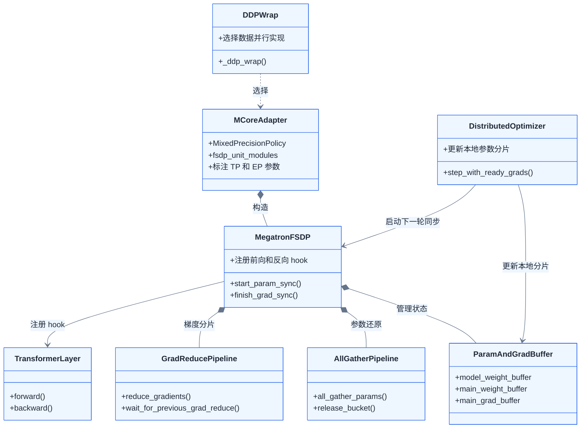
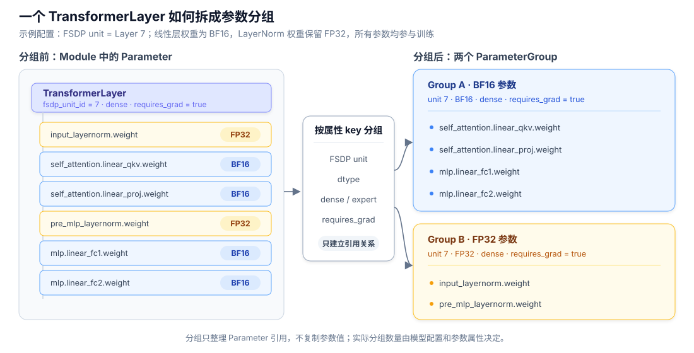
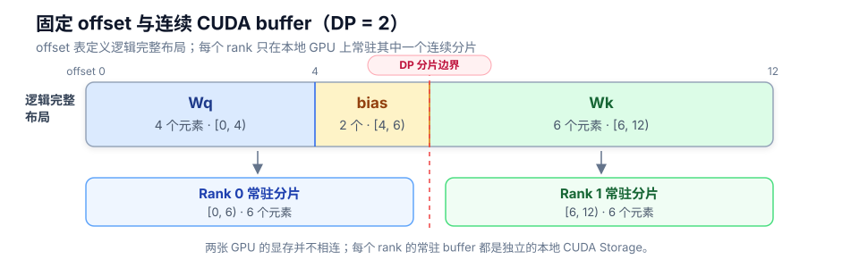
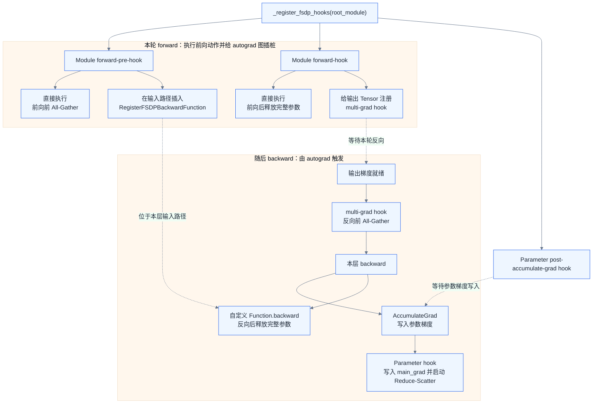
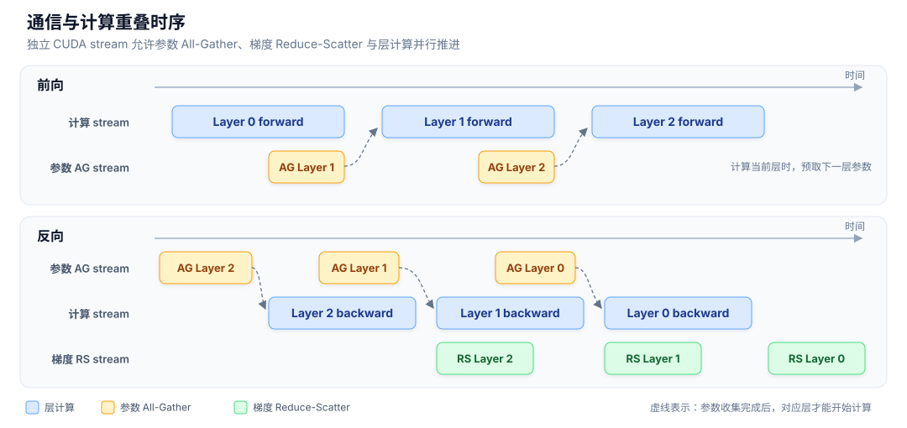

# Megatron-FSDP 实现方案

<div class="notebook-hero" markdown>

<span class="chapter-kicker">第 3 章 · 模型状态分片</span>

Megatron-FSDP 把 ZeRO-3 拆成两部分实现：`ParamAndGradBuffer` 管理参数与梯度的分片状态，`MegatronFSDP` 则通过 Hook 和两条通信流水线控制这些状态何时恢复、使用和释放。本节先确定核心类的职责，再沿一次前向和反向梳理完整运行时序。

</div>

!!! note "实现范围"

    以下讨论 `--use-megatron-fsdp` 与 `optim_grads_params` 组成的 ZeRO-3 路径。经典 Megatron `DistributedOptimizer` 只切优化器状态；`--use-torch-fsdp2` 则走另一套 PyTorch FSDP2 包装器。

## 从 ZeRO-3 流程进入 Megatron 实现

上一节从算法角度给出了 ZeRO-3 的核心流程：参数平时以分片形式常驻；前向和反向只在当前 FSDP unit 计算前临时 All-Gather 完整参数；本层反向产生梯度后执行 Reduce-Scatter，每个 rank 最终只留下自己的参数、梯度和优化器状态分片。


*ZeRO-3 规定的是数据生命周期：计算前恢复当前单元的参数，计算后释放完整参数，反向结束后留下归约后的梯度分片。*

Megatron-FSDP 没有改变这套算法，真正增加的是一套具体的运行时机制：用 `ParamAndGradBuffer` 保存分片状态，用 `AllGatherPipeline` 和 `GradReducePipeline` 调度通信，再用 Hook 把参数恢复、释放和梯度归约插入模型执行过程。理解其源码，就是把上图中的每个箭头对应到具体的类、缓冲区和 Hook。

## 01 · 初始化：三层包装分别做什么 { #init }

入口在 `megatron/training/models/dist_utils.py::_ddp_wrap()`。开启 Megatron-FSDP 后，主调用链是：

```text
_ddp_wrap()
  → mcore_fsdp_adapter.FullyShardedDataParallel
    → MegatronFSDP
      → ParamAndGradBuffer
      → 注册前向 / 反向 hook
  → DistributedOptimizer
```



*类关系图只保留主干依赖：适配层负责接入 MCore，`MegatronFSDP` 负责运行时状态切换，两条通信流水分别处理参数和梯度。*

### 第一层：选择 Megatron-FSDP 包装器

`_ddp_wrap()` 根据配置选择数据并行实现：

```python
if use_megatron_fsdp:
    DP = FullyShardedDataParallel
elif use_torch_fsdp2:
    DP = TorchFullyShardedDataParallel
else:
    DP = DistributedDataParallel
```

### 第二层：把 MCore 模型翻译给 Megatron-FSDP

`mcore_fsdp_adapter.FullyShardedDataParallel` 负责准备混合精度策略、数据并行组和 FSDP unit。完整分片时，默认以一层为通信与释放边界：

```python
fsdp_unit_modules = [
    TransformerLayer,
    MoETransformerLayer,
    MambaLayer,
]
```

它随后构造真正执行分片的 `MegatronFSDP`。这层适配器还会标注 TP/EP 参数，确保 FSDP 使用正确的数据并行组，而不会把 TP 或专家维误当成 FSDP 维。

### 第三层：`MegatronFSDP` 核心类

`MegatronFSDP.__init__()` 的主干可以压缩成三步：

```python
self._init_fsdp_param_and_grad_buffer()
self._register_fsdp_hooks(self.module)
self._replace_param_with_distributed_if_needed()
```

`MegatronFSDP` 是这套实现的核心类，主要完成三件事：

1. `_init_fsdp_param_and_grad_buffer()` 创建 `ParamAndGradBuffer`，并建立负责参数 All-Gather 和梯度 Reduce-Scatter 的两条通信流水线。
2. `_register_fsdp_hooks()` 把参数恢复、释放和梯度归约插入模型的前向与反向过程。
3. `_replace_param_with_distributed_if_needed()` 把模块参数切换为优化器和 checkpoint 使用的分片 DTensor；进入下一轮计算时，`_replace_param_with_raw_if_needed()` 再切回计算用的原始 Parameter。

初始化阶段只建立状态、流水线和触发规则，并不会为所有层永久保留完整参数。下面分别展开前两项：`ParamAndGradBuffer` 管理“数据放在哪里”，Hook 管理“这些数据何时使用”。

## 02 · `ParamAndGradBuffer` { #buffers }

`ParamAndGradBuffer` 是 Megatron-FSDP 的状态管理器。它不是某一块具体的 buffer，而是负责把模型参数分组、为每组建立权重与梯度存储，并生成优化器使用的分片参数。`AllGatherPipeline` 和 `GradReducePipeline` 随后通过它访问这些状态。

依次完成如下几步：

1. 收集原始 Parameter 及其名称。
2. 按 FSDP unit、dtype、dense/expert 通信组、是否需要梯度等条件拆成参数分组。
3. 为每个分组计算 offset，并创建对应的权重和梯度 buffer。
4. 根据数据并行拓扑建立分片 DTensor，作为优化器和分布式 checkpoint 看到的参数。

### 参数分组

下面用一个 `TransformerLayer` 说明分组前后的变化。示例假设线性层权重使用 BF16、LayerNorm 权重保留 FP32，并且所有参数都参与训练：



左侧仍是 Module 原本持有的 Parameter；右侧只是按照属性建立两个 `ParameterGroup`，不会复制参数值。由于示例中的 dtype 不同，线性层权重和 LayerNorm 权重进入不同分组。如果所有参数的属性完全相同，它们可以进入同一组；MoE 中的 expert 参数、冻结参数或其他 dtype 则会产生更多分组。后续步骤才会为每组计算 offset 并创建对应的 buffer。

Adam 的一阶矩和二阶矩不由该类保存，而是由 `DistributedOptimizer` 按对应参数分片维护。

### 生成 offset 和 buffer

#### buffer 是什么

本文所说的 buffer，是一个实际保存数据的一维 CUDA Tensor；它的底层 Storage 是单张 GPU 上的一段连续显存。源码中的 `DataParallelBuffer` 则是管理对象，除了 `.data` 这个 CUDA Tensor，还保存参数 offset、完整范围、本 rank 分片范围、dtype 和通信组等元数据。

```text
DataParallelBuffer
├─ data ─────────────→ 一维 CUDA Tensor，真正保存参数或梯度
├─ item_index_map ───→ 每个参数的 offset、元素数和原始 shape
├─ bucket_index ─────→ 完整通信范围
└─ shard_bucket_index → 本 rank 常驻的分片范围
```

同一个 buffer 只能保存一种 dtype，所以参数分组阶段已经将 BF16、FP32 等不同 dtype 的参数分开。

#### 参数分组怎样变成 buffer

把参数拼接到一起，然后按照rank切分：

1. `build_data_parallel_buffer_index()` 依次读取组内 Parameter 的 shape 和元素数，为每个参数分配固定 offset，并在必要位置和末尾添加切分与通信所需的 padding。
2. 根据完整布局和数据并行 rank，计算本 rank 应该保存的连续区间。
3. 调用 `torch.empty(local_size, dtype=..., device="cuda")` 分配本地一维 CUDA Tensor。
4. `set_item()` 只把每个原始 Parameter 与本 rank 区间相交的部分复制到相应 offset。初始化完成后，原来分散的小 Tensor 就有了统一的连续存储。

假设一个参数分组包含 Wq、bias 和 Wk，元素数分别是 4、2、6，FSDP 数据并行组有两个 rank。忽略对齐后，布局计算相当于：

```text
Wq.shape   → offset [0, 4)
bias.shape → offset [4, 6)
Wk.shape   → offset [6, 12)

完整范围 [0, 12)
├─ rank 0 常驻 [0, 6)
└─ rank 1 常驻 [6, 12)
```

对应的逻辑完整布局和本地 CUDA buffer 如下：



图的上半部分是 offset 表定义的**逻辑完整布局**，不是跨 GPU 的一块物理内存。初始化结束后，两个 rank 分别在自己的 GPU 上持有一段 6 元素的连续 CUDA buffer。真实切分只看 offset，因此分片边界也可能落在某个大参数内部。

运行时不需要把 Wq、bias 和 Wk 再复制拼接。All-Gather 直接读取各 rank 的本地连续 buffer，并将结果写入临时完整 buffer；Parameter 随后通过 offset 和 view 找到自己的数据。

#### 哪些 buffer 常驻

基础 ZeRO-3 对每个参数分组最多管理三类**常驻分片 buffer**，计算时还会使用临时完整 buffer：

| buffer | 保存的内容 | Storage 生命周期 |
| --- | --- | --- |
| `model_weight_buffer.data` | 前向和反向计算权重的本地分片 | 整个训练期间常驻 |
| `main_weight_buffer.data` | 优化器更新的高精度主权重分片 | 创建后常驻；未配置独立主权重 dtype 时不存在 |
| `main_grad_buffer.data` | Reduce-Scatter 后在本 rank 上累积的梯度分片 | Storage 常驻；每轮只清零或覆盖其中的数据 |
| 临时完整参数 buffer | All-Gather 得到的当前 FSDP unit 完整参数 | 默认在计算前分配、使用后释放或复用 |
| 临时完整梯度 buffer | 本 rank 产生、等待 Reduce-Scatter 的完整 wgrad | Reduce-Scatter 完成后释放或复用 |

因此，“ZeRO-3 的 buffer 是否常驻”不能统一回答：参数、主权重和归约后梯度的**本地分片 Storage 常驻**；All-Gather 得到的完整参数和 Reduce-Scatter 前的完整梯度只是临时数据。启用双缓冲时，后两者的两组 Storage 也会常驻，但其中的数据仍会被不同 FSDP unit 轮换覆盖。

### 这些 buffer 何时使用

当前 FSDP unit 即将计算时，每个 rank 准备一个临时完整参数 buffer，并通过 All-Gather 把各 rank 的常驻分片拼成完整输出：

```text
rank 0 的 local shard ─┐
                       ├─ All-Gather ─→ 临时完整参数 buffer
rank 1 的 local shard ─┘                         │
                                                 ├─ offset + view → Wq.data
                                                 ├─ offset + view → bias.data
                                                 └─ offset + view → Wk.data
```

Parameter 对象仍然保留，只是其 `.data` 指向临时完整 buffer 中对应的 view。当前 unit 计算结束后，这段临时存储可以释放或复用，常驻的 `model_weight_buffer` 分片不会消失。

反向时，各参数的 wgrad 按同一份 offset 表写入临时完整梯度区域；Reduce-Scatter 直接读取这段连续数据，并把归约后的本地分片累积到 `main_grad_buffer`。随后，优化器读取对应的 `main_grad_buffer` 分片，只更新本 rank 的 `main_weight_buffer` 和 Adam 状态。

## 03 · `_register_fsdp_hooks()` 构造运行时序 { #sequence }

`MegatronFSDP.__init__()` 只在初始化时调用一次 `_register_fsdp_hooks(root_module)`。这个函数遍历 `root_module.named_modules()`，找到 `TransformerLayer` 等 FSDP unit，并把回调函数挂到 Module、前向输出 Tensor 和 Parameter 上。训练循环仍然调用普通的 `forward()` 与 `backward()`，参数 All-Gather、释放和梯度 Reduce-Scatter 则由这些触发点自动执行。

### Hook 是怎么插入的

核心注册关系可以压缩为：

```python
module.register_forward_pre_hook(_pre_forward_param_unshard)
module.register_forward_hook(_post_forward)

create_custom_backward_hook(module, _pre_backward_param_unshard)
module.register_forward_pre_hook(
    partial(_register_post_backward_hook, _post_backward_release_module)
)

param.register_post_accumulate_grad_hook(_process_post_backward_gradients)
```

前两项是 PyTorch Module 直接提供的前向 Hook。Megatron-FSDP 没有使用 `register_full_backward_hook()`；反向前后的两个触发点，是在本轮 forward 中动态插入 autograd 图的：

| 运行时机 | 初始化时的入口 | 如何获得运行时触发点 | 最终操作 |
| --- | --- | --- | --- |
| 前向计算前 | Module forward-pre-hook | Module 调用前直接触发 | All-Gather 当前单元参数 |
| 前向计算后 | FSDP unit forward-hook | Module 返回后直接触发 | 释放前向完整参数 |
| 本层反向前 | Module forward-hook | 每次 forward 给输出 Tensor 注册 `multi_grad_hook` | 输出梯度就绪时重新 All-Gather 参数 |
| 本层反向后 | Module forward-pre-hook | 每次 forward 在输入路径插入 `RegisterFSDPBackwardFunction` | 自定义节点的 `backward()` 释放反向完整参数 |
| 参数梯度写入后 | Parameter 的 `post_accumulate_grad_hook` | 初始化时直接挂到 Parameter，由 `AccumulateGrad` 触发 | 写入临时梯度区域并启动 Reduce-Scatter |



*Module Hook 负责执行前向动作，同时给本轮 autograd 图安装反向触发点；真正的反向动作由 Tensor Hook、自定义 autograd 节点和 Parameter Hook 触发。*

`RegisterFSDPBackwardFunction.forward()` 只原样返回输入。反向传播必须先完成本层 backward，之后才会经过输入侧的这个节点，因此它可以作为“本层反向结束通知”。Parameter 梯度可能沿不同分支陆续就绪，所以 Reduce-Scatter 挂在各 Parameter 的梯度累积完成点，不需要等待整个 FSDP unit 的反向全部结束。

### 最终运行时序

进入一次前向之前，`start_param_sync()` 先把模块从优化器使用的分片 DTensor 切回计算用 Parameter，并可提前发起第一个参数 All-Gather。随后，每个 FSDP unit 都由 Hook 驱动以下过程：

1. forward-pre-hook 等待当前单元的完整参数，并预取下一单元。
2. 当前单元执行 forward；forward-hook 随后释放这份完整参数。
3. 输出 Tensor 的梯度就绪时，`multi_grad_hook` 按反向顺序重新 All-Gather 参数。
4. 本层 backward 产生 wgrad；Parameter Hook 将其写入连续梯度区域并异步启动 Reduce-Scatter。
5. 反向离开该单元时，输入侧的 `RegisterFSDPBackwardFunction.backward()` 释放完整参数。

```mermaid
%%{init: {"theme": "base", "themeVariables": {"background": "#ffffff", "primaryColor": "#eef6ff", "primaryTextColor": "#1f2937", "primaryBorderColor": "#2563eb", "actorBkg": "#f8fafc", "actorBorder": "#2563eb", "actorTextColor": "#1f2937", "signalColor": "#475569", "signalTextColor": "#1f2937", "noteBkgColor": "#fff7ed", "noteBorderColor": "#f59e0b", "noteTextColor": "#1f2937"}}}%%
sequenceDiagram
    participant Train as Training Loop
    participant FSDP as MegatronFSDP
    participant AG as AllGatherPipeline
    participant Layer as TransformerLayer
    participant Autograd as Autograd
    participant RS as GradReducePipeline
    participant Opt as DistributedOptimizer

    Train->>FSDP: start_param_sync()
    FSDP->>FSDP: 分片 DTensor → 计算 Parameter
    FSDP->>AG: 提前 All-Gather 第一个单元

    Train->>Layer: forward(input)
    Layer->>AG: forward-pre-hook：等待当前参数并预取
    AG-->>Layer: 临时完整参数
    Note over Layer,Autograd: forward-pre-hook 在输入路径插入反向结束节点
    Layer->>Layer: 执行 forward
    Layer->>AG: forward-hook：释放完整参数
    Note over Layer,Autograd: forward-hook 给输出 Tensor 注册反向前触发点

    Train->>Autograd: backward()
    Autograd->>AG: 输出 Tensor Hook：反向 All-Gather
    AG-->>Autograd: 当前单元完整参数
    Autograd->>Layer: 执行本层 backward
    Layer-->>Autograd: wgrad 就绪
    Autograd->>RS: Parameter Hook：Reduce-Scatter(wgrad)
    RS-->>FSDP: 本 rank 梯度分片
    Autograd->>AG: 输入侧自定义节点：释放完整参数

    Train->>FSDP: finish_grad_sync()
    FSDP->>RS: 等待异步归约完成
    FSDP->>FSDP: 梯度挂到分片参数，切回 DTensor
    Train->>Opt: optimizer.step()
    Opt->>Opt: 更新本地参数分片和 Adam 状态
```

根模块还会在 backward 开始时通过输出 Tensor Hook 调用 `_root_pre_backward()`，再用 autograd engine 的 `queue_callback()` 安排 `_root_post_backward()`。这个回调处理没有进入逐参数 Hook 的剩余梯度并重置流水线，是全局兜底，不是每层 Reduce-Scatter 的主要触发点。

反向结束后，`finish_grad_sync()` 等待异步 Reduce-Scatter，随后把梯度分片挂到 `optimizer_named_parameters`，并将模块参数切换为分片 DTensor。`DistributedOptimizer` 因此只看到本 rank 的参数、梯度和 Adam 状态分片。更新完成后，下一次 `start_param_sync()` 再进入新的循环。

## 04 · Megatron-FSDP 做了哪些工程优化 { #performance }

ZeRO-3 决定了基本通信量：每个 step 至少需要两轮参数 All-Gather 和一轮梯度 Reduce-Scatter。Megatron-FSDP 并没有消除这些 collective，而是尽量做到三件事：**让通信与计算重叠、减少通信前后的数据搬运、降低通信对 GPU 计算资源的占用**。

### 1. 用独立流水线隐藏通信等待

`MegatronFSDP` 为参数 All-Gather 和梯度 Reduce-Scatter 分别建立 `AllGatherPipeline`、`GradReducePipeline`，并放到独立 CUDA stream 上。ZeRO-3 下默认开启参数收集重叠和梯度归约重叠，理想时序是：



当前层计算时，下一层参数已经开始 All-Gather；当前层的 wgrad 就绪后，Reduce-Scatter 又可以和后续层的反向计算重叠。`start_param_sync()` 还会在进入下一轮 forward 之前提前发起第一个参数 All-Gather，减小第一层前的等待。

这种重叠不是免费的。为了让计算和通信并行，运行时通常要同时保留当前单元和预取单元的完整权重或临时梯度，因此会增加约一个 FSDP unit 的峰值显存。`suggested_communication_unit_size` 用来控制一次允许预取或归约多少元素：过小会产生大量短 collective，过大则会增加峰值显存并推迟释放。

### 2. 固定 offset 减少打包和复制

`ParamAndGradBuffer` 已经为参数和梯度建立了固定 offset。性能上的直接收益，是 collective 可以读写一段较大的连续区域，Parameter 再通过 view 使用其中属于自己的范围，不必在每一轮重新 `cat` 和拆分。

| 节省项 | 如果参数独立存储 | 连续缓冲区的做法 |
| --- | --- | --- |
| collective 启动 | 大量小参数各发起一次调用；每次调用都有固定调度延迟 | 多个参数合并成较大的 AG/RS，减少调用次数，也更容易跑满链路带宽 |
| 通信前后打包 | 每轮 `cat` 到发送区，通信后再复制或拆分 | 参数从初始化起就有固定 offset，collective 直接读写目标布局 |
| Tensor 与 Python 操作 | 逐参数创建临时 Tensor、切片并维护异步句柄 | 用一张 offset 表批量建立 view 和跟踪通信状态 |
| 梯度搬运 | GEMM 先产生独立 wgrad，再复制到归约区 | 支持时让 wgrad 直接写入连续梯度区域 |

最后一种路径依赖 Transformer Engine 的 gradient accumulation fusion：GEMM 产生的 wgrad 可以直接写入 Megatron-FSDP 指定的连续梯度区域，避免先生成独立 `param.grad` 再复制。

固定 offset 不会改变 ZeRO-3 必须传输的有效参数和梯度字节数，padding 甚至会带来少量额外字节。它优化的是“小通信太多、通信前后还要搬数据”的软件开销。代价是通信和释放粒度变成整个分组：组越大，collective 越高效，但临时完整参数和梯度也可能保留更久，峰值显存更高。

### 3. 临时缓冲区如何分配与复用

理解这部分之前，需要先区分 PyTorch 中的 `Tensor` 和 `Storage`：

| 概念 | 保存什么 |
| --- | --- |
| `Tensor` | shape、stride、dtype、device、storage offset 等元数据，以及对 Storage 的引用 |
| `Storage` | 真正承载数据的一维连续内存区域；CUDA Tensor 的 Storage 最终对应一段 GPU 显存 |
| Tensor view | 不拥有新的数据，只用不同的 shape、stride 和 offset 解释同一个 Storage |

上一小节中的完整通信 buffer 就由一块 CUDA Storage 承载，`Wq`、`b` 和 `Wk` 只是其中不同范围的 Tensor view。因此，`raw_param.data = buffer_slice.view(param.shape)` 并不会复制权重，只是让参数 Tensor 改为解释 Storage 中的一段数据。`data_ptr()` 返回的就是这段数据在 GPU 上的起始地址。

#### 默认方案：保留 Tensor 外壳，动态伸缩 Storage

ZeRO-3 常驻的是参数分片；All-Gather 得到的完整参数只是临时数据。默认的 `StorageResizeBasedBucketAllocator` 会缓存通信用的 `Tensor` 对象，但动态调整其底层 Storage：

```text
计算当前层之前
Tensor 对象存在，Storage size = 0
        │ _typed_storage()._resize_(完整单元大小)
        ▼
获得临时完整 Storage
        │ All-Gather 写入数据，参数重新绑定到其中的 view
        ▼
当前层 forward / backward
        │ _typed_storage()._resize_(0)
        ▼
Tensor 对象仍存在，但不再持有可用的数据区域
```

源码中的 `_alloc_storage()` 负责把 Storage 从 0 扩到所需元素数，`_free_storage()` 则把它缩回 0。函数名前的下划线说明 `_typed_storage()` 和 `_resize_()` 是 PyTorch 内部接口，而不是面向普通模型代码的稳定公共 API。

这里的“释放”需要区分两个口径：

- 从 Tensor 角度看，完整参数占用的活动 Storage 已经释放，后续 Tensor 可以复用这部分显存。
- 从 CUDA 进程角度看，PyTorch caching allocator 可能仍把底层显存块保留在进程的内存池中，所以 `nvidia-smi` 显示的 reserved memory 不一定立即下降。它只是从“当前 Tensor 正在使用”变成“PyTorch 可以再次分配”。

这种方案只让正在计算或预取的少数 FSDP unit 持有完整 Storage，显存使用比较灵活，不同层也可以申请不同大小。但 Storage 重新扩展后，GPU 地址可能变化，参数 view 必须重新绑定；反复申请不同大小的内存还可能产生分配器查找、同步和显存碎片。所谓**显存碎片**，就是空闲显存总量看似足够，却分散成很多不合适的小块，无法满足一次较大的连续分配。

#### 双缓冲方案：地址不变，只轮换使用权

`fsdp_double_buffer` 选择另一种取舍：初始化时就为临时完整权重和梯度准备两组持久 Storage，训练过程中不再把它们缩到 0。`free()` 只是把一个槽位放回空闲列表，后面的 FSDP unit 可以覆盖并复用其中的数据。

```text
时间 ─────────────────────────────────────────────────→

槽位 A： [Layer 0 完整参数：计算] ──空闲── [Layer 2 完整参数：计算]
槽位 B：       [Layer 1 参数：预取] → [计算] ──空闲── [Layer 3：预取]
```

使用两个槽位，是因为通信重叠通常需要同时容纳“当前正在计算的单元”和“正在预取的下一个单元”：只有一个槽位就无法在保留当前权重的同时写入下一层权重；继续增加槽位虽然可以预取得更远，却会继续增加峰值显存，Megatron-FSDP 的 double buffer 因此固定为两组。

双缓冲不是再保存两份完整模型。常驻的模型状态仍然是 $1/N$ 分片；两组槽位只服务于当前和预取 FSDP unit 的**临时完整数据**。而且“两个槽位”是逻辑概念，计算权重、FP8 转置权重、梯度以及部分 HSDP 通信区都有各自的缓冲池，实际额外显存要按启用的数据类型和功能分别计算。

固定地址除了减少运行时分配抖动，也是 CUDA Graph 和 NCCL User Buffer 等优化的前提：前者要求重放时使用与捕获时相同的地址，后者需要把长期有效的通信地址提前注册给 NCCL。这里先关注缓冲区本身如何管理，下面第 5 项再说明 NCCL 如何利用这些固定地址。

代价也很直接：即使当前没有使用两个槽位，它们的显存仍然常驻。普通 `FixedPoolAllocator` 会寻找大小和 dtype 一致、出现次数最多的一组 FSDP unit 来共享固定槽位，结构整齐的 Transformer 层最适合这种方案；大小不匹配的 embedding、MoE 或 Mamba 层只能退回动态分配，或者选择额外的持久缓冲区。

`MaxPoolAllocator` 用来处理不对称模型。它按 dtype 统计所有 FSDP unit 所需的临时区域，并让槽位容量能够覆盖其中的最大组合。例如普通层需要 100 MB、MoE 层需要 220 MB，那么可复用槽位必须按 220 MB 准备；普通层使用时剩余的 120 MB 只是空着。因此 MaxPool 能让不同大小的层都获得稳定地址，但通常比按实际大小动态申请更占显存。

| 方案 | Storage 地址 | 运行时分配 | 临时显存 | 适用场景 |
| --- | --- | --- | --- | --- |
| 动态 Storage resize | 可能变化 | 用到时扩展，用完缩到 0 | 更贴近当前活跃单元大小 | 显存紧张、层大小不规则 |
| FixedPool 双缓冲 | 固定 | 初始化后主要轮换槽位 | 两组规则单元的持久缓冲 | 结构重复的 Transformer、NCCL User Buffer、CUDA Graph |
| MaxPool 双缓冲 | 固定 | 初始化后主要轮换槽位 | 两组最大单元组合，可能有空洞 | Mamba、MoE 等不对称结构 |

一句话概括：**动态方案牺牲地址稳定性，换取更灵活的临时显存占用；双缓冲则用额外常驻显存换取稳定地址、较低的分配抖动和通信预取能力。**

### 4. 分离计算精度、累积精度与通信精度

Megatron-FSDP 分别管理计算权重、主权重、主梯度和梯度通信 dtype，因此可以在不同路径上选择不同精度。例如：

| 优化 | 直接收益 | 需要权衡的代价 |
| --- | --- | --- |
| FP8/FP4 参数 All-Gather | 减少两轮参数 All-Gather 的字节数 | 需要 Transformer Engine 支持，还要维护量化权重和缩放因子 |
| BF16 梯度通信、FP32 主梯度累积 | 减少 Reduce-Scatter 的通信字节，同时保留较高累积精度 | 可能增加类型转换或独立通信缓冲区，收敛行为需要验证 |
| FP32 主权重、低精度计算权重 | 优化器继续更新高精度参数，计算和通信使用更小的数据 | 需要维护主权重与计算权重之间的更新或量化路径 |

这里降低的是**实际网络字节数**，不同于通信重叠只是隐藏等待时间。

### 5. 固定缓冲区如何被 NCCL 与网络硬件利用

上面的第 3 项解决的是缓冲区的**分配与生命周期**：完整参数和临时梯度放在哪里、何时可以复用，以及地址是否稳定。本节讨论下一层问题：地址稳定之后，通信库和网络硬件能利用它做什么。

NCCL（NVIDIA Collective Communications Library）是 NVIDIA 提供的多 GPU 通信库。PyTorch 的 `all_gather_into_tensor()`、`reduce_scatter_tensor()` 最终会交给 NCCL，在 NVLink、NVSwitch 或 InfiniBand 等链路上传输数据。

通信并不是只占用“网卡”。GPU 通常需要运行 NCCL communication kernel 来切分数据、计算远端地址、发起传输或执行归约。这个 kernel 和模型中的 GEMM 一样，需要占用 GPU 的 Streaming Multiprocessor（SM）。SM 可以理解为 GPU 上执行线程块的计算单元：矩阵乘法要用它，普通 NCCL kernel 也要用它。

```text
模型计算：GEMM kernel ───────────────→ 占用 SM
通信任务：NCCL kernel → NVLink / IB ─→ 也可能占用 SM
```

因此，把计算和通信放到两个 CUDA stream 只表示它们可以被同时调度，并不保证真正并行。如果 NCCL kernel 占用了较多 SM，GEMM 获得的执行资源就会减少，时间线上虽然看到重叠，step time 却不一定明显下降。

#### NCCL User Buffer：提前注册固定通信地址

普通 NCCL collective 可以接收任意 CUDA Tensor 的地址，但 NCCL 不能预先假设这段地址长期存在，也不能假设各 rank 的内存布局完全一致，因此需要走适用于一般指针的通信算法；根据链路和算法，它还可能需要内部工作区或中转步骤。

Megatron-FSDP 的双缓冲地址在整个训练期间保持不变。启用 NCCL User Buffer 后，这些地址所属的 memory pool 会提前注册到相应 ProcessGroup，也就是参与同一 collective 的 rank 集合。注册可以理解为提前告诉 NCCL、其他 GPU 或网卡：

```text
“这段 GPU 显存会长期作为该通信组的输入和输出，
可以为它建立直接访问关系，并复用后续通信所需的地址信息。”
```

这样，在硬件和 NCCL 版本支持时，collective 可以直接读写 Megatron-FSDP 的持久 buffer，避免某些算法中的中转复制和重复注册开销，也为后面的对称内存、copy engine 与 SHARP 路径提供前提。需要注意，未注册的 NCCL 通信并不代表一定发生两次复制；User Buffer 的准确收益是让 NCCL 能选择更多依赖固定地址的优化路径。

#### 三种进一步的硬件路径

| 机制 | 直观含义 | 主要减少什么 |
| --- | --- | --- |
| symmetric memory | 各 rank 注册大小、布局和虚拟地址相对应的缓冲区，通信 kernel 可以用统一的 base address + offset 定位远端数据 | 地址交换和通用指针处理，允许使用占用更少 SM 的 symmetric kernel |
| copy-engine All-Gather | All-Gather 只搬运数据、不做求和，可以交给 GPU 专用的 copy engine，而不是用 SM 执行复制 kernel | All-Gather 对 SM 的占用，把更多 SM 留给 GEMM |
| SHARP | 让 NVSwitch 或 InfiniBand switch 在网络中完成一部分聚合、求和与转发，而不是所有步骤都回到 GPU 上处理 | GPU 上的归约工作、通信 kernel 的 SM 占用，以及部分跨节点通信延迟 |

以 Reduce-Scatter 为例，普通路径需要 GPU 接收来自其他 rank 的梯度片段，并由通信 kernel 完成求和和切分；支持 SHARP 时，交换设备可以在数据经过网络时先完成一部分求和，GPU 收到的结果已经更接近最终梯度分片。copy engine 则更适合不需要算术归约的 All-Gather，它负责搬数据，但不能代替 Reduce-Scatter 中的加法。

这些机制主要减少的是 GPU 显存中的中转复制、地址处理和通信对 SM 的占用，不会改变 ZeRO-3 的逻辑通信量；真正减少网络字节的是上一小节介绍的 FP8/FP4 参数通信或低精度梯度通信。NCCL User Buffer 通常要求持久双缓冲，因此会增加显存；symmetric kernel、copy engine 和 SHARP 还依赖 NCCL 版本、GPU、交换网络与拓扑，不能视为所有机器上的默认收益。

### 6. 按 Megatron 的并行拓扑调度通信

Megatron-FSDP 能识别 TP、CP、EP、PP 以及 dense/expert 参数使用的不同数据并行组，并为 DP-inner、DP-outer、All-Gather 和 Reduce-Scatter 建立对应的通信流与 ProcessGroup。对于跨节点训练，还可以用 HSDP 只在较快的节点内链路上切参数、在节点间复制参数，以减少昂贵的跨节点 All-Gather；HFSDP 则进一步沿外层数据并行组切分优化器状态，在通信和显存之间取折中。

!!! important "性能优化的边界"

    Megatron-FSDP 是性能导向的 ZeRO-3 实现，但不意味着它在所有模型和集群上都比 PyTorch 原生 `fully_shard` 更快。PyTorch FSDP2 同样具有预取、独立通信流和对称内存等能力；Megatron-FSDP 的主要优势，是这些机制与 Megatron 的并行组、Transformer Engine、分布式优化器和量化权重做了更深的联合调度。

    实际收益取决于 FSDP unit 的计算量能否覆盖 collective、网络拓扑是否匹配，以及额外缓冲区是否挤压激活显存。评估时应同时观察 step time、未被计算隐藏的 AG/RS 时间、通信 kernel 的 SM 占用和峰值显存，不能只看 NCCL 带宽。

[→ 继续阅读 3.4 · PyTorch 原生方案](02-pytorch-fsdp.md)
