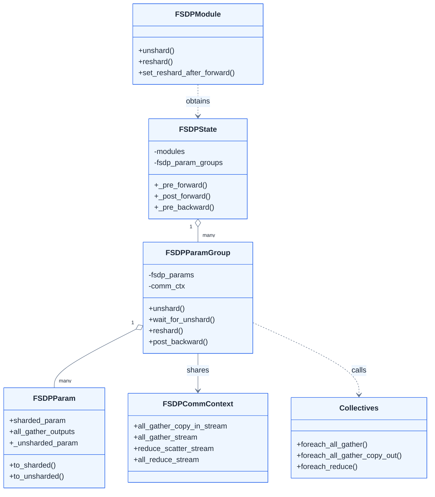
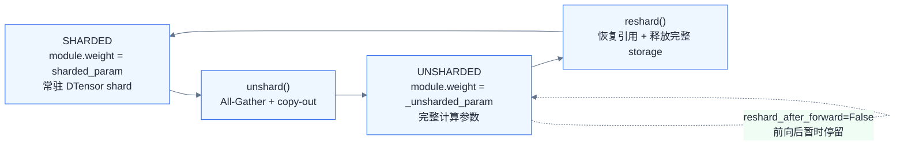
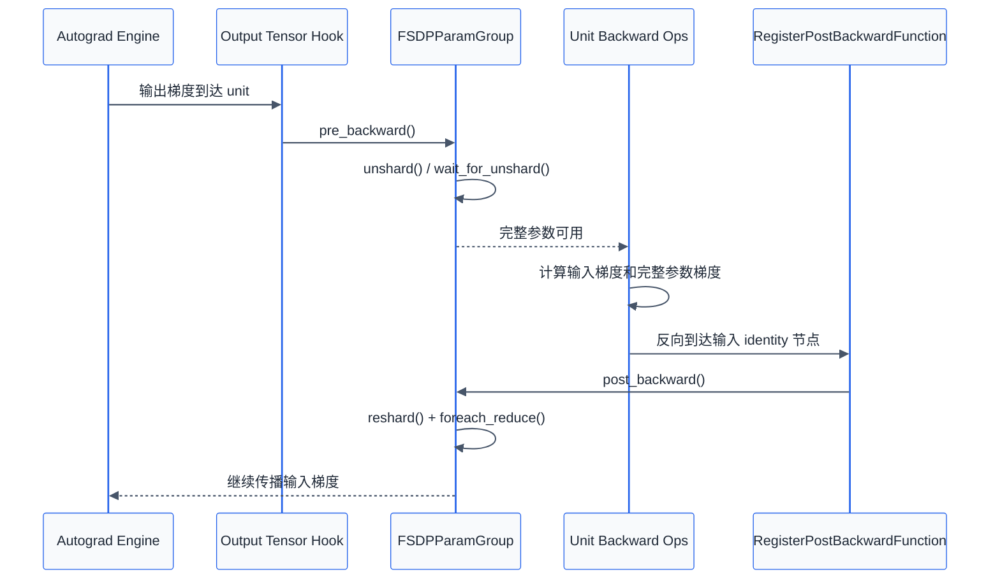
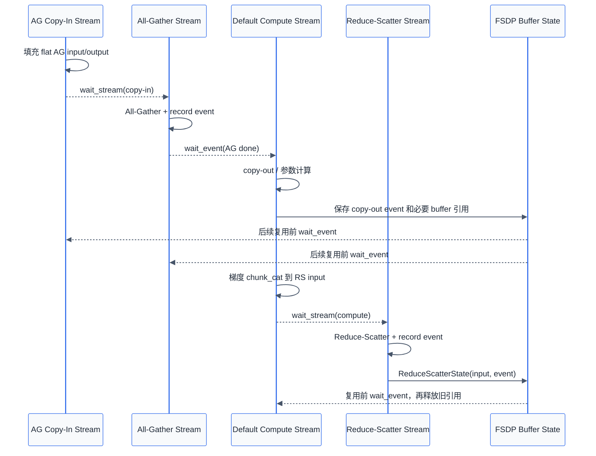

# PyTorch 原生 FSDP2 实现方案

<div class="notebook-hero" markdown>

<span class="chapter-kicker">第 3 章 · 模型状态分片</span>

PyTorch FSDP2 的公开入口只有一个 `fully_shard()`，真正的实现却分布在 `FSDPState`、`FSDPParamGroup`、`FSDPParam` 和 collective 函数中。它们分别负责安装 Hook、划定通信组、切换参数表示、发起 all-gather 与 reduce-scatter。本节不再把 FSDP2 当作 TorchTitan 的一个配置项，而是沿 PyTorch 源码追踪一个 `reshard_after_forward=True` 的 FSDP unit 如何完成初始化、前向和反向。

</div>

!!! note "实现范围与版本"

    以下讨论 `torch.distributed.fsdp.fully_shard`，也就是通常所说的 FSDP2，不是旧版包装器 `FullyShardedDataParallel`（FSDP1）。源码结构以 2026 年 8 月的 PyTorch `main` 分支为准；以下划线开头的文件、类和字段都是内部实现，不构成兼容性承诺。TorchTitan 只在第 2 节作为真实调用入口出现。

## 01 · 源码对象地图 { #source-map }

阅读 FSDP2 时，最容易被 `state`、`param_group` 和多个参数副本绕晕。先把五层对象的职责固定下来：

| 层次 | 主要源码 | 职责 |
| --- | --- | --- |
| 公开 API | `_fully_shard/_fully_shard.py` | 校验 mesh、收集本次管理的参数、创建 state，并给原模块混入 `FSDPModule` 接口 |
| 模块状态 | `_fully_shard/_fsdp_state.py` | 安装前向 Hook，协调根模块、预取顺序和反向结束回调 |
| 通信组 | `_fully_shard/_fsdp_param_group.py` | 把一组参数作为一个 collective 单元，执行 `unshard`、`reshard`、`pre_backward` 和 `post_backward` |
| 单参数状态 | `_fully_shard/_fsdp_param.py` | 保存分片参数、完整计算参数、形状与 DTensor 布局，并切换模块上的参数引用 |
| collective | `_fully_shard/_fsdp_collectives.py` | 打平通信输入，执行 all-gather / reduce-scatter，再把结果拆回各参数 |



一次 `fully_shard(block)` 通常对应一个 `FSDPState` 和一个 `FSDPParamGroup`，组内每个原参数对应一个 `FSDPParam`。之所以源码已把 state 设计成可持有多个 param group，是因为 `shard_placement_fn` 可以让同一模块中的普通参数与 MoE expert 参数使用不同 process group；普通路径仍只有一个组。

这里的“参数组”不是优化器的 `optimizer.param_groups`，而是**一次 all-gather 和一次 reduce-scatter 一起处理的通信组**。

## 02 · `fully_shard()` 初始化流程 { #init }

公开函数 `fully_shard()` 被 `@contract(state_cls=FSDPState)` 装饰。这个 composable contract（可组合 API 契约）为调用创建 `FSDPState`，后续可通过 `fully_shard.state(module)` 取回；普通单模块路径是一模块一 state，`fully_shard([a, b])` 则让列表中的模块共享同一 state。删去校验和少数分支后，源码主线可以压缩成：

```python
mesh_info = _get_mesh_info(mesh, dp_mesh_dims)
device = _get_device_from_mesh(mesh)
post_forward_mesh_info = _get_post_forward_mesh_info(...)

arg_module, modules, managed_modules, params, buffers = \
    _get_modules_and_states(module, device, ignored_params)

state = fully_shard.state(modules[0])
state.init(modules, device, mp_policy, auto_reshard_after_forward)

_init_param_group(
    state, params, modules, mesh_info, post_forward_mesh_info,
    device, shard_placement_fn, mp_policy, offload_policy,
)

_apply_to_module(modules, cls_to_fsdp_cls, FSDPModule, "FSDP", ...)
return arg_module
```

这段代码完成四件事。

### 2.1 收集“本次调用”负责的参数

`_get_managed_modules()` 从传入模块向下做 DFS（深度优先遍历），但遇到已经应用 `fully_shard()` 的子模块就停止向下收集。于是下面的 bottom-up（自底向上）写法会形成三个互不重复的通信单元：

```python
fully_shard(block0, mesh=mesh)
fully_shard(block1, mesh=mesh)
fully_shard(model, mesh=mesh)  # 只接管前两次尚未接管的参数
```

如果先对 `model` 调用，根单元会把整个模型都收进去，后续对子 block 的调用已经无法重新划分它。这就是 FSDP2 要求从叶子到根应用的源码原因，不只是接口习惯。

### 2.2 立即把每个参数换成分片 `DTensor`

`_init_param_group()` 创建 `FSDPParamGroup`，其构造函数再为每个参数创建 `FSDPParam`。`FSDPParam._init_sharded_param()` 的默认路径是：

1. 选择 `Shard(0)`；也可以由 `shard_placement_fn` 改成其他维。
2. 按 FSDP shard world size 切参数；dim-0 不整除时给短 shard 补零。
3. 把本 rank 的 padded shard 保存成一维 `_sharded_param_data`。
4. 基于本地有效区构造带全局形状与 placement 的 `sharded_param: DTensor`。
5. 用 `_setattr_on_modules(sharded_param)` 替换模块原参数。

所以 `fully_shard()` 返回时，`module.weight` 已经是分片参数；分片不是等到第一次 forward 才发生。对于 `meta` 参数，上述张量仍只有元数据，真实存储可以稍后再物化。

### 2.3 安装前向 Hook，反向 Hook 稍后动态安装

`FSDPState.init()` 在单模块路径中直接调用：

```python
module.register_forward_pre_hook(
    state._pre_forward, prepend=True, with_kwargs=True
)
module.register_forward_hook(state._post_forward)
```

前向 pre-hook 负责恢复完整参数，post-hook 负责 reshard，并根据本次 forward 的实际输入和输出把两个反向边界插进 autograd graph。反向 Hook 不能在初始化时静态安装，因为源码需要知道本次调用中哪些输入、输出 Tensor 真正参与求导。

### 2.4 不包一层 module，而是动态修改原对象的类

`_apply_to_module()` 创建类似下面的动态类，并原地修改 `module.__class__`：

```python
new_cls = type("FSDPTransformerBlock", (FSDPModule, TransformerBlock), {})
module.__class__ = new_cls
```

因此原对象、模块层级和参数名都保留，但方法解析顺序（MRO）中多了 `FSDPModule`，模块便获得 `unshard()`、`reshard()`、预取和梯度同步控制接口。FSDP2 所谓“不使用 wrapper”，准确含义是**不新增一层外部 `nn.Module` 包装对象**，并不是没有内部状态。

### 2.5 第一次 forward 才完成全模型级 lazy init

单次 `fully_shard()` 时还不知道哪一个 state 是整棵执行树的根。第一次进入 forward 的 state 会在 `_lazy_init()` 中成为 root，然后遍历所有 FSDP 子 state：

- 共享同一个 `FSDPCommContext`，避免每层各建一套 CUDA stream；
- 记录完整的 state 顺序与参数 FQN，供预取、报错和 profiler 使用；
- 检查同一参数是否被两个通信组重复管理；
- 如果 `reshard_after_forward=None`，自动让非根单元 reshard、根单元不 reshard。根参数刚做完最后一段 forward，反向通常马上使用，释放后立即重新 all-gather 没有收益。

```mermaid
%%{init: {"theme": "base", "themeVariables": {"background": "#ffffff", "primaryColor": "#eef6ff", "primaryTextColor": "#1f2937", "primaryBorderColor": "#2563eb", "secondaryColor": "#f0fdf4", "tertiaryColor": "#fff7ed", "lineColor": "#64748b"}}}%%
flowchart LR
    API["fully_shard(block)"] --> Mesh["解析 DeviceMesh<br/>得到 process group"]
    Mesh --> DFS["DFS 收集未被子 unit<br/>管理的参数"]
    DFS --> State["创建 FSDPState<br/>安装 forward hooks"]
    State --> Group["创建 FSDPParamGroup<br/>确定 collective 边界"]
    Group --> Param["逐个创建 FSDPParam<br/>原参数 → sharded DTensor"]
    Param --> Mixin["动态混入 FSDPModule<br/>原对象原地返回"]
    Mixin -. "第一次 forward" .-> Lazy["lazy_init<br/>识别 root、共享 comm_ctx"]
```



### TorchTitan 在哪里进入这条主线

TorchTitan 的 Llama 3 `apply_fsdp()` 主要负责提供 mesh、混合精度策略和通信单元边界，内部机制仍全部落到上述 PyTorch 代码：

```python
# 未绑定输入、输出权重时的简化路径
mp_policy = MixedPrecisionPolicy(
    param_dtype=param_dtype,
    reduce_dtype=reduce_dtype,
    cast_forward_inputs=False,
)
fsdp_config = {"mesh": dp_mesh, "mp_policy": mp_policy}

fully_shard(model.tok_embeddings, **fsdp_config, ...)
fully_shard([model.norm, model.lm_head], **fsdp_config, ...)
for block in model.layers.values():
    fully_shard(block, **fsdp_config, ...)
fully_shard(model, **fsdp_config)
```

模型先在 `meta` 设备构造，TP / CP、activation checkpoint 和 compile 先应用，FSDP 再自底向上切分；随后 `to_empty()` 只为本地 shard 物化存储，最后才用 `model.parameters()` 创建普通 AdamW。若 embedding 与 head 权重绑定，TorchTitan 会把 embedding、norm 和 head 放进同一次 `fully_shard([...])`，使共享参数只属于一个 FSDP group。

`DeviceMesh` 决定的是 FSDPParam 的存储和 collective 通信域：

| mesh | 参数 placement | 反向通信 |
| --- | --- | --- |
| 一维、大小为 $N$ | `(Shard(0),)` | 大小为 $N$ 的 reduce-scatter |
| 二维 `[replicate=R, shard=S]` | `(Replicate(), Shard(0))` | 先在大小为 $S$ 的组 reduce-scatter，再在大小为 $R$ 的复制组 all-reduce |

HSDP 参数每卡约为 $1/S$，不是 $1/(R\times S)$；`replicate` 轴保留的是 shard 副本。

## 03 · `FSDPParam` 的参数表示与状态切换 { #param-state }

FSDP2 不使用 FSDP1 的 `FlatParameter`，但它也不是只保存一个 DTensor。默认 Tensor 路径中，一个 `FSDPParam` 至少要区分以下对象：

| 字段或对象 | 形状 / 类型 | 生命周期与作用 |
| --- | --- | --- |
| `_sharded_param_data` | 一维本地 Tensor，可能含 padding | 主要常驻存储，也是 all-gather 输入的来源 |
| `sharded_param` | N 维 `DTensor` Parameter | 计算之外注册在模块上，也是优化器持有的参数 |
| `AllGatherResult.all_gather_output` | 一维 group flat Tensor | collective 的整组 staging output，copy-out 后可短暂保留以支持下一组预取 |
| `FSDPParam.all_gather_outputs` | 每参数一个或多个一维 Tensor | 从 group flat output 拆出的参数结果；默认路径与完整计算参数共享底层存储 |
| `_unsharded_param` | 原始 N 维 Parameter | 前向 / 反向计算使用的 autograd leaf |
| `_sharded_post_forward_param` | 可选 DTensor Parameter | 仅 `reshard_after_forward=int` 时使用的中间分片 |

以本节的 `reshard_after_forward=True` 为例，参数状态只有 `SHARDED ↔ UNSHARDED`：



`to_unsharded()` 与 `to_sharded()` 的核心不是给同一个 Parameter 修改 shape，而是调用 `_setattr_on_modules()` 改写模块参数表：

```python
def to_unsharded(self):
    self._setattr_on_modules(self._unsharded_param)
    self.sharded_state = ShardedState.UNSHARDED

def to_sharded(self):
    self._setattr_on_modules(self.sharded_param)
    self.free_unsharded_param()
    self.sharded_state = ShardedState.SHARDED
```

`ParamModuleInfo` 还保存了所有 tied/shared parameter 的模块与属性名，所以一次切换会同步更新全部别名。这也是共享权重必须由同一 FSDP group 管理的原因：两个 group 不能同时决定同一个 `module.weight` 当前应该指向哪个对象。

### 完整 Parameter 的对象身份与 storage 释放

autograd 可能把 `_unsharded_param` 或它的 view 保存到反向图中。如果每轮都销毁 Parameter 再新建，旧 view 的别名关系会失效。源码因此只创建一次完整 Parameter 对象，随后用：

```python
tensor.untyped_storage().resize_(0)     # free_storage
tensor.untyped_storage().resize_(size)  # alloc_storage
```

释放或重新分配它的底层存储。这样 Python 对象与 autograd 保存的 view 关系仍在，而占显存的完整数据可以在 reshard 后归还给 allocator。这里也解释了为什么不能只看 Python 对象是否存在来判断显存：`_unsharded_param` 对象可能还在，但它所依赖的 storage 已经缩成 0。

!!! note "优化器持有谁"

    优化器在 `fully_shard()` 之后创建，持有的是 `sharded_param`，不是计算期临时注册到模块上的 `_unsharded_param`。反向结束后，reduce-scatter 结果会写入 `sharded_param.grad`；因此 `optimizer.step()` 始终更新本地 DTensor shard。

## 04 · 前向与反向边界的 Hook 组合 { #hooks }

FSDP2 运行时并不是简单的“前向两个 Hook、反向两个 Hook”。源码组合了 module Hook、Tensor Hook、自定义 autograd Function 和 autograd engine callback：

| 边界 | 安装位置 | 触发动作 |
| --- | --- | --- |
| forward 前 | `FSDPState.init()` 注册 module pre-hook | `FSDPParamGroup.pre_forward()`，all-gather 并换成完整参数 |
| forward 后 | `FSDPState.init()` 注册 module post-hook | reshard，并在输出 Tensor 上注册 pre-backward Hook |
| backward 进入该 unit 前 | 本次 forward 输出的 `Tensor.register_hook()` | `FSDPState._pre_backward()`，再次 all-gather |
| backward 离开该 unit 后 | forward 前用 identity `RegisterPostBackwardFunction` 包住输入 | `FSDPParamGroup.post_backward()`，reshard 并 reduce-scatter |
| 整个 backward 结束 | autograd engine `queue_callback()` | 兜底执行漏掉的 post-backward，等待末尾通信并清理迭代状态 |

“输出 Tensor Hook”会在梯度刚流入这个 unit 时运行，适合在第一条反向算子前恢复权重；“输入 identity Function”在反向传播离开 unit 时才运行，此时该 unit 的参数梯度已经产生，适合发起 reduce-scatter。



如果模块输入不需要梯度，输入 identity Function 不会进入反向图。根 state 的 final callback 会检查仍未到 `POST_BACKWARD` 的组并补调 `post_backward()`，避免参数有梯度却没有执行归约。

## 05 · 前向源码：`SHARDED → UNSHARDED → SHARDED` { #forward }

对于一个 `reshard_after_forward=True` 的 block，前向调用栈如下：

```text
FSDPState._pre_forward()
  ├─ _root_pre_forward() / 首轮 _lazy_init()
  └─ FSDPParamGroup.pre_forward()
       ├─ unshard()
       │    └─ foreach_all_gather()
       ├─ wait_for_unshard()
       │    ├─ foreach_all_gather_copy_out()
       │    ├─ FSDPParam.init_unsharded_param()
       │    └─ FSDPParamGroup._to_unsharded()
       └─ _register_post_backward_hook(inputs)

TransformerBlock.forward()  # 此时模块属性指向完整计算参数

FSDPState._post_forward()
  ├─ FSDPParamGroup.post_forward()
  │    └─ reshard() → _to_sharded()
  └─ _register_pre_backward_hook(outputs)
```

下面按 buffer 生命周期展开其中最关键的两步。

### 5.1 `foreach_all_gather()`：先把组内参数装进一个 collective

`FSDPParamGroup.unshard()` 不会逐参数调用 `dist.all_gather`，而是把整个通信组交给 `foreach_all_gather()`：

1. 从每个 `FSDPParam.all_gather_inputs` 取得本地 shard；若设置 `param_dtype`，这里完成通信前的 dtype 转换。
2. 计算所有输入的 numel 与 split metadata，分配大小为 `组内本地输入总量 × world_size` 的一维 all-gather output。
3. `fsdp.all_gather_copy_in` 把各参数 shard 打平装入本 rank 对应的区域。
4. all-gather stream 等待 copy-in stream，再对这一整块 buffer 发起一次 collective，并记录完成 event。

“每个原参数保持独立”与“组内参数一起通信”并不冲突：独立的是参数对象、名字和 state dict；collective 为了提高带宽利用率仍使用 flat buffer。

### 5.2 `wait_for_unshard()`：把通信结果还原成计算参数

`wait_for_unshard()` 在默认计算 stream 上等待 all-gather event，然后调用 `foreach_all_gather_copy_out()`：

1. 按保存的 split metadata，把 group 的 flat output 拆到各 `FSDPParam.all_gather_outputs`。
2. dim-0 分片可直接形成连续结果；其他维分片需要 chunk + cat 重排。
3. `init_unsharded_param()` 用原始 size/stride 对一维结果建立 N 维 view，并包装成 autograd leaf Parameter。
4. `_to_unsharded()` 把每个模块属性切到 `_unsharded_param`。

模块 forward 结束后，`post_forward()` 调用 `reshard()`：模块属性恢复为 `sharded_param`，每参数完整计算数据所依赖的 `FSDPParam.all_gather_outputs` storage 被 `resize_(0)`。此时不再保留完整权重；为了流水线重叠，group 级 flat staging output 仍可能由 `AllGatherState` 短暂持有，到下一组 copy-in 后再释放。


## 06 · 反向源码：两次 Hook 与一次 `foreach_reduce()` { #backward }

反向刚到该 unit 的输出时，`FSDPState._pre_backward()` 先排入 root final callback，再调用每个 group 的 `pre_backward()`：

```text
output Tensor hook
  → FSDPState._pre_backward()
      → FSDPParamGroup.pre_backward()
          → unshard()               # 已预取时是 no-op
          → wait_for_unshard()
          → _backward_prefetch()     # 可预取前一个 unit
```

于是 backward kernel 开始前，模块属性再次指向完整参数。等 autograd 走到 forward 前插入的 `RegisterPostBackwardFunction.backward()`，该 unit 的参数梯度已经写在 `_unsharded_param.grad` 上，源码进入：

```text
RegisterPostBackwardFunction.backward()
  → FSDPParamGroup.post_backward()
      ├─ 收集 _unsharded_param.grad，并把原 .grad 置 None
      ├─ reshard()，释放完整参数 storage
      ├─ 控制仍在 flight 的 reduce-scatter input buffer 数量
      └─ foreach_reduce()
           ├─ pad / chunk_cat 成 flat reduce-scatter input
           ├─ Reduce-Scatter
           ├─ HSDP 时再沿 replicate 组 All-Reduce
           ├─ 转回 orig_dtype，并切出各参数 local grad view
           └─ 写入 sharded_param.grad（DTensor）
```

`foreach_reduce()` 先根据每个完整梯度的 padded size 计算 flat input 大小，再由 `fsdp.chunk_cat` 按 reduce-scatter 所需布局复制进去。copy-in 完成后，保存完整梯度引用的 `unsharded_grads` 列表立刻清空；reduce-scatter stream 等待默认 stream，随后发起 collective。

通信输出是一维本地 shard。源码用 `as_strided()` 切出各参数的 local grad view，再通过 `to_sharded_dtensor()` 恢复 DTensor placement，最终赋给 `fsdp_param.sharded_param.grad`。这一步完成后，普通 AdamW 看到的是：

```text
parameter   = sharded_param: DTensor
param.grad  = sharded gradient: DTensor
Adam states = 与 sharded_param 相同的本地布局
```

因此 FSDP2 不需要在 optimizer step 前再运行一次参数或梯度切分。若关闭梯度同步，`post_backward()` 会保留或累积完整梯度而不调用 `foreach_reduce()`；恢复同步后再执行归约，这就是 FSDP2 的 no-sync 语义。

## 07 · 通信 buffer 的生命周期控制 { #memory-management }

FSDP2 的工程优化不只是在别的 stream 上调用 NCCL。`FSDPCommContext` 由整棵 FSDP 树共享，并在 lazy init 时建立：

- 高优先级 all-gather copy-in stream；
- 高优先级 all-gather stream；
- 高优先级 reduce-scatter stream；
- HSDP 使用的 all-reduce stream；
- 与这些 stream 配套的 event 和仍在 flight 的 buffer 引用。

### 旧思路：`record_stream` 把复用时机交给 allocator

跨 stream 使用的 Tensor 可以调用 `record_stream(comm_stream)`，告诉 CUDA caching allocator 在该 stream 完成前不要复用存储。它能保证正确性，但 CPU 通常会领先 GPU 提交后续层；如果前一层通信尚未完成，逻辑上已经释放的 buffer 仍不能复用，下一层就可能再申请一块。峰值因而受 CPU/GPU 相对执行速度影响。

### FSDP2：event 负责排序，Python 引用明确表示所有权

FSDP2 尽量让 buffer 在最后使用它的 stream 上分配，并用 event / `wait_stream` 建立跨 stream 的 happens-before（先后发生）关系：



all-gather 的 flat output 在 copy-out 结束后不能立即任意复用。隐式前向预取时，`AllGatherState` 会暂时保留当前结果；下一组先完成自己的 copy-in / all-gather，再等待当前 copy-out event 并释放旧结果，从而把“当前组 copy-out”与“下一组 collective”重叠。

reduce-scatter input 同样由 `ReduceScatterState(input, event)` 保持引用。默认 `reduce_scatter_max_input_buffers=1`：下一组需要加入新 input 前，先让默认 stream 等待最旧 RS event，再删除其 keepalive 引用。这个显式上限把“可以有多少个 RS input 同时在 flight”变成调度参数；调大可增加重叠，瞬时显存也会随被保留的 input 数量与各 unit 大小增长。

这里的“确定性”是**buffer 生命周期与峰值更可预测**，不是浮点计算结果的确定性。正确性依赖两部分同时成立：event 规定不同 stream 的使用顺序，Python 引用确保 allocator 在通信结束前看不到可复用的存储。

!!! note "源码中的三个直接证据"

    1. `FSDPCommContext.lazy_init()` 显式创建 copy-in、all-gather、reduce-scatter 和 all-reduce stream。
    2. `wait_for_unshard()` 在 copy-out 后记录 event，并让通信 stream 等待该 event 后才释放 all-gather result。
    3. `post_backward()` 把 `reduce_scatter_input` 与完成 event 放进 `ReduceScatterState`，并按 `reduce_scatter_max_input_buffers` 回收最旧状态。

## 08 · 其他性能优化 { #optimizations }

FSDP2 的主要优化可以落到具体函数，而不是笼统归结为“异步通信”：

| 优化 | 源码落点 | 工程含义 |
| --- | --- | --- |
| 组内 collective 合并 | `foreach_all_gather()`、`foreach_reduce()` | 多个原参数装进 flat buffer，一组通常只发一次 AG / RS，减少小 collective 与 launch 开销 |
| 通信计算重叠 | `FSDPCommContext` 与各类 event | 下一单元 AG 可与当前单元计算重叠；反向 AG、RS 和 HSDP AR 使用不同流水 |
| 隐式 / 显式预取 | `_prefetch_unshard()`、`set_modules_to_*_prefetch()` | 提前发起下一 unit 的 AG；用额外瞬时显存换隐藏通信延迟 |
| 根单元智能 reshard | `FSDPState._lazy_init()` | `reshard_after_forward=None` 时根单元保留完整参数，避免 forward 尾部释放后在 backward 开头立刻重聚合 |
| 通信混合精度 | `FSDPParam.all_gather_inputs`、`foreach_reduce()` | 参数可按 `param_dtype` all-gather，梯度可按 `reduce_dtype` reduce-scatter，降低带宽与 buffer 体积 |
| storage 复用 | `alloc_storage()` / `free_storage()` | 保留 autograd alias 所需对象身份，只动态扩缩底层存储 |
| RS input 数量上限 | `reduce_scatter_max_input_buffers` | 明确限定跨层仍在 flight 的输入 buffer 数，控制显存与 overlap 的交换 |
| HSDP 两级归约 | `foreach_reduce()` | shard 组内 RS 与 replicate 组间 AR 分开，可让节点内、节点间通信使用不同拓扑 |

### `reshard_after_forward` 的完整语义

| 取值 | forward 后参数状态 | backward 前 | 适用取舍 |
| --- | --- | --- | --- |
| `True` | 回到主 mesh 的 shard | 再做一次完整 AG | 最低参数峰值，本节主线 |
| `False` | 保持 unsharded | 不需再次 AG | 少一次通信，完整参数存活更久 |
| `None` | 非根视为 `True`，根视为 `False` | 由 root lazy init 决定 | PyTorch 智能默认值 |
| 整数 $K$ | 重分片到大小为 $K$ 的较小 mesh | 在较小组内 AG | 峰值与 backward AG 范围的中间点 |

TorchTitan 还在框架默认值之上做了模型级调度：无 PP 时 `default` 通常 reshard；有 PP 时默认不 reshard，避免每个 micro-batch 重复 AG；末尾的 norm/head 默认也不立即 reshard，因为 backward 很快就会使用它们。这些是调用方对模型执行顺序的利用，不属于 FSDP 算法本身。

### 混合精度口径

`MixedPrecisionPolicy.param_dtype` 控制的是 all-gather 后计算参数的 dtype，不足以证明常驻 shard 也是该 dtype。以 FP32 常驻参数、BF16 `param_dtype`、FP32 `reduce_dtype` 为例：

- `sharded_param` 与 Adam 状态按 FP32 常驻；
- `all_gather_inputs` 转为 BF16，完整计算参数为 BF16；
- 完整梯度按 FP32 装入 reduce-scatter buffer；
- 归约结果写回 FP32 `sharded_param.grad`。

若参数、梯度和 Adam 一阶/二阶状态都为 FP32，静态模型状态约为：

$$
\frac{4P_{param} + 4P_{grad} + 8P_{Adam}}{N}
= \frac{16P}{N}\ \text{bytes}.
$$

这不包含当前与预取 unit 的完整计算参数、激活、AG/RS flat buffer 和 allocator 碎片。

## 09 · optimizer 与 checkpoint 的原生接口 { #optimizer }

TorchTitan 在分片与物化后创建优化器：

```python
params = [p for p in model.parameters() if p.requires_grad]
optimizer = torch.optim.AdamW(params, fused=True, ...)
```

此时参数已经是 `sharded_param: DTensor`。AdamW 为这些本地 shard 创建 `exp_avg` 与 `exp_avg_sq`；反向完成后 `.grad` 也是同布局 DTensor，所以 step 只更新本 rank 的参数和状态分片。计算期 `_unsharded_param` 的临时出现不会进入 optimizer param group。

`model.state_dict()` 同样保留原参数 FQN，并以 DTensor 描述全局形状和本地 placement。PyTorch Distributed Checkpoint 根据这些元数据让各 rank 并行保存自己的 local shard，不需要先把完整模型聚合到 rank 0。

## 10 · 源码阅读与断点顺序 { #debug }

建议沿数据生命周期阅读，而不是从 `fully_shard.py` 顺序翻到文件结尾：

1. [`_fully_shard.py`](https://github.com/pytorch/pytorch/blob/main/torch/distributed/fsdp/_fully_shard/_fully_shard.py)：看公开参数、`@contract`、`_get_modules_and_states()`、`state.init()`、`_init_param_group()` 和动态类混入。
2. [`_fsdp_init.py`](https://github.com/pytorch/pytorch/blob/main/torch/distributed/fsdp/_fully_shard/_fsdp_init.py)：看 DFS 如何避开 nested unit，以及 `FSDPParamGroup` 如何创建。
3. [`_fsdp_param.py`](https://github.com/pytorch/pytorch/blob/main/torch/distributed/fsdp/_fully_shard/_fsdp_param.py)：看 `_init_sharded_param()`、`init_unsharded_param()`、`to_unsharded()`、`to_sharded()` 和 storage resize。
4. [`_fsdp_state.py`](https://github.com/pytorch/pytorch/blob/main/torch/distributed/fsdp/_fully_shard/_fsdp_state.py)：看 module Hook、输出 Tensor Hook、root lazy init 和 final callback。
5. [`_fsdp_param_group.py`](https://github.com/pytorch/pytorch/blob/main/torch/distributed/fsdp/_fully_shard/_fsdp_param_group.py)：看 `unshard()`、`wait_for_unshard()`、`pre_backward()`、`post_backward()` 与两个预取路径。
6. [`_fsdp_collectives.py`](https://github.com/pytorch/pytorch/blob/main/torch/distributed/fsdp/_fully_shard/_fsdp_collectives.py)：最后看 flat buffer 如何 copy-in、通信、copy-out 和重建 DTensor grad。

调试一个 `reshard_after_forward=True` 的 block 时，可在以下函数设置断点，并同时打印模块参数对象与 storage：

```python
def show_param(tag, module):
    p = module.weight
    local = p.to_local() if hasattr(p, "to_local") else p
    print(
        tag,
        "id=", id(p),
        "type=", type(p),
        "global_shape=", tuple(p.shape),
        "local_shape=", tuple(local.shape),
        "storage_bytes=", local.untyped_storage().size(),
    )
```

推荐断点顺序是：

```text
FSDPState._pre_forward
→ FSDPParamGroup.unshard
→ foreach_all_gather
→ foreach_all_gather_copy_out
→ FSDPParam.to_unsharded
→ FSDPParamGroup.reshard
→ FSDPState._pre_backward
→ RegisterPostBackwardFunction.backward
→ FSDPParamGroup.post_backward
→ foreach_reduce
```

!!! tip "学完自测"

    1. 为什么 `fully_shard()` 返回时参数就已经是 DTensor，而第一次 forward 仍要执行 lazy init？
    2. `_unsharded_param` 对象存在时，为什么它仍可能不占完整参数显存？
    3. 为什么 pre-backward Hook 装在输出上，而 post-backward Function 包在输入上？
    4. 一次 FSDP unit 的 all-gather 为什么仍会使用 flat buffer，但不等于 FSDP1 的 FlatParameter？
    5. `ReduceScatterState` 为什么必须同时持有 input Tensor 和 event？
    6. 普通 AdamW 为什么只更新参数 shard，从不持有计算期 `_unsharded_param`？

[→ 继续阅读 3.5 · HyperParallel 性能优化](02-hyper-fsdp.md)
