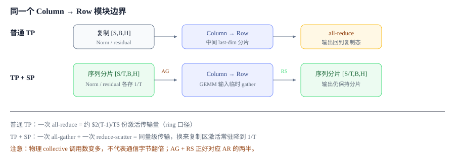

# Sequence Parallel：把复制区的激活按序列切薄

第 4 章 · Tensor Parallel 与 Sequence Parallel

Tensor Parallel 主要切分线性层内部的参数与计算，但层与层之间仍有一部分激活在各 TP rank 上重复保存。Sequence Parallel 沿序列维切分这些复制区域，进一步降低激活显存。

**本节关键词：** 📏 序列维切分 · 🔄 all-gather + reduce-scatter · 🧠 激活显存 · 🔗 与 TP 绑定

## 01 · TP 切完以后，哪里仍然存在复制

每次 Row Parallel 的 all-reduce 之后，hidden states 会重新在所有 TP rank 上复制；RMSNorm/LayerNorm、Dropout 和残差分支也因此各保存一份 $[S,B,H]$ 激活。Sequence Parallel（SP）把这些**不需要跨 token 交互**的区域沿序列维 $S$ 切成 $[S/T,B,H]$，其中 $T$ 是 TP 组大小。

*SP 不是新的 attention 算法；它改变的是 TP 模块之间 hidden states 的布局。*

## 02 · 通信如何变化

| 阶段 | 普通 TP | TP + SP |
| --- | --- | --- |
| Norm / residual 区 | 每卡 $[S,B,H]$ | 每卡 $[S/T,B,H]$ |
| 进入 Column Linear 前向 | copy（无通信） | 沿序列维 all-gather |
| 离开 Row Linear 前向 | all-reduce | 沿序列维 reduce-scatter |
| 反向 | Column 输入梯度 all-reduce | 通信方向互换：AG 的反向是 RS，RS 的反向是 AG |

从逻辑通信量看，一组 all-gather 与 reduce-scatter 和原来的 all-reduce 处于同一量级。SP 的主要收益不是减少网络传输总量，而是让 Norm、Dropout 和残差区域只常驻 $1/T$ 的激活。

## 03 · 与 Tensor Parallel、Context Parallel 的关系

SP 通常与 TP 绑定使用：TP=1 时序列没有被切分，也就没有激活分摊收益。进入需要完整 token 范围的 TP 线性计算前，各 rank 会通过 all-gather 还原输入；离开 Row Parallel 后，再通过 reduce-scatter 恢复序列分片布局。

SP 与 Context Parallel（CP）虽然都沿序列维切分，但位置和目标不同：SP 只分摊逐 token 区域的激活存储，计算 attention 前会在 TP 组内还原所需布局；CP 则让 attention 本身也在分段序列上计算，并处理跨卡 K/V 交换。

理解 SP 的通信边界后，可以回到 [4.1 · Tensor Parallel](03-tp.md#layer) 查看完整 Transformer layer 中的通信次数，或继续阅读 [4.3 · Loss Parallel](loss-parallel.md)。
