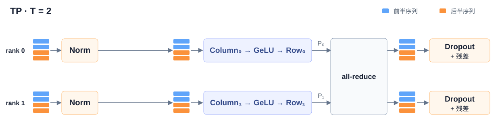

# Megatron Sequence Parallel：切分 TP 组内的复制激活

第 4 章 · Tensor Parallel 与 Sequence Parallel

上一节介绍了 Tensor Parallel（TP）怎样把两层 Linear 按 Column → Row 组合起来。本节沿着这条流程，先找出 TP 中仍然重复的计算与激活，再看 Sequence Parallel（SP，序列并行）怎样切分它们，以及通信随之发生的变化。

本文的 SP 指 **Megatron-style Sequence Parallel**，它与 TP 使用同一组 GPU。

## 01 · 普通 TP 的前向流程

以 Transformer 中的一个 MLP 子层为例，把它前面的 Norm 和后面的 Dropout、残差加法也画进来。这里 Norm 指 LayerNorm 或 RMSNorm；每个参与 TP 的 GPU 进程称为一个 rank。

设输入激活 $X$ 的形状为 $[S,B,H]$，其中 $S$ 是序列长度，$B$ 是一个 micro-batch 的样本数，$H$ 是隐藏维度；MLP 中间维度为 $F$，TP rank 数为 $T$。下图取 $T=2$。

*两行分别代表两个 rank；蓝、橙色条块表示序列的前半和后半，每个 token 的完整 $H$ 维向量都保留在本地。普通 TP 的两卡均持有两半序列，中央 Column / Row 的下标表示各自的权重分片。图中省略残差旁路线。*

每个 rank 都从相同的 $X$ 开始，先完成 Norm，再用自己的 Column 权重分片算出 $[S,B,F/2]$ 的中间激活。GeLU 直接处理这个分片，Row Linear 再把它投影回 $[S,B,H]$。

Row 的两份输出 $P_0$、$P_1$ 虽然形状完整，但各自只是**部分和**。all-reduce 将它们相加，使两卡都得到完整结果 $P_0+P_1$，然后分别执行 Dropout 和残差加法，进入下一子层。

## 02 · TP 中重复的计算与激活

观察图中两侧的 Norm、Dropout 和残差加法：两个 rank 都持有蓝、橙两半序列，因此对同一批 token 做了相同的 Norm，末尾的 Dropout 和残差加法也在两卡上各做一遍。这些区域还会重复保存反向需要的激活，例如 Norm 的输入和 Dropout mask。

它们都可以按 token 分工：Norm 只需要当前 token 的完整 $H$ 维向量，Dropout 按元素处理，残差加法只需要对应位置的两个值。因此，可以让 rank 0 处理前半序列、rank 1 处理后半序列，每个 token 的完整隐藏向量仍留在一张卡上。

**SP 要切分的就是这部分重复计算与保存激活。** Column → GeLU → Row 内部已经按 $F$ 维分工，不需要再切一次；这里节省的计算主要来自外围逐 token 算子，显存收益来自原先重复保存的激活。

## 03 · 开启 SP 后的前向流程

沿用同一个 MLP 子层，只改变两侧激活的布局与通信边界。假设 $S$ 能被 $T$ 整除，进入子层时输入已经按序列切好；下图两卡分别持有 $X$ 的前半和后半。

*与第一张图按相同位置对照：两侧每卡只持有一种颜色，即半段序列；all-gather 后两种颜色齐全，reduce-scatter 后又只保留本地的一半。中央 MLP 的权重切分与计算形状保持一致，末尾加上本地残差分片。*

变化集中在三个位置：

1. **Norm 只处理本地序列。** 每卡输入从 $[S,B,H]$ 变成 $[S/T,B,H]$，Norm 输出也保持这个形状。
2. **Column 前增加 all-gather。** 把各卡的 Norm 输出沿序列维拼起来，每卡临时得到完整的 $[S,B,H]$，继续用自己的权重分片处理全部 token。MLP 内部仍产生 $[S,B,F/T]$ 的中间激活。
3. **Row 后改用 reduce-scatter。** 它把各卡的部分和相加，再把结果按序列分发。每卡只得到正确输出中的 $[S/T,B,H]$，随后在本地完成 Dropout 和残差加法。

这样，下一个子层又从序列分片开始。两侧逐 token 算子的工作量及相应保存激活约为普通 TP 的 $1/T$；all-gather 得到的完整输入仍会临时占用显存，所以整层峰值显存不能直接按这一比例计算。

Attention 子层采用同样的边界：Norm → all-gather → QKV 列切投影 → 本地 attention heads → 输出行切投影 → reduce-scatter → Dropout / 残差加法。由于 QKV 投影前已经恢复完整序列，**每卡的 attention heads 仍然能看到全部 token**。

## 04 · 开启 SP 后的通信量

先看图中的一次前向：普通 TP 有一次 all-reduce；TP+SP 有一次 all-gather 和一次 reduce-scatter。虽然通信调用从一次变成两次，理论传输量可以相同。

设完整边界激活有 $N=SBH$ 个元素，使用理想 ring 通信算法，并统一统计**每个 rank 发送的元素数**：

| 通信操作 | 每 rank 发送量 |
| --- | --- |
| all-reduce：求和后每卡保留完整结果 | $2\frac{T-1}{T}N$ |
| all-gather：从序列分片恢复完整输入 | $\frac{T-1}{T}N$ |
| reduce-scatter：求和后每卡只保留序列分片 | $\frac{T-1}{T}N$ |

因此，一对 Column → Row 的前向通信量满足：

$$
C_{\mathrm{TP}}=2\frac{T-1}{T}N
\qquad
C_{\mathrm{TP+SP}}=\frac{T-1}{T}N+\frac{T-1}{T}N
=C_{\mathrm{TP}}.
$$

其中 $C$ 表示每 rank 的发送量；乘以每个元素的字节数即可换算成字节。以两卡为例，TP 每卡发送 $N$ 个元素，SP 则发送 $N/2+N/2$ 个元素。

直观上，ring all-reduce 本来就可以由 reduce-scatter 和 all-gather 两阶段组成。SP 让 Row 出口先留下序列分片，经过本地逐 token 计算，到下一次 Column 入口才恢复完整序列。两处通信作用于不同的激活，但在这里比较的张量大小相同。

对于 Attention、MLP 各有一对投影的典型 Transformer 层，前向就是 **2 次 all-reduce → 2 次 all-gather + 2 次 reduce-scatter**，这部分理论发送量保持不变。

训练时还要考虑反向：前向 all-gather 对应反向 reduce-scatter，前向 reduce-scatter 对应反向 all-gather，单看这些布局转换，通信量仍与 TP 对应。但为了只保存输入分片，Megatron SP 会在计算 Column 权重梯度前**额外 all-gather 一次前向输入**；每对 Column → Row 都可能有这项开销。原论文也说明了通过与计算重叠来减小它的耗时。因此，“前向通信量相同”不能直接推广成“完整训练步没有额外通信”。[原论文 §4.2.2](https://arxiv.org/html/2205.05198#S4.SS2.SSS2)

SP 减少了逐 token 区域的重复计算和保存激活；实际吞吐还取决于通信启动开销、额外 gather 及其与计算的重叠程度。

  <a href="../03-tp/">← 4.1 Tensor Parallel</a>
  <a href="../loss-parallel/">4.3 Loss Parallel →</a>

