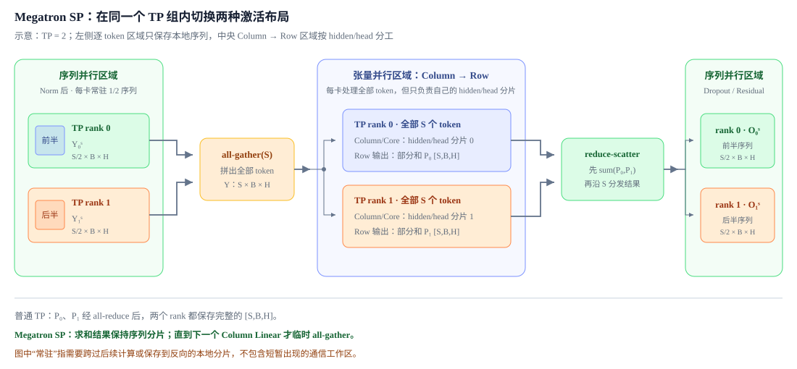

# Megatron Sequence Parallel：切分 TP 组内的复制激活

<div class="notebook-hero" markdown>

<span class="chapter-kicker">第 4 章 · Tensor Parallel 与 Sequence Parallel</span>

Tensor Parallel（TP）切分了 Attention 和 MLP 内部的权重与计算，但 LayerNorm、Dropout 和残差连接附近的 hidden states 仍会在 TP rank 之间重复保存。Megatron Sequence Parallel（SP）在同一个 TP 组内沿序列维切分这些激活，并在进入、离开张量并行区域时转换布局。

本文中的 SP 专指这种 **Megatron-style Sequence Parallel**。它不是一套独立的注意力算法，也不会建立新的并行维度；它依附于 TP，复用同一个 TP process group。

**本节关键词：** 📏 序列分片 · 🔄 布局转换 · 🧠 反向保存激活 · 🔗 与 TP 配合

</div>

## 01 · 普通 TP 中未切分的激活区域

先统一符号。设 hidden states 的逻辑形状为 $[S,B,H]$：$S$ 是序列长度，$B$ 是 micro-batch size，$H$ 是 hidden size；TP 组包含 $T$ 个 rank。为简化推导，先假设 $S$ 可以被 $T$ 整除。

以常见的 pre-norm dense Transformer layer 为例，Attention 和 MLP 各包含一对 Column Parallel Linear 与 Row Parallel Linear：

- Attention 的 QKV 投影按输出维列切，输出投影按输入维行切；
- MLP 的 FC1 或 gate/up 投影按输出维列切，FC2 或 down projection 按输入维行切；
- LayerNorm/RMSNorm、Dropout 和残差连接位于这些张量并行计算的外侧。

普通 TP 在 Column → Row 内部沿 hidden、FFN 或 attention head 维分片。Row Parallel Linear 产生的却是完整 hidden shape 的**部分和**：rank $r$ 得到 $P_r\in\mathbb{R}^{S\times B\times H}$，必须对所有 $P_r$ 求和。普通 TP 使用 all-reduce，因而每个 rank 最终都得到同一个 $[S,B,H]$ 输出。下一段 Norm、Dropout 和残差计算也就都从复制布局开始。

这些算子本身不要求不同 token 互相交换数据：

- LayerNorm/RMSNorm 对单个 token 的 $H$ 个 hidden 元素计算统计量，沿 $S$ 切分不会拆开一个 token；
- Dropout 对元素生成 mask，可以处理本 rank 的 token；
- 残差加法只要求相加的两个本地张量采用相同的序列分片。

因此，这一区域没有必要让每个 TP rank 都保存全部 $S$ 个 token。Megatron SP 正是利用了这个性质。

!!! note "这里所说的激活显存"

    激活显存主要指前向产生、反向仍需使用的张量，例如 Norm 的输入和 Dropout mask。它不等于“经过一个算子就固定保存一个完整 buffer”。残差张量的存活时间、融合 kernel 保存什么，以及 activation recomputation 是否重算，都会改变实际 buffer；分析 SP 时需要把这些常驻或长期保存的对象与临时通信 buffer 分开。

## 02 · 序列并行区域与张量并行区域

Megatron SP 让同一个 Transformer layer 交替使用两种激活布局。

| 区域 | rank $r$ 持有的激活 | 适合的计算 |
| --- | --- | --- |
| 序列并行区域 | 一段 token，形状 $[S/T,B,H]$ | Norm、Dropout、残差连接 |
| 张量并行区域 | 全部 token，但只持有本 rank 的 hidden/head/FFN 分片 | Column → Row、Attention、MLP |

若把完整 hidden states 沿序列维写成

$$
X=[X_0^S;X_1^S;\ldots;X_{T-1}^S],
\qquad X_r^S\in\mathbb{R}^{S/T\times B\times H},
$$

那么每个 TP rank 在序列并行区域只保存自己的 $X_r^S$。进入 Column Parallel Linear 前，需要沿序列维执行 all-gather：

$$
X=\operatorname{AllGather}_S(X_0^S,\ldots,X_{T-1}^S).
$$

all-gather 后，每个 rank 都能让自己的权重分片处理全部 token。经过 Column → Row 的本地计算后，rank $r$ 得到输出部分和 $P_r$。普通 TP 会 all-reduce 出完整输出 $P=\sum_r P_r$；SP 只让每个 rank 接收其中一段序列：

$$
P_r^S=
\operatorname{ReduceScatter}_S(P_0,\ldots,P_{T-1})_r
=\left(\sum_{j=0}^{T-1}P_j\right)_{\text{rank }r\text{ 的序列片段}}.
$$

reduce-scatter 在一次 collective 中同时完成两件事：先合并 Row Parallel 的部分和，再把正确结果沿序列维分给各 rank。下一段 Norm、Dropout 和残差计算只消费本地 $P_r^S$，不需要紧接着把完整 $P$ 复制回来。



*以 TP=2 为例：序列并行区域按 token 切分，张量并行区域让两个 rank 分别处理 hidden/head 分片；all-gather 与 reduce-scatter 位于两种布局的边界。*

原论文把“序列分片 → 张量并行”的转换记为 $g$，把“张量并行部分和 → 序列分片”的转换记为 $\bar g$。在前向中，$g$ 是 all-gather，$\bar g$ 是 reduce-scatter。

## 03 · 一对 Column → Row 的前向数据流

下面沿一个 TP 子模块完整走一遍。$r$ 表示当前 TP rank；在 MLP 中，$F$ 表示 FFN hidden size。

| 步骤 | 当前有什么 | 发生什么 | 最终留下什么 |
| --- | --- | --- | --- |
| 1. Norm 输入 | $X_r^S:[S/T,B,H]$ | 本 rank 对自己的 token 执行 Norm | $Y_r^S:[S/T,B,H]$ |
| 2. Column 入口 | 各 rank 分别持有 $Y_r^S$ | 沿序列维 all-gather | 每个 rank 临时得到 $Y:[S,B,H]$ |
| 3. Column 计算 | 完整序列 $Y$ 与本地权重分片 | MLP 产生 $[S,B,F/T]$；Attention 产生本地 Q/K/V head 分片 | 全序列、hidden/head 分片激活 |
| 4. 模块内部 | 本 rank 的 hidden/head 分片 | 执行 GeLU/SiLU 或本地 attention | 继续保持张量并行布局 |
| 5. Row 计算 | 分片输入与本地 Row 权重 | 计算完整 hidden shape 的一份部分和 | $P_r:[S,B,H]$ |
| 6. Row 出口 | 所有 rank 的 $P_r$ | 沿序列维 reduce-scatter | $O_r^S:[S/T,B,H]$ |
| 7. 逐 token 区域 | $O_r^S$ 与本地残差分片 | 执行 Dropout、残差加法 | 下一子层输入 $X_r^{\prime S}:[S/T,B,H]$ |

Attention 与 MLP 各走一次这条路径：

1. Norm → QKV Column → Attention → Output Row → Dropout/Residual；
2. Norm → FC1 Column → 激活函数 → FC2 Row → Dropout/Residual。

因此，对采用这两对投影的典型 dense Transformer layer，SP 前向包含两次 all-gather 和两次 reduce-scatter。这里的计数描述的是这条标准结构；模型加入额外投影、MoE 或融合模块后，应按实际模块边界重新统计。

Attention 仍然需要处理 token 之间的依赖。SP 不是让每个 rank 只用自己的 $S/T$ 个 token 独立计算 attention；QKV Column Parallel Linear 在计算前已经 all-gather 序列，所以每个 rank 会用完整 $S$ 个 token 计算自己负责的 attention heads。

## 04 · 反向布局转换与权重梯度输入

从布局变换本身看，前向和反向形成两对共轭操作：

| 边界 | 前向 | 反向 |
| --- | --- | --- |
| $g$：序列并行区域 → 张量并行区域 | all-gather | reduce-scatter |
| $\bar g$：张量并行区域 → 序列并行区域 | reduce-scatter | all-gather |

沿第 03 节反向走：Row 出口收到的梯度最初是 $[S/T,B,H]$ 的序列分片；$\bar g$ 的反向先 all-gather 出完整序列梯度，Row Linear 再计算本地输入梯度。Column Linear 对输入产生的各份梯度部分和，则由 $g$ 的反向 reduce-scatter：它一边跨 TP rank 求和，一边只把对应 token 的梯度交还给本 rank。Norm 最后在本地 $[S/T,B,H]$ 分片上完成反向。

不过，这张共轭表只描述**布局边界的反向**，不是 Megatron 反向阶段的全部 collective。Column Linear 计算权重梯度还需要前向输入 $Y:[S,B,H]$。如果为了节省显存而长期保存完整 $Y$，SP 的主要收益就会被削弱，因此 Megatron 只保存 $Y_r^S:[S/T,B,H]$，在反向计算 weight gradient 时再次 all-gather：

$$
\nabla W_r=Y^\mathsf{T}\nabla Z_r,
\qquad
Y=\operatorname{AllGather}_S(Y_0^S,\ldots,Y_{T-1}^S).
$$

这次 all-gather 是对前向输入的重新物化，不是 $g$ 的数学反向。Megatron 会尽量把它与 input-gradient GEMM 等计算重叠。原始 SP 论文专门说明了这一取舍；当前 Megatron Core 的 `ColumnParallelLinear` 路径也在前向 gather 输入，并在计算 weight gradient 的反向路径再次异步 gather 本地输入，随后对 input gradient 执行 reduce-scatter。

!!! warning "不要只按共轭表预测 profiler"

    “$g$ 的反向是 reduce-scatter”是正确的数学关系，但不能据此断言反向只会出现 AG/RS 各一次。是否重新 gather 权重梯度输入、通信是否与 GEMM 重叠，以及 Transformer Engine 是否融合了相邻操作，都取决于具体实现路径。

## 05 · 通信量：all-gather 加 reduce-scatter

设 Column → Row 边界的完整激活包含 $N=SBH$ 个元素。采用理想 ring collective，并以**每个 rank 发送的元素数**为口径：

| collective | 每 rank 的输入 → 输出 | 每 rank 发送量 |
| --- | --- | --- |
| all-reduce | $N\rightarrow N$ | $\frac{2(T-1)}{T}N$ |
| all-gather | $N/T\rightarrow N$ | $\frac{T-1}{T}N$ |
| reduce-scatter | $N\rightarrow N/T$ | $\frac{T-1}{T}N$ |

因此，在一对 Column → Row 的前向中，SP 的

$$
\text{all-gather}+\text{reduce-scatter}
$$

与普通 TP 的一次 ring all-reduce 具有相同的理论发送量。可以把这本带宽账理解为：SP 在 Row 出口只执行“求和后保留本地序列片段”的 reduce-scatter，到下一个 Column 入口才用 all-gather 恢复全部 token。二者作用于相邻边界上的不同激活，并不是把同一次 collective 调用机械拆开；相同的是传输元素数。

这个等式只比较对应边界的理论带宽量，不能直接替代端到端性能结论：

- 一个 all-reduce 变成两个 collective，调用次数和启动延迟增加；
- 第 04 节用于重新物化权重梯度输入的 all-gather 不在上面的前向等式中；
- Norm、Dropout 和残差相关计算只处理 $1/T$ 的 token，可以回收一部分时间；
- profiler 可能分别统计发送、接收或链路流量，数值不一定直接等于表中的理论口径。

所以 SP 的首要收益是激活显存，不是承诺减少通信字节或必然提高吞吐。

## 06 · 激活显存：保存分片，临时恢复完整输入

在序列并行区域，逻辑 hidden states 仍然是 $[S,B,H]$，只是每个 rank 长期保存其中互不重叠的 $[S/T,B,H]$。进入 Column Linear 时出现的完整 $[S,B,H]$ all-gather 结果属于计算所需的临时输入；Megatron 不把它作为跨越整个前反向周期的保存激活，而是在反向需要 weight gradient 输入时重新 gather。

原始 Megatron SP 论文在 GPT-style Transformer、16-bit 激活、1 byte Dropout mask，并忽略较小 buffer 的假设下，给出了单层激活显存估算。若 $a$ 是 attention head 数，则普通 TP 为

$$
M_{\mathrm{TP}}
=SBH\left(10+\frac{24}{T}+5\frac{aS}{HT}\right),
$$

其中没有除以 $T$ 的 $10SBH$ 主要来自 TP 区域之外重复保存的 LayerNorm 和 Dropout 激活。加入 SP 后变为

$$
M_{\mathrm{TP+SP}}
=\frac{SBH}{T}\left(34+5\frac{aS}{H}\right).
$$

这组公式的重点不是要求现代实现复现相同系数，而是说明布局变化：普通 TP 已经切分的 Attention/MLP 内部激活继续按 hidden/head 维分片，原先复制的逐 token 区域再按序列维分片，于是在论文的计算口径下，主要的单层保存激活都随 $1/T$ 缩小。

现代实现中的 FlashAttention、融合 Norm/Linear、融合 bias-dropout-add、不同精度和 activation recomputation 会改变系数与峰值。实际测量时仍要分别观察：长期保存的本地分片、临时 all-gather buffer、通信与 GEMM overlap 时并存的 buffer，以及显存分配器保留但当前不再使用的容量。

## 07 · Megatron Core 中的落点

Megatron Core 把 SP 接在原有 TP Linear 和 autograd 通信路径中，而不是另外实现一套 Transformer layer。

| 位置 | SP 开启后的职责 |
| --- | --- |
| Embedding 或 decoder 入口 | 建立初始序列布局；复制输入可以直接 scatter，词表并行 Embedding 也可以把归约与序列切分合成 reduce-scatter |
| `ColumnParallelLinear` | 前向 all-gather 序列输入；反向 reduce-scatter input gradient，并按需要重新 gather weight-gradient 输入 |
| `RowParallelLinear` | 前向把输出部分和 reduce-scatter 到序列布局；其反向 all-gather 输出梯度 |
| `tensor_parallel/mappings.py` | 定义 gather、reduce-scatter 及其 autograd 共轭关系 |

典型启动参数是：

```bash
--tensor-model-parallel-size 4 \
--sequence-parallel
```

使用和排查时需要确认：

- TP degree 大于 1；$T=1$ 时没有可分摊的 TP rank；
- 简单等长切分路径要求序列长度能按 TP degree 合法拆分；
- hidden size、FFN hidden size、attention heads 等仍需满足对应 TP Linear 的切分约束；
- Norm、残差两侧和模块边界必须保持一致的序列分片顺序；
- SP 不会进一步切分参数、梯度或优化器状态，它优化的是与 TP 组合时的激活布局。

实现细节可对照 [Megatron SP 原始论文](https://arxiv.org/html/2205.05198#S4.SS2.SSS2)、[Megatron Core `ColumnParallelLinear` 文档](https://docs.nvidia.com/megatron-core/developer-guide/latest/apidocs/core/core.tensor_parallel.layers.html) 与 [`layers.py` 源码](https://github.com/NVIDIA/Megatron-LM/blob/main/megatron/core/tensor_parallel/layers.py)。

## 08 · 核心结论

Megatron SP 的关键不是“额外切一次序列”，而是改变 TP 模块边界的输出契约：普通 TP 的 Row Linear 用 all-reduce 让每个 rank 都得到完整输出；SP 只保留其中的 reduce-scatter，让逐 token 区域继续持有 $[S/T,B,H]$。直到下一个 Column Linear 真正需要全部 token 时，才用 all-gather 临时恢复 $[S,B,H]$。

这种布局切换把 TP 组内原本重复保存的激活分摊到各 rank，同时保持 Column → Row 的权重切分与主要 GEMM 方式不变。理解 SP 时应始终同时追踪三件事：当前激活按序列还是 hidden/head 分片、collective 前后每个 rank 的实际 shape，以及哪些完整张量只是临时出现、哪些会一直保存到反向。

!!! tip "学完自测"

    1. 为什么 LayerNorm 可以直接处理 $[S/T,B,H]$，而 Column Parallel Linear 需要先 all-gather 序列？
    2. Row Parallel Linear 的部分和为什么可以直接通过 reduce-scatter 变成正确的序列分片？
    3. 为什么 $g$ 的反向是 reduce-scatter，Megatron 反向里仍可能出现额外 all-gather？
    4. “AG + RS 与 AR 通信量相同”采用的是什么口径，它没有说明哪些性能成本？
