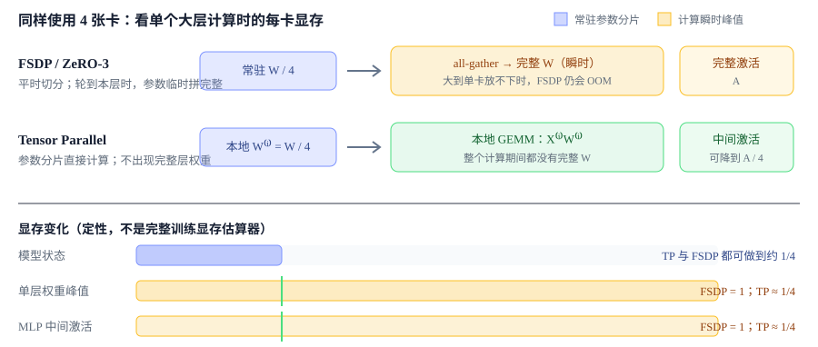
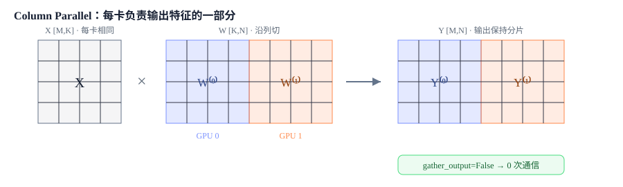
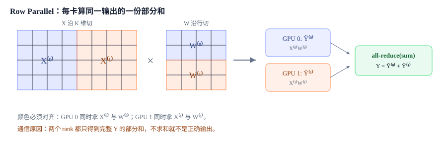
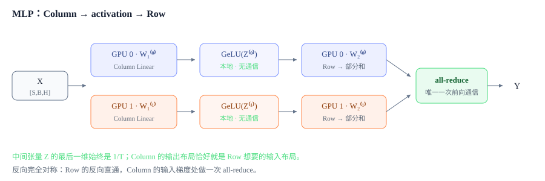
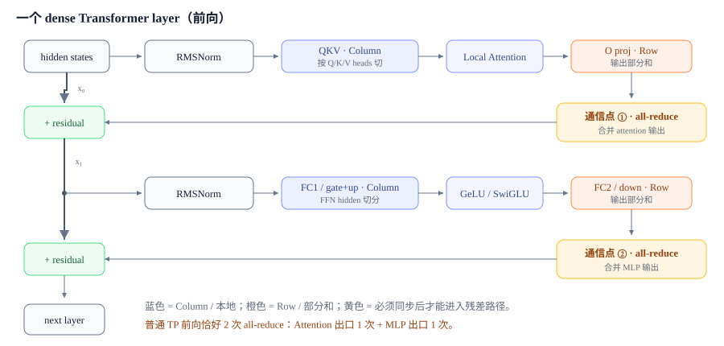

# Tensor Parallel：分片权重直接参与层内计算

<div class="notebook-hero" markdown>

<span class="chapter-kicker">第 4 章 · Tensor Parallel 与 Sequence Parallel</span>

FSDP 降低常驻模型状态的显存，但典型实现会在当前单元计算前临时恢复完整参数，也不会自动切分该单元的计算量与激活。张量并行（Tensor Parallel, TP）让权重分片直接参与矩阵乘，使每个 TP rank 只承担部分层内参数、计算和中间激活。

代价是前向与反向都会在层内依赖边界引入 TP 组通信。

**本章关键词：** 🧠 显存：不再重建完整层 · 🧩 Column → Row · 📏 Sequence Parallel · 🔌 每层通信账本 · 🔎 Megatron-LM 源码走读

</div>


## 01 · TP 与 FSDP 解决的不同约束 { #why }

先把两个问题分开。FSDP 平时只保存每层参数的 $1/N$，但计算某层之前仍要 `all-gather`，在设备上**临时重建这一层的完整参数**；该层的输入与中间激活也没有因为 FSDP 自动切小。TP 则让参数分片直接参与 GEMM：每张卡始终只拥有并计算这一层的一部分，不需要让任何一张卡看到完整大矩阵。




*TP 的独特优势不是“静态状态也能切”——FSDP 已经能做到；而是计算期间也不重建完整大层，并切薄层内中间激活。*


#### TP 解决的硬约束

单层权重、单个大 GEMM 或 MLP 中间激活超过单卡容量；也可让每卡只做约 $1/T$ 的矩阵乘计算。


#### TP 新引入的代价

同步对象从 FSDP 的参数/梯度变成激活；而且每一层都在关键路径通信，通常很难完全隐藏。

| 维度 | FSDP | TP |
| --- | --- | --- |
| 平时保存什么 | 参数 / 梯度 / 优化器状态分片 | 线性层权重、梯度、优化器状态天然按 TP 维分片 |
| 计算某层时 | all-gather 出完整层权重 | 分片权重直接参与 GEMM |
| 主要通信对象 | 参数与梯度，量级随 $P$ | 激活，量级随 $B \times S \times H$ |
| 通信位置 | 层边界，可预取、分桶、部分重叠 | 层内依赖边界，位于前向/反向关键路径 |
| 典型拓扑 | 可跨机扩展 | 优先放在单机高速互联域，常见 TP≤8 |


!!! warning "结论不是“TP 替代 FSDP”"

    二者切的是不同维度，实际大模型训练常把 TP 放在单机内，再让 FSDP/DP 跨机扩展。TP 赢在单层峰值，输在高频同步。


## 02 · 线性层的列切与行切 { #linear }

统一使用 $Y=XW$，其中 $X\in\mathbb{R}^{M\times K}$、$W\in\mathbb{R}^{K\times N}$、$Y\in\mathbb{R}^{M\times N}$。所谓“列切/行切”说的是**权重矩阵 $W$** 怎么切，不是代码里 weight 张量的存储方向。


### 列切（Column Parallel）：切输出维 $N$

$$W=[W^{(0)}\;W^{(1)}],\qquad Y^{(i)}=XW^{(i)},\qquad Y=[Y^{(0)}\;Y^{(1)}]$$

$X$ 在 TP rank 间复制，每张卡持有 $W$ 的一组列，独立算出 $Y$ 的一组列。只要下游接受分片输出，就**不需要通信**。




*列切：输入复制、权重按输出维切、输出按最后一维切。逐元素激活函数可直接在各分片上执行。*


### 行切（Row Parallel）：切归约维 $K$

$$X=[X^{(0)}\;X^{(1)}],\qquad W=\begin{bmatrix}W^{(0)}\\W^{(1)}\end{bmatrix},\qquad Y=X^{(0)}W^{(0)}+X^{(1)}W^{(1)}$$

$X$ 与 $W$ 必须沿同一个 $K$ 维对齐切分。每卡算出的不是输出切片，而是**完整输出的一份部分和**，所以最后必须 all-reduce 求和。




*行切：输入已按最后一维切好时不需要额外 scatter；GEMM 后用一次 all-reduce 合并部分和。*


| 切法 | 本地权重 | 输入布局 | 本地输出 | 前向默认通信 |
| --- | --- | --- | --- | --- |
| Column Parallel | $[K,N/T]$ | 复制 $[M,K]$ | 输出切片 $[M,N/T]$ | 0（保持分片） |
| Row Parallel | $[K/T,N]$ | 切分 $[M,K/T]$ | 部分和 $[M,N]$ | 1 × all-reduce |


## 03 · MLP 的 Column → Row 组合 { #mlp }

以普通 MLP 为例：$Y=\mathrm{GeLU}(XW_1)W_2$。$W_1$ 把 hidden 扩到 FFN hidden，先列切后得到分片中间激活；GeLU 是逐元素算子，可原地处理分片；$W_2$ 再沿行切，刚好直接消费上一层的分片，不需要中途 all-gather。




*这对组合的核心不是名称，而是“前一层产生的分片，后一层原样消费”，把中间通信推迟到模块出口。*


!!! tip "SwiGLU 仍然是同一个套路"

    gate/up 两个投影一起按输出维列切，每个 rank 在本地算 $\mathrm{SiLU}(XW_g^{(i)})\odot XW_u^{(i)}$，down projection 再行切。只要 gate 与 up 的对应通道落在同一 rank，逐元素乘法就不通信。


### 两个 Column Linear 之间的额外通信

第一个 Column 输出的是 $[M,K/T]$，而第二个 Column 需要每个 rank 都拿到完整 $[M,K]$ 输入，于是中间必须 all-gather。Column → Row 省掉的正是这次大中间激活拼接。


## 04 · Sequence Parallel：把“复制区”也按序列切薄 { #sp }

纯 TP 只切线性层内部，Row Parallel 之后的 hidden states 仍会在各 TP rank 上复制。Sequence Parallel 进一步切分这些复制区域的激活，并把相应的 all-reduce 改写成 all-gather 与 reduce-scatter。

[→ 继续阅读 4.2 · Sequence Parallel](03-sp.md)


## 05 · 边界上的 TP：Embedding、LM Head 与 Loss { #vocab }

Transformer 中间层按 hidden/FFN/head 切；模型两端更适合按词表维 $V$ 切。`VocabParallelEmbedding` 让每个 rank 只保存一段词表行：本 rank 词表范围外的 token 先 mask 为 0，本地 lookup 后再 all-reduce，得到正确 embedding。


#### 输入 Embedding

权重形状从 $[V,H]$ 变为 $[V/T,H]$。每卡对自己负责的 token lookup，其余位置清零；一次 all-reduce 合并。


#### LM Head + Loss

logits 保持 $[S,B,V/T]$，交叉熵通过分布式 max、sum-exp 与 target-logit 归约完成，避免 all-gather 巨大的完整词表 logits。

[→ 深入篇：词表并行交叉熵 Loss Parallel](loss-parallel.md)


## 06 · Transformer Layer 的切分与通信次数 { #layer }

以常见 pre-norm dense Transformer layer 为例。RMSNorm/LayerNorm 不切 hidden 维；Attention 的 QKV 投影列切、按 head 分配到各 rank，输出投影行切；MLP 的 gate/up（或 FC1）列切，down projection（或 FC2）行切。残差连接位于这两对 Column → Row 的外侧。




*标准 dense layer 的两对 Column → Row，决定了普通 TP 前向的两个同步点。*


### 通信计数：先说清“算一次”还是“训练一步”

| 口径 | 普通 TP | TP + SP |
| --- | --- | --- |
| **一个 layer 前向** | 2 × all-reduce | 2 × all-gather + 2 × reduce-scatter |
| **一个 layer 反向** | 2 × all-reduce | 2 × all-gather + 2 × reduce-scatter |
| **一个 layer 完整训练前后向** | **4 × all-reduce** | **4 × all-gather + 4 × reduce-scatter** |
| 逻辑通信量 | 4 个 AR 等价量 | AG+RS 合起来与对应 AR 同量级；收益来自激活布局 |


!!! note "TP 的典型拓扑位置"

    每个 layer 的 Attention 与 MLP 都要等通信完成，$L$ 层就把这些同步重复 $L$ 次；消息大小约与 micro-batch token 数 $\times H$ 成正比。它既高频又在关键路径，因此优先留在 NVLink/NVSwitch 等单机高速域。GQA/MQA 还要求 Q heads 能按 TP 切；KV heads 少于 TP degree 时需要复制 KV 或采用专门策略。


## 07 · 源码走读：从 Transformer Layer 一路追到 collective { #source }

读 Megatron-LM 的 TP，不要从通信函数盲找。最顺的顺序是：**模型结构选择了哪种 Linear → Linear 如何布置输入输出 → autograd mapping 在前向/反向做什么**。


> `attention.py / mlp.py` → `ColumnParallelLinear / RowParallelLinear` → `tensor_parallel/layers.py` → `tensor_parallel/mappings.py` → `torch.distributed collective`


### 第一站：模型结构把两对线性层接起来


**megatron/core/transformer/mlp.py · MLP.__init__ / forward（保留关键路径，省略融合与专家分支）**


```python
# FC1: ColumnParallelLinear，输出不 gather，保持 [s, b, ffn_hidden / tp]
self.linear_fc1 = submodules.linear_fc1(
    hidden_size, ffn_hidden_size,
    gather_output=False,
)

# FC2: RowParallelLinear，声明输入已经是 TP 分片
self.linear_fc2 = submodules.linear_fc2(
    ffn_hidden_size, hidden_size,
    input_is_parallel=True,
)

intermediate_parallel, _ = self.linear_fc1(hidden_states)
intermediate_parallel = self.activation_func(intermediate_parallel)
output, output_bias = self.linear_fc2(intermediate_parallel)
```

Attention 是同构的：`linear_qkv` 使用 Column，`gather_output=False`，Q/K/V heads 留在本 rank；core attention 本地计算后，`linear_proj` 使用 Row 合并各 rank 的 head 输出。


### 第二站：两个并行 Linear 决定通信放在哪里


**megatron/core/tensor_parallel/layers.py · ColumnParallelLinear.forward**


```python
if self.sequence_parallel:
    input_parallel = input_  # SP 的 all-gather 由线性 autograd 实现内部处理
else:
    input_parallel = copy_to_tensor_model_parallel_region(
        input_, group=self.tp_group
    )

output_parallel = self._forward_impl(
    input=input_parallel,
    weight=weight,                 # [output_size / tp, input_size]
    sequence_parallel=self.sequence_parallel,
    ...
)
# gather_output=False 时，output_parallel 原样交给后续 Row Linear
```


**megatron/core/tensor_parallel/layers.py · RowParallelLinear.forward**


```python
if self.input_is_parallel:
    input_parallel = input_        # Column 的输出已经切好
else:
    input_parallel = scatter_to_tensor_model_parallel_region(input_)

output_parallel = self._forward_impl(input_parallel, self.weight, ...)

if self.sequence_parallel:
    output_ = reduce_scatter_to_sequence_parallel_region(
        output_parallel, group=self.tp_group
    )
else:
    output_ = reduce_from_tensor_model_parallel_region(
        output_parallel, group=self.tp_group
    )
```


### 第三站：mapping 用 autograd 把前向/反向绑成共轭对


**megatron/core/tensor_parallel/mappings.py**


```python
def copy_to_tensor_model_parallel_region(input_, group=None):
    """forward: copy, backward allreduce"""
    return _CopyToModelParallelRegion.apply(input_, group)

def reduce_from_tensor_model_parallel_region(input_, group=None):
    """forward: all reduce, backward copy"""
    return _ReduceFromModelParallelRegion.apply(input_, group)

def gather_from_sequence_parallel_region(input_, ...):
    """forward: AG, backward: RS <first dim>"""
    return _GatherFromSequenceParallelRegion.apply(input_, ...)

def reduce_scatter_to_sequence_parallel_region(input_, ...):
    """forward: RS, backward AG <first dim>"""
    return _ReduceScatterToSequenceParallelRegion.apply(input_, ...)
```

| mapping | 前向 | 反向 | 出现位置 |
| --- | --- | --- | --- |
| `copy_to_tensor_model_parallel_region` | copy | all-reduce | 普通 TP 的 Column 入口 |
| `reduce_from_tensor_model_parallel_region` | all-reduce | copy | 普通 TP 的 Row 出口 |
| `gather_from_sequence_parallel_region` | all-gather(S) | reduce-scatter(S) | SP 的 Column 计算入口 |
| `reduce_scatter_to_sequence_parallel_region` | reduce-scatter(S) | all-gather(S) | SP 的 Row 出口 |


!!! tip "源码阅读的闭环"

    MLP/Attention 决定 Column → Row；`layers.py` 决定输出是否保持分片；`mappings.py` 决定同一个边界在 forward/backward 分别做什么。看到这三层，就能自己推导第 06 节的通信次数。


### 启用与检查

```bash
# 典型 Megatron-LM 参数
--tensor-model-parallel-size 4 \
--sequence-parallel
```

- 检查 $H$、FFN hidden、attention heads（以及实现要求下的 KV heads）能否被 TP degree 合法切分。
- 让同一个 TP group 尽量落在单机高速互联域；跨机规模优先交给 DP/FSDP/PP/CP。
- 用 profiler 验证每个 dense layer 的同步点：普通 TP 前向应主要看到 attention projection 与 MLP FC2 后的两次归约。
- 开启 SP 后不要只数 collective 次数，要同时看传输字节、Norm/Dropout/残差激活显存与端到端 step time。


!!! tip "✅ 学完自测"

    1. 为什么 FSDP 已经把参数切到 $1/N$，单个超大层仍可能 OOM？
    2. Column Parallel 为什么能不通信？Row Parallel 为什么必须求和？
    3. MLP 两层都列切，会在哪个位置多出什么通信？
    4. 普通 TP 的一个 dense Transformer layer，前向与完整训练分别有几次 all-reduce？
    5. SP 为什么 collective 调用数变多，却仍可能更快或更省显存？
