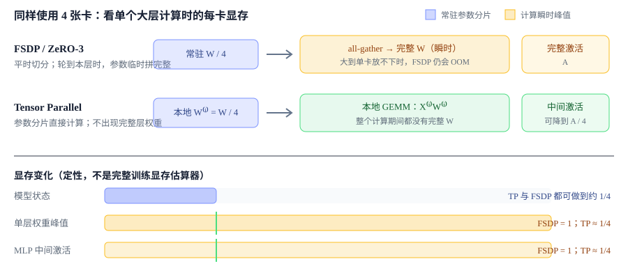
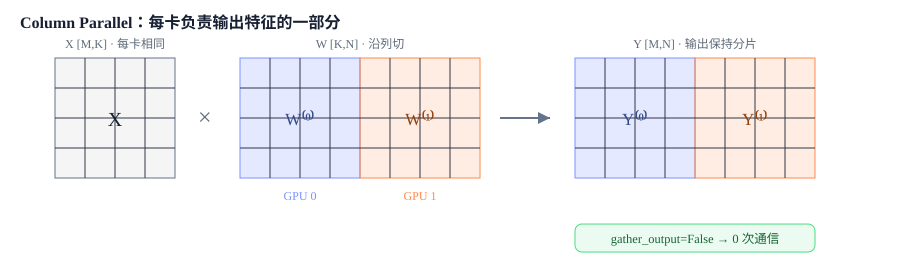
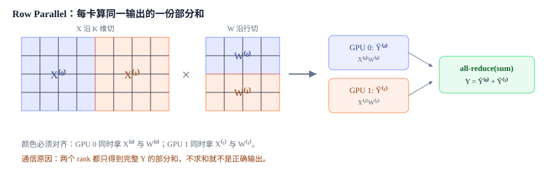
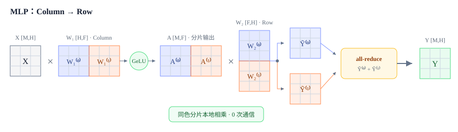
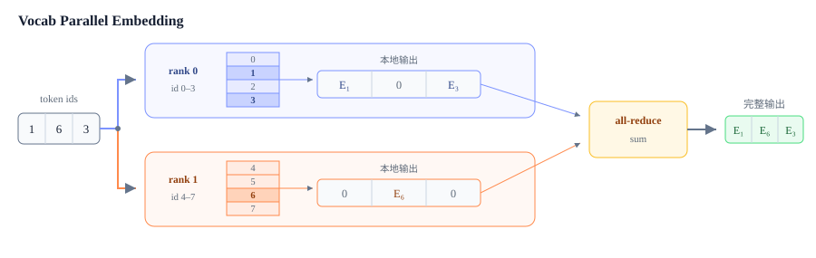

# Tensor Parallel：分片权重直接参与层内计算

第 4 章 · Tensor Parallel 与 Sequence Parallel

FSDP 降低常驻模型状态的显存，但典型实现会在当前单元计算前临时恢复完整参数，也不会自动切分该单元的计算量与激活。张量并行（Tensor Parallel, TP）让权重分片直接参与矩阵乘，使每个 TP rank 只承担部分层内参数、计算和中间激活。

代价是前向与反向都会在层内依赖边界引入 TP 组通信。

**本章关键词：** 🧠 显存：不再重建完整层 · 🧩 Column → Row · 📏 Sequence Parallel · 🔌 激活通信

## 01 · TP 与 FSDP 解决的不同约束 { #why }

先把两个问题分开。FSDP 平时只保存每层参数的 $1/N$，但计算某层之前仍要 `all-gather`，在设备上**临时重建这一层的完整参数**；该层的输入与中间激活也没有因为 FSDP 自动切小。TP 则让参数分片直接参与 GEMM：每张卡始终只拥有并计算这一层的一部分，不需要让任何一张卡看到完整大矩阵。

*TP 的独特优势不是“静态状态也能切”——FSDP 已经能做到；而是计算期间也不重建完整大层，并切薄层内中间激活。*

#### TP 解决的硬约束

单层权重、单个大 GEMM 或 MLP 中间激活超过单卡容量；也可让每卡只做约 $1/T$ 的矩阵乘计算。

#### TP 新引入的代价

同步对象从 FSDP 的参数/梯度变成激活；而且每一层都在关键路径通信，通常很难完全隐藏。

| 维度 | FSDP | TP |
| --- | --- | --- |
| 平时保存什么 | 参数 / 梯度 / 优化器状态分片 | 线性层权重、梯度、优化器状态天然按 TP 维分片 |
| 计算某层时 | all-gather 出完整层权重 | 分片权重直接参与 GEMM |
| 主要通信对象 | 参数与梯度，量级随 $P$ | 激活，量级随 $B \times S \times H$ |
| 通信位置 | 层边界，可预取、分桶、部分重叠 | 层内依赖边界，位于前向/反向关键路径 |
| 典型拓扑 | 可跨机扩展 | 优先放在单机高速互联域，常见 TP≤8 |

!!! warning "结论不是“TP 替代 FSDP”"

    二者切的是不同维度，实际大模型训练常把 TP 放在单机内，再让 FSDP/DP 跨机扩展。TP 赢在单层峰值，输在高频同步。

## 02 · 线性层的列切与行切 { #linear }

统一使用 $Y=XW$，其中 $X\in\mathbb{R}^{M\times K}$、$W\in\mathbb{R}^{K\times N}$、$Y\in\mathbb{R}^{M\times N}$。所谓“列切/行切”说的是**权重矩阵 $W$** 怎么切，不是代码里 weight 张量的存储方向。

### 列切（Column Parallel）：切输出维 $N$

$$W=[W^{(0)}\;W^{(1)}],\qquad Y^{(i)}=XW^{(i)},\qquad Y=[Y^{(0)}\;Y^{(1)}]$$

$X$ 在 TP rank 间复制，每张卡持有 $W$ 的一组列，独立算出 $Y$ 的一组列。只要下游接受分片输出，就**不需要通信**。

*列切：输入复制、权重按输出维切、输出按最后一维切。逐元素激活函数可直接在各分片上执行。*

### 行切（Row Parallel）：切归约维 $K$

$$X=[X^{(0)}\;X^{(1)}],\qquad W=\begin{bmatrix}W^{(0)}\\W^{(1)}\end{bmatrix},\qquad Y=X^{(0)}W^{(0)}+X^{(1)}W^{(1)}$$

$X$ 与 $W$ 必须沿同一个 $K$ 维对齐切分。每卡算出的不是输出切片，而是**完整输出的一份部分和**，所以最后必须 all-reduce 求和。

*行切：输入已按最后一维切好时不需要额外 scatter；GEMM 后用一次 all-reduce 合并部分和。*

| 切法 | 本地权重 | 输入布局 | 本地输出 | 前向默认通信 |
| --- | --- | --- | --- | --- |
| Column Parallel | $[K,N/T]$ | 复制 $[M,K]$ | 输出切片 $[M,N/T]$ | 0（保持分片） |
| Row Parallel | $[K/T,N]$ | 切分 $[M,K/T]$ | 部分和 $[M,N]$ | 1 × all-reduce |

## 03 · MLP 的 Column → Row 组合 { #mlp }

以普通 MLP 为例：$Y=\mathrm{GeLU}(XW_1)W_2$。设输入 $X$ 的形状为 $[M,H]$，FFN hidden 维为 $F$，TP 度为 $T$。在 rank $i$ 上，列切的 $W_1^{(i)}\in\mathbb{R}^{H\times F/T}$ 先产生 $[M,F/T]$ 的中间分片；GeLU 是逐元素算子，可以在本 rank 上独立处理这个分片。行切的 $W_2^{(i)}\in\mathbb{R}^{F/T\times H}$ 恰好以同一个 $F/T$ 维作为输入，因此不需要先把各 rank 的中间分片 all-gather 到一起。

*同色的 $A^{(i)}$ 与 $W_2^{(i)}$ 留在同一个 TP rank：两层之间 0 次通信，两份本地 $[M,H]$ 部分和在模块出口执行 1 次 all-reduce。*

!!! tip "SwiGLU 仍然是同一个套路"

    gate/up 两个投影一起按输出维列切，每个 rank 在本地算 $\mathrm{SiLU}(XW_g^{(i)})\odot XW_u^{(i)}$，down projection 再行切。只要 gate 与 up 的对应通道落在同一 rank，逐元素乘法就不通信。

### 两个 Column Linear 之间的额外通信

第一个 Column 输出的是 $[M,F/T]$，而第二个 Column 需要每个 rank 都拿到完整 $[M,F]$ 输入，于是中间必须 all-gather。Column → Row 省掉的正是这次大中间激活拼接。

## 04 · Sequence Parallel：把“复制区”也按序列切薄 { #sp }

纯 TP 只切线性层内部，Row Parallel 之后的 hidden states 仍会在各 TP rank 上复制。Sequence Parallel 进一步切分这些复制区域的激活，并把相应的 all-reduce 改写成 all-gather 与 reduce-scatter。

[→ 继续阅读 4.2 · Sequence Parallel](03-sp.md)

## 05 · 边界上的 TP：Embedding、LM Head 与 Loss { #vocab }

Transformer 中间层按 hidden/FFN/head 切；模型两端更适合按词表维 $V$ 切。经典 `VocabParallelEmbedding` 让每个 rank 只保存一段词表行，并在 lookup 后合并各 rank 对不同 token 位置的贡献。

#### 输入 Embedding：按词表行切分

Embedding 就是按 token id 查表。词表并行把这张表的行分给不同 TP rank；输入 token id 仍会复制到每个 rank，但每个 rank 只查自己负责的 id，其他位置输出零向量。

*例子中，rank 0 负责 token 0～3，rank 1 负责 token 4～7。两边分别填好自己负责的位置，再通过一次 all-reduce 得到完整的 embedding 序列。*

之所以可以直接求和，是因为每个 token id 只属于一个词表分片：同一位置只有一个 rank 给出非零向量。all-reduce 传递的是 embedding 激活，不会拼出完整词表权重；合并后的输出在各 rank 上复制，可以直接进入后续 Column Parallel Linear。实现中还会把全局 token id 换算成本地行号，并用 mask 避免访问本 rank 范围外的行。

#### LM Head + Loss

logits 保持 $[S,B,V/T]$，交叉熵通过分布式 max、sum-exp 与 target-logit 归约完成，避免 all-gather 巨大的完整词表 logits。

[→ 深入篇：词表并行交叉熵 Loss Parallel](loss-parallel.md)
