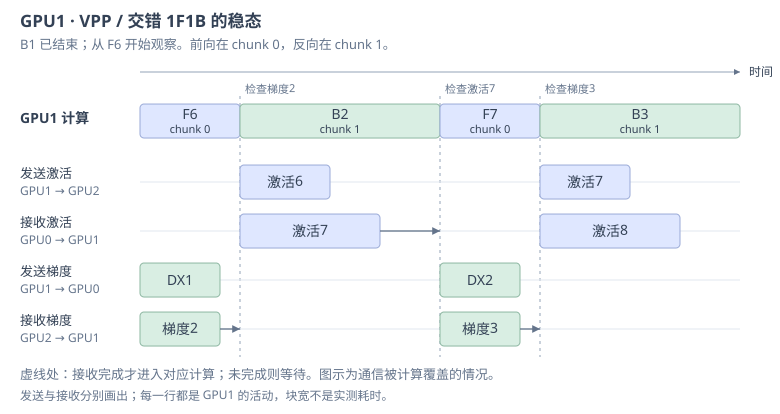
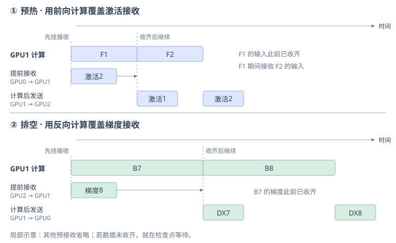
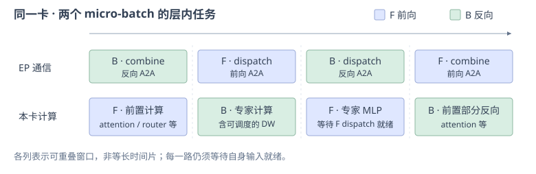
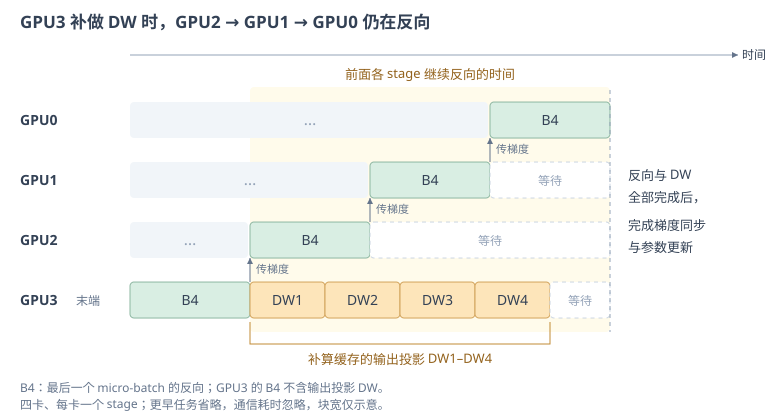

# Megatron PP：调度与性能优化 { #megatron-optimization }

5.2 · Megatron 性能优化

流水线并行（Pipeline Parallel, PP）的任务顺序决定了设备何时有计算可做。Megatron 在一前向一反向（1F1B）与虚拟流水线并行（VPP）的交错调度上，进一步调整 chunk 粒度、异步收发和计算顺序。本节说明每项优化利用哪段独立计算、改变哪些状态的生命周期，以及相应的显存代价与实现约束。

**本节关键词：** VPP 负载均衡 · P2P 重叠 · MoE 前后向配对 · 权重梯度延迟 · 激活管理

层布局、micro-batch 与各类 PP 调度的基础见 [5.1 · 原理与调度](04-pp.md)。这里的 chunk 指每张卡持有的一段模型，对应一个虚拟 stage；P2P 指相邻 stage 之间的点对点通信。

!!! note "实现范围"

    本节按 2026-09-14 核对的 NVIDIA/Megatron-LM `main` 说明常规 GPT 训练路径。表中的下划线名称是 Megatron Core 配置字段；命令行参数单独标出。具体默认值和组合限制可能随版本变化。

## 01 · Megatron 主线中的调度入口 { #schedule-entry }

普通单模型训练的 `get_forward_backward_func()` 主要按 PP 规模及是否启用虚拟 stage 选择路径：

| 条件 | 调度函数 |
| --- | --- |
| PP 规模为 1 | `forward_backward_no_pipelining` |
| PP 规模大于 1，未配置虚拟 stage | `forward_backward_pipelining_without_interleaving` |
| PP 规模大于 1，配置了虚拟 stage | `forward_backward_pipelining_with_interleaving` |

后两项分别对应非交错与交错 1F1B。GPipe 是理解流水线的重要基础，但这一入口没有将它列为独立训练调度；Zero Bubble 的作者实现使用 Megatron 的独立分支，DualPipe / DualPipeV 则有单独的官方仓库。这里区分的是实现入口，不代表这些算法在其他框架中不可用。[Megatron 调度源码](https://github.com/NVIDIA/Megatron-LM/blob/main/megatron/core/pipeline_parallel/schedules.py)

## 02 · VPP 粒度与 stage 负载均衡 { #vpp-tuning }

先确定设备划分与任务供给，再决定有多少通信可以重叠：

- `--pipeline-model-parallel-size` 设置物理 PP 规模 $P$。
- `--num-layers-per-virtual-pipeline-stage` 设置每个虚拟 stage 的层数，是启用交错调度的一种配置方式；chunk 数应结合模型总层数、PP 规模及首尾特殊层划分核对。
- `microbatch_group_size_per_vp_stage` 控制同一虚拟 stage 的 micro-batch 分组大小，影响前后向任务的 chunk 切换顺序；它不改变每个 micro-batch 的样本数。

在固定全局 batch、没有 batch ramp-up、且可整除的常规设置下：

$$
M=\frac{B_{\mathrm{global}}}{D\,B_{\mathrm{micro}}}
$$

其中 $M$ 是每条流水线一次更新处理的 micro-batch 数，$B_{\mathrm{global}}$ 是一次优化器更新覆盖的总样本数，$D$ 是数据并行副本数，$B_{\mathrm{micro}}$ 是每个副本一次 micro-batch 的样本数。PP rank 共同处理同一批样本，因此分母中不再乘 $P$。当前交错调度要求分组大小在 $P$ 与 $M$ 之间，最后一组若不满，也至少应有 $P$ 个 micro-batch。[分组与合法性检查](https://github.com/NVIDIA/Megatron-LM/blob/main/megatron/core/pipeline_parallel/schedules.py)

更小的 chunk 可以缩短调度气泡，但会增加 P2P 次数，并缩短每次可用于覆盖通信的计算窗口。固定全局 batch 时，减小 $B_{\mathrm{micro}}$ 虽然会增加 $M$，也可能让矩阵乘法变小、效率下降。因此 chunk 数和 micro-batch 数都不能只按“越多越好”设置。

此外，首部的 embedding、尾部的词表输出投影与 loss，以及不同层的 MoE 开销，会使“等层数”不等于“等耗时”。Megatron 支持用 `num_layers_in_first_pipeline_stage` / `num_layers_in_last_pipeline_stage` 调整首尾层数，或通过 `pipeline_model_parallel_layout` 指定更细的布局。应依据各 stage 的实测时间移动层；这两种布局配置在当前实现中不能同时指定。[层划分配置](https://github.com/NVIDIA/Megatron-LM/blob/main/megatron/core/transformer/transformer_config.py)

## 03 · P2P 重叠：通信与独立计算的交错 { #p2p-overlap }

上一节提到，切小 chunk 会增加 stage 之间的通信次数。每次前向都要先拿到上一 stage 的激活，每次反向都要先拿到下一 stage 传回的梯度。如果每轮收发都等到全部完成后才继续计算，通信时间就会直接拉长 GPU 的空闲时间。

交错 1F1B 提供了一个可以利用的条件：**某个任务正在等待数据时，同一张卡上可能还有另一个输入已经就绪的任务。** 例如，下一次反向还缺梯度，但当前前向的输入已经收到，就可以一边接收反向梯度，一边执行前向。P2P 重叠据此把“发起通信”与“等待通信完成”分开，在两者之间安排不依赖这份数据的计算。

### 稳态：用前向覆盖梯度传输，用反向覆盖激活传输

沿用 [四卡 VPP 示例](04-pp.md#advanced)，只观察中间的 GPU1。它的两个 chunk 在前向时都从 GPU0 接收输入激活，计算后向 GPU2 发送输出激活；在反向时都从 GPU2 接收输出梯度，计算后向 GPU0 发送输入梯度，记为 DX。这里的梯度是 stage 边界上激活的梯度，供相邻 stage 继续反向使用。

取稳态中的一段计算顺序：**B1 → F6 → B2 → F7**。F、B 分别表示前向和反向，数字是 micro-batch 编号；这段时间的前向运行在 chunk 0，反向运行在 chunk 1。因此 F6 与 B2 属于不同 micro-batch、不同 chunk，B2 不需要 F6 的结果。B2 需要的是 micro-batch 2 先前前向留下的激活，以及 GPU2 传回的对应梯度。

先看 B1 结束后的时刻：GPU1 已经算出要传给 GPU0 的 DX1，F6 的输入也已收齐；稍后要执行的 B2 则需要从 GPU2 接收梯度。若现在等待这轮梯度收发全部完成，再开始 F6，就会推迟一个本来可以执行的前向任务。重叠调度改为以下顺序：

1. **发起梯度收发，然后执行 F6。** GPU1 向 GPU0 异步发送 DX1，同时向 GPU2 发起 B2 所需梯度的接收请求，随后开始 F6。F6 不使用这两份梯度，所以梯度传输可以与它并行推进。
2. **F6 结束后，发起激活收发，再进入 B2。** 此时 GPU1 已得到 F6 的输出，可以向 GPU2 发送这份激活，并从 GPU0 提前接收 F7 的输入。接着确认第 1 步请求的梯度已经收到，才开始 B2；如果还没收到，就在这里等待。B2 计算期间，F6 输出的发送和 F7 输入的接收可以继续推进。
3. **B2 结束后，继续为后续任务准备数据。** GPU1 发出刚算好的 DX2，并提前接收 B3 的梯度。确认第 2 步请求的 F7 输入已收到后，开始 F7，于是又有一段前向计算可以覆盖梯度传输。

{ style="max-width: 780px;" }

*所有行都属于 GPU1，并共用同一条时间轴；图从 B1 结束后开始，F6 的输入此前已收齐。虚线表示接收数据的使用边界，图中画的是数据在边界前已收齐的情况，块宽不是实测耗时。发送和接收行的“激活7”分别是 F7 的输出与输入，是经过本 chunk 计算前后的不同张量。*

沿图中的“接收梯度”一行看，B2 的梯度在 F6 期间传入，到 B2 开始时才被使用；再沿“接收激活”一行看，F7 的输入在 B2 期间传入，到 F7 开始时才被使用。**能够隐藏多少通信时间，取决于发起通信后、使用数据前有多长的独立计算窗口。** 如果 GPU2 很晚才算出 B2 所需的梯度，或者传输耗时超过了 F6 的计算时间，剩余等待仍会出现在 B2 前。

### 异步收发：请求返回与数据可用的区别

上述顺序依靠异步通信实现：发起收发后，调度器拿到一个通信句柄，用它在稍后等待对应操作完成。此时程序可以继续安排其他工作，但接收缓冲区中的数据还不一定可用。所谓“预接收”，就是提前准备接收缓冲区并发起请求；实际传输仍要等对端算出数据并发起匹配的发送。

因此，调度器需要守住两个边界：接收的数据在计算读取前必须完成传输；发送的数据在发送完成前必须保留，不能覆盖或释放其存储。前者决定 B2、F7 何时能够开始，后者决定 DX1、F6 的输出等通信缓冲区何时能够回收。Megatron 用收发句柄维护这些依赖；若发起异步请求后立即等待，就没有给独立计算留下重叠的机会。[P2P 收发实现](https://github.com/NVIDIA/Megatron-LM/blob/main/megatron/core/pipeline_parallel/p2p_communication.py)、[调度中的等待位置](https://github.com/NVIDIA/Megatron-LM/blob/main/megatron/core/pipeline_parallel/schedules.py)

### 预热与排空：用当前计算覆盖下一次接收

稳态中，前向与反向轮流提供重叠窗口。预热阶段连续执行前向，排空阶段连续执行反向，也可以利用相邻任务之间的独立性：当前任务的数据已经就绪时，先发起下一次任务的接收，再执行当前任务。

仍以 GPU1 为例。预热时，假设 F1 的输入已经收到，调度器可以先从 GPU0 请求 F2 的输入，然后执行 F1。F1 完成后才有输出可发给 GPU2，而 F2 的输入接收已经推进了一段时间；确认该输入收齐后，就可以开始 F2。

排空时采用相同顺序。假设 B7 所需的梯度已经收到，且反向所需的前向激活仍被保留，调度器先从 GPU2 请求 B8 的梯度，再执行 B7。B7 完成后向 GPU0 发送 DX7，等 B8 的梯度收齐后继续反向。

{ style="max-width: 780px;" }

*图中仅展示 GPU1 的局部收发，省略后续预接收；当前任务的输入或梯度已就绪。发送行的激活是当前前向的输出，接收行的激活是下一次前向的输入。若下一份数据未及时收齐，后续计算仍须在虚线处等待。*

这两个阶段的共同点是：**下一次接收在本次计算开始前就已发起，而本次计算的结果只能在算完后发送。** 首尾 stage 和 chunk 切换处还要按实际依赖调整收发，不能把这个中间 GPU 的局部顺序直接套到所有位置。[预热与排空的预接收实现](https://github.com/NVIDIA/Megatron-LM/blob/main/megatron/core/pipeline_parallel/schedules.py)

在本文讨论的 Megatron 常规 PP 路径中，稳态 P2P 重叠需要启用 VPP，并设置 `overlap_p2p_comm=True`、`batch_p2p_comm=False`；在此基础上，`overlap_p2p_comm_warmup_flush=True` 将重叠扩展到预热与排空。[配置定义](https://github.com/NVIDIA/Megatron-LM/blob/main/megatron/core/model_parallel_config.py)

这些配置提供了交错安排通信与计算的执行路径，实际收益还取决于对端数据何时就绪、独立计算窗口有多长，以及发送缓冲区是否需要提前回收。结合上一节的 chunk 粒度来看，chunk 越小，每段计算可覆盖的通信时间也越短；应在时间线上检查数据使用前剩余的等待，并以迭代时间确认收益。

## 04 · MoE 重叠：把一对前后向拆到层内调度 { #moe-overlap }

`--overlap-moe-expert-parallel-comm` 处理的是 **混合专家模型（MoE）层内的专家并行（EP）All-to-All（A2A，全互换通信）**。它保留外层 1F1B / VPP 框架，把一个 micro-batch 的前向与另一个 micro-batch 的反向交给 `combined_1f1b` 共同执行，再由层内 schedule plan 安排通信和计算。这条路径与 DualPipe 有相近的重叠思路，但不会把模型布局自动改成双副本或 V 形。

一层 MoE 被拆为：**attention 与路由等前置计算 → dispatch → 专家 MLP → combine**。反向按依赖走相反方向，其中 `combine backward` 先把输出梯度送回专家，`dispatch backward` 再把专家算出的输入梯度送回 token 来源。前后向属于不同 micro-batch，因此可以使用以下窗口：

| 已发起的通信 | 可同时执行的独立计算 |
| --- | --- |
| 反向的 combine A2A | 前向的 attention 与路由等前置计算 |
| 前向的 dispatch A2A | 反向的专家计算，包括可调度的权重梯度 |
| 反向的 dispatch A2A | 前向的专家 MLP，前提是它的 dispatch 已完成 |
| 前向的 combine A2A | 反向的 attention 等前置部分 |

{ style="max-width: 780px;" }

*图中的 F、B 属于不同 micro-batch，各列是可重叠的局部窗口，宽度不表示实测耗时。每一路仍须满足自身的 dispatch、专家计算、combine 依赖；不能用尚未收到 token 的专家计算覆盖自己的 dispatch。*

源码将这些操作组织成可分别执行、带依赖事件的 schedule node，而不是完整跑完一个 `forward()` 后再调用完整 `backward()`。交错 PP 开启这项优化时还会多预热一个前向任务，为稳态中的独立配对准备输入。[`combined_1f1b.py`](https://github.com/NVIDIA/Megatron-LM/blob/main/megatron/core/pipeline_parallel/combined_1f1b.py)、[层内执行顺序](https://github.com/NVIDIA/Megatron-LM/blob/main/megatron/core/models/common/model_chunk_schedule_plan.py)

配套的 `--delay-wgrad-compute` 将线性层的 DX 与参数梯度（DW）分开：先让 DX 推进反向依赖，再把 DW 放入后续通信窗口。这里的延迟服务于层内通信重叠，并不意味着外层调度已经变成[5.1 的 Zero Bubble 调度](04-pp.md#zero-bubble)。DW 完成前，其所需的输入和输出梯度仍要保留；与 DP 梯度归约结合时，也必须等 DW 实际完成后才能把对应梯度标记为 ready。

当前实现需要注意以下组合条件：

- EP 大于 1，dispatcher 为 `alltoall` 或 `flex`；PP 大于 1 时需配置 VPP。这项 EP 优化也有 PP 为 1 的执行路径。
- 基础模型使用 BF16 或 FP16，要求 PyTorch ≥ 2.6；低精度算子和通信后端还有各自的支持条件。
- 不能与利用同层共享专家分支的 `moe_shared_expert_overlap` 同开；不支持 full recompute 或把整个 `moe` 放入重算模块列表，不能因此推断所有选择性重算都不支持。
- `delay_wgrad_compute` 需要 Transformer Engine（TE）；与 `overlap_grad_reduce` 同开时，当前 CLI 要求 TE ≥ 2.8。若再叠加 CUDA Graph，应继续核对具体捕获范围的版本限制。

同时在途的前后向、额外预热和延迟 DW 都可能提高激活峰值。`--ep-overlap-early-attn-memory-release` 可以把反向 attention 提到前向专家 MLP 之前，先释放一部分旧激活，再分配新激活；代价是原本由 attention backward 覆盖的部分 A2A 可能重新暴露。通信 kernel 也会争用 GPU 的计算资源和内存带宽，是否加速应以迭代时间为准。[兼容性检查](https://github.com/NVIDIA/Megatron-LM/blob/main/megatron/core/transformer/transformer_config.py)、[提前释放的调度位置](https://github.com/NVIDIA/Megatron-LM/blob/main/megatron/core/models/common/model_chunk_schedule_plan.py)

## 05 · 输出投影 DW 延后：利用流水线排空窗口 { #embedding-wgrad }

最后一个 stage 的词表输出投影通常较大。它的反向既要计算传回 Transformer 的 DX，也要计算输出权重的 DW。DX 决定前面各 stage 何时继续反向，而 DW 可以在本次参数更新前完成，因此两者有不同的紧迫程度。

`--defer-embedding-wgrad-compute` 利用这一点。虽然参数名中有 embedding，常规 GPT 路径实际处理的是**末端词表输出线性层的权重梯度**，包括与输入 embedding 共享权重的情况。以四卡、每卡一个 stage 为例：

1. 前向保存输出投影的输入；反向保存对应的输出梯度。
2. 优先计算 DX，继续本 stage 的反向并尽早向前一个 stage 传梯度；DW 暂不执行。
3. GPU3 传出最后一个 micro-batch 的梯度后，GPU2 → GPU1 → GPU0 还要依次完成它们的反向。GPU3 利用这段时间调用 `finish_embedding_wgrad_compute()`，补算缓存的 DW。
4. DW 完成后，才能完成相关梯度同步并更新参数。

{ style="max-width: 780px;" }

*图中延后的 DW 全部落在其他卡的反向时间内；若 DW 更长，超出的部分仍会延长迭代。*

这项优化不减少总计算量；只有延后的 DW 能落入原来的空闲窗口，才会缩短迭代。代价是额外保存输入与输出梯度。`wgrad_deferral_limit` 限制延迟的 micro-batch 数，0 表示全部延迟；当前实现要求 PP 大于 1，并启用梯度累积融合。它与上面的 `delay_wgrad_compute` 作用范围不同，不应互相替代。[输出层 DW 收尾](https://github.com/NVIDIA/Megatron-LM/blob/main/megatron/core/pipeline_parallel/schedules.py)、[配置与条件](https://github.com/NVIDIA/Megatron-LM/blob/main/megatron/core/model_parallel_config.py)

## 06 · PP 激活管理与参数预取的配合 { #memory-prefetch }

更细的调度和更多重叠可能增加在途状态。Megatron 还在 PP 执行过程中提供以下配合机制：

| 机制 | 如何生效 | 代价或边界 |
| --- | --- | --- |
| `deallocate_pipeline_outputs` | 边界输出发送完成后，将不再需要的数据存储释放，仅保留反向所需的图连接，并通过配套 backward 路径执行 | 只处理边界输出，不能释放层内反向仍需要的全部激活；异步发送完成前不能释放 |
| 按 micro-batch 调整重计算 | `num_microbatches_with_partial_activation_checkpoints` 在在途窗口内，让部分任务采用较轻的 checkpoint 策略，其余任务采用完整重计算 | 用额外前向计算降低激活峰值；依赖模型 forward 对 checkpoint 标志的支持，也须满足 MoE overlap 的限制 |
| 参数 All-Gather 预取 | 使用分布式优化器时，`--overlap-param-gather` 提前收集后续计算需要的参数，并在使用前等待；`align_param_gather` 在交错 PP 中协调各 stage 的发起时机 | 这是 DP 参数通信；它与 PP P2P 共用资源，过多并发可能争抢带宽。当前 CLI 还要求开启梯度归约重叠 |

重计算和输出释放解决激活存储，参数预取解决参数通信等待，三者作用对象不同。应从时间线和显存记录分别确认收益，而不能只看某个配置已经开启。[PP 调度与输出释放](https://github.com/NVIDIA/Megatron-LM/blob/main/megatron/core/pipeline_parallel/schedules.py)、[参数同步实现](https://github.com/NVIDIA/Megatron-LM/blob/main/megatron/core/distributed/param_and_grad_buffer.py)

## 07 · 从时间线判断优化是否有效 { #validation }

先固定模型、全局 batch、精度与设备映射，记录稳态迭代时间和各卡峰值显存，再针对现象调整：

| 观察到的现象 | 优先核对的优化 |
| --- | --- |
| 某个 stage 长期更慢，其他卡反复等待它 | 先平衡首尾特殊层与 Transformer 层的耗时 |
| 启动、排空占比较高 | 核对 micro-batch 数与 VPP 粒度，再评估输出投影 DW 延后 |
| 每次 chunk 切换后都有 P2P 等待 | 检查异步收发、预接收与真正的等待位置 |
| MoE A2A 占主导，另一个 micro-batch 有独立计算 | 评估 `overlap-moe-expert-parallel-comm` 及 DW 延迟 |
| 开启重叠后显存峰值上升 | 检查在途前后向、延迟 DW 和通信 buffer 的寿命，再选择提前释放或兼容的重算策略 |

验收时比较实际迭代时间，而不只看通信与计算是否在图上交叉。如果两者并发后都变慢，或节省的通信时间被额外预热、重算和同步抵消，就没有获得端到端收益。

!!! tip "自测"

    1. Megatron 的 P2P overlap 与 MoE overlap 分别覆盖哪类通信？为什么发起异步请求后立即等待通常不能形成重叠？
    2. 输出投影 DW 延后为何可能缩短流水线排空时间，又为什么会增加显存？
