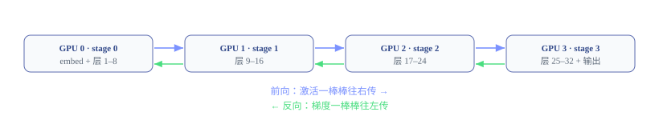
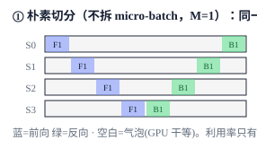
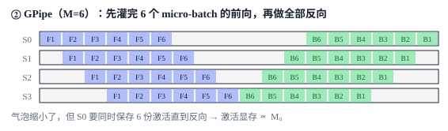
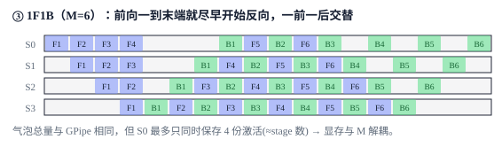

# Pipeline Parallel：沿模型深度切分计算

<div class="notebook-hero" markdown>

<span class="chapter-kicker">第 5 章 · Pipeline Parallel</span>

流水线并行（Pipeline Parallel, PP）沿模型深度把层划分到多个 stage，并在 stage 边界传递激活与梯度。本章从朴素串行调度出发，依次说明 micro-batch、GPipe 与 1F1B 如何改变设备利用率和激活生命周期。

**本章关键词：** 🏭 流水线比喻 · 🫧 气泡 = GPU 干等 · 📦 micro-batch 填满流水线 · 🔁 1F1B 省激活显存

</div>


## 01 · Pipeline stage 与边界数据 { #idea }

想象一条汽车流水线有 4 个工位：装底盘 → 装发动机 → 装车身 → 喷漆。一辆车必须依次经过这 4 个工位。**流水线并行（Pipeline Parallel, PP）就是把模型的层当作工位，把数据当作要加工的车。**

具体怎么切？假设模型有 32 层、你有 4 张 GPU，那就每张卡放 8 层:




*把 32 层切成 4 段（stage），每张卡管 8 层。卡之间只在边界传一个激活/梯度张量。*


注意两个要点：

- **前向**时，stage 0 算完自己的层，把边界激活传给 stage 1；最后一个 stage 算出 loss。**反向**时，对应的激活梯度沿相反方向传回。对顺序 Transformer，边界通常可抽象为一个 hidden-state 张量；带跳连、多输入输出或额外辅助张量的模型可能传递一个张量集合。
- 通信只发生在 stage 边界，而不是每层内部反复同步。它的频率通常低于 TP，因此 PP 更容易跨节点扩展；但每个边界张量的大小仍随 micro-batch、序列长度和 hidden size 增长，不能笼统视为“通信量极小”。

切分时的惯例是：embedding 放首 stage，transformer 层在各 stage 间平摊，最后的 norm+lm\_head 放尾 stage。Megatron 通过 `--pipeline-model-parallel-size` 指定 stage 数，再按层数自动均分。


## 02 · 朴素串行调度与流水线气泡 { #naive }

切好了，怎么跑？最直接的想法：把**一整个 batch** 灌进 stage 0，算完传给 stage 1……但你马上会发现一个尴尬的事实：**同一时刻只有一个工位在干活，其它三个都在干等。**

stage 0 在忙的时候，stage 1/2/3 还没收到数据，只能空转；等数据传到 stage 3 时，stage 0/1/2 又没事干了。4 张昂贵的 GPU，利用率只有 $1/4$:


**图例：** 前向 F 反向 B 气泡（GPU 干等）



*横轴是时间，每行一张卡，每格是一个时间片。大片空白 = 气泡。4 张卡，大部分时间在空转。*


!!! warning "⚠️ 这就是 PP 的原罪：气泡（bubble）"

    流水线具有链式依赖：后一个 stage 必须等待前一个 stage 的输出。启动时后面的 stage 在等待，收尾时前面的 stage 在等待；时间线中的这些空白称为气泡（bubble）。第一种改进是把 batch 拆成多个 micro-batch，连续送入流水线，这类“全部前向后全部反向”的调度通常称为 GPipe。


## 03 · GPipe 的 micro-batch 调度 { #gpipe }

回到工厂的比喻：如果你一次只往流水线里放**一辆车**，那确实大部分工位在闲着。但如果你**一辆接一辆连续地放车**呢？很快 4 个工位就都各自忙着不同的车了。

GPipe 就是这个思路：把一个大 batch 切成 $M$ 个 **micro-batch（小份）**，一份接一份连续地喂进流水线。当 micro-batch 1 走到 stage 1 时，micro-batch 2 正好进入 stage 0——流水线被填满了:


**图例：** 前向 F i 反向 B i 气泡



*F1…F6 是 6 个 micro-batch 的前向，B6…B1 是它们的反向。中间的空白小多了，但仔细看：还剩两块三角形气泡。*


### GPipe 的气泡比例

在各 stage 计算时间相同、忽略通信且采用同步调度的简化模型中，填满流水线需要 $P-1$ 个时间片，排空也存在对应等待。于是气泡占比可以估算为：

$$ \text{气泡占比} \approx \frac{P-1}{M + P - 1}, \qquad P=\text{stage 数},\ M=\text{micro-batch 数} $$

代入感受一下（$P=4$）:

| micro-batch 数 M | 气泡占比 | 含义 |
| --- | --- | --- |
| 1（朴素） | 3/4 = 75% | 几乎全在空转 |
| 6 | 3/9 ≈ 33% | 还有三分之一浪费 |
| 32 | 3/35 ≈ 8.6% | 基本填满了 |

结论很直观:**micro-batch 数 $M$ 越大于 stage 数 $P$，气泡越小**。所以实践中通常让 $M$ 远大于 $P$（例如几十个 micro-batch），把气泡压到个位数百分比。


!!! warning "⚠️ GPipe 的新麻烦：显存爆了"

    想把气泡降到 8%，就得用 $M=32$。但 GPipe 是「**先做完所有前向，再做所有反向**」——这意味着 32 个 micro-batch 的**激活全都要留着**，直到反向才用得上。看上图 S0 那一行:它存了 6 份激活（F1–F6）一直挂到反向。**激活显存 ∝ M**，M 一大就 OOM。我们陷入两难:M 小则气泡大，M 大则显存爆。


## 04 · 1F1B 的激活生命周期 { #onef1b }

1F1B 的洞察非常漂亮:**你根本不需要等所有前向都做完。** 一旦 micro-batch 1 的前向走到最后一个 stage，它的反向就可以*立刻*开始往回走——反向一做完，这份激活就能**马上释放**，不必一直占着显存。

于是调度变成:每个 stage 在稳定期里**「做一个前向，紧接着做一个反向」**，交替进行（这就是名字 1F1B = One Forward One Backward 的由来）:


**图例：** 前向 F i 反向 B i 气泡



*看最后一行 S3：它一拿到 F1 就立刻做 B1，然后 F2、B2…… 一前一后咬合得严丝合缝。反向被尽量提前了。*


!!! tip "🔑 1F1B 的精髓:气泡没变，但显存变小了"

    在上面的等长 stage、无通信开销示例中，1F1B 和 GPipe 的总时长相同（都是 18 个时间片），因此这里的 1F1B 没有减少气泡。它改变的是**激活生命周期**：反向被尽早触发，激活用完即可释放；每个 stage 同时保留的 micro-batch 激活由随 $M$ 增长变为主要受 pipeline 深度限制：

    | 方案 | S0 最多同时保存几份激活 | 激活显存 |
    | --- | --- | --- |
    | GPipe（M=6） | **6** 份（= M） | ∝ M，M 大就 OOM |
    | 1F1B（M=6） | **4** 份（≈ stage 数 P） | ∝ P，与 M 解耦 |

    这就解开了 GPipe 的两难:既然显存不再随 $M$ 增长，你就可以放心用很大的 $M$ 来把气泡压到很小，而**不必担心 OOM**。这正是 1F1B 成为事实标准的原因。


## 05 · 1F1B 的 warmup / steady / cooldown { #phases }

把上面 1F1B 图里**任意一行**拆开看，每个 stage 都经历三个阶段:

1. **warmup（预热，只做前向）**:先连做几个前向，把流水线填起来。离输入越近的 stage 预热越多——它得先攒够「在飞」的 micro-batch，下游才有活干。预热数 = `P - 1 - stage_id`（最后一个 stage 预热 0，拿到第一个前向就能立刻反向）。
2. **steady（稳态，1F1B 交替）**:做一个前向、紧接一个反向，循环。这是流水线满载、效率最高的区间（图里中间咬合得最紧的部分）。
3. **cooldown（排空，只做反向）**:前向都喂完了，把流水线里剩下的反向逐个做完。

Megatron 把这套逻辑显式写出来。预热数的计算:


**Megatron-LM · pipeline_parallel/schedules.py:2166**


```python
# 越靠前的 stage 预热越多；最后一个 stage 预热 0
num_warmup_microbatches = total_stages - current_stage - 1
num_warmup_microbatches = min(num_warmup_microbatches, num_microbatches)
num_microbatches_remaining = num_microbatches - num_warmup_microbatches
```

稳态循环是 1F1B 的灵魂——一次融合通信「把前向激活发给下游、*同时*收回上游传来的反向梯度」，紧接着立刻做一个反向:


**Megatron-LM · pipeline_parallel/schedules.py:2269（steady 阶段）**


```python
for i in range(num_microbatches_remaining):
    output_tensor, _ = forward_step(...)                                   # 做 1 个前向 F
    output_tensor_grad = p2p_communicator.send_forward_recv_backward(...)  # 发激活 + 同时收回梯度
    input_tensor  = input_tensors.pop(0)                                   # 取出最早那个 micro-batch
    output_tensor = output_tensors.pop(0)
    input_tensor_grad = backward_func(input_tensor, output_tensor, output_tensor_grad, config)  # 做 1 个反向 B
    input_tensor = p2p_communicator.send_backward_recv_forward(...)        # 发梯度 + 同时收下一个激活
```


普通 1F1B 主要缩短激活存活时间，并未消除启动与排空气泡。继续压缩气泡有两类思路：交错 1F1B 用多个虚拟 stage 缩短每段计算粒度；Zero-Bubble 调度则拆分反向中的输入梯度与权重梯度计算，把可延后的工作填入空档。

## 06 · 交错 1F1B 与 Zero-Bubble { #advanced }

普通 1F1B 控制了同时存活的 micro-batch 激活数，但在前述等长 stage、忽略通信的模型中，启动与排空项仍然存在。继续优化通常沿下面两条路线展开：

- **交错 1F1B（Interleaved，虚拟 stage）**：一张卡不再只负责一段连续层，而是持有多个较小的虚拟 stage（例如卡 0 同时负责层 1–4 与 17–20）。若每卡有 $C$ 个均衡的 model chunk，理想气泡项可近似缩小到原来的 $1/C$；代价是 stage 边界传输次数和调度复杂度增加，增长倍数取决于具体切分。
- **Zero-Bubble**：把反向拆成输入梯度计算（B，上一 stage 立即依赖）和权重梯度计算（W，只需在优化器更新前完成），再把可延后的 W 调度到空档。它的目标是继续压缩气泡；实际残余仍取决于 stage 是否均衡、通信依赖与调度约束。

Megatron 用一个分发函数按 PP 度数和是否有虚拟 stage 自动选调度:


**Megatron-LM · pipeline_parallel/schedules.py:142（get_forward_backward_func）**


```python
if pp_size > 1:
    if vp_size is not None:
        forward_backward_func = forward_backward_pipelining_with_interleaving       # 交错 1F1B
    else:
        forward_backward_func = forward_backward_pipelining_without_interleaving    # 普通 1F1B
else:
    forward_backward_func = forward_backward_no_pipelining
```


## 07 · stage 边界的 P2P 通信 { #p2p }

PP 的通信不是 all-reduce 这种集合通信，而是**点对点 send/recv**(就像两个工位之间用传送带递东西)。Megatron 的 `P2PCommunicator` 封装了四个方向，外加两个稳态用的「边发边收」融合算子:


**Megatron-LM · pipeline_parallel/p2p_communication.py:424 / :486**


```python
def recv_forward(...):   # 从上一 stage 收激活；如果自己是首 stage，没人传 → None
    if is_first_stage: input_tensor = None
    else: input_tensor, _, _ = self._communicate(recv_prev=True, recv_next=False, ...)

def send_forward(...):   # 把激活发给下一 stage；如果自己是尾 stage，不用发
    if not is_last_stage: self._communicate(tensor_send_next=output_tensor, ...)
# 另有 recv_backward / send_backward（传梯度），底层都走 torch.distributed 的 P2POp + batch_isend_irecv
```


## 08 · Megatron-LM 的 PP 配置 { #compare }


#### Megatron-LM 手写调度

- `get_forward_backward_func` 按 pp/vp 自动选
- 1F1B / 交错 1F1B 显式 warmup/steady/cooldown
- `--pipeline-model-parallel-size N`
- `--num-layers-per-virtual-pipeline-stage`（交错）


#### 关键开关 一览

- `--pipeline-model-parallel-size`：stage 数 $P$
- `--micro-batch-size`、`--global-batch-size` 与数据并行规模共同决定一次优化器更新包含的 micro-batch 数；还需结合 ramp-up batch 和 pipeline 调度配置核对实际 $M$
- `--num-layers-per-virtual-pipeline-stage`：开交错 1F1B
- 有虚拟 stage 时走 `forward_backward_pipelining_with_interleaving`


!!! tip "✅ 学完自测"

    1. 用工厂流水线解释:气泡是怎么产生的？为什么 micro-batch 数 $M$ 越大气泡越小？
    2. GPipe 把气泡变小了，却带来了什么新问题？为什么？
    3. 1F1B 相比 GPipe 改善的**不是**速度（气泡一样），而是什么？它靠什么做到的？
    4. 为什么 1F1B 里离输入越近的 stage，warmup 的前向越多？
    5. PP 为什么能跨机器，而上一章的 TP 不行？（提示:比通信的量和频率）
