# Pipeline Parallel：沿模型深度切分计算

5.1 · Pipeline Parallel 原理与调度

流水线并行（Pipeline Parallel, PP）沿模型深度把层划分到多个阶段（stage），并在 stage 边界传递激活与梯度。本章从朴素串行调度出发，沿 GPipe、1F1B、VPP、Zero Bubble / ZBV 和 DualPipe 五条主线，说明层布局与任务顺序如何改变设备利用率、激活存储和通信开销。

**本章关键词：** 层划分 · 边界通信 · micro-batch 调度 · 流水线气泡 · 激活生命周期

## 01 · Pipeline stage 与边界数据 { #idea }

PP 将模型中连续的若干层组成一个 stage，分配到不同设备上。每个 stage 保存并计算自己负责的层，通过通信连接相邻 stage 的计算图。这样，单张设备只需容纳一部分模型状态；但同一份输入仍然必须按层的顺序完成计算。

以包含 32 个 Transformer 层的模型为例，使用 4 张 GPU 时，可以让每张卡负责 8 层。输入嵌入（embedding）放在首 stage，最终归一化（norm）和输出投影（lm_head）放在尾 stage：

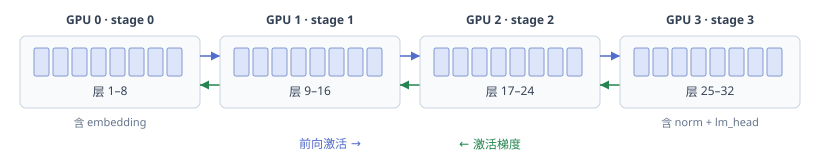

*每组条块表示一个 stage 内的 8 个 Transformer 层。蓝色箭头传递前向激活，绿色箭头传递对应的激活梯度。*

前向时，stage 0 计算层 1–8，将输出激活发送给 stage 1；依次执行到最后一个 stage 后计算损失。反向时，最后一个 stage 先计算本地梯度，再将其输入的梯度传给前一个 stage。各 stage 据此继续反向，计算本地参数梯度，并向前传递输入梯度。

对顺序 Transformer，边界数据通常可抽象为一个隐藏状态（hidden-state）张量；带跳连、多输入输出或额外辅助张量的模型可能需要传递多个张量。相邻 stage 通过**点对点通信（Point-to-Point, P2P）**交换这些数据。

与张量并行（TP）在层内进行通信相比，PP 的激活与梯度传输集中在 stage 边界，通信频率通常更低，因此更适合跨节点部署。边界张量的大小仍取决于每次输入的样本数、序列长度和隐藏维度。划分 stage 时还需要平衡计算量与显存占用；按层数均分只是一个起点，首尾 stage 的嵌入和输出计算也应计入负载。

## 02 · 朴素串行调度与流水线气泡 { #naive }

最直接的执行方式是将一个 batch 整体送入模型，依次完成所有 stage 的前向，再按相反顺序完成反向。这种调度只分散了模型存储，还没有让不同设备的计算重叠：前向依赖上一 stage 的输出，反向依赖下一 stage 传回的梯度，同一时刻只有一个 stage 执行计算。

下面用 4 个 stage 展示这一过程。全章调度时间线统一采用以下理想耗时比例：**一次前向 F 占 1 个时间单位，完整反向 B 占 2 个时间单位**。后面拆分反向时，输入梯度与参数梯度各占 1 个单位。矩形宽度表示耗时，不表示张量大小；各 stage 假设负载均衡，通信不单独计时。基础调度图省略优化器更新，Zero Bubble 图则显式画出更新与下一迭代的衔接。

这一比例来自矩阵乘法的常用计算量近似：线性层前向做一次矩阵乘法，反向分别为输入和权重计算梯度，需要两次同量级矩阵乘法。实际耗时还受算子实现、硬件和重计算影响，应通过测量确定；2 倍用于统一本章示意图的比较口径，与 [Sea AI Lab 的 Zero Bubble 调度图](https://sail.sea.com/blog/articles/56)一致。DualPipe 中配对任务的重叠时长会在相应图中另外注明。

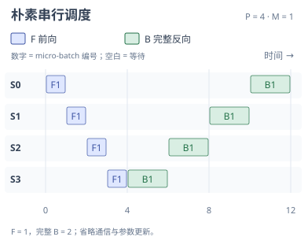{ style="max-width: 400px;" }

*横轴为时间，S0–S3 对应四个 stage；F1、B1 分别表示同一份数据的前向和反向，空白表示等待。*

每张卡在 12 个时间单位中计算 3 个时间单位，因此平均计算时间占比为 $1/4$。这些由调度依赖造成的空闲区间称为**流水线气泡（bubble）**。这里统计的是理想时间线中的忙闲比例，不是单个计算任务执行时的 GPU 算力利用率。

要提高设备利用率，可以将 batch 拆成多个 **micro-batch（微批次）**，使不同 stage 同时处理不同 micro-batch。GPipe 采用先完成全部 micro-batch 前向、再执行全部反向的调度方式。

## 03 · GPipe 的 micro-batch 调度 { #gpipe }

设一次优化器更新中，每条流水线需要处理 $M$ 个 micro-batch。当 stage 0 完成第一个 micro-batch 的前向并将激活发给 stage 1 后，就可以开始第二个 micro-batch 的前向。随着后续 micro-batch 进入，多个 stage 的计算逐渐重叠。

GPipe 在所有 micro-batch 完成前向后执行反向，并累积各 micro-batch 的参数梯度，最后统一更新参数。图中取 $M=6$：

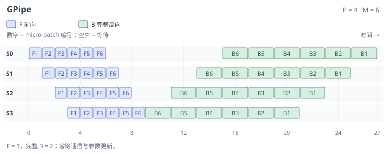{ style="max-width: 800px;" }

*F1–F6 表示各 micro-batch 的前向，B1–B6 表示对应反向；本例按 B6 到 B1 的顺序执行反向。前向和反向各自的启动与排空阶段仍有等待。*

### GPipe 的气泡比例

令 $P$ 为 stage 数，$M$ 为 micro-batch 数。在各 stage 负载均衡、前向耗时为 1、完整反向耗时为 2 的模型中，前向共需 $M+P-1$ 个时间单位，反向共需 $2(M+P-1)$ 个时间单位。每个 stage 的有效计算时间为 $3M$，因此气泡占比为：

$$
\text{气泡占比} = 1 - \frac{3M}{3(M+P-1)} = \frac{P-1}{M+P-1}
$$

当 $P=4$ 时：

| micro-batch 数 $M$ | 气泡占比 | 计算时间占比 |
| --- | --- | --- |
| 1 | 75% | 25% |
| 6 | 33.3% | 66.7% |
| 32 | 8.6% | 91.4% |

$M$ 相对 $P$ 越大，启动与排空的等待占比越小。但在总 batch size 固定时，增加 $M$ 意味着减小单个 micro-batch，可能降低算子效率，因此需要同时考虑调度与单次计算的效率。

GPipe 的激活存储也受 $M$ 影响：开始反向之前，每个 stage 都要保留全部 $M$ 个 micro-batch 各自反向所需的激活。**在单个 micro-batch 大小和激活保存策略固定时，峰值激活存储随 $M$ 增长。** 激活重计算可以减少每份需要保存的内容，但仍需考虑多个 micro-batch 的累积。GPipe 的批次拆分与重计算机制可参见[原论文](https://arxiv.org/abs/1811.06965)。

要降低这部分峰值存储，可以在完成全部前向之前开始反向，让已完成反向的激活更早释放。下面介绍的一前向一反向（One Forward One Backward, 1F1B）调度采用这一方式。

## 04 · 1F1B 的激活生命周期 { #onef1b }

本文讨论同步、非交错的 1F1B：各 stage 在预热之后交替执行一次前向和一次反向，完成所有 micro-batch 的梯度累积后再更新参数。一次交替中的前向和反向通常属于不同 micro-batch；前向继续处理后续输入，反向处理已经收到下游梯度的较早输入。

最后一个 stage 完成某个 micro-batch 的前向和损失计算后，即可开始它的反向。其余 stage 收到下游梯度后继续反向，本地反向完成后便可释放该 micro-batch 在本 stage 保存的激活。

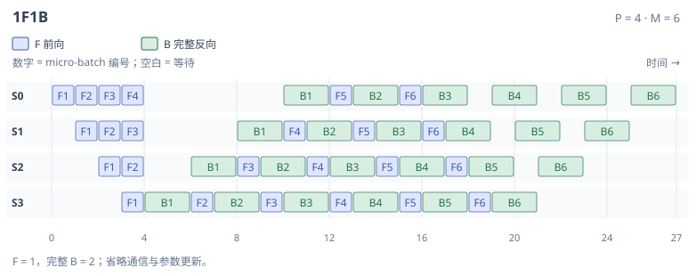{ style="max-width: 800px;" }

*末 stage S3 按 F1、B1、F2、B2 的顺序执行；S0 在完成 F4 后执行 B1，此时即可释放第一个 micro-batch 的本地激活。*

在本例中，1F1B 和 GPipe 的总时长都是 27 个时间单位，气泡占比相同。1F1B 的主要收益是缩短激活生命周期，减少同时保存的激活份数：

| 方案 | S0 峰值激活份数（$P=4, M=6$） | 随 $M$ 的变化 |
| --- | --- | --- |
| GPipe | 6 份 | 随 $M$ 增长 |
| 非交错 1F1B | 4 份 | $M$ 足够大后主要受 $P$ 限制 |

这里的“一份”指一个 micro-batch 在本 stage 为反向保存的激活。比较以单个 micro-batch 大小和激活保存策略相同为前提。1F1B 使增加 $M$ 时不必继续累积同等数量的激活，但显存峰值仍取决于每份激活大小、模型状态和通信 buffer。

从单个 stage 看，调度可分为预热（warmup）、前后向交替的稳态（steady）和只剩反向的排空阶段（cooldown）。

### 预热、稳态与排空 { #phases }

非交错 1F1B 中，每个 stage 按以下顺序执行：

1. **warmup（预热）**：先执行若干次前向，等待最早的 micro-batch 的梯度从下游返回。对编号从 0 开始的 `stage_id`，预热次数为 `min(P - 1 - stage_id, M)`；越靠近输入端，需要等待的下游 stage 越多。
2. **steady（稳态）**：交替执行一次前向和一次反向。前向保存新的激活，反向消费较早保存的激活，完成后释放相应存储。
3. **cooldown（排空）**：全部前向结束后，完成预热阶段留下的反向任务。

因此，“预热次数”与“峰值激活份数”不是同一个数：S0 在预热中执行 3 次前向，进入稳态后先执行 F4，再执行 B1，峰值为 4 份。

### 稳态中的边界通信 { #p2p }

对中间 stage，稳态需要完成两组数据交换：

| 本地计算之后 | 向相邻 stage 发送 | 从相邻 stage 接收 | 接下来可执行的计算 |
| --- | --- | --- | --- |
| 前向 F | 向下游发送新 micro-batch 的激活 | 从下游接收较早 micro-batch 的输出梯度 | 较早 micro-batch 的反向 B |
| 反向 B | 向上游发送输入梯度 | 从上游接收后续 micro-batch 的激活 | 后续 micro-batch 的前向 F |

Megatron 的 `send_forward_recv_backward()` 与 `send_backward_recv_forward()` 分别组合这两组收发。实际循环还要维护激活队列，并对首尾 stage、最后一次迭代做特殊处理。组合收发便于组织通信依赖；要让通信与计算在时间上重叠，还需要异步操作、可独立执行的计算，以及正确的完成事件等待。[Megatron P2P 接口文档](https://docs.nvidia.com/megatron-core/developer-guide/latest/apidocs/core/core.pipeline_parallel.p2p_communication.html)

普通 1F1B 缩短了激活生命周期，但启动与排空仍以整段 stage 的计算为单位。进一步将每张卡上的层拆成多个小段，就能以更细的粒度调度，这引出了虚拟流水线并行（Virtual Pipeline Parallelism, VPP）：每个小段称为一个 model chunk，对应一个虚拟 stage。

## 05 · VPP：交错调度多个 model chunk { #advanced }

VPP 是模型划分方式：每个物理 PP rank（PP 通信组中的进程编号）持有多个 **model chunk**，每个 chunk 对应一段逻辑 stage。**Interleaved 1F1B（交错 1F1B）**是在这种划分上交错执行前向与反向的调度。两者经常一起使用，但层放在哪张卡上与任务按什么顺序运行，是两个不同的问题。

以下令 $P$ 表示物理 PP rank 数，$C$ 表示每个 rank 的 chunk 数。逻辑 stage 总数为 $PC$；前面的非交错例子对应 $C=1$。示例中每个 rank 对应一张 GPU；与 TP 组合时，一个 PP 位置还可以对应一组执行张量并行的 GPU。

### 层划分与执行顺序

仍以 32 层、4 张卡为例，取 $C=2$，每个 chunk 包含 4 层。沿模型前向顺序，chunk 按 GPU0、GPU1、GPU2、GPU3、GPU0、GPU1、GPU2、GPU3 放置：

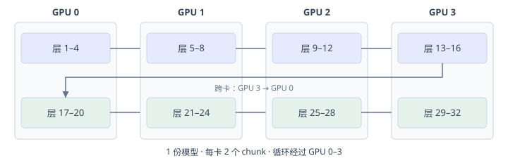{ style="max-width: 760px;" }

*每列是一张 GPU，每个框是一段连续层。箭头只表示一个 micro-batch 的前向依赖；反向沿相反方向传递梯度。图中不是时间轴。*

GPU0 计算完某个 micro-batch 的层 1–4 后，可以处理其他 micro-batch。等这个输入经过 GPU3 的层 13–16 后，GPU0 再执行它的层 17–20。因此，同一张卡会在不同 chunk、不同 micro-batch 的任务之间切换。

调度器要同时确定两件事：当前执行前向还是反向，以及执行哪个 chunk 的哪个 micro-batch。Megatron 的交错调度会先生成 `(microbatch_id, model_chunk_id)` 顺序表，再结合各 rank 的预热和反向依赖执行任务。例如，前向分组大小为 4 时，本地前向任务先处理 chunk 0 的 micro-batch 1–4，再处理 chunk 1 的 micro-batch 1–4；实际时间线上还会穿插反向和等待，不能直接把这个顺序表当成执行时间线。[Megatron 调度源码：`get_schedule_table`](https://github.com/NVIDIA/Megatron-LM/blob/main/megatron/core/pipeline_parallel/schedules.py)

将每张卡的任务放在同一行时间轴上，可以看到多个 micro-batch 怎样流经各卡，以及每张卡怎样在两个 chunk 之间切换。下图取 $P=4,C=2,M=8$，前向分组大小为 4：

[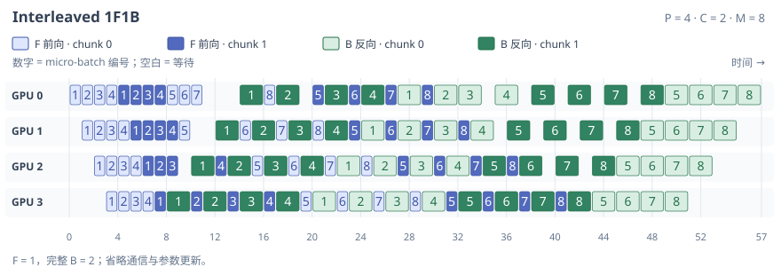{ #timeline-vpp style="max-width: 1000px;" }](assets/04-pp-timeline-vpp.svg)

*每张 GPU 对应一行。蓝色表示前向 F，绿色表示完整反向 B；浅色为本卡的 chunk 0，深色为 chunk 1，格内数字是 micro-batch 编号。每个 chunk 的 F 占 1 个时间单位、完整 B 占 2 个单位，行内空白表示该卡等待。*

沿编号 1 的蓝色块可以看到：它从时刻 0 开始依次经过 GPU0–3 的浅色 chunk 0，到时刻 4 回到 GPU0 执行深色 chunk 1，再次经过 GPU1–3 后完成前向。对应的绿色块沿相反路径返回。每张卡都把两个 chunk 的任务交错排在同一条时间线上，任务间的空白就是该卡的气泡。本图按 Megatron 的任务顺序重建，总时长为 57 个单位，每张卡有效计算 48 个单位，气泡占比为 $9/57\approx15.8\%$；不计通信和优化器更新。

### 气泡缩短与通信代价

令 $t_F$、$t_B$ 分别为一个 micro-batch 在原先整段 stage 上的前向和完整反向耗时。非交错 1F1B 的理想气泡时间为：

$$
T_{\mathrm{bubble}}=(P-1)(t_F+t_B)
$$

保持每张卡总层数不变，将它均分成 $C$ 个计算量相等的 chunk，并采用理想交错调度时，单个 chunk 的耗时约为原来的 $1/C$，气泡时间相应近似为：

$$
T_{\mathrm{bubble,VPP}}\approx\frac{P-1}{C}(t_F+t_B),\qquad
r_{\mathrm{bubble,VPP}}\approx\frac{P-1}{MC+P-1}
$$

这里 $r$ 是气泡占总迭代时间的比例；有效计算时间仍为 $M(t_F+t_B)$。**缩小到约 $1/C$ 的是气泡时间，并非气泡比例直接除以 $C$。** 例如 $P=4,M=8,C=2$ 时，理想气泡比例从 $3/11\approx27.3\%$ 降至 $3/19\approx15.8\%$。[Megatron-LM 论文 §2.2.2](https://arxiv.org/abs/2104.04473)

这些公式忽略通信，假设 chunk 均衡、micro-batch 数满足调度约束。实际收益还受以下因素限制：

- **更多边界传输**：图中的一个 micro-batch 前向跨卡 7 次，非交错划分只有 3 次；反向也要经过对应边界。即使每次边界张量大小相同，总通信量仍会上升。
- **计算粒度变小**：需要调度更多任务，部分通信更难被短计算段覆盖；首尾特殊层也可能造成 chunk 不均衡。
- **更多激活队列**：每个 chunk 都要维护尚未完成反向的 micro-batch。显存应按各 chunk 的实际激活大小与存活区间统计，不能只按 chunk 数推断。

VPP 通过切小 stage 压缩等待的时间尺度。另一条路线是进一步拆开反向，区分必须尽快完成的输入梯度与可以推迟的参数梯度；Zero Bubble 调度正是利用这种依赖差异。

## 06 · Zero Bubble：拆分反向以压缩气泡 { #zero-bubble }

前面的 B 表示完整反向。从现在起，将它区分为输入梯度计算 $B_x$（常称 dgrad）与参数梯度计算 $B_w$（常称 wgrad）。Zero Bubble 论文中通常用 B、W 表示这两部分；本文使用下标，避免与前面时间线中的完整反向 B 混淆。

### 输入梯度与参数梯度的依赖

以线性层 $Y=XW$ 为例，$X$ 是输入，$W$ 是权重，$Y$ 是输出，$L$ 是损失。收到输出梯度 $G=\partial L/\partial Y$ 后，可以计算：

$$
\underbrace{\frac{\partial L}{\partial X}=GW^\top}_{B_x:\ \text{供前一层继续反向}},\qquad
\underbrace{\frac{\partial L}{\partial W}=X^\top G}_{B_w:\ \text{累积到参数梯度}}
$$

前一层需要 $\partial L/\partial X$ 才能继续反向，却不需要等待当前层的 $\partial L/\partial W$。因此，可以优先执行 $B_x$ 并传回梯度，将 $B_w$ 留到本设备暂时没有就绪的前向或输入梯度任务时执行。

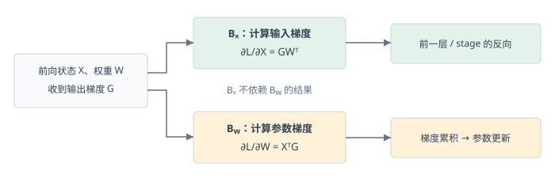{ style="max-width: 720px;" }

*箭头表示数据依赖。图以线性层说明拆分机制；完整 Transformer stage 还需要按算子依赖组织两类反向工作。*

一次 micro-batch 的状态依次变化为：前向保存所需张量 → 收到输出梯度 → 计算并发送输入梯度 → 等待合适时机计算参数梯度 → 释放剩余反向状态。延后 $B_w$ 时，计算它所需的 $X$、$G$ 等数据仍须保留，或按重计算策略重新得到；不能在 $B_x$ 结束后就把全部激活释放。

这种拆分改变的是执行时机，参数梯度依旧要完整累积。本地优化器更新必须使用本轮全部 micro-batch 对本地参数的梯度，并完成必要的数据并行梯度同步。全局梯度范数、NaN/Inf 检查等跨 stage 统计，则还会影响更新能否提前开始；本节后面会介绍 Zero Bubble 对这部分同步的处理。

### 三种调度的激活显存与通信代价

Zero Bubble 需要在“优先推进输入梯度”和“及时计算参数梯度以释放显存”之间选择。作者博客将代表方案分为三种：**ZB1P** 在普通 1F1B 的激活预算内重排任务，**ZB2P** 放宽这项预算，**ZBV（Zero Bubble V）** 则进一步改变模型的层布局。三者都拆分反向，但减少气泡所付出的代价不同。

固定模型、物理 PP 规模、micro-batch 大小和激活保存策略，以**同步、非交错 1F1B** 为基准，作者给出的理想比较如下。这里继续采用 F、输入梯度、参数梯度各耗时 1 的假设，并要求 micro-batch 数足以形成相应调度：

| 方案 | 峰值激活显存 / 1F1B | PP 通信量 / 1F1B | 理想计算调度的气泡与主要代价 |
| --- | --- | --- | --- |
| 非交错 1F1B | 1 倍 | 1 倍 | 保留整段 stage 粒度的启动与排空等待 |
| ZB1P | 约 1 倍 | 1 倍 | 减少气泡但保留残余；需要拆分反向和管理延后的参数梯度任务 |
| ZB2P | 约 2 倍预算 | 1 倍 | 可实现零气泡调度；用更多未释放的激活换取调度空间 |
| ZBV | 约 1 倍 | 约 2 倍 | 可实现零气泡调度；每卡两个 chunk，增加边界通信与调度复杂度 |

表中显存比较的是**各卡峰值中的最大值**，不是逐卡不变，也不是所有卡的显存之和。PP 通信量指 stage 边界的激活与梯度传输，不包含 DP、TP 通信。表中的零气泡还依赖迭代边界的处理，不能直接等同于一次全局同步训练迭代的全部空闲时间为零。[作者博客：三种调度比较](https://sail.sea.com/blog/articles/56)

激活显存由“同一时刻保留多少份状态”与“每份状态占多少字节”共同决定。普通 1F1B 完成一次完整反向后，可以释放对应的本地激活；拆分反向后，输入梯度完成时只能释放不再使用的部分，供参数梯度计算使用的输入和中间梯度还要继续保存。**延后参数梯度会延长部分状态的存活时间，但是否抬高整组设备的最高峰值，还取决于任务顺序和内存预算。** 因此，开启 Zero Bubble 并不必然使峰值激活显存翻倍。

### ZB1P：在原有峰值预算内重排任务

普通 1F1B 的激活存储沿流水线并不均匀：在前面的四卡例子中，S0–S3 的峰值分别为 4、3、2、1 份。ZB1P 可以让下游 stage 多保留一些尚待参数梯度计算的状态，利用这些 stage 相对最高峰值的余量；接近预算上限时，则执行参数梯度以回收显存。这样，下游卡的占用可能增加，但全组最高峰值仍可接近普通 1F1B。

这里的 1P 对应以 $P$ 份完整 stage 的反向保存状态作为预算，其中 $P$ 是物理 PP 规模。它限制了可提前执行的前向以及可积压的参数梯度任务，因此通常仍会留下气泡。[作者实现：内存预算参数](https://github.com/sail-sg/zero-bubble-pipeline-parallelism#zero-bubble-command-line-arguments)

下面三张 Zero Bubble 时间线均包含本地优化器更新 **O**，并延伸到下一迭代开头。O 暂取 1 个时间单位以便显示，不代表实测比例。图采用优化器后置校验通过的理想路径：各卡完成本轮本地梯度后可以先更新，再进入下一轮；后文解释校验与失败回退机制。O 后的 micro-batch 编号重新从 1 开始。

下面用 4 个 stage、6 个 micro-batch 展示 ZB1P 的任务时间线。图中用 X、W 分别简写 $B_x$、$B_w$，F、X、W 各占 1 个时间单位；完整反向的 X+W 合计为 2，与前面的 GPipe / 1F1B 使用相同的耗时比例。只统计本轮 F/X/W，完成时刻从普通 1F1B 的 27 缩短到 21；图右侧随后显示 O 和下一轮任务。

[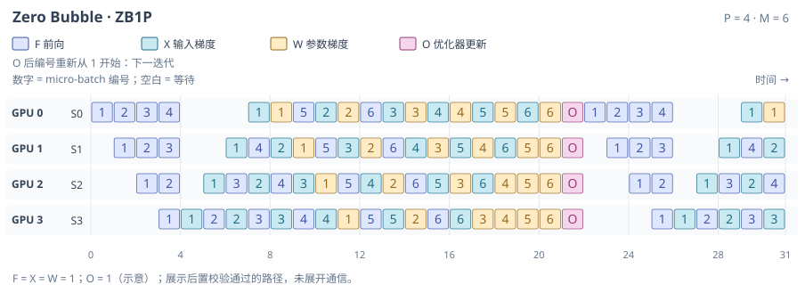{ #timeline-zb style="max-width: 850px;" }](assets/04-pp-timeline-zb.svg)

*蓝色 F 推进前向，青色 X 将梯度传回上游，橙色 W 计算参数梯度，紫红色 O 更新本地参数。各行的 X1 按 S3 → S0 推进，不必等待下游完成 W1。图采用作者调度器的任务顺序，峰值激活预算取 4 份；这个配置的各卡 W 恰好同时结束，O 也对齐，迭代内部仍有气泡。*

### ZB2P：用更高激活预算填补等待

ZB2P 将预算放宽到约 $2P$ 份，使 stage 在预热时能执行更多前向，并把更多参数梯度留到后面填补空档。额外激活来自这些尚未完成反向的 micro-batch，以及已经完成输入梯度、仍等待参数梯度的任务。模型层布局保持不变，所以 PP 边界通信量也保持原来的量级。

下面取 $P=4,M=8$，给每张卡设置 8 份状态的预算；绘图模型保守地将每份状态从 F 一直保留到 W 完成。作者调度器在这一配置下生成的各卡峰值均为 8 份，体现了相对 1F1B 全组最高 4 份的两倍预算：

[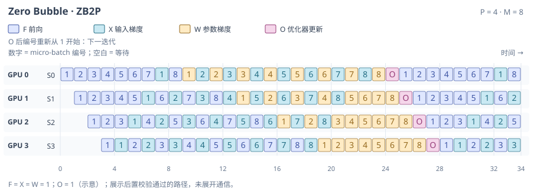{ #timeline-zb2p style="max-width: 850px;" }](assets/04-pp-timeline-zb2p.svg)

*F、X、W 各占 1 个时间单位。GPU0–3 分别在时刻 24、25、26、27 完成本轮最后一个 W，紧接着执行 O，再开始下一轮 F1。因此，各卡的更新与下一轮前向呈阶梯状衔接，无需等到所有卡同时执行 O。图中只展示下一轮的开头；与 ZB1P 图的 micro-batch 数不同，不能直接比较图宽。*

两倍是预算口径，实际用量受 micro-batch 数和算子保存策略影响。论文的手工 ZB-H2 调度在其内存模型中需要 $2P-1$ 份，自动搜索的 ZB-2p 则使用 $2P$ 份预算；两者不应混成每次运行都精确翻倍的结论。若显存不足，可以缩小 micro-batch，但这又可能降低单次算子的执行效率。[论文 §2.3、§5.1 与 §6.1](https://arxiv.org/pdf/2401.10241)

ZBV 通过重新安排层布局，在接近原有最高激活预算的条件下提供更多调度空间。

### ZBV 的层布局与零气泡条件

ZBV 将模型分成 $2P$ 个 chunk：前半段依次放到 rank 0 到 rank $P-1$，后半段按相反的 rank 顺序放置。以同一个 32 层模型为例：

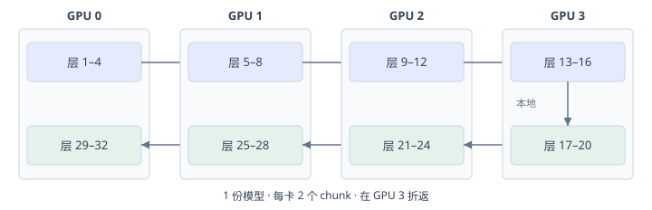{ style="max-width: 760px;" }

*上排为层 1–16，下排沿右到左继续执行层 17–32。GPU3 上的两个 chunk 本地相连；GPU0 同时持有模型首段和尾段。图中的箭头全部表示前向。*

与 VPP 的循环布局相比，模型尾部回到了输入所在的设备：GPU0 持有层 1–4 与 29–32，GPU1 持有层 5–8 与 25–28，依此类推。每张卡仍只持有一份模型中的两段层，并没有复制整个模型。

**V 形布局本身不保证零气泡。** ZBV 在这一布局上安排 F、$B_x$ 和 $B_w$，让两段 chunk 的工作相互填补等待。论文在前向、输入梯度和参数梯度耗时相等的理想模型中，构造了可消除调度气泡、且峰值激活预算与非交错 1F1B 相当的方案；代价是更多 chunk 边界及相应通信。图中一次前向跨卡 6 次，而普通 1F1B 为 3 次。[Zero Bubble 论文 §6](https://arxiv.org/pdf/2401.10241)

ZBV 的激活份数需要按 chunk 大小折算。保持每卡总层数不变，均分后的一个 chunk 只有原 stage 一半的层；在激活存储近似随层数线性增长时，每份 chunk 状态也约为原来的一半。图中的内存模型允许每卡最多保存 8 份 chunk 状态，相当于 4 份完整 stage 状态，仍与四卡 1F1B 的最高峰值一致。模型尾部回到 GPU0 后，GPU0 可以直接开始尾部 chunk 的反向并释放其状态；这不表示首部 chunk 的反向依赖也被跳过。两个 chunk 的任务交替，使激活压力在各卡之间更均衡。[论文 §6：ZBV 的内存分析](https://arxiv.org/pdf/2401.10241)

这项收益主要以通信和实现复杂度为代价：层切细后，边界张量通常不会随 chunk 的层数一起减半，因此跨卡边界翻倍会带来约两倍的 PP 传输量；每张卡还需管理两套 chunk 的激活队列和拆分反向任务。如果额外通信无法被计算覆盖，减少的调度气泡就可能被通信等待抵消。

在论文的理想 ZBV 调度中，任务仍可按生命周期分成三段：预热时积累两个 chunk 所需的前向；稳态时以 F、$B_x$、$B_w$ 为一组安排工作，并在两个 chunk 之间交替；排空时优先推进剩余 $B_x$，再用尚未执行的 $B_w$ 填补等待。组内的前向和反向可属于不同 micro-batch，所有操作仍须满足各自的数据依赖。

将同一张 GPU 上两个 chunk 的任务放在同一行，可以同时观察前后向推进、卡内交错以及迭代之间的连续执行：

[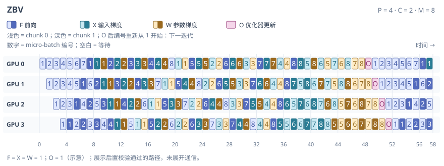{ #timeline-zbv style="max-width: 1100px;" }](assets/04-pp-timeline-zbv.svg)

*取 $P=4,C=2,M=8$，每张 GPU 一行，蓝色 F、青色 X、橙色 W 各占 1 个时间单位。浅色为本卡前半段 chunk 0，深色为后半段 chunk 1，格内数字为 micro-batch 编号；紫红色 O 同时更新本卡两个 chunk 的参数。S0–S7 的放置顺序仍是 GPU0、1、2、3、3、2、1、0，两个 chunk 的任务在同一条时间线上交错。*

图中 GPU0 先执行浅色 F1–F7，再执行深色 F1、X1、W1；其他 GPU 的两个 chunk 也逐渐交替。GPU0–3 分别在时刻 48、49、50、51 完成本轮最后一个 W，随后各自执行 O，再接入下一轮的浅色 F1。每张卡上的 F/X/W → O → 下一轮 F 连续相接，更新的错峰使这个节奏能够跨迭代延续。最左侧的空白是首次启动，最右侧则只是截断了下一轮的后续任务。

### 优化器提前更新与后置校验

较早算完梯度的卡，如果还要等待全局梯度范数才能更新，就会在迭代边界产生气泡。**优化器后置校验（Optimizer Post Validation）**允许先按当前统计结果更新，再用完整结果确认。前提是本轮本地梯度已累积完整，必要的 DP 梯度同步也已完成。

以四卡梯度裁剪为例，范数阈值设为 1，即全局梯度平方和不超过 1 时无需裁剪。S0–S3 的本地平方和分别为 0.1、0.2、0.2、0.1：

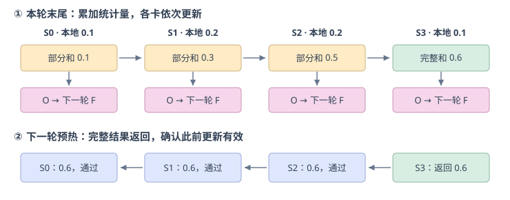{ #optimizer-validation style="max-width: 760px;" }

*箭头表示统计量传递，框的宽度不表示耗时。O 是本轮参数更新，F 是下一轮前向。*

S0 先把 0.1 发给 S1，暂按无需裁剪执行 O，再开始下一轮 F；S1、S2 分别累加到 0.3、0.5 后做同样的事。此时它们都还不知道完整结果。S3 最后得到 0.6，确认无需裁剪；这个结果沿 S3 → S2 → S1 → S0 返回，与下一轮预热交错进行。各卡校验通过，保留此前的更新和已算出的前向结果。[论文 §4](https://arxiv.org/pdf/2401.10241)

若 S3 的本地平方和改为 **0.8**，完整结果就是 **1.3**，需要裁剪。S3 按完整结果更新；S0–S2 收到结果后，回滚此前的参数与优化器状态，用裁剪后的本轮梯度重新更新。受影响的下一轮前向结果作废，使用缓存的同一批输入重新计算。若发现 NaN/Inf，则按溢出规则撤销或跳过本轮更新。[论文附录 C](https://arxiv.org/pdf/2401.10241)、[作者运行时的校验与重跑流程](https://github.com/sail-sg/zero-bubble-pipeline-parallelism/blob/main/megatron/core/pipeline_parallel/zerobubble/runtime.py)

这样，校验通过时各卡可以沿着“本轮 W → O → 下一轮 F”连续执行；校验失败则付出回滚与重跑的代价。前面的零气泡时间线展示的是通过路径，实际吞吐还需计入通信、更新和失败处理。

上述分析主要关注计算任务之间的依赖。在混合专家模型（Mixture of Experts, MoE）中，专家之间的数据交换也可能占据很长时间。要继续提高吞吐，还需要让有用计算覆盖通信；DualPipe 将这种重叠纳入流水线调度设计。

## 07 · DualPipe：双向流水线与计算通信重叠 { #dualpipe }

MoE 模型通常通过专家并行（Expert Parallelism, EP）把专家分布到不同设备。一次 MoE 前向中，token 先通过 **All-to-All（A2A，全互换通信）**发往选中的专家，专家计算后再通过 A2A 返回结果；反向也有相应的数据交换。

这些 A2A 属于层内专家通信，与 PP stage 边界的 P2P 收发是两类操作；DualPipe 的细粒度安排也包含对 PP 边界通信的覆盖。DualPipe 同时考虑流水线气泡与这些通信开销，包含两个相互配合的设计：跨设备的双向流水线，以及设备内更细粒度的前后向任务安排。[DeepSeek-V3 技术报告 §3.2.1](https://arxiv.org/html/2412.19437v2#S3.SS2.SSS1)

### 双向流水线的模型放置

原始 DualPipe 在同一组设备上放置两个方向相反的流水线副本：一部分 micro-batch 从 rank 0 进入，另一部分从 rank $P-1$ 进入。两个方向中的每个 micro-batch 都按模型层序执行完整前向，然后沿各自路径反向。

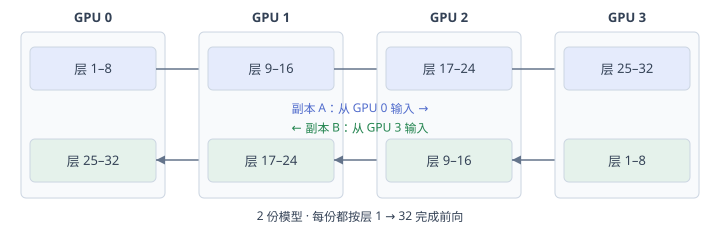{ style="max-width: 760px;" }

*每列是一张 GPU。上下两行是同一模型的两个副本，均按层 1–32 完成前向；箭头方向表示设备访问顺序。图中未画反向。*

例如 GPU0 同时持有副本 A 的层 1–8，以及副本 B 的层 25–32。原始 DualPipe 因此需要两份模型参数分布在这组 PP 设备上；训练时，对应副本的参数梯度还需正确聚合，以保持参数一致。它与 VPP“把同一份模型切成更多段”的存储口径不同。

从两端输入数据，为每张卡提供了来自两个方向的任务。调度器可以安排一个 micro-batch 的前向与另一个 micro-batch 的反向配对执行，改善启动、稳态和排空阶段的任务供给；在部分启动和排空步骤中，还会拆分输入梯度与参数梯度计算，优先传回输入梯度来减少上游等待。具体执行顺序可对照官方实现中的预热、稳态和排空步骤。[DualPipe 调度源码](https://github.com/deepseek-ai/DualPipe/blob/main/dualpipe/dualpipe.py)

双向输入与前后向配对在完整时间线上表现如下：

[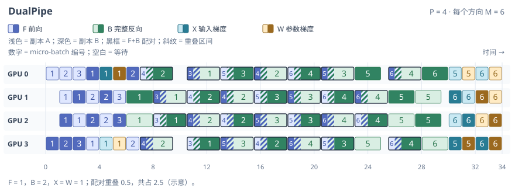{ #timeline-dualpipe style="max-width: 1100px;" }](assets/04-pp-timeline-dualpipe.svg)

*取 4 个 PP rank，每个方向各 6 个 micro-batch，每张 GPU 一行。浅色为从 GPU0 向 GPU3 的副本 A，深色为反向放置的副本 B；数字是各副本内的 micro-batch 编号。蓝色 F、绿色 B 表示前向与完整反向，青色 X、橙色 W 表示拆开的输入梯度与参数梯度。黑框是同一卡的 F+B 配对，斜纹区表示二者重叠的时间。*

沿两端的 F1 可以同时看到两个方向的输入推进。进入稳态后，同一卡上一个方向的前向与另一个方向的反向被配成一组。本图按官方实现的计算任务顺序重建，单独 F 耗时 1，完整 B 耗时 2，X、W 各耗时 1。黑框内从左到右是 F 独占、F+B 重叠、B 独占三个区间，分别占 0.5、0.5、1.5 个单位；左、右数字分别属于 F、B，整组共占 2.5 个单位。这是绘图假设，不是实测性能；实际重叠发生在任务内部的算子与通信之间。图中没有展开 P2P 收发事件。

图中 GPU3 开头的浅色 X1、W1 虽然相邻，二者之间仍有重要的依赖边界：X1 完成后就能向 GPU2 发送输入梯度，GPU2 收到后可以开始浅色 B1，而 GPU3 继续执行 W1。两块合起来仍是同一 micro-batch 在本 stage 的完整反向，但上游不必等到它们全部结束。GPU0 的深色 X1、W1 与 GPU1 之间也有对称关系；图中忽略了通信耗时，因此上游 B1 与本卡 W1 的起点对齐。

### 前后向任务中的计算通信重叠

上面的时间线把一个前向与另一个反向配成一组，设备内部还需要进一步安排它们的执行顺序。以 MoE 的专家 MLP 为例，前向必须等 A2A 把 token 送到专家后才能计算；反向算出的专家输入梯度，也要经过 A2A 回传，前面的 Attention 才能继续反向。这些等待为另一任务的计算提供了重叠机会。

为了尽早推进反向，DualPipe 将 Attention 和 MLP 的反向拆成输入梯度计算 **dX** 和参数梯度计算 **dW**，分别对应前文的 $B_x$、$B_w$。其中，MLP 之后的反向 A2A 回传的是专家输入梯度，因此只要 MLP 的 dX 完成，就具备了发起通信的数据条件；dW 可以在通信期间继续执行。

下面以同一张 GPU 上的两个 micro-batch 为例：$i$ 执行前向，$j$ 执行反向，且 $j$ 所需的前向状态仍然保留。图的上半部分先列出各自经过 Attention、专家 MLP 和两次 A2A 的路径，下半部分再把它们排到同一条时间轴上。

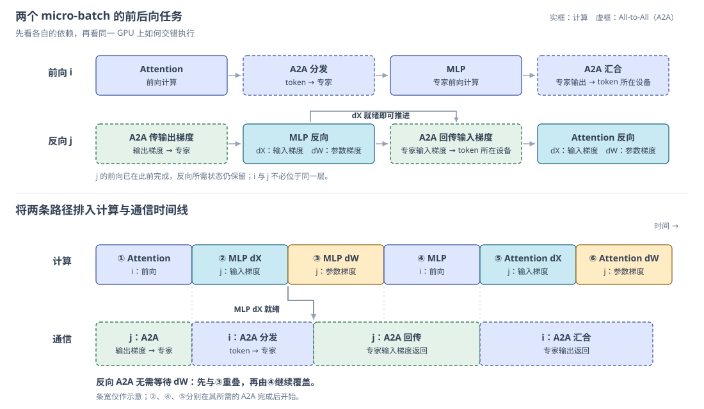{ style="max-width: 1100px;" }

*依据 [DeepSeek-V3 报告图 4](https://arxiv.org/html/2412.19437v2#S3.F4) 的重叠思路，补全一对任务的 Attention、MLP 与 A2A 主链。下半图是一种满足依赖的示意排程，条宽不代表实测耗时；省略归一化、路由等细节和 PP 边界通信。*

图中先计算 $i$ 的前向 Attention（①），同时通过 A2A 把 $j$ 的输出梯度送到专家。两项工作完成后，发起 $i$ 的 token 分发，并计算 $j$ 的 MLP dX（②）。当 dX 就绪、通信资源可用时，就能回传 $j$ 的专家输入梯度；GPU 则继续计算它的 MLP dW（③）。反向通信因此可以在完整 MLP 反向结束前开始。

dW 算完后，若 $i$ 的 token 已分发完成，就切到它的前向 MLP（④），继续覆盖 $j$ 尚未结束的梯度回传。随后，$i$ 通过 A2A 汇合专家输出，$j$ 在输入梯度收齐后执行 Attention 的 dX、dW（⑤、⑥），再次用反向计算覆盖前向通信。这样，一对任务在各自依赖满足时交替推进；实际能覆盖多少通信，取决于计算、通信的耗时和资源竞争。

上述重叠机制来自技术报告；[官方开源示例](https://github.com/deepseek-ai/DualPipe/blob/main/examples/example_dualpipe.py#L49-L77) 提供前后向配对接口，模型内部的 MoE A2A 重叠仍需自行实现。

### DualPipeV 与 ZBV 的关系

原始 DualPipe 的两个参数副本增加了模型状态存储。官方仓库还提供了采用 V 形布局的变体 **DualPipeV**，以降低这一开销。

DualPipeV 将一份模型分为 $2P$ 段，每张卡持有两个 chunk，沿与前面 ZBV 示意图相同的 V 形路径连接：从 rank 0 出发，在最后一个 rank 折返，回到 rank 0 完成输出。它保留了前后向配对与通信计算重叠的安排，并去除了原始 DualPipe 的第二份模型参数副本。[DualPipeV 官方说明](https://github.com/deepseek-ai/DualPipe)、[DualPipeV 调度源码](https://github.com/deepseek-ai/DualPipe/blob/main/dualpipe/dualpipev.py)

同样用每张 GPU 一行的时间线，可以看到 DualPipeV 的前后向如何沿一份模型折返，并在同一卡的两个 chunk 之间配对：

[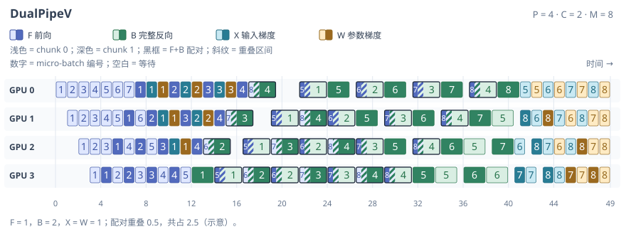{ #timeline-dualpipev style="max-width: 1150px;" }](assets/04-pp-timeline-dualpipev.svg)

*取 $P=4,C=2,M=8$，每张 GPU 一行，S0–S7 的位置与 ZBV 图一致。浅色为本卡 chunk 0，深色为 chunk 1；黑框与斜纹表示两个 chunk 的 F、B 配对及其重叠区间。任务顺序来自官方 DualPipeV 实现，耗时假设与上面的 DualPipe 图一致。两图的总 micro-batch 数不同，不能按图宽直接比较吞吐。*

因此，ZBV 和 DualPipeV 可以采用相同的层放置方式，但调度关注点不同：ZBV 重点利用输入梯度与参数梯度的依赖差异压缩气泡；DualPipeV 还需要把前后向任务中的通信与计算细分并配对。在比较它们时，应分别检查层布局、任务顺序、算子重叠实现和显存预算，不能只凭图形都是 V 形判断调度相同。

## 08 · 方案比较与总结 { #compare }

五类方案可以按各自主要改变的对象来比较：

| 方案 | 主要机制 | 主要收益 | 需要关注的代价 |
| --- | --- | --- | --- |
| GPipe | 全部 micro-batch 前向后再反向 | 建立跨 micro-batch 的流水线 | 保存较多激活，启动与排空等待 |
| 非交错 1F1B | 稳态交替前向与反向 | 更早释放激活 | 普通 stage 粒度的气泡仍在 |
| VPP / Interleaved 1F1B | 每卡多个 chunk，交错执行 | 缩短理想气泡时间 | 边界通信增多，调度与激活管理更复杂 |
| Zero Bubble / ZBV | 拆分输入梯度与参数梯度；ZBV 结合 V 形布局 | 用可延后的工作填补空闲 | ZB1P 保留残余气泡；ZB2P 提高激活预算；ZBV 增加 PP 通信 |
| DualPipe / DualPipeV | 前后向任务配对，结合输入梯度与参数梯度拆分安排通信计算重叠 | 同时降低气泡与暴露的通信时间 | 定制算子实现；原始 DualPipe 还有参数副本开销 |

这些方案分别改变了层的放置、任务的先后顺序，以及通信与计算的执行窗口。比较时应固定模型、设备数与全局 batch，再同时观察迭代时长、峰值激活和通信量：较小的理论气泡不一定带来更短的实际迭代，延后反向工作也可能延长激活的存活时间。

Megatron 对这些调度思路的具体实现，以及 P2P、MoE 通信重叠等优化，见 [5.2 · Megatron 性能优化](04-pp-megatron.md)。

!!! tip "自测"

    1. 为什么 GPipe 和普通 1F1B 可以有相同的理想气泡比例，却有不同的峰值激活存储？
    2. 4 张卡、每卡 2 个 chunk 时，VPP 与 ZBV 的层放置和跨卡路径有什么区别？
    3. 为什么输入梯度应尽早计算，而参数梯度可以延后？ZB1P、ZB2P、ZBV 相对普通 1F1B 的激活显存与 PP 通信代价分别怎样变化？
    4. 为什么 V 形布局与“零气泡”不是同一个条件？
    5. DualPipe 覆盖的 MoE A2A 与 PP 边界 P2P 分别发生在哪里？
    6. 原始 DualPipe 与 DualPipeV 的参数存储有什么区别？
