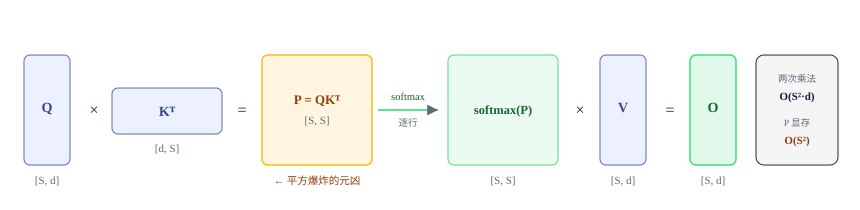
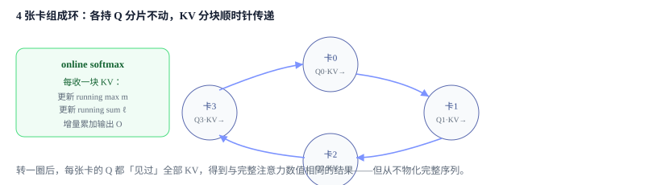
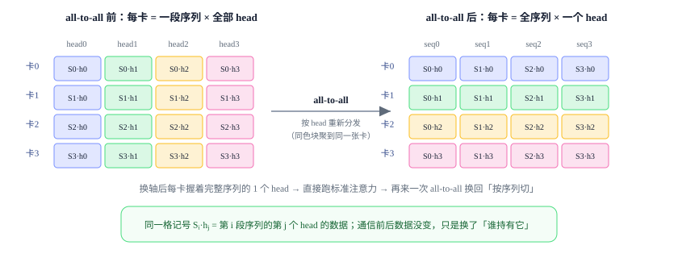
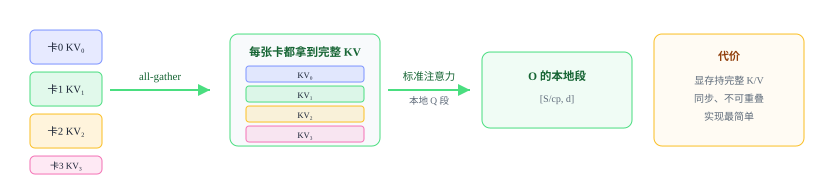

# 上下文并行 CP：把超长序列切到多卡

<div class="notebook-hero" markdown>

<span class="chapter-kicker">Module 5 · 上下文并行</span>

序列长到几十万 token，注意力的激活单卡就装不下了。CP 沿序列维把它切开——难点在于注意力需要**全局的 K/V**，于是有了 Ring Attention 与 Ulysses 两条路线。

**本章关键词：** 📜 切序列维 · 💍 Ring Attention + online softmax · 🔀 Ulysses all-to-all · ⚖️ zigzag 负载均衡

</div>


## 01 · 动机：长序列的激活墙 { #why }


### 先看清注意力到底在算什么

一层自注意力（单个 head，忽略 batch）拿到三个矩阵 $Q,K,V$，形状都是 `[S, d]`——$S$ 是序列长度，$d$ 是每个 token 的向量维度。它算两次矩阵乘：先 $Q$ 和 $K^\top$ 相乘得到**分数矩阵** $P=QK^\top$，形状 `[S, S]`（每一对 token 之间一个数）；对 $P$ 逐行做 softmax，再乘 $V$ 得到输出 `[S, d]`：




*单 head 注意力的两次矩阵乘。真实模型有 $H$ 个 head、batch $B$，形状是 `[B, H, S, d]`，计算量 $O(B\,H\,S^2 d)$，中间分数矩阵 $P$ 占显存 $O(B\,H\,S^2)$。*


要命的就是中间那个 `[S, S]` 的分数矩阵 $P$：它随序列长度**平方增长**。$S$ 从 4K 涨到 128K（×32），$P$ 就膨胀 **1024 倍**。计算量 $O(S^2 d)$、激活显存 $O(S^2)$——这就是长序列训练撞上的**激活墙**：哪怕模型权重本身放得下，单卡也存不下这么长序列的注意力激活。


!!! note "📐 记住三个形状"

    $Q,K,V$ 是 `[S, d]`（线性增长），分数矩阵 $P=QK^\top$ 是 `[S, S]`（**平方增长**），输出 $O$ 回到 `[S, d]`。CP 要对付的正是那个平方项。


### CP 的思路：沿序列维把它切开

上下文并行（Context Parallel, CP）的做法：把序列沿长度维切成 $S/\text{cp}$ 段，每张卡只处理自己那一段。这样每卡的分数矩阵只有 `[S/cp, S]`（甚至配合切分只需局部块），激活显存立刻降下来。其它层（MLP、LayerNorm）逐 token 独立，切了就切了；**唯一的麻烦是注意力**——它要让每个 query 看到*全部* key/value（分母要对**整行** $S$ 个 key 求和），而 K/V 现在分散在各张卡上。


## 02 · 难点：注意力需要全局 K/V { #problem }

每张卡持有自己那段的 Q、K、V。query 段在卡 $i$ 上，但它要 attend 的 key/value 跨越**所有**卡。所以必须跨卡通信，把别人的 K/V 拿过来（或把自己的 Q 送过去）。怎么通信、怎么在不把完整序列 materialize 的前提下算出正确的 softmax，就是 CP 的全部技术内容。


## 03 · 三条路线：Ring / Ulysses / all-gather { #routes }

拿到全局 K/V 有三种做法：**一跳一跳传**（Ring）、**换一根轴切**（Ulysses）、**算前一次性凑齐**（all-gather）。Megatron 的配置项 `cp_comm_type` 把它们列得清清楚楚，可以直接当地图看：


**Megatron-LM · transformer/transformer_config.py:869（cp_comm_type docstring）**


```python
"""Inter-gpu communication type for context parallelism.
"p2p":       环形拓扑里用 P2P 交换 KV 分块；异步，可与注意力计算重叠。
"all_gather": 算注意力前 all-gather 拿到完整 KV；同步，不可重叠。
"a2a":       类似 DeepSpeed Ulysses，用 all-to-all 把注意力头散到 CP 组，再聚合得到完整序列 QKV。
"a2a+p2p":   分层实现：低层 CP 组（NVLink）用 a2a，高层组（IB）用 p2p。"""
```


### 路线 A：Ring Attention（环形 P2P + online softmax）

每张卡保留自己的 Q 分片，把 K/V 分块在 CP 环上**一跳一跳地 P2P 传递**：每收到一块 K/V 就算一次局部注意力，用 *online softmax*（维护 running max 和 running sum）把多块结果增量合并成正确的全局 softmax——全程不需要把完整序列拼出来。P2P 是异步的，可以和计算重叠。




*Ring Attention：Q 不动、KV 绕环 P2P，online softmax 把每一跳的局部结果增量合并成全局结果。*


💡 Colossal-AI 早期论文里的「Ring Self-Attention（RSA）」就是这条路线；下面用公式说明为什么绕环累加能和一次性算全序列**数值完全相等**。


#### 为什么 softmax 能「分块累加」——公式推导

取某一个 query 向量 $q$，标准注意力要它和**全序列**的 $S$ 个 key/value 做：

$$ o \;=\; \sum_{j=1}^{S} \frac{e^{q\cdot k_j}}{\sum_{l=1}^{S} e^{q\cdot k_l}}\, v_j $$

麻烦在分母 $\sum_l e^{q\cdot k_l}$——它要**看到所有 key** 才能算出。而 CP 下每卡只有 $S/\text{cp}$ 段 KV，凑不齐这个全局分母。

但把序列切成若干块 $B_b$，为每块定义**局部分子 $p_b$、局部分母 $\ell_b$**：

$$ \ell_b=\!\!\sum_{j\in B_b}\!\! e^{q\cdot k_j},\qquad p_b=\!\!\sum_{j\in B_b}\!\! e^{q\cdot k_j}\,v_j
\;\;\Longrightarrow\;\; o=\frac{\sum_b p_b}{\sum_b \ell_b} $$


!!! tip "🔑 关键洞察"

    分子 $\sum_b p_b$ 和分母 $\sum_b \ell_b$ 都是**可加的**。所以不必同时拥有全部 KV——*每来一块就把这块的 $p_b,\ell_b$ 累加进去*，转完一圈再一除即可。「每个 Q 看全序列」不是同时拥有，而是逐块累加。


直接算 $e^{q\cdot k_j}$ 会数值溢出，实际要减最大值 $m$。但每来一块，全局最大值会变大，旧的累加结果得**追溯修正**。于是维护三个 running 量:最大值 $m$、分母 $\ell$、输出 $o$。来了新块 $B_b$，先算这块自己的局部量:

$$ m_{\text{blk}}=\max_{j\in B_b}(q\cdot k_j),\quad
\ell_{\text{blk}}=\!\!\sum_{j\in B_b}\!\! e^{q\cdot k_j-m_{\text{blk}}},\quad
o_{\text{blk}}=\!\!\sum_{j\in B_b}\!\! e^{q\cdot k_j-m_{\text{blk}}}v_j $$

再更新全局最大值，并给**新旧两边**各乘上修正因子（这就是 online softmax / FlashAttention 的核心递推）：

$$ m_{\text{new}}=\max(m,m_{\text{blk}}) $$
$$ \ell \leftarrow e^{\,m-m_{\text{new}}}\,\ell + e^{\,m_{\text{blk}}-m_{\text{new}}}\,\ell_{\text{blk}},\qquad
o \leftarrow e^{\,m-m_{\text{new}}}\,o + e^{\,m_{\text{blk}}-m_{\text{new}}}\,o_{\text{blk}} $$

其中 $e^{\,m-m_{\text{new}}}$ 是因为基准从旧 $m$ 换成更大的 $m_{\text{new}}$、之前的指数项「多减了」，要乘回来补偿。全部块处理完，最终输出 $o_{\text{final}}=o/\ell$，与标准注意力**完全等价，无任何近似**。

**套到环上**：cp 张卡围成环，本地 **Q 不动**，**K/V 绕环传**。执行 cp 步，第 $t$ 步用本地 Q 和「这一步收到的那块 KV」算一次局部注意力、按上面递推更新 $(m,\ell,o)$，同时把 KV 发给下游（通信与计算重叠）。转满一圈，每张卡的 Q 就依次见过全部 KV，$(m,\ell,o)$ 累加完整。省显存正是因为**任一时刻每卡只握着 $1/\text{cp}$ 的 KV**。


### 路线 B：Ulysses（all-to-all 换轴）

Ring 是「序列一直切着、靠传 KV 补齐」；Ulysses（DeepSpeed 提出）反过来——**一进注意力就换一根轴切**。非注意力部分照常按序列切 `[B, S/cp, H]`，但注意力前用一次 `all-to-all` 把切分维从*序列*换成*注意力头*，变成 `[B, S, H/cp]`：每卡换到**完整序列、但只算 1/cp 的 head**。

关键是搞懂这一次 `all-to-all` 到底搬了什么。以 **4 张卡、4 个 head** 为例：换轴前，卡 $i$ 手里是**第 $i$ 段序列的全部 4 个 head**；all-to-all 后，卡 $j$ 手里变成**全部 4 段序列、但只有第 $j$ 个 head**。本质是一次「分块转置」——把本地张量沿 head 维切成 4 块，第 $j$ 块发给卡 $j$，同时从每张卡各收一块：




*4 张卡的 all-to-all：左边每张卡拿一段序列的全部 head（每行彩虹色）；一次 all-to-all 把同色块聚到同一张卡，右边每张卡拿全序列的一个 head（每行单色）。这就是「序列切 ↔ head 切」的换轴。*


因为每卡拿到了整条序列，**注意力就是普通的标准算子，不用 online softmax、不用改 kernel**。通信只有两次 all-to-all（进注意力换成 head 切、出注意力换回序列切），量小且随 cp 增大每卡通信量还下降。代价是**并行度被 head 数卡死**：head 要能均分到各卡，所以 $\text{cp}\le\text{head 数}$（GQA 下受更少的 KV-head 数限制）。head 少时 CP 度就上不去。


### 路线 C：all-gather（算前一次性凑齐全 KV）

最直白的一条路：Q 仍然按序列切、留在本地，但在进注意力**之前先做一次 `all-gather`**，把各卡的 K/V 分片拼成**完整的 K/V**。于是每卡手里是「本地 `[S/cp]` 的 Q + 完整 `[S]` 的 K/V」，直接跑一次标准注意力（每张卡只算自己那段 query 的输出）即可——不用环形传递、也不用 online softmax。




*all-gather：进注意力前把 4 张卡的 K/V 分片拼成完整 K/V，人人一份；Q 仍是本地那段，跑一次普通注意力算出本地输出段。*


好处是**实现最简单**——不改注意力 kernel、逻辑上就是「先凑齐再照常算」。缺点也明显：K/V 要在每张卡上**物化成完整长度**，把「省 K/V 显存」这个收益让掉了一大半（只剩省 Q 和注意力中间激活）；而且 all-gather 是**同步**的，通信和计算难以重叠。它更适合序列没那么极端、图省事的场景，或作为对拍其它路线正确性的 baseline。


### 三条路线怎么选

| 维度 | Ring（p2p） | Ulysses（a2a） | all-gather |
| --- | --- | --- | --- |
| 注意力时切哪一维 | **序列 sequence** | **注意力头 head** | Q 切序列，K/V 不切（凑齐） |
| 通信原语 | Ring P2P 逐块传 KV | 前后两次 all-to-all | 算前一次 all-gather |
| 并行度上限 | 基本不受限，可切超长 | **≤ head 数**（GQA 看 KV-head） | 基本不受限 |
| 通信量 | 随序列 $S$ 增长 | 小，且随 cp 增大每卡下降 | 随 $S$ 增长（一次拉全 KV） |
| 能否重叠 | P2P 异步，可与计算重叠 | a2a 前后同步 | **同步，不可重叠** |
| 注意力算子 | 需 online-softmax 分块实现 | 标准算子，不用改 | 标准算子，不用改 |
| causal 负载均衡 | 需 zigzag 重排（见下节） | 天然均衡 | 需 zigzag（Q 段负载不均） |
| attention 期间每卡 K/V 显存 | 只持 $1/\text{cp}$ | 持完整序列、$1/\text{cp}$ 的 head | **持完整 K/V**（收益打折） |


!!! note "🧩 现实里常两者结合"

    因为各有短板，业界（如 **USP / Unified Sequence Parallelism**，Megatron 的 `a2a+p2p` 也是这个思路）把二者组成 2D：**内层 Ulysses** 用 a2a 吃满 head 数，**外层 Ring** 用 p2p 沿序列继续放大并行度——既绕开 Ulysses 的 head 上限，又比纯 Ring 省一部分通信。


| 路线 | 怎么传 | 特点 |
| --- | --- | --- |
| `p2p` Ring | KV 绕环 P2P | 异步、可重叠；通用 |
| `a2a` Ulysses | all-to-all 转置 head/seq | 通信省；需 head≥cp |
| `all_gather` | 算前 all-gather 全 KV | 同步、不可重叠；实现简单 |
| `a2a+p2p` | 组内 a2a + 组间 p2p | 分层，适配 NVLink+IB |


## 04 · zigzag：causal mask 下的负载均衡 { #balance }

因果掩码下，序列**尾部**的 token 要 attend 前面所有 token，计算量大；**头部**的 token 几乎不用算。如果按顺序简单切（卡0拿前 1/N、卡N-1拿后 1/N），最后一张卡会忙死、第一张卡闲死。

解法叫 **zigzag（首尾配对）**：把序列切成 $2\cdot\text{cp}$ 块，第 $i$ 张卡取第 $i$ 块和第 $(2\text{cp}-1-i)$ 块——一头一尾配一对，各卡总计算量就均衡了。Megatron 在取 batch 时显式这么做：


**Megatron-LM · core/utils.py:2007（get_batch_on_this_cp_rank）**


```python
val = val.view(*val.shape[0:seq_dim], 2 * cp_size, val.shape[seq_dim] // (2 * cp_size), ...)
index = torch.zeros(2, dtype=torch.int64, device=val.device)
index[0].fill_(cp_rank)                    # 第 i 块
index[1].fill_(2 * cp_size - cp_rank - 1)  # 对称的第 (2cp-1-i) 块
val = val.index_select(seq_dim, index)     # 一头一尾配对，负载均衡
```


## 05 · 实现：核心算法委托给 TransformerEngine { #impl }


!!! warning "📝 诚实说明（很重要）"

    CP 的核心算法（online softmax + 环形 P2P）在 Megatron-LM 里**不是自己写的**：Megatron 把 ring attention 完全委托给 **TransformerEngine**。原生注意力直接 `assert context_parallel_size == 1`，CP 只能走 TE，Megatron 本体只负责 zigzag 切分与把 CP group/comm\_type 透传进去。


Megatron 把 CP group/comm\_type 透传给 TE 的注意力构造：


**Megatron-LM · core/transformer/dot_product_attention.py:57 + extensions/transformer_engine.py:1440**


```python
# 原生注意力不支持 CP，强制走 TE
assert self.config.context_parallel_size == 1, "Context parallelism is only supported by TEDotProductAttention!"
# TE 路径：把 cp_group / cp_comm_type 透传给 TransformerEngine 的注意力
if self.config.context_parallel_size > 1:
    extra_kwargs["cp_group"] = pg_collection.cp
    extra_kwargs["cp_comm_type"] = cp_comm_type   # "p2p" / "a2a" / ...
```


## 06 · 辨析：CP 与 SP（M3 的序列并行）不是一回事 { #vs-sp }

两者都「沿序列切」，但目的和位置完全不同，而且可以叠加：

|  | SP（M3 的序列并行） | CP（本章） |
| --- | --- | --- |
| 绑定关系 | 绑定 TP，TP=1 时强制关闭 | 独立的 process group，与 TP 正交 |
| 切的是 | LayerNorm/Dropout 区的激活 | 整个注意力的序列维 |
| 对注意力 | **不**参与注意力计算的切分 | 核心就是切注意力、跨卡传 KV |
| 本质 | 把 TP 的 all-reduce 改写成 AG+RS | Ring/Ulysses + online softmax |


## 07 · 启用 { #compare }


#### Megatron-LM 委托 TransformerEngine

- `--context-parallel-size N`
- `--cp-comm-type p2p|a2a|allgather|a2a+p2p`
- `get_batch_on_this_cp_rank` 做 zigzag 切分
- 约束：EP 与 CP 不能同时 >1（见 M7）


!!! tip "✅ 学完自测"

    1. 序列切开后，为什么注意力不能各算各的？需要传什么？
    2. online softmax 解决了什么问题？为什么 Ring Attention 不用物化完整序列？
    3. 为什么 causal mask 下要 zigzag 切分？简单顺序切会怎样？
    4. CP 和 M3 的 SP 都「切序列」，本质区别是什么？
