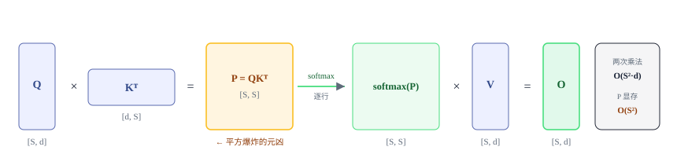
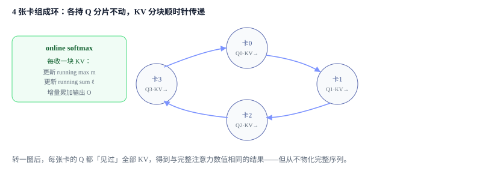
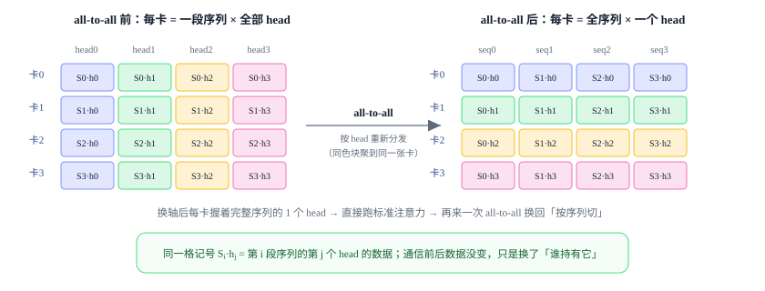
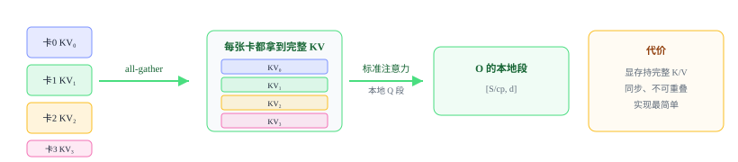

# Context Parallel：沿序列维切分注意力

<div class="notebook-hero" markdown>

<span class="chapter-kicker">第 6 章 · Context Parallel</span>

上下文并行（Context Parallel, CP）沿序列维把 Q、K、V 与注意力计算分到多个 rank。每段 query 仍需访问全局 K/V，因此实现必须选择 Ring、Ulysses、All-Gather 或它们的分层组合来交换数据。

**本章关键词：** 📜 切序列维 · 💍 Ring Attention + online softmax · 🔀 Ulysses all-to-all · ⚖️ zigzag 负载均衡

</div>


## 00 · 快速查找：方案、通信量与高频问题 { #quick-reference }

设 CP 并行度为 $C$，一份本地 Q、K、V 或 O 的大小为 $L=B(S/C)Ndw$。下表统计等宽 MHA 前向阶段的**每 rank 理想发送量**；不重复计算接收量，也不包含反向。

| 路线 | 核心做法 | 每 rank 发送量 | 优点 | 局限 |
| --- | --- | ---: | --- | --- |
| Ring | Q 留在本地，K/V 绕环 | $2(C-1)L$ | 省 K/V 显存、可重叠、无 head 上限 | 需要 online softmax；causal 需 zigzag |
| Ulysses | 序列分片换成 head 分片 | $4(C-1)L/C$ | 通信较少、计算均衡、可用标准注意力 | 受 head 整除与 all-to-all 性能约束 |
| All-Gather | 每 rank 聚合完整 K/V | $2(C-1)L$ | 最简单、无 head 上限 | 完整 K/V 占显存；重叠少；causal 仍不均衡 |
| `a2a+p2p` | 组内 Ulysses，组间 Ring | $4(U-1)L/U+2(R-1)L$ | 适配分层网络，扩展性更强 | 实现和调优复杂 |

混合路线中 $C=UR$，$U$ 为内层 Ulysses 组大小，$R$ 为外层 Ring 组大小；GQA/MQA 应按 Q 与 K/V 的实际大小重算。


### 高频面试问题

1. FlashAttention 不物化完整 $[S,S]$，为什么还需要 CP？
2. CP 和 SP 都沿序列切，核心区别是什么？
3. Ring、Ulysses、All-Gather 与混合路线应该如何选择？
4. Ring 为什么需要 online softmax，它如何保证数值等价？
5. Ulysses 的 all-to-all 和 All-Gather 通信量是否相同？
6. Ulysses 为什么受 attention head 数限制，GQA/MQA 又会带来什么约束？
7. causal attention 为什么负载不均衡，All-Gather 是否也有这个问题？
8. Zigzag 如何放置 Q/K/V，并如何平衡 Ring 每一轮的计算？


## 01 · 长序列的核心问题：计算、激活与全局依赖 { #why }

自注意力中，每个 query 都要与全序列的 key 交互。单个 head 的数学关系为 $Q,K,V\in\mathbb{R}^{S\times d}$、$P=QK^\top\in\mathbb{R}^{S\times S}$、$O=\operatorname{softmax}(P)V$：




*逻辑上存在 $[S,S]$ 的注意力关系，但 FlashAttention 等分块内核不会让完整分数矩阵常驻 HBM。*

| 长序列压力 | 随序列长度的变化 |
| --- | --- |
| 注意力计算 | query-key 配对数为 $O(S^2)$ |
| 序列激活 | Q/K/V、输出与反向保存量为 $O(S)$ |
| 数据依赖 | 每段 Q 仍需访问全局 K/V |

CP 将 `[B,S,N,d]` 沿序列切成每 rank 的 `[B,S/C,N,d]`，从而分摊序列激活和 query 行对应的计算。但各 rank 不能独立完成注意力：本地 Q 只有本地 K/V，而正确输出依赖全局 K/V。CP 的核心问题因此是：**如何让本地 Q 访问全局 K/V，同时控制通信量、峰值显存和同步等待。**


## 02 · K/V 交换路线：Ring、Ulysses、All-Gather 与混合方案 { #routes }

四条路线分别选择逐块环传、切换分片轴、完整聚合，或把前两者组成二维通信。Megatron 的配置项 `cp_comm_type` 可以直接当作路线图：


**Megatron-LM · transformer/transformer_config.py:869（cp_comm_type docstring）**


```python
"""Inter-gpu communication type for context parallelism.
"p2p":       环形拓扑里用 P2P 交换 KV 分块；异步，可与注意力计算重叠。
"all_gather": 算注意力前 all-gather 拿到完整 KV；同步，不可重叠。
"a2a":       类似 DeepSpeed Ulysses，用 all-to-all 把注意力头散到 CP 组，再聚合得到完整序列 QKV。
"a2a+p2p":   分层实现：低层 CP 组（NVLink）用 a2a，高层组（IB）用 p2p。"""
```


### 路线 A：Ring Attention（环形 P2P）

每张卡保留自己的 Q 分片，把 K/V 分块在 CP 环上**一跳一跳地 P2P 传递**：每收到一块 K/V 就算一次局部注意力，并维护 running max 和 running sum，把多块结果增量合并成正确的全局 softmax。这种分块递推称为 **online softmax**。它不需要把完整序列拼出来，异步 P2P 还可以与当前块的注意力计算重叠。




*Ring Attention：Q 不动、KV 绕环 P2P，online softmax 把每一跳的局部结果增量合并成全局结果。*


💡 Colossal-AI 早期论文里的「Ring Self-Attention（RSA）」就是这条路线；下面用公式说明为什么绕环累加能和一次性算全序列**数值完全相等**。


#### Online softmax 的分块递推

取某一个 query 向量 $q$，标准注意力要它和**全序列**的 $S$ 个 key/value 做：

$$ o \;=\; \sum_{j=1}^{S} \frac{e^{q\cdot k_j}}{\sum_{l=1}^{S} e^{q\cdot k_l}}\, v_j $$

麻烦在分母 $\sum_l e^{q\cdot k_l}$——它要**看到所有 key** 才能算出。而 CP 下每卡只有 $S/\text{cp}$ 段 KV，凑不齐这个全局分母。

但把序列切成若干块 $B_b$，为每块定义**局部分子 $p_b$、局部分母 $\ell_b$**：

$$ \ell_b=\!\!\sum_{j\in B_b}\!\! e^{q\cdot k_j},\qquad p_b=\!\!\sum_{j\in B_b}\!\! e^{q\cdot k_j}\,v_j
\;\;\Longrightarrow\;\; o=\frac{\sum_b p_b}{\sum_b \ell_b} $$


!!! tip "🔑 关键洞察"

    分子 $\sum_b p_b$ 和分母 $\sum_b \ell_b$ 都是**可加的**。所以不必同时拥有全部 KV——*每来一块就把这块的 $p_b,\ell_b$ 累加进去*，转完一圈再一除即可。「每个 Q 看全序列」不是同时拥有，而是逐块累加。


直接算 $e^{q\cdot k_j}$ 会数值溢出，实际要减最大值 $m$。但每来一块，全局最大值会变大，旧的累加结果得**追溯修正**。于是维护三个 running 量:最大值 $m$、分母 $\ell$、输出 $o$。来了新块 $B_b$，先算这块自己的局部量:

$$ m_{\text{blk}}=\max_{j\in B_b}(q\cdot k_j),\quad
\ell_{\text{blk}}=\!\!\sum_{j\in B_b}\!\! e^{q\cdot k_j-m_{\text{blk}}},\quad
o_{\text{blk}}=\!\!\sum_{j\in B_b}\!\! e^{q\cdot k_j-m_{\text{blk}}}v_j $$

再更新全局最大值，并给**新旧两边**各乘上修正因子（这就是 online softmax / FlashAttention 的核心递推）：

$$ m_{\text{new}}=\max(m,m_{\text{blk}}) $$
$$ \ell \leftarrow e^{\,m-m_{\text{new}}}\,\ell + e^{\,m_{\text{blk}}-m_{\text{new}}}\,\ell_{\text{blk}},\qquad
o \leftarrow e^{\,m-m_{\text{new}}}\,o + e^{\,m_{\text{blk}}-m_{\text{new}}}\,o_{\text{blk}} $$

其中 $e^{\,m-m_{\text{new}}}$ 是因为基准从旧 $m$ 换成更大的 $m_{\text{new}}$、之前的指数项「多减了」，要乘回来补偿。全部块处理完，最终输出 $o_{\text{final}}=o/\ell$，与标准注意力**完全等价，无任何近似**。

**套到环上**：cp 张卡围成环，本地 **Q 不动**，**K/V 绕环传**。执行 cp 步，第 $t$ 步用本地 Q 和「这一步收到的那块 KV」算一次局部注意力、按上面递推更新 $(m,\ell,o)$，同时把 KV 发给下游（通信与计算重叠）。转满一圈，每张卡的 Q 就依次见过全部 KV，$(m,\ell,o)$ 累加完整。省显存来自每个 rank 常驻自己的 K/V 分片，并在环上逐块消费远端 K/V；实际内核为通信重叠可能同时保留当前块和下一接收块，因此瞬时 buffer 不一定严格等于单个 $1/\text{cp}$ 分片。


### 路线 B：Ulysses（all-to-all 换轴）

Ring 是「序列一直切着、靠传 KV 补齐」；Ulysses（DeepSpeed 提出）反过来——**一进注意力就换一根轴切**。非注意力部分照常按序列切 `[B, S/cp, H]`，但注意力前用一次 `all-to-all` 把切分维从*序列*换成*注意力头*，变成 `[B, S, H/cp]`：每卡换到**完整序列、但只算 1/cp 的 head**。

关键是搞懂这一次 `all-to-all` 到底搬了什么。以 **4 张卡、4 个 head** 为例：换轴前，卡 $i$ 手里是**第 $i$ 段序列的全部 4 个 head**；all-to-all 后，卡 $j$ 手里变成**全部 4 段序列、但只有第 $j$ 个 head**。本质是一次「分块转置」——把本地张量沿 head 维切成 4 块，第 $j$ 块发给卡 $j$，同时从每张卡各收一块：




*4 张卡的 all-to-all：左边每张卡拿一段序列的全部 head（每行彩虹色）；一次 all-to-all 把同色块聚到同一张卡，右边每张卡拿全序列的一个 head（每行单色）。这就是「序列切 ↔ head 切」的换轴。*


因为每个 rank 拿到了整条序列上的一部分 head，注意力可以调用不含环形通信的本地算子。通信发生在进入和离开注意力的两次 all-to-all 换轴。其并行度受到 head 切分可整除性与具体 GQA/MQA 实现约束；不能只看序列长度无限增大 Ulysses 组。


### 路线 C：all-gather（算前一次性凑齐全 KV）

最直白的一条路：Q 仍然按序列切、留在本地，但在进注意力**之前先做一次 `all-gather`**，把各卡的 K/V 分片拼成**完整的 K/V**。于是每卡手里是「本地 `[S/cp]` 的 Q + 完整 `[S]` 的 K/V」，直接跑一次标准注意力（每张卡只算自己那段 query 的输出）即可——不用环形传递、也不用 online softmax。




*all-gather：进注意力前把 4 张卡的 K/V 分片拼成完整 K/V，人人一份；Q 仍是本地那段，跑一次普通注意力算出本地输出段。*


好处是实现边界简单：先凑齐 K/V，再让本地 query 段调用普通注意力算子。缺点是每个 rank 都要物化完整长度的 K/V，失去 K/V 常驻分片的收益。在这里描述的“先 all-gather、后计算”调度中，注意力必须等待通信结果，因而缺少 Ring 逐块通信与计算重叠的窗口；这不是说 all-gather 原语在所有实现中都天然无法异步或预取。


### 路线 D：a2a+p2p（组内换轴，组间环传）

纯 Ulysses 的并行度受 head 数限制，纯 Ring 又会随着 CP 增大而增加环传轮数。混合路线把总并行度拆成 $C=UR$：大小为 $U$ 的内层组做 Ulysses，大小为 $R$ 的外层组做 Ring。

$$
[B,S/(UR),N,d]
\xrightarrow{\mathrm{a2a\ within}\ U}
[B,S/R,N/U,d]
\xrightarrow{\mathrm{Ring\ over}\ R}
\text{attention output}
\xrightarrow{\mathrm{a2a\ within}\ U}
[B,S/(UR),N,d]
$$

第一次 all-to-all 在组内聚合 $U$ 份序列并切分 head；随后 Q 留在本地，K/V 在 $R$ 个外层组之间绕环，使每个 Q 看到剩余序列；最后一次 all-to-all 把输出换回序列分片。工程上通常把 $U$ 放在 NVLink/NVSwitch 域内，把 $R$ 扩展到跨节点网络：既保留组内 all-to-all 的带宽优势，又能突破纯 Ulysses 的 head 上限。


### 固定本地输入后的通信量对比

设 CP 并行度为 $C$，MHA 的 head 数为 $N$，每个 head 维度为 $d$，每个元素占 $w$ 字节。进入通信前，一份本地 Q、K、V 或输出 O 的大小均为：

$$
L=B\frac{S}{C}Ndw
$$

Ulysses 的一次 all-to-all 把本地 $L$ 沿 head 维切成 $C$ 块，留下一块并把其余 $C-1$ 块发给远端，因此每 rank 发送 $(C-1)L/C$。前向进入注意力时需要重排 Q、K、V，离开注意力时还要反向重排 O；无论实现把 QKV 打包还是分别发出，理想发送字节数都是：

$$
V_{\mathrm{Ulysses,fwd}}=4\frac{C-1}{C}L
$$

all-gather 路线则让每个 rank 把本地 K、V 分片扩展为完整序列。对一份本地大小为 $L$ 的张量，all-gather 需要转发另外 $C-1$ 个分片，因此 K、V 两份张量的前向发送量为：

$$
V_{\mathrm{AG,fwd}}=2(C-1)L
$$

在上述等宽 MHA 假设下，两条路线的前向发送量之比为 $2/C$：$C=2$ 时相同，$C=4$ 时 Ulysses 为 all-gather 路线的一半。GQA/MQA 的 K/V head 数小于 Q，必须分别代入 Q、K、V 的实际字节数，不能继续直接使用系数 4 和 2。

混合路线把总 CP 并行度写成 $C=UR$：大小为 $U$ 的内层组做 Ulysses 换轴，大小为 $R$ 的外层组做 Ring。all-to-all 换轴前后本地张量仍为 $L$，所以 Q、K、V、O 的组内发送量为 $4(U-1)L/U$；换轴后的本地 K、V 总大小仍为 $2L$，绕外层 Ring 的发送量为 $2(R-1)L$。两部分相加得到：

$$
V_{\mathrm{a2a+p2p,fwd}}
=4\frac{U-1}{U}L+2(R-1)L
$$


### 四条路线的约束对比

| 路线 | 注意力时的数据布局 | 并行限制 | 重叠与显存 |
| --- | --- | --- | --- |
| Ring | Q 切序列，K/V 逐块环传 | 无 head 上限 | 可逐块重叠；只保留本地与临时 K/V 块 |
| Ulysses | 序列完整，head 切分 | 受 head 整除及 GQA/MQA 实现约束 | 换轴完成后计算；每 rank 持完整序列的部分 head |
| All-Gather | Q 切序列，K/V 完整复制 | 无 head 上限 | 简单调度重叠少；每 rank 持完整 K/V |
| `a2a+p2p` | 组内切 head，组间切序列 | $U$ 受 head 约束，$R$ 可继续扩展 | 组间 Ring 可重叠；实现与拓扑调优最复杂 |


## 03 · zigzag：causal mask 下的负载均衡 { #balance }

因果掩码下，第 $i$ 个 query 只能看到位置不晚于自己的 key，因此它的有效 key 数为 $i+1$。单个 query 的计算量随位置线性增长，累计到整个序列才形成 $O(S^2)$ 的三角形。若把序列按连续位置切给 $C$ 个 rank，每段长度为 $a=S/C$，rank $r$ 的有效 QK 对数量为

$$
W_r=ra^2+\frac{a(a+1)}{2}
$$

其中第一项来自前面 $r$ 个完整 KV 块，第二项来自本地块内的因果下三角。于是 rank 0 只有一个下三角，最后一个 rank 却还要计算前面 $C-1$ 个完整块。


### 连续切分在 Ring 每一轮中的空闲

假设 KV 沿 `rank k → rank k+1` 传递，第 $t$ 轮 rank $r$ 拿到的 KV 来源为 $k=(r-t)\bmod C$。以 4 个 rank 为例，`△` 表示块内下三角，`■` 表示完整 attention 块，`—` 表示 KV 来自未来位置、只转发而不计算：

| Ring 轮次 | rank 0 | rank 1 | rank 2 | rank 3 |
| --- | --- | --- | --- | --- |
| $t=0$ | $Q_0K_0$ △ | $Q_1K_1$ △ | $Q_2K_2$ △ | $Q_3K_3$ △ |
| $t=1$ | 收到 $K_3$ — | $Q_1K_0$ ■ | $Q_2K_1$ ■ | $Q_3K_2$ ■ |
| $t=2$ | 收到 $K_2$ — | 收到 $K_3$ — | $Q_2K_0$ ■ | $Q_3K_1$ ■ |
| $t=3$ | 收到 $K_1$ — | 收到 $K_2$ — | 收到 $K_3$ — | $Q_3K_0$ ■ |

Ring 每轮要等待仍在计算的 rank：第 1 个远端轮次只有 3 张卡计算，随后减少到 2 张和 1 张。空闲 rank 仍需转发 K/V，所以这是**计算负载不均衡**，并不意味着通信自动消失。若换用 All-Gather，所有 rank 虽然先得到完整 K/V，连续 Q 分片的有效计算量仍然遵循同一个 $W_r$，因此也存在 causal 不均衡。


### 头尾配对如何平衡每一轮

Zigzag 把序列切成 $2C$ 个小块，每块长度 $m=S/(2C)$。rank $r$ 同时取得第 $r$ 块和第 $2C-1-r$ 块；同一序列映射作用于 Q、K、V：

$$
Q^{(r)}=[Q_r,Q_{2C-1-r}],\quad
K^{(r)}=[K_r,K_{2C-1-r}],\quad
V^{(r)}=[V_r,V_{2C-1-r}]
$$

Q 始终留在本地，Ring 每轮传递当前来源 rank $k$ 的两段 K/V。对于 rank $r$，本地 Q 与这对 KV 的有效计算分三种情况：

| 当前 KV 来源 | 有效 attention 计算 | 有效计算量 |
| --- | --- | ---: |
| $k<r$ | $Q_rK_k$、$Q_{2C-1-r}K_k$ | $2m^2$ |
| $k>r$ | $Q_{2C-1-r}K_k$、$Q_{2C-1-r}K_{2C-1-k}$ | $2m^2$ |
| $k=r$ | 两个本地下三角，加上 $Q_{2C-1-r}K_r$ | $2m^2+m$ |

所有 rank 在 $t=0$ 都处理本地来源 $k=r$，后续每轮都处理某个 $k\ne r$，因此同一轮内每个 rank 的有效工作量相等。两个小块的总长度仍是 $2m=S/C$，所以 Zigzag 没有把 KV 通信量翻倍；实现通常把头尾片段沿序列维拼成一个连续的本地 tensor，再把对应的 K/V buffer 绕环发送。

以 4 个 rank 为例，Q/K/V 的所有权分别是 `{0,7}`、`{1,6}`、`{2,5}`、`{3,4}`。无论当前收到哪一对远端 K/V，每个 rank 都恰好能计算两个完整的小块。头尾配对因此同时平衡了**每 rank 总计算量**与**Ring 每一轮的有效计算量**。

Megatron 在取 batch 时显式完成这种头尾切分；Q/K/V 通常由切分后的本地 hidden states 投影得到，因此自然继承相同的两段序列位置：


**Megatron-LM · core/utils.py:2007（get_batch_on_this_cp_rank）**


```python
val = val.view(*val.shape[0:seq_dim], 2 * cp_size, val.shape[seq_dim] // (2 * cp_size), ...)
index = torch.zeros(2, dtype=torch.int64, device=val.device)
index[0].fill_(cp_rank)                    # 第 i 块
index[1].fill_(2 * cp_size - cp_rank - 1)  # 对称的第 (2cp-1-i) 块
val = val.index_select(seq_dim, index)     # 一头一尾配对，负载均衡
```


## 04 · CP 与 SP 的分片范围 { #vs-sp }

两者都「沿序列切」，但目的和位置完全不同，而且可以叠加：

|  | SP（第 4 章） | CP（本章） |
| --- | --- | --- |
| 绑定关系 | 绑定 TP，TP=1 时强制关闭 | 独立的 process group，与 TP 正交 |
| 切的是 | LayerNorm/Dropout 区的激活 | 整个注意力的序列维 |
| 对注意力 | **不**参与注意力计算的切分 | 核心就是切注意力、跨卡传 KV |
| 本质 | 把 TP 的 all-reduce 改写成 AG+RS | Ring/Ulysses + online softmax |
