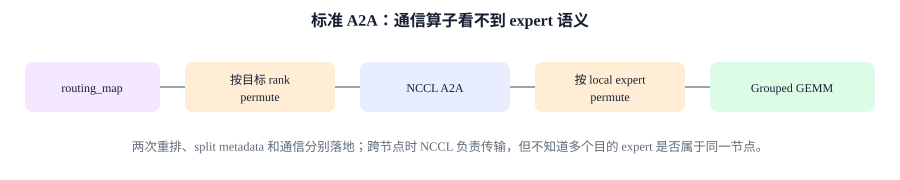
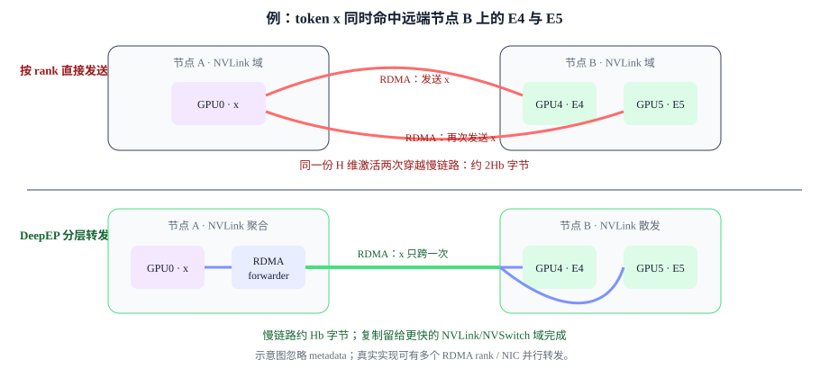
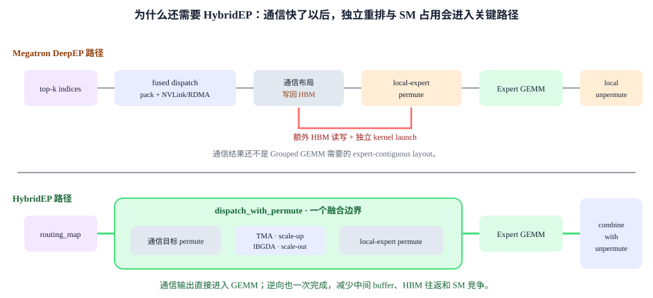
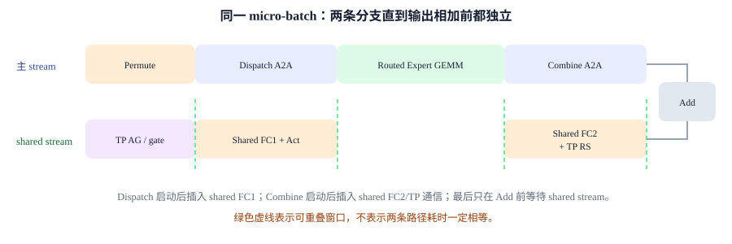

# Expert Parallel 性能：瓶颈、证据与 Megatron 优化

<div class="notebook-hero" markdown>

<span class="chapter-kicker">第 7 章 · Expert Parallel</span>

专家并行的性能问题不是单一的“通信慢”：路由偏斜会制造慢 rank，All-to-All 会撞上拓扑墙，细粒度专家会把大矩阵切成小 GEMM，动态路由还会引入重排、同步和显存波动。本章先解释问题为什么发生，再把每类问题映射到 Megatron 的具体算法与实现。

**本章关键词：** ⚖️ Load balance · 🌐 All-to-All · ⚡ Small GEMM · 🧩 Dynamic shape · 🪄 Overlap

</div>


!!! note "实现基线"

    本文关于 DeepEP、HybridEP、overlap 开关及其组合限制的源码结论，对应 Megatron-LM 集成提交 `88894e3ee`。性能分析中的数据依赖和测量方法可迁移到其他版本，但具体 backend 名称、支持矩阵与命令行参数必须以目标版本为准。


## 01 · 四类性能瓶颈 { #overview }

先把一层 MoE 的前向主链路写出来：

**Router → Permute → Dispatch A2A → Expert GEMM → Combine A2A → Unpermute**

后文使用 ETP 表示 expert Tensor Parallel，即继续切分单个专家内部的矩阵；D2H 表示 device-to-host，把 GPU 上的计数或 shape 信息取回 CPU。两者分别影响专家 GEMM 粒度和动态调度开销。

反向还会再走一遍相反方向的数据依赖。于是总时间可以粗略拆为：

**$t_{moe}=t_{route}+t_{permute}+t_{A2A}+t_{expert}+t_{A2A}+t_{unpermute}+t_{wait}$**

最后一项 $t_{wait}$ 很关键：集合通信按最慢 rank 收尾，所以 EP 的性能不是“平均专家有多快”，而是“最忙专家所在 rank 何时完成”。常见问题可以归成下面四类。

| 常见问题 | 直接症状 | 根因 | Megatron 对应解法 |
| --- | --- | --- | --- |
| **① 负载不均与慢 rank** | `tokens_per_expert` 的 max/mean 很高，collective 前后出现长等待 | 学习式 top-k 天然会偏向少数专家；统计范围、batch 太小和专家放置会进一步放大偏斜 | aux loss、seq/global aux loss、expert bias、capacity |
| **② A2A 通信墙** | dispatch/combine 占比高，跨节点后陡增 | 每个 token 被复制给 top-k 专家；EP 越大 peer 越多；网络层级不一致 | All-to-All / Flex Dispatcher、DeepEP/HybridEP、分组路由、FP8、overlap |
| **③ 专家 GEMM 太小** | 大量短 GEMM，Tensor Core 利用率低，launch 密集 | token 被拆到多个专家；ETP 又切窄矩阵；单专家的 M 维很小且不规则 | Grouped GEMM、ETP=1 优先、增大 token 粒度、tile padding |
| **④ 重排、动态 shape 与显存** | permute kernel 碎、D2H/host gap、显存峰值抖动、CUDA Graph 难捕获 | 每步路由图和接收 token 数变化；两次重排需要索引和临时 buffer | router/permute fusion、capacity/padding、部分 Graph、recompute/offload |


!!! tip "贯穿全章的判断方法"

    先定位是 **skew、network、GEMM 还是 launch/shape**，再选算法。把所有 MoE 开关一起打开，会掩盖因果关系，也可能因为 padding、资源争抢或额外调度反而变慢。


## 02 · 负载不均与慢 rank { #balance }


### 问题与成因

Top-k router 是一个学习系统，不是均匀随机数发生器。语义相近的 token 会集中到少数专家；训练早期的微小偏好又会形成正反馈：热门专家收到更多样本、更新更充分，随后更容易继续被选中。有限的 micro-batch、局部统计口径以及热点专家恰好落在同一 rank，也会让 per-rank skew 比 per-expert skew 更严重。

负载偏斜会同时放大三项成本：

- **通信**：热点 rank 的 `output_splits` 更大，接收和发回更多激活。
- **计算**：该 rank 上专家 GEMM 的 M 维更大。
- **等待**：其他 rank 先算完也不能越过后续同步点，最终 step time 由长尾决定。

Dropless 只保证 token 不被丢弃，并不保证负载均匀；在严重偏斜时，它反而会忠实保留热点带来的变长通信、计算和显存峰值。


### 解法 A：aux loss，用梯度纠正 router

Switch/GShard 风格的辅助损失同时约束“专家被选中的频率”和“router 给专家的平均概率”。某个专家既被频繁选择、概率又高时，损失会变大，梯度把 router 从持续塌缩的方向拉回来。Megatron 提供三个统计口径：

| 算法 | 统计范围 | 适用点 | 代价 / 风险 |
| --- | --- | --- | --- |
| `aux_loss` | 当前路由域 / micro-batch | 通用基线，反馈快 | 系数过大会干扰主任务目标 |
| `seq_aux_loss` | 每条 sequence 单独均衡 | 避免单条样本把专家打偏 | 约束更强，短序列统计噪声更大 |
| `global_aux_loss` | 跨 rank 的 global batch | 局部 batch 很小、希望用更稳定统计 | 反馈更滞后，并需要跨组归约 |

```python
--moe-router-load-balancing-type aux_loss
--moe-aux-loss-coeff COEFF  # 按主任务损失、负载偏斜与训练稳定性实验确定

# 也可按模型需要选择 seq_aux_loss / global_aux_loss
```


### 解法 B：aux-loss-free expert bias，用反馈控制代替辅助目标

如果不希望辅助损失改变语言模型目标，可以为每个专家维护一个不参与优化器更新的 bias。每个 global batch 统计实际 assignment 数：低于平均值的专家加 bias，高于平均值的专家减 bias。bias 只改变“选谁”，最终 combine 的路由权重仍来自原始 score。

**$b_i \leftarrow b_i+\eta\cdot\mathrm{sign}(\bar n-n_i)$**


**Megatron-LM · transformer/moe/moe_utils.py · get_updated_expert_bias**


```python
all_reduce(tokens_per_expert, group=tp_dp_cp_group)
average = tokens_per_expert.sum() / num_experts
offset = average - tokens_per_expert
expert_bias += sign(offset) * bias_update_rate
```

```python
--moe-router-score-function sigmoid
--moe-router-enable-expert-bias
--moe-router-bias-update-rate 1e-3
```


!!! warning "它不是“免费”"

    aux-loss-free 的意思是“不把均衡项加到训练 loss”，不是没有均衡机制。当前 Megatron 仅允许 expert bias 搭配 `sigmoid` 或 `sqrtsoftplus` score；更新率太大会让专家负载来回振荡，太小则追不上路由分布漂移。


### 解法 C：capacity 是最后的硬边界，不是负载均衡算法

Capacity factor 给每个专家设上限。超限 assignment 可以按概率或位置丢弃；配合 `--moe-pad-expert-input-to-capacity` 还能把专家输入补到固定形状。它能限制最坏延迟和显存，但容量太小会丢 token，容量太大又会空算。

```python
--moe-expert-capacity-factor 1.2
--moe-token-drop-policy probs
--moe-pad-expert-input-to-capacity
```


!!! tip "推荐观测值"

    每层记录 `tokens_per_expert` 和每 rank 的收发量，至少比较 max/mean、P95/P50、drop rate。全模型平均很容易把某一层的专家塌缩隐藏掉。


## 03 · All-to-All 数据路径与拓扑瓶颈 { #communication }


### 问题与成因

每个本地 token 都要被发送给 top-k 个专家，专家输出还要沿原路径发回。设每 rank 有 $T$ 个 token、top-k=$k$、隐藏维 $H$、通信 dtype 每元素 $b$ 字节；在近似均匀路由下，dispatch + combine 的跨 rank payload 为：

**$V_{A2A,rank}\approx2\,T\,k\,H\,b\left(1-\dfrac{1}{EP}\right)$**

因此 top-k 或隐藏维翻倍会近似线性增加流量。EP 增大虽然让每卡少存专家，却让远端比例趋近 1、peer 数量增加；一旦 EP group 跨越 NVLink、节点和 IB/RoCE 等不同网络层级，最慢一层链路会暴露出来。

Megatron 的标准 dispatcher 还需要先从 `routing_map` 算出变长的 `input_splits/output_splits`。这些 metadata 决定 A2A buffer 大小，某些配置下需要 D2H 与同步；所以 timeline 上的空洞不一定是“网络没带宽”，也可能是动态 shape 的准备开销。


**Megatron-LM · transformer/moe/token_dispatcher.py · MoEAlltoAllTokenDispatcher**


```python
# dispatch
global_input_tokens = all_to_all(
    ep_group, permuted_tokens, output_splits, input_splits)

# experts ...

# combine：沿相反方向再做一次 all-to-all
local_output = all_to_all(
    ep_group, expert_output, input_splits, output_splits)
```


### 解法 A：从标准 A2A 到 DeepEP / HybridEP

三条路线做的是同一件事：把 token 送到专家所在 rank，再把专家输出送回原 rank。差别不在数学，而在**是否理解分层拓扑、跨域 token 是否去重、重排与通信融合到什么边界**。


#### 1. 标准 NCCL All-to-All：先排好，再交换

Megatron 的标准路径先把 token 按目标 EP rank 排列，计算每个 peer 的变长 split，再调用 NCCL A2A；接收端还要把 token 从“按来源 rank 连续”重新排成“按本地 expert 连续”。Combine 完全逆序执行：





```python
--moe-token-dispatcher-type alltoall
--moe-permute-fusion
```


#### 2. DeepEP：按节点分层转发，融合通信侧的重排

DeepEP 不把 EP group 当成一张均匀的全连接网，而是区分**机内 NVLink/NVSwitch 域**与**机间 RDMA 域**。它接收稀疏的 `[token, top-k expert]` 索引，先计算通信 layout，再用自定义 dispatch kernel 完成打包和分层转发：

1. **机内聚合**：按目标节点把 token 汇聚到能走 RDMA 的发送路径。
2. **机间传输**：同一 token 若在同一远端节点命中多个 expert，可跨 RDMA 只发送该节点需要的一份，再在目标节点复制；避免按目标 rank 重复穿越慢链路。
3. **机内散发**：到达目标节点后，再经 NVLink/NVSwitch 送到具体 expert rank。





**为什么要这样做？** 因为 EP 的通信域是非对称的：机内 NVLink/NVSwitch 带宽通常显著高于跨节点 RDMA，而 top-k 又可能让同一 token 在一个远端节点命中多个专家。若按目标 rank 独立发送，昂贵的 H 维激活会重复穿越最慢链路；先按节点去重、跨节点搬一次、到达后再机内复制，才能让 RDMA 字节量更接近“访问了多少个节点”，而不是“命中了多少个远端专家”。

这与 group-limited routing 很契合：把 expert group 对齐到节点，router 先限制每个 token 访问的节点数，DeepEP 再高效完成节点内外转发。它的通信 kernel 可以控制占用的 SM 数，在吞吐与“给 expert GEMM 留多少 SM”之间调节。

在本章对应的 Megatron `deepep` backend 中，`fused_dispatch` 已融合第一次 token 重排与跨 rank 通信，并返回一个 `handle` 保存逆向 combine 所需的路由信息；但接收后仍要把 token 从通信布局再排成本地 expert 连续布局：


**Megatron-LM · token_dispatcher.py · _DeepepManager**


```python
# 稠密 routing_map -> 稀疏 top-k indices / probs
token_probs, token_indices = torch.topk(probs, router_topk, dim=-1)

# 融合通信侧 permute + 分层 dispatch，handle 留给 combine
hidden, recv_indices, recv_probs, counts, handle = fused_dispatch(...)

# Megatron 仍需按 local expert 做第二次 permute
hidden, permuted_probs, reversed_mapping, ... = permute(
    hidden, dispatched_routing_map, probs=dispatched_probs, ...)

# combine 使用同一 handle 走逆向路径
hidden, _ = fused_combine(hidden, group, handle, ...)
```


#### 3. HybridEP：把两侧重排也并入层次化通信

HybridEP 面向大 NVLink 域和多节点拓扑，把节点内扩展（scale-up）与跨节点扩展（scale-out）放进同一条 token 搬运流水。NVLink / Multi-Node NVLink（MNNVL）侧可使用 Tensor Memory Accelerator（TMA）等机制降低搬运占用的 Streaming Multiprocessor（SM）资源；跨节点侧使用 InfiniBand GPU Direct Async（IBGDA）/ RDMA 直接访问通信 buffer，并允许分别控制 preprocess、permute、dispatch/combine 占用的 SM 或 thread block 数。

它与上面 DeepEP 路径最关键的区别，是**融合边界更大**：

**dispatch\_with\_permute = 按通信目标重排 + 分层 A2A + 按 local expert 重排**

**combine\_with\_unpermute = 逆 expert 重排 + 分层 A2A + 恢复原 token 顺序**





DeepEP 缓解跨节点网络瓶颈后，独立的 local-expert permute/unpermute 可能成为新的暴露开销：每次都要把整块 token 激活写回 HBM、重新读取并启动索引 kernel，这些 CUDA kernel 还会占用本可留给专家 GEMM 的 SM。HybridEP 扩大融合边界，让 token 在通信过程中直接落到 expert-contiguous 位置，优化对象从网络传输扩展到 HBM 搬运、SM 占用和 kernel launch。

因此 HybridEP 输出已经是 Grouped GEMM 可直接消费的 expert-contiguous layout；Megatron 的 `get_permuted_hidden_states_by_experts()` 和恢复函数在这条路径上直接返回输入，不再单独发起第二套 permute/unpermute kernel。


**Megatron-LM · token_dispatcher.py · _HybridEPManager**


```python
dispatched_hidden, dispatched_probs, _, tokens_per_expert, handle = (
    hybrid_ep_dispatch(
        x=hidden_states,
        routing_map=routing_map,
        probs=token_probs,
        fused=moe_permute_fusion_into_hybridep,
        num_permuted_tokens=static_budget,
    )
)

# 已按本地 expert 排好，专家层直接消费
def get_permuted_hidden_states_by_experts(hidden_states):
    return hidden_states, dispatched_probs

# combine 同时完成逆重排和返回原 rank
hidden_states = hybrid_ep_combine(x=expert_output, handle=handle, ...)
```

动态 dropless 模式下，实际接收 token 数仍可能触发 D2H 同步来决定 buffer 大小。给 HybridEP 提供静态的 rank capacity / `num_permuted_tokens` 可以提前分配并走 non-blocking 路径，但预算过小会 overflow 或丢 token，必须监控。

| 对比项 | 标准 A2A | DeepEP backend | HybridEP backend |
| --- | --- | --- | --- |
| 拓扑模型 | 交给 NCCL collective | 显式区分 NVLink 与 RDMA，分层转发 | 面向更大 NVLink/MNNVL 域，TMA + IBGDA/RDMA |
| 跨节点副本 | 按目标 rank 发送 | 按目标节点聚合，避免同节点多个 expert 重复跨 RDMA | 同样做层次化搬运，并扩展大 scale-up 域 |
| 融合边界 | 通信与重排分离 | 融合通信前打包；接收后仍有 local-expert permute | 两侧 permute/unpermute 与 dispatch/combine 一体化 |
| 当前 Megatron 集成约束 | 通用基线 | 依赖 DeepEP；routing probs 使用 FP32 | 依赖 hybrid-ep；routing probs 使用 FP32；该基线暂不支持 FP8 dispatch |
| 优先场景 | 单机或建立可比较 baseline | 跨节点细粒度 MoE、RDMA 是主瓶颈 | GB200 NVL72、Multi-Node NVLink 等大 NVLink 域 |

```python
# DeepEP
--moe-token-dispatcher-type flex
--moe-flex-dispatcher-backend deepep
--moe-router-dtype fp32

# HybridEP
--moe-token-dispatcher-type flex
--moe-flex-dispatcher-backend hybridep
--moe-router-dtype fp32
--moe-permute-fusion-into-hybridep
```


!!! warning "版本边界"

    DeepEP 项目本身还在演进，并已有新的 `ElasticBuffer`/V2 路线；Megatron 也单独暴露了 `deepepv2` backend。上面的 DeepEP 与 HybridEP 对比严格对应本文固定的 Megatron `88894e3ee` 集成，不能把不同分支的参数和能力直接混用。


### 解法 B：减少跨域流量

- **Group-limited routing**：先选 expert group，再只在选中的组内选专家；若 group 与节点对齐，就能限制单 token 的跨节点目的地。Megatron 对应 `--moe-router-num-groups` 与 `--moe-router-group-topk`。
- **通信低精度**：支持 FP8 dispatch 的路径可减少 token 激活字节，并同时加速专家 Tensor Core GEMM；但 router logits/probs 通常保留 FP32。注意本文源码基线的 HybridEP 集成暂不支持 FP8 dispatch，不能只凭模型开启 FP8 就假设 A2A payload 已减半。


### 解法 C：把通信藏到独立计算后面

Overlap 的第一原则是数据依赖：同一 micro-batch 的 routed expert 输入来自 dispatch，所以自己的 expert GEMM 不可能覆盖自己的 dispatch；combine 又依赖 expert 输出，也不能提前。Megatron 使用的窗口有两类：**同一 micro-batch 的 shared expert 分支**，以及**相邻 micro-batch 的前向/反向计算**。


#### 1. Shared expert overlap：利用同层的第二条独立分支

Shared expert 和 routed experts 都读取同一份 MoE 输入，但 shared expert 不需要 router 的 top-k 结果，也不需要 EP dispatch。两条分支只在层末把输出相加，因此中间可以并行。





Megatron 的实现不是简单地把整个 shared MLP 丢到另一个 stream：

1. `pre_forward_comm()` 先在 shared stream 做 sequence-parallel All-Gather 和可选 gate。
2. 主 stream 启动 token A2A 后，shared stream 执行 FC1 + activation；这样 FC1 覆盖 dispatch。
3. 主 stream 启动 combine A2A 后，shared stream 执行 FC2 和 TP Reduce-Scatter；这样 FC2/TP 通信覆盖 combine。
4. `get_output()` 才让主 stream 等待 shared stream，并把两路输出相加。

反向中，源码还会调整 autograd sequence number 并插入 stream wait，让 routed 路径的通信尽早发射、shared FC 的反向排在正确窗口，避免前向看似并发、反向却重新串行。

```python
--moe-shared-expert-intermediate-size 2048
--moe-shared-expert-overlap
```

当前实现要求 dispatcher 为 `alltoall` 或 `flex`，且 shared-expert recompute 不能与这条 overlap 路径同时启用。


#### 2. Batch-level EP overlap：用相邻 micro-batch 的计算覆盖 A2A

如果没有 shared expert，仍可利用训练的 1F1B：micro-batch $m+1$ 做 forward 时，micro-batch $m$ 已经可以 backward。Megatron 不再执行完整的 `F(m+1)` 再执行完整的 `B(m)`，而是把两者拆到 Transformer layer / schedule node 粒度后共同调度：

| 阶段 | Forward $m+1$ | Backward $m$ | 谁覆盖谁 |
| --- | --- | --- | --- |
| Warmup | 单独执行第一个 forward | 尚不可用 | 没有 overlap，属于不可隐藏尾部 |
| 稳态窗口 A | 发射 routed-token dispatch/combine | 执行 attention / MLP 的反向 GEMM | Backward compute 覆盖 Forward A2A |
| 稳态窗口 B | 执行 attention / MLP 的前向 GEMM | 发射 MoE backward 中对应的 combine/dispatch | Forward compute 覆盖 Backward A2A |
| Drain | 已结束 | 单独执行最后一个 backward | 没有 overlap，属于不可隐藏尾部 |

这就是 `combined_1f1b` 的核心：相邻 micro-batch 没有激活依赖，可以把一边的 A2A 放在通信 stream，把另一边的 attention/MLP 放在计算 stream。PP>1 时还要多 warmup 一个 micro-batch，确保进入稳态后配对的 forward 与 backward 真正独立。


前后向跨 micro-batch 重叠仍可能缺少足够的独立计算窗口。权重梯度（weight gradient, wgrad）只需在 optimizer step 前完成，因此可以从输入梯度计算中拆出并延后，用来覆盖 A2A。

#### 3. 延后 wgrad 的调度作用

线性层反向包含两类 GEMM：

- **dgrad**：计算输入梯度，上一层反向立即依赖它，不能随意延后。
- **wgrad**：计算权重梯度，只需在本 step 的 optimizer 更新前完成，调度自由度更高。

`--delay-wgrad-compute` 把原本绑在一起的 dgrad/wgrad 拆开：先执行关键路径上的 dgrad，把 wgrad 保存成独立 schedule node，等后续 A2A 发射后再拿它填通信窗口。Megatron 的 schedule 用 `x.5` 节点表示被拆出的 wgrad：


**Megatron-LM · pipeline_parallel/schedules.py**


```python
# 先把 chunk 展开成逐层 F/B 节点，再插入独立 wgrad 节点
new_order = get_overlap_moe_expert_parallel_comm_order(
    order, num_layers_per_chunk, capture_wgrad_graph=True)

# 示例：-3 是 layer 3 backward 的 dgrad，-3.5 是延后的 wgrad
new_order = [..., -3, -3.5, -2, -2.5, -1, -1.5, ...]
```

```python
--overlap-moe-expert-parallel-comm
--delay-wgrad-compute

# 可选：让 A2A stream 使用 CUDA 高优先级
--high-priority-a2a-comm-stream
```

| 约束 / 代价 | 原因 |
| --- | --- |
| EP>1，dispatcher 为 `alltoall` 或 `flex` | 没有 EP A2A 就没有要隐藏的通信 |
| BF16/FP16；PyTorch ≥ 2.6；`CUDA_DEVICE_MAX_CONNECTIONS > 1` | 当前 combined schedule 与并发通信路径的实现约束 |
| PP>1 时必须配置 VPP | 需要足够细的 layer/chunk 调度和独立 micro-batch 窗口 |
| 不能与 `--moe-shared-expert-overlap` 同开 | 当前 Megatron 明确将两套 stream/schedule overlap 路径设为互斥 |
| 不能 full/MoE recompute | 重算会破坏保存的 schedule plan、依赖和激活生命周期 |
| 可能提高峰值显存 | 相邻 micro-batch 同时在途，延后 wgrad 也让部分输入/激活活得更久 |
| 可能出现 SM/HBM 争抢 | A2A kernel 不是“免费 copy”；若占用太多 SM，反而会拖慢用于遮挡它的 GEMM |


!!! tip "怎样确认真的藏住了"

    看关键路径上的 A2A exposed time，而不只是 NCCL kernel 是否与 GEMM 发生时间重叠。若两者并发后各自都变慢、step time 没降，说明资源竞争抵消了 overlap；应继续调通信 SM 数、A2A stream 优先级或 micro-batch 粒度。


## 04 · 专家 GEMM 的小矩阵效率 { #compute }


### 问题与成因

Dense FFN 用一个大 GEMM 处理所有 token；MoE 则先把 token 拆给不同专家。第 $i$ 个本地专家实际执行：

**$(n_i,H)\times(H,F)$**

其中 $n_i$ 不仅小，而且每步变化。专家数量越多、micro-batch 越小，单专家的 M 维越薄。如果再使用较大的 Expert Tensor Parallel（ETP），$H$ 或 $F$ 也被切窄，同时增加专家内部的 all-gather / reduce-scatter。结果是 FLOPs 看起来不少，但 Tensor Core tile、occupancy 和 kernel launch 都不经济。


### 解法 A：Grouped GEMM

Grouped GEMM 不要求所有专家拥有相同的 $n_i$，而是把多个不同 M 维的专家 GEMM 作为一组提交，减少逐专家 launch，并由后端统一调度。Megatron 的 `TEGroupedMLP` 用 Transformer Engine `GroupedLinear` 同时表达多个本地专家。


**Megatron-LM · transformer/moe/experts.py · TEGroupedMLP**


```python
class TEGroupedMLP(MegatronModule):
    """Executes multiple experts in parallel."""

    self.linear_fc1 = GroupedLinear(num_local_experts, H, F, ...)
    self.linear_fc2 = GroupedLinear(num_local_experts, F, H, ...)
```

```python
--moe-grouped-gemm
```

它主要解决“多个小 GEMM 分别启动”的问题，不能凭空增大单专家 M 维。若每个专家只有极少 token，Grouped GEMM 之后仍可能受小矩阵效率限制。


### 解法 B：先调并行粒度，再调 kernel

| 手段 | 为什么有效 | 需要检查 |
| --- | --- | --- |
| **能放下时优先 ETP=1** | 保留完整 H/F 维，避免专家内部 TP 通信 | 单卡专家权重与 optimizer state 是否放得下 |
| **增加每次参与路由的 token** | 提高每专家期望 $n_i\approx T\cdot k/E$ | micro-batch、序列长度、梯度累积和显存的联动 |
| **量化 routing-map padding** | 把专家 M 维对齐到 16/32 等 tile，减少 FP8/FP4 量化与 GEMM 尾块浪费 | padding 的额外 FLOPs 是否小于 kernel 收益 |
| **融合 FC1 + activation + FC2** | 减少中间张量落 HBM 和 launch | Transformer Engine 版本、激活函数和配置是否满足融合约束 |

```python
--expert-tensor-parallel-size 1
--moe-router-padding-for-quantization
--use-transformer-engine-op-fuser
```


## 05 · 动态路由的重排、shape 与显存开销 { #dynamic }


### 问题与成因

Router 的投影本身通常不大，贵的是它产生了一张动态路由图。标准 A2A dispatcher 要完成两级重排：先按目标 EP rank 排列 token，A2A 后再按本地 expert 排列；combine 时反向恢复原 token 顺序。Megatron 的源码注释把完整流程列成：

1. preprocess counts / splits；
2. permute → EP All-to-All；
3. 必要时 TP All-Gather → 按 local expert 再排序；
4. 专家计算；
5. 逆排序 → TP Reduce-Scatter → EP All-to-All → unpermute。

Dropless 下本地发出的 assignment 总数通常是固定的 $T\cdot k$，但每个 rank 接收多少、每个本地专家分到多少仍是动态的。因此 expert GEMM 的 M 维、接收 buffer 和部分 metadata 会波动；这会带来索引读写、临时内存、同步点，并让完整 CUDA Graph 捕获变难。


### 解法 A：融合 router 与 permutation

```python
--moe-router-fusion
--moe-permute-fusion
```

`router-fusion` 把 score、top-k 和相关路由操作压成更少 kernel；`permute-fusion` 融合索引生成、复制与逆重排。它们减少的是 launch、中间读写和额外 buffer，不会减少 top-k 产生的 A2A payload。


### 解法 B：用 padding 换静态形状，或只捕获稳定模块

| 策略 | 收益 | 代价 |
| --- | --- | --- |
| Dropless 动态 shape | 不丢 assignment，不按固定 capacity 空算 | 专家 M 维和接收量动态，Graph 与 buffer 管理更复杂 |
| Capacity + pad | 固定专家输入 shape，最坏显存可控，更适合 CUDA Graph | 空算；capacity 不足时还会 drop |
| 只 capture attention | 保留 MoE 动态性，同时消除稠密区 launch | MoE 部分仍在 Graph 外 |

```python
# 固定 MoE shape
--moe-expert-capacity-factor 1.2
--moe-pad-expert-input-to-capacity

# 或让动态 MoE 留在图外
--cuda-graph-impl transformer_engine
--cuda-graph-modules attn
```


### 解法 C：显存不够时，只重算 / 卸载最贵的 expert activation

MoE 激活会被 top-k 扩张，还要保留 permutation mapping 和通信 buffer。Megatron 支持按模块重算 `moe_act`，也支持把 `expert_fc1`、`moe_act` 等激活异步 offload 到 CPU。前者用额外计算换显存，后者用 PCIe/NVLink-C2C 带宽换显存。

```python
--recompute-granularity selective
--recompute-modules moe_act

# 或细粒度 activation offload
--fine-grained-activation-offloading
--offload-modules expert_fc1 moe_act
```


## 06 · 从 profile 证据到优化顺序 { #workflow }

| Profile 证据 | 先验证什么 | 第一候选方案 | 不要先做什么 |
| --- | --- | --- | --- |
| per-rank token 数严重偏斜 | 每层 max/mean、持续热点、统计组是否正确 | aux loss / expert bias；再看 placement | 先换通信 backend |
| A2A 随跨节点扩展急剧变慢 | EP rank 拓扑、消息大小、跨域比例 | group-limited routing、Flex + DeepEP/HybridEP | 盲目继续增大 EP |
| A2A 已接近链路上限且占主导 | payload 是否符合 $T k H b$ 估算 | FP8、模型允许时调整 top-k、shared/batch overlap | 只做 permute fusion |
| 大量小 GEMM、SM 利用率低 | 每专家 $n_i$、ETP、tile 对齐 | Grouped GEMM、ETP=1、增大 token 粒度、padding | 先做复杂 schedule overlap |
| timeline 有 D2H / host gap | counts/splits 同步点、动态 buffer | permute fusion、capacity/padding、Flex backend | 把空洞全部归因于网络 |
| 显存峰值随路由波动 | 热点层、dispatch buffer、保存的 expert activation | 先均衡；再 capacity、`moe_act` recompute/offload | 只看平均 allocated memory |

1. **固定 baseline**：模型、并行度、micro-batch、序列长度和路由输入不变，丢掉 warmup，比较稳态中位数与 P90。
2. **先处理负载**：它同时影响通信、计算和等待，是其他测量成立的前提。
3. **再修本地计算粒度**：Grouped GEMM、ETP 和 token/expert 数决定 GEMM 能否吃满。
4. **再处理拓扑与字节**：检查 EP group 放置，选择 dispatcher，评估 FP8 与分组路由。
5. **最后做 overlap**：只有确认存在独立计算窗口后，才值得承担更复杂调度和更高显存。


!!! tip "验收标准"

    优化必须同时满足：稳态 step time / tokens/s 改善，loss 与模型质量可接受，drop rate 和显存峰值在预算内。单个 NCCL kernel 变短、某个 GEMM TFLOPS 变高或 timeline 看起来更并发，都不能单独证明端到端加速。


!!! tip "✅ 学完自测"

    1. 为什么负载不均会同时放大 A2A、GEMM 和 rank 等待？
    2. aux loss、expert bias 与 capacity 各自在哪一层解决问题？
    3. A2A payload 为什么近似正比于 $T\cdot k\cdot H\cdot b$？
    4. DeepEP 为什么能减少跨节点冗余副本？HybridEP 又把融合边界扩到了哪里？
    5. Grouped GEMM 能消除 launch 开销，为什么仍不能保证小专家高效？
    6. Shared expert overlap 与 batch-level overlap 分别利用哪一种独立性？
    7. delay wgrad 为什么不阻塞上一层反向，却能制造更大的通信遮挡窗口？
    8. Dropless 下本地 assignment 总数固定，为什么专家 GEMM shape 仍然动态？
