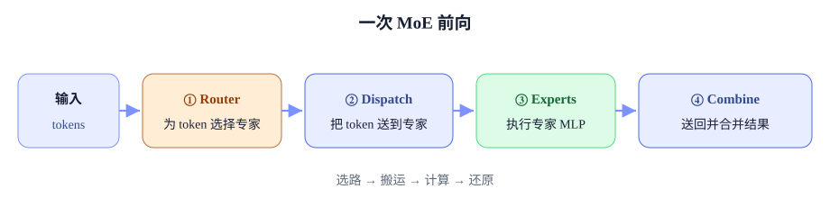
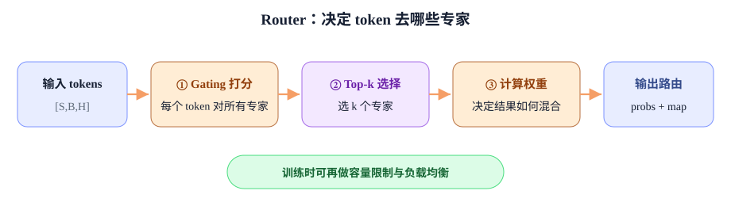
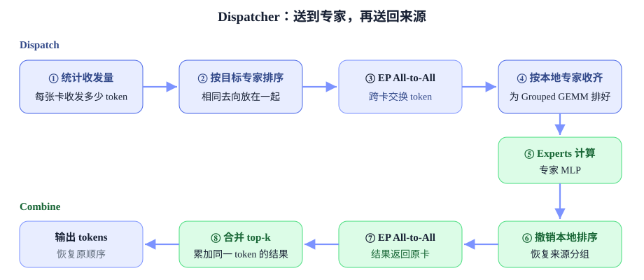
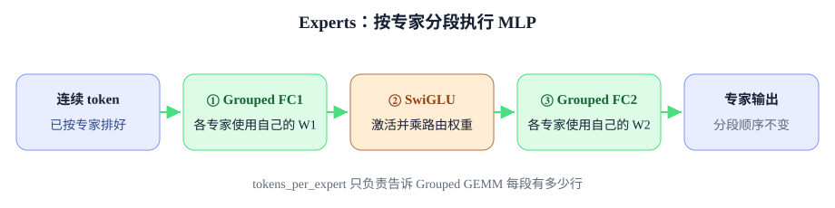

# Megatron EP 源码：Router、Dispatcher 与 Experts 执行链

<div class="notebook-hero" markdown>

<span class="chapter-kicker">第 7 章 · Expert Parallel</span>

沿一次训练前向逐层下钻：先进入 Router 的选路算法，再看 All-to-All Dispatcher 的两次重排与两次通信，最后分析 GroupedMLP 如何按专家分段执行 FC1、SwiGLU 和 FC2。

**本章关键词：** 🧭 真实调用链 · 🎯 Top-k routing · 🔀 Permute + All-to-All · ⚙️ Grouped GEMM

</div>


!!! warning "阅读基线"

    本文基于 Megatron-LM 提交 `88894e3ee`，选取 dropless top-k、`MoEAlltoAllTokenDispatcher` 与 `TEGroupedMLP` 组成的训练路径。为突出主干，图和代码省略 shared expert、latent MoE、FP8/FP4 padding、CUDA Graph 与 DeepEP/Flex dispatcher。类名、字段和分支条件属于 Megatron Core 实现，不是 EP 算法的稳定接口。


## 01 · 前向总览与模块职责 { #overview }

`MoELayer` 不实现路由算法、通信算法或专家 MLP，它只把四段能力串成一次前向。





## 02 · Router：从 gating logits 到稀疏路由图 [router.py ↗](https://github.com/NVIDIA/Megatron-LM/blob/main/megatron/core/transformer/moe/router.py) { #router }




*Router 只决定“选谁、各占多大权重”，不会在卡间搬动 token。*


| 功能阶段 | 输入 | 输出 | 对应小节 |
| --- | --- | --- | --- |
| 生成 logits | `hidden_states [S,B,H]` | `logits [T,E]` | 2.1 |
| 准备排名与权重分数 | `logits [T,E]` | `ranking_scores / weight_scores [T,E]` | 2.2 |
| 选择专家 | `ranking_scores [T,E]` | `top_indices [T,k]` | 2.3 |
| 生成组合权重 | `top_indices + weight_scores` | `probs [T,k]` | 2.4 |
| 编码路由结果 | `top_indices + probs [T,k]` | `routing_map / routing_probs [T,E]` | 2.5 |
| 训练态附加处理 | `routing_map / routing_probs` | drop 后路由、附加 loss、负载统计 | 2.6 |


### 2.1 生成 logits：每个 token 对所有专家打分


> **输入：**`hidden_states [S,B,H]`　→　**输出：**`logits [T,E]`


这一阶段只产生原始匹配分，不选择专家。可选 jitter 对 Router 输入施加乘性噪声；gating linear 把隐藏维 $H$ 投影到专家维 $E$；随后把 sequence 和 batch 展平成 token 维。后文用 $T=S\times B$ 表示当前 rank 的 token 数，$E$ 表示全局专家数，$k$ 表示每个 token 选择的专家数。z-loss 通过 autograd 附着到 logits，但不改变其数值 shape。


**router.py · 输入到 logits**


```python
x = self.apply_input_jitter(hidden_states)        # [S,B,H]
logits = self.gating(x)                           # [S,B,E]

seq_length, bsz = logits.shape[:2]
logits = logits.view(-1, self.config.num_moe_experts)
logits = self.apply_z_loss(logits, padding_mask)  # [T,E]
```


### 2.2 准备两类分数：一个用于排名，一个用于加权


> **输入：**`logits [T,E]`　→　**输出：**`ranking_scores / weight_scores [T,E]`


这里最容易混淆的是：Router 可能同时需要两套分数。`ranking_scores` 只用于比较 E 个专家、决定 top-k；`weight_scores` 保留专家本身的匹配程度，等 2.3 选出 expert id 后，再由 2.4 计算 Combine 权重。源码复用了 `scores` 变量，下面按职责拆成两个名字。

| 配置 | `weight_scores`：专家原始权重依据 | `ranking_scores`：top-k 排名依据 |
| --- | --- | --- |
| Softmax pre | `softmax(logits over E)` | 同左 |
| Softmax post | 暂时保留 `logits` | `logits` |
| Sigmoid | `sigmoid(logits)` | `weight_scores + expert_bias`（若启用） |
| Sqrt-softplus | `sqrt(softplus(logits))` | `weight_scores + expert_bias`（若启用） |


**moe_utils.py · 按职责改写的 score 主干**


```python
if score_function == "softmax":
    weight_scores = softmax(logits.float(), dim=-1) if use_pre_softmax else logits
    ranking_scores = weight_scores
elif score_function == "sigmoid":
    weight_scores = sigmoid(logits.float())
    ranking_scores = (
        weight_scores + expert_bias.float()
        if expert_bias is not None else weight_scores
    )
else:  # sqrtsoftplus
    weight_scores = softplus(logits.float()).sqrt()
    ranking_scores = (
        weight_scores + expert_bias.float()
        if expert_bias is not None else weight_scores
    )
```


> **expert bias 的边界：**它只进入 `ranking_scores`，用于把过载专家往后排、把欠载专家往前推；不会进入 `weight_scores`，因此不会直接放大或缩小专家输出。


### 2.3 选择 top-k 专家：只确定 expert id


> **输入：**`ranking_scores [T,E]`　→　**输出：**`top_indices [T,k]`


普通路径对每个 token 的 E 个分数直接做 top-k。group-limited 路径先选择少量专家组，再在这些组内部选最终专家，因此可以限制一个 token 跨越的 EP rank 或节点范围。


**普通 top-k 与 group-limited top-k**


```python
if group_topk is None:
    _, top_indices = torch.topk(ranking_scores, k, dim=1)  # [T,k]
else:
    grouped = ranking_scores.view(T, num_groups, E // num_groups)
    group_scores = grouped.topk(k // group_topk, dim=-1).values.sum(dim=-1)
    selected_groups = group_scores.topk(group_topk, dim=-1).indices
    masked_scores = mask_unselected_groups(ranking_scores, selected_groups)
    _, top_indices = torch.topk(masked_scores, k, dim=1)      # [T,k]
```

本阶段到此结束：它只输出 expert id，不计算专家输出的混合比例。


### 2.4 计算 Combine 权重：只处理已经选中的 k 个专家


> **输入：**`top_indices [T,k]` + `weight_scores [T,E]`　→　**输出：**`probs [T,k]`


2.2 准备“排名依据”和“权重依据”，2.3 用前者选出 expert id；本节再按这些 id 从后者取值，得到 k 个专家输出在 Combine 时的系数。也就是说：**2.2/2.3 决定选谁，2.4 决定选中的结果怎样相加。**

| 路由方式 | 选中 id 后如何得到 `probs` | 含义 |
| --- | --- | --- |
| Softmax pre | 从“对全部 E 个专家做 softmax”的结果中取出 k 项 | 保留被选专家在全部专家中的概率质量，k 项之和通常小于 1 |
| Softmax post | 先取出 k 个 logits，再只对这 k 项做 softmax | 只比较被选专家，k 项之和等于 1 |
| Sigmoid / sqrt-softplus | 取出未加 expert bias 的 `weight_scores`，top-k>1 时在 k 项内归一化 | bias 影响“选谁”，不进入 Combine 权重 |


**moe_utils.py · selected expert weights**


```python
if score_function == "softmax" and use_pre_softmax:
    probs = gather(weight_scores, top_indices)            # [T,k]
elif score_function == "softmax":
    selected_logits = gather(logits, top_indices)
    probs = softmax(selected_logits.float(), dim=-1)      # [T,k]
else:
    selected_scores = gather(weight_scores, top_indices)  # 不含 expert_bias
    probs = normalize(selected_scores) if k > 1 else selected_scores

if scaling_factor:
    probs = probs * scaling_factor
```


> **一个 token 的例子：**假设 sigmoid 后的 `weight_scores=[0.60, 0.55, 0.20]`，expert bias 为 `[-0.10,+0.10,0]`，则排名使用 `[0.50,0.65,0.20]`，top-1 会选择 expert 1；但它的 Combine 权重来自原始 `weight_scores`，是 `0.55`，不是加过 bias 的 `0.65`。


### 2.5 编码路由结果：把紧凑 top-k 变成 Dispatcher 接口


> **输入：**`top_indices / probs [T,k]`　→　**输出：**`routing_probs / routing_map [T,E]`


训练态 Dispatcher 使用 token×expert 表示，因此需要把紧凑 top-k 结果 scatter 回 E 列。未选专家的 probability 为 0，map 为 False；每行恰有 k 个有效位置。


**moe_utils.py · sparse-dense route encoding**


```python
routing_probs = torch.zeros_like(logits).scatter(
    1, top_indices, probs.type_as(logits)
)                                                        # [T,E]
routing_map = torch.zeros_like(logits).int().scatter(
    1, top_indices, 1
).bool()                                                 # bool [T,E]
return routing_probs, routing_map
```


### 2.6 训练态附加处理：不改变 Router 主干职责


> **输入：**`routing_probs / routing_map [T,E]`　→　**输出：**容量受控的路由、负载均衡训练信号或下一批次使用的 expert bias


top-k 主干只根据当前分数选专家，并不知道某个专家是否已经过载。训练态因此还需要三种控制机制。它们解决的问题不同：capacity 是硬性执行边界，aux loss 用梯度训练 Router 均衡选路，expert bias 则用批次级反馈直接修正下一轮排名。

| 机制 | 解决什么问题 | 直接改变什么 | 生效时机 |
| --- | --- | --- | --- |
| Capacity / token dropping | 防止热点专家带来无界的通信量和 GEMM 行数 | 当前前向的 `routing_map/probs` | top-k 之后、Dispatch 之前 |
| Aux loss | 让 Router 参数逐渐学会把 token 分散到不同专家 | 反向传播到 gating weight 的梯度 | 当前前向构造 loss，backward 生效 |
| Aux-loss-free expert bias | 不引入辅助目标，也能纠正长期负载偏斜 | 下一 global batch 的 top-k 排名分数 | global batch 结束时更新 bias |


#### 2.6.1 Capacity：给每个专家设置硬上限

设当前 rank 有 $T$ 个 token、top-k 为 $k$、共有 $E$ 个专家。总 assignment 数为 $Tk$，均匀分配时每个专家应收到 $Tk/E$ 个。capacity factor 在这个均值上预留余量：


> **每专家容量：**$C=\left\lceil \frac{T\times k}{E}\times \text{capacity\_factor}\right\rceil$


若某专家收到的 assignment 超过 $C$，必须丢掉超出的分支。`drop_policy="probs"` 保留该专家上 probability 最大的 $C$ 个 assignment；`"position"` 不比较 probability，只从 `routing_map` 的有效位置中选满 $C$ 个。被丢弃的是“token → 某个 expert”这一条分支，而不一定是整个 token；top-k>1 时，token 的其他专家分支仍可能保留。


**moe_utils.py · apply_router_token_dropping**


```python
expert_capacity = ceil(
    (num_tokens * router_topk / num_experts) * capacity_factor
)

if drop_policy == "probs":
    _, keep = torch.topk(routing_probs, k=expert_capacity, dim=0)
elif drop_policy == "position":
    _, keep = torch.topk(routing_map.int(), k=expert_capacity, dim=0)

capacity_mask = torch.zeros_like(routing_map).scatter(0, keep, 1).bool()
final_map = capacity_mask if pad_to_capacity else routing_map & capacity_mask
final_probs = routing_probs * final_map
```

例如 $T=1024,k=2,E=8$、capacity factor 为 1.25，则 $C=320$。均衡负载是每专家 256 条，系统允许 25% 的波动；若 expert 0 收到 500 条，最多保留 320 条。启用 `pad_to_capacity` 时，每个专家进一步补成固定 $C$ 行，方便固定 shape 或 CUDA Graph，但会产生 probability 为 0 的填充计算。


#### 2.6.2 Aux loss：用额外梯度让 Router 学会均衡

标准 Switch-style aux loss 同时观察两个统计量。$f_i$ 是 expert $i$ 实际收到的 assignment 比例，$P_i$ 是 Router 分配给 expert $i$ 的平均 score：


> **负载比例：**$f_i=\frac{1}{Tk}\sum_t \mathrm{routing\_map}_{t,i}$
> **平均分数：**$P_i=\frac{1}{T}\sum_t \mathrm{score}_{t,i}$
> **辅助损失：**$L_{\mathrm{aux}}=\alpha E\sum_i f_iP_i$


若 expert $i$ 已经很拥挤，$f_i$ 较大；此时继续给它较高的 $P_i$ 会增大 loss。反向传播会压低这类热点专家的 score，并把概率质量推向负载较低的专家。`routing_map` 的离散 top-k 结果本身不可导，真正承载梯度的是连续的 `scores_for_aux_loss`。


**router.py / moe_utils.py · aux loss 主干**


```python
tokens_per_expert = routing_map.sum(dim=0)       # [E]，决定 f_i
scores_per_expert = scores_for_aux_loss.sum(dim=0) # [E]，决定 P_i

aux_loss = (tokens_per_expert * scores_per_expert).sum() * (
    num_experts * aux_loss_coeff / (topk * T * T)
)

# forward 原样返回 probs；backward 时才注入 aux_loss 梯度
probs = MoEAuxLossAutoScaler.apply(probs, aux_loss)
```

| 配置 | 统计范围 | 适合解决的问题 |
| --- | --- | --- |
| `aux_loss` | 当前 micro-batch，在 TP×CP 范围聚合 token counts | 最直接、响应最快的常规负载均衡 |
| `seq_aux_loss` | 每条 sequence 分别计算，再对 batch 求平均 | 避免某一条长序列内部集中命中少数专家 |
| `global_aux_loss` | 跨 micro-batch 累计，并在 TP×DP×CP 范围统计 | 以 global batch 为尺度获得更稳定的负载估计 |

aux loss 不会在当前前向里改写 top-k 结果；它通过 `MoEAuxLossAutoScaler` 附着到 `probs` 的计算图，在 backward 时与主任务梯度一起更新 Router。系数 $\alpha$ 太小则均衡作用弱，太大则辅助目标可能干扰模型对专家专长的学习。


#### 2.6.3 Aux-loss-free expert bias：用反馈控制修正下一批路由

aux-loss-free 并不是“不做负载均衡”，而是不把负载均衡写进训练 loss。Router 为每个专家维护一个不参与优化器更新的 `expert_bias [E]`。当前 global batch 内只累计各专家收到多少 assignment；到梯度收尾阶段，再统一更新 bias。Megatron 当前只在 sigmoid / sqrt-softplus score 分支中把它加入排名分数，softmax 分支不使用该 bias。


**router.py + finalize_model_grads.py · expert bias 更新闭环**


```python
# Router forward：累计当前 global batch 的负载
local_tokens_per_expert += routing_map.sum(dim=0)

# global batch 结束：跨 TP×DP×CP 汇总
torch.distributed.all_reduce(tokens_per_expert, group=tp_dp_cp_group)
average_tokens = tokens_per_expert.mean(dim=-1, keepdim=True)
offset = average_tokens - tokens_per_expert
expert_bias += torch.sign(offset) * bias_update_rate

# 下一批 Router：bias 只参与 top-k 排名
ranking_scores = weight_scores + expert_bias
```

欠载专家满足 `tokens_per_expert < average_tokens`，bias 增大，下一批更容易进入 top-k；过载专家的 bias 减小，下一批更难被选中。比如 counts 为 `[120,80,100]`、均值为 100、更新率为 0.01，则 bias 增量为 `[-0.01,+0.01,0]`。


!!! tip "为什么 bias 不进入 Combine 权重？"

    它是负载控制信号，不代表 token 与 expert 的真实匹配程度。因此它只修改 2.2 的 `ranking_scores`；2.4 仍从未加 bias 的 `weight_scores` 计算 `probs`，避免负载校正直接放大或缩小专家输出。


#### 2.6.4 三种控制机制的组合

| 方案 | 典型配置关系 | 训练行为 |
| --- | --- | --- |
| Aux loss 路线 | 启用一种 aux loss；capacity 可独立启用 | Router 通过梯度逐步学会均衡，capacity 负责兜底 |
| Aux-loss-free 路线 | `moe_aux_loss_coeff=0`，启用 expert bias；capacity 可独立启用 | 不增加辅助训练目标，按 global batch 的真实负载更新 bias |

capacity 解决的是“最坏情况下本轮最多执行多少”，aux loss 和 expert bias 解决的是“后续路由怎样少制造热点”。因此 capacity 可以和任一均衡方案同时使用。z-loss 则属于数值稳定机制：它约束 logits 不要无限增大，不负责专家负载均衡，已在 2.1 说明。


## 03 · All-to-All Dispatcher：从路由关系到专家连续布局 [token\_dispatcher.py ↗](https://github.com/NVIDIA/Megatron-LM/blob/main/megatron/core/transformer/moe/token_dispatcher.py) { #dispatcher }




*图中 ①–⑧ 与下面 3.1–3.8 一一对应。*


### 3.1 `preprocess` 计算收发 splits


**metadata 主干 · dropless 路径**


```python
num_local_tokens_per_expert = routing_map.sum(dim=0).long()  # [E]
num_out_tokens = routing_map.size(0) * router_topk           # M_send

# 全局专家按 EP rank 连续放置，每 rank 有 num_local_experts 个专家
input_splits = num_local_tokens_per_expert.reshape(
    ep_size, num_local_experts
).sum(dim=1)                                                # [P_e]

global_counts = gather_from_sequence_parallel_region(
    num_local_tokens_per_expert, group=tp_ep_group
)                                                           # 所有来源的 counts

local_expert_counts = select_this_rank_experts(global_counts)
output_splits = local_expert_counts.sum(dim="local_expert") # [P_e]
tokens_per_expert = local_expert_counts.sum(dim="source")   # [E/P_e]
```


> **三个统计量不要混淆：** `input_splits[j]` 是“我发给 EP rank j 多少行”；`output_splits[j]` 是“我从 EP rank j 收多少行”；`tokens_per_expert[e]` 是“我的本地 expert e 最终处理多少行”。前两个喂给变长 A2A，最后一个喂给 Grouped GEMM。


### 3.2 Permutation 1：复制 assignment 并按目标分桶

Dropless 非融合实现把 `routing_map [T,E]` 转置成 expert-major，再对 True 位置排序。最终 `sorted_indices` 中保存原 token 行号；同一 token 若选了 k 个专家，它的行号会出现 k 次。这里用 $M_{send}$ 表示本 rank 准备发出的 assignment 行数，dropless 时 $M_{send}=Tk$。


**moe_utils.permute 的核心数据变换**


```python
expert_major = routing_map.bool().T.contiguous()  # [E,T]
flat_order = expert_major.reshape(-1).argsort(descending=True, stable=True)
flat_order = flat_order[:num_out_tokens]          # 只保留 True assignment

sorted_indices = flat_order % T                   # [M_send]，映射回 token 行号
permuted_tokens = tokens.index_select(0, sorted_indices)
# [T,H] -> [M_send,H]；top-k token 在此真正产生多份 assignment

permuted_probs = probs.T.reshape(-1)[flat_order]  # [M_send]
```

这里保存的 `sorted_indices` 就是 `reversed_local_input_permutation_mapping`。名字看起来像“逆映射”，实际值是“每个 permuted 行来自原输入哪一行”；Combine 最后用它做 scatter-add。


### 3.3 第一次 EP All-to-All：token 和 probability 使用相同 splits


**EP All-to-All 主干**


```python
global_input_tokens = all_to_all(
    ep_group,
    permutated_local_input_tokens,  # [M_send,H]
    output_splits,
    input_splits,
)                                  # [M_recv,H]

global_probs = all_to_all(
    ep_group,
    permuted_probs,                 # [M_send]
    output_splits,
    input_splits,
)                                  # [M_recv]
```

发送 buffer 已经按目标 rank 连续，因此 collective 只按 `input_splits` 切段，不再理解 expert id。token 和 probability 分开通信，但必须使用完全相同的 splits，才能保持逐行对应。$M_{recv}=\sum \mathrm{output\_splits}$ 表示本 rank 在 A2A 后实际收到的 assignment 行数。


### 3.4 Permutation 2：从来源布局变为本地专家布局

A2A 接收布局天然是 source-rank-major：先是 rank 0 发来的本地专家块，再是 rank 1 发来的块。Grouped GEMM 需要 local-expert-major：expert 0 的所有来源 token 连续，然后是 expert 1。`sort_chunks_by_idxs` 只重排整块，不重新运行 Router。


**Permutation 2 · source-major → local-expert-major**


```python
# dispatch_postprocess: source-major -> local-expert-major
x_expert, p_expert = sort_chunks_by_idxs(
    global_input_tokens,
    num_global_tokens_per_local_expert.ravel(),
    sort_input_by_local_experts,
    probs=global_probs,
)
```

这一步结束后，同一个本地 expert 的 token 已经连续，`tokens_per_expert` 可以直接作为 Grouped GEMM 的分段长度。若启用 expert tensor parallel，还会在进入本地专家前执行 All-Gather。


### 3.5 Experts 计算：执行专家 MLP

此时 Dispatcher 已经输出按本地专家连续排列的 `x_expert`，以及每个专家的行数 `tokens_per_expert`。Experts 只按这些分段执行 Grouped FC1、SwiGLU 和 Grouped FC2，并保持行顺序不变。具体实现放在本节第 4 节；这里先把它作为 Dispatch 转入 Combine 的中间步骤。


### 3.6 撤销本地排序：`combine_preprocess` 恢复来源分组

Experts 不改变行顺序，因此输出仍是 local-expert-major。返回来源 rank 之前，需要把它恢复成 source-rank-major，使发送 buffer 再次按目标来源 rank 连续。这正是 3.4 的逆过程。


**Permutation 2 的逆变换 · local-expert-major → source-major**


```python
# combine_preprocess: local-expert-major -> source-major
x_source_order, _ = sort_chunks_by_idxs(
    expert_output,
    num_global_tokens_per_local_expert.T.ravel(),
    restore_output_by_local_experts,
)
```

若 Dispatch 侧执行过 expert-TP All-Gather，这里会先用 Reduce-Scatter 合并 expert-TP 分片，再撤销本地专家排序。


### 3.7 第二次 EP All-to-All：把专家结果送回来源卡

Dispatch 时本 rank 按 `input_splits` 发送、按 `output_splits` 接收；Combine 的方向完全相反，因此交换两组 splits。通信结束后，本 rank 重新拿回自己最初发出的 $M_{send}$ 条 assignment。


**Combine EP All-to-All · 交换 input/output splits**


```python
returned = all_to_all(
    ep_group,
    x_source_order,
    input_splits,     # 与 dispatch 相反
    output_splits,
)                    # [M_send,H]，已回到 token 来源 rank
```


### 3.8 合并 top-k：撤销 Permutation 1，恢复原 token 顺序

第二次 A2A 只把 assignment 送回来源卡，它们仍保持 Permutation 1 的顺序。最后使用 Dispatch 时保存的 `reversed_local_input_permutation_mapping`，把每一行散射回原 token 位置。


**unpermute · assignment-major → token-major**


```python
output = unpermute(
    returned,
    reversed_local_input_permutation_mapping,
    restore_shape=hidden_shape_before_permute,  # [T,H]
    routing_map=routing_map,
)
return output.view(hidden_shape)                # [S,B,H]
```

当前 `TEGroupedMLP` 主路径已经把 `permuted_probs` 乘进专家中间激活，所以这里的 `unpermute` 主要执行 scatter-add：同一原 token 的 k 个专家分支被累加回同一行。若另一条实现把 probs 延迟到 unpermute，它也支持在恢复顺序时再乘权重。


## 04 · Experts：GroupedMLP 的连续 tensor 与专家分段 [experts.py ↗](https://github.com/NVIDIA/Megatron-LM/blob/main/megatron/core/transformer/moe/experts.py) { #experts }




*Experts 不再判断 token 属于谁，只按 Dispatcher 已排好的连续分段计算。*


下面用 $M_x=\sum\mathrm{tokens\_per\_expert}$ 表示本地 Experts 实际处理的行数，$P_t$ 表示 expert tensor parallel size。


**TEGroupedMLP.forward 主干 · 未启用 fused-op-fuser 的路径**


```python
tokens_per_expert = tokens_per_expert.tolist()
permuted_probs = permuted_probs.unsqueeze(-1)       # [M_x,1]

fc1_output, bias_parallel = apply_module(self.linear_fc1)(
    permuted_local_hidden_states,                   # [M_x,H]
    tokens_per_expert,
)                                                   # [M_x,2F/P_t]

bias_act_output = bias_act_func(
    fc1_output,
    bias_parallel,
    permuted_probs,
)                                                   # [M_x,F/P_t]

output, output_bias = apply_module(self.linear_fc2)(
    bias_act_output,
    tokens_per_expert,
)                                                   # [M_x,H]
return output, output_bias
```


### 4.1 `tokens_per_expert` 是执行计划，不是 mask

Dispatcher 已经把相同专家的 token 排成连续段，所以 Experts 不需要读取 `routing_map [T,E]`。它只需要 `[n_0,n_1,...]` 计算段边界，GroupedLinear 据此把一个大输入描述成多个 GEMM：

| 专家 | 输入切片 | 权重 | 矩阵乘 |
| --- | --- | --- | --- |
| expert 0 | `x[0:n0]` | `W1[0]` | `[n0,H] × [H,2F/P_t]` |
| expert 1 | `x[n0:n0+n1]` | `W1[1]` | `[n1,H] × [H,2F/P_t]` |
| expert e | `x[offset[e]:offset[e+1]]` | `W1[e]` | 同一批 grouped GEMM 中的第 e 个问题 |


### 4.2 `bias_act_func` 中的路由权重

SwiGLU 先把 FC1 的 $2F$ 输出拆成 gate/up，再计算 `SiLU(gate) * up`。Megatron 随后在 FC2 之前乘路由权重：

```python
gate, up = torch.chunk(fc1_output, 2, dim=-1)
activated = activation_func(gate) * up       # [M_x,F/P_t]
activated = activated * permuted_probs       # 每个 assignment 一个权重
output = linear_fc2(activated)
```

FC2 在无 bias 时是线性的，因此“FC2 前乘概率”等价于“FC2 后乘概率”，但更容易与 bias、activation fusion 合并成一个 kernel。启用 `bias_activation_fusion` 时，SwiGLU、bias 和 probability scaling 会走 `weighted_bias_swiglu_impl`；普通路径才显式执行 split、activation 和乘法。


### 4.3 影响执行路径的几个分支

| 配置 | 源码行为 |
| --- | --- |
| `use_transformer_engine_op_fuser` | 绕过显式 FC1/activation/FC2 Python 主干，调用融合的 grouped MLP op，但输入输出契约不变。 |
| `moe_apply_probs_on_input` | 仅允许 top-1；先把 probability 乘到专家输入，再把后续 probability 重置为 1。 |
| `fp8 / fp4` | 按每专家 token 数补齐量化对齐要求，计算后再 unpad。 |
| `recompute_modules=["moe_act"]` | 用 checkpoint 包住 activation，backward 时重新计算 `bias_act_func`。 |
| `moe_mlp_glu_interleave_size` | 若 FC1 输出采用交错 GLU 布局，先重排为连续 gate/up 两半再执行激活。 |


## 05 · 一次前向的数据布局不变量 { #trace }

| 检查点 | 应观察的变量 | dropless 路径的不变量 |
| --- | --- | --- |
| Router 返回 | `probs, routing_map` | `routing_map.shape == [T,E]`；每行 True 数为 k；总 assignment 为 $Tk$。 |
| Permutation 1 后 | `x_send, sorted_indices` | `x_send.shape[0] == sorted_indices.numel() == Tk`。 |
| A2A 后 | `x_recv, output_splits` | `x_recv.shape[0] == sum(output_splits)`。 |
| Permutation 2 后 | `x_expert, tokens_per_expert` | `x_expert.shape[0] == tokens_per_expert.sum()`；同专家行连续。 |
| GroupedMLP 后 | `expert_output` | 第一维和专家分段顺序不变，只把最后一维从 H 经 2F/F 回到 H。 |
| Combine A2A 后 | `returned` | `returned.shape[0] == M_send`；行顺序与 Permutation 1 输出对应。 |
| unpermute 后 | `output` | `output.shape == hidden_states.shape`；同 token 的 k 个分支已合并。 |


!!! tip "阅读源码的主线"

    Router 的核心产物是 `routing_map`；Dispatcher 的核心产物是 `sorted_indices + splits + tokens_per_expert`；Experts 的核心输入契约是“数据连续 + 分段长度”。抓住这三组状态，就能穿过 CUDA Graph、融合 kernel、DeepEP 或量化等优化分支，仍然看清同一条语义主线。
