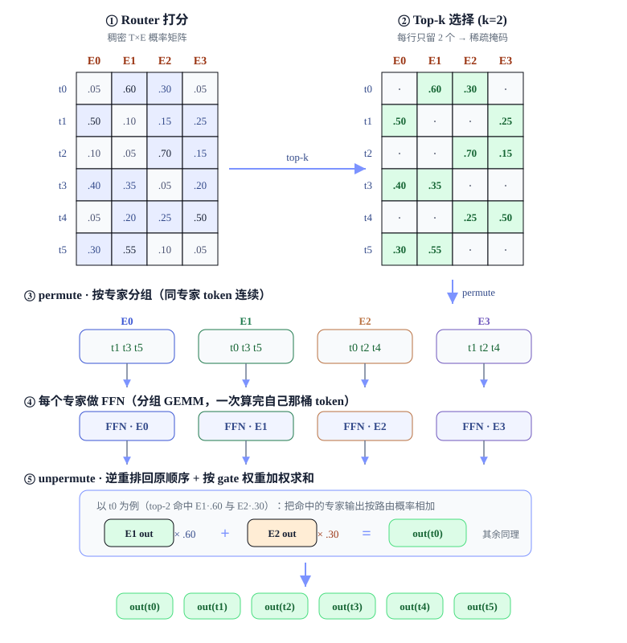
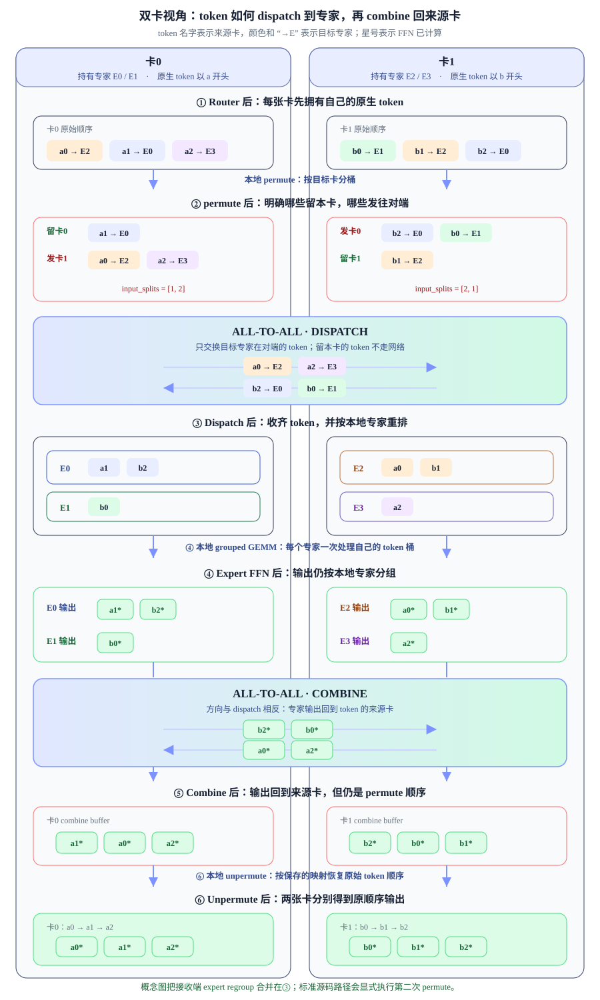
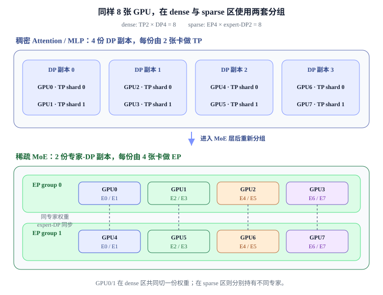

# Expert Parallel：路由、分发与负载均衡

第 7 章 · Expert Parallel

混合专家模型（Mixture of Experts, MoE）在每个 token 上只激活少数专家，使路由专家分支的总参数量主要随专家数增长，而单 token 的专家计算主要随 top-k 增长。专家并行（Expert Parallel, EP）把完整专家放到不同 rank，再用 all-to-all 完成 token 的 dispatch 与 combine。

**本章关键词：** 🧠 top-k 路由 + 稀疏激活 · 🔀 all-to-all dispatch / combine · ⚖️ capacity + aux loss · 🧩 与 TP/DP 组合

## 01 · MoE：从稠密 FFN 到稀疏专家 { #moe }

### 1. MoE 的容量与计算目标

在数据、优化和训练预算匹配时，增加模型容量通常能改善模型能力；但在标准稠密（dense）Transformer 中，每个 token 都会经过该层的全部权重，参数规模与计算成本紧密耦合。前馈网络（Feed-Forward Network, FFN）通常占 Transformer 层中较大的参数与 FLOPs 比例，并对每个 token 执行一组稠密矩阵乘。

若只靠复制同结构的稠密层来扩大容量，单 token 计算通常也会随之增加。MoE 试图改变的是这条耦合关系：增加可用专家参数，但让每个 token 只执行其中少数分支。

!!! note "💡 一句话"

    MoE 的核心目标是：**增加可用的路由专家参数，同时不让专家 FFN 的单 token 计算随专家总数线性增长。**

### 2. 专家与路由器

MoE（Mixture of Experts，混合专家）把一层里那个大 FFN，换成 **$E$ 个并列的小 FFN**——每个叫一个**专家（expert）**；再加一个极小的**路由器（router，一层 Linear）**。核心规则是：

**每个 token 不再过所有专家，而是由 router 挑出 top-k 个专家（通常 k=1~8），只让这几个专家算它。**

这样，路由专家分支的参数量主要随专家数 $E$ 增长，而该分支的单 token GEMM 计算主要随激活专家数 $k$ 增长。这种只执行少数分支的方式称为**稀疏激活（sparse activation）**。Router、shared expert、attention 以及通信与重排仍有额外成本，因此不能把整层或整模型计算简单写成“只由 $k$ 决定”。

### 3. 单卡 MoE 的前向数据生命周期

MoE 的整个前向，可以浓缩成一张 **「token × 专家」的矩阵**来看：**行是 token，列是专家，格子是 router 给的分数**。下面用 6 个 token、4 个专家、top-2 走一遍（分数为示意的行内 softmax 概率）：

*单卡 MoE 完整前向五步：① 打分 → ② top-k → ③ permute 按专家分组 → ④ 每个专家做 FFN → ⑤ unpermute 逆重排 + 按 gate 加权求和。**注意 ③④⑤ 全在一张卡上、纯本地内存操作，没有任何跨卡通信**——这正是下一节 EP 要改变的地方。*

**按图从上到下、从左到右读这五步（全程在单卡内）：**

1. **① Router 打分（读整张矩阵）**：router 对每个 token 输出一个长度 $E$ 的分数向量，行内 softmax 成概率。整张矩阵 $T\times E$ 是**稠密**的——每个 token 对每个专家都有分。
2. **② Top-k 选择（每行留 k 个）**：每一行只保留分数最高的 k 个格子（图中 k=2，绿色），其余置零。矩阵由此变得**稀疏**。当专家宽度与 $k$ 固定时，后续专家 FFN 的单 token 计算不随 $E$ 线性增长；Router 对 $E$ 个专家打分和 top-k 选择的成本仍会随 $E$ 变化。
3. **③ permute·按专家分组（换个方向读「列」）**：把矩阵**按列**看——第 j 列的绿格子，就是所有被路由到专家 $E_j$ 的 token。E0 收到 {t1,t3,t5}、E1 收到 {t0,t3,t5}……`permute` 就是把这些 token 在内存里重排成「同专家连续」，为分组 GEMM 铺路。
4. **④ 专家 FFN（分组 GEMM）**：每个专家把自己那一桶 token 拼成一个大矩阵，**一次 GEMM 算完**（比逐 token 循环快得多）。这一步就是 MoE 真正花算力的地方，但每桶只有整批 token 的一小部分。
5. **⑤ unpermute·加权写回**：把专家输出按 `permute` 的逆序还原回原始 token 顺序，每个 token 再把它 k 个专家的输出**按路由概率加权求和**，得到与输入同形状的输出向量。

!!! tip "🔑 参数与计算解耦"

    在路由专家分支内，“行方向”表示每个 token 激活 $k$ 个专家，“列方向”表示一共有 $E$ 个可用专家。若各专家与一个稠密 FFN 同宽，256 个路由专家、top-2 意味着该分支拥有约 256 份专家参数、每个 token 执行约 2 份专家 FFN。这个比例不包含 attention、router、shared expert、通信与重排，不能直接推广成整模型“参数 256 倍、FLOPs 2 倍”。

!!! warning "📝 从矩阵图引出后面两个关键问题"

    ① **「列」不均匀怎么办？** 图里凑巧每列 3 个 token，很整齐；但真实训练中 router 会「偏心」，把大量 token 挤到少数热门专家（某几列特别长）——这就是**负载不均**，要靠 capacity + aux loss 治（见第 04 节）。
    ② **「按列分组」这一步在多卡上怎么做？** 专家太多，单卡放不下全部 E 个专家的权重；一旦把不同专家放到不同卡上，「把 token 按列送到对应专家所在的卡」就成了一次跨卡的 `all-to-all` 通信——这正是**专家并行（EP）**要解决的事，也是本章的主线。

## 02 · EP：专家切到各卡 { #ep }

回到上一节矩阵图的第二个问题：专家太多，**单卡放不下全部 E 个专家的权重**。以 DeepSeek-V3 为例，256 个路由专家、每个专家一个 FFN，光专家权重就有几百 GB——远超单张卡的显存。既然一个 token 只激活 k 个专家，那自然的想法是：**把不同专家放到不同卡上**，每张卡只存一部分。

本章采用 Megatron-LM 的均匀放置路径：把 $E$ 个专家平均分到 `ep_size` 个 rank，每个 rank 持有 $E/ep_size$ 个专家，因此要求可整除。比如 8 个专家、`ep_size=4`：rank 0 持 [E0,E1]，rank 1 持 [E2,E3]，依此类推。其他系统可以支持不同的专家放置或复制策略，不能把均匀连续编号视为 EP 的算法定义。

!!! warning "EP 与 expert TP 的分片粒度"

    本章基础 EP 路径按专家粒度分片：不同专家整体放到不同 rank，单个专家的权重在其所属 rank 上保持完整。expert Tensor Parallel（expert TP）则继续切分一个专家内部的矩阵。两者可以组合，但通信组与数据生命周期不同。

代价随之而来：token 与目标专家可能位于不同 rank。Dispatch 前要根据目标 rank 和本地专家重排 assignment，跨卡发送后还可能再次重排；专家计算完成后，combine 沿逆路径通信并恢复 token 顺序。因此 EP 新增的不只有两次 all-to-all 网络传输，还包括 splits 统计、permute/unpermute、临时 buffer 与同步等待。下一节先沿主数据流解释这些步骤。

## 03 · 核心通信：all-to-all dispatch / combine { #a2a }

把单卡流程和 EP 流程并排看，差别就是**在 ③↔④、④↔⑤ 两个边界各插入一次 all-to-all**：

| 阶段 | 单卡（第 01 节） | EP（专家分到各卡） |
| --- | --- | --- |
| ① 打分 ② top-k | 本卡计算 | 同样在 token 来源卡计算 |
| **② → ④ 之间** | 本地 permute 后直接交给专家 | **dispatch**：来源卡按目标 rank permute → all-to-all → 接收卡按本地专家 regroup；部分 dispatcher 会融合其中的重排 |
| ④ 专家 FFN | 本卡所有专家 | 每卡只算 `num_local_experts` 个本地专家 |
| **④ → ⑤ 之间** | 本地：输出已在本卡 | **combine**：撤销接收端 regroup → all-to-all → 把专家输出送回 token 来源卡 |
| ⑤ unpermute 加权写回 | 本卡恢复 token 顺序 | 来源卡恢复 token 顺序并合并 top-k 分支 |

所以 EP 没有改变 MoE 的数学，只是把「③ 分好组的 token」和「④ 的专家」从同一张卡拆开，中间用 `all-to-all` 把它们对接起来。每张卡把自己的 token 按「该去哪张卡」分组，互相交换：

*延续上一节的配色（token 按目标专家上色）。图中把接收端“按本地专家 regroup”合并进 Dispatch 结果，突出来源卡的 permute、两次 all-to-all 与最终 unpermute。标准 Megatron A2A dispatcher 会显式执行接收端的第二次重排，并在 combine 前撤销它；融合 dispatcher 可以改变这些本地重排的边界。*

如上图，真正跨卡的是两次 all-to-all；permute、regroup 与 unpermute 都是**本地内存重排**。来源卡的第一次 permute 让「去往同一目标 rank 的 token 连续」，以满足变长 all-to-all 的 splits 布局；接收卡还要让「属于同一本地专家的 token 连续」，以便执行**分组 GEMM**。top-k 时一个 token 会产生 k 条 assignment，combine 返回来源卡后再按保存的映射加权合并，恢复原 token 顺序。不同 dispatcher 可以融合若干步骤，但不能省掉对应的数据布局语义。

### `input_splits` 与 `output_splits` 的计算

设 4 张卡（ep\_size=4）、8 专家（卡 r 持 `E[2r], E[2r+1]`）、top-1，每卡本地 6 个 token。假设卡0 的 6 个 token 路由目标为 `E1,E0,E3,E6,E1,E4`，按「目标专家所在卡」归类：

| 卡0 的 token 去向 | → 卡0 (E0,E1) | → 卡1 (E2,E3) | → 卡2 (E4,E5) | → 卡3 (E6,E7) |
| --- | --- | --- | --- | --- |
| 按专家归类 | E1,E0,E1 **(3)** | E3 **(1)** | E4 **(1)** | E6 **(1)** |
| `input_splits[卡0]` | `[3, 1, 1, 1]`　←　卡0 分别要发给卡0/1/2/3 的 token 数 | | | |

每个 rank 都能从本地路由结果算出 `input_splits`（发送量），但变长 all-to-all 还需要预先知道 `output_splits`（接收量）。实现通常先通过轻量的计数通信交换这些 metadata；交换后的关系是 rank $j$ 的 `output_splits[i]` 等于 rank $i$ 的 `input_splits[j]`。真正的 token all-to-all 只按已知 splits 切分 buffer，并不会自动推断路由关系。

!!! tip "🔑 Dispatch / Combine 的数据布局"

    标准路径可概括为：`dispatch = 来源端 permute + all-to-all + 接收端 expert regroup`，`combine` 再沿逆序恢复布局并返回来源卡。真正跨卡的只有 all-to-all；其余步骤负责让通信 buffer、专家 GEMM 与原 token 顺序彼此对齐。

## 04 · 负载均衡：capacity 与 aux loss { #balance }

router 的目标是「给每个 token 找最合适的专家」，并不会天然关心各专家是否一样忙。训练早期哪怕只有很小的打分偏差，也可能形成正反馈：某个专家先多接了一些 token → 得到更多梯度 → 更擅长这些 token → router 更愿意继续选它。最后就会出现**热门专家排长队、冷门专家空转**。

!!! warning "📝 为什么 EP 特别怕不均衡"

    一层 MoE 的结束时间由**最慢的专家卡**决定。其他卡即使已经算完，也要在 combine 或后续同步点等待。负载失衡不仅浪费专家参数，还会同时放大**显存峰值、all-to-all 接收量和 step latency**。

### 1. 负载口径：token assignment

设本次参与路由的原始 token 数为 $T$，专家数为 $E$，每个 token 选择 top-$k$ 个专家。一个 token 会复制成 $k$ 份，因此真正送入专家的任务数不是 $T$，而是：

**总 assignment 数 $N=T\times k$　　理想的每专家负载 $\bar n=N/E$**

记专家 $i$ 实际收到 $n_i$ 个 assignment。判断是否均衡不能只看平均值，还要看最忙专家和不同 EP rank 的接收量：

| 指标 | 计算 | 它回答的问题 |
| --- | --- | --- |
| `tokens_per_expert` | $n_0,n_1,\dots,n_{E-1}$ | 究竟是哪些专家过热或长期空闲？ |
| 最大负载比 | $\max_i n_i / \bar n$ | 最慢专家比理想情况多算多少？越接近 1 越好。 |
| 变异系数 CV | $\operatorname{std}(n_i)/\operatorname{mean}(n_i)$ | 整体分布有多散，适合观察训练趋势。 |
| rank 接收不均 | `max(output_splits) / mean(output_splits)` | 专家映射到卡以后，哪张卡的通信与计算最重？ |
| drop / padding rate | 丢弃数或 padding 槽位数 ÷ 总槽位 | 为了固定容量付出了多少精度或算力代价？ |

!!! note "💡 专家均衡不等于 rank 均衡"

    一张卡可能持有多个专家。即使单个专家看起来都不过载，如果热门专家恰好集中在同一张卡，这张卡的总接收量仍可能远高于其他卡。因此实际 profiling 要同时看 **per-expert** 和 **per-rank** 两层统计。

### 2. capacity factor：每专家执行上限

capacity 是每个专家在一个路由范围内最多接收多少个 assignment。考虑 top-k 后，常见写法是：

**$C=\left\lceil\dfrac{T\times k}{E}\times\text{capacity\_factor}\right\rceil$**

`capacity_factor=1.0` 表示只按理想平均值预留；大于 1 则留出应对波动的余量。热门专家超过 $C$ 的部分被丢弃或改走其他策略，较空专家不足 $C$ 的位置在定长实现里用 padding 补齐。

| 具体例子 | 结果 |
| --- | --- |
| $T=1024$、top-2、$E=8$ | 共有 $2048$ 个 assignment，理想平均负载 $\bar n=256$。 |
| `capacity_factor=1.25` | 每专家容量 $C=\lceil256\times1.25\rceil=320$。 |
| 实际负载 `[390,300,280,260,240,220,190,168]` | 最忙专家是平均值的 $1.52\times$；它超出容量的 70 个 assignment 会被丢弃。 |
| 固定 8×320 个槽位 | 保留 1978 个有效 assignment，剩余 582 个槽位是 padding——少丢了一些 token，但 GEMM 约有 22.7% 槽位在算空数据。 |

!!! warning "📝 capacity 不是负载均衡算法"

    它不会让 router 更公平，只是在失衡发生时**限制最坏后果**。capacity 太小会频繁丢 token，伤害训练；太大虽然少丢，却会增加 padding、显存和通信 buffer。真正改变 router 行为的是下面的软约束。

### 3. aux loss：通过梯度调节路由概率

令 $p_{t,i}$ 为 router 对 token $t$、专家 $i$ 的 softmax 概率，$a_{t,i}\in\{0,1\}$ 表示专家 $i$ 是否被 top-k 选中。定义：

$P_i=\dfrac{1}{T}\sum_t p_{t,i}$　　$\qquad$　　$f_i=\dfrac{1}{T\times k}\sum_t a_{t,i}$

$P_i$ 是 router 给专家 $i$ 的**平均概率质量**，$f_i$ 是它实际接到的 **assignment 比例**。常见辅助损失为：

**$\mathcal L_{aux}=\alpha\,E\sum_{i=1}^{E} f_iP_i$**

top-k 选择得到的 $f_i$ 是离散计数，通常不参与反向传播；梯度从 $P_i$ 回到 router。若某个专家已经过载，$f_i$ 很大，它对应的 $P_i$ 在 loss 里的权重也更大，优化器就会压低后续 token 选择它的概率。均匀时 $f_i\approx P_i\approx1/E$，各专家负载趋近一致。

| `aux-loss-coeff` 状态 | 常见现象 | 处理方向 |
| --- | --- | --- |
| 过小 | 少数专家长期过热，max/mean 和 CV 持续升高，甚至出现专家塌缩。 | 逐步增大系数，并确认统计范围与跨卡归约正确。 |
| 合适 | 负载波动受控，同时不同专家仍能形成有意义的分工。 | 保持，重点观察吞吐、drop rate 与主任务 loss。 |
| 过大 | router 为了“平均分配”牺牲语义匹配，主任务 loss 变差，专家趋于同质化。 | 减小系数；不要只追求完美的 1.0 最大负载比。 |

aux loss 还可以在不同范围上统计：**sequence-level** 要求每条序列内部也尽量均匀，约束最强；**global-level** 允许单条序列偏向特定专家，只要求更大的 batch / 并行组总体均衡。范围越大，越保留专家专门化，但局部负载波动也可能越明显。

不同实现对 top-k、归一化常数和统计范围的定义略有差异；核心机制都是用「实际负载 × 平均路由概率」惩罚持续过热的专家。aux / seq / global 三个变体及其在 SP/CP 下的分布式归约，见姊妹篇 [《MoE 负载均衡 aux\_loss 深入解析》](moe-aux-loss.md)。

### 4. 工程上的两条路线：drop-and-pad vs dropless

aux loss 只能让负载**统计上更均匀**，无法保证每一步每个专家恰好收到相同数量。Grouped GEMM 与通信 buffer 最终仍要处理变长的 $n_i$，工程上有两条路线：

#### drop-and-pad（定长）

- 每个专家固定 `capacity` 个槽位：超了的 token **丢弃**，不足的 **padding** 补零。
- 张量形状恒定 → 分组 GEMM / 通信 buffer 都是静态的，编译友好、无动态开销。
- 代价：丢 token 掉精度、pad 浪费算力；靠 `capacity_factor` 调（如 1.25）。

#### dropless（无丢弃）

- 不设硬上限，**所有 token 都算**，分组 GEMM 用变长分段（如 GroupedGEMM / `permute` + segment）。
- 不丢 assignment，也不为固定 capacity 补零；相较 token dropping 避免了直接丢弃分支，但模型质量仍取决于路由与训练配置。
- 代价：形状动态，对 kernel 和通信实现要求更高。Megatron 里 `capacity_factor=None` 即 dropless。

!!! note "💡 一句话记"

    drop-and-pad 用固定容量换静态形状，代价是「可能丢 + 可能空算」；dropless 保留全部 assignment，代价是变长通信与 kernel 更复杂。Megatron 中 `capacity_factor=None` 表示不使用 capacity 限制。

### 5. aux-loss-free：动态 expert bias 反馈

aux-loss-free load balancing 不把均衡项加入训练 loss，而是为每个专家维护一个不通过梯度训练的动态偏置 `expert_bias`（记作 $b_i$）。router 原本按路由分数 $s_{t,i}$ 选择 top-k；启用动态偏置后，**选择专家**时使用：

**$\text{top-k experts}=\operatorname{TopK}_i(s_{t,i}+b_i)$**

关键是把**“选谁”**和**“选中后给多大权重”**分开：$b_i$ 只用于修正 top-k 选择边界；专家输出做加权求和时，gate 权重仍来自原始路由分数，不让人为的均衡偏置直接改变专家输出占比。

| 一个 global batch 结束后 | `expert_bias` 怎么变 | 下一批 token 的效果 |
| --- | --- | --- |
| 专家 $i$ 收到的 token 少于目标负载 | 增大 $b_i$ | 即使原始分数稍低，也更容易进入 top-k。 |
| 专家 $i$ 收到的 token 多于目标负载 | 减小 $b_i$ | 需要更高的原始分数才能继续进入 top-k。 |

可以把更新过程理解成一个不走反向传播的负反馈控制器。示意写法是 $b_i\leftarrow b_i+\eta\,\operatorname{sign}(\bar n-n_i)$：$\eta$ 是 bias update rate，$n_i$ 是本批专家负载，$\bar n$ 是目标平均负载。实际实现会先在共享该 router 的并行组中汇总 token 计数，保证各 rank 用同一份全局负载更新 bias。

#### aux loss

- 均衡项加入训练 loss，通过梯度更新 router 权重。
- 优点是目标直接；缺点是会与主任务梯度竞争。
- 核心超参：`moe_aux_loss_coeff`。

#### expert bias

- 不增加辅助 loss，依据实际负载直接更新每专家 bias。
- bias 调整 top-k 选择，不作为专家输出的 gate 权重。
- 核心超参：`moe_router_bias_update_rate`。

!!! note "Megatron 对应开关"

    `--moe-router-enable-expert-bias` 启用动态 `expert_bias`，`--moe-router-bias-update-rate` 控制每次纠偏的步长。aux-loss-free 的意思是**不用负载均衡辅助损失**，不是说 router 没有均衡机制。

!!! tip "🔑 三层防线"

    **aux loss / 动态偏置**负责让 router 不要长期偏心；**capacity**负责限制极端失衡的最坏后果；**dropless 或 drop-and-pad kernel**负责把最终的变长负载高效执行。三者解决的是不同层次的问题，不能互相替代。

## 05 · EP 与 TP / DP / PP 的进程组组合 { #compose }

EP 几乎从不单独用。真实大模型里，MoE 层的专家区会和注意力区用**不同的并行度**，所以 Megatron 为 MoE 单独维护一套**正交的进程组**：

| 进程组 | 切什么 | 作用 |
| --- | --- | --- |
| `expert_model_parallel_group`（EP） | 专家这一维（哪些专家在本卡） | 专家间 all-to-all dispatch/combine 走这个组。 |
| `expert_tensor_parallel_group`（专家-TP） | 单个专家权重的列/行 | 专家内部的 TP：dispatch 后 all-gather、combine 前 reduce-scatter。 |
| `expert_data_parallel_group`（专家-DP） | 专家权重的副本（梯度同步） | 和稠密区 DP 解耦，因为专家区总卡数 = ep×etp 与注意力区不同。 |

同一批物理 GPU 在稠密区和专家区会被重新组成不同的进程组。用 8 张卡、8 个专家说明最直观：设 PP=1、CP=1、注意力 TP=2、dense DP=4；专家区使用 EP=4、专家-TP=1，因此 expert DP=2。

### 8 卡分组：dense 用 TP=2 × DP=4，sparse 用 EP=4 × expert-DP=2

*上图只改变进程组，不改变物理 GPU。Dense 区按 TP pair 计算并沿 DP 同步；MoE 区在每个 EP group 内做 dispatch / combine，同列两张卡沿 expert-DP 同步相同专家的梯度。*

PP 位于这两套组的外层：若再设置 PP>1，模型层先被切到不同 pipeline stage，每个 stage 内部再按上图组织 dense 与 sparse 进程组。

!!! tip "✅ 学完自测"

    1. 用「token×专家」矩阵解释：为什么 MoE 能「参数量百倍、计算量只 2 倍」？矩阵的行方向和列方向各决定什么？
    2. 为什么 all-to-all 前后要各做一次 permute/unpermute？它俩为分组 GEMM 解决了什么问题？
    3. 给定每卡 token 的路由目标，你能手推出 `input_splits` 吗？`output_splits` 又是怎么来的？
    4. 给定 $T$、$E$、top-k 和 capacity factor，你能算出平均负载与每专家容量吗？capacity 为什么只是硬护栏，不会主动纠正 router？
    5. aux loss 里的 $f_i$ 与 $P_i$ 各表示什么？expert bias 如何在不增加辅助 loss 的情况下改变 top-k？它为什么不用于最终 gate 加权？
    6. 在 8 卡例子里，为什么 dense 区是 TP=2、DP=4，而 sparse 区是 EP=4、expert-DP=2？GPU0/1 在两个区域分别是什么关系？
