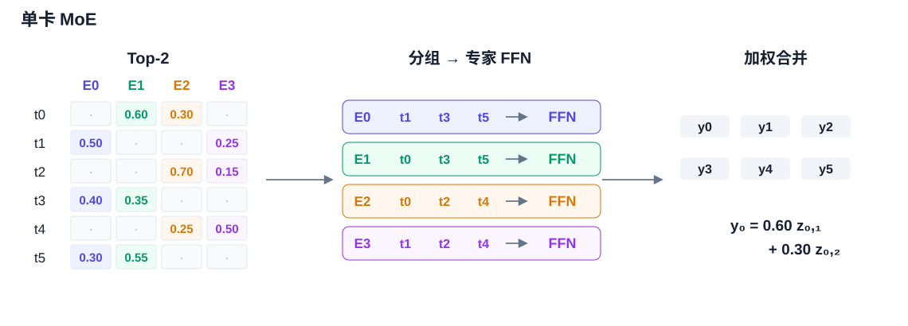
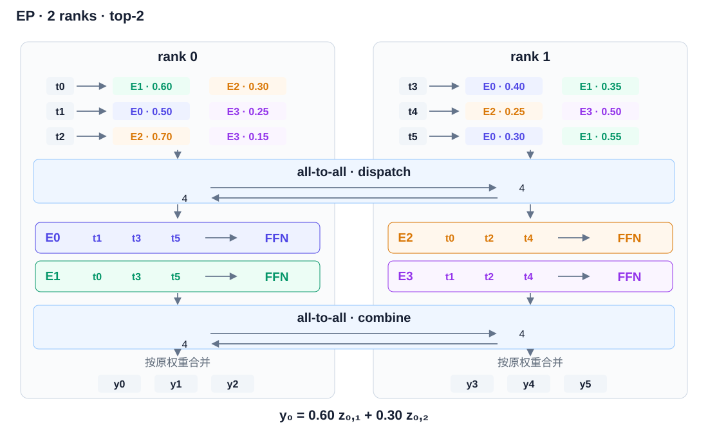

# Expert Parallel：路由、分发与负载均衡

第 7 章 · Expert Parallel

混合专家模型（Mixture of Experts, MoE）为每个 token 选择少数专家执行计算。专家并行（Expert Parallel, EP）把这些专家分布到不同 GPU：先把 token 分发到目标专家，算完后再把输出送回来源 GPU 并合并。本节先走通单卡 MoE，再用同一组 token 观察多卡执行增加了哪些步骤。

## 01 · MoE：从稠密 FFN 到稀疏专家 { #moe }

Transformer 的前馈网络（Feed-Forward Network, FFN）对每个 token 执行相同的一组矩阵乘和激活函数。MoE 用多个并列的 FFN 替换这一分支，每个 FFN 称为一个**专家（expert）**，再由**路由器（router）**为每个 token 选择要执行的专家。专家的中间维度由模型设计决定，可以与原稠密 FFN 相同，也可以更小。

设本次处理 $T$ 个 token、共有 $E$ 个专家，每个 token 选择得分最高的 $k$ 个专家，即 **top-k 路由**。一条“token → 专家”的执行任务称为一个 **assignment**；因此，未丢弃分支时共有 $T\times k$ 条 assignment。

在专家宽度固定的条件下，增加 $E$ 会增加路由专家分支的参数量，而单 token 的专家计算主要随 $k$ 增长。例如，各专家与作为比较基准的稠密 FFN 同宽时，256 个专家、top-2 对应约 256 份专家参数和每 token 约 2 份专家 FFN 计算。这个比例只适用于路由专家分支；整模型还有 attention、router，以及某些模型中每个 token 都会经过的共享专家等开销。

### 单卡 MoE 的前向流程

下面固定使用 **6 个 token、4 个专家、top-2**。示例 router 先通过一层 Linear 为每个 token 生成 $E$ 个分数，再沿专家维做 softmax，得到 $T\times E$ 的概率矩阵。选择 top-2 后，保留所选两项作为输出的加权系数；本例不对这两项重新归一化。

记 $z_{t,i}$ 为专家 $E_i$ 对 token $t$ 的输出，$y_t$ 为该 token 合并后的 MoE 输出。下图只显示 top-2 选中的概率，颜色表示目标专家。

*同一个 token 出现在两个专家的输入中，对应两条 assignment。全部专家位于同一张卡，因此分组、专家计算和输出合并均在本地完成，无跨卡通信。*

1. **选择专家。** 例如 $t_0$ 选择 $E_1$ 和 $E_2$，权重分别是 $0.60$ 和 $0.30$。两条 assignment 携带同一个输入向量，但使用不同专家的参数。
2. **按专家分组。** `permute` 根据路由结果复制并重排 token，使同一个专家的输入在内存中连续。例如 $E_0$ 处理 $t_1,t_3,t_5$。
3. **执行专家 FFN。** 每个专家批量处理自己的 token，依次完成输入投影、激活函数和输出投影。矩阵乘通常以 GEMM（通用矩阵乘）实现；Grouped GEMM 将多个专家的矩阵乘组织起来执行，并不把整个 FFN 变成一次矩阵乘。
4. **恢复顺序并加权合并。** `unpermute` 利用保存的映射，把各专家输出送回原 token 对应的位置，再合并其两条分支。例如 $y_0=0.60z_{0,1}+0.30z_{0,2}$，最终输出与输入形状相同。

这张图中的每个专家恰好收到 3 条 assignment。真实路由未必均匀，后面的负载均衡部分会解释这一问题。先看专家分到不同卡后，同一条前向流程如何执行。

## 02 · EP：专家在各卡上的放置 { #ep }

随着专家数量和模型层数增加，专家权重及其训练状态会占用大量显存。EP 按专家分摊这些状态：每张卡只保存一部分专家，并接收路由给这些专家的 token。参与并行的 GPU 进程称为一个 rank。

统计显存时需要区分单层与全模型。例如，[DeepSeek-V3 技术报告 §4.2](https://arxiv.org/html/2412.19437v2#S4.SS2)给出的隐藏维度为 7168，专家中间维度为 2048，每层有 256 个路由专家。按每个专家的 gate、up、down 三组投影计算，**单层路由专家约有 11.27B 参数，BF16 权重约占 22.5 GB**（每参数 2 字节，GB 按十进制计）。全模型有 58 个这样的 MoE 层，训练时还需保存梯度、优化器状态和激活，不能把全模型开销直接作为单层权重大小。

本节采用均匀放置：专家数能被 EP rank 数整除，每卡持有相同数量的专家。沿用前面的 4 个专家，将 $E_0,E_1$ 放在 rank 0，将 $E_2,E_3$ 放在 rank 1。单个专家在所属 rank 上保持完整；若进一步切分其内部矩阵，则称为专家张量并行（expert Tensor Parallel，expert TP），第 05 节再说明其组合方式。

专家放置后，token 与目标专家可能位于不同 rank。向专家发送输入称为 **dispatch（分发）**，将专家输出返回来源 rank 并合并称为 **combine（合并）**。下面采用 all-to-all 数据交换来实现它们。

## 03 · EP 的分发与合并流程 { #a2a }

仍用同样的 6 个 token 和 top-2 结果：rank 0 最初持有 $t_0,t_1,t_2$，rank 1 持有 $t_3,t_4,t_5$。每个 rank 先对自己的 token 计算路由，再根据目标专家所在位置组织发送。

*颜色和路由权重与单卡图一致，通信箭头上的数字表示跨卡 assignment 数。两次 all-to-all 分别搬运专家输入和专家输出；目标位于本卡的 assignment 留在本地。图中专家输入已按本地专家排好，折叠了接收端 regroup；combine 前也需撤销这次重排。*

前向按以下顺序执行：

| 阶段 | 当前数据与操作 | 得到什么 |
| --- | --- | --- |
| 来源端重排 | 根据路由复制 token，并用 `permute` 把发往同一目标 rank 的 assignment 放在一起 | 按目标 rank 分段的发送 buffer |
| Dispatch | all-to-all 交换输入；接收端再按本地专家分组，这次重排称为 `regroup` | 每个本地专家连续的输入 |
| 专家计算 | 各专家执行与单卡相同的 FFN | 按本地专家排列的分支输出 |
| Combine | 撤销接收端 regroup，再通过 all-to-all 将输出送回来源 rank | 来源 rank 收齐自己 token 的各分支输出 |
| 来源端合并 | 根据保存的映射恢复 token 顺序，并按原路由权重相加 | 每个 token 的最终输出 $y_t$ |

例如 $t_0$ 的 $E_1$ 分支留在 rank 0，$E_2$ 分支发到 rank 1。计算后，$z_{0,2}$ 返回 rank 0，与本地的 $z_{0,1}$ 按 $0.60$、$0.30$ 加权，仍得到单卡图中的 $y_0$。**EP 改变了数据位置和传输路径，保留了同一组专家计算与合并结果。**

这里的两次 all-to-all 指前向激活的分发与返回。实现还可能通信路由权重和计数等元数据，因此不能据此推断 profiler 中所有集合通信的调用次数。`permute`、`regroup` 和 `unpermute` 本身是本地数据重排；融合实现可以合并步骤，但仍需完成相同的布局转换。具体实现见 [7.2 · Megatron 实现](06-ep-source.md)。

### 各卡的发送量与接收量

设 **rank 0 持有 $E_0,E_1$，rank 1 持有 $E_2,E_3$**，每个 token 只选一个专家（top-1）。两卡各有 3 个 token，路由如下：

| token 来源 | → $E_0$（rank 0） | → $E_1$（rank 0） | → $E_2$（rank 1） | → $E_3$（rank 1） |
| --- | --- | --- | --- | --- |
| rank 0：`a,b,c` | `a` | — | `b` | `c` |
| rank 1：`d,e,f` | `d` | `e,f` | — | — |

**同一目标卡上两个专家的 token 合并计数。** 发送列表称为 `input_splits`，按目标卡排列；接收列表称为 `output_splits`，按来源卡排列。两种列表的顺序均为 `[rank 0, rank 1]`：

| 当前卡 | 发送 `input_splits` | 接收 `output_splits` |
| --- | --- | --- |
| rank 0 | `[1,2]` | `[1,3]` |
| rank 1 | `[3,0]` | `[2,0]` |

例如 rank 0 留下 `a`，发出 `b,c`；接收时，来自自己的是 `a`，来自 rank 1 的是 `d,e,f`，因此接收列表为 `[1,3]`。

列表包含本卡项，但本卡数据不走网络。发送计数由本地路由得到，接收计数需先与其他卡交换信息，再据此执行 all-to-all。

## 04 · 负载不均与路由调节 { #balance }

Router 按分数选择专家，不能保证每一步都均匀分配。若大量 assignment 集中到少数专家，所属 rank 就需要接收更多数据、执行更多计算；其他 rank 可能在 combine 或后续同步点等待。因此，需要同时观察每个专家和每张卡的负载。

### 专家负载与各卡接收总量

沿用 $T$ 个 token、$E$ 个专家和 top-$k$，未丢弃分支时总任务数为 $T k$，平均每专家负载为 $\bar n=T k/E$。在当前 EP 组内，记专家 $i$ 收到的任务数为 $n_i$，rank $r$ 的接收总量为 $R_r$。本节未使用 expert TP，因此 $R_r$ 就是该 rank 的 `output_splits` 各项之和，也等于其本地专家的任务数之和。

| 观察对象 | 指标 | 含义 |
| --- | --- | --- |
| 各专家 | $\max_i n_i/\bar n$ | 最忙专家相对平均负载的倍数 |
| 各 rank | $\max_r R_r/\operatorname{mean}_r R_r$ | 接收总量最多的卡相对各卡平均值的倍数 |

例如两卡的接收列表分别为 `[100,100]` 和 `[10,10]`，总量就是 200 和 20。只看单张卡列表内部的最大值与平均值会得到两个 1，无法发现卡间负载差异。详细的监测指标和性能归因见 [7.3 · 性能优化](06-ep-performance.md#balance)。

### 调整专家选择与限制执行容量

降低失衡有两类方法：训练或调整 router，使专家选择更均匀；或者在执行前限制每个专家接收的任务数。常见机制如下。

| 机制 | 如何起作用 | 需要权衡什么 |
| --- | --- | --- |
| 辅助损失（aux loss） | 给训练损失增加均衡项，通过梯度调节 router 的选择概率 | 系数过大可能干扰主任务学习 |
| 动态专家偏置（expert bias） | 根据负载降低热门专家的排名分数、提高空闲专家的排名分数；偏置只影响选择，不进入输出加权系数 | 更新过快或过慢都会影响负载控制 |
| 专家容量（capacity） | 在指定路由范围内设定每专家的 assignment 上限，对超限分支执行丢弃等策略 | 控制最坏负载，但被丢弃分支无法贡献原本的输出 |

以常见的辅助损失为例，令 $P_i$ 为 router 分配给专家 $i$ 的平均 softmax 概率，$f_i$ 为该专家在丢弃前被选中的 assignment 比例。均衡项为：

$$
\mathcal L_{\mathrm{aux}}=\alpha E\sum_{i=0}^{E-1}f_iP_i.
$$

$\alpha$ 是辅助损失系数，控制均衡约束相对主任务损失的强度。离散计数 $f_i$ 通常不参与反向，梯度经 $P_i$ 回到 router，使过载专家受到更强的概率惩罚。动态 expert bias 则直接依据负载修正下一批次的排名，不需要通过辅助损失梯度更新偏置；这种均衡方法称为 aux-loss-free。公式推导、统计范围与不同变体见 [MoE 负载均衡辅助损失](moe-aux-loss.md)。

执行时，**drop-and-pad** 为每个专家分配固定容量，超出的 assignment 丢弃，不足的用 padding 补齐；固定输入规模有利于 buffer 规划和图捕获，但路由、重排与通信仍然存在，不能理解为“没有动态开销”。**Dropless** 保留全部 assignment，由通信与专家计算处理变长负载，也可能为了内核对齐而少量补齐。两者都不能代替对 router 负载的调节。

容量公式、丢弃与 padding 的开销估算，以及实现配置统一放在 [7.3 · 性能优化](06-ep-performance.md#balance)中，便于结合实际瓶颈分析。

## 05 · EP 与 TP / DP / PP 的进程组组合 { #compose }

EP 可以与前面介绍的张量并行（TP）、数据并行（DP）和流水线并行（PP）配合。同一批物理 GPU 在稠密区和专家区可以采用不同的分工：稠密区使用 TP 和 DP；专家区使用 EP，还可以继续切分单个专家，或者保存专家的多个副本。

| 专家区的进程组 | 分工 | 通信职责 |
| --- | --- | --- |
| EP | 不同 rank 持有不同专家 | 分发输入、返回专家输出 |
| expert TP | 多个 rank 分摊一个专家内部的矩阵 | 完成专家内部的 TP 通信；在 Megatron 标准 A2A dispatcher 路径中，dispatch 后 gather 输入、combine 前 reduce-scatter 输出 |
| expert DP | 多组 rank 保存相同专家参数的副本 | 同步对应专家的梯度 |

以 8 张卡、8 个专家为例，设 PP=1、CP=1。稠密区使用 TP=2、DP=4；专家区使用 EP=4、expert TP=1、expert DP=2。两侧卡数相同：$2\times4=4\times1\times2=8$。其中 EP×expert TP 是一份专家模型副本使用的卡数，乘以 expert DP 才是当前 stage 的总卡数。

*上下两图均按首行 GPU0–3、次行 GPU4–7 排列。稠密区相邻两卡组成 TP 组；专家区每行四卡组成 EP 组，同列两卡同步相同专家的梯度。进程组通常在初始化时建立，执行相应模块时使用对应的组。*

这个组合还需要对齐模块边界的 token 布局。例如稠密区启用 SP 时，同一 TP pair 的两卡分别持有不同序列片段，可以作为专家区各 rank 的本地路由输入，避免把复制的 token 重复送入专家。PP>1 时，先把模型层分到不同 stage，再在每个 stage 内组织这些进程组。

!!! tip "学完自测"

    1. 固定专家宽度时，$E$ 与 $k$ 分别影响路由专家分支的哪些开销？为什么不能直接据此推导整模型的参数与计算倍率？
    2. 双卡例子中，$t_0$ 的两条 assignment 分别去哪里计算，最终在哪张卡加权合并？
    3. 来源端 permute 与接收端 regroup 分别为通信和专家计算准备什么布局？combine 怎样撤销这些重排？
    4. 如何从发送计数表得到每卡的接收列表？比较各卡负载时，为什么需要先对接收列表求和？
    5. aux loss、expert bias 和 capacity 分别改变路由或执行流程的哪一部分？
    6. 在 8 卡例子中，GPU0/1 在稠密区和专家区分别承担什么分工？
