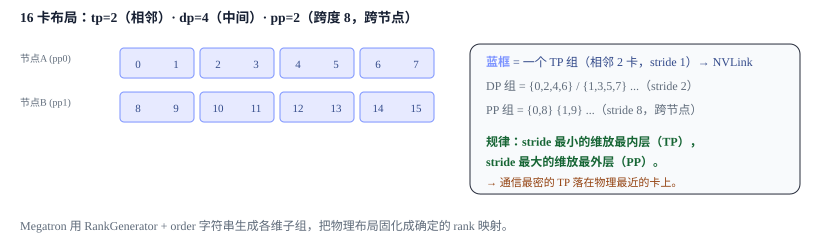
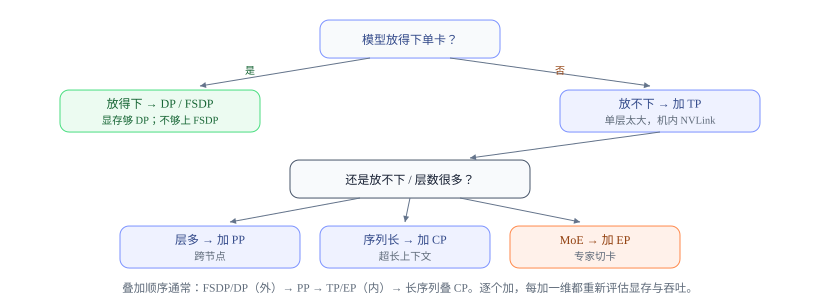

# 多维组合并行：rank 网格、拓扑映射与选型

<div class="notebook-hero" markdown>

<span class="chapter-kicker">第 8 章 · 多维组合并行</span>

大模型训练通常组合 DP/FSDP、TP、PP、CP 与 EP。组合过程包含两层：先用多维 rank 网格定义各进程组，再把 global rank 映射到具体节点、GPU 与网络链路。PyTorch 常用 `DeviceMesh` 表达前一层；Megatron-LM 主要由 `parallel_state` / `RankGenerator` 生成进程组，并不要求使用 PyTorch `DeviceMesh` 对象。

**本章关键词：** 🗺️ DeviceMesh / parallel_state · 🎯 逻辑顺序与物理映射 · 🌳 选型决策树 · ⚙️ AC / FP8 / overlap

</div>


## 01 · 并行维度的组合 { #combine }

前面六章每一种并行都解决一个特定问题，但单独使用往往不足：经典 DDP 不切模型状态、TP 跨节点时容易受带宽和时延限制、PP 会引入流水线气泡。因此实际训练会把它们**叠加使用**，形成 3D / 4D / 5D 并行。例如一种常见配置是：

- 机内 8 卡做 **TP**（吃 NVLink 带宽）
- 若干机做 **PP**（跨节点，通信稀疏）
- 剩下的卡做 **FSDP/DP**（最外层，梯度可重叠）
- 长序列再叠 **CP**，MoE 再叠 **EP**

关键问题变成：**这成百上千张卡，谁和谁组成一个 TP 组、谁和谁组成 PP 组？**


## 02 · 逻辑 rank 网格与进程组 { #mesh }

不论框架接口叫什么，都可以先给每个 global rank 分配一组逻辑坐标 $(\text{tp\_rank},\text{dp\_rank},\text{pp\_rank},\ldots)$，再固定坐标展开顺序。以 16 个 rank、$\text{tp}=2,\text{dp}=4,\text{pp}=2$ 为例，若选择 TP 最快变化、PP 最慢变化的顺序，则逻辑编号为：

$$ \text{global\_rank} = \text{tp\_rank} + \text{dp\_rank}\times 2 + \text{pp\_rank}\times 8 $$




*示例假设 global rank 0–7 位于节点 A、8–15 位于节点 B，因此 TP 相邻 rank 落在节点内、PP 组跨节点。公式只定义逻辑组；是否真的对应 NVLink 或跨节点，还取决于 launcher 的 rank-to-device 映射。*


## 03 · 从通信特征到拓扑映射 { #placement }

| 维度 | 常见放置方式 | 为什么 |
| --- | --- | --- |
| **TP** | 通常优先放在节点内高速域 | 每层多次同步，且位于层内数据依赖边界 |
| **EP** | 尽量让高流量 A2A 留在高速域；大规模时采用分层通信 | 每个 MoE 层 dispatch/combine，消息与 top-k、token 数和拓扑相关 |
| **CP** | 根据 Ring / A2A 路线映射到适合的节点内或分层通信域 | 注意力中的 K/V 交换频繁，且路由不同会改变拓扑需求 |
| **DP / FSDP** | 常作为外层扩展维度 | DDP 梯度 bucket、FSDP 每 unit 的 AG/RS 常可与反向或预取重叠，但并非每 step 只有一次通信 |
| **PP** | 常用于跨节点扩展 | 只在 stage 边界通信，频率较低；边界激活仍可能很大，需检查负载均衡与链路带宽 |

Megatron 的 `RankGenerator` 用 `order` 字符串描述坐标展开顺序。例如 `order='tp-cp-ep-dp-pp'` 中，左侧维度变化更快、stride 更小：


**Megatron-LM · core/parallel_state.py（示意调用）**


```python
def initialize_model_parallel(..., order="tp-cp-ep-dp-pp"):
    data_parallel_size = world_size // (tp * pp * cp)   # dp 由 world_size 反推
    decoder_rank_generator = RankGenerator(
        tp=tensor_model_parallel_size, ep=1, dp=data_parallel_size,
        pp=pipeline_model_parallel_size, cp=context_parallel_size, order=order, ...)
```

`RankGenerator` 根据 `order` 为 TP / CP / EP / DP / PP 生成进程子组。修改 `order` 会改变**哪些 global rank 属于同一组**，但不会单独改变 GPU 的物理连线，也不能保证相邻 rank 一定共享 NVLink。只有当作业启动器把相邻 global rank 放到同一节点或同一高速互联域时，较小 stride 才转化为物理邻近。多维并行的完整映射因此是 `order` 与 launcher rank placement 的共同结果。


## 04 · 选型决策树 { #decision }




*实践选型：先用最省事的 FSDP/DP，按瓶颈逐维叠加。*


## 05 · 通用工程调优 { #eng }

- **激活重计算（activation checkpointing）**：前向不存中间激活，反向时重算——用算力换显存。可选择性只重算最贵的几层。
- **混合精度 BF16 / FP8**：参数计算、参数通信、梯度归约和主权重可以分别选择 dtype；`MixedPrecisionPolicy` 的 `param_dtype` / `reduce_dtype` 只是其中一套实现接口。低精度可能降低计算或通信成本，但不能把“归约固定用 FP32”当成统一规则。
- **通信-计算重叠**：贯穿全书的命脉——DP 反向边算边 all-reduce、FSDP 预取参数、PP 异步 p2p、EP 用 shared expert 盖住 all-to-all。
- **profiling**：用 torch profiler / nsys 定位是通信瓶颈、气泡还是 OOM，再针对性调维度配比。


## 06 · 显存账本与通信原语总结 { #summary }

回到第 1 章的地图，各并行维度可以统一理解为：**选择要切分的状态、激活或计算，再用相应通信原语满足未被切分的数据依赖**。

| 模块 | 切账本里的 | 主原语 | 常见位置 |
| --- | --- | --- | --- |
| DP | 数据（状态冗余） | all-reduce | 外 |
| FSDP | 参数+梯度+优化器状态 | all-gather + reduce-scatter | 外 |
| TP+SP | 层内参数与计算 / 激活 | all-reduce / AG+RS | 最内 |
| PP | 层（深度） | send/recv | 最外 |
| CP | 序列维激活 | ring p2p / all-to-all | 中 |
| EP | 专家（MoE） | all-to-all | 内 |


!!! tip "✅ 学完自测"

    1. 在什么通信与 rank-placement 条件下，TP 适合较小 stride、PP 适合较大 stride？
    2. 给定「模型 70B、序列 128k、512 卡」，你会怎么排布各并行维度？
    3. Megatron 的 `order='tp-cp-ep-dp-pp'` 里，把某一维左移/右移会改变什么？哪些通信特征与 launcher 映射条件会让 CP 紧贴 TP 更合适？
    4. 激活重计算用什么换什么？它和并行维度的选择如何相互影响？


!!! note "🎓 读完了"

    你已经走完 DP → FSDP → TP/SP → PP → CP → EP → nD 的完整路线。想回顾全局，可以[回到第 1 章](00-foundations.md)重读那张「显存账本 + 通信原语」的地图，会发现每种并行都对得上号。词表并行交叉熵的完整推导见第 4 章的 [Loss Parallel](loss-parallel.md)。
