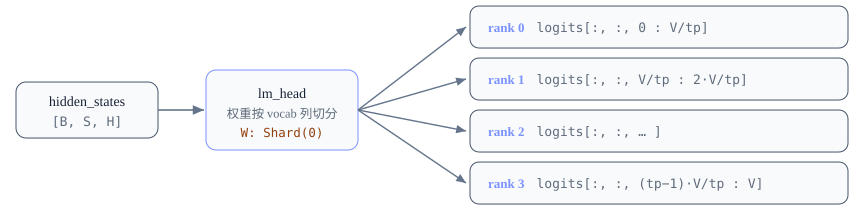
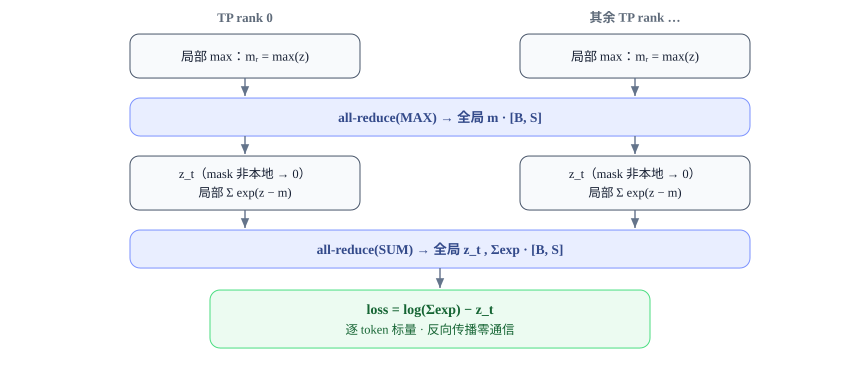
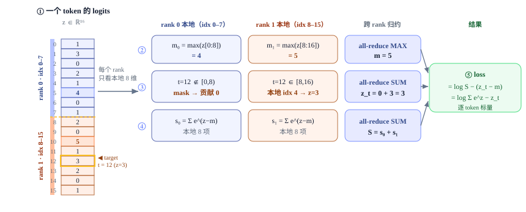

# Loss Parallel 深入解析 词表并行交叉熵的原理与 Megatron-LM 实现

<div class="notebook-hero" markdown>

<span class="chapter-kicker">Distributed Training · Tensor Parallel</span>

当词表大到把 logits 全聚合（all-gather）变得不可承受时，如何只用几个标量的通信就算出一模一样的交叉熵？
本文从数学原理出发，逐行解读 Megatron-LM 的显式 autograd 实现，并介绍与之正交、同样降显存的分块计算（chunked loss）技术。

**本章关键词：** 📐 Log-Sum-Exp 分解 · 🔁 All-Reduce vs All-Gather · 🟢 Megatron-LM 源码 · 🧮 反向传播零通信

</div>


## 01 · 为什么需要 Loss Parallel { #bg }

现代 LLM 的词表（vocabulary）越来越大：Llama 3 是 `128,256`，一些多语言模型超过 `256k`。
当我们用 **张量并行（Tensor Parallelism, TP）** 训练时，最后的输出投影 `lm_head`
（把隐藏维 $H$ 映射到词表维 $V$）通常采用 *列切分（column-wise / ColwiseParallel）*：
权重按 $V$ 维切成 `tp` 份，每个 rank 只算出 logits 的一个词表切片。

于是前向结束时，logits 在物理上是这样分布的：




*每个 TP rank 只持有 logits 的一段 `[B, S, V/tp]`，没有任何一个 rank 看得到完整词表。*


要算交叉熵（cross-entropy），**朴素做法**是先把这些切片 `all-gather` 拼成完整的
`[B, S, V]`，再走标准的 softmax + NLL。问题在于这个张量极其巨大：


!!! warning "⚠️ 朴素 all-gather 的代价"

    以 $S=8192,\ B=1,\ V=128256$、fp32 为例，完整 logits 张量约为
    $8192 \times 128256 \times 4\,\text{B} \approx \mathbf{4.2\,GB}$。这个张量不仅要在
    **通信**上全聚合一遍，还要在每个 rank 上完整**驻留**用于反向 —— 在长序列下直接 OOM。
    而它仅仅是为了得到一个 `[B, S]` 的标量 loss。


**Loss Parallel（也叫 Vocab Parallel Cross Entropy）** 的核心洞察是：
交叉熵的最终结果只是每个 token 的一个标量，沿词表维 $V$ 做的是**归约（reduction）**操作。
既然如此，我们完全可以让每个 rank 在自己的 $V/tp$ 切片上做局部归约，
再用 `all-reduce` 把几个 `[B, S]` 大小的**标量**合并起来 ——
通信量从「整个 logits 张量」骤降到「三个逐 token 标量」。


## 02 · 数学原理：交叉熵的可分片分解 { #math }

对单个 token，设其 logits 向量为 $z \in \mathbb{R}^V$，目标类别为 $t$。交叉熵损失为：

$$
\mathcal{L} = -\log \mathrm{softmax}(z)_t
= -\log \frac{e^{z_t}}{\sum_{j=1}^{V} e^{z_j}}
= \underbrace{\log \sum_{j=1}^{V} e^{z_j}}_{\text{LogSumExp}} \;-\; z_t
$$

直接对大 logits 取指数会数值溢出，所以引入 **log-sum-exp 稳定化**：减去全局最大值
$m = \max_j z_j$，结果在数学上完全等价：

$$
\mathcal{L} = \log \sum_{j=1}^{V} e^{\,z_j - m} \;-\; (z_t - m), \qquad m = \max_{j} z_j
$$

现在关键来了。把词表切成 $P$ 份（$P=\text{tp}$），rank $r$ 持有区间 $[a_r, b_r)$ 的 logits。
上式里所有沿 $V$ 的运算都可以拆成「**每个 rank 算局部值 → 跨 rank 归约**」两步：

| 需要的全局量 | 局部计算（rank r） | 归约方式 | 通信张量大小 |
| --- | --- | --- | --- |
| $m = \max\limits_{j} z_j$ | $m_r = \max\limits_{j \in [a_r, b_r)} z_j$ | `all-reduce(MAX)` | `[B, S]` |
| $z_t$（目标 logit） | 若 $t \in [a_r, b_r)$ 取 $z_t$，否则取 $0$ | `all-reduce(SUM)` | `[B, S]` |
| $\sum\limits_{j} e^{z_j - m}$ | $\sum\limits_{j \in [a_r, b_r)} e^{z_j - m}$ | `all-reduce(SUM)` | `[B, S]` |


!!! tip "🔑 核心结论"

    原本需要传输 $O(B\!\cdot\!S\!\cdot\!V)$ 的完整 logits，现在只需 **3 次** 对
    $O(B\!\cdot\!S)$ 标量的 all-reduce。目标 logit 的「只有持有者贡献、其余贡献 0」这一性质，
    正是通过一个 **target mask** 实现的 —— 这是词表并行交叉熵实现里反复出现的关键技巧。


那个「贡献 0」的 mask 具体是：rank $r$ 把不属于自己区间的 target 位置置零，

$$
\text{mask}_r = \mathbb{1}[\,t < a_r \;\lor\; t \ge b_r\,], \qquad
\hat{z}_{t,r} = \begin{cases} z_t - m & t \in [a_r, b_r) \\ 0 & \text{otherwise}\end{cases}
$$

求和后 $\sum_r \hat{z}_{t,r} = z_t - m$ 恰好还原出唯一持有者的那个值。整个前向通信流如下：




*三次小张量 all-reduce 取代一次巨型 all-gather。*


### 2.1 一个具体例子：单 token 视角，`V=16`，`tp=2`

把上面的抽象落到一个 token 上。假设词表只有 16 个词，于是这个 token 的 logits 就是一个
**16 行 1 列**的小列向量 $z \in \mathbb{R}^{16}$。`tp=2` 把它沿词表维劈成两半：
rank 0 拿走 idx 0–7，rank 1 拿走 idx 8–15。
设真实标签是 **t = 12**（落在 rank 1 上，$z_{12}=3$）。下图走一遍完整流程：




*单 token、`V=16`、`tp=2` 的完整流程：每个 rank 只在本地 8 维上算 ②max ③目标 logit（靠
mask 让非持有者贡献 0）④局部 Σexp，再用三次小 all-reduce 合并出 ⑤ 标量 loss。全程没有任何 rank 物化完整的 16 维 logits。*


## 03 · 通信量分析：省了几个数量级 { #comm }

用上面的配置（$S=8192,\ B=1,\ V=128256,\ \text{tp}=8$，fp32）对比一下：

| 方案 | 跨 rank 传输的张量 | 单次量级 | 是否需驻留完整 logits |
| --- | --- | --- | --- |
| 朴素 all-gather + CE | 完整 logits `[B, S, V]` | ≈ 4.2 GB | ✅ 需要（反向也要） |
| **Loss Parallel** | 3 × 标量 `[B, S]` | ≈ 3 × 32 KB ≈ **96 KB** | ❌ 只需本地 `[B,S,V/tp]` |

通信量相差约 **4 个数量级**，而且每个 rank 的峰值显存里再也不会出现完整的 $V$ 维 logits。
更妙的是，正如第 7 节会展开的，**反向传播完全不需要额外通信**。


## 04 · Megatron-LM 源码逐行解读 { #megatron }

Megatron 把上面的数学**显式地**写成一个 `torch.autograd.Function`，自己管理所有
`all_reduce` 调用。代码位于 `megatron/core/tensor_parallel/cross_entropy.py`。
注意 Megatron 内部用 *序列优先*布局 `[s, b, V/tp]`。


### 4.1 算法被拆成 5 个静态方法

`VocabParallelCrossEntropy` 类把流程切成可复用的纯函数，未融合版和融合版共用它们。
先看前向第一步 —— 求全局 max：


**megatron/core/tensor_parallel/cross_entropy.py · calculate_logits_max**


```python
@staticmethod
def calculate_logits_max(vocab_parallel_logits):
    vocab_parallel_logits = vocab_parallel_logits.float()      # CE 一律在 fp32 下算，保证数值稳定
    logits_max = torch.max(vocab_parallel_logits, dim=-1)[0]   # 沿本地 V/tp 维取局部最大
    return vocab_parallel_logits, logits_max
```

第二步是整段逻辑的精华 —— 构造 target mask、收集 predicted logit、算局部 sum-exp：


**calculate_predicted_logits（已精简注释）**


```python
@staticmethod
def calculate_predicted_logits(vocab_parallel_logits, target, logits_max,
                               vocab_start_index, vocab_end_index):
    # 原地减去 max：既做数值稳定，又省显存
    vocab_parallel_logits -= logits_max.unsqueeze(dim=-1)

    # 【关键】构造 mask：target 落在本 rank 词表区间之外的位置 = 1（需要被屏蔽）
    target_mask = (target < vocab_start_index) | (target >= vocab_end_index)
    masked_target = target.clone() - vocab_start_index   # 平移到本地列索引
    masked_target[target_mask] = 0                        # 越界的暂时指向 0 号列（占位）

    # 用高级索引一次性取出每个 token 的 predicted logit = z_t - m
    logits_2d = vocab_parallel_logits.view(-1, partition_vocab_size)
    masked_target_1d = masked_target.view(-1)
    arange_1d = torch.arange(0, logits_2d.size()[0], device=logits_2d.device)
    predicted_logits_1d = logits_2d[arange_1d, masked_target_1d]
    predicted_logits = predicted_logits_1d.view_as(target)
    predicted_logits[target_mask] = 0.0   # 不属于本 rank 的 token 贡献置 0 —— 求和时自动还原

    # 局部 sum-exp
    exp_logits = vocab_parallel_logits
    torch.exp(vocab_parallel_logits, out=exp_logits)   # exp_logits = exp(z - m)
    sum_exp_logits = exp_logits.sum(dim=-1)
    return target_mask, masked_target_1d, predicted_logits, sum_exp_logits, exp_logits
```

`vocab_start_index / vocab_end_index` 来自一个极简的工具函数 —— 词表就是均匀切的：


**megatron/core/tensor_parallel/utils.py · VocabUtility**


```python
@staticmethod
def vocab_range_from_per_partition_vocab_size(per_partition_vocab_size, rank, world_size):
    index_f = rank * per_partition_vocab_size
    index_l = index_f + per_partition_vocab_size
    return index_f, index_l   # rank r 拥有 [r·Vp, (r+1)·Vp)
```


### 4.2 前向：把局部量 all-reduce 成全局量

`_VocabParallelCrossEntropy.forward` 把上面的静态方法串起来，插入 **三次 all-reduce**
（注意 max 一次、predicted 与 sum-exp 各一次）：


**_VocabParallelCrossEntropy.forward（精简）**


```python
@staticmethod
def forward(ctx, vocab_parallel_logits, target, label_smoothing=0.0):
    vocab_parallel_logits, logits_max = VocabParallelCrossEntropy.calculate_logits_max(vocab_parallel_logits)
    # ① 全局 max
    torch.distributed.all_reduce(logits_max, op=ReduceOp.MAX, group=get_tensor_model_parallel_group())

    vocab_start_index, vocab_end_index = get_vocab_range(partition_vocab_size, rank, world_size)
    (target_mask, masked_target_1d, predicted_logits, sum_exp_logits, exp_logits) = \
        VocabParallelCrossEntropy.calculate_predicted_logits(
            vocab_parallel_logits, target, logits_max, vocab_start_index, vocab_end_index)

    # ② 把各 rank 的 predicted logit 求和（mask 保证只有持有者非零）
    torch.distributed.all_reduce(predicted_logits, op=ReduceOp.SUM, group=get_tensor_model_parallel_group())
    # ③ 把各 rank 的局部 sum-exp 求和，得到全局分母
    torch.distributed.all_reduce(sum_exp_logits, op=ReduceOp.SUM, group=get_tensor_model_parallel_group())

    exp_logits, loss = VocabParallelCrossEntropy.calculate_cross_entropy_loss(
        exp_logits, predicted_logits, sum_exp_logits)   # loss = log(Σexp) − z_t

    ctx.save_for_backward(exp_logits, target_mask, masked_target_1d)  # exp_logits 此刻已被归一化成 softmax
    return loss
```

第三步 `calculate_cross_entropy_loss` 同时完成 loss 计算与 softmax 归一化（为反向铺路）：


**calculate_cross_entropy_loss**


```python
@staticmethod
def calculate_cross_entropy_loss(exp_logits, predicted_logits, sum_exp_logits):
    loss = torch.log(sum_exp_logits) - predicted_logits   # 正是 log(Σexp(z−m)) − (z_t−m)
    exp_logits.div_(sum_exp_logits.unsqueeze(dim=-1))      # 原地归一化 → 本地 softmax 切片，留给 backward
    return exp_logits, loss
```


!!! note "💡 注意 in-place 的连环妙用："

    `vocab_parallel_logits` 先被原地减 max、再被原地 `exp` 覆盖成 `exp_logits`，
    最后又被原地 `div_` 成 softmax。整个过程**没有额外分配一份 $V/tp$ 大小的张量**，
    对长序列训练的显存非常友好。


### 4.3 模型侧如何接入

在 `language_module.compute_language_model_loss` 里，先把 `[b, s]` 转成序列优先的
`[s, b]`，再根据配置选择 融合 / 原生 / TE 版本：


**megatron/core/models/common/language_module/language_module.py**


```python
def compute_language_model_loss(self, labels, logits):
    labels = labels.transpose(0, 1).contiguous()        # [b s] => [s b]
    if self.config.cross_entropy_loss_fusion:
        if self.config.cross_entropy_fusion_impl == 'te':
            loss = te_parallel_cross_entropy(logits, labels, self.pg_collection.tp, is_cg_capturable)
        elif self.config.cross_entropy_fusion_impl == 'native':
            loss = fused_vocab_parallel_cross_entropy(logits, labels, self.pg_collection.tp)
    else:
        loss = tensor_parallel.vocab_parallel_cross_entropy(logits, labels)   # 未融合版
    return loss.transpose(0, 1).contiguous()            # [s b] => [b s]
```


## 05 · Megatron 的 Fused 版本：把两次通信合并成一次 { #fused }

融合版 `fused_cross_entropy.py` 算法完全一致，但做了两个工程优化：
**（1）用 `@jit_fuser` 把逐元素 kernel 融合**；
**（2）把 predicted\_logits 和 sum\_exp\_logits 拼接成一个张量，只发一次 all-reduce**。


**megatron/core/fusions/fused_cross_entropy.py**


```python
@jit_fuser
def calculate_predicted_logits(vocab_parallel_logits, target, logits_max,
                               vocab_start_index, vocab_end_index):
    (target_mask, masked_target_1d, predicted_logits, sum_exp_logits, exp_logits) = \
        VocabParallelCrossEntropy.calculate_predicted_logits(...)
    # 【合并通信】把两个 [s,b] 标量拼成一个张量，下面只需一次 all_reduce
    predicted_logits_sum_exp_logits = torch.cat((predicted_logits, sum_exp_logits))
    return target_mask, masked_target_1d, predicted_logits_sum_exp_logits, exp_logits


class _VocabParallelCrossEntropy(torch.autograd.Function):
    @staticmethod
    def forward(ctx, vocab_parallel_logits, target, tp_group):
        ...
        torch.distributed.all_reduce(logits_max, op=ReduceOp.MAX, group=tp_group)   # 仍是 max 一次
        ...
        # 原来要发两次（predicted + sum_exp），现在合并成一次 SUM all-reduce
        torch.distributed.all_reduce(predicted_logits_sum_exp_logits, op=ReduceOp.SUM, group=tp_group)
        ...
```

区别一目了然：未融合版发 **3 次** all-reduce（MAX + 2×SUM），融合版只发 **2 次**
（MAX + 1×SUM）。在 TP 通信频繁的训练里，少一次 kernel launch 和一次集合通信握手是有意义的。
融合版还把梯度直接 cast 回 `bfloat16`，省一步类型转换。


!!! note "🧩 三个后端："

    `native`（上面的 JIT 融合版）、`te`
    （TransformerEngine 的 CUDA kernel，支持 CUDA Graph 捕获 `is_cg_capturable`）、以及不开融合时的
    `vocab_parallel_cross_entropy`。三者数学等价，差别只在 kernel 实现与通信打包方式。


## 06 · 互补技术：序列维分块计算（Chunked Loss） { #chunked }

Loss Parallel 解决的是 *跨 rank* 的词表维通信。但即便词表被切成 $V/tp$，
单个 rank 上的 logits 切片 `[B, S, V/tp]` 在长序列下依然可能是显存大头。
另一种与之**正交**的通用技术，是从**序列维**下手做**分块计算（chunked loss）**，
进一步压低峰值显存：


!!! note "🧱 分块计算的核心思路"

    把 hidden states 沿 **seq 维**切成 $N$ 块，逐块跑 `lm_head` + `ce_loss` 并立即
    backward，再把各块梯度累加回完整的 hidden states 上反传回 decoder。这样任意时刻都只有
    **一块**的 logits 被物化，峰值显存从 $O(B\!\cdot\!L\!\cdot\!V)$ 降到 $O(B\!\cdot\!L/N\!\cdot\!V)$。


一个典型实现的流程大致如下（伪代码）：

```python
# 把 hidden states 沿 seq 维切成 N 块，逐块跑 lm_head + ce_loss，
# 峰值显存从 O(B·L·V) 降到 O(B·L/N·V)。
#
# 流程：
#   1. 模型 forward 时跳过 lm_head，只拿 hidden states [B, L, D]
#   2. 在边界处 detach hidden states（切断图，各块独立 backward）
#   3. 沿 seq 维切成 N 块
#   4. 暂时禁用 lm_head 权重的重新分片，让其在各块间保持就绪（避免重复 all-gather）
#   5. 逐块：lm_head(chunk) -> ce_loss -> backward()
#   6. 把各块梯度累加拼回完整的 [B, L, D]
#   7. 通过 hidden_states.backward(accumulated_grad) 反传回 decoder
```

两者是**正交且可叠加**的：分块计算沿 seq 维省显存，Loss Parallel 沿 vocab 维省通信。它们可以这样组合：


!!! tip "🔗 两个维度的协同"

    当同时启用 loss parallel 时，每个 chunk 进入 `lm_head` 后，**每个 TP rank 在自己的
    `V/tp` 切片上算局部 CE，内部再做一次 all-reduce 拿到正确的 log-sum-exp** ——
    也就是说，分块计算的每一块内部，跑的正是第 2 节那套词表并行交叉熵。
    序列维分块（省显存）× 词表维并行（省通信）= 长序列 + 大词表训练的完整解法。


## 07 · 反向传播为何零通信 { #backward }

这是 Loss Parallel 最优雅的地方。交叉熵对 logits 的梯度有一个干净的闭式解：

$$
\frac{\partial \mathcal{L}}{\partial z_j} = \mathrm{softmax}(z)_j - \mathbb{1}[j = t]
$$

注意右边两项**每个 rank 都已经在本地持有**：

- **softmax 切片**：前向时 `exp_logits` 已被原地归一化成本地 softmax（除以的是 all-reduce 后的全局分母），所以它已经是*正确的全局 softmax* 的本地切片。
- **one-hot 项**：只在持有该 target 的 rank 上、对应列减 1 —— 用的还是前向那个 `target_mask`。

因此整个 backward **没有任何 all-reduce / all-gather**，纯本地逐元素运算：


**megatron/core/tensor_parallel/cross_entropy.py · backward**


```python
@staticmethod
def backward(ctx, grad_output):
    softmax, target_mask, masked_target_1d = ctx.saved_tensors   # 全部来自本地前向
    grad_2d, arange_1d, softmax_update, grad_input = \
        VocabParallelCrossEntropy.prepare_gradient_calculation_operands(softmax, target_mask)
    # softmax_update = 1 - target_mask：只有本 rank 持有的 target 列才减 1
    grad_2d[arange_1d, masked_target_1d] -= softmax_update
    grad_input.mul_(grad_output.unsqueeze(dim=-1))   # 链式法则乘上游梯度
    return grad_input, None, None                    # ← 没有任何集合通信
```

直观来看：前向输出沿词表维做的是**归约**，其反向自然对应每个 rank 各自持有的本地梯度，
不需要把梯度沿词表维再拼回去，所以整个 backward **不产生词表维通信**。


## 08 · 总结与实践要点 { #summary }

- **本质**：交叉熵沿词表维是归约操作，所以可以「局部归约 + 小标量 all-reduce」代替「巨型 logits all-gather」，通信省约 4 个数量级，显存峰值不再出现完整 $V$ 维张量。
- **数学三件套**：全局 `max`（MAX 归约）、目标 logit（SUM 归约，靠 target mask 让非持有者贡献 0）、全局 `sum-exp`（SUM 归约）。log-sum-exp 稳定化在分片下依然严格等价。
- **反向零通信**：梯度 = softmax − onehot，两项都已在本地，是该技术最漂亮的性质。
- **Megatron 的工程选择**：用*显式手写*的 `torch.autograd.Function` 完全掌控通信 —— 自己调 `all_reduce`、logits 全程 in-place 复用、融合版把两次 SUM 合并成一次，并提供 native(JIT) / TE(CUDA kernel) / 未融合三个数学等价的后端。透明、可调、对显存与 kernel 完全掌控。
- **落地建议**：启用条件通常是「TP 开启且未显式禁用」；务必确认 `lm_head` 输出确实是词表维分片（vocab-parallel）；长序列叠加序列维分块计算（chunked loss）可进一步降显存；CE 一律在 fp32 下计算以保证数值稳定。

---


### 参考源码

- `Megatron-LM/megatron/core/tensor_parallel/cross_entropy.py` — `VocabParallelCrossEntropy` 与未融合实现
- `Megatron-LM/megatron/core/fusions/fused_cross_entropy.py` — JIT 融合 + 通信合并
- `Megatron-LM/megatron/core/models/common/language_module/language_module.py` — `compute_language_model_loss` 接入点
