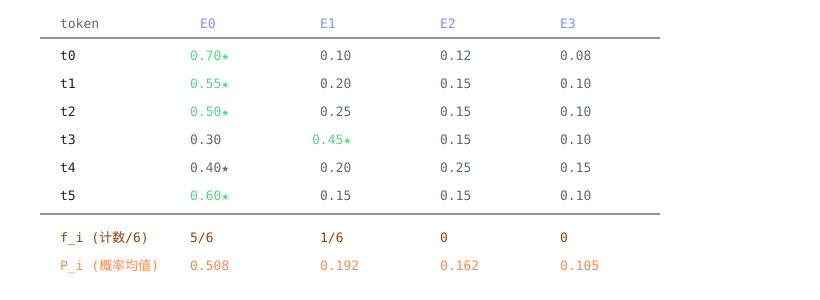

# MoE 负载均衡辅助损失：公式、梯度与分布式实现

<div class="notebook-hero" markdown>

<span class="chapter-kicker">第 7 章 · Expert Parallel</span>

MoE 路由器只根据匹配分数选择专家，并不会自动保证各专家获得相近负载；训练中可能出现少数专家持续过热的路由坍缩。负载均衡辅助损失把离散 assignment 统计与可导的路由分数结合起来，为 router 提供均衡梯度。本文先推导 Switch 形式，再解释梯度如何在层内注入，最后对照 mindformers pynative 与 Megatron-LM 的分布式统计路径。

**本章关键词：** ⚖️ Switch Load-Balancing Loss · 🧮 f_i 不可导 · P_i 带梯度 · 🪄 梯度注入 AutoScaler · 🟠 mindformers pynative · 🟢 Megatron-LM

</div>


!!! note "实现基线"

    本文对照 mindformers 提交 `0efeb79596` 的 pynative Router 与 Megatron-LM 提交 `88894e3ee` 的 Switch-style 路径。公式主干可以独立理解；变体名称、归约组、DTensor placement 与 AutoScaler 接口属于对应版本。


## 01 · 路由坍缩与辅助训练信号 { #bg }

在 MoE（Mixture of Experts）层里，每个 token 经过一个小小的 **路由器（router / gate）**——
本质上就是一个 `Linear(hidden → num_experts)`——算出对每个专家的打分，再选出分数最高的 `top_k` 个专家来处理这个 token。

这一选择过程存在形成正反馈的风险：训练初期某些专家被更多 token 选中，随后获得不同的更新强度，router 的偏好可能继续扩大。若绝大多数 assignment 长期集中到少数专家，其他专家很少得到训练，就称为**路由坍缩（router collapse）**。
坍缩的后果很严重：你花了 $E$ 倍参数养专家，真正干活的却只有两三个；而且专家并行（EP）把专家分散在不同卡上，
负载不均还会让某些卡忙死、某些卡闲死，通信和算力全浪费。


!!! warning "离散计数不能单独提供 router 梯度"

    最直觉的做法是「数一下每个专家被选了多少次，让这个计数尽量均匀」。但 **「被选中」是一个 `argmax / top-k` 操作，对路由器权重不可导**——
    计数 $f_i$ 是个硬整数，梯度到这里就断了。所以光有计数没用，必须想办法把梯度接到 *可导的路由概率* 上。这正是 Switch 公式设计的精髓。


## 02 · Switch 公式：f\_i 与 P\_i { #math }

负载均衡辅助损失的一种常见形式来自 [Switch Transformer](https://arxiv.org/abs/2101.03961)。本文对照的 mindformers 与 Megatron-LM 路径都采用下面这组乘积结构：

$$\mathcal{L}_{\text{aux}} \;=\; \alpha \cdot E \cdot \sum_{i=1}^{E} f_i \cdot P_i$$

其中对一个含 $T$ 个 token 的 batch $B$：

- $\displaystyle f_i = \frac{1}{T\cdot\text{topk}} \sum_{x\in B} \mathbb{1}[\text{token } x \text{ 选了专家 } i]$ ——
  **分派比例**：专家 $i$ 实际接到的 assignment 占全部 $T\cdot\text{topk}$ 条 assignment 的比例；top-k 大于 1 时，同一 token 会贡献多条 assignment。它来自硬性的 top-k 选择，*是个计数，不带梯度（detach）*。
- $\displaystyle P_i = \frac{1}{T} \sum_{x\in B} \text{score}(x, i)$ ——
  **平均路由分数**：本文用 $P_i$ 统一表示参与辅助损失的可导分数；softmax 路径中它是归一化概率，sigmoid 等路径中则不一定沿专家维归一化。*梯度从这里流回路由器权重*。
- $E$ = 专家数，$\alpha$ = `moe_aux_loss_coeff` 系数，$T$ = batch 内 token 总数。


!!! tip "💡 一句话抓住直觉"

    $\sum_i f_i P_i$ 是「**实际负载**（$f_i$，硬计数）」和「**路由意愿**（$P_i$，软概率）」的内积。
    反向时 $f_i$ 是常数，梯度只走 $P_i$：哪个专家已经 *超载*（$f_i$ 大），就把分给它的概率 $P_i$ 往下压。
    于是路由器被推着削峰填谷。若使用沿专家维归一化的 softmax 分数，完全均匀时 $f_i=P_i=1/E$，代入公式得到参考值 $\alpha$，也就是乘系数前为 1。它是均匀状态的基准值，不应在 sigmoid 等未归一化 score 下直接套用，也不能脱离 top-k 与分数耦合关系宣称为任意变量上的全局最小值。


### 一个能手算的小例子

设 $E=4$ 个专家、$T=6$ 个 token、$\text{topk}=1$。某一步路由结果如下（每行是一个 token 的 4 个专家概率，★ 标出 top-1 选中的专家）：




*专家 E0 严重超载（6 个 token 选了 5 个），E2/E3 一个都没接到。
$\sum_i f_i P_i = \tfrac56(0.508)+\tfrac16(0.192) = 0.455$，
$\mathcal{L}_{\text{aux}} = \alpha\cdot4\cdot0.455 = 1.82\alpha$，远大于均衡值 $\alpha$。
反向时梯度把 E0 的 $P_i$（=0.508）往下压、抬高冷门专家——下一步分派就更均匀。*


## 03 · 从公式到实现主干 { #core }

两个实现都把公式主体放在 `switch_load_balancing_loss_func` 一类函数中。忽略框架 API 名称与统计准备逻辑后，计算结构可以压缩为：


**mindformers / Megatron-LM 的共同计算结构（伪代码）**


```python
def switch_load_balancing_loss_func(probs, tokens_per_expert, total_num_tokens,
                                    topk, num_experts, moe_aux_loss_coeff, ...):
    aggregated_probs_per_expert = probs.sum(dim=0)          # = Σ_token probs  →  T·P_i  （带梯度）
    aux_loss = reduce_sum(aggregated_probs_per_expert * tokens_per_expert) * ( # tokens_per_expert = Σ routing_map → T·topk·f_i （detach）
        num_experts * moe_aux_loss_coeff / (topk * total_num_tokens * total_num_tokens)
    )
    return aux_loss
```

验证它就是上面的公式——把两个聚合量代进去：

$$\underbrace{(T P_i)}_{\text{agg probs}} \cdot \underbrace{(T\,\text{topk}\,f_i)}_{\text{tokens/expert}} \;\times\; \frac{E\,\alpha}{\text{topk}\cdot T^2}
\;=\; E\,\alpha \cdot f_i P_i \quad\checkmark$$

所以 **aux\_loss 的数学就这么点**。`probs`（$P_i$ 那项）带梯度、`tokens_per_expert`（$f_i$ 那项）是 detach 的计数——
和 §02 的乘积结构对应。统计这两个量怎么来的，由 `compute_routing_scores_for_aux_loss` 一类函数负责；本文对照的两条路径都执行如下步骤：
对 logits 做 softmax/sigmoid 得到 `scores`（→ probs），再 top-k + scatter 出一张 0/1 的 `routing_map`（→ 计数源）。


!!! note "其余代码负责分布式统计与梯度接入"

    公式之外的代码主要解决两件事：在张量/序列并行与上下文并行下，以正确统计范围计算 `probs.sum` 和 `routing_map.sum`；把每层得到的辅助损失梯度接回 router 计算图。后面两节分别展开。


## 04 · 辅助损失的局部梯度注入 { #inject }

最直接的接入方式，是把 aux\_loss 加到主损失上：`total = main_loss + aux_loss`，然后一起 backward。
本文对照的两条实现路径采用了另一种方式。aux\_loss 在每个 MoE 层的 `construct/forward` 内部计算；
要把每一层的这个 scalar 一路传回顶层的 loss 再相加，在流水线并行（PP）和多层结构下非常别扭。

两条路径都用名为 `MoEAuxLossAutoScaler` 的自定义 autograd Function，把梯度**就地「注入」**到当前层的激活张量上：


**moe_utils.py · _MoEAuxLossAutoScaler（mindformers 与 Megatron 同构）**


```python
class _MoEAuxLossAutoScaler(Function):
    main_loss_backward_scale = None          # 必须与主损失的反向缩放一致

    @staticmethod
    def forward(ctx, output, aux_loss):
        ctx.aux_loss = aux_loss              # 前向：把 output 原样返回，只是把 aux_loss 存进 ctx
        return output                        #       —— 不改变前向数值！

    @staticmethod
    def backward(ctx, grad_output):
        aux_loss = ctx.aux_loss
        scale = _MoEAuxLossAutoScaler.main_loss_backward_scale
        scaled_aux_loss_grad = mint.ones_like(aux_loss) * scale   # 给 aux_loss 播下 d(total)/d(aux_loss) = scale
        return grad_output, scaled_aux_loss_grad                  # output 的梯度原样透传
```

它被这样挂到路由器输出的 `top_scores`（Megatron 里是 `probs`）上：

```python
# router.py：把 aux_loss 的梯度「注入」进 top_scores，前向数值不变
top_scores = self.moe_aux_loss_auto_scaler(top_scores, aux_loss * tp_cp_size)
return top_scores, selected_experts_indices, num_tokens_per_expert
```


!!! tip "🪄 它到底做了什么"

    前向：`top_scores` 原封不动地继续往下走，*不污染任何前向数值*。
    反向：当梯度回流到这个节点，它额外给 `aux_loss` 这个 scalar 播下种子梯度 `scale`。
    由于 `aux_loss` 自身的计算图连着路由器权重（通过 $P_i$），这粒种子就顺着图把负载均衡的梯度送回路由器。
    若 `aux_loss` 已包含配置系数，净效果是在梯度层面把它与主损失相加，再让两路梯度接受同一反向缩放。整个接入在当前层局部完成，对 PP 友好：每层各自注入，不需要把 scalar 传到顶层。`main_loss_backward_scale` 必须与主损失实际使用的反向缩放一致，包括 loss scaling 与梯度累积口径；否则两路梯度的相对权重会改变。


顺带一提：注入之外，aux\_loss 还会被 `save_to_aux_losses_tracker` 按层号记进一个全局 tracker，
仅供日志打印 `load_balancing_loss` 看趋势——这一路是 `detach` 的，不参与反向。
（mindformers 还特意在 activation recompute 期间跳过记录，避免重算前向时把同一层的 aux\_loss 重复累加。）


## 05 · 三个变体：aux / seq / global { #variants }

`moe_router_load_balancing_type` 决定用哪个变体，分发逻辑在 mindformers 的 `_compute_aux_loss` 里
（Megatron 是 `apply_load_balancing_loss`）。三者公式同源，只是 **$f_i$/$P_i$ 的统计口径（在什么范围内求和）不同**：

| 变体 | 统计口径 | 含义 / 适用 | 关键实现差异 |
| --- | --- | --- | --- |
| `aux_loss` （Switch 原版） | 对当前 micro-batch 的**全部 token**求和：`[T,E] → [E]` | 最常见。鼓励整个 batch 维度上专家负载均匀。 | mindformers `_reduce_token_sum` 沿 dim0 求和；Megatron 直接 `routing_map.sum(0)`。 |
| `seq_aux_loss` （DeepSeek 风格） | **每条序列单独**算一份再 `/bsz` 平均：把 batch 维折进专家维 `[seq, bsz·E]` | 更严格：要求*每条序列内部*就均衡，而不只是整个 batch 平均均衡。DeepSeek-V2/V3 用它。 | mindformers `_reduce_seq_sum` 先 reshape 成 `[local_seq, bsz, E]` 再沿 seq 求和得 `[bsz·E]`；末尾 `/bsz`。 |
| `global_aux_loss` | 跨 step 维护一个累计计数 `global_tokens_per_expert`，除以步数得到长期平均 $f_i$ | 在一个比 micro-batch 大得多的「全局 batch」窗口上看负载，方差更小。归约组含 DP。 | 用 `requires_grad=False` 的 Parameter 累加计数与 `ga_steps`；$P_i$ 仍取当前 batch。 |

注意一个共性：**无论哪个变体，带梯度的永远只有当前 batch 的 $P_i$（probs），$f_i$（计数）始终 detach**。
global 变体即使把跨 micro-batch 累计的历史计数带入公式，那部分也是常数；只有当前计算图中的概率项接收梯度。这与 §02 的设计一致。


## 06 · mindformers 的分布式 token 统计 { #distributed }

公式主体很短，但 `router.py` 还需要 `_reduce_token_sum`、`_reduce_seq_sum`、`_cp_reduce` 与 `_aux_loss_from_stats` 等函数，因为 $f_i$ 和 $P_i$ 的统计范围可能跨越 SP / CP 分片，而单个 rank 并不持有该范围内的全部 token。


### 序列并行下的局部和与全局和

开启序列并行后，路由器跑在**本地序列分片**上——`logits` 是一个 `Shard(0)` 的 DTensor，每个 rank 只看到一段 token。
而 $f_i=\sum_{\text{token}}\text{routing\_map}$、$P_i=\sum_{\text{token}}\text{probs}$ 都要沿 *完整序列* 求和。


!!! note "🎯 关键优化：不要 all-gather 完整 logits"

    朴素做法是把 `logits`（`[T, num_experts]`，很大）all-gather 回完整序列再求和。
    mindformers 不这么干——它注意到 $f_i$、$P_i$ 对 token 是**线性**的：「全局和 = 各 rank 局部和之和」。
    所以先在本地分片上求局部和，**只对 `[E]`（或 `[bsz·E]`）这个小向量做一次 all-reduce**。
    通信量从「整条序列 × 专家数」降到「专家数」，省好几个数量级。


这就是 `_reduce_token_sum` 干的事——它把「局部和 → 全局和」翻译成 DTensor 的 placement 变换：


**router.py · _reduce_token_sum（精简注释版）**


```python
def _reduce_token_sum(self, x, cp_reduce=False):
    # x: [T, E]
    if not isinstance(x, DTensor):                 # 非 SP：每个 rank 都有完整序列
        return self._cp_reduce(x.sum(dim=0), cp_reduce)   #   局部和就是全局和
    local_sum = x.to_local().sum(dim=0)            # SP：先在本地分片上求 [E] 的局部和
    if all(p.is_replicate() for p in x.placements):
        return self._cp_reduce(local_sum, cp_reduce)
    # 把局部和声明成 Partial（"还没 reduce 完的部分和"），再 redistribute 到 Replicate
    #   —— 这一步就是一次 [E] 元素的【可微】all-reduce
    partial_pl   = tuple(Partial() if isinstance(p, Shard) else Replicate() for p in x.placements)
    replicate_pl = tuple(Replicate() for _ in x.placements)
    out = DTensor.from_local(local_sum, mesh, partial_pl).redistribute(mesh, replicate_pl).to_local()
    return self._cp_reduce(out, cp_reduce)
```

精髓在 `Partial() → Replicate()` 这个 redistribute：DTensor 语义里，把一个「Partial（部分和）」重分布成「Replicate（每 rank 都有完整值）」，
*正是一次 all-reduce SUM*。由于 `redistribute` 参与 autograd，反向会按 DTensor placement 语义把梯度传回各 rank 的本地 scores；这里不能把通信语义简单概括为普通 Tensor 上无条件的 identity。
`_reduce_seq_sum` 是它的 per-sequence 版本：本地 reshape 成 `[local_seq, bsz, E]` 沿 seq 求和得 `[bsz·E]`，再走同样的 Partial→Replicate。


### 上下文并行的独立归约组

CP 也切序列，但它的通信组**不在路由器的 TP DeviceMesh 里**（hyper\_parallel 的结构限制）。所以 TP 的 redistribute 覆盖不到 CP 维。
mindformers 用一个单独的 `_cp_reduce` 把**计数**再沿 CP 组 all-reduce 一遍（`reduce_over_aux_loss_groups`，CP 关闭时是 no-op，所以非 CP 路径逐位不变）：

```python
def _cp_reduce(self, out, cp_reduce):
    if cp_reduce:                          # 只有 detach 的【计数】走这条
        reduce_over_aux_loss_groups(out)   # 沿 CP aux-loss 组再 all-reduce 一次 → f_i 在 tp×cp 上全局
    return out                             # 带梯度的 probs 保持 CP-local（对应公式里的 per-rank P_ij）
```


!!! warning "计数与概率的 CP 归约范围不同"

    这是 Switch 公式的分布式分解（见 `moe_utils.py` 顶部那段长推导）：
    $\mathcal{L} = \sum_j E\sum_i f_i P_{ij}$——$f_i$ 必须是 **tp×cp 全局**的负载，
    而 $P_{ij}$ 是**第 $j$ 个 rank 本地**的概率和（梯度只回本 rank）。
    若把概率也跨 CP all-reduce 会重复计数、梯度也错。相应地 `total_num_tokens` 要乘上 CP 组大小来配平。
    对当前 micro-batch 的 `aux_loss` / `seq_aux_loss` 分解，DP rank 各自计算本地数据的贡献，不能再无条件把同一概率项沿 DP 重复归约。`global_aux_loss` 是另一种统计口径，会显式扩大到包含 DP 的组；第 07 节对照表应按这一例外理解。


### 与主损失一致的缩放口径

最后还有两处缩放，纯属和主损失对齐的记账，不影响数学：
注入时乘 `tp_cp_size`（补偿 Switch 公式里 `total_num_tokens` 含的 tp×cp 因子，让梯度幅度与 mesh 形状无关）；
以及 `calculate_per_token_loss` 路径下乘 `top_scores.shape[0]`（抵消 Megatron `finalize_model_grads` 按 token 数缩放梯度的行为）。本文对照的 Megatron 路径包含对应的缩放逻辑。


## 07 · Megatron vs mindformers 逐项对照 { #compare }

在本文比较的 Switch-style 路径中，两者使用相同的损失结构与局部梯度注入思想；差异主要位于并行组、DTensor 表达和附加功能。其他版本或路由配置仍需按实际源码核对。


#### Megatron-LM  PyTorch / 进程组

- 归约：`reduce_from_tensor_model_parallel_region(local, tp_cp_group)`，一次显式 all-reduce 搞定 TP×CP。
- CP 已折进 `tp_cp_group`，无需单独处理。
- global 变体归约组用 `tp_dp_cp_group`（含 DP）。
- 统计入口 `get_tokens_per_expert_and_token_count` 直接吃 `[T,E]` 的 routing\_map。
- 额外有：`z_loss`、`input_jitter`、`expert_bias` 更新、padding\_mask、TE 融合核 `fused_moe_aux_loss`。


#### mindformers pynative  MindSpore / DTensor

- 归约：DTensor `Partial()→Replicate()` redistribute（`_reduce_token_sum`/`_reduce_seq_sum`），可微 all-reduce 只传 `[E]`。
- CP 在 TP mesh 之外 → 单独 `_cp_reduce` / `reduce_over_aux_loss_groups`，且**只对 detach 计数**。
- global 变体：TP 在 probs、CP 在 count；DP 交给 tracker 平均。
- 预先把统计求和成 `[E]`，再喂 `_aux_loss_from_stats`（= 拆开的 switch 公式）。
- 额外有：`_debug_force_load_balance`（round-robin 强制均衡）、hash routing（DSv4）。本文件未含 z\_loss。

| 维度 | 是否一致 | 说明 |
| --- | --- | --- |
| 核心公式 `switch_load_balancing_loss_func` | ✅ 结构一致 | 都实现 `E·α·Σf_i·P_i`，并按 `topk·T²` 归一化；具体框架 API 与外围分支不同。 |
| 三个变体 aux / seq / global | ✅ 对照路径一致 | 统计口径、`/bsz`、global 的 `ga_steps` 累计平均都对齐。 |
| 梯度注入 `MoEAuxLossAutoScaler` | ✅ 同构 | forward 透传，backward 为辅助损失播种 `scale`。 |
| `compute_routing_scores_for_aux_loss` | ✅ 对照路径一致 | softmax/sigmoid/sqrtsoftplus → topk → scatter 出 routing\_map。 |
| `calculate_per_token_loss` 修正 | ✅ 对照路径一致 | 按 token 数缩放，以抵消 `finalize_model_grads` 的对应缩放。 |
| 按层 tracker / PP·CP 日志聚合 | ✅ 等价 | `save_to_aux_losses_tracker` + `track_moe_metrics`，PP all-reduce 后仅 last stage 上报。 |
| TP/CP 归约 *机制* | ⚠️ 实现不同 | 进程组 all-reduce ↔ DTensor placement redistribute；结果数值等价。 |
| CP 归约位置 | ⚠️ 实现不同 | Megatron 折进 tp\_cp\_group；mindformers 因 mesh 限制单独走 `_cp_reduce`。 |
| 额外功能 | ➖ 各有 | Megatron：z\_loss / jitter / 融合核；mindformers：force-balance / hash routing。 |


## 08 · 总结与实践要点 { #summary }

- **数学就 3 行**：aux\_loss = `Σ(probs.sum · tokens_per_expert) · E·α/(topk·T²)`。带梯度的只有 probs（$P_i$），计数（$f_i$）永远 detach——这是它能掰正路由、又不会强行篡改硬分派的关键。
- **局部梯度注入**：`MoEAuxLossAutoScaler` 前向透传、反向为辅助损失播种。若辅助损失已包含配置系数，这在梯度层面等价于先把它与主损失相加，再对两路施加同一反向缩放。`scale` 必须与主损失反向缩放一致。
- **「看不懂的几百行」= 分布式求和**：在 SP/CP 下把 $\sum_{\text{token}}$ 算对，且只对 `[E]` 小向量通信、不 all-gather 完整 logits。mindformers 用 DTensor `Partial→Replicate`，Megatron 用进程组 all-reduce，殊途同归。
- **分布式统计口径**：标准 `aux_loss` 路径中，计数 $f_i$ 按实现需要跨 TP/CP 归约，带梯度的概率项可保持 rank-local，再由各 rank 的损失贡献组成全局梯度。`global_aux_loss` 会扩大统计范围，并可包含 DP 组；因此“DP 不参与”只适用于前一种分解，不能推广到所有变体。
- **变体选择**：`aux_loss` 以当前路由范围快速反馈，`seq_aux_loss` 约束每条序列内部，`global_aux_loss` 使用更大统计窗口。`moe_aux_loss_coeff` 需要结合主任务 loss、负载偏斜与训练稳定性调节，不存在跨模型通用的固定起点。
- **调试技巧**：mindformers 的 `moe_router_force_expert_balance` 用 round-robin 强制完全均衡分派，可用来隔离「是路由不均还是别的问题」；此时 aux\_loss 的 routing\_map 也会按强制分派重建，保证 loss 反映真实分派。


!!! tip "实现对照结论"

    在本文比较的路径中，mindformers pynative 与 Megatron-LM 都使用 Switch-style 公式和局部梯度注入。mindformers 额外用 MindSpore DTensor placement 变换表达 SP 下的可微归约，并为独立的 CP 通信组补充统计；这些代码解决的是分布式数据布局，而不是改变损失公式。
