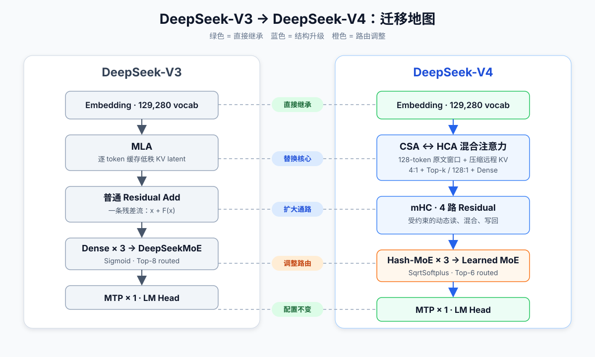
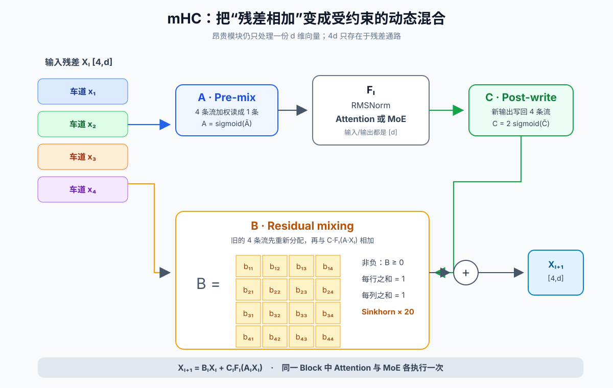
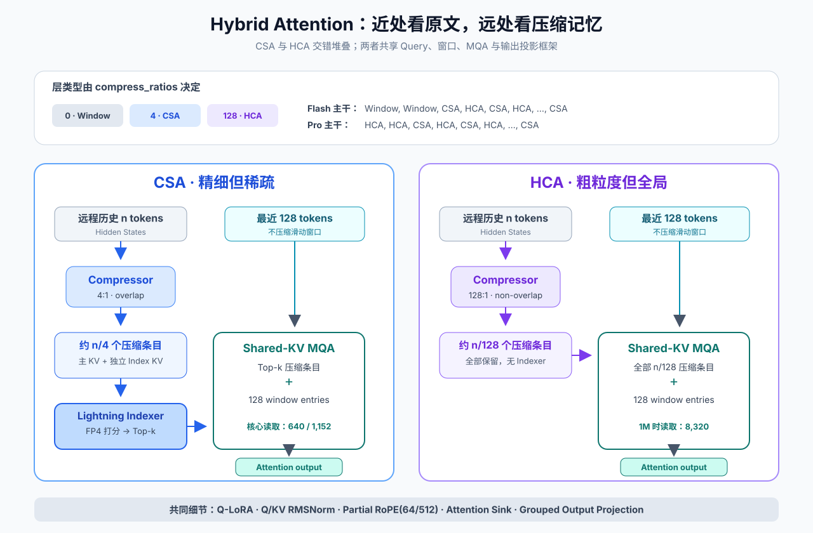
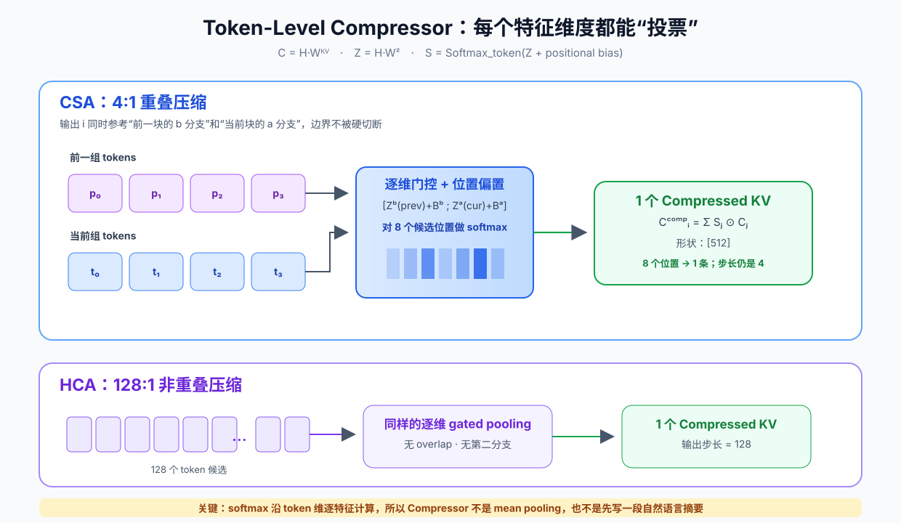
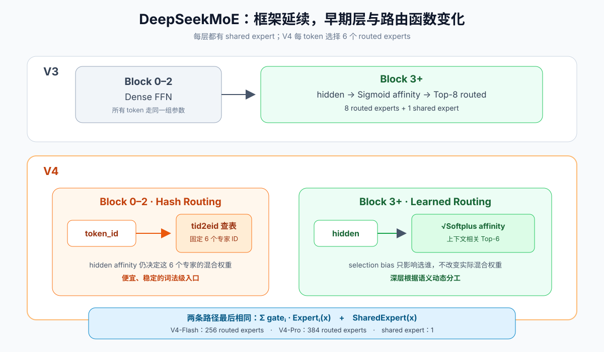

# 从 DeepSeek-V3 到 DeepSeek-V4：面向 V3 用户的逐模块迁移指南

> 这篇教程假设你已经理解 DeepSeek-V3 的三个关键词：**MLA、DeepSeekMoE、MTP**。我们的目标不是重新讲一遍 Transformer，而是回答一个更具体的问题：**V4 沿用了 V3 的什么，又替换了什么；一个 token 在 V4 中到底怎样流过每个模块？**
>
> 本文以 DeepSeek 官方 2026 年 4 月 24 日发布的 **V4 Preview 技术报告、开放权重配置和参考推理代码**为准。仓库中的论文副本见 [DeepSeek_V4.pdf](./DeepSeek_V4.pdf)，精简参考实现见 [source_code/model.py](./source_code/model.py)。

## 先给结论：V4 不是“更大的 V3”

如果把 V3 写成：

```text
Embedding
  → [RMSNorm → MLA → 残差相加
  →  RMSNorm → DeepSeekMoE → 残差相加] × L
  → MTP / LM Head
```

那么 V4 更接近：

```text
Embedding → 扩成 4 条残差流
  → [mHC 预混合 → RMSNorm → CSA 或 HCA → mHC 后混合
  →  mHC 预混合 → RMSNorm → DeepSeekMoE（V4 路由）→ mHC 后混合] × L
  → 合并 4 条残差流 → MTP / LM Head
```



迁移时最值得记住的是下面这张表：

| 维度 | DeepSeek-V3 | DeepSeek-V4 | 应该怎样迁移理解 |
|---|---|---|---|
| 骨干 | Decoder-only Transformer | Decoder-only Transformer | 不变 |
| 长程注意力 | MLA：逐 token 保存低秩 KV | CSA/HCA：先沿序列压缩，再做稀疏或稠密注意力 | **MLA 被替换，不只是多了一个 mask** |
| 局部信息 | 全局 MLA 自然包含 | 独立的 128-token 滑动窗口分支 | 压缩远程、保留近邻 |
| 残差连接 | 一条残差流，直接相加 | 4 条残差流的 mHC 动态混合 | 从“加法”变成“受约束路由” |
| FFN | 前 3 层 Dense，之后 DeepSeekMoE | 每层都是 MoE；前 3 层使用 Hash Routing | 早期层也条件计算 |
| MoE 打分 | `Sigmoid` | `Sqrt(Softplus)` | 路由框架不变，亲和度函数调整 |
| 每 token 路由 | 8 个 routed experts + shared expert | 6 个 routed experts + shared expert | 激活专家数减少 |
| MTP | 1 个预测层 | 配置保持不变 | 直接继承 |
| 训练优化器 | AdamW | 大多数矩阵用 Muon，少数参数保留 AdamW | 训练变化，不增加推理模块 |
| 上下文 | 官方 V3 模型以 128K 为主 | 1M | 靠结构降低 KV 与注意力成本，而非只拉长 RoPE |

## 0. 先划清资料边界

DeepSeek-V4 当前是官方称呼中的 **Preview 版本**，包括：

| 模型 | 总参数 | 激活参数 | 主干层数 | 隐藏维度 | Routed Experts | 每 token 激活 | 上下文 |
|---|---:|---:|---:|---:|---:|---:|---:|
| V4-Flash | 284B | 13B | 43 | 4096 | 256 | 6 | 1,048,576 |
| V4-Pro | 1.6T | 49B | 61 | 7168 | 384 | 6 | 1,048,576 |

这里有两个容易被二手资料带偏的点：

1. **Engram 不是 DeepSeek-V4 技术报告中的组成模块。** 本仓库的 [Engram](../../modules/engram/README.md) 是值得单独学习的条件记忆研究，但不能把它写成 V4 已采用的结构。
2. 官方报告明确给出的核心升级是 **mHC、CSA/HCA 混合注意力和 Muon**；本文不把未经官方材料确认的芯片适配、API 成本或“3 倍加速”等说法当作模型结构事实。

## 1. 从全局看：一个 V4 Block 里有什么

V4 仍然是 pre-norm Transformer。每个主干 Block 依次包含：

1. mHC 为注意力生成一份实际输入；
2. RMSNorm；
3. CSA、HCA 或纯滑动窗口注意力；
4. mHC 把注意力输出写回 4 条残差流；
5. mHC 为 MoE 生成一份实际输入；
6. RMSNorm；
7. DeepSeekMoE；
8. mHC 再次写回 4 条残差流。

注意这里的“4 条残差流”并不意味着注意力和 MoE 的隐藏维度变成 `4d`。mHC 会在进入昂贵模块前把它们压回 `d`，因此 Attention/MoE 的主体仍按普通隐藏维度计算。

以张量形状表示：

```text
token ids [B, S]
  ↓ Embedding
h         [B, S, d]
  ↓ 复制成 hc_mult=4 条流
X         [B, S, 4, d]
  ↓ mHC_pre
x_attn    [B, S, d]
  ↓ Attention
u_attn    [B, S, d]
  ↓ mHC_post
X'        [B, S, 4, d]
  ↓ mHC_pre → MoE → mHC_post
X''       [B, S, 4, d]
```

接下来按真实前向传播顺序逐个拆开。

## 2. 模块一：Embedding 与 4 路残差流

Embedding 本身没有神秘变化：词表仍是 129,280，输入 token ID 被映射成 `d` 维向量。变化发生在进入第一层之前：

```python
h = self.embed(input_ids)                         # [B, S, d]
h = h.unsqueeze(2).repeat(1, 1, self.hc_mult, 1) # [B, S, 4, d]
```

可以把这 4 份向量理解为 4 条“信息车道”。初始化时内容相同，经过每一层的动态混合后逐渐分化。后续层可以选择：

- 从哪些车道读取；
- 旧车道之间如何交换信息；
- 新的 Attention/MoE 输出写回哪些车道。

V3 的残差是固定规则 `x ← x + F(x)`；V4 把“读、保留、写回”都变成了可学习、随 token 改变的规则。

## 3. 模块二：mHC——把残差相加升级成受约束的动态混合



### 3.1 从 V3 的一条公式出发

V3 的普通残差连接是：

$$
x_{l+1}=x_l+F_l(x_l)
$$

标准 Hyper-Connections（HC）把残差扩展成 $n_{hc}$ 条流：

$$
X_{l+1}=B_lX_l+C_lF_l(A_lX_l)
$$

其中 V4 取 $n_{hc}=4$：

- $X_l\in\mathbb{R}^{4\times d}$：4 条残差流；
- $A_l\in\mathbb{R}^{1\times4}$：**读入权重**，把 4 条流混成一份 `d` 维模块输入；
- $B_l\in\mathbb{R}^{4\times4}$：**残差混合矩阵**，决定旧信息怎样跨车道流动；
- $C_l\in\mathbb{R}^{4\times1}$：**写回权重**，决定新模块输出注入哪些车道；
- $F_l$：Attention 或 MoE。

### 3.2 为什么普通 HC 会不稳定

若每层的 $B_l$ 都是任意矩阵，深层网络实际反复乘：

$$
B_LB_{L-1}\cdots B_1
$$

只要一些方向的增益持续大于 1，前向激活和反向梯度就可能逐层放大；如果持续小于 1，又可能逐层衰减。HC 扩展了残差表达力，也给深层训练带来了新的数值风险。

### 3.3 mHC 的关键：把 $B$ 投影成双随机矩阵

V4 要求 $B_l$ 满足：

$$
B_l\ge0,\qquad B_l\mathbf{1}=\mathbf{1},\qquad
\mathbf{1}^{T}B_l=\mathbf{1}^{T}
$$

也就是每行、每列之和都为 1。代码用 20 次 Sinkhorn-Knopp 行列归一化完成投影。直觉上，$B$ 只能在 4 条车道间**重新分配**已有信号，而不能无上限地凭空放大它。

另外：

$$
A_l=\sigma(\widetilde A_l),\qquad
C_l=2\sigma(\widetilde C_l)
$$

输入和输出权重也被约束为非负、有界，避免不同残差流以大幅正负值互相抵消。

### 3.4 “动态”体现在哪里

$A/B/C$ 不是每层固定的一组常数。V4 先把当前 4 路状态展平并 RMSNorm，然后用“输入相关分量 + 静态偏置”生成它们：

```text
X [4,d] → flatten [4d] → RMSNorm
  ├─ 动态线性投影 ─┐
  └─ 静态 bias ────┴→ raw A / B / C → Sigmoid 或 Sinkhorn
```

因此，同一层处理标点、代码符号和长程指代时，可以采用不同的残差混合方式。

### 3.5 一层里 mHC 用了两次

Attention 和 MoE 各自拥有独立的 mHC 参数：

```python
# Attention 子层
x, post, comb = hc_pre(residual_streams)
x = attention(rmsnorm(x))
x = hc_post(x, residual_streams, post, comb)

# MoE 子层
x, post, comb = hc_pre(residual_streams)
x = moe(rmsnorm(x))
x = hc_post(x, residual_streams, post, comb)
```

到 LM Head 前，再用一次有界权重把 4 条流合并回一份 `d` 维状态。

## 4. 模块三：混合注意力——V4 最大的结构变化

V3 用户最容易犯的错误，是把 V4 理解成“MLA 后面加了 DSA”。更准确的说法是：

> V4 用 **共享 Key/Value 的 MQA + 序列压缩 + 局部窗口**重建了注意力数据通路；CSA 再在压缩条目上运行 DSA 的 Lightning Indexer。



### 4.1 两条并行记忆：局部原文 + 远程摘要

CSA 和 HCA 都把可见历史分成两条路径：

```text
最近 128 tokens ──不压缩──────────────┐
                                      ├─ Shared-KV MQA → 输出
更早的 tokens ──Compressor → 长程条目 ─┘
```

为什么要保留 128-token 滑动窗口？

- 压缩块必须遵守因果性，查询不能偷看自己所在压缩块的未来 token；
- 相邻 token 往往依赖精细的顺序、标点和局部语法；
- 只看压缩条目会损失块内细节。

所以 V4 的原则不是“所有东西都压缩”，而是：**近处看原文，远处看压缩记忆。**

### 4.2 Query 路径：保留低秩思想，但不再是 V3 的 MLA

Query 仍采用低秩投影：

$$
c_t^Q=h_tW^{DQ},\qquad
q_t=c_t^QW^{UQ}
$$

对应参考代码：

```python
qr = q = self.q_norm(self.wq_a(x))
q = self.wq_b(q).unflatten(-1, (n_heads, head_dim))
```

这和 V3 的 Q-LoRA 很像，能复用已有心智模型。但 KV 侧已经不同：

- V3 MLA 缓存每个 token 的低秩 KV latent 与 RoPE key；
- V4 把多个 token 沿**序列维**聚合成一个 512 维条目；
- 这个条目在核心 MQA 中同时作为 Key 和 Value。

### 4.3 Token-Level Compressor：压缩不是平均池化



对一个块内的隐藏状态 $H$，Compressor 先生成候选 KV 与门控分数：

$$
C=HW^{KV},\qquad Z=HW^Z
$$

然后把可学习位置偏置 $B$ 加到分数上，在块内对**每个特征维度**做 softmax：

$$
S=\operatorname{Softmax}_{token}(Z+B),\qquad
C_i^{Comp}=\sum_j S_j\odot C_j
$$

这不是“128 个 token 取一个平均值”。对于同一个压缩条目的 512 个维度，不同维度可以把权重放在不同 token 上：某些维度保留变量名，某些维度保留括号结构，另一些维度保留主题语义。

#### CSA 的重叠压缩

CSA 的压缩率 $m=4$，但一个输出会融合相邻两组共 8 个候选位置：

- 当前块的 $C^a$ 分支；
- 前一块的 $C^b$ 分支；
- 两组分数联合 softmax。

相邻输出之间有重叠，因此边界处的信息不容易被硬切断；尽管每个条目参考 8 个位置，输出序列长度仍约为原来的 $1/4$。

#### HCA 的重度压缩

HCA 取 $m'=128$，不使用重叠分支。每 128 个 token 产生 1 个远程条目，追求极低 KV 占用。

### 4.4 CSA：先 4:1 压缩，再用 Indexer 选 Top-k

CSA（Compressed Sparse Attention）的远程路径可拆成四步。

#### 第一步：主 KV 压缩

```text
n 个历史 token → Compressor(m=4) → 约 n/4 个 512d 压缩条目
```

#### 第二步：为索引器单独生成压缩 Key

Indexer 有自己的 Compressor，压缩率同样是 4，但索引维度为 128。参考实现还在 FP4 量化前使用 Hadamard rotation，让量化误差更均匀。

#### 第三步：Lightning Indexer 打分

每个 query 生成 64 个 128 维索引头。每个头与压缩索引 Key 点积，ReLU 后乘动态头权重，再跨头求和：

$$
I_{t,s}=
\sum_{h=1}^{64}w^I_{t,h}\,
\operatorname{ReLU}\left(q^I_{t,h}\cdot K^{IComp}_s\right)
$$

然后选择得分最高的压缩条目：

$$
\mathcal C_t^{Sparse}=
\operatorname{TopK}\left(I_{t,:}\right)
$$

V4-Flash 的 `k=512`，V4-Pro 的 `k=1024`。想进一步复习 DSA 的来源，可阅读仓库中的 [DeepSeek Sparse Attention 教程](../../modules/dsa/README.md)。

#### 第四步：窗口与 Top-k 合并后做核心注意力

```text
最近 128 个原始 KV
        +
Top-k 个远程压缩 KV
        ↓
Shared Key-Value MQA
```

因此在 1M 上下文的稳态解码中，Flash 的核心注意力大约只看 `128 + 512 = 640` 个条目，而不是 100 万个 token。

### 4.5 HCA：128:1 压缩后直接稠密读取

HCA（Heavily Compressed Attention）不运行 Indexer：

```text
n 个历史 token
  → Compressor(m'=128)
  → n/128 个压缩条目
  → 全部参与 dense MQA
```

对 1,048,576 token：

$$
\frac{1,048,576}{128}=8,192
$$

再加 128 个滑动窗口条目，单个 query 大约读取 8,320 个 KV。这个数字大于 CSA 的 640/1,152，但 HCA 不需要 Top-k 索引，并且让每个 query 都能读取一份覆盖全历史的粗粒度表示。

可以把两者理解为：

- **CSA：高分辨率远程记忆，但只读相关部分；**
- **HCA：低分辨率远程记忆，但完整扫一遍。**

交错堆叠让精确召回和全局覆盖互补。

### 4.6 层间是怎样交错的

`compress_ratios` 直接编码每层类型：

| 数值 | 层类型 | 远程路径 |
|---:|---|---|
| `0` | 纯 Sliding Window | 只看最近 128 token |
| `4` | CSA | 4:1 重叠压缩 + Lightning Indexer |
| `128` | HCA | 128:1 非重叠压缩 + dense MQA |

开放配置中的主干排列是：

- **V4-Flash**：前 2 层纯滑动窗口；此后 `CSA → HCA` 交替；最后一个主干层为 CSA。
- **V4-Pro**：前 2 层 HCA；此后 `CSA → HCA` 交替；最后一个主干层为 CSA。
- MTP 层对应的额外条目为 `0`，即纯滑动窗口。

这也解释了为什么不能只说“V4 用稀疏注意力”：接近一半的长程层是**重度压缩后的稠密注意力**。

### 4.7 三个容易忽略、但很关键的细节

#### Partial RoPE 与输出反旋转

每个 query/KV 条目为 512 维，其中最后 64 维使用 RoPE。由于压缩条目同时充当 Value，注意力输出也会携带绝对旋转位置；代码因此对输出的最后 64 维应用 inverse RoPE，把结果恢复成相对位置信息。

```python
apply_rotary_emb(q[..., -64:], freqs_cis)
apply_rotary_emb(kv[..., -64:], freqs_cis)
...
apply_rotary_emb(output[..., -64:], freqs_cis, inverse=True)
```

#### Q/KV 再做 RMSNorm

核心注意力前，每个 query head 和共享 KV head 都单独归一化，避免 Muon 训练下的 attention logits 爆炸。因为结构上直接控制住了 Q/KV 范数，V4 不需要额外的 QK-Clip。

#### Attention Sink

每个注意力头有一个可学习 sink logit。它被加进 softmax 分母、但不对应真实 Value，相当于提供“这次不必把 100% 注意力分给任何历史条目”的出口：

$$
s_{i,j}=
\frac{\exp(z_{i,j})}
{\sum_k\exp(z_{i,k})+\exp(z'_{\text{sink}})}
$$

当所有历史信息都不合适时，真实条目的注意力总和可以接近 0。

## 5. 模块四：Grouped Output Projection

V4 的核心注意力输出形状很大：

```text
[B, S, n_heads, head_dim]
```

若直接从 `n_heads × 512` 投影回 `d`，代价很高。V4 先把 heads 分组，每组降到一个较小的低秩空间，再统一投影：

```text
Attention heads
  → 按 g 组 reshape
  → 每组独立投影到 o_lora_rank
  → 拼接
  → Row-Parallel Linear → d
```

对应代码：

```python
o = o.view(batch, seq, n_groups, -1)
o = torch.einsum("bsgd,grd->bsgr", o, wo_a)
x = self.wo_b(o.flatten(2))
```

V4-Flash 使用 8 组，V4-Pro 使用 16 组，二者的 `o_lora_rank` 都是 1024。这可以看成注意力输出侧的低秩瓶颈，与 Query 侧的 Q-LoRA 前后呼应。

## 6. 模块五：DeepSeekMoE——主体继承，入口与路由细节调整



### 6.1 不变的主干

V4 仍使用 DeepSeekMoE 的核心设计：

- 细粒度 routed experts；
- 1 个 shared expert 始终参与；
- 每个 token 只激活少数 routed experts；
- auxiliary-loss-free 的全局负载均衡；
- 专家内部仍是 SwiGLU FFN。

一个 token 的 MoE 输出仍可写成：

$$
y=
E_{\text{shared}}(x)+
\sum_{i\in\operatorname{TopK}(x)}
g_i(x)E_i(x)
$$

### 6.2 V3 前 3 层 Dense，V4 前 3 层 Hash-MoE

V3 用 `first_k_dense_replace=3`，前 3 个 Block 是稠密 FFN。V4 移除了这段 Dense 前缀，所有 Block 都使用 MoE；但前 3 层不让一个尚未成熟的 learned router 自由选择，而是使用预定义的：

```text
token_id → [expert_id_1, ..., expert_id_6]
```

参考代码中，Hash Routing 只固定专家**索引**，当前隐藏状态计算出的 affinity 仍用于这 6 个专家的混合权重：

```python
if self.hash:
    indices = self.tid2eid[input_ids]
else:
    indices = scores.topk(self.topk, dim=-1).indices

weights = original_scores.gather(1, indices)
```

直觉上，早期层更常处理词法和局部模式，token ID 是一个便宜、稳定的路由信号；进入更深层后，语义依赖上下文，再切换到 learned routing。

### 6.3 从 Sigmoid 到 Sqrt(Softplus)

V3 的专家 affinity 使用：

$$
a_i=\sigma(z_i)
$$

V4 改为：

$$
a_i=\sqrt{\operatorname{Softplus}(z_i)}
$$

两者都输出正值，但 `Sqrt(Softplus)` 不像 Sigmoid 那样被硬限制在 0 到 1。选择 Top-k 后，V4 仍把所选权重归一化，再乘 `routed_scaling_factor`。

### 6.4 专家配置变化

| 配置 | V3 | V4-Flash | V4-Pro |
|---|---:|---:|---:|
| Routed experts | 256 | 256 | 384 |
| 每 token 激活 routed experts | 8 | 6 | 6 |
| Shared experts | 1 | 1 | 1 |
| 前 3 层 | Dense FFN | Hash-routed MoE | Hash-routed MoE |
| affinity | Sigmoid | Sqrt(Softplus) | Sqrt(Softplus) |

V4 还取消了 V3 路由时对目标节点数量的限制，并增加一个轻量的 sequence-wise balance loss，防止单条序列内部出现极端专家拥塞。

## 7. 模块六：MTP——几乎可以原样搬过来的 V3 知识

V4 技术报告明确说 MTP 配置与 V3 相同：

- 仍是 1 个 MTP 层；
- 训练时增加未来 token 预测目标；
- MTP 共享主模型的 Embedding 和 LM Head；
- 主模型推理输出仍走标准 LM Head。

参考实现的 MTPBlock 先把下一位置的 token embedding 与主干 hidden state 各自归一化、投影并相加，再经过一个完整 Block：

```python
e = self.enorm(self.embed(input_ids))
x = self.hnorm(hidden_states)
x = self.e_proj(e).unsqueeze(2) + self.h_proj(x)
x = super().forward(x, start_pos, input_ids)
logits = self.head(x)
```

因此，从 V3 迁移时，不必把 MTP 当作 V4 的新发明。V4 的主要变化发生在 MTP 之前的主干数据通路。

## 8. 模块七：Muon——它改变训练，不改变一次前向传播

Muon 不是推理图里的新层，而是多数权重矩阵的优化器。V4 并没有“一刀切”替换 AdamW：

- Embedding、Prediction Head、RMSNorm 权重；
- mHC 的静态 bias 和 gating factor；

这些仍使用 AdamW。其他大多数矩阵参数使用 Muon。

Muon 对带动量的梯度矩阵做近似正交化，再执行更新。V4 使用 10 步混合 Newton-Schulz：

1. 前 8 步用一组快速拉近奇异值的系数；
2. 后 2 步切到稳定收敛到 1 的系数；
3. 按矩阵较大维度重新缩放 update RMS；
4. 再应用 weight decay 和学习率更新。

对只关心推理的读者，可以把这一节压缩成一句话：**Muon 帮 V4 更快、更稳地把新架构训练出来，但部署时不会多出一个 Muon 算子。**

## 9. 把所有模块串起来：一个 token 的完整旅程

下面以主干中的一个 CSA Block 为例。

### 阶段 A：进入 Attention 子层

```text
4 路 residual X
  → 动态生成 A/B/C
  → A 把 4 路读成 1 路
  → RMSNorm
```

### 阶段 B：同时构建三种 Attention 表示

```text
当前 hidden
  ├─ Q-LoRA → 64/128 个 512d query heads
  ├─ 原始 KV → 最近 128 token 的滑动窗口
  ├─ CSA Compressor(4:1) → 远程主 KV
  └─ Indexer Compressor(4:1) → 远程索引 KV
```

### 阶段 C：选择并读取远程信息

```text
Indexer queries × compressed index keys
  → FP4 低成本打分
  → Top-512（Flash）/ Top-1024（Pro）
  → 与 128-token window 拼接
  → Shared-KV MQA
  → inverse RoPE
  → grouped output projection
```

### 阶段 D：写回残差流

```text
Attention output
  → C 控制新信息写入 4 路的比例
  → B 重新分配旧的 4 路信息
  → 两者相加得到新 residual X'
```

### 阶段 E：进入 MoE 子层

```text
X'
  → 新的一组 mHC A/B/C
  → RMSNorm
  → 前 3 层按 token_id 固定选 6 个专家，
     更深层按 hidden affinity 选 Top-6
  → routed experts + shared expert
  → mHC 写回得到 X''
```

重复全部主干层后，Head 将 4 路状态合并、RMSNorm，并投影到 129,280 维词表 logits。

## 10. 用 1M 上下文算一遍：效率来自哪里

只看核心注意力需要读取的条目数：

| 注意力 | 远程历史表示 | 1M 时远程候选 | 实际核心读取 |
|---|---|---:|---:|
| V3/普通全注意力的直觉 | 每 token 1 条 KV | 约 1,048,576 | 约 1,048,576 |
| V4-Flash CSA | 每 4 token 1 条，再 Top-k | 262,144 | 512 + 128 window |
| V4-Pro CSA | 每 4 token 1 条，再 Top-k | 262,144 | 1,024 + 128 window |
| V4 HCA | 每 128 token 1 条，全部读取 | 8,192 | 8,192 + 128 window |

此外还有三层节省：

1. **共享 KV 的 MQA**：所有 query heads 共用一个 512 维 KV 条目；
2. **混合精度 KV**：RoPE 的 64 维保留 BF16，其余维度使用 FP8；
3. **Indexer FP4**：大范围“海选”用低精度小头完成。

官方报告给出的端到端结论是：在 1M 上下文设置下，**V4-Pro 的单 token 推理 FLOPs 是 V3.2 的 27%，累计 KV Cache 是 V3.2 的 10%**。这里应理解为整模型测算结果，而不是简单由 `4:1` 或 `128:1` 单独推出来的比例。

## 11. 阅读参考源码时，从这张地图开始

仓库的 [source_code/model.py](./source_code/model.py) 是官方参考实现的精简副本。建议按下面顺序阅读：

| 类 / 函数 | 关注点 | 对应本文 |
|---|---|---|
| `ModelArgs` | `compress_ratios`、`hc_mult`、Indexer/MoE 配置 | 全局配置 |
| `Compressor` | gated pooling、CSA overlap、prefill/decode 状态 | 4.3 |
| `Indexer` | 64 个索引头、ReLU 聚合、Top-k | 4.4 |
| `Attention` | window + compressed KV、partial RoPE、grouped output | 4-5 |
| `Gate` | Hash Routing 与 learned Top-k、SqrtSoftplus | 6 |
| `MoE` / `Expert` | shared + routed experts、SwiGLU | 6 |
| `Block.hc_pre/post` | 4 路残差读写、Sinkhorn | 3 |
| `MTPBlock` | 与 V3 相同的下一 token 预测层 | 7 |
| `Transformer.forward` | Embedding → 4 路扩展 → Blocks → Head | 1、9 |

> 注意：`ModelArgs` 里的默认值是为了让参考代码易于阅读和小规模测试，并不是 V4-Pro/Flash 的生产配置。精确配置应以官方 `config.json` 为准。

## 12. 迁移时的六个常见误区

### 误区 1：V4 仍以 MLA 为核心，只是加了稀疏 mask

不准确。V4 保留了 Query 低秩投影的思想，但远程 KV 改为 token-level compression，核心注意力是 shared-KV MQA。

### 误区 2：HCA 也是稀疏注意力

不是。HCA 靠 128:1 压缩降低序列长度，压缩后的远程条目全部参加稠密注意力。

### 误区 3：CSA 的 4:1 就是每四个 token 平均一下

不是。它使用逐维门控、位置偏置和跨相邻块的重叠分支；不同特征维度可以选择不同 token。

### 误区 4：有了 HCA，局部细节必然丢失

远程表示确实更粗，但每层都额外拼接最近 128 个未压缩 token；CSA 层还提供更细的远程召回，两种层交错补偿。

### 误区 5：mHC 让 Attention/MoE 的计算宽度变成 4 倍

不是。残差状态是 `[4,d]`，进入 Attention/MoE 前用 $A$ 合成 `[d]`，昂贵模块仍在 `d` 维上工作。

### 误区 6：Engram 是 V4 的静态记忆层

官方 V4 报告与开放配置没有 Engram。可以把 Engram 当作独立的架构研究学习，但不应把它画进 V4 的已确认前向图。

## 13. 最后的迁移检查表

当你能不看上文回答下面 8 个问题，就完成了从 V3 到 V4 的架构迁移：

1. 为什么 V4 的主要变化不能概括成“MLA + DSA”？
2. CSA 为什么既做 4:1 压缩，又需要 Top-k？
3. HCA 为什么不用 Top-k 仍然便宜？
4. 128-token window 解决了哪两个问题？
5. mHC 的 $A/B/C$ 分别负责读、保留和写回中的哪一步？
6. 双随机约束为什么有利于深层信号稳定？
7. 为什么 V4 的前三层用 Hash Routing，而不是回到 Dense FFN？
8. Muon 为什么不属于部署时的前向模块？

一句话收束：

> **V3 用低秩表示压缩每个 token 的 KV；V4 进一步沿序列维压缩历史，并以 CSA 的“精细但稀疏”和 HCA 的“粗糙但全局”交替读取，再用 mHC 稳定地扩大残差通路的表达能力。DeepSeekMoE 与 MTP 则作为经过验证的 V3 基座继续保留。**

## 参考资料

1. [DeepSeek-V4 官方发布说明](https://api-docs.deepseek.com/news/news260424/)
2. [DeepSeek-V4 Technical Report](https://huggingface.co/deepseek-ai/DeepSeek-V4-Pro/blob/main/DeepSeek_V4.pdf)
3. [DeepSeek-V4 官方模型集合](https://huggingface.co/collections/deepseek-ai/deepseek-v4)
4. [DeepSeek-V4-Pro config.json](https://huggingface.co/deepseek-ai/DeepSeek-V4-Pro/blob/main/config.json)
5. [DeepSeek-V4-Flash config.json](https://huggingface.co/deepseek-ai/DeepSeek-V4-Flash/blob/main/config.json)
6. [DeepSeek-V3 Technical Report](https://arxiv.org/abs/2412.19437)
7. [DeepSeek-V3 config.json](https://huggingface.co/deepseek-ai/DeepSeek-V3/blob/main/config.json)
