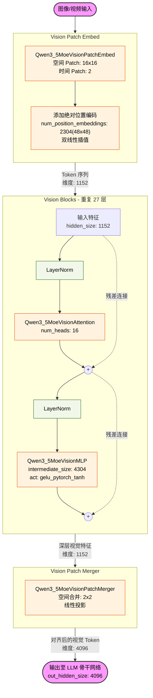
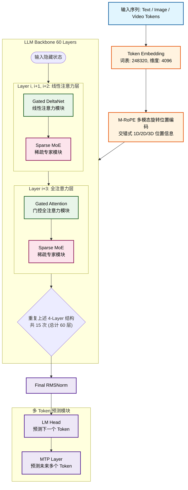
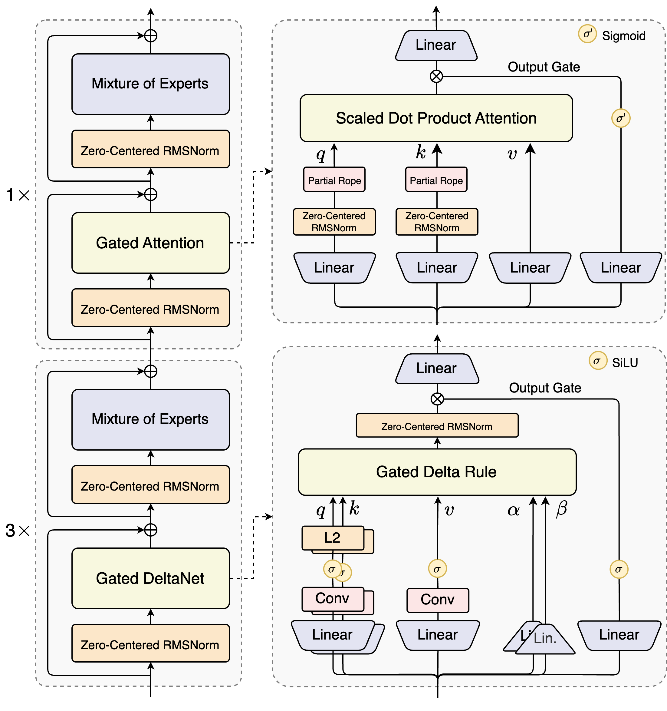

# 背景

2026年除夕，Qwen正式发布最新模型`Qwen3.5`，并推出`Qwen3.5`系列的第一款模型`Qwen3.5-397B-A17B`的开放权重版本。

截至目前，官方还没有发布具体的技术报告，仅从几个大概方向介绍了此模型的改进点。

原文博客链接：https://qwen.ai/blog?id=qwen3.5

## 预训练改进点

Qwen3.5 在能力、效率与通用性三个维度上推进预训练：

**能力（Power）**：在更大规模的视觉-文本语料上训练，并加强中英文、多语言、STEM 与推理数据，采用更严格的过滤，实现跨代持平：Qwen3.5-397B-A17B 与参数量超过 1T 的 Qwen3-Max-Base 表现相当。

**效率（Efficiency）**：基于 Qwen3-Next 架构——更高稀疏度的 MoE、Gated DeltaNet + Gated Attention 混合注意力、稳定性优化与多 token 预测。在 32k/256k 上下文长度下，Qwen3.5-397B-A17B 的解码吞吐量分别是 Qwen3-Max 的 8.6 倍/19.0 倍，且性能相当。Qwen3.5-397B-A17B 的解码吞吐量分别是 Qwen3-235B-A22B 的 3.5 倍/7.2 倍。

**通用性（Versatility）**：通过早期文本-视觉融合与扩展的视觉/STEM/视频数据实现原生多模态，在相近规模下优于 Qwen3-VL。多语言覆盖从 119 增至 201 种语言/方言；25 万词表（vs. 15 万）在多数语言上带来约 10–60% 的编码/解码效率提升。

# 模型架构

## 整体结构

Qwen3.5是原生多模态大模型，从模型架构上，可以看作是[Qwen3-VL](https://qwen.ai/blog?id=qwen3-vl)和[Qwen3-Next](https://qwen.ai/blog?id=qwen3-next)的结合。

整体结构由**视觉模型ViT+视觉转换器+语言模型LLM**组成。

### ViT模型架构

### LLM模型架构

## 重点模块

### 双线性插值的绝对位置编码

视觉模型（ViT）在处理不同分辨率的图像时，产生的 Patch 数量会发生变化。为了复用预训练好的固定尺寸绝对位置编码（例如 $48 \times 48$），模型采用**二维双线性插值（Bilinear Interpolation）**将位置编码动态缩放至当前图像的实际网格尺寸（$H \times W$）。

这样可以使模型灵活适应任意分辨率的视觉输入，而不会破坏空间位置信息的连续性。

### M-RoPE Interleaved

M-RoPE（Multimodal Rotary Positional Encoding）是对传统 RoPE 的多模态扩展，能够统一处理一维（文本）、二维（图像）和三维（视频）的位置信息。

*   **文本 (1D)**：使用标准的一维序列位置索引。
*   **图像 (2D)**：将位置索引解耦为高度（$h$）和宽度（$w$）。
*   **视频 (3D)**：解耦为时间（$t$）、高度（$h$）和宽度（$w$）。

**Interleaved（交错）**：在特征维度上，M-RoPE 将不同维度的旋转频率进行交错排列（例如将 $h$ 和 $w$ 的频率交替拼接），而不是简单的分块拼接。这使得模型在计算注意力时能更好地融合多维度的空间/时间相对位置关系。

详细原理参考[从 RoPE 到多模态 M-RoPE (Interleaved)](../../modules/rope/README.md)。

### Gated DeltaNet

DeltaNet 是一种高效的线性注意力/RNN 架构，用于替代标准注意力以降低长文本的计算复杂度（从 $O(N^2)$ 降至 $O(N)$）。在 Qwen3.5 中，每 4 层中有 3 层采用此架构。

其核心思想是通过数据依赖的门控机制（Data-dependent Gating）来更新隐状态 $S_t$：

$$ S_t = \alpha_t \odot S_{t-1} + \beta_t \odot (K_t^T V_t) $$
$$ O_t = Q_t S_t $$

**Gated（门控）**：在输出端引入了额外的门控分支（通常经过 SiLU 激活函数），即：
$$ \text{Output} = \text{SiLU}(\text{Gate}) \odot O_t $$
这大幅增强了线性注意力的表达能力，使其在保持线性复杂度的同时，性能逼近标准注意力。

### Gated Attention

在每 4 层 Transformer Block 中，第 4 层保留了标准的全局全注意力机制（Full Attention），以弥补线性注意力在精确信息召回（如“大海捞针”任务）上的不足。

与标准 Attention 不同，它在输出阶段同样引入了门控机制：

$$ O = \text{Softmax}\left(\frac{Q K^T}{\sqrt{d}}\right) V $$
$$ \text{Output} = \text{SiLU}(\text{Gate}) \odot O $$

这种设计与 Gated DeltaNet 保持了架构上的一致性，并通过门控机制更精细地控制全局信息的流入。

### Zero-Centered RMSNorm

传统的 RMSNorm 公式为 $y = \frac{x}{\text{RMS}(x)} \odot \gamma$，其中可学习参数 $\gamma$ 通常初始化为 $\vec{1}$。

Zero-Centered RMSNorm 将可学习参数 $w$ 初始化为 $\vec{0}$，公式变为：

$$ y = \frac{x}{\sqrt{\frac{1}{d} \sum_{i=1}^{d} x_i^2 + \epsilon}} \odot (1 + w) $$

**优势**：在模型初始化阶段（$w=0$），该层严格等价于纯粹的 RMS 归一化（无缩放偏移）。这种“零中心”设计使得残差分支在训练初期更加稳定，极大地帮助了超深层网络（如 60 层）的梯度传播和收敛。