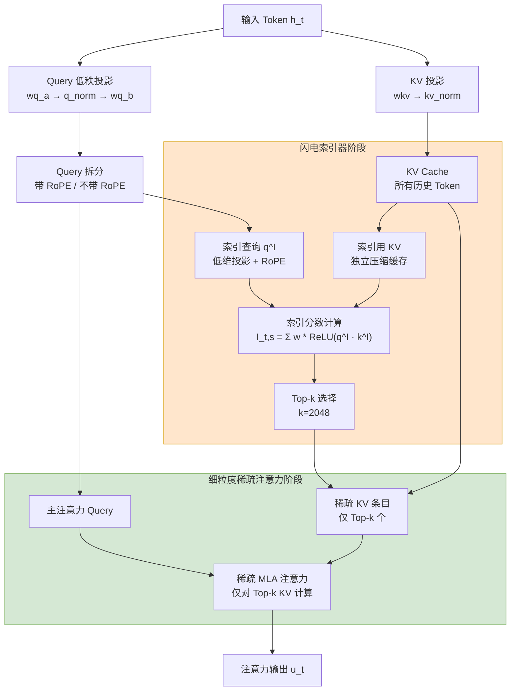
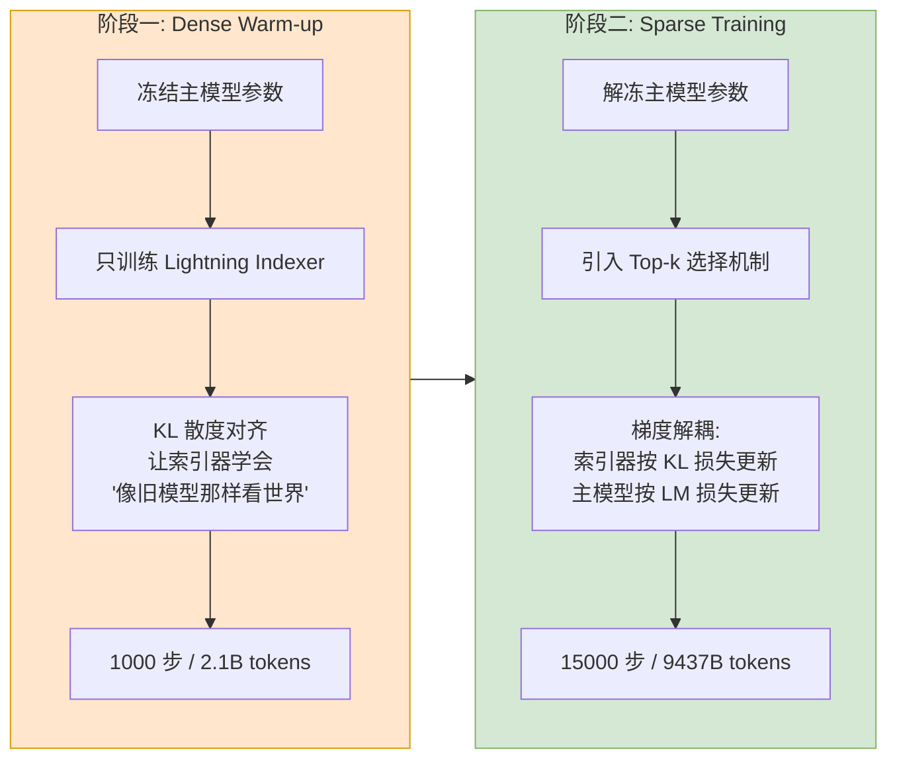
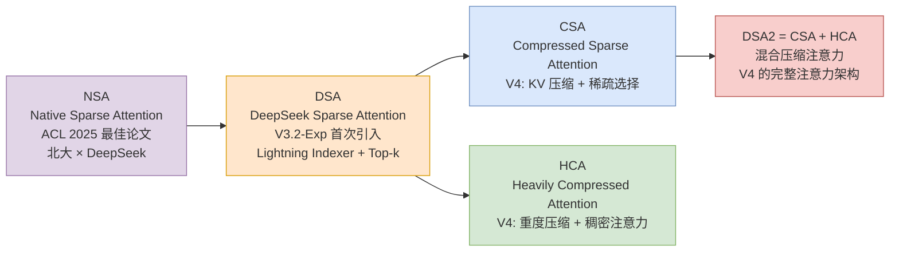

# DeepSeek Sparse Attention (DSA)：闪电索引与稀疏注意力

> **💡 核心总结 (TL;DR):**
> DSA（DeepSeek Sparse Attention）是 DeepSeek 自研的稀疏注意力机制，首次在 DeepSeek-V3.2-Exp 中引入。它通过 **闪电索引器（Lightning Indexer）** 以极低开销完成"海选"，再用 **细粒度 Token 选择（Fine-grained Token Selection）** 仅对 Top-k 个关键 KV 条目执行注意力计算，将复杂度从 O(L²) 降至 O(L×k)。

参考资料：
- [DeepSeek-V3.2 技术报告](./DeepSeek_V3_2.pdf)
- [NSA: Native Sparse Attention (ACL 2025 最佳论文)](https://arxiv.org/abs/2502.11089)

---

## 第一部分：为什么需要稀疏注意力？

### 1. 标准 Attention 的二次方困境

标准自注意力机制是 Transformer 的核心，但其计算和内存复杂度与序列长度 L 的平方 **O(L²)** 成正比。当上下文窗口从 8K 扩展到 128K 甚至 1M 时，这种二次方增长会导致：

- **计算量爆炸**：128K 序列的注意力计算量是 8K 的 256 倍
- **显存耗尽**：KV Cache 随序列长度线性增长，长序列下成为显存瓶颈
- **推理延迟过高**：每个新生成的 token 都需要与所有历史 token 计算注意力

更关键的是，这种低效不仅影响推理部署，还严重制约了后训练阶段（如强化学习）的计算扩展——你很难在超长序列上进行大规模 RL 训练。

### 2. 稀疏注意力的核心挑战

一个直观的想法是：既然不是所有 token 都同等重要，能否只对"重要"的 token 计算注意力？

但问题在于：**判断哪些 token 重要本身就需要进行某种形式的全局计算**。如果直接在主注意力的 score 上做 Top-k 筛选，O(L²) 的计算量已经完全花出去了，稀疏化带来的收益被前置计算抵消。

现有的稀疏注意力方案各有取舍：

| 方案 | 思路 | 优势 | 局限 |
|------|------|------|------|
| 滑动窗口注意力 | 只关注最近 W 个 token | 局部高效 | 丢失全局信息 |
| 块稀疏注意力 | 对 KV 分块，块级稀疏 | 减少计算量 | 粒度太粗，可能遗漏关键信息 |
| 可学习稀疏模式 | 学习哪些位置需要关注 | 灵活自适应 | 训练复杂，难以扩展 |
| 线性注意力 | 压缩 KV 为固定大小 | O(L) 复杂度 | 信息损失严重 |
| 低秩近似 | 用低秩矩阵近似注意力 | 理论优雅 | 实际效果受限 |

### 3. DSA 的核心思路：两级注意力架构

DSA 的解决思路是构建一个 **两级注意力架构**：

1. **第一级（海选）**：用一个极其轻量的网络来判断"哪些 token 值得关注"
2. **第二级（精算）**：只在被选中的少量 token 上执行昂贵的主注意力计算

关键洞察：**筛选网络不需要完美，只需要足够快且大致准确**。即使漏掉少量重要 token，主注意力的高精度计算也能弥补；而筛选网络的低开销确保了整体效率的提升。

---

## 第二部分：DSA 核心架构详解

### 1. 整体架构

DSA 基于 DeepSeek 系列的 MLA（Multi-head Latent Attention）架构实现，整体流程如下：



### 2. 闪电索引器（Lightning Indexer）

闪电索引器是 DSA 的"大脑"，负责以极低开销为每个 Query Token 快速筛选出最相关的 Top-k 个历史 Token。

#### 2.1 网络结构：刻意极简

索引器的网络结构被刻意设计得极简，以降低计算开销：

- **少头设计**：索引头数量（ `index_n_heads=64` ）远少于主注意力头数（ `n_heads=128` ），直接减少并行计算冗余
- **低维投影**：将 Query 和 Key 投影到极低维度（ `index_head_dim=128` ），使相似度计算异常高效
- **FP8/FP4 精度**：索引器的所有计算均可使用低精度实现，在保证索引分数准确性的前提下大幅降低计算和存储开销

#### 2.2 索引分数计算

对于每个 Query Token $h_t$ 和历史 Token $h_s$，索引器计算索引分数：

$$I_{t,s} = \sum_{j=1}^{H^I} w_{t,j}^I \cdot \text{ReLU}(q_{t,j}^I \cdot k_s^I)$$

其中：
- $q_{t,j}^I$：Query Token $t$ 在索引头 $j$ 上的低维投影向量
- $k_s^I$：历史 Token $s$ 的低维投影键向量
- $w_{t,j}^I$：可学习的头权重，由 `weights_proj` 生成，控制每个索引头的重要性
- $H^I$：索引头数量

**为什么选择 ReLU 而不是 Softmax？**

这是一个工程导向的决策：
- ReLU 只需一次简单的阈值操作，计算成本低
- ReLU 不需要全局归一化，天然适合并行化和低精度实现
- ReLU 对 FP8 量化友好，而 Softmax 的指数运算在低精度下容易溢出

#### 2.3 源码解读：Indexer（闪电索引器）

以下代码移除了量化相关逻辑，仅保留核心模型结构：

```python
class Indexer(torch.nn.Module):
    def __init__(self, args: ModelArgs):
        super().__init__()
        self.n_heads = args.index_n_heads          # 索引头数: 64
        self.head_dim = args.index_head_dim         # 索引头维度: 128
        self.rope_head_dim = args.qk_rope_head_dim  # RoPE 维度: 64
        self.index_topk = args.index_topk           # Top-k 值: 2048
        self.q_lora_rank = args.q_lora_rank         # Query 低秩维度

        # 索引查询投影: 复用 MLA 的低秩 Query 表示 qr
        self.wq_b = Linear(self.q_lora_rank, self.n_heads * self.head_dim)
        # 索引键投影: 独立于主 KV Cache 的低维键
        self.wk = Linear(self.dim, self.head_dim)
        self.k_norm = LayerNorm(self.head_dim)
        # 头权重: 控制每个索引头的重要性
        self.weights_proj = Linear(self.dim, self.n_heads)
        self.softmax_scale = self.head_dim ** -0.5

        # 索引键缓存 (独立于主 KV Cache)
        self.register_buffer("k_cache", torch.zeros(
            args.max_batch_size, args.max_seq_len, self.head_dim), persistent=False)

    def forward(self, x, qr, start_pos, freqs_cis, mask):
        bsz, seqlen, _ = x.size()
        end_pos = start_pos + seqlen

        # 1. 生成索引查询: 从低秩 Query 表示投影到索引头空间
        q = self.wq_b(qr)                                    # [B, S, n_heads * head_dim]
        q = q.view(bsz, seqlen, self.n_heads, self.head_dim)
        q_pe, q_nope = torch.split(q, [self.rope_head_dim, self.head_dim - self.rope_head_dim], dim=-1)
        q_pe = apply_rotary_emb(q_pe, freqs_cis, False)
        q = torch.cat([q_pe, q_nope], dim=-1)

        # 2. 生成索引键: 独立于主 KV Cache 的低维键投影
        k = self.wk(x)                                       # [B, S, head_dim]
        k = self.k_norm(k)
        k_pe, k_nope = torch.split(k, [self.rope_head_dim, self.head_dim - self.rope_head_dim], dim=-1)
        k_pe = apply_rotary_emb(k_pe.unsqueeze(2), freqs_cis, False).squeeze(2)
        k = torch.cat([k_pe, k_nope], dim=-1)

        # 3. 缓存索引键
        self.k_cache[:bsz, start_pos:end_pos] = k

        # 4. 计算头权重
        weights = self.weights_proj(x) * self.n_heads ** -0.5

        # 5. 计算索引分数: 多头点积 + ReLU + 加权求和
        index_score = torch.einsum("bshd,btd->bsht", q, self.k_cache[:bsz, :end_pos])
        index_score = (index_score.relu_() * weights.unsqueeze(-1)).sum(dim=2)

        # 6. Top-k 选择
        topk_indices = index_score.topk(min(self.index_topk, end_pos), dim=-1)[1]
        return topk_indices
```

**张量 Shape 追踪（索引分数计算）：**

```
q (索引查询): [B, S, n_heads, head_dim]           # [B, S, 64, 128]
k_cache (索引KV): [B, T, head_dim]                 # [B, T, 128]
  ↓ einsum("bshd,btd->bsht")
index_score: [B, S, n_heads, T]                    # [B, S, 64, T]
  ↓ ReLU × weights + sum(dim=2)
index_score: [B, S, T]                             # [B, S, T]
  ↓ topk(k=index_topk)
topk_indices: [B, S, index_topk]                   # [B, S, 2048]
```

#### 2.4 源码解读：MLA（多头像潜在注意力）与 Indexer 的协同

以下代码展示 Indexer 在 MLA 中的位置，移除了量化相关逻辑，仅保留核心模型结构。标注 ★ 的步骤为 DSA 新增的关键逻辑：

```python
class MLA(nn.Module):
    def __init__(self, args: ModelArgs):
        super().__init__()
        self.dim = args.dim
        self.n_heads = args.n_heads
        self.q_lora_rank = args.q_lora_rank
        self.kv_lora_rank = args.kv_lora_rank
        self.qk_nope_head_dim = args.qk_nope_head_dim
        self.qk_rope_head_dim = args.qk_rope_head_dim
        self.qk_head_dim = args.qk_nope_head_dim + args.qk_rope_head_dim
        self.v_head_dim = args.v_head_dim

        # Query 投影: 两级低秩压缩
        self.wq_a = Linear(self.dim, self.q_lora_rank)
        self.q_norm = RMSNorm(self.q_lora_rank)
        self.wq_b = ColumnParallelLinear(self.q_lora_rank, self.n_heads * self.qk_head_dim)

        # KV 投影: 低秩压缩 + RoPE 解耦
        self.wkv_a = Linear(self.dim, self.kv_lora_rank + self.qk_rope_head_dim)
        self.kv_norm = RMSNorm(self.kv_lora_rank)
        self.wkv_b = ColumnParallelLinear(self.kv_lora_rank, self.n_heads * (self.qk_nope_head_dim + self.v_head_dim))

        # 输出投影
        self.wo = RowParallelLinear(self.n_heads * self.v_head_dim, self.dim)
        self.softmax_scale = self.qk_head_dim ** -0.5

        # ★ 闪电索引器: DSA 的核心组件
        self.indexer = Indexer(args)

        # KV Cache
        self.register_buffer("kv_cache", torch.zeros(
            args.max_batch_size, args.max_seq_len, self.kv_lora_rank), persistent=False)
        self.register_buffer("pe_cache", torch.zeros(
            args.max_batch_size, args.max_seq_len, self.qk_rope_head_dim), persistent=False)

    def forward(self, x, start_pos, freqs_cis, mask):
        bsz, seqlen, _ = x.size()
        end_pos = start_pos + seqlen

        # 1. Query 投影
        qr = self.q_norm(self.wq_a(x))
        q = self.wq_b(qr)
        q = q.view(bsz, seqlen, self.n_local_heads, self.qk_head_dim)
        q_nope, q_pe = torch.split(q, [self.qk_nope_head_dim, self.qk_rope_head_dim], dim=-1)
        q_pe = apply_rotary_emb(q_pe, freqs_cis)

        # 2. KV 投影 + 缓存
        kv = self.wkv_a(x)
        kv, k_pe = torch.split(kv, [self.kv_lora_rank, self.qk_rope_head_dim], dim=-1)
        kv = self.kv_norm(kv)
        k_pe = apply_rotary_emb(k_pe.unsqueeze(2), freqs_cis)
        self.kv_cache[:bsz, start_pos:end_pos] = kv
        self.pe_cache[:bsz, start_pos:end_pos] = k_pe.squeeze(2)

        # ★ 3. 闪电索引器: 筛选 Top-k 关键 Token
        topk_indices = self.indexer(x, qr, start_pos, freqs_cis, mask)

        if mask is not None:    # MHA prefill
            q = torch.cat([q_nope, q_pe], dim=-1)
            kv = self.wkv_b(kv)
            kv = kv.view(bsz, seqlen, self.n_local_heads, self.qk_nope_head_dim + self.v_head_dim)
            k_nope, v = torch.split(kv, [self.qk_nope_head_dim, self.v_head_dim], dim=-1)
            k = torch.cat([k_nope, k_pe.expand(-1, -1, self.n_local_heads, -1)], dim=-1)

            # 4. 计算注意力分数
            scores = torch.einsum("bshd,bthd->bsht", q, k).mul_(self.softmax_scale)

            # ★ 5. 稀疏掩码: 仅保留 Top-k 位置的注意力
            index_mask = torch.full((bsz, seqlen, seqlen), float("-inf"), device=x.device)
            index_mask.scatter_(-1, topk_indices, 0)
            index_mask += mask
            scores += index_mask.unsqueeze(2)

            scores = scores.softmax(dim=-1)
            x = torch.einsum("bsht,bthd->bshd", scores, v)

        else:                   # MQA decode
            # 吸收 wkv_b 到 Query: q_nope @ wkv_b → 直接与 kv_cache 点积
            wkv_b = self.wkv_b.weight.view(self.n_local_heads, -1, self.kv_lora_rank)
            q_nope = torch.einsum("bshd,hdc->bshc", q_nope, wkv_b[:, :self.qk_nope_head_dim])
            scores = (torch.einsum("bshc,btc->bsht", q_nope, self.kv_cache[:bsz, :end_pos]) +
                      torch.einsum("bshr,btr->bsht", q_pe, self.pe_cache[:bsz, :end_pos])) * self.softmax_scale

            # ★ 5. 稀疏掩码: 仅保留 Top-k 位置的注意力
            index_mask = torch.full((bsz, 1, end_pos), float("-inf"), device=x.device)
            index_mask.scatter_(-1, topk_indices, 0)
            scores += index_mask.unsqueeze(2)

            scores = scores.softmax(dim=-1)
            x = torch.einsum("bsht,btc->bshc", scores, self.kv_cache[:bsz, :end_pos])
            x = torch.einsum("bshc,hdc->bshd", x, wkv_b[:, -self.v_head_dim:])

        x = self.wo(x.flatten(2))
        return x
```

**MLA 中 Indexer 的协同流程：**

```
输入 x ──→ wq_a → q_norm → wq_b ──→ q_nope, q_pe (主注意力 Query)
              │                         │
              └──→ qr (低秩表示) ──→ Indexer.wq_b ──→ q^I (索引查询)
                    │                                     │
输入 x ──→ wkv_a → kv_norm ──→ kv_cache (主 KV Cache)    │
              │                                             │
              └──→ Indexer.wk → k_norm ──→ k_cache (索引 KV Cache)
                                                    │
                              Indexer: q^I · k_cache → ReLU → 加权求和 → Top-k
                                                                      │
                                                              topk_indices
                                                                      │
                              ┌───────────────────────────────────────┘
                              ↓
                    index_mask: 非 Top-k 位置设为 -inf
                              ↓
                    scores += index_mask → softmax → 稀疏注意力输出
```

**关键设计要点：**

- **Indexer 复用 MLA 的 `qr`**：索引查询直接从 MLA 的低秩 Query 表示 `qr` 投影而来，无需重复计算 `wq_a` + `q_norm`，节省了索引器的参数量和计算量
- **Indexer 拥有独立的 KV 缓存**：索引键通过 `self.wk` + `self.k_norm` 独立投影并缓存，与主 KV Cache 完全解耦，避免了对主注意力计算的干扰
- **稀疏掩码机制**：Indexer 返回的 `topk_indices` 被转换为掩码（非 Top-k 位置设为 `-inf`），直接加到注意力分数上，经过 softmax 后这些位置的权重趋近于零，实现了稀疏注意力

### 3. 细粒度稀疏注意力（Fine-grained Sparse Attention）

基于索引器输出的分数，Token 选择机制仅保留 Top-k 索引分数对应的 KV 条目，再通过 MLA 注意力机制计算最终输出：

$$u_t = \text{Attention}(q_t, \{c_s : s \in \text{Top-k}(I_{t,\cdot})\})$$

**复杂度降低**：核心注意力的计算复杂度从 O(L²) 降至 O(L×k)，其中 k 远小于 L。在 V3.2 的训练中，k=2048；在 V4 中，CSA 层 k=512/1024。即使处理 128K 长度的文本，每个 Query Token 也只需与 2048 个最相似的 Token 计算注意力。

### 4. 与 MLA 架构的协同设计

DSA 直接基于 MLA 的 **MQA（Multi-Query Attention）模式** 实现，而非 MHA 模式。这一设计决策的关键优势：

- **计算共享**：每个潜在向量在所有查询头之间共享，使稀疏选择后的 KV 条目可以被多个头复用
- **内存效率**：MQA 模式下 KV Cache 显著减小，与稀疏选择进一步叠加降低访存
- **硬件友好**：在 kernel 级别，每个 KV Entry 必须能被多个 Query 重复利用，MQA 的结构天然符合这种访存模式
- **训练稳定性**：支持从已有检查点的平滑继续训练

### 5. 两阶段继续预训练策略

V3.2 并非从零开始训练，而是在 V3.1-Terminus 的 128K 上下文检查点基础上继续训练。如何让已适应密集注意力的模型平滑过渡到稀疏模式？



**阶段一：Dense Warm-up**

冻结主模型参数，只训练索引器。对于每个 Query Token，计算原始多头注意力在所有历史 Token 上的 score 分布，然后用 KL 散度让索引器的输出逼近这个分布：

$$\mathcal{L}_{\text{indexer}} = D_{\text{KL}}(P_{\text{attn}} \| P_{\text{indexer}})$$

这个阶段用学习率训练 1000 步，总计约 2.1B tokens。本质上是让索引器先学会"像旧模型那样看世界"。

**阶段二：Sparse Training**

引入 Top-k 选择机制，解冻主模型参数，让主模型和索引器同时更新。关键设计是 **梯度解耦**：

- 索引器的输入从计算图中 `detach`，主模型只根据语言建模损失反向传播
- 索引器只根据 KL 损失更新
- 这避免了"索引器改了导致主模型改变，主模型改变又导致索引器需要重新适配"的恶性循环

---

## 第三部分：DSA 的后续演进——从 V3.2 到 V4

在 DeepSeek-V4 中，DSA 进一步演化为 **CSA + HCA 混合压缩注意力架构（DSA2）**，核心思路是在 DSA 的 Lightning Indexer 之前增加 **KV 压缩**，并将不同层配置为不同的压缩策略交替互补：

| 特性 | CSA (Compressed Sparse Attention) | HCA (Heavily Compressed Attention) |
|------|-----|-----|
| 压缩率 | m=4 | m'=128 |
| 注意力方式 | 稀疏（Lightning Indexer + Top-k） | 稠密 |
| 信息粒度 | 较细（中距离依赖） | 较粗（远距离全局上下文） |

两者都额外保留最近 128 个未压缩 KV 条目（滑动窗口）作为局部保底。V4 各层按 `SW → SW → CSA → HCA → CSA → HCA → ...` 交替排列，形成从局部到全局的完整信息通路。在 1M token 上下文下，V4-Pro 仅需 V3.2 的 27% 推理 FLOPs 和 10% KV Cache。

> 关于 CSA/HCA 的 KV 压缩机制（Compressor）、重叠压缩、混合精度存储等详细源码解读，可参考 [DeepSeek-V4 技术报告](https://huggingface.co/deepseek-ai/DeepSeek-V4-Pro/blob/main/DeepSeek_V4.pdf)。

---

## 第四部分：实验结果与效果分析

### 1. V3.2-Exp：DSA 的首次验证

在严格控制激活参数和计算量的情况下，DSA 在几乎不影响模型性能的前提下实现了大幅效率提升：

| 指标 | V3.1-Terminus | V3.2-Exp (DSA) | 变化 |
|------|---------------|----------------|------|
| MMLU-Pro | 85.0 | 85.0 | 持平 |
| AIME 2025 | 88.4 | 89.3 | +0.9 |
| Codeforces | 2046 | 2121 | +75 |
| BrowseComp | 38.5 | 40.1 | +1.6 |
| 长文本推理成本 | 基准 | 降低 50%+ | 显著下降 |

**关键发现**：DSA 不仅提高了效率，在某些场景下（如数学推理、编程竞赛、浏览器操作）还增强了模型能力。这表明稀疏注意力可能起到了类似正则化的效果，过滤了噪声信息。

### 2. 为什么稀疏注意力有时反而更好？

- **噪声过滤**：并非所有历史 Token 都对当前预测有用，稀疏选择天然过滤了不相关的噪声
- **注意力释放**：通过将不重要的 Token 排除在外，模型可以更专注地处理关键信息
- **等效增加深度**：LogitLens 和 CKA 分析表明，稀疏注意力使模型在较浅的层就能完成特征组合，相当于增加了用于复杂推理的"有效深度"

---

## 第五部分：从 NSA 到 DSA 到 DSA2 的技术谱系



- **NSA**（Native Sparse Attention）：ACL 2025 最佳论文，提出了原生稀疏注意力的理论框架，是 DSA 的学术前身
- **DSA**（DeepSeek Sparse Attention）：NSA 的工程化实现，首次在 V3.2-Exp 中落地，引入 Lightning Indexer
- **DSA2** = CSA + HCA：V4 中的完整注意力架构，在 DSA 基础上增加了 KV 压缩机制和混合策略

---

## 📝 总结

DSA 的核心思想是 **用轻量筛选换计算效率**。通过 Lightning Indexer 做"海选"、细粒度 Top-k 选择做"精算"，DSA 将注意力复杂度从 O(L²) 降至 O(L×k)，同时通过两阶段训练策略确保了从密集注意力到稀疏注意力的平滑过渡。

在 V3.2-Exp 上的实验验证了这一思路的可行性：DSA 在几乎不影响模型性能的前提下，将长文本推理成本降低 50% 以上，甚至在部分任务上带来了性能提升。在 V4 中，DSA 进一步与 KV 压缩机制结合，演化为 CSA + HCA 混合架构，使百万 Token 上下文成为现实。
