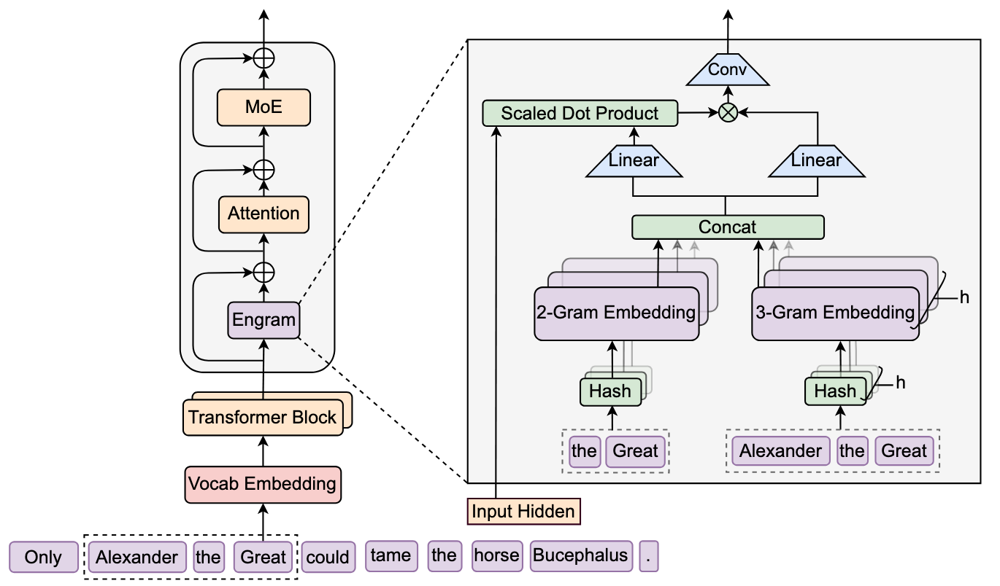

# Conditional Memory via Scalable Lookup (Engram)

> **💡 核心总结 (TL;DR):** 
> 本文介绍了一种全新的大型语言模型稀疏性维度——**条件记忆 (Conditional Memory)**，并通过 **Engram** 模块将其具象化。它将经典的 N-gram 嵌入现代化，通过 O(1) 复杂度的常数时间哈希查找来检索静态知识，从而将 Transformer 骨干网络从低效的静态模式重建中解放出来，显著提升了模型在推理、代码和长上下文任务中的表现。

## 🌟 简介 (Introduction)

当前的 LLM 主要依赖混合专家 (MoE) 架构通过“条件计算”来扩展模型容量。然而，Transformer 缺乏原生的知识查找机制，被迫通过深层计算来模拟检索（例如解析一个常见的实体需要消耗多层 Attention 和 FFN）。Engram 提出了一种结构上的优化：将静态、局部的依赖关系（如实体、固定搭配）交由外部的 N-gram 记忆表进行查找，而将宝贵的计算深度留给复杂的组合推理。

## 📚 背景知识 (Background Knowledge)

- **MoE (Mixture-of-Experts)**: 通过条件计算扩展模型容量，每个 token 只激活部分专家网络，从而在不增加计算成本的情况下增加模型参数。
- **N-gram 模型与“快捷字典”**: 
  - **传统概念**：N-gram 是一种经典的语言模型思想，认为“下一个词出现的概率，只依赖于它前面的 N-1 个词”（例如看到“机器”，就容易联想到“学习”）。
  - **Engram 中的应用**：在 Engram 架构中，N-gram 被具象化为一个巨大的 **“可训练的快捷查找字典”** 。这个字典不是外部导入的，而是**随着大模型一起从头训练（End-to-End）出来的**。在模型阅读海量语料的过程中，它会把那些死记硬背的固定搭配（如专有名词、事实知识）的向量表示，记录在这个字典里。
- **计算与记忆的解耦**: 语言建模本质上包含两个不同性质的子任务——组合推理（需要深度动态计算）和知识检索（适合静态查找）。现在的 Transformer 为了弄清楚“New”后面跟着“York”这种静态知识，需要经过几十层复杂的神经网络计算，这是一种算力浪费。Engram 的目的就是把这种“查字典”的工作剥离出来。

## 🏗️ 架构与方法论 (Architecture / Methodology)

Engram 模块作为一个即插即用的组件，插入到 Transformer 的特定层中。它包含两个主要阶段：

1. **基于哈希的稀疏检索 (Sparse Retrieval via Hashed N-grams)**:
  - **分词与提取**: 对输入的 token 进行压缩，并提取以当前词结尾的局部 N-gram 组合（例如提取 1-gram 到 3-gram）。
  - **哈希查表 (Hash to Index)**: 计算机无法直接用文本查表。Engram 会将提取出的 N-gram 数组（如 `[205, 308]`）输入到固定的哈希函数（Hash）中，计算出一个巨大的整数，然后对 Embedding Table 的大小进行**取模（求余数）**，得到一个具体的 Index（例如第 54321 行），最后直接去这个 Index 对应的“抽屉”里取出静态记忆向量。
2. **上下文感知门控 (Context-aware Gating)**:
  - **直面哈希冲突**: 由于可能的 N-gram 组合是天文数字，必然会出现两个完全不同的语义（如“人工智能”和“吃苹果”）算出了相同的 Index，这就是**哈希冲突**。
  - **动态过滤噪声**: Engram 并不强求构建一个完美的无冲突字典。它将检索到的静态嵌入作为 Key 和 Value，用当前层的动态隐藏状态（包含当前语境的 Query）去计算点积匹配度。如果取出的记忆是因为冲突产生的噪声（语义不搭），门控权重会接近 0，从而**动态屏蔽掉错误信息**；如果语义匹配，门控打开，吸收记忆。最后通过一个轻量级的 1D 卷积扩展感受野。




*(Engram 架构流程图：展示了从输入到检索，再到与动态隐藏状态融合的全过程)*

## 💡 深入原理解析：Engram 到底是如何工作的？ (Deep Dive)

我们通过三个核心问题来详细拆解 Engram 的工作原理：

### 1. 这个 N-gram 字典从哪来？是外部导入的吗？

**答案是：不是外部导入的，而是跟着大模型一起从头训练（End-to-End Training）出来的。**

### 2. 查表实战：一句话如何通过 Hash 找到对应的记忆？

假设模型正在阅读这句话：**“人工智能改变世界”**，当前读到了 **“改变”** 。

- **第一步：分词 (Tokenization)**。计算机不认识汉字，文本首先被切分为 Token ID。假设“智能”的 ID 是 205，“改变”的 ID 是 308。
- **第二步：提取 N-gram**。Engram 不会把整句话混在一起，而是提取以当前词结尾的局部组合，例如提取 2-gram 为 `[205, 308]`。
- **第三步：哈希与取模 (Hash & Modulo)**。将 `[205, 308]` 这个数组输入到一个固定的哈希函数中（你可以把它想象成一个“数字搅拌机”）。在 Engram 的具体实现中，采用的是一种轻量级的**乘法-异或哈希 (multiplicative-XOR hash)**。它会吐出一个巨大的整数（假设为 987654321）。为了把这个巨大的数字映射到固定大小的字典中，系统会对其**求余数（取模）**：`987654321 % M = Index`。这里的 `M` 就是 Embedding Table 的大小（行数）。
- **第四步：查表 (Lookup)**。模型瞬间定位到字典的第 Index 行，把里面存的静态记忆向量（Embedding）拿出来。

### 💡 补充：Embedding 表的大小 (M) 与拼接逻辑 (Concatenation)
在论文中，Embedding 表并不是一个单一的巨大表格，而是由多个独立的子表（Sub-tables）拼接而成的。具体设计如下：
1. **参数预算分配**：在控制总参数量和计算量不变的前提下，论文发现了一个 **U型缩放定律**。最佳的分配策略是：把原本用于 MoE（混合专家）的空闲参数预算，抽出大约 **20% - 25%** 分配给 Engram 的静态记忆表。
2. **独立子表与素数优化**：为了在哈希取模时最大程度地减少哈希冲突，不同的 N-gram 阶数 ($n$) 和不同的哈希头 ($k$) 都拥有自己**完全独立**的 Embedding 子表 $E_{n,k}$。每个子表的行数 $M_{n,k}$ 会被严格设定为一个**独一无二的素数 (Prime Number)**。
3. **拼接成总记忆 (Concat)**：当模型进行查表时，它会并行地去所有的子表 $E_{n,k}$ 中查出对应的向量片段 $e_{t,n,k}$。然后，模型将这些片段**首尾相接（Concatenate）**，拼成一个超长的总记忆向量 $e_t$。
   - **公式表示**：
     $$e_t \triangleq \big\Vert_{n=2}^{N} \big\Vert_{k=1}^{K} e_{t,n,k}$$
   - **总参数量** = 所有独立子表参数量的总和，即 $\sum_{n} \sum_{k} (M_{n,k} \times d_{mem})$。

### 3. 词汇那么多，发生“哈希冲突”怎么办？

世界上可能的 N-gram 组合是天文数字，必然会出现两个完全不相干的词组（比如“人工智能”和“吃苹果”）算出了相同的余数（如 54321），这就是**哈希冲突**。如果直接使用，就会引入严重的噪声。Engram 并不强求构建一个完美的无冲突字典（那会消耗极其庞大的内存），而是用两招优雅地化解了这个问题：

- **第一招：多头哈希 (Multi-Head Hashing)**。Engram 准备了多个不同的哈希函数（多个搅拌机）。同一个词组会算出多个不同的 Index，去字典里拿出多个候选记忆。这相当于“把鸡蛋放在多个篮子里”，极大地分散了单点冲突的风险。
- **第二招：上下文感知门控 (Context-aware Gating)**。这是最精妙的一步。模型会拿当前的**动态隐藏状态（Query，包含了当前正在聊“科技”的语境）**，去和取出的**静态记忆（Key）计算点积匹配度。如果取出的记忆是因为冲突混入的“吃苹果”的信息，两者语义完全不搭，门控开关就会关闭（权重趋近于 0）**，直接把噪声过滤掉；如果语义匹配，门控打开，顺利吸收记忆。

## 💻 核心功能与概念 (Key Features / Core Concepts)

- **分词器压缩 (Tokenizer Compression)**: 将语义相同但 ID 不同的 token（如 `Apple` 和  `apple`）映射到规范的 ID，提高语义密度，减少词表冗余。
- **多头哈希 (Multi-Head Hashing)**: 为了应对哈希冲突，Engram 准备了多个独立的“哈希搅拌机”（哈希头）。同一个 N-gram 会算出多个不同的 Index，去素数大小的嵌入表中取出多个候选记忆。这相当于“把鸡蛋放在多个篮子里”，分散了单点冲突的风险。
- **上下文感知门控 (Context-aware Gating)**: 承认哈希冲突必然存在，但不去强行构建完美的无冲突字典（那会消耗极其庞大的内存）。利用 Attention 机制的思想，通过当前隐藏状态动态过滤掉因哈希冲突或一词多义带来的静态记忆噪声，确保检索内容与当前语境的语义对齐。
- **系统级解耦 (System-level Decoupling)**: 确定性的哈希寻址使得 Engram 可以在推理时从主机内存 (Host RAM) 异步预取嵌入，实现通信与计算的重叠，几乎不增加推理延迟。

## 🔬 实验设置 (Experimental Setup)

- **模型配置**: 训练了 Dense-4B, MoE-27B (基线), Engram-27B (与 MoE-27B 具有相同的激活参数 3.8B 和总参数 26.7B), 以及 Engram-40B。
- **训练数据**: 262B tokens 的预训练语料，采用 DeepSeek-V3 的分词器。
- **评估基准**: 涵盖语言建模、知识与推理 (MMLU, BBH 等)、阅读理解、代码与数学 (HumanEval, MATH 等) 以及长上下文评估 (LongPPL, RULER)。

## 📊 实验结果 (Experimental Results)

- **全面超越基线**: 在严格控制激活参数和计算量的情况下，Engram-27B 全面超越了 MoE-27B。不仅在知识密集型任务上（如 MMLU 提升 3.4%），在通用推理（BBH 提升 5.0%）和代码数学（HumanEval 提升 3.0%）上提升更为显著。
- **长上下文能力跃升**: 在 RULER 基准测试中，Engram-27B 在多查询 NIAH 任务上达到 97.0%（基线 84.2%），变量追踪任务达到 89.0%（基线 77.0%）。

## 📈 效果分析 (Effectiveness Analysis)

- **等效于增加模型深度**: LogitLens 和 CKA 分析表明，Engram 使得模型在较浅的层就能完成特征组合，相当于替骨干网络承担了早期层的静态重建工作，从而增加了用于复杂推理的“有效深度”。
- **释放注意力容量**: 通过将局部依赖（N-gram 模式）卸载给查找表，Transformer 的注意力机制得以释放，可以更专注地处理全局长程上下文。
- **系统开销极低**: 即使将 100B 参数的 Engram 表卸载到 CPU 内存，由于异步预取机制，端到端推理吞吐量下降不到 3%。

## 🔍 关键源码解读 (Key Source Code Walkthrough)

在 `engram_demo_v1.py` 中，学术理论被巧妙地转化为了高效的 PyTorch 工程代码。以下是几个核心模块的实现细节：

### 1. 动态素数分配 (`NgramHashMapping`)
为了保证每个哈希头对应的字典大小都是不重复的素数，代码在初始化时动态计算了 `vocab_size_across_layers`：
- **读取配置**：依赖 `engram_vocab_size`（如 `[129280*5, 129280*5]`，定义 2-gram 和 3-gram 的基础预算）和 `n_head_per_ngram`（哈希头数量，如 8）。
- **与层数 (Layer) 的关系**：在 `calculate_vocab_size_across_layers` 源码中，最外层循环是 `for layer_id in self.layer_ids`。这意味着**不同 Transformer 层里的 Engram 模块，其底层的哈希表大小也是完全不同的素数**。这种设计确保了不同层学到的静态记忆分布是相互正交、互不干扰的。
- **寻找不重复素数**：使用 `find_next_prime` 函数，从基础预算大小开始向后寻找素数。为了防止不同哈希头产生相同的分布，代码维护了一个**全局的** `seen_primes` 集合。每找到一个素数就加入集合，下一个哈希头（甚至下一层）会从这个素数继续往后找，确保了跨层、跨阶数、跨哈希头的所有子表大小 $M_{n,k}$ 都是独一无二的。

### 2. 大表合并与偏移量寻址 (`MultiHeadEmbedding`)
理论上每个哈希头都有独立的子表，但在 PyTorch 中创建几十个细碎的 `nn.Embedding` 会导致严重的性能下降（Kernel 启动开销大）。
- **合并大表**：代码将**当前层**所有素数大小的子表在逻辑上合并成了**唯一一个**巨大的 `nn.Embedding`。需要注意的是，**不同层的 Engram 模块拥有各自独立的 `MultiHeadEmbedding` 实例**。也就是说，第 1 层和第 15 层的 Embedding 参数是完全物理隔离、分别训练的，它们各自维护着自己层内的那张大表。
- **`offsets` 寻址**：在当前层的大表内部，预先计算一个累加的 `offsets` 数组（例如 `[0, 素数A, 素数A+素数B, ...]`）。查表时，只需将计算出的哈希 ID 加上对应的 `offset` (`shifted_input_ids = input_ids + self.offsets`)，就能一次性从当前层的大表中并行取出所有需要的向量片段。

### 3. 前向传播与拼接 (Forward & Concat)
以下是 `Engram` 模块前向传播的核心逻辑，展示了静态记忆如何被检索并与动态隐藏状态融合：

```python
class Engram(nn.Module):
    def forward(self, hidden_states, input_ids):
        """
        hidden_states: [B, L, HC_MULT, D] - 当前层的多分支动态隐藏状态
        input_ids: [B, L] - 输入的 token IDs
        """
        # 1. 确定性哈希查找 (Retrieval)
        # hash_input_ids 形状: [B, L, num_heads_total]
        # 这里的 num_heads_total 包含了所有 N-gram 阶数 (n) 和所有哈希头 (k) 的总数量
        hash_input_ids = torch.from_numpy(self.hash_mapping.hash(input_ids)[self.layer_id])
        
        # 从多头嵌入表中获取静态记忆并展平 (Concatenation 的代码实现)
        # self.multi_head_embedding 会并行地去各个独立的素数大小的子表中查出向量片段
        # 查出的原始形状可能是: [B, L, num_heads_total, d_mem_per_head]
        # .flatten(start_dim=-2) 操作将最后两个维度展平，实现了将所有片段首尾相接 (Concat)
        # 最终拼接后的 embeddings 形状: [B, L, engram_hidden_size]
        embeddings = self.multi_head_embedding(hash_input_ids).flatten(start_dim=-2)
        
        gates = []
        # 2. 上下文感知门控 (Context-aware Gating) - 针对多分支架构
        for hc_idx in range(backbone_config.hc_mult):
            # 将静态记忆投影为 Key: [B, L, D]
            key = self.key_projs[hc_idx](embeddings)
            normed_key = self.norm1[hc_idx](key)
            
            # 提取当前分支的隐藏状态作为 Query: [B, L, D]
            query = hidden_states[:,:,hc_idx,:]
            normed_query = self.norm2[hc_idx](query)
            
            # 计算点积并缩放: [B, L]
            gate = (normed_key * normed_query).sum(dim=-1) / math.sqrt(backbone_config.hidden_size)
            
            # 激活函数生成门控标量: [B, L, 1]
            gate = gate.abs().clamp_min(1e-6).sqrt() * gate.sign()
            gate = gate.sigmoid().unsqueeze(-1)
            gates.append(gate)
            
        # gates 形状: [B, L, HC_MULT, 1]
        gates = torch.stack(gates, dim=2)
        
        # 将静态记忆投影为 Value，并应用门控: [B, L, HC_MULT, D]
        value = gates * self.value_proj(embeddings).unsqueeze(2)
        
        # 3. 短卷积增强 (Short Conv)
        # output 形状: [B, L, HC_MULT, D]
        output = value + self.short_conv(value)
        
        return output 
```

## 📝 总结 (Conclusion)

Engram 提出了一种优雅的软硬件协同设计方案。它证明了“条件记忆”可以作为“条件计算”的完美补充。通过将语言中固有的静态模式剥离并用 O(1) 的查找表解决，模型不仅在知识检索上表现更好，更重要的是释放了计算资源用于深度推理和长文本理解。这种确定性寻址的稀疏架构，为突破 GPU 显存限制、构建下一代超大规模稀疏模型指明了方向。