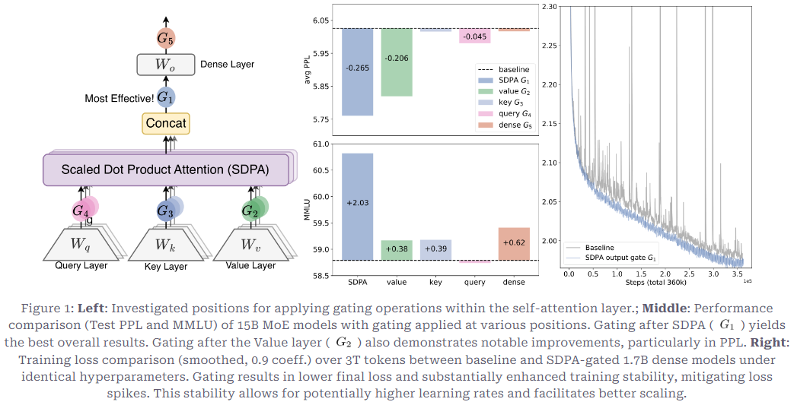
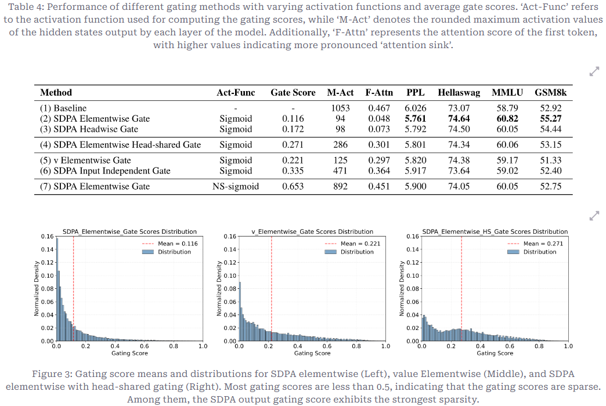
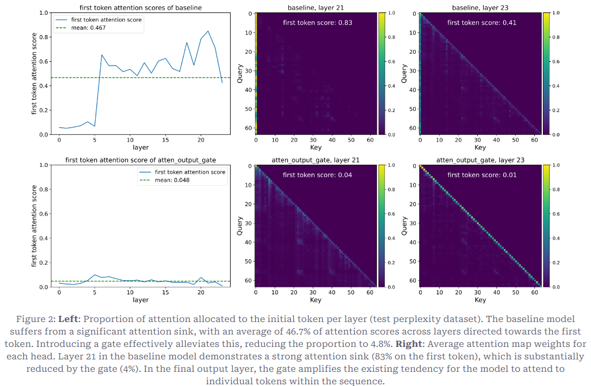

# NeurIPS 2025：阿里Qwen门控注意力获最佳论文

研究核心发现，在**缩放点积注意力（SDPA）后应用特定于注意力头的sigmoid门控**能持续提升模型性能，同时增强训练稳定性、容忍更大学习率并改善缩放特性。

参考资料：
- [NeurIPS 最佳论文：Qwen 门控注意力Gated Attention](https://zhuanlan.zhihu.com/p/1978860775281009311)

## 实验设置与结论



### 实验设置

1. **位置** (Positions)

- Q
- K
- V
- SDPA结果
- Wo输出

2. **粒度** (Granularity)

- Headwise (头部级): 一个 Head 只有一个标量门控值（Scalar）。全开或全关，太粗糙。
- Elementwise (元素级): 一个 Head 的输出向量中，每一个维度都有独立的门控值。比如 Head 维度是 128，就有 128 个开关。这允许模型进行极细粒度的特征筛选。（这是最佳方案）。

3. **头部参数共享**

- Head-Specific: 每个 Attention Head 拥有自己独立的门控参数。这意味着每个 Head 可以学习不同的过滤逻辑。
- Head-Shared: 所有 Head 共用同一套门控参数。

4. **作用方式** 

- 乘法门控 (Multiplicative):类似于“阀门”或“过滤器”，可以完全把信号置零。
- 加法门控 (Additive): 这更像是一种残差补充，而不是过滤。

5. **激活函数** 

- Sigmoid: 输出范围 [0,1]。非常适合乘法门控，具有明确的“开/关”物理意义。
- SiLU: 无上界。通常用于加法门控。

### 实验结论

- 位置： G1 (SDPA Output)
- 粒度： Elementwise
- 共享： Head-Specific
- 方式： Multiplicative
- 激活： Sigmoid

## 理论分析

### 非线性：给线性的SDPA计算插入了非线性


添加非线性后，PPL下降，其他指标上升。

### 稀疏性：门控呈现出稀疏特点，稀疏性特征决定模型效果



左侧图片效果最好，呈现出最高的稀疏性。

### 减少 Massive Activation 和 Attention-Sink



能同时显著降低首 Token 的注意力分配占比（Attention-Sink）、减少模型Massive Activation。

### 助力上下文长度扩展

1. 32k 训练上下文范围内，注意力沉没对长上下文性能无显著负面影响
2. YaRN 扩展至 128k 后，所有模型均出现 32k 区间性能下降，但门控模型降幅更小
3. 超训练范围的超长上下文，如64k、128k，门控模型性能优势显著

## 源码解读

以下是 `Qwen3.5` 中 `GatedAttention` 的核心实现源码，展示了如何在 Attention 层中引入门控机制：

```python
class Qwen3_5MoeAttention(nn.Module):
    def __init__(self, config: Qwen3_5MoeConfig, layer_idx: int):
        super().__init__()
        # ... 省略其他初始化代码 ...
        
        self.head_dim = getattr(config, "head_dim", config.hidden_size // config.num_attention_heads)
        
        # 【关键改动1】：q_proj 的输出维度被放大了 2 倍 (self.head_dim * 2)
        # 一半用于常规的 Query 向量，另一半用于生成 Gate (门控) 向量
        self.q_proj = nn.Linear(
            config.hidden_size, config.num_attention_heads * self.head_dim * 2, bias=config.attention_bias
        )
        
        # ... 省略 k_proj, v_proj, o_proj 等常规代码 ...

    def forward(
        self,
        hidden_states: torch.Tensor,
        # ... 省略其余参数 ...
    ) -> tuple[torch.Tensor, torch.Tensor | None]:
        input_shape = hidden_states.shape[:-1]
        hidden_shape = (*input_shape, -1, self.head_dim)

        # 【关键改动2】：通过 q_proj 计算后，使用 torch.chunk 在最后一个维度上将其一分为二
        # query_states 用于后续的注意力计算，gate 留存用于最后调节输出
        query_states, gate = torch.chunk(
            self.q_proj(hidden_states).view(*input_shape, -1, self.head_dim * 2), 2, dim=-1
        )
        gate = gate.reshape(*input_shape, -1)

        # 正常的 Query Norm 和形状变换
        query_states = self.q_norm(query_states.view(hidden_shape)).transpose(1, 2)
        key_states = self.k_norm(self.k_proj(hidden_states).view(hidden_shape)).transpose(1, 2)
        value_states = self.v_proj(hidden_states).view(hidden_shape).transpose(1, 2)

        # ... 省略 RoPE 位置编码、KV Cache 更新等标准过程 ...

        # 执行正常的注意力分数计算 (SDPA)，得到未经过门控的注意力输出 attn_output
        attn_output, attn_weights = attention_interface(
            self,
            query_states,
            key_states,
            value_states,
            # ... 省略参数 ...
        )

        attn_output = attn_output.reshape(*input_shape, -1).contiguous()
        
        # 【关键改动3】：将 gate 经过 Sigmoid 激活后，与 Attention 输出做逐元素乘法 (Elementwise Multiplicative)
        # 完全符合论文结论：G1 位置 (SDPA Output)、Elementwise 粒度、Multiplicative 方式、Sigmoid 激活
        attn_output = attn_output * torch.sigmoid(gate)

        # 最后经过输出投影
        attn_output = self.o_proj(attn_output)
        return attn_output, attn_weights
```